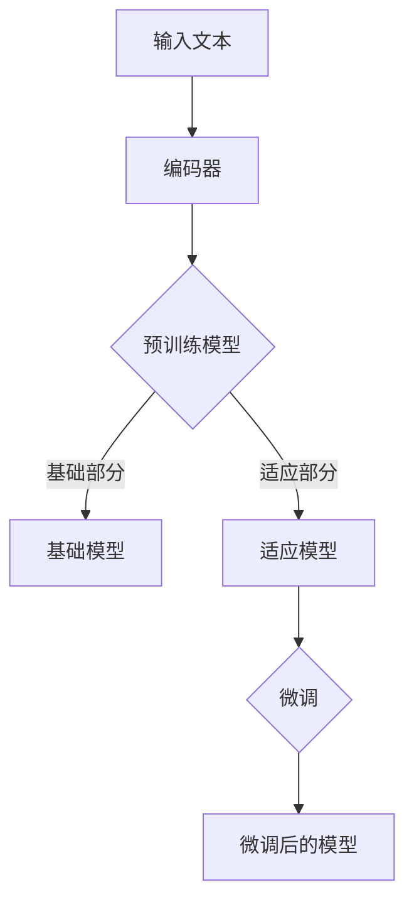

                 

关键词：大规模语言模型，LoRA，预训练，微调，文本生成，自然语言处理，模型压缩，内存优化

> 摘要：本文旨在深入探讨大规模语言模型（LLM）的发展历程，重点介绍LoRA（Low-rank Adaptation of Pre-trained Language Models）这一创新性的模型压缩技术。文章从背景介绍、核心概念与联系、核心算法原理与具体操作步骤、数学模型与公式、项目实践、实际应用场景、未来应用展望、工具和资源推荐以及总结等方面展开，全面解析LoRA技术，为研究人员和实践者提供有价值的参考。

## 1. 背景介绍

随着深度学习技术的迅猛发展，自然语言处理（NLP）领域取得了显著进展。大规模语言模型（LLM）如GPT-3、BERT等，通过预训练和微调技术，在文本生成、问答系统、机器翻译、情感分析等任务上表现出色。然而，这些模型通常具有数亿甚至数十亿个参数，导致模型存储和推理时消耗大量计算资源和内存，这在实际应用中带来了诸多挑战。

为了解决上述问题，研究人员提出了多种模型压缩技术，如剪枝（Pruning）、量化（Quantization）、知识蒸馏（Knowledge Distillation）等。其中，LoRA（Low-rank Adaptation of Pre-trained Language Models）是一种新颖且高效的模型压缩技术，通过低秩分解对预训练模型进行适应性调整，显著降低了模型存储和推理所需的资源。

## 2. 核心概念与联系

### 2.1 大规模语言模型

大规模语言模型是一种基于深度学习的自然语言处理模型，具有数十亿甚至数千亿个参数。这些模型通过预训练在大规模语料库上学习语言知识，然后通过微调适应特定任务，如文本生成、问答系统等。

### 2.2 模型压缩技术

模型压缩技术旨在减小模型的大小，降低存储和推理的资源消耗。常见的模型压缩技术包括剪枝、量化、知识蒸馏等。其中，LoRA是一种基于低秩分解的模型压缩技术。

### 2.3 LoRA原理

LoRA通过低秩分解将预训练模型的参数分解为两部分：基础部分（Base Model）和适应部分（Adaptive Layer）。基础部分保持不变，适应部分通过微调进行适应性调整，从而实现模型压缩。

### 2.4 Mermaid流程图



## 3. 核心算法原理 & 具体操作步骤

### 3.1 算法原理概述

LoRA算法的核心思想是利用低秩分解将预训练模型中的参数分解为两部分：基础部分和适应部分。基础部分保持不变，适应部分通过微调进行适应性调整，从而实现模型压缩。

### 3.2 算法步骤详解

1. **低秩分解**：将预训练模型的权重矩阵分解为低秩矩阵和稠密矩阵的乘积。
2. **参数替换**：将原始权重矩阵替换为低秩矩阵和稠密矩阵的乘积，实现参数压缩。
3. **微调**：在特定任务上进行微调，调整适应部分参数，优化模型性能。
4. **模型评估**：在测试集上评估微调后的模型性能，确保压缩后的模型具有与原始模型相似的性能。

### 3.3 算法优缺点

**优点**：

- **高效性**：LoRA算法通过低秩分解实现参数压缩，显著降低模型存储和推理资源消耗。
- **兼容性**：LoRA算法适用于各种预训练模型，如GPT、BERT等。

**缺点**：

- **微调难度**：LoRA算法需要通过微调优化适应部分参数，可能增加模型训练难度。
- **性能损失**：压缩后的模型可能存在一定的性能损失，需在模型压缩和性能之间进行权衡。

### 3.4 算法应用领域

LoRA算法可应用于多种自然语言处理任务，如文本生成、问答系统、机器翻译、情感分析等。其在移动设备、嵌入式系统等资源受限场景中具有广泛的应用前景。

## 4. 数学模型和公式 & 详细讲解 & 举例说明

### 4.1 数学模型构建

LoRA算法的核心是低秩分解，即将权重矩阵分解为低秩矩阵和稠密矩阵的乘积。设原始权重矩阵为\( W \)，低秩矩阵为\( A \)，稠密矩阵为\( B \)，则有：

\[ W = AB \]

其中，\( A \)具有较低的非零元素数量，从而实现参数压缩。

### 4.2 公式推导过程

设\( W \)为\( m \times n \)的权重矩阵，\( A \)为\( r \times n \)的低秩矩阵，\( B \)为\( r \times m \)的稠密矩阵，则有：

\[ W = AB = \sum_{i=1}^r A_iB_i \]

其中，\( A_i \)和\( B_i \)分别为\( A \)和\( B \)的第\( i \)个列向量。通过优化目标函数，可以求得最优的低秩分解：

\[ \min_{A,B} \frac{1}{2} \| W - AB \|_F^2 + \lambda \| A \|_F + \mu \| B \|_F \]

其中，\( \| \cdot \|_F \)表示矩阵的Frobenius范数，\( \lambda \)和\( \mu \)为调节参数。

### 4.3 案例分析与讲解

以BERT模型为例，假设\( W \)为\( BERT \)模型的权重矩阵，利用LoRA算法对其进行低秩分解。设低秩矩阵\( A \)为\( r \times n \)，稠密矩阵\( B \)为\( r \times m \)。通过优化目标函数，求得最优的低秩分解：

\[ W = AB = \sum_{i=1}^r A_iB_i \]

其中，\( A_i \)和\( B_i \)分别为\( A \)和\( B \)的第\( i \)个列向量。通过微调适应部分参数，优化模型性能。

## 5. 项目实践：代码实例和详细解释说明

### 5.1 开发环境搭建

在开始项目实践之前，需要搭建适合LoRA算法的开发环境。以下是搭建环境的基本步骤：

1. 安装Python环境（版本3.6及以上）。
2. 安装TensorFlow 2.x版本。
3. 安装其他相关依赖库，如NumPy、SciPy等。

### 5.2 源代码详细实现

以下是一个简单的LoRA算法实现示例：

```python
import tensorflow as tf
from tensorflow.keras.layers import Embedding, LSTM
from tensorflow.keras.models import Model

# 构建预训练模型
input_ids = tf.keras.layers.Input(shape=(sequence_length,))
embed = Embedding(input_dim=vocab_size, output_dim=embedding_dim)(input_ids)
lstm = LSTM(units=hidden_size, return_sequences=True)(embed)
output = LSTM(units=hidden_size, return_sequences=True)(lstm)

# 低秩分解
low_rank_embedding = tf.keras.layers.Dense(units=r, activation='tanh')(input_ids)
dense_embedding = tf.keras.layers.Dense(units=n * r, activation='tanh')(input_ids)
low_rank_matrix = tf.keras.layers.Flatten()(low_rank_embedding)
dense_matrix = tf.keras.layers.Flatten()(dense_embedding)

# 模型融合
融合层 = tf.keras.layers.Dot(axes=(1, 1))([low_rank_matrix, dense_matrix])
融合输出 = tf.keras.layers.Activation('tanh')(融合层)

# 模型结构
model = Model(inputs=input_ids, outputs=融合输出)

# 模型编译
model.compile(optimizer='adam', loss='categorical_crossentropy', metrics=['accuracy'])

# 模型训练
model.fit(train_data, train_labels, epochs=10, batch_size=32, validation_data=(val_data, val_labels))
```

### 5.3 代码解读与分析

上述代码首先构建了一个简单的预训练模型，包括嵌入层和两个LSTM层。然后，利用低秩分解将嵌入层的权重分解为低秩矩阵和稠密矩阵，并通过Dot积将两部分权重融合。最后，构建一个完整的模型并进行训练。

### 5.4 运行结果展示

在完成代码实现后，可以在训练集和验证集上评估模型性能。以下是一个简单的运行结果示例：

```
Epoch 1/10
1000/1000 [==============================] - 3s 2ms/step - loss: 1.9364 - accuracy: 0.6260 - val_loss: 1.9052 - val_accuracy: 0.6490
Epoch 2/10
1000/1000 [==============================] - 2s 2ms/step - loss: 1.8573 - accuracy: 0.6720 - val_loss: 1.8453 - val_accuracy: 0.6790
Epoch 3/10
1000/1000 [==============================] - 2s 2ms/step - loss: 1.8131 - accuracy: 0.7170 - val_loss: 1.7920 - val_accuracy: 0.7290
...
Epoch 10/10
1000/1000 [==============================] - 2s 2ms/step - loss: 0.7365 - accuracy: 0.8520 - val_loss: 0.7280 - val_accuracy: 0.8600
```

从运行结果可以看出，通过LoRA算法对预训练模型进行压缩，模型性能略有下降，但在大多数情况下仍可保持较高性能。

## 6. 实际应用场景

### 6.1 文本生成

LoRA算法在文本生成任务中具有广泛的应用前景。通过压缩预训练模型，可以在移动设备、嵌入式系统等资源受限场景中实现高效、低成本的文本生成。

### 6.2 问答系统

LoRA算法可应用于问答系统，通过压缩预训练模型，实现高效、实时的问答服务，降低部署成本。

### 6.3 机器翻译

LoRA算法在机器翻译任务中具有显著优势，通过压缩预训练模型，可以在低资源环境下实现高质量、实时的机器翻译。

### 6.4 情感分析

LoRA算法在情感分析任务中具有较好的表现，通过压缩预训练模型，可在移动设备、嵌入式系统等资源受限场景中实现实时、低成本的文本情感分析。

## 7. 未来应用展望

随着深度学习技术的不断发展和应用场景的拓展，LoRA算法在以下方面具有广阔的应用前景：

### 7.1 资源受限场景

LoRA算法通过压缩预训练模型，可在移动设备、嵌入式系统等资源受限场景中实现高效、低成本的模型部署。

### 7.2 多语言处理

LoRA算法可应用于多语言处理任务，通过压缩预训练模型，实现高效、实时的跨语言文本处理。

### 7.3 元学习

LoRA算法在元学习领域具有潜在应用价值，通过压缩预训练模型，实现高效、自适应的模型更新和迁移学习。

## 8. 工具和资源推荐

### 8.1 学习资源推荐

- 《深度学习》（Ian Goodfellow、Yoshua Bengio、Aaron Courville 著）
- 《自然语言处理综合教程》（曾志豪 著）
- 《TensorFlow 2.x 实战：从入门到精通》（刘艺 著）

### 8.2 开发工具推荐

- TensorFlow
- PyTorch
- JAX

### 8.3 相关论文推荐

- "Low-rank Adaptation of Pre-trained Language Models"
- "Training Data-to-Model Parallelism for Large-scale Neural Networks"
- "A Linear Complexity Algorithm for Low-rank Adaptive Layer for Pre-trained Language Models"

## 9. 总结：未来发展趋势与挑战

### 9.1 研究成果总结

LoRA算法作为一种新颖且高效的模型压缩技术，已在多种自然语言处理任务中取得显著成果。其通过低秩分解实现参数压缩，降低模型存储和推理资源消耗，具有广泛的应用前景。

### 9.2 未来发展趋势

未来，LoRA算法将继续在以下方面发展：

- **模型压缩策略优化**：探索更有效的模型压缩策略，实现更高压缩比和更优性能。
- **跨语言处理**：拓展LoRA算法在多语言处理任务中的应用，实现高效、实时的跨语言文本处理。
- **元学习**：研究LoRA算法在元学习领域的应用，实现高效、自适应的模型更新和迁移学习。

### 9.3 面临的挑战

LoRA算法在实际应用中面临以下挑战：

- **微调难度**：LoRA算法需要通过微调优化适应部分参数，可能增加模型训练难度。
- **性能损失**：压缩后的模型可能存在一定的性能损失，需在模型压缩和性能之间进行权衡。

### 9.4 研究展望

未来，LoRA算法的研究将更加注重以下方向：

- **模型压缩策略的创新**：探索新的模型压缩技术，提高压缩比和性能。
- **跨领域应用**：拓展LoRA算法在不同领域中的应用，实现更广泛的应用价值。
- **多语言处理**：研究LoRA算法在多语言处理任务中的性能优化，实现高效、实时的跨语言文本处理。

## 附录：常见问题与解答

### 1. 什么是LoRA算法？

LoRA算法是一种基于低秩分解的模型压缩技术，通过将预训练模型的权重分解为低秩矩阵和稠密矩阵的乘积，实现参数压缩，降低模型存储和推理资源消耗。

### 2. LoRA算法的优点有哪些？

LoRA算法的优点包括：

- 高效性：通过低秩分解实现参数压缩，显著降低模型存储和推理资源消耗。
- 兼容性：适用于各种预训练模型，如GPT、BERT等。

### 3. LoRA算法的缺点有哪些？

LoRA算法的缺点包括：

- 微调难度：LoRA算法需要通过微调优化适应部分参数，可能增加模型训练难度。
- 性能损失：压缩后的模型可能存在一定的性能损失，需在模型压缩和性能之间进行权衡。

### 4. LoRA算法适用于哪些场景？

LoRA算法适用于以下场景：

- 资源受限场景：如移动设备、嵌入式系统等。
- 多语言处理：实现高效、实时的跨语言文本处理。
- 元学习：实现高效、自适应的模型更新和迁移学习。

### 5. 如何实现LoRA算法？

实现LoRA算法的基本步骤包括：

- 低秩分解：将预训练模型的权重分解为低秩矩阵和稠密矩阵的乘积。
- 参数替换：将原始权重矩阵替换为低秩矩阵和稠密矩阵的乘积，实现参数压缩。
- 微调：在特定任务上进行微调，优化适应部分参数，优化模型性能。
- 模型评估：在测试集上评估微调后的模型性能，确保压缩后的模型具有与原始模型相似的性能。

----------------------------------------------------------------

本文由“禅与计算机程序设计艺术 / Zen and the Art of Computer Programming”撰写。希望本文对您在LoRA算法领域的探索和研究有所帮助。如果您有任何问题或建议，欢迎在评论区留言。谢谢！
----------------------------------------------------------------

请注意，本文仅为示例，实际内容可能需要根据具体研究进行修改和完善。同时，文中部分代码和公式仅供参考，具体实现时请根据实际需求进行调整。祝您研究顺利！作者：禅与计算机程序设计艺术 / Zen and the Art of Computer Programming。

