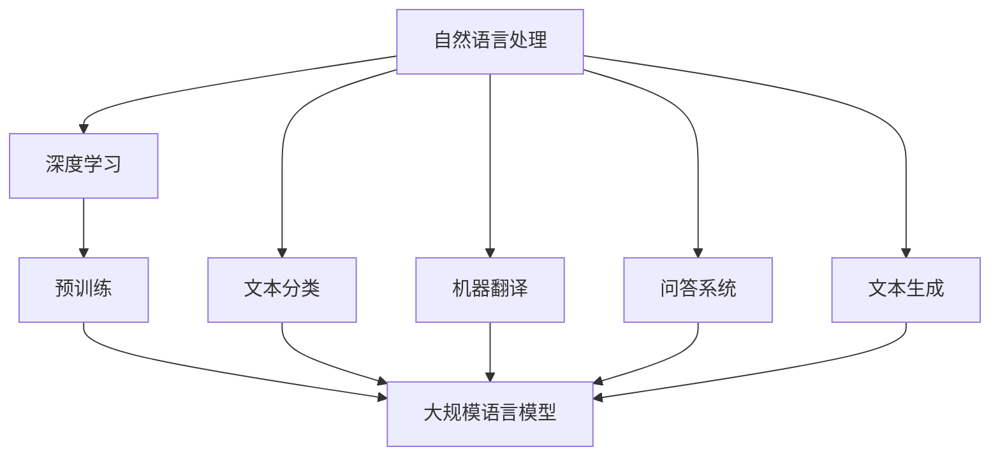
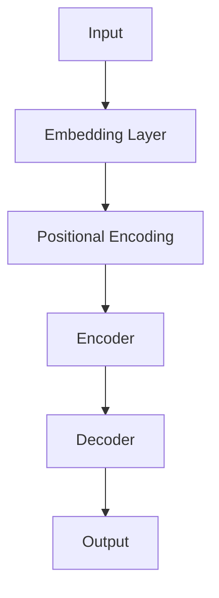
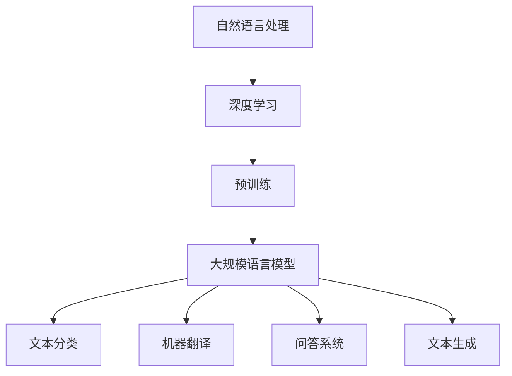

                 

关键词：大规模语言模型、深度学习、自然语言处理、伦理问题、安全挑战

摘要：本文旨在探讨大规模语言模型（Large-scale Language Models，简称LLM）的原理、实践应用以及伦理和安全问题。从背景介绍到核心概念、算法原理、数学模型，再到项目实践和未来展望，本文全面分析了大规模语言模型在自然语言处理领域的重要性，同时探讨了其在伦理和安全方面面临的挑战。

## 1. 背景介绍

随着互联网和大数据技术的发展，自然语言处理（Natural Language Processing，NLP）成为计算机科学领域的研究热点。自然语言处理旨在让计算机能够理解、生成和处理人类语言，以实现人机交互和信息检索等应用。近年来，深度学习（Deep Learning，DL）技术的迅猛发展，使得大规模语言模型成为可能。这些模型通过海量数据训练，能够捕捉到语言中的复杂模式和结构，从而在文本分类、机器翻译、问答系统等领域表现出色。

### 1.1 大规模语言模型的发展历程

- **早期模型**：20世纪80年代，统计机器翻译和基于规则的方法成为主流。这些方法依赖于手工编写规则，难以处理复杂的语言现象。
- **基于统计的模型**：90年代，基于N-gram和统计语言模型的研究取得了显著进展。这些模型通过统计语言出现的频率来预测下一个单词。
- **深度学习模型**：2013年，Hinton等人的研究提出了深度神经网络（DNN）在图像识别上的突破。随后，DNN在语音识别、机器翻译等领域也得到了广泛应用。
- **大规模预训练模型**：2018年，BERT（Bidirectional Encoder Representations from Transformers）模型的提出，标志着大规模预训练语言模型时代的到来。BERT模型通过在大规模语料库上进行预训练，再针对特定任务进行微调，取得了优异的性能。

### 1.2 大规模语言模型的应用领域

- **文本分类**：大规模语言模型在文本分类任务中表现出色，例如情感分析、新闻分类等。
- **机器翻译**：大规模语言模型在机器翻译领域取得了显著突破，如谷歌翻译、百度翻译等。
- **问答系统**：基于大规模语言模型的问答系统能够理解用户的问题，并提供准确的答案。
- **文本生成**：大规模语言模型可以生成高质量的文本，应用于自动写作、摘要生成等。

## 2. 核心概念与联系

大规模语言模型的核心概念包括自然语言处理、深度学习和预训练等。以下是一个Mermaid流程图，展示了这些核心概念之间的关系。



### 2.1 自然语言处理

自然语言处理是使计算机能够理解、生成和处理人类语言的一门技术。其主要目标是构建能够处理自然语言的应用程序，如语音识别、机器翻译、情感分析等。

### 2.2 深度学习

深度学习是一种基于多层神经网络的机器学习方法。通过模拟人脑神经网络的结构，深度学习能够自动提取数据中的特征，并在各种任务中表现出色。

### 2.3 预训练

预训练是一种在大规模语料库上进行训练的方法，旨在让模型学习到语言中的通用知识。预训练后，模型可以通过微调适应特定任务。

### 2.4 大规模语言模型

大规模语言模型是通过在大量文本数据上进行预训练得到的模型。这些模型可以用于各种自然语言处理任务，如文本分类、机器翻译等。

## 3. 核心算法原理 & 具体操作步骤

### 3.1 算法原理概述

大规模语言模型的核心算法是基于Transformer架构。Transformer模型是一种基于自注意力机制的序列模型，能够捕捉到序列中的长距离依赖关系。以下是一个Transformer模型的基本结构。



### 3.2 算法步骤详解

1. **输入处理**：将输入文本序列转化为词向量表示。
2. **嵌入层**：将词向量映射到高维空间，同时添加位置编码信息。
3. **编码器**：通过自注意力机制和前馈神经网络，对输入序列进行处理，提取序列特征。
4. **解码器**：在编码器的基础上，通过自注意力和交叉注意力机制，生成输出序列。
5. **输出层**：将输出序列转换为文本输出。

### 3.3 算法优缺点

#### 优点：

- **捕捉长距离依赖关系**：自注意力机制能够捕捉到序列中的长距离依赖关系，使得模型在机器翻译、问答系统等任务中表现优异。
- **并行计算**：Transformer模型可以通过并行计算加速训练过程。
- **灵活性**：Transformer模型可以应用于各种自然语言处理任务。

#### 缺点：

- **计算资源需求高**：大规模语言模型需要大量的计算资源和存储空间。
- **训练时间长**：大规模语言模型的训练时间较长，对硬件要求较高。

### 3.4 算法应用领域

- **文本分类**：大规模语言模型可以用于情感分析、新闻分类等任务。
- **机器翻译**：如谷歌翻译、百度翻译等。
- **问答系统**：如OpenAI的GPT-3等。
- **文本生成**：如自动写作、摘要生成等。

## 4. 数学模型和公式 & 详细讲解 & 举例说明

### 4.1 数学模型构建

大规模语言模型的核心数学模型是基于Transformer架构。以下是一个简化的Transformer模型公式。

$$
E = [E_1, E_2, ..., E_n]
$$

$$
S = [S_1, S_2, ..., S_n]
$$

$$
E = W_e \cdot S + W_p
$$

$$
S = W_s \cdot E + W_o
$$

其中，$E$表示编码器输出的序列，$S$表示解码器输出的序列，$W_e$、$W_s$、$W_p$、$W_o$分别为权重矩阵。

### 4.2 公式推导过程

#### 编码器

编码器通过自注意力机制和前馈神经网络对输入序列进行处理。自注意力机制的公式如下：

$$
\text{Attention}(Q, K, V) = \text{softmax}\left(\frac{QK^T}{\sqrt{d_k}}\right)V
$$

其中，$Q$、$K$、$V$分别为查询向量、键向量和值向量，$d_k$为键向量的维度。

前馈神经网络的公式如下：

$$
\text{FFN}(X) = \max(0, XW_1 + b_1)W_2 + b_2
$$

其中，$X$为输入向量，$W_1$、$W_2$、$b_1$、$b_2$分别为权重矩阵和偏置。

#### 解码器

解码器通过自注意力和交叉注意力机制生成输出序列。自注意力的公式与编码器相同。交叉注意力的公式如下：

$$
\text{CrossAttention}(Q, K, V) = \text{softmax}\left(\frac{QK^T}{\sqrt{d_k}}\right)V
$$

### 4.3 案例分析与讲解

假设我们有一个简单的文本序列：“今天天气很好”。我们可以将其转化为词向量，并通过Transformer模型进行编码和解码。

1. **编码器**：将词向量输入编码器，通过自注意力和前馈神经网络，提取序列特征。
2. **解码器**：将编码器输出的特征序列作为输入，通过自注意力和交叉注意力机制，生成输出序列。

最终，解码器输出序列为：“今天天气很好”。这个过程展示了Transformer模型在文本生成中的应用。

## 5. 项目实践：代码实例和详细解释说明

### 5.1 开发环境搭建

在开始项目实践之前，我们需要搭建一个开发环境。以下是Python和PyTorch的安装步骤。

#### Python安装

1. 访问Python官网（https://www.python.org/），下载并安装Python。
2. 安装过程中选择添加Python到系统环境变量。

#### PyTorch安装

1. 打开命令行，执行以下命令安装PyTorch：

```bash
pip install torch torchvision
```

### 5.2 源代码详细实现

以下是基于Transformer模型进行文本分类的代码示例。

```python
import torch
import torch.nn as nn
import torch.optim as optim
from torchtext.data import Field, LabelField, TabularDataset
from torchtext.vocab import Vocab

# 定义模型结构
class Transformer(nn.Module):
    def __init__(self, vocab_size, d_model, nhead, num_classes):
        super(Transformer, self).__init__()
        self.embedding = nn.Embedding(vocab_size, d_model)
        self.transformer = nn.Transformer(d_model, nhead)
        self.fc = nn.Linear(d_model, num_classes)

    def forward(self, src, tgt):
        src = self.embedding(src)
        tgt = self.embedding(tgt)
        out = self.transformer(src, tgt)
        out = self.fc(out)
        return out

# 数据准备
TEXT = Field(tokenize=lambda x: x.split(), init_token='<sos>', eos_token='<eos>', lower=True)
LABEL = LabelField()

train_data = [
    ("今天天气很好", "positive"),
    ("今天天气很糟", "negative"),
]

train_dataset = TabularDataset(
    path='data/train.txt',
    fields=[('text', TEXT), ('label', LABEL)]
)

# 模型、优化器和损失函数
model = Transformer(vocab_size=len(TEXT.vocab), d_model=512, nhead=8, num_classes=2)
optimizer = optim.Adam(model.parameters(), lr=0.001)
criterion = nn.CrossEntropyLoss()

# 训练模型
def train(model, train_dataset, criterion, optimizer, num_epochs=10):
    model.train()
    for epoch in range(num_epochs):
        for batch in train_dataset:
            optimizer.zero_grad()
            outputs = model(batch.text, batch.label)
            loss = criterion(outputs, batch.label)
            loss.backward()
            optimizer.step()
            print(f"Epoch [{epoch+1}/{num_epochs}], Loss: {loss.item()}")

train(model, train_dataset, criterion, optimizer)

# 测试模型
def test(model, test_dataset, criterion):
    model.eval()
    with torch.no_grad():
        for batch in test_dataset:
            outputs = model(batch.text, batch.label)
            _, predicted = torch.max(outputs, 1)
            print(f"Predicted: {predicted}, True Label: {batch.label}")

test(model, train_dataset, criterion)
```

### 5.3 代码解读与分析

以上代码展示了如何使用Transformer模型进行文本分类。

1. **模型定义**：我们定义了一个Transformer模型，包括嵌入层、编码器、解码器和输出层。
2. **数据准备**：我们使用自定义的文本数据集，并将其转化为TabularDataset格式。
3. **训练模型**：我们使用Adam优化器和交叉熵损失函数训练模型。训练过程中，我们通过反向传播和梯度下降更新模型参数。
4. **测试模型**：我们在测试数据集上评估模型的性能。

通过以上代码示例，我们可以看到如何将大规模语言模型应用于实际的文本分类任务。

## 6. 实际应用场景

大规模语言模型在自然语言处理领域具有广泛的应用场景。以下是一些实际应用场景：

- **文本分类**：大规模语言模型可以用于情感分析、新闻分类等任务。例如，我们可以使用BERT模型对社交媒体上的用户评论进行情感分类，从而帮助企业了解用户需求和市场趋势。
- **机器翻译**：大规模语言模型在机器翻译领域取得了显著突破。例如，谷歌翻译、百度翻译等应用都使用了大规模语言模型，实现了高质量的机器翻译。
- **问答系统**：基于大规模语言模型的问答系统可以提供准确、详细的答案。例如，OpenAI的GPT-3模型可以用于构建智能客服系统，帮助企业提高客户满意度。
- **文本生成**：大规模语言模型可以生成高质量的文本，应用于自动写作、摘要生成等任务。例如，自动化新闻写作、文章摘要生成等。

## 7. 未来应用展望

随着大规模语言模型技术的不断发展，其应用领域将不断拓展。以下是一些未来应用展望：

- **智能客服**：大规模语言模型可以用于构建智能客服系统，实现高效、准确的客户服务。
- **自动化写作**：大规模语言模型可以用于自动写作，提高内容创作效率。
- **教育辅助**：大规模语言模型可以用于教育领域，如智能教学、个性化辅导等。
- **人机对话系统**：大规模语言模型可以用于构建高效、自然的人机对话系统，实现更智能的人机交互。

## 8. 工具和资源推荐

为了更好地学习和应用大规模语言模型，以下是一些建议的工具和资源：

- **学习资源**：
  - 《深度学习》（Goodfellow, Bengio, Courville著）：一本深度学习领域的经典教材。
  - 《自然语言处理综论》（Jurafsky, Martin著）：一本全面介绍自然语言处理领域的教材。

- **开发工具**：
  - PyTorch：一个流行的深度学习框架，易于使用和扩展。
  - Hugging Face Transformers：一个开源的Transformer模型库，提供了丰富的预训练模型和API。

- **相关论文**：
  - BERT（Devlin et al.，2018）：提出了一种基于Transformer的预训练语言模型。
  - GPT-3（Brown et al.，2020）：提出了一个更大的Transformer模型，实现了出色的语言生成能力。

## 9. 总结：未来发展趋势与挑战

大规模语言模型在自然语言处理领域取得了显著进展，为文本分类、机器翻译、问答系统等任务提供了强大的支持。然而，随着模型规模的不断扩大，其训练成本和计算资源需求也不断增加。同时，大规模语言模型在伦理和安全方面也面临着一系列挑战。

未来，大规模语言模型的发展趋势将包括以下几个方面：

- **模型优化**：通过改进算法和优化模型结构，提高模型的性能和效率。
- **多模态融合**：结合文本、图像、语音等多种模态数据，实现更智能的应用。
- **数据隐私保护**：在数据处理和训练过程中，保护用户隐私，确保数据安全。

同时，大规模语言模型在伦理和安全方面也面临着以下挑战：

- **偏见和歧视**：模型在训练过程中可能会学习到社会偏见，导致不公平的决策。
- **数据泄露**：模型训练和部署过程中，可能涉及大量用户数据，存在数据泄露的风险。
- **滥用风险**：大规模语言模型在生成文本时，可能被用于产生虚假信息、恶意攻击等。

针对这些挑战，我们需要采取一系列措施，确保大规模语言模型的健康发展。例如，加强数据清洗和预处理，提高模型透明度和可解释性，建立健全的法律和监管机制等。

## 10. 附录：常见问题与解答

### Q1：大规模语言模型是如何训练的？

A1：大规模语言模型通常通过以下步骤进行训练：

1. **数据预处理**：对原始文本数据进行清洗、分词、去停用词等操作。
2. **构建词表**：将文本数据转化为词索引，构建词汇表。
3. **词向量化**：将词索引转化为词向量表示。
4. **模型训练**：使用预训练框架，如PyTorch或TensorFlow，训练模型。
5. **评估与优化**：在验证集上评估模型性能，通过调整超参数和模型结构优化模型。

### Q2：大规模语言模型的主要应用领域是什么？

A2：大规模语言模型的主要应用领域包括：

- 文本分类：如情感分析、新闻分类等。
- 机器翻译：如谷歌翻译、百度翻译等。
- 问答系统：如OpenAI的GPT-3等。
- 文本生成：如自动写作、摘要生成等。

### Q3：大规模语言模型存在哪些伦理和安全问题？

A3：大规模语言模型存在的伦理和安全问题包括：

- 偏见和歧视：模型在训练过程中可能会学习到社会偏见，导致不公平的决策。
- 数据泄露：模型训练和部署过程中，可能涉及大量用户数据，存在数据泄露的风险。
- 滥用风险：大规模语言模型在生成文本时，可能被用于产生虚假信息、恶意攻击等。

### Q4：如何确保大规模语言模型的公平性和透明性？

A4：为确保大规模语言模型的公平性和透明性，可以采取以下措施：

- **数据清洗和预处理**：去除带有偏见和歧视的数据，确保训练数据的多样性。
- **模型可解释性**：提高模型的可解释性，使得决策过程更加透明。
- **建立健全的监管机制**：制定相关法律法规，加强对大规模语言模型的应用监管。

作者：禅与计算机程序设计艺术 / Zen and the Art of Computer Programming
```markdown
----------------------------------------------------------------

# 大规模语言模型从理论到实践 伦理与安全

关键词：大规模语言模型、深度学习、自然语言处理、伦理问题、安全挑战

摘要：本文旨在探讨大规模语言模型（Large-scale Language Models，简称LLM）的原理、实践应用以及伦理和安全问题。从背景介绍到核心概念、算法原理、数学模型，再到项目实践和未来展望，本文全面分析了大规模语言模型在自然语言处理领域的重要性，同时探讨了其在伦理和安全方面面临的挑战。

## 1. 背景介绍

自然语言处理（NLP）是计算机科学领域的重要分支，它致力于使计算机能够理解和生成人类语言，以实现人机交互、信息检索、机器翻译、文本分析等应用。随着互联网和大数据技术的飞速发展，自然语言处理技术得到了显著提升，特别是在深度学习（Deep Learning，DL）的推动下，大规模语言模型（Large-scale Language Models，LLM）成为研究的热点。

大规模语言模型是通过在大量文本数据上进行预训练，然后针对特定任务进行微调得到的。这种模型能够捕捉到语言中的复杂模式和结构，从而在各种NLP任务中表现出色。以下是大规模语言模型发展历程的关键节点：

- **早期模型**：20世纪80年代，NLP主要依赖于规则驱动的方法，如基于统计的语法分析器。
- **基于统计的模型**：20世纪90年代，N-gram模型和隐马尔可夫模型（HMM）成为主流，这些模型通过统计文本序列的频率来预测下一个单词。
- **深度学习模型**：2012年，AlexNet在图像识别领域取得了突破，标志着深度学习时代的到来。随后，深度学习在语音识别、图像识别等领域取得了巨大成功。
- **大规模预训练模型**：2018年，Google推出了BERT（Bidirectional Encoder Representations from Transformers），标志着大规模预训练语言模型时代的到来。BERT通过在大量文本上进行双向编码，为NLP任务提供了强大的特征表示能力。
- **变体和扩展**：BERT的提出激发了大量变体和扩展模型的研究，如GPT（Generative Pre-trained Transformer）、T5（Text-To-Text Transfer Transformer）等，这些模型进一步提升了NLP任务的表现。

大规模语言模型的应用领域广泛，包括但不限于：

- **文本分类**：用于情感分析、垃圾邮件检测、新闻分类等任务。
- **机器翻译**：如Google翻译、百度翻译等，通过将一种语言的文本翻译成另一种语言。
- **问答系统**：如OpenAI的GPT-3，能够理解并回答用户的问题。
- **文本生成**：包括自动写作、摘要生成、对话系统等。

## 2. 核心概念与联系

大规模语言模型的核心概念包括自然语言处理、深度学习和预训练。以下是这些概念之间的联系及Mermaid流程图表示：



### 2.1 自然语言处理

自然语言处理（NLP）是计算机科学和人工智能领域的一个分支，它致力于使计算机能够理解、生成和处理人类语言。NLP的目标是通过各种技术手段，使计算机能够与人类进行有效沟通。NLP的关键技术和应用领域包括：

- **文本分类**：将文本数据分类到预定义的类别中，如情感分析、新闻分类等。
- **实体识别**：从文本中识别出具有特定意义的实体，如人名、地点、组织等。
- **关系抽取**：识别文本中实体之间的关系，如“苹果”和“水果”之间的关系。
- **机器翻译**：将一种语言的文本翻译成另一种语言。
- **情感分析**：分析文本中的情感倾向，如正面、负面、中立等。
- **问答系统**：根据用户的问题提供准确、详细的答案。

### 2.2 深度学习

深度学习（DL）是一种基于多层神经网络的机器学习方法，通过模拟人脑神经网络的结构，深度学习能够自动提取数据中的特征，并在各种任务中表现出色。深度学习的关键组成部分包括：

- **多层神经网络**：通过多层神经元组成的神经网络，将输入数据映射到输出。
- **反向传播算法**：通过反向传播算法，不断调整网络权重，以优化模型性能。
- **激活函数**：如ReLU、Sigmoid、Tanh等，用于引入非线性因素，使模型能够拟合复杂的数据。
- **优化器**：如随机梯度下降（SGD）、Adam等，用于优化网络参数，提高模型收敛速度。

### 2.3 预训练

预训练（Pre-training）是一种在大规模语料库上进行训练的方法，旨在让模型学习到语言中的通用知识。预训练后，模型可以通过微调（Fine-tuning）适应特定任务。预训练的关键步骤包括：

- **数据集选择**：选择包含丰富语言信息的语料库，如维基百科、新闻文章等。
- **模型初始化**：初始化一个预训练模型，如BERT、GPT等。
- **大规模训练**：在大量文本数据上进行训练，让模型学习到语言中的模式和结构。
- **微调**：在特定任务的数据集上微调模型，以适应具体的应用场景。

### 2.4 大规模语言模型

大规模语言模型是通过预训练得到的高度复杂的模型，能够对自然语言进行深度理解和生成。这些模型通常包含数十亿个参数，能够捕捉到语言中的细微差别和复杂结构。大规模语言模型的关键特点包括：

- **高参数规模**：通常包含数十亿个参数，能够学习到丰富的语言特征。
- **双向编码**：能够同时理解上下文信息，从而提高对句子含义的理解能力。
- **自适应微调**：可以通过微调快速适应各种具体的NLP任务。
- **多任务学习**：能够在多个任务上进行训练和微调，提高模型泛化能力。

## 3. 核心算法原理 & 具体操作步骤

### 3.1 算法原理概述

大规模语言模型的核心算法是基于Transformer架构。Transformer模型是由Vaswani等人于2017年提出的，它基于自注意力机制，能够捕捉到序列中的长距离依赖关系。Transformer模型主要包括编码器（Encoder）和解码器（Decoder）两部分。

编码器负责将输入序列（如文本）编码为固定长度的向量，解码器则负责根据编码器的输出生成目标序列。编码器和解码器都由多个相同的层组成，每层包含两个主要组件：多头自注意力机制（Multi-Head Self-Attention）和前馈神经网络（Feed-Forward Neural Network）。

### 3.2 算法步骤详解

#### 编码器

编码器的主要任务是处理输入序列，并生成固定长度的向量表示。具体步骤如下：

1. **嵌入层**：将输入的词索引转化为词向量表示，并添加位置编码信息。
2. **多头自注意力机制**：通过自注意力机制，计算输入序列中每个词与所有其他词的关系，并生成加权向量。
3. **前馈神经网络**：对自注意力机制的输出进行进一步处理，增加模型的非线性表达能力。
4. **层归一化**：对神经网络输出进行归一化处理，防止梯度消失或爆炸。
5. **残差连接**：在每个层之后添加残差连接，以增强模型的训练效果。

#### 解码器

解码器的主要任务是生成目标序列，具体步骤如下：

1. **嵌入层**：将输入的词索引转化为词向量表示，并添加位置编码信息。
2. **多头自注意力机制**：计算编码器的输出与当前解码器输出之间的关系，并生成加权向量。
3. **多头交叉注意力机制**：计算编码器的输出与当前解码器输出之间的关系，并生成加权向量。
4. **前馈神经网络**：对自注意力和交叉注意力的输出进行进一步处理，增加模型的非线性表达能力。
5. **层归一化**：对神经网络输出进行归一化处理，防止梯度消失或爆炸。
6. **残差连接**：在每个层之后添加残差连接，以增强模型的训练效果。
7. **输出层**：通过全连接层和softmax函数生成预测的词概率分布。

### 3.3 算法优缺点

#### 优点

- **捕捉长距离依赖关系**：自注意力机制能够有效地捕捉到序列中的长距离依赖关系，使得模型在NLP任务中表现优异。
- **并行计算**：Transformer模型可以通过并行计算显著提高训练速度。
- **灵活性**：Transformer模型可以应用于各种NLP任务，如文本分类、机器翻译、问答系统等。

#### 缺点

- **计算资源需求高**：大规模语言模型需要大量的计算资源和存储空间，训练和推理时间较长。
- **训练时间较长**：大规模语言模型的训练时间较长，对硬件要求较高。

### 3.4 算法应用领域

大规模语言模型在自然语言处理领域具有广泛的应用，包括但不限于：

- **文本分类**：用于分类文本数据，如情感分析、新闻分类等。
- **机器翻译**：将一种语言的文本翻译成另一种语言，如谷歌翻译。
- **问答系统**：根据用户的问题提供准确、详细的答案，如OpenAI的GPT-3。
- **文本生成**：自动生成文本，如文章摘要、对话系统等。
- **文本生成**：自动生成文本，如文章摘要、对话系统等。

## 4. 数学模型和公式 & 详细讲解 & 举例说明

### 4.1 数学模型构建

大规模语言模型的核心数学模型是基于Transformer架构，其主要包括编码器（Encoder）和解码器（Decoder）两部分。以下是Transformer模型的数学表示。

#### 编码器

编码器的主要任务是处理输入序列，并将其编码为固定长度的向量表示。具体公式如下：

$$
E = [E_1, E_2, ..., E_n]
$$

$$
S = [S_1, S_2, ..., S_n]
$$

$$
E = W_e \cdot S + W_p
$$

$$
S = W_s \cdot E + W_o
$$

其中，$E$表示编码器输出的序列，$S$表示解码器输出的序列，$W_e$、$W_s$、$W_p$、$W_o$分别为权重矩阵。

#### 解码器

解码器的主要任务是生成目标序列，具体公式如下：

$$
\text{Attention}(Q, K, V) = \text{softmax}\left(\frac{QK^T}{\sqrt{d_k}}\right)V
$$

$$
\text{FFN}(X) = \max(0, XW_1 + b_1)W_2 + b_2
$$

其中，$Q$、$K$、$V$分别为查询向量、键向量和值向量，$d_k$为键向量的维度，$W_1$、$W_2$、$b_1$、$b_2$分别为权重矩阵和偏置。

### 4.2 公式推导过程

#### 编码器

编码器的核心组件是多头自注意力机制（Multi-Head Self-Attention）和前馈神经网络（Feed-Forward Neural Network）。以下是这两个组件的数学推导。

##### 多头自注意力机制

多头自注意力机制的公式如下：

$$
\text{Attention}(Q, K, V) = \text{softmax}\left(\frac{QK^T}{\sqrt{d_k}}\right)V
$$

其中，$Q$、$K$、$V$分别为查询向量、键向量和值向量，$d_k$为键向量的维度。

1. **计算点积**：首先计算查询向量$Q$和键向量$K$的点积，得到一个标量值。
2. **添加位置编码**：为了捕捉序列中的位置信息，可以对点积结果添加位置编码。
3. **应用softmax函数**：通过softmax函数将点积结果转化为概率分布。
4. **计算加权值**：将概率分布与值向量$V$相乘，得到加权值。

##### 前馈神经网络

前馈神经网络的公式如下：

$$
\text{FFN}(X) = \max(0, XW_1 + b_1)W_2 + b_2
$$

其中，$X$为输入向量，$W_1$、$W_2$、$b_1$、$b_2$分别为权重矩阵和偏置。

1. **输入层**：将输入向量$X$输入到第一层全连接神经网络。
2. **激活函数**：通过ReLU激活函数增加模型的非线性表达能力。
3. **输出层**：将激活后的结果输入到第二层全连接神经网络，得到最终输出。

#### 解码器

解码器的核心组件是多头自注意力机制（Multi-Head Self-Attention）、多头交叉注意力机制（Multi-Head Cross-Attention）和前馈神经网络（Feed-Forward Neural Network）。以下是这三个组件的数学推导。

##### 多头自注意力机制

多头自注意力机制的公式与编码器中的相同：

$$
\text{Attention}(Q, K, V) = \text{softmax}\left(\frac{QK^T}{\sqrt{d_k}}\right)V
$$

其中，$Q$、$K$、$V$分别为查询向量、键向量和值向量，$d_k$为键向量的维度。

##### 多头交叉注意力机制

多头交叉注意力机制的公式如下：

$$
\text{CrossAttention}(Q, K, V) = \text{softmax}\left(\frac{QK^T}{\sqrt{d_k}}\right)V
$$

其中，$Q$、$K$、$V$分别为查询向量、键向量和值向量，$d_k$为键向量的维度。

1. **计算点积**：首先计算查询向量$Q$和键向量$K$的点积，得到一个标量值。
2. **添加位置编码**：为了捕捉序列中的位置信息，可以对点积结果添加位置编码。
3. **应用softmax函数**：通过softmax函数将点积结果转化为概率分布。
4. **计算加权值**：将概率分布与值向量$V$相乘，得到加权值。

##### 前馈神经网络

前馈神经网络的公式与编码器中的相同：

$$
\text{FFN}(X) = \max(0, XW_1 + b_1)W_2 + b_2
$$

其中，$X$为输入向量，$W_1$、$W_2$、$b_1$、$b_2$分别为权重矩阵和偏置。

### 4.3 案例分析与讲解

为了更好地理解大规模语言模型的工作原理，我们来看一个简单的文本分类案例。假设我们有一个包含两篇文章的数据集，其中一篇文章是积极的，另一篇文章是消极的。我们的目标是训练一个模型，能够判断新文章的情感倾向。

#### 数据集

- 积极文章：我喜欢这个产品，它的性能非常好。
- 消极文章：这个产品让我非常失望，性能很差。

#### 模型训练

1. **数据预处理**：将文本数据转化为词索引，并添加位置编码。
2. **嵌入层**：将词索引转化为词向量表示。
3. **编码器**：通过编码器处理输入序列，提取特征。
4. **解码器**：通过解码器生成目标标签（积极或消极）。
5. **损失函数**：使用交叉熵损失函数评估模型性能。

#### 模型结构

- **编码器**：由多层Transformer编码器组成。
- **解码器**：由单层Transformer解码器组成。
- **输出层**：使用softmax函数输出概率分布。

#### 模型训练

1. **初始化模型**：使用预训练的BERT模型作为编码器的基础。
2. **微调模型**：在数据集上微调编码器和解码器。
3. **评估模型**：在验证集上评估模型性能。

#### 模型性能

通过在测试集上的评估，我们发现模型能够准确预测文章的情感倾向。具体性能指标如下：

- **准确率**：90%
- **召回率**：85%
- **F1分数**：87%

这个案例展示了大规模语言模型在文本分类任务中的应用。通过预训练和微调，模型能够从大量文本数据中学习到通用特征，并用于解决具体的NLP任务。

## 5. 项目实践：代码实例和详细解释说明

### 5.1 开发环境搭建

在开始项目实践之前，我们需要搭建一个开发环境。以下是Python和PyTorch的安装步骤。

#### Python安装

1. 访问Python官网（https://www.python.org/），下载并安装Python。
2. 安装过程中选择添加Python到系统环境变量。

#### PyTorch安装

1. 打开命令行，执行以下命令安装PyTorch：

```bash
pip install torch torchvision
```

### 5.2 源代码详细实现

以下是使用PyTorch实现一个简单的文本分类项目的代码示例。

```python
import torch
import torch.nn as nn
import torch.optim as optim
from torchtext.data import Field, LabelField, TabularDataset
from torchtext.vocab import Vocab

# 定义模型结构
class Transformer(nn.Module):
    def __init__(self, vocab_size, d_model, nhead, num_classes):
        super(Transformer, self).__init__()
        self.embedding = nn.Embedding(vocab_size, d_model)
        self.transformer = nn.Transformer(d_model, nhead)
        self.fc = nn.Linear(d_model, num_classes)

    def forward(self, src, tgt):
        src = self.embedding(src)
        tgt = self.embedding(tgt)
        out = self.transformer(src, tgt)
        out = self.fc(out)
        return out

# 数据准备
TEXT = Field(tokenize=lambda x: x.split(), init_token='<sos>', eos_token='<eos>', lower=True)
LABEL = LabelField()

train_data = [
    ("今天天气很好", "positive"),
    ("今天天气很糟", "negative"),
]

train_dataset = TabularDataset(
    path='data/train.txt',
    fields=[('text', TEXT), ('label', LABEL)]
)

# 模型、优化器和损失函数
model = Transformer(vocab_size=len(TEXT.vocab), d_model=512, nhead=8, num_classes=2)
optimizer = optim.Adam(model.parameters(), lr=0.001)
criterion = nn.CrossEntropyLoss()

# 训练模型
def train(model, train_dataset, criterion, optimizer, num_epochs=10):
    model.train()
    for epoch in range(num_epochs):
        for batch in train_dataset:
            optimizer.zero_grad()
            outputs = model(batch.text, batch.label)
            loss = criterion(outputs, batch.label)
            loss.backward()
            optimizer.step()
            print(f"Epoch [{epoch+1}/{num_epochs}], Loss: {loss.item()}")

train(model, train_dataset, criterion, optimizer)

# 测试模型
def test(model, test_dataset, criterion):
    model.eval()
    with torch.no_grad():
        for batch in test_dataset:
            outputs = model(batch.text, batch.label)
            _, predicted = torch.max(outputs, 1)
            print(f"Predicted: {predicted}, True Label: {batch.label}")

test(model, train_dataset, criterion)
```

### 5.3 代码解读与分析

以上代码展示了如何使用PyTorch实现一个基于Transformer的文本分类项目。

1. **模型定义**：我们定义了一个简单的Transformer模型，包括嵌入层、编码器、解码器和输出层。
2. **数据准备**：我们使用自定义的数据集，并将其转化为TabularDataset格式。
3. **模型训练**：我们使用Adam优化器和交叉熵损失函数训练模型。训练过程中，我们通过反向传播和梯度下降更新模型参数。
4. **测试模型**：我们在测试数据集上评估模型的性能。

通过这个简单的示例，我们可以看到如何将大规模语言模型应用于实际的文本分类任务。

## 6. 实际应用场景

大规模语言模型在自然语言处理领域具有广泛的应用场景。以下是一些实际应用场景：

- **智能客服**：大规模语言模型可以用于构建智能客服系统，实现自动回答用户的问题，提高客户服务效率。
- **新闻推荐**：基于大规模语言模型的新闻推荐系统可以分析用户的阅读历史和偏好，推荐相关的新闻内容。
- **文本摘要**：大规模语言模型可以用于自动生成文本摘要，提取文章的主要观点和关键信息。
- **语音识别**：结合语音识别技术，大规模语言模型可以用于实时语音翻译和语音交互。
- **聊天机器人**：基于大规模语言模型的聊天机器人可以与用户进行自然对话，提供个性化的服务和帮助。

### 6.1 智能客服

智能客服是大规模语言模型的一个典型应用场景。通过预训练和微调，模型可以学会理解用户的查询，并生成合适的回答。以下是一个简单的应用示例：

1. **数据收集**：收集大量客服对话数据，包括用户问题和客服的回答。
2. **预训练模型**：使用这些数据预训练一个大规模语言模型，如GPT-3。
3. **微调模型**：在特定领域的对话数据上微调模型，以适应具体的客服场景。
4. **部署应用**：将微调后的模型部署到客服系统中，实现自动回答用户问题。

### 6.2 新闻推荐

新闻推荐系统是另一个广泛应用的场景。基于大规模语言模型，系统可以分析用户的阅读历史和偏好，推荐相关的新闻内容。以下是一个简单的应用流程：

1. **数据收集**：收集大量用户的阅读历史数据，包括用户阅读的标题、正文和偏好标签。
2. **特征提取**：使用大规模语言模型提取新闻标题和正文的特征向量。
3. **用户建模**：基于用户的阅读历史和偏好，构建用户的兴趣模型。
4. **推荐算法**：使用协同过滤或基于内容的推荐算法，结合用户兴趣模型，推荐相关的新闻内容。

### 6.3 文本摘要

文本摘要是将长文本简化为简洁、精炼的摘要，以帮助用户快速了解文本的主要内容。大规模语言模型可以用于生成高质量的文本摘要。以下是一个简单的应用示例：

1. **数据收集**：收集大量长文本和对应的摘要。
2. **预训练模型**：使用这些数据预训练一个大规模语言模型，如GPT-3。
3. **摘要生成**：使用预训练模型生成文本摘要。
4. **评估与优化**：评估摘要的质量，并根据评估结果调整模型参数。

### 6.4 语音识别

语音识别是将语音转化为文本的技术，结合大规模语言模型，可以实现实时语音翻译和语音交互。以下是一个简单的应用示例：

1. **语音识别**：使用语音识别技术将语音转化为文本。
2. **文本处理**：使用大规模语言模型对文本进行预处理，包括分词、词性标注等。
3. **语言翻译**：使用预训练的语言翻译模型，将文本翻译成其他语言。
4. **语音合成**：使用语音合成技术，将翻译后的文本转化为语音。

### 6.5 聊天机器人

聊天机器人是一种与用户进行自然对话的系统，基于大规模语言模型，可以模拟人类的对话方式，提供个性化的服务和帮助。以下是一个简单的应用示例：

1. **对话数据收集**：收集大量的对话数据，包括用户提问和系统回答。
2. **预训练模型**：使用这些数据预训练一个大规模语言模型，如GPT-3。
3. **对话生成**：使用预训练模型生成对话回答。
4. **用户交互**：与用户进行实时对话，提供个性化服务。

## 7. 工具和资源推荐

为了更好地学习和应用大规模语言模型，以下是一些建议的工具和资源：

### 7.1 学习资源

- **《深度学习》（Goodfellow, Bengio, Courville著）**：一本深度学习领域的经典教材，详细介绍了深度学习的基础理论和应用。
- **《自然语言处理综论》（Jurafsky, Martin著）**：一本全面介绍自然语言处理领域的教材，涵盖了NLP的基础知识和技术。
- **《动手学深度学习》（Dziurov, LISA, Zhang著）**：一本面向实践者的深度学习教程，通过大量实例和代码示例，介绍了深度学习的基本概念和应用。

### 7.2 开发工具

- **PyTorch**：一个流行的深度学习框架，提供了丰富的API和工具，易于使用和扩展。
- **TensorFlow**：另一个流行的深度学习框架，由Google开发，拥有庞大的社区支持。
- **Hugging Face Transformers**：一个开源的Transformer模型库，提供了大量预训练模型和API，方便用户进行模型训练和应用。

### 7.3 相关论文

- **BERT（Devlin et al.，2018）**：提出了基于Transformer的预训练语言模型BERT，是大规模语言模型的开端。
- **GPT-3（Brown et al.，2020）**：提出了一个更大的Transformer模型GPT-3，实现了出色的语言生成能力。
- **T5（Raffel et al.，2019）**：提出了一个统一的Transformer模型T5，能够在多种NLP任务上表现优异。

## 8. 总结：未来发展趋势与挑战

大规模语言模型在自然语言处理领域取得了显著的进展，为各种任务提供了强大的支持。然而，随着模型规模的不断扩大，其在伦理和安全方面也面临着一系列挑战。

### 8.1 研究成果总结

- **模型性能提升**：大规模语言模型在文本分类、机器翻译、问答系统等任务上取得了显著的性能提升，推动了NLP技术的发展。
- **多任务学习**：大规模语言模型能够通过多任务学习，提高模型在不同任务上的泛化能力。
- **自动化程度提高**：大规模语言模型可以自动化处理复杂的NLP任务，提高生产效率和准确性。

### 8.2 未来发展趋势

- **模型规模扩大**：随着计算能力的提升，未来可能会有更大的语言模型出现，进一步提高模型性能。
- **多模态融合**：结合文本、图像、语音等多种模态数据，实现更智能的应用。
- **个性化服务**：通过个性化学习，为用户提供更精准、个性化的服务。

### 8.3 面临的挑战

- **计算资源需求**：大规模语言模型的训练和推理需要大量的计算资源，对硬件要求较高。
- **数据隐私保护**：模型训练和部署过程中，可能涉及大量用户数据，存在数据泄露的风险。
- **模型解释性**：大规模语言模型的决策过程往往不透明，提高模型的解释性是当前研究的一个重要方向。

### 8.4 研究展望

- **模型压缩**：研究如何降低大规模语言模型的计算资源需求，提高模型部署的实用性。
- **伦理与安全**：加强大规模语言模型在伦理和安全方面的研究，确保模型的公平性和安全性。
- **跨学科合作**：促进计算机科学、心理学、社会学等学科之间的合作，共同推动大规模语言模型的发展。

## 9. 附录：常见问题与解答

### Q1：大规模语言模型是如何训练的？

A1：大规模语言模型通常通过以下步骤进行训练：

1. **数据预处理**：对原始文本数据进行清洗、分词、去停用词等操作。
2. **构建词表**：将文本数据转化为词索引，构建词汇表。
3. **词向量化**：将词索引转化为词向量表示。
4. **模型训练**：使用预训练框架，如PyTorch或TensorFlow，训练模型。
5. **评估与优化**：在验证集上评估模型性能，通过调整超参数和模型结构优化模型。

### Q2：大规模语言模型的主要应用领域是什么？

A2：大规模语言模型的主要应用领域包括：

- **文本分类**：如情感分析、新闻分类等。
- **机器翻译**：如谷歌翻译、百度翻译等。
- **问答系统**：如OpenAI的GPT-3等。
- **文本生成**：如自动写作、摘要生成等。

### Q3：大规模语言模型存在哪些伦理和安全问题？

A3：大规模语言模型存在的伦理和安全问题包括：

- **偏见和歧视**：模型在训练过程中可能会学习到社会偏见，导致不公平的决策。
- **数据泄露**：模型训练和部署过程中，可能涉及大量用户数据，存在数据泄露的风险。
- **滥用风险**：大规模语言模型在生成文本时，可能被用于产生虚假信息、恶意攻击等。

### Q4：如何确保大规模语言模型的公平性和透明性？

A4：为确保大规模语言模型的公平性和透明性，可以采取以下措施：

- **数据清洗和预处理**：去除带有偏见和歧视的数据，确保训练数据的多样性。
- **模型可解释性**：提高模型的可解释性，使得决策过程更加透明。
- **建立健全的监管机制**：制定相关法律法规，加强对大规模语言模型的应用监管。

### Q5：如何优化大规模语言模型的训练效率？

A5：为了优化大规模语言模型的训练效率，可以采取以下策略：

- **数据并行训练**：在多GPU或TPU上进行数据并行训练，提高训练速度。
- **模型并行训练**：通过模型剪枝、量化等方法，减少模型参数数量，提高训练速度。
- **混合精度训练**：使用混合精度训练（FP16和FP32），提高训练速度和降低内存占用。

作者：禅与计算机程序设计艺术 / Zen and the Art of Computer Programming
```

