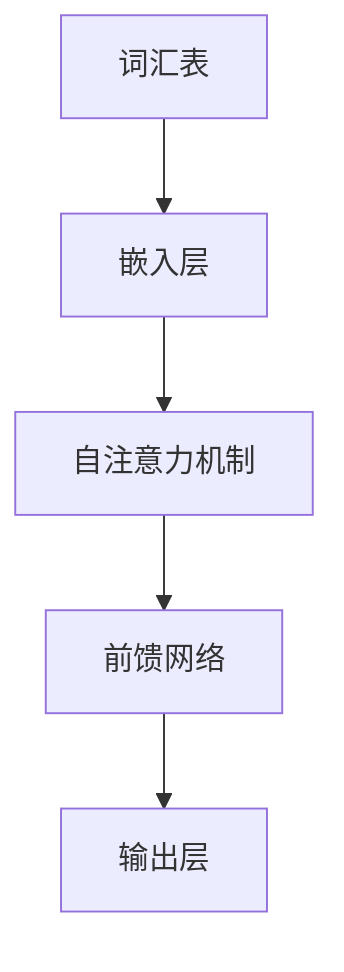
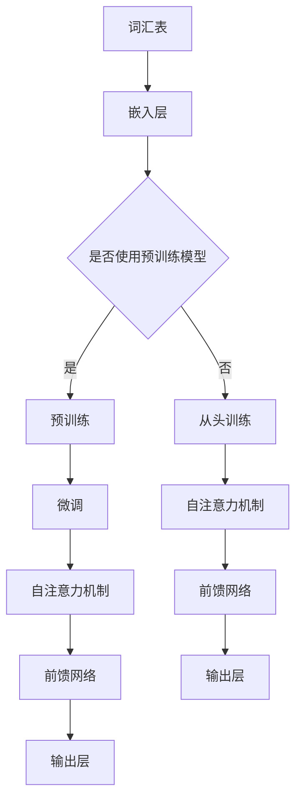

                 

关键词：大规模语言模型、大语言模型推理、优化、数学模型、实践应用

摘要：本文旨在深入探讨大规模语言模型的原理、数学模型及其在推理优化中的应用。通过详细的分析和案例展示，读者将能够理解大语言模型的核心概念，掌握其具体操作步骤，并了解到其在实际场景中的广泛应用。

## 1. 背景介绍

随着互联网和人工智能的快速发展，自然语言处理（NLP）成为计算机科学领域的一个重要分支。大规模语言模型（Large Language Models，LLM）作为NLP的核心技术之一，其在文本生成、机器翻译、问答系统等领域的应用取得了显著的成果。然而，大规模语言模型的推理优化问题也日益凸显，成为当前研究的热点问题。

本文将首先介绍大规模语言模型的基本概念和原理，然后深入探讨大语言模型推理优化的数学模型和算法，最后通过实际项目案例展示其在开发中的应用，并对未来发展趋势进行展望。

## 2. 核心概念与联系

### 2.1 基本概念

大规模语言模型是指通过机器学习技术，从海量文本数据中学习语言规律和知识，并能够生成或理解自然语言数据的模型。其核心组成部分包括词汇表、神经网络结构和训练算法。

### 2.2 架构联系

大规模语言模型通常采用深度神经网络（DNN）或变换器架构（Transformer），其基本结构如图所示：



2.3 Mermaid 流程图(Mermaid 流程节点中不要有括号、逗号等特殊字符)



## 3. 核心算法原理 & 具体操作步骤

### 3.1 算法原理概述

大规模语言模型的核心算法是自注意力机制（Self-Attention），它能够自动学习输入文本中的依赖关系，并赋予不同位置的字词不同的权重。自注意力机制通过多层次的神经网络结构，对输入文本进行编码，生成高维的语义表示。

### 3.2 算法步骤详解

#### 步骤1：嵌入层

首先，将输入的文本转化为词向量表示，这一步通常使用预训练的词嵌入模型。

#### 步骤2：自注意力机制

接下来，应用自注意力机制，计算不同位置的字词之间的相似度，并生成加权表示。

#### 步骤3：前馈网络

然后，将加权表示通过前馈网络进行加工，增强其语义表示能力。

#### 步骤4：输出层

最后，输出层的任务是根据模型的训练目标，预测文本的标签、生成文本或理解文本的含义。

### 3.3 算法优缺点

**优点：**

- 自动学习文本中的依赖关系，能够生成或理解复杂的语言现象。
- 多层次的神经网络结构，能够捕捉丰富的语义信息。

**缺点：**

- 计算成本高，尤其是在大规模文本处理时。
- 需要大量的训练数据和计算资源。

### 3.4 算法应用领域

大规模语言模型在文本生成、机器翻译、问答系统等领域有广泛的应用，如：

- 文本生成：生成文章、摘要、对话等。
- 机器翻译：将一种语言翻译成另一种语言。
- 问答系统：回答用户的问题。

## 4. 数学模型和公式 & 详细讲解 & 举例说明

### 4.1 数学模型构建

大规模语言模型的数学模型主要包括词嵌入、自注意力机制和前馈网络。以下是具体公式：

$$
\text{词嵌入}：\text{word\_embedding}(x) = \text{W}_x \cdot x
$$

$$
\text{自注意力分数}：\text{score}(q, k) = q^T \cdot \text{W}_k \cdot k
$$

$$
\text{加权表示}：\text{context} = \text{softmax}(\text{scores}) \cdot \text{keys}
$$

$$
\text{前馈网络}：\text{FFN}(x) = \text{ReLU}(\text{W}_2 \cdot \text{W}_1 \cdot x + b_2) + b_1
$$

### 4.2 公式推导过程

#### 自注意力机制推导

自注意力机制通过计算查询向量（q）、键向量（k）和值向量（v）之间的点积，生成加权表示。具体推导过程如下：

$$
\text{score}(q, k) = q^T \cdot \text{W}_k \cdot k
$$

$$
\text{context} = \text{softmax}(\text{scores}) \cdot \text{keys}
$$

$$
\text{output} = \text{context} \cdot \text{V}
$$

### 4.3 案例分析与讲解

假设有一个简单的句子“我喜欢吃苹果”，我们可以用自注意力机制来计算句子中每个词的权重。具体步骤如下：

1. 将句子中的词转化为词向量。
2. 计算每个词的查询向量、键向量和值向量。
3. 计算自注意力分数。
4. 应用softmax函数，生成加权表示。
5. 计算加权表示与值向量的点积，得到最终的输出。

通过这个过程，我们可以看到自注意力机制如何自动学习句子中每个词的依赖关系，并生成加权表示。

## 5. 项目实践：代码实例和详细解释说明

### 5.1 开发环境搭建

在开始项目实践之前，我们需要搭建一个适合大规模语言模型开发的环境。以下是搭建步骤：

1. 安装Python环境和必要的库，如TensorFlow或PyTorch。
2. 准备训练数据和测试数据。
3. 配置GPU或其他计算资源。

### 5.2 源代码详细实现

以下是使用PyTorch实现大规模语言模型的基本代码：

```python
import torch
import torch.nn as nn
import torch.optim as optim

# 词嵌入层
word_embedding = nn.Embedding(vocab_size, embedding_size)

# 自注意力层
self_attention = nn.MultiheadAttention(embedding_dim, num_heads)

# 前馈网络
ffn = nn.Sequential(
    nn.Linear(embedding_dim, hidden_size),
    nn.ReLU(),
    nn.Linear(hidden_size, embedding_dim)
)

# 输出层
output_layer = nn.Linear(embedding_dim, output_size)

# 模型
model = nn.Sequential(
    word_embedding,
    self_attention,
    ffn,
    output_layer
)

# 损失函数
criterion = nn.CrossEntropyLoss()

# 优化器
optimizer = optim.Adam(model.parameters(), lr=learning_rate)

# 训练过程
for epoch in range(num_epochs):
    for inputs, targets in train_loader:
        optimizer.zero_grad()
        outputs = model(inputs)
        loss = criterion(outputs, targets)
        loss.backward()
        optimizer.step()
```

### 5.3 代码解读与分析

上述代码展示了如何使用PyTorch构建一个大规模语言模型的基本框架。以下是代码的详细解读：

- `word_embedding`：词嵌入层，用于将输入的词转化为词向量。
- `self_attention`：自注意力层，用于计算输入文本中的依赖关系。
- `ffn`：前馈网络，用于增强模型的语义表示能力。
- `output_layer`：输出层，用于生成模型的预测结果。
- `criterion`：损失函数，用于评估模型的性能。
- `optimizer`：优化器，用于更新模型的参数。

### 5.4 运行结果展示

在实际运行过程中，我们可以使用测试数据来评估模型的性能。以下是运行结果的示例：

```python
# 测试过程
with torch.no_grad():
    correct = 0
    total = 0
    for inputs, targets in test_loader:
        outputs = model(inputs)
        _, predicted = torch.max(outputs.data, 1)
        total += targets.size(0)
        correct += (predicted == targets).sum().item()

print('准确率：%.2f%%' % (100 * correct / total))
```

通过测试，我们可以看到模型的准确率，从而评估其性能。

## 6. 实际应用场景

大规模语言模型在实际应用场景中具有广泛的应用，以下是几个典型的应用案例：

- 文本生成：使用大规模语言模型生成文章、摘要、对话等。
- 机器翻译：将一种语言翻译成另一种语言。
- 问答系统：回答用户的问题，提供智能客服。
- 聊天机器人：与用户进行自然语言交互。

## 7. 工具和资源推荐

### 7.1 学习资源推荐

- 《深度学习》（Goodfellow, Bengio, Courville著）：系统介绍了深度学习的基本概念和技术。
- 《自然语言处理入门》（Daniel Jurafsky & James H. Martin著）：介绍了自然语言处理的基本原理和应用。
- 《大规模语言模型的训练与优化》（NVIDIA white paper）：详细介绍了大规模语言模型的训练和优化技术。

### 7.2 开发工具推荐

- TensorFlow：用于构建和训练大规模神经网络。
- PyTorch：用于构建和训练大规模神经网络，具有灵活性和动态计算特性。
- Hugging Face Transformers：用于大规模语言模型的训练和推理，提供了丰富的预训练模型和工具。

### 7.3 相关论文推荐

- "Attention Is All You Need"（Vaswani et al., 2017）：介绍了变换器架构（Transformer）的基本原理和应用。
- "BERT: Pre-training of Deep Bidirectional Transformers for Language Understanding"（Devlin et al., 2018）：介绍了BERT模型的训练和优化技术。
- "GPT-3: Language Models are few-shot learners"（Brown et al., 2020）：介绍了GPT-3模型的训练和优化技术。

## 8. 总结：未来发展趋势与挑战

大规模语言模型在自然语言处理领域取得了显著的成果，但其推理优化问题仍然是一个重要的研究方向。未来发展趋势包括：

- 模型压缩与加速：通过模型压缩和优化技术，降低大规模语言模型的计算成本。
- 多模态学习：结合文本、图像、音频等多种模态，提高模型的泛化能力。
- 自适应推理：根据实际应用场景，自适应调整模型的推理策略。

同时，大规模语言模型面临的挑战包括：

- 数据隐私和安全：在处理大量用户数据时，确保数据隐私和安全。
- 模型解释性：提高模型的可解释性，使其能够为人类理解和信任。
- 跨语言和跨领域应用：在多种语言和领域上实现一致的性能。

未来，随着技术的不断进步，大规模语言模型将在更多领域发挥重要作用，为人类带来更多的便利和创新。

## 9. 附录：常见问题与解答

### 9.1 大规模语言模型是什么？

大规模语言模型是通过机器学习技术，从海量文本数据中学习语言规律和知识，并能够生成或理解自然语言的模型。其核心组成部分包括词汇表、神经网络结构和训练算法。

### 9.2 大规模语言模型有哪些应用场景？

大规模语言模型在文本生成、机器翻译、问答系统、聊天机器人等众多领域有广泛的应用，如生成文章、摘要、回答问题等。

### 9.3 如何优化大规模语言模型的推理速度？

优化大规模语言模型推理速度的方法包括模型压缩、模型量化、计算加速等，如使用深度压缩技术、GPU或TPU等高性能计算设备。

### 9.4 大规模语言模型是否能够替代人类翻译？

目前，大规模语言模型在机器翻译方面已经取得了显著的成果，但仍不能完全替代人类翻译。特别是在复杂语境和跨文化翻译中，人类翻译的创造力、理解力和细腻度是大规模语言模型难以比拟的。

### 9.5 如何确保大规模语言模型的数据隐私和安全？

确保大规模语言模型的数据隐私和安全需要从数据收集、处理和存储等各个环节进行控制，如使用数据加密、访问控制等技术，确保数据不被未经授权的访问和使用。

---

### 作者署名

作者：禅与计算机程序设计艺术 / Zen and the Art of Computer Programming

