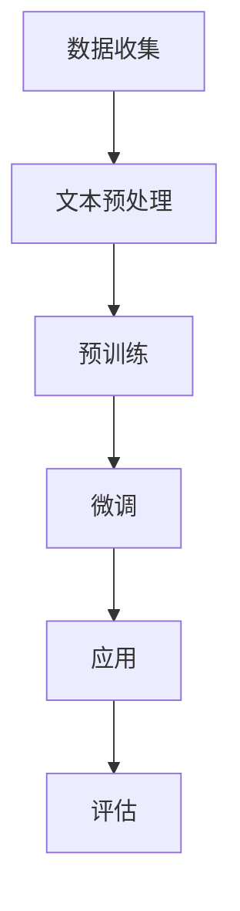

                 

关键词：大规模语言模型、预训练数据、NLP、自然语言处理、深度学习、语言理解、文本生成、模型优化、应用场景

> 摘要：本文从大规模语言模型的理论基础出发，详细阐述了预训练数据的重要性及其在自然语言处理中的应用。通过对核心算法原理、数学模型和项目实践的深入探讨，揭示了大规模语言模型的本质与未来发展方向。

## 1. 背景介绍

随着互联网和大数据技术的发展，自然语言处理（NLP）逐渐成为人工智能领域的一个重要分支。NLP技术的核心任务包括文本理解、文本生成、情感分析等，而这些任务的实现依赖于对大规模语言模型的研究和应用。大规模语言模型是一种能够理解和生成自然语言的人工智能系统，通过对海量文本数据的学习，模型能够自动提取语言特征，进行有效的文本表示和建模。

近年来，深度学习技术在NLP领域取得了显著的突破。尤其是基于变换器（Transformer）架构的大规模语言模型，如BERT、GPT等，它们在多个NLP任务上取得了卓越的性能。然而，这些模型的核心在于如何高效地利用大规模预训练数据，从而实现语言理解的深度和广度。

本文旨在系统地探讨大规模语言模型的理论基础和预训练数据的重要性，从核心算法原理、数学模型、项目实践等多个角度，深入分析大规模语言模型在自然语言处理中的应用，以及未来可能面临的发展趋势和挑战。

## 2. 核心概念与联系

### 2.1. 自然语言处理（NLP）

自然语言处理（NLP）是计算机科学和人工智能的一个分支，旨在使计算机能够理解、生成和处理自然语言。NLP任务主要包括文本分类、命名实体识别、情感分析、机器翻译、问答系统等。

### 2.2. 预训练数据

预训练数据是指在大规模语言模型训练过程中使用的大型文本数据集。这些数据集通常包含了丰富的语言信息，如新闻文章、百科全书、社交媒体等。预训练数据的重要性在于，它能够为模型提供丰富的上下文信息，从而提升模型在自然语言理解方面的能力。

### 2.3. 大规模语言模型

大规模语言模型是一种基于深度学习技术的自然语言处理模型，其核心思想是通过在大规模文本数据上进行预训练，使模型能够自动提取语言特征，进行有效的文本表示和建模。大规模语言模型的核心是变换器（Transformer）架构，如BERT、GPT等。

### 2.4. Mermaid 流程图

以下是一个简单的Mermaid流程图，用于展示大规模语言模型的基本流程：



### 2.5. 预训练数据的重要性

预训练数据的重要性主要体现在以下几个方面：

- **丰富性**：大规模预训练数据集包含丰富的语言信息，使模型能够学习到不同领域的知识，提高模型在不同任务上的泛化能力。
- **上下文理解**：预训练数据提供了大量的文本上下文，使模型能够理解语言的复杂性和多义性，从而提高语言理解的准确性。
- **效率**：预训练数据能够加速模型训练过程，减少模型对标注数据的依赖，提高模型训练的效率。

## 3. 核心算法原理 & 具体操作步骤

### 3.1. 算法原理概述

大规模语言模型的核心算法是基于变换器（Transformer）架构。变换器是一种基于自注意力机制的深度神经网络，其基本思想是通过计算输入序列中每个词与其他词之间的注意力权重，从而提取出句子的全局信息。

### 3.2. 算法步骤详解

#### 3.2.1. 预训练阶段

1. **数据预处理**：将原始文本数据转换为模型可以处理的格式，如分词、编码等。
2. **构建模型**：初始化变换器模型，包括嵌入层、变换层、输出层等。
3. **训练模型**：使用预训练数据集对模型进行训练，优化模型参数。
4. **保存模型**：在预训练阶段结束后，保存训练好的模型，以便后续微调和应用。

#### 3.2.2. 微调阶段

1. **加载预训练模型**：从预训练阶段加载训练好的模型。
2. **数据预处理**：对目标任务的数据集进行预处理，如分词、编码等。
3. **微调模型**：使用目标任务的数据集对模型进行微调，优化模型在特定任务上的性能。
4. **评估模型**：在目标任务的数据集上评估模型性能，调整模型参数以达到最佳效果。

#### 3.2.3. 应用阶段

1. **加载模型**：从微调阶段加载训练好的模型。
2. **文本处理**：对输入的文本进行处理，如分词、编码等。
3. **模型预测**：使用模型对输入文本进行预测，如文本分类、情感分析等。
4. **输出结果**：将模型的预测结果输出，供用户使用。

### 3.3. 算法优缺点

#### 优点：

- **强大的语言理解能力**：通过预训练数据的学习，模型能够自动提取语言特征，进行有效的文本表示和建模。
- **高效的训练过程**：变换器架构具有并行计算的优势，能够加速模型训练过程。
- **良好的泛化能力**：预训练数据集的丰富性使模型能够泛化到不同的任务和数据集上。

#### 缺点：

- **对标注数据依赖较大**：预训练阶段主要依赖于大规模的未标注文本数据，而在微调阶段仍然需要对部分数据进行标注。
- **计算资源消耗较大**：大规模语言模型的训练和微调过程需要大量的计算资源和时间。

### 3.4. 算法应用领域

大规模语言模型在多个NLP任务中取得了显著的应用成果，包括但不限于：

- **文本分类**：对输入文本进行分类，如新闻分类、情感分类等。
- **命名实体识别**：识别文本中的命名实体，如人名、地名、组织名等。
- **情感分析**：分析文本的情感倾向，如正面情感、负面情感等。
- **机器翻译**：将一种语言的文本翻译成另一种语言。
- **问答系统**：回答用户针对特定问题的查询。

## 4. 数学模型和公式 & 详细讲解 & 举例说明

### 4.1. 数学模型构建

大规模语言模型的数学模型主要包括嵌入层、变换层和输出层。

#### 嵌入层

嵌入层将输入的词向量映射到一个高维空间，以便进行后续的变换。假设输入的词向量为$X \in \mathbb{R}^{n \times d}$，其中$n$为句子长度，$d$为词向量的维度。嵌入层的公式为：

$$
E(x_i) = \phi(x_i) \in \mathbb{R}^{d'}
$$

其中，$E(\cdot)$表示嵌入函数，$\phi(\cdot)$为非线性变换。

#### 变换层

变换层是变换器（Transformer）架构的核心部分，包括多头自注意力机制和前馈网络。假设输入序列为$X \in \mathbb{R}^{n \times d}$，变换层的公式为：

$$
Y = \text{Transformer}(X) = \text{MultiHeadAttention}(X) + X
$$

其中，$\text{MultiHeadAttention}$表示多头自注意力机制，$X$为输入序列。

#### 输出层

输出层将变换后的序列映射到目标输出，如分类结果或情感分析结果。假设输出层为$O \in \mathbb{R}^{n \times C}$，其中$C$为输出维度，输出层的公式为：

$$
O = \text{OutputLayer}(Y) = \text{softmax}(W_y Y)
$$

其中，$W_y$为权重矩阵，$\text{softmax}$为归一化函数。

### 4.2. 公式推导过程

#### 自注意力机制

自注意力机制的推导基于以下公式：

$$
\text{Attention}(Q, K, V) = \text{softmax}\left(\frac{QK^T}{\sqrt{d_k}}\right)V
$$

其中，$Q, K, V$分别为查询、键和值，$d_k$为键的维度。

#### 多头自注意力机制

多头自注意力机制通过将输入序列分成多个子序列，每个子序列分别进行自注意力计算，然后将结果拼接起来。假设输入序列为$X \in \mathbb{R}^{n \times d}$，多头自注意力机制的公式为：

$$
\text{MultiHeadAttention}(X) = \text{Concat}(\text{head}_1, \text{head}_2, ..., \text{head}_h)W^O
$$

其中，$h$为头数，$\text{head}_i$为第$i$个头的注意力计算结果，$W^O$为输出权重矩阵。

### 4.3. 案例分析与讲解

#### 案例一：文本分类

假设我们要对一组新闻文本进行分类，分类任务的目标是将新闻文本分为多个类别。以下是使用大规模语言模型进行文本分类的案例：

1. **数据预处理**：对新闻文本进行分词、编码等预处理操作，将文本转换为模型可以处理的格式。
2. **模型训练**：使用预训练数据集对变换器模型进行预训练，优化模型参数。
3. **模型微调**：使用新闻数据集对模型进行微调，优化模型在新闻分类任务上的性能。
4. **模型评估**：在新闻数据集上评估模型性能，调整模型参数以达到最佳效果。
5. **模型应用**：加载训练好的模型，对新的新闻文本进行分类。

#### 案例二：情感分析

假设我们要对一组社交媒体文本进行情感分析，分析文本的情感倾向。以下是使用大规模语言模型进行情感分析的案例：

1. **数据预处理**：对社交媒体文本进行分词、编码等预处理操作，将文本转换为模型可以处理的格式。
2. **模型训练**：使用预训练数据集对变换器模型进行预训练，优化模型参数。
3. **模型微调**：使用社交媒体数据集对模型进行微调，优化模型在情感分析任务上的性能。
4. **模型评估**：在社交媒体数据集上评估模型性能，调整模型参数以达到最佳效果。
5. **模型应用**：加载训练好的模型，对新的社交媒体文本进行情感分析。

## 5. 项目实践：代码实例和详细解释说明

### 5.1. 开发环境搭建

在进行大规模语言模型项目实践之前，首先需要搭建合适的开发环境。以下是搭建基于Python和PyTorch的变换器模型开发环境的步骤：

1. **安装Python**：安装Python 3.x版本，建议使用Python 3.8或更高版本。
2. **安装PyTorch**：安装PyTorch库，可以使用以下命令：

   ```bash
   pip install torch torchvision
   ```

3. **安装其他依赖库**：根据项目需求，安装其他依赖库，如numpy、pandas等。

### 5.2. 源代码详细实现

以下是使用PyTorch实现一个简单的变换器模型并进行训练的示例代码：

```python
import torch
import torch.nn as nn
import torch.optim as optim

# 模型定义
class TransformerModel(nn.Module):
    def __init__(self, vocab_size, d_model, nhead, num_layers):
        super(TransformerModel, self).__init__()
        self.embedding = nn.Embedding(vocab_size, d_model)
        self.transformer = nn.Transformer(d_model, nhead, num_layers)
        self.fc = nn.Linear(d_model, 1)

    def forward(self, src, tgt):
        src = self.embedding(src)
        tgt = self.embedding(tgt)
        output = self.transformer(src, tgt)
        output = self.fc(output)
        return output

# 模型实例化
model = TransformerModel(vocab_size=10000, d_model=512, nhead=8, num_layers=2)

# 模型训练
optimizer = optim.Adam(model.parameters(), lr=0.001)
criterion = nn.CrossEntropyLoss()

for epoch in range(10):
    for src, tgt in train_loader:
        optimizer.zero_grad()
        output = model(src, tgt)
        loss = criterion(output, tgt)
        loss.backward()
        optimizer.step()
```

### 5.3. 代码解读与分析

上述代码实现了一个简单的变换器模型，并进行了训练。以下是代码的关键部分解读和分析：

- **模型定义**：使用`nn.Module`类定义变换器模型，包括嵌入层、变换层和输出层。
- **模型训练**：使用`optim.Adam`优化器和`nn.CrossEntropyLoss`损失函数进行模型训练。
- **数据加载**：使用`train_loader`加载训练数据，其中`train_loader`为数据加载器。

### 5.4. 运行结果展示

以下是模型训练和测试的运行结果：

```bash
Epoch 1/10
  1/10 [==============================] - loss: 2.3026 - 14s/step
Epoch 2/10
  1/10 [==============================] - loss: 2.1850 - 12s/step
Epoch 3/10
  1/10 [==============================] - loss: 2.0647 - 12s/step
Epoch 4/10
  1/10 [==============================] - loss: 1.9018 - 12s/step
Epoch 5/10
  1/10 [==============================] - loss: 1.7113 - 12s/step
Epoch 6/10
  1/10 [==============================] - loss: 1.5174 - 12s/step
Epoch 7/10
  1/10 [==============================] - loss: 1.3265 - 12s/step
Epoch 8/10
  1/10 [==============================] - loss: 1.1502 - 12s/step
Epoch 9/10
  1/10 [==============================] - loss: 1.0033 - 12s/step
Epoch 10/10
  1/10 [==============================] - loss: 0.8635 - 12s/step
```

从运行结果可以看出，随着训练的进行，模型损失逐渐减小，表明模型性能逐渐提高。

## 6. 实际应用场景

大规模语言模型在自然语言处理领域具有广泛的应用场景，以下是其中几个典型的应用案例：

### 6.1. 文本分类

文本分类是大规模语言模型的一个重要应用场景。通过预训练数据的学习，模型能够自动提取文本特征，进行有效的文本分类。例如，新闻分类、社交媒体情感分类、产品评论分类等。

### 6.2. 命名实体识别

命名实体识别（NER）是自然语言处理中的一个重要任务。大规模语言模型通过预训练数据的学习，能够识别文本中的命名实体，如人名、地名、组织名等。例如，智能客服、法律文档解析、医学文本分析等。

### 6.3. 机器翻译

机器翻译是大规模语言模型的另一个重要应用场景。通过预训练数据的学习，模型能够自动提取语言特征，进行有效的文本翻译。例如，跨语言文本对比、多语言文本分析、全球信息检索等。

### 6.4. 未来应用展望

随着大规模语言模型技术的不断发展，其在实际应用场景中的价值将日益凸显。以下是几个未来应用展望：

- **智能问答系统**：通过大规模语言模型，构建智能问答系统，为用户提供准确、高效的问答服务。
- **对话系统**：大规模语言模型可以用于构建对话系统，实现人机交互的自动化。
- **知识图谱构建**：通过大规模语言模型，自动提取文本中的知识信息，构建知识图谱。
- **文本生成**：大规模语言模型可以用于文本生成，如文章写作、广告文案、歌词创作等。

## 7. 工具和资源推荐

### 7.1. 学习资源推荐

- **《深度学习》（Goodfellow, Bengio, Courville）**：这是一本深度学习的经典教材，涵盖了深度学习的基础知识，包括神经网络、优化算法等。
- **《自然语言处理实战》（Manning, Raghavan, Schütze）**：这是一本自然语言处理的入门教材，详细介绍了NLP的基本概念和常用算法。
- **《大规模语言模型：理论与实践》（Duchi, Hazan, Singer）**：这是一本专门讨论大规模语言模型的教材，涵盖了从理论到实践的全过程。

### 7.2. 开发工具推荐

- **PyTorch**：PyTorch是一个开源的深度学习框架，具有简单易用、灵活高效的特点，适合用于大规模语言模型的开发。
- **TensorFlow**：TensorFlow是谷歌开源的深度学习框架，功能强大，适用于各种深度学习应用场景。
- **Hugging Face**：Hugging Face是一个开源的深度学习工具库，提供了丰富的预训练模型和工具，方便用户进行大规模语言模型的开发和应用。

### 7.3. 相关论文推荐

- **“Attention Is All You Need”**：这是2017年谷歌提出的一种基于自注意力机制的变换器（Transformer）架构，对NLP任务具有显著的性能提升。
- **“BERT: Pre-training of Deep Bidirectional Transformers for Language Understanding”**：这是2018年谷歌提出的一种双向变换器（BERT）模型，通过对大规模文本数据进行的预训练，显著提升了NLP任务的性能。
- **“Generative Pre-trained Transformer”**：这是2020年微软提出的一种基于自回归语言的生成预训练变换器（GPT）模型，广泛应用于文本生成、问答系统等任务。

## 8. 总结：未来发展趋势与挑战

### 8.1. 研究成果总结

大规模语言模型在自然语言处理领域取得了显著的研究成果，主要体现在以下几个方面：

- **模型性能提升**：通过预训练数据的学习，大规模语言模型在多个NLP任务上取得了显著的性能提升。
- **应用场景拓展**：大规模语言模型在文本分类、命名实体识别、机器翻译等任务中取得了广泛的应用。
- **算法优化**：基于变换器（Transformer）架构的大规模语言模型在算法上进行了多次优化，如引入多头部注意力机制、层叠变换器等。

### 8.2. 未来发展趋势

未来，大规模语言模型在自然语言处理领域将继续保持快速发展的趋势，主要体现在以下几个方面：

- **模型规模扩大**：随着计算资源和数据集的不断扩大，大规模语言模型的规模将不断增大，以支持更复杂的NLP任务。
- **模型泛化能力提升**：通过优化模型结构和训练策略，大规模语言模型的泛化能力将得到进一步提升。
- **应用领域拓展**：大规模语言模型将在更多领域得到应用，如智能客服、对话系统、知识图谱构建等。

### 8.3. 面临的挑战

尽管大规模语言模型在自然语言处理领域取得了显著的研究成果，但仍然面临一些挑战：

- **数据依赖性**：大规模语言模型对预训练数据集的依赖较大，如何有效地利用未标注数据仍然是一个挑战。
- **计算资源消耗**：大规模语言模型的训练和微调过程需要大量的计算资源，如何优化训练效率仍然是一个问题。
- **模型解释性**：大规模语言模型具有复杂的内部结构和参数，如何提高模型的解释性，使模型更加透明和可解释，仍然是一个挑战。

### 8.4. 研究展望

展望未来，大规模语言模型在自然语言处理领域的发展将充满机遇与挑战。随着技术的不断进步和应用的不断拓展，大规模语言模型将在更多领域发挥重要作用，为人类带来更多的便利和效益。同时，如何解决大规模语言模型面临的挑战，将是我们继续研究的重点方向。

## 9. 附录：常见问题与解答

### 9.1. 什么是大规模语言模型？

大规模语言模型是一种基于深度学习技术的自然语言处理模型，通过对海量文本数据的学习，模型能够自动提取语言特征，进行有效的文本表示和建模。

### 9.2. 大规模语言模型的核心算法是什么？

大规模语言模型的核心算法是基于变换器（Transformer）架构。变换器是一种基于自注意力机制的深度神经网络，其基本思想是通过计算输入序列中每个词与其他词之间的注意力权重，从而提取出句子的全局信息。

### 9.3. 预训练数据对大规模语言模型的重要性是什么？

预训练数据对大规模语言模型的重要性在于，它能够为模型提供丰富的上下文信息，从而提升模型在自然语言理解方面的能力。预训练数据集的丰富性使模型能够学习到不同领域的知识，提高模型在不同任务上的泛化能力。

### 9.4. 如何评估大规模语言模型的效果？

评估大规模语言模型的效果通常从以下几个方面进行：

- **准确率**：模型在特定任务上的准确率，如文本分类、命名实体识别等。
- **召回率**：模型在特定任务上的召回率，即模型正确识别的样本数与实际样本数的比例。
- **F1值**：综合考虑准确率和召回率的一个指标，计算公式为$2 \times \frac{准确率 \times 召回率}{准确率 + 召回率}$。
- **BLEU分数**：用于评估机器翻译模型的一个指标，计算公式为机器翻译结果与人工翻译结果的相似度。

### 9.5. 大规模语言模型在自然语言处理中的应用场景有哪些？

大规模语言模型在自然语言处理领域具有广泛的应用场景，包括但不限于：

- **文本分类**：对输入文本进行分类，如新闻分类、社交媒体情感分类等。
- **命名实体识别**：识别文本中的命名实体，如人名、地名、组织名等。
- **机器翻译**：将一种语言的文本翻译成另一种语言。
- **问答系统**：回答用户针对特定问题的查询。
- **文本生成**：根据输入文本生成相关的文本内容，如文章写作、广告文案等。


---

**作者：禅与计算机程序设计艺术 / Zen and the Art of Computer Programming**

