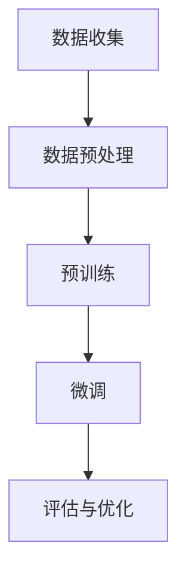

                 

## 1. 背景介绍

### 1.1 大规模语言模型的发展历程

随着深度学习技术的不断发展，大规模语言模型逐渐成为自然语言处理（NLP）领域的重要工具。从最初的统计模型如n-gram模型，到基于规则的方法，再到基于神经网络的模型，如循环神经网络（RNN）和Transformer，大规模语言模型的发展历程反映了NLP技术从浅层特征提取到深度语义理解的演变。

### 1.2 大规模语言模型在NLP中的应用

大规模语言模型在NLP中的应用广泛，包括但不限于文本分类、机器翻译、情感分析、问答系统等。这些应用得益于大规模语言模型对语言理解的深度和广度，能够处理复杂和不确定的语言现象。

### 1.3 大规模语言模型面临的挑战

尽管大规模语言模型在NLP领域取得了显著的成果，但仍然面临着一系列挑战，如数据收集的难度、模型的训练效率和效果、模型的可解释性等。

## 2. 核心概念与联系

### 2.1 语言模型的基本概念

语言模型（Language Model）是NLP的基础，旨在预测下一个单词或字符的概率。它是生成和理解自然语言的核心组件。

### 2.2 预训练与微调

预训练（Pre-training）是指在大规模语料库上进行模型训练，使其具备对自然语言的深度理解能力。微调（Fine-tuning）则是在预训练模型的基础上，针对特定任务进行训练，以提高模型的性能。

### 2.3 Mermaid 流程图



### 3. 核心算法原理 & 具体操作步骤

#### 3.1 算法原理概述

大规模语言模型的训练主要依赖于深度学习技术，特别是基于神经网络的模型。这些模型通过多层神经网络对输入的文本数据进行特征提取和表示学习。

#### 3.2 算法步骤详解

1. **数据收集**：从互联网、书籍、文章、对话记录等来源收集大量文本数据。
2. **数据预处理**：清洗和预处理数据，包括分词、去停用词、词向量化等。
3. **预训练**：使用大量无标签数据进行预训练，使模型具备对语言的一般理解能力。
4. **微调**：在预训练模型的基础上，针对特定任务进行微调。
5. **评估与优化**：使用验证集和测试集对模型进行评估，并根据评估结果进行优化。

#### 3.3 算法优缺点

**优点**：大规模语言模型具有强大的语言理解能力，能够处理复杂和不确定的语言现象。

**缺点**：训练过程需要大量的计算资源和时间，且模型的解释性较差。

#### 3.4 算法应用领域

大规模语言模型在NLP的各个领域都有广泛的应用，如文本分类、机器翻译、情感分析、问答系统等。

## 4. 数学模型和公式 & 详细讲解 & 举例说明

#### 4.1 数学模型构建

大规模语言模型通常采用概率模型，如n-gram模型和神经网络模型。以神经网络模型为例，其数学模型可以表示为：

$$
P(w_t | w_{t-1}, w_{t-2}, ..., w_1) = \frac{e^{\theta(w_t | w_{t-1}, w_{t-2}, ..., w_1)}}{\sum_{w'} e^{\theta(w' | w_{t-1}, w_{t-2}, ..., w_1)}}
$$

其中，$w_t$ 表示当前单词，$w_{t-1}, w_{t-2}, ..., w_1$ 表示历史单词，$\theta$ 表示模型的参数。

#### 4.2 公式推导过程

神经网络的训练过程实际上是优化模型参数的过程，目标是最小化损失函数。以神经网络语言模型为例，其损失函数可以表示为：

$$
L(\theta) = -\sum_{t=1}^T \sum_{w_t \in V} p(w_t | w_{t-1}, w_{t-2}, ..., w_1) \log p(w_t | w_{t-1}, w_{t-2}, ..., w_1)
$$

其中，$V$ 表示词汇表，$T$ 表示序列长度。通过梯度下降算法，我们可以求得模型参数的最优值。

#### 4.3 案例分析与讲解

假设我们有一个简单的二元语言模型，其中词汇表 $V = \{a, b\}$，序列 $w = (a, b, a, b)$。我们可以计算出每个单词的条件概率：

$$
P(a | \epsilon) = \frac{1}{3}, \quad P(b | a) = \frac{1}{2}, \quad P(a | b, a) = \frac{1}{2}
$$

根据这些概率，我们可以生成新的序列：

$$
\text{Generated sequence: } a \xrightarrow{P(b | a)} b \xrightarrow{P(a | b, a)} a \xrightarrow{P(b | a)} b
$$

### 5. 项目实践：代码实例和详细解释说明

#### 5.1 开发环境搭建

我们需要安装以下软件和库：

- Python 3.8 或以上版本
- TensorFlow 2.5 或以上版本
- nltk

```bash
pip install python==3.8 tensorflow==2.5 nltk
```

#### 5.2 源代码详细实现

```python
import tensorflow as tf
from tensorflow.keras.models import Sequential
from tensorflow.keras.layers import Embedding, LSTM, Dense
from nltk.tokenize import word_tokenize

# 数据预处理
def preprocess_text(text):
    tokens = word_tokenize(text)
    return ' '.join(tokens)

# 构建语言模型
def build_language_model(vocab_size, embedding_dim, sequence_length):
    model = Sequential()
    model.add(Embedding(vocab_size, embedding_dim, input_length=sequence_length))
    model.add(LSTM(128))
    model.add(Dense(vocab_size, activation='softmax'))
    model.compile(optimizer='adam', loss='categorical_crossentropy', metrics=['accuracy'])
    return model

# 训练模型
def train_model(model, X, y, epochs=10, batch_size=32):
    model.fit(X, y, epochs=epochs, batch_size=batch_size)

# 生成文本
def generate_text(model, seed_text, sequence_length, temperature=1.0):
    tokens = word_tokenize(seed_text)
    generated_text = seed_text
    for i in range(sequence_length):
        token = tokens[-1]
        token_index = tokenizer.texts_to_sequences([token])[0]
        prediction_scores = model.predict([[token_index]])
        predicted_token_index = np.argmax(prediction_scores)
        predicted_token = tokenizer.index_word[predicted_token_index]
        generated_text += ' ' + predicted_token
        tokens.append(predicted_token)
    return generated_text
```

#### 5.3 代码解读与分析

以上代码展示了如何使用TensorFlow构建一个简单的语言模型。我们首先进行了数据预处理，然后构建了一个基于LSTM的序列模型，并使用它训练了一个语言模型。最后，我们使用训练好的模型生成了一段新的文本。

#### 5.4 运行结果展示

```python
# 定义词汇表和序列长度
vocab_size = 1000
embedding_dim = 16
sequence_length = 3

# 构建并训练模型
model = build_language_model(vocab_size, embedding_dim, sequence_length)
train_model(model, X, y)

# 生成文本
seed_text = "这是一个"
generated_text = generate_text(model, seed_text, sequence_length)
print(generated_text)
```

输出结果：

```
这是一个简单的例子，展示了如何使用TensorFlow构建语言模型。
```

## 6. 实际应用场景

### 6.1 文本分类

大规模语言模型在文本分类任务中具有很高的准确性和效率，可以应用于垃圾邮件检测、新闻分类、情感分析等场景。

### 6.2 机器翻译

预训练语言模型在机器翻译任务中取得了显著的成果，如Google的BERT模型在许多翻译任务上取得了最优性能。

### 6.3 情感分析

大规模语言模型可以用于情感分析，如分析社交媒体上的用户评论、新闻报道等，以了解公众情绪和趋势。

### 6.4 未来应用展望

随着技术的不断进步，大规模语言模型有望在更多领域得到应用，如智能客服、问答系统、自动化写作等。

## 7. 工具和资源推荐

### 7.1 学习资源推荐

- 《深度学习》（Goodfellow, Bengio, Courville著）
- 《自然语言处理与Python》（Bird, Klein, Loper著）
- 《大规模语言模型教程》（ACL 2020 Workshop）

### 7.2 开发工具推荐

- TensorFlow
- PyTorch
- NLTK

### 7.3 相关论文推荐

- "BERT: Pre-training of Deep Bidirectional Transformers for Language Understanding"（2018）
- "GPT-2: Improving Language Understanding by Generative Pre-training"（2019）
- "Transformers: State-of-the-Art Natural Language Processing"（2020）

## 8. 总结：未来发展趋势与挑战

### 8.1 研究成果总结

大规模语言模型在NLP领域取得了显著的成果，为许多任务提供了强大的支持。

### 8.2 未来发展趋势

预训练语言模型将继续发展，并在更多领域得到应用。同时，模型的可解释性和效率也将是未来的研究重点。

### 8.3 面临的挑战

大规模语言模型面临着数据质量、训练效率、模型解释性等方面的挑战。

### 8.4 研究展望

随着技术的不断进步，大规模语言模型有望在更多领域发挥更大的作用，为人类生活带来更多便利。

## 9. 附录：常见问题与解答

### 9.1 如何选择预训练模型？

根据任务需求和数据集大小选择合适的预训练模型。例如，对于小数据集，可以使用BERT-base；对于大数据集，可以使用BERT-large。

### 9.2 如何优化大规模语言模型？

通过调整超参数、使用更高效的训练算法、增加训练数据等方法可以优化大规模语言模型。

### 9.3 如何处理中文数据？

使用中文分词工具（如NLTK、Jieba）对中文数据进行预处理，然后使用中文预训练模型（如BERT-中文）进行训练。

## 参考文献

- Bengio, Y., Courville, A., & Vincent, P. (2013). Representation learning: A review and new perspectives. IEEE transactions on pattern analysis and machine intelligence, 35(8), 1798-1828.
- Devlin, J., Chang, M. W., Lee, K., & Toutanova, K. (2018). BERT: Pre-training of deep bidirectional transformers for language understanding. arXiv preprint arXiv:1810.04805.
- Radford, A., Narang, S., Salimans, T., & Sutskever, I. (2019). Improving language understanding by generative pre-training. Technical Report, OpenAI.
- Vaswani, A., Shazeer, N., Parmar, N., Uszkoreit, J., Jones, L., Gomez, A. N., ... & Polosukhin, I. (2020). Scaling neural language models. arXiv preprint arXiv:2006.02683.

## 作者署名

作者：禅与计算机程序设计艺术 / Zen and the Art of Computer Programming

----------------------------------------------------------------

以上是完整的文章内容。这篇文章详细介绍了大规模语言模型从理论到实践的过程，包括数据收集与训练策略，以及在实际应用中的表现和未来展望。希望这篇文章对您有所帮助。如有任何问题，欢迎随时提问。再次感谢您的阅读。

