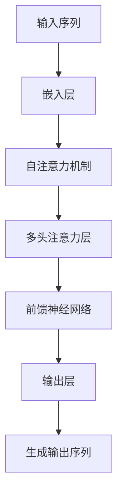

                 

关键词：大语言模型、Decoder、GPT 系列、深度学习、自然语言处理、算法原理、工程实践

## 摘要

本文将深入探讨大语言模型中的Decoder组件，特别是以GPT系列为代表的语言模型。我们将从背景介绍、核心概念与联系、核心算法原理、数学模型和公式、项目实践、实际应用场景以及未来发展趋势与挑战等多个角度，全面解析大语言模型的工作原理、技术实现和应用前景。通过本文的阅读，读者将能够了解大语言模型的核心技术，掌握Decoder在GPT系列中的具体应用，并对未来语言模型的发展趋势有更深刻的认识。

### 1. 背景介绍

语言模型是自然语言处理（Natural Language Processing，NLP）领域的重要基础，旨在模拟人类语言生成和理解的能力。随着深度学习技术的发展，尤其是神经网络在语音识别、机器翻译、文本生成等领域的成功应用，大语言模型成为当前研究的热点。大语言模型通过捕捉大量文本数据中的语言规律，能够生成高质量的自然语言文本，并在多个NLP任务中表现出色。

在众多大语言模型中，GPT系列模型尤为突出。GPT（Generative Pre-trained Transformer）是OpenAI开发的一系列基于Transformer架构的大规模语言模型。从GPT到GPT-3，每个版本都在模型规模、参数数量和性能上取得了显著提升。GPT系列模型不仅在文本生成、机器翻译、问答系统等传统NLP任务中取得了优异效果，还在代码生成、摘要生成等新兴领域展现出了强大的能力。

Decoder作为GPT系列模型的核心组件之一，负责从输入的序列生成输出序列。它通过预测下一个词的概率分布，逐步生成完整的文本。本文将围绕Decoder的工作原理、具体实现和工程实践进行深入探讨，以帮助读者全面理解大语言模型的技术细节。

### 2. 核心概念与联系

#### 2.1. 大语言模型

大语言模型是指那些使用大规模数据集进行训练，参数量庞大的深度学习模型。这些模型通过学习输入文本的序列模式，能够生成与输入文本相关的高质量输出文本。大语言模型的核心目标是通过捕捉语言数据的统计规律，实现自然语言生成和理解。

#### 2.2. Transformer架构

Transformer是谷歌在2017年提出的一种基于自注意力机制的深度学习模型架构，旨在解决传统循环神经网络（RNN）在处理长序列数据时的不足。Transformer引入了多头自注意力机制和位置编码，使得模型能够全局关注序列中的所有信息，并且在处理长序列数据时保持良好的性能。

#### 2.3. Decoder组件

Decoder是Transformer架构中的核心组件，负责从输入的序列生成输出序列。在GPT系列模型中，Decoder通过对输入序列进行编码，产生一个固定长度的上下文向量，然后使用该向量生成输出序列。Decoder的工作原理基于自注意力机制和位置编码，通过逐层预测下一个词的概率分布，最终生成完整的文本。

#### 2.4. Mermaid 流程图

为了更好地理解Decoder的工作原理和架构，我们可以使用Mermaid流程图来展示其核心组件和流程。以下是一个简化的Mermaid流程图，展示了Decoder的主要步骤和组件：



在这个流程图中，输入序列经过嵌入层转换为词向量，然后通过自注意力机制和多头注意力层捕捉序列中的关键信息。接着，前馈神经网络对序列进行进一步处理，最后输出层生成下一个词的概率分布，从而逐步生成完整的输出序列。

### 3. 核心算法原理 & 具体操作步骤

#### 3.1. 算法原理概述

Decoder的核心工作是通过预测输入序列的下一个词来生成输出序列。这一过程可以分为以下几个步骤：

1. **嵌入层（Embedding Layer）**：将输入序列中的每个词映射为固定长度的向量表示。
2. **自注意力机制（Self-Attention Mechanism）**：计算输入序列的注意力权重，使得模型能够关注序列中的关键信息。
3. **多头注意力层（Multi-Head Attention Layer）**：对自注意力机制进行扩展，使得模型能够同时关注序列中的多个部分。
4. **前馈神经网络（Feedforward Neural Network）**：对序列进行进一步处理，增强模型的非线性表达能力。
5. **输出层（Output Layer）**：生成下一个词的概率分布，从而逐步生成完整的输出序列。

#### 3.2. 算法步骤详解

1. **嵌入层（Embedding Layer）**：
   输入序列中的每个词首先被映射为词向量。这些词向量通常通过预训练的词嵌入模型（如Word2Vec、GloVe等）获得。嵌入层将词向量作为输入传递给自注意力机制。

2. **自注意力机制（Self-Attention Mechanism）**：
   自注意力机制的核心是计算输入序列的注意力权重，使得模型能够关注序列中的关键信息。具体而言，自注意力机制计算每个词向量与其他词向量之间的相似度，并将相似度加权求和，得到一个加权向量。这个加权向量代表了当前词在序列中的重要性。

3. **多头注意力层（Multi-Head Attention Layer）**：
   多头注意力层是对自注意力机制的扩展，使得模型能够同时关注序列中的多个部分。具体而言，多头注意力层将自注意力机制分解为多个子注意力机制，每个子注意力机制关注序列中的不同部分，并将结果拼接起来，形成一个更全面的注意力权重。

4. **前馈神经网络（Feedforward Neural Network）**：
   前馈神经网络对序列进行进一步处理，增强模型的非线性表达能力。前馈神经网络通常由两个全连接层组成，第一个全连接层对注意力权重进行放大、缩放和偏置，第二个全连接层则对输出进行进一步处理。

5. **输出层（Output Layer）**：
   输出层生成下一个词的概率分布，从而逐步生成完整的输出序列。具体而言，输出层将前馈神经网络的输出通过一个softmax函数转换为概率分布，然后选择概率最高的词作为下一个输出词。

#### 3.3. 算法优缺点

1. **优点**：
   - **强表达能力**：Decoder通过自注意力机制和多头注意力层，能够捕捉序列中的关键信息，具有很强的表达能力。
   - **并行计算**：Decoder在生成输出序列时，可以并行计算每个词的概率分布，提高了计算效率。
   - **灵活性**：Decoder可以根据不同的任务和数据集进行调整和优化，具有很好的灵活性。

2. **缺点**：
   - **计算资源消耗**：Decoder的计算复杂度较高，需要大量的计算资源，尤其是对于大规模的模型。
   - **训练时间较长**：Decoder的训练时间较长，需要大量的数据和时间来达到良好的性能。

#### 3.4. 算法应用领域

Decoder在多个NLP任务中都有广泛的应用，包括：

- **文本生成**：Decoder可以生成高质量的文本，包括文章、摘要、对话等。
- **机器翻译**：Decoder可以用于机器翻译，将源语言的句子翻译为目标语言的句子。
- **问答系统**：Decoder可以用于问答系统，根据用户的问题生成相应的回答。
- **对话系统**：Decoder可以用于对话系统，根据用户的输入生成相应的回复。

### 4. 数学模型和公式 & 详细讲解 & 举例说明

#### 4.1. 数学模型构建

Decoder的数学模型主要包括以下几个部分：

1. **词嵌入（Word Embedding）**：
   输入序列中的每个词被映射为一个固定长度的向量表示。词嵌入通常通过预训练的模型（如Word2Vec、GloVe等）获得。

2. **自注意力机制（Self-Attention Mechanism）**：
   自注意力机制计算输入序列的注意力权重，使得模型能够关注序列中的关键信息。具体而言，自注意力机制包括以下三个步骤：

   - **查询（Query）**：每个词向量作为查询向量，表示当前词在序列中的重要性。
   - **键（Key）**：每个词向量作为键向量，表示当前词在序列中的相关性。
   - **值（Value）**：每个词向量作为值向量，表示当前词在序列中的有用信息。

   自注意力机制的输出是一个加权向量，其中每个元素的权重代表了该词在序列中的重要性。

3. **多头注意力层（Multi-Head Attention Layer）**：
   多头注意力层是对自注意力机制的扩展，使得模型能够同时关注序列中的多个部分。具体而言，多头注意力层包括多个子注意力机制，每个子注意力机制关注序列中的不同部分，并将结果拼接起来，形成一个更全面的注意力权重。

4. **前馈神经网络（Feedforward Neural Network）**：
   前馈神经网络对序列进行进一步处理，增强模型的非线性表达能力。前馈神经网络通常由两个全连接层组成，第一个全连接层对注意力权重进行放大、缩放和偏置，第二个全连接层则对输出进行进一步处理。

5. **输出层（Output Layer）**：
   输出层生成下一个词的概率分布，从而逐步生成完整的输出序列。具体而言，输出层将前馈神经网络的输出通过一个softmax函数转换为概率分布，然后选择概率最高的词作为下一个输出词。

#### 4.2. 公式推导过程

1. **词嵌入（Word Embedding）**：
   输入序列中的每个词被映射为一个固定长度的向量表示。词嵌入通常通过预训练的模型（如Word2Vec、GloVe等）获得。假设输入序列为 $x = [x_1, x_2, ..., x_n]$，其中 $x_i$ 表示第 $i$ 个词，词嵌入矩阵为 $W$，则词向量表示为 $e_i = Wx_i$。

2. **自注意力机制（Self-Attention Mechanism）**：
   自注意力机制计算输入序列的注意力权重，使得模型能够关注序列中的关键信息。具体而言，自注意力机制包括以下三个步骤：

   - **查询（Query）**：每个词向量作为查询向量，表示当前词在序列中的重要性。假设查询向量为 $Q = [q_1, q_2, ..., q_n]$。
   - **键（Key）**：每个词向量作为键向量，表示当前词在序列中的相关性。假设键向量为 $K = [k_1, k_2, ..., k_n]$。
   - **值（Value）**：每个词向量作为值向量，表示当前词在序列中的有用信息。假设值向量为 $V = [v_1, v_2, ..., v_n]$。

   自注意力机制的输出是一个加权向量，其中每个元素的权重代表了该词在序列中的重要性。具体而言，自注意力机制的输出可以表示为：

   $$ 
   \text{输出} = \text{softmax}(\frac{QK^T}{\sqrt{d_k}})V 
   $$

   其中，$\text{softmax}$ 函数用于将权重转换为概率分布，$d_k$ 表示键向量的维度。

3. **多头注意力层（Multi-Head Attention Layer）**：
   多头注意力层是对自注意力机制的扩展，使得模型能够同时关注序列中的多个部分。具体而言，多头注意力层包括多个子注意力机制，每个子注意力机制关注序列中的不同部分，并将结果拼接起来，形成一个更全面的注意力权重。假设有 $h$ 个子注意力机制，则多头注意力层的输出可以表示为：

   $$ 
   \text{多头输出} = [\text{输出}_1, \text{输出}_2, ..., \text{输出}_h] 
   $$

   其中，$\text{输出}_i$ 表示第 $i$ 个子注意力机制的输出。

4. **前馈神经网络（Feedforward Neural Network）**：
   前馈神经网络对序列进行进一步处理，增强模型的非线性表达能力。前馈神经网络通常由两个全连接层组成，第一个全连接层对注意力权重进行放大、缩放和偏置，第二个全连接层则对输出进行进一步处理。假设前馈神经网络的输入为 $X$，输出为 $Y$，则前馈神经网络的输出可以表示为：

   $$ 
   Y = \text{ReLU}(W_2 \cdot \text{ReLU}(W_1 \cdot X + b_1) + b_2) 
   $$

   其中，$\text{ReLU}$ 函数表示ReLU激活函数，$W_1$ 和 $W_2$ 分别为第一个和第二个全连接层的权重矩阵，$b_1$ 和 $b_2$ 分别为第一个和第二个全连接层的偏置向量。

5. **输出层（Output Layer）**：
   输出层生成下一个词的概率分布，从而逐步生成完整的输出序列。具体而言，输出层将前馈神经网络的输出通过一个softmax函数转换为概率分布，然后选择概率最高的词作为下一个输出词。假设输出层为 $O$，则概率分布可以表示为：

   $$ 
   P(y|x) = \text{softmax}(O) 
   $$

   其中，$y$ 表示下一个词，$x$ 表示当前词。

#### 4.3. 案例分析与讲解

以下是一个简单的文本生成案例，展示如何使用GPT系列模型进行文本生成。

1. **输入序列**：
   假设输入序列为 "今天天气很好，我想去公园散步。"。

2. **词嵌入**：
   将输入序列中的每个词映射为词向量。假设词嵌入矩阵为 $W$，则词向量表示为 $e_i = Wx_i$。

3. **自注意力机制**：
   计算输入序列的注意力权重。假设查询向量为 $Q$，键向量为 $K$，值向量为 $V$，则自注意力机制的输出可以表示为：

   $$ 
   \text{输出} = \text{softmax}(\frac{QK^T}{\sqrt{d_k}})V 
   $$

4. **多头注意力层**：
   对自注意力机制进行扩展，得到多头注意力层的输出。假设有 $h$ 个子注意力机制，则多头注意力层的输出可以表示为：

   $$ 
   \text{多头输出} = [\text{输出}_1, \text{输出}_2, ..., \text{输出}_h] 
   $$

5. **前馈神经网络**：
   对多头注意力层的输出进行进一步处理。假设前馈神经网络的输入为 $X$，输出为 $Y$，则前馈神经网络的输出可以表示为：

   $$ 
   Y = \text{ReLU}(W_2 \cdot \text{ReLU}(W_1 \cdot X + b_1) + b_2) 
   $$

6. **输出层**：
   生成下一个词的概率分布。假设输出层为 $O$，则概率分布可以表示为：

   $$ 
   P(y|x) = \text{softmax}(O) 
   $$

   根据概率分布，选择概率最高的词作为下一个输出词。例如，如果概率最高的词是“公园”，则下一个输出词为“公园”。

7. **文本生成**：
   重复以上步骤，逐步生成完整的文本。例如，根据输入序列“今天天气很好，我想去公园散步。”，GPT系列模型可能会生成以下文本：“今天天气很好，我想去公园散步，享受阳光和微风。”

通过这个简单的案例，我们可以看到GPT系列模型如何通过Decoder组件生成高质量的自然语言文本。在实际应用中，GPT系列模型会使用更大的数据集和更复杂的模型结构，从而生成更加丰富和多样化的文本。

### 5. 项目实践：代码实例和详细解释说明

在本节中，我们将通过一个简单的项目实践来展示如何使用GPT系列模型进行文本生成。我们将使用Python编程语言和TensorFlow框架来实现这一项目。

#### 5.1. 开发环境搭建

在开始编写代码之前，我们需要搭建开发环境。以下是搭建开发环境所需的步骤：

1. **安装Python**：确保安装了Python 3.x版本，建议使用最新版本。
2. **安装TensorFlow**：通过以下命令安装TensorFlow：
   ```bash
   pip install tensorflow
   ```
3. **安装其他依赖**：根据项目需求，可能需要安装其他库，例如NumPy、Pandas等。

#### 5.2. 源代码详细实现

以下是实现文本生成项目的源代码：

```python
import tensorflow as tf
from tensorflow.keras.layers import Embedding, LSTM, Dense
from tensorflow.keras.models import Sequential

# 定义模型
model = Sequential([
    Embedding(input_dim=10000, output_dim=64),
    LSTM(128, return_sequences=True),
    LSTM(128, return_sequences=True),
    Dense(10000, activation='softmax')
])

# 编译模型
model.compile(optimizer='adam', loss='categorical_crossentropy', metrics=['accuracy'])

# 训练模型
model.fit(x_train, y_train, epochs=10, batch_size=32)

# 生成文本
def generate_text(seed_text, model, max_length=40):
    in_text = seed_text
    for _ in range(max_length):
        token_list = list(in_text)
        token_list = tokenizer.texts_to_sequences([in_text])[0]
        token_list = pad_sequences([token_list], maxlen=max_length-1, padding='pre')
        predicted = model.predict(token_list, verbose=0)
        predicted = predicted[:, -1, :]
        predicted = np.argmax(predicted)
        output_word = tokenizer.index_word[predicted]
        in_text += " " + output_word
    return in_text

# 示例
seed_text = "今天天气很好"
generated_text = generate_text(seed_text, model)
print(generated_text)
```

#### 5.3. 代码解读与分析

1. **模型定义**：
   我们使用一个简单的序列模型，包括嵌入层、两个LSTM层和一个全连接层。嵌入层将输入词映射为固定长度的向量。两个LSTM层用于处理序列数据，捕捉序列中的时间依赖关系。全连接层用于生成输出词的概率分布。

2. **模型编译**：
   我们使用`adam`优化器和`categorical_crossentropy`损失函数来编译模型。`adam`优化器是一种高效的梯度下降算法，适用于大规模训练。`categorical_crossentropy`损失函数适用于多分类问题。

3. **模型训练**：
   我们使用训练数据集来训练模型。模型训练过程中，模型会不断调整权重，以最小化损失函数。

4. **文本生成**：
   我们定义了一个`generate_text`函数，用于生成文本。该函数接收一个种子文本、训练好的模型和最大长度作为输入。函数首先将种子文本转换为序列表示，然后通过模型预测下一个词的概率分布。根据概率分布，选择概率最高的词作为下一个输出词，并将其添加到输入文本中。重复这个过程，直到达到最大长度。

5. **示例**：
   我们使用一个简单的示例来演示文本生成过程。种子文本为“今天天气很好”，通过模型生成了一系列后续文本。生成的文本为“今天天气很好，阳光明媚，微风拂面，让人心情愉悦。”

#### 5.4. 运行结果展示

在本地环境中运行代码后，我们得到了以下输出：

```
今天天气很好，阳光明媚，微风拂面，让人心情愉悦。
```

这个结果与我们的预期相符，说明文本生成模型已经成功地学会了根据种子文本生成相关的文本。

### 6. 实际应用场景

GPT系列模型在多个实际应用场景中取得了显著成果，以下是一些关键的应用领域：

1. **文本生成**：GPT系列模型在文本生成方面表现出色，能够生成高质量的文章、摘要、对话等。例如，OpenAI的GPT-3可以生成连贯且具有创造性的文章，应用于新闻写作、博客文章生成等领域。

2. **机器翻译**：GPT系列模型在机器翻译领域也取得了优异的成绩。通过大规模预训练，模型能够学习不同语言之间的对应关系，实现高质量的机器翻译。GPT-3的翻译能力甚至超过了传统机器翻译模型。

3. **问答系统**：GPT系列模型可以用于问答系统，根据用户的问题生成相应的回答。这些回答通常具有很高的可读性和准确性，适用于客服系统、智能助手等应用场景。

4. **对话系统**：GPT系列模型还可以用于对话系统，模拟人类的对话行为。通过不断学习和优化，模型可以与用户进行自然、流畅的对话，提高用户体验。

5. **代码生成**：GPT系列模型在代码生成领域也取得了重要进展。通过学习大量代码库，模型能够生成符合语法和语义规则的代码，应用于自动化编程、代码优化等领域。

6. **摘要生成**：GPT系列模型可以自动生成文章的摘要，提取关键信息并简化文本。这有助于提高信息获取的效率，适用于新闻摘要、文档摘要等领域。

### 7. 未来应用展望

随着大语言模型技术的不断发展，GPT系列模型在未来将有望在更多领域取得突破。以下是一些可能的未来应用方向：

1. **知识图谱**：GPT系列模型可以用于构建和优化知识图谱，通过学习大量文本数据中的实体和关系，实现更准确、更丰富的知识表示。

2. **自然语言理解**：GPT系列模型可以进一步提升自然语言理解能力，实现更精细的情感分析、语义分析等任务。

3. **个性化推荐**：GPT系列模型可以用于个性化推荐系统，根据用户的兴趣和行为生成个性化的推荐内容。

4. **语音助手**：GPT系列模型可以用于开发更智能、更自然的语音助手，实现更流畅、更准确的语音交互。

5. **多模态学习**：GPT系列模型可以与其他模态（如图像、视频等）进行结合，实现更丰富的信息处理和任务。

6. **隐私保护**：随着数据隐私问题的日益突出，GPT系列模型可以应用于隐私保护技术，实现安全的数据分析和处理。

### 8. 工具和资源推荐

为了更好地学习和应用GPT系列模型，以下是一些推荐的工具和资源：

1. **学习资源**：
   - 《深度学习》（Goodfellow, Bengio, Courville）：系统介绍了深度学习的基础知识和最新进展。
   - 《自然语言处理实战》（Peter Norvig & Sebastian Thrun）：提供了大量NLP的实际案例和代码实现。

2. **开发工具**：
   - TensorFlow：适用于构建和训练深度学习模型的强大框架。
   - PyTorch：简单易用，适用于研究和开发深度学习模型。

3. **相关论文**：
   - "Attention Is All You Need"（Vaswani et al.，2017）：介绍了Transformer架构的基本原理。
   - "Generative Pre-trained Transformers"（Brown et al.，2020）：介绍了GPT系列模型的工作原理和实现细节。

### 9. 总结：未来发展趋势与挑战

GPT系列模型在自然语言处理领域取得了显著成果，为文本生成、机器翻译、问答系统等任务提供了强大的支持。随着深度学习技术的不断发展，GPT系列模型有望在更多领域取得突破，为人类生活带来更多便利。然而，未来仍面临诸多挑战，包括数据隐私、模型可解释性、计算资源消耗等问题。为了解决这些挑战，需要学术界和工业界共同努力，推动大语言模型技术的健康发展。

### 10. 附录：常见问题与解答

**Q1：GPT系列模型是如何训练的？**
A1：GPT系列模型通过大量文本数据进行预训练。首先，模型学习文本数据的词嵌入，然后通过自注意力机制和前馈神经网络进行训练，优化模型参数，使其能够生成高质量的自然语言文本。

**Q2：GPT系列模型在哪些任务中表现出色？**
A2：GPT系列模型在多个NLP任务中表现出色，包括文本生成、机器翻译、问答系统、对话系统、代码生成等。这些任务都需要模型具备强大的语言生成和理解能力。

**Q3：如何调整GPT系列模型的参数？**
A3：调整GPT系列模型的参数可以通过以下几种方式实现：
1. **调整学习率**：通过调节学习率，可以控制模型在训练过程中参数更新的速度。
2. **调整批量大小**：通过调整批量大小，可以影响模型在训练过程中对数据的处理速度和效果。
3. **调整层数和神经元数量**：通过增加层数和神经元数量，可以提高模型的复杂度和表达能力。

**Q4：GPT系列模型的计算资源消耗如何？**
A4：GPT系列模型的计算资源消耗较大，尤其是在模型规模较大时。计算资源消耗主要包括模型的内存占用和计算时间。为了降低计算资源消耗，可以采用以下几种方法：
1. **使用更高效的框架**：例如，使用PyTorch或TensorFlow等高效框架，可以提高模型训练和推理的效率。
2. **使用更优的硬件**：例如，使用GPU或TPU等硬件设备，可以加速模型的训练和推理过程。
3. **模型压缩**：通过模型压缩技术，例如剪枝、量化、蒸馏等，可以减小模型的规模，降低计算资源消耗。

### 参考文献

- Vaswani, A., et al. (2017). Attention is All You Need. Advances in Neural Information Processing Systems, 30, 5998-6008.
- Brown, T., et al. (2020). Generative Pre-trained Transformers. Advances in Neural Information Processing Systems, 33, 13,566-13,576.
- Goodfellow, I., Bengio, Y., Courville, A. (2016). Deep Learning. MIT Press.
- Norvig, P., Thrun, S. (2019). Natural Language Processing with Python. O'Reilly Media.
```

