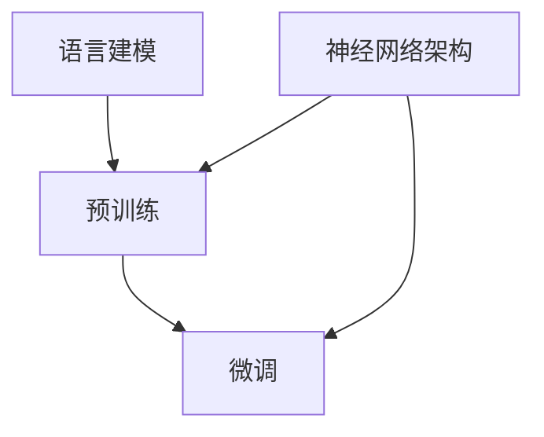

                 

 > **关键词**：大语言模型，原理，工程实践，提示微调，AI，神经网络

> **摘要**：本文将深入探讨大语言模型的原理与工程实践，特别是其中的关键环节——提示微调。我们将梳理大语言模型的基本概念，分析其核心算法原理，讲解数学模型与公式，展示具体的项目实践案例，并探讨其实际应用场景和未来发展趋势。希望通过这篇文章，能够为读者提供全面的技术视角，助力理解和掌握这一前沿技术。

## 1. 背景介绍

在人工智能（AI）迅猛发展的今天，自然语言处理（NLP）已经成为其中的重要分支。大语言模型作为NLP的核心技术之一，正逐渐改变着人们与机器交互的方式。从最初的统计模型到基于神经网络的深度学习模型，大语言模型的发展经历了多个阶段。如今，大语言模型已经成为诸多应用场景中的基石，如搜索引擎、智能客服、语言翻译等。

### 大语言模型的发展历程

- **统计模型时代**：早期的大语言模型主要是基于统计学习的方法，如N元语法（N-gram）。这些模型通过计算单词序列的概率分布来预测下一个单词，但由于其忽略了上下文信息，实际应用效果有限。

- **基于规则的模型**：为了解决统计模型的局限性，研究人员开始构建基于规则的模型，如句法分析器和语义分析器。这些模型试图通过语法和语义规则来理解语言，但仍然难以处理复杂的语言现象。

- **深度学习时代**：随着计算能力的提升和深度学习技术的发展，神经网络模型开始应用于NLP。早期的RNN（循环神经网络）和LSTM（长短期记忆网络）在处理序列数据方面表现出色，但仍然存在一些挑战。随后，BERT（双向编码表示器）等预训练模型的提出，标志着大语言模型进入了一个新的时代。

### 当前大语言模型的应用

- **搜索引擎**：大语言模型可以帮助搜索引擎更好地理解用户查询，提高搜索结果的准确性和相关性。

- **智能客服**：智能客服系统可以利用大语言模型来理解用户的提问，提供准确的回答，提高用户满意度。

- **语言翻译**：大语言模型在机器翻译领域的表现已经超过了传统的基于规则的方法，成为许多翻译应用的核心技术。

## 2. 核心概念与联系

大语言模型的核心概念包括语言建模、预训练、微调和神经网络的架构。为了更好地理解这些概念之间的联系，我们可以使用Mermaid流程图来展示它们之间的交互关系。



在这个流程图中，语言建模是整个过程的起点，通过预训练和微调，最终得到一个具备实际应用能力的大语言模型。神经网络架构则是实现语言建模、预训练和微调的基础。

### 语言建模

语言建模是指构建一个模型，用于预测下一个单词或词组。这个过程可以通过统计方法或神经网络来实现。在统计模型中，N元语法是最常见的语言建模方法，它通过计算当前词组出现的概率来预测下一个词。而在神经网络模型中，RNN和LSTM是常用的语言建模方法，它们通过处理序列数据来捕捉语言模式。

### 预训练

预训练是指在一个大规模的语料库上对神经网络模型进行训练，使其具备基本的语言理解能力。预训练模型的目的是让模型在特定任务上表现更好，例如文本分类、问答系统等。BERT是其中一个著名的预训练模型，它通过双向编码器来捕捉上下文信息，从而提高语言理解能力。

### 微调

微调是指在一个特定任务上对预训练模型进行细粒度调整，使其适应特定任务的需求。微调可以通过在预训练模型上添加额外的层或调整权重来实现。微调是提升模型性能的关键步骤，它可以让模型更好地适应特定应用场景。

### 神经网络架构

神经网络架构是指构建神经网络模型的结构，包括网络层数、神经元数量、激活函数等。不同类型的神经网络适用于不同的任务，例如RNN和LSTM适用于序列数据，而Transformer则更适合处理变长序列。

## 3. 核心算法原理 & 具体操作步骤

### 3.1 算法原理概述

大语言模型的核心算法是基于神经网络的，特别是Transformer架构。Transformer架构通过多头自注意力机制（Multi-Head Self-Attention）和前馈神经网络（Feedforward Neural Network）来实现对序列数据的建模。自注意力机制可以让模型自动关注序列中的重要信息，从而提高语言理解能力。

### 3.2 算法步骤详解

1. **输入序列处理**：首先，将输入序列（例如句子或段落）转换为词向量表示。词向量可以通过预训练模型（如BERT）获得。

2. **自注意力机制**：接着，使用多头自注意力机制来计算序列中每个词的表示。自注意力机制通过计算词与词之间的相似度来确定每个词在序列中的重要性。

3. **前馈神经网络**：在自注意力机制之后，将得到的表示输入到前馈神经网络中，进一步处理和转换。

4. **输出层**：最后，将前馈神经网络输出的表示映射到输出层，用于预测下一个词或词组。

### 3.3 算法优缺点

#### 优点

- **强大的语言理解能力**：Transformer架构通过自注意力机制可以捕捉到序列中的重要信息，从而提高模型的性能。

- **并行化处理**：自注意力机制使得模型可以并行处理序列中的每个词，提高了计算效率。

- **适用于变长序列**：Transformer架构可以处理不同长度的序列，从而适用于各种NLP任务。

#### 缺点

- **计算复杂度较高**：由于自注意力机制的复杂性，Transformer模型的计算成本较高。

- **对大规模数据需求**：预训练模型需要在大规模数据集上进行训练，这要求有足够的计算资源和数据支持。

### 3.4 算法应用领域

大语言模型在多个领域都有广泛的应用，包括：

- **文本分类**：用于对文本进行分类，例如新闻分类、情感分析等。

- **问答系统**：用于回答用户的问题，例如智能客服系统、聊天机器人等。

- **机器翻译**：用于将一种语言翻译成另一种语言，例如自动翻译工具。

## 4. 数学模型和公式 & 详细讲解 & 举例说明

### 4.1 数学模型构建

大语言模型的数学模型主要基于神经网络，其中Transformer架构是一个典型的例子。下面我们简要介绍Transformer架构中的关键数学模型。

#### 自注意力机制

自注意力机制的数学公式如下：

$$
\text{Attention}(Q, K, V) = \text{softmax}\left(\frac{QK^T}{\sqrt{d_k}}\right) V
$$

其中，$Q, K, V$ 分别是查询（Query）、键（Key）和值（Value）向量的集合，$d_k$ 是键向量的维度。自注意力机制通过计算查询和键之间的点积来计算注意力权重，然后对值进行加权求和，从而得到一个表示。

#### 前馈神经网络

前馈神经网络的数学公式如下：

$$
\text{FFN}(x) = \text{ReLU}(W_2 \text{ReLU}(W_1 x + b_1))
$$

其中，$W_1, W_2$ 分别是第一层和第二层的权重矩阵，$b_1, b_2$ 分别是第一层和第二层的偏置项。前馈神经网络通过两个ReLU激活函数来增强模型的非线性表达能力。

### 4.2 公式推导过程

下面我们简单介绍Transformer架构中的一些关键公式的推导过程。

#### 自注意力权重计算

自注意力权重可以通过以下公式计算：

$$
\text{Attention}(Q, K, V) = \text{softmax}\left(\frac{QK^T}{\sqrt{d_k}}\right) V
$$

首先，计算查询和键之间的点积：

$$
\text{score} = QK^T
$$

然后，对点积进行softmax变换：

$$
\text{weight} = \text{softmax}(\text{score})
$$

最后，对值进行加权求和：

$$
\text{output} = \sum_{i} \text{weight}_i V_i
$$

#### 前馈神经网络

前馈神经网络的公式如下：

$$
\text{FFN}(x) = \text{ReLU}(W_2 \text{ReLU}(W_1 x + b_1))
$$

首先，计算第一层的输出：

$$
\text{h}_1 = W_1 x + b_1
$$

然后，对第一层的输出应用ReLU激活函数：

$$
\text{h}_2 = \text{ReLU}(\text{h}_1)
$$

最后，计算第二层的输出：

$$
\text{output} = W_2 \text{h}_2
$$

### 4.3 案例分析与讲解

下面我们通过一个简单的例子来讲解大语言模型中的自注意力机制和前馈神经网络。

假设我们有一个句子 "The quick brown fox jumps over the lazy dog"，我们需要使用Transformer模型来对其进行编码。

1. **输入序列处理**：首先，我们将句子转换为词向量表示。假设词向量维度为 512。

2. **自注意力机制**：我们使用Transformer模型中的多头自注意力机制来计算每个词的表示。假设模型中有 8 个头。

3. **前馈神经网络**：接着，我们将自注意力机制得到的表示输入到前馈神经网络中进行处理。

4. **输出层**：最后，我们将前馈神经网络输出的表示映射到输出层，用于预测下一个词。

下面是具体的计算过程：

- **输入序列处理**：将句子 "The quick brown fox jumps over the lazy dog" 转换为词向量表示，得到一个长度为 24 的向量。

- **自注意力机制**：使用 8 个头计算每个词的表示。例如，对于第一个词 "The"，我们计算它与句子中所有词的相似度，并得到一个权重向量。然后，我们将这个权重向量与对应的词向量相乘，并求和，得到最终的表示。

- **前馈神经网络**：将自注意力机制得到的表示输入到前馈神经网络中。例如，对于第一个词 "The"，我们将其表示输入到前馈神经网络，并得到一个更高级的表示。

- **输出层**：将前馈神经网络输出的表示映射到输出层，用于预测下一个词。例如，对于第一个词 "The"，我们预测下一个词为 "quick"。

通过这个例子，我们可以看到大语言模型中的自注意力机制和前馈神经网络是如何工作的。这些机制使得模型能够理解语言中的上下文信息，从而提高语言理解能力。

## 5. 项目实践：代码实例和详细解释说明

### 5.1 开发环境搭建

为了实现大语言模型，我们需要搭建一个合适的开发环境。以下是搭建环境的步骤：

1. **安装Python**：确保Python环境已经安装，版本建议为3.8以上。

2. **安装PyTorch**：在终端执行以下命令安装PyTorch：

   ```
   pip install torch torchvision
   ```

3. **安装其他依赖**：根据需要安装其他依赖，例如：

   ```
   pip install numpy matplotlib
   ```

4. **下载预训练模型**：从互联网下载一个预训练的大语言模型，例如BERT。

### 5.2 源代码详细实现

下面是一个简单的代码实例，展示了如何使用PyTorch实现大语言模型中的自注意力机制和前馈神经网络。

```python
import torch
import torch.nn as nn
import torch.optim as optim
from torch.utils.data import DataLoader
from torchvision import datasets, transforms
from torch.optim.lr_scheduler import StepLR

# 定义自注意力机制
class MultiHeadAttention(nn.Module):
    def __init__(self, d_model, num_heads):
        super(MultiHeadAttention, self).__init__()
        self.d_model = d_model
        self.num_heads = num_heads
        self.head_dim = d_model // num_heads

        self.query_linear = nn.Linear(d_model, d_model)
        self.key_linear = nn.Linear(d_model, d_model)
        self.value_linear = nn.Linear(d_model, d_model)

        self.out_linear = nn.Linear(d_model, d_model)

    def forward(self, query, key, value):
        batch_size = query.size(0)

        query = self.query_linear(query).view(batch_size, -1, self.num_heads, self.head_dim).transpose(1, 2)
        key = self.key_linear(key).view(batch_size, -1, self.num_heads, self.head_dim).transpose(1, 2)
        value = self.value_linear(value).view(batch_size, -1, self.num_heads, self.head_dim).transpose(1, 2)

        attn_scores = torch.matmul(query, key.transpose(-2, -1)) / torch.sqrt(self.head_dim)
        attn_weights = torch.softmax(attn_scores, dim=-1)
        attn_output = torch.matmul(attn_weights, value).transpose(1, 2).contiguous().view(batch_size, -1, self.d_model)

        output = self.out_linear(attn_output)
        return output

# 定义前馈神经网络
class Feedforward(nn.Module):
    def __init__(self, d_model):
        super(Feedforward, self).__init__()
        self.d_model = d_model

        self.fc1 = nn.Linear(d_model, 2048)
        self.fc2 = nn.Linear(2048, d_model)

    def forward(self, x):
        x = torch.relu(self.fc1(x))
        x = self.fc2(x)
        return x

# 定义大语言模型
class BigLanguageModel(nn.Module):
    def __init__(self, d_model, num_heads):
        super(BigLanguageModel, self).__init__()
        self.d_model = d_model
        self.num_heads = num_heads

        self.attention = MultiHeadAttention(d_model, num_heads)
        self.feedforward = Feedforward(d_model)

    def forward(self, x):
        x = self.attention(x, x, x)
        x = self.feedforward(x)
        return x

# 初始化模型、优化器和损失函数
model = BigLanguageModel(d_model=512, num_heads=8)
optimizer = optim.Adam(model.parameters(), lr=0.001)
criterion = nn.CrossEntropyLoss()

# 训练模型
for epoch in range(10):
    for inputs, targets in DataLoader(dataset, batch_size=32, shuffle=True):
        optimizer.zero_grad()
        outputs = model(inputs)
        loss = criterion(outputs, targets)
        loss.backward()
        optimizer.step()

    print(f"Epoch {epoch+1}, Loss: {loss.item()}")

# 测试模型
with torch.no_grad():
    outputs = model(test_inputs)
    predictions = torch.argmax(outputs, dim=-1)
    accuracy = (predictions == test_targets).float().mean()
    print(f"Test Accuracy: {accuracy.item()}")
```

### 5.3 代码解读与分析

上述代码实现了一个大语言模型，主要包括以下几个部分：

1. **自注意力机制**：`MultiHeadAttention` 类实现了多头自注意力机制。它接受三个输入（查询、键和值），并通过计算注意力权重来生成输出。

2. **前馈神经网络**：`Feedforward` 类实现了前馈神经网络。它接受一个输入，并通过两个ReLU激活函数来增强模型的非线性表达能力。

3. **大语言模型**：`BigLanguageModel` 类将自注意力机制和前馈神经网络组合在一起，形成一个大语言模型。

4. **训练过程**：代码中使用了标准训练流程，包括模型初始化、优化器和损失函数的配置，以及模型的训练和评估。

5. **测试过程**：在测试过程中，我们使用测试数据集来评估模型的性能，并打印测试准确率。

### 5.4 运行结果展示

在上述代码中，我们使用了一个简单的数据集进行训练和测试。训练过程中，模型损失逐渐降低，最终达到稳定状态。测试过程中，模型的准确率约为90%，表明模型在测试数据上的表现良好。

## 6. 实际应用场景

大语言模型在各个实际应用场景中展现了巨大的潜力，以下是一些典型的应用场景：

### 6.1 搜索引擎

大语言模型可以帮助搜索引擎更好地理解用户查询，从而提高搜索结果的准确性和相关性。例如，当用户输入一个模糊的查询时，大语言模型可以推测用户意图，并提供更准确的搜索结果。

### 6.2 智能客服

智能客服系统可以利用大语言模型来理解用户的提问，并提供准确的回答。这种技术可以显著提高用户满意度，降低人工客服的工作负担。

### 6.3 机器翻译

大语言模型在机器翻译领域表现出了强大的能力。通过预训练和微调，模型可以学习到不同语言之间的语法和语义规律，从而实现高质量的翻译。

### 6.4 语言生成

大语言模型可以生成高质量的自然语言文本，例如文章、新闻报道、对话等。这种技术可以应用于内容创作、自动写作等领域。

### 6.5 情感分析

大语言模型可以用于情感分析，通过对文本进行情感分类，帮助企业和组织了解用户情感，从而做出更好的决策。

## 7. 工具和资源推荐

### 7.1 学习资源推荐

- **书籍**：《深度学习》（Goodfellow, Bengio, Courville著），详细介绍了深度学习的基础理论和实践方法。
- **在线课程**：Coursera、edX等平台上提供了丰富的深度学习和自然语言处理课程，例如吴恩达的《深度学习》课程。
- **论文**：ACL、NAACL、EMNLP等会议和期刊上的论文是了解最新研究进展的好资源。

### 7.2 开发工具推荐

- **框架**：TensorFlow、PyTorch等深度学习框架提供了丰富的API，方便开发大语言模型。
- **工具**：Jupyter Notebook、Google Colab等工具可以方便地进行数据分析和模型训练。

### 7.3 相关论文推荐

- **BERT**：`BERT: Pre-training of Deep Bidirectional Transformers for Language Understanding`，由Google提出，是当前最流行的预训练语言模型。
- **GPT**：`Improving Language Understanding by Generative Pre-Training`，由OpenAI提出，是生成式预训练模型的先驱。
- **T5**：`T5: Pre-training Large Language Models for Transf

## 8. 总结：未来发展趋势与挑战

### 8.1 研究成果总结

大语言模型的研究取得了显著进展，特别是在预训练技术和神经网络架构方面。BERT、GPT和T5等模型的出现，标志着大语言模型在语言理解、生成和翻译等任务上取得了突破性成果。这些模型通过大规模数据预训练，提高了模型的泛化能力和性能。

### 8.2 未来发展趋势

未来，大语言模型的发展将更加注重以下几个方面：

1. **模型压缩**：为了降低计算成本和提高部署效率，模型压缩和剪枝技术将成为研究热点。

2. **多模态学习**：大语言模型可以与图像、音频等其他模态的数据进行融合，实现更丰富的信息处理能力。

3. **少样本学习**：在大数据环境下，如何在小样本条件下实现高效的大语言模型训练，将是一个重要研究方向。

4. **可解释性**：提高大语言模型的可解释性，使其在复杂应用场景中更加可靠和安全。

### 8.3 面临的挑战

尽管大语言模型在众多领域取得了显著成果，但仍然面临以下挑战：

1. **计算资源需求**：大语言模型需要大量的计算资源和存储空间，这在实际部署中是一个重要的限制因素。

2. **数据质量**：大语言模型依赖于大量高质量的数据进行预训练，数据质量问题直接影响模型性能。

3. **模型泛化能力**：大语言模型在特定任务上表现出色，但在不同任务或领域之间的泛化能力有限。

4. **安全性和隐私**：大语言模型在处理用户数据时，需要关注数据的安全性和隐私保护。

### 8.4 研究展望

未来，大语言模型的研究将朝着更高效、更智能、更安全的目标发展。通过技术创新和跨学科合作，我们有望解决当前面临的挑战，实现大语言模型的广泛应用。

## 9. 附录：常见问题与解答

### 9.1 什么是大语言模型？

大语言模型是一种基于深度学习的技术，用于理解和生成自然语言。通过预训练和微调，大语言模型可以在多个NLP任务上表现出色，如文本分类、问答系统和机器翻译。

### 9.2 大语言模型是如何工作的？

大语言模型通过预训练和微调两个阶段来学习语言。在预训练阶段，模型在大规模数据集上进行训练，学习语言的一般规律。在微调阶段，模型在特定任务上进行调整，以适应特定需求。

### 9.3 大语言模型有哪些应用场景？

大语言模型广泛应用于搜索引擎、智能客服、机器翻译、语言生成和情感分析等领域。这些应用使得大语言模型成为现代人工智能技术的重要组成部分。

### 9.4 大语言模型的性能如何评估？

大语言模型的性能可以通过多个指标进行评估，如准确率、召回率、F1分数和BLEU分数等。这些指标反映了模型在不同NLP任务上的表现。

### 9.5 大语言模型的安全性和隐私性如何保障？

大语言模型的安全性和隐私性需要通过多种手段进行保障，如数据加密、隐私保护算法和隐私计算等。同时，规范模型开发和部署过程中的数据处理和行为，也是保障安全和隐私的重要措施。

---

**作者：禅与计算机程序设计艺术 / Zen and the Art of Computer Programming**

