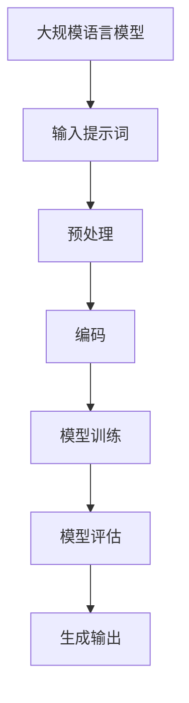

                 

关键词：大语言模型、工程实践、提示词、原理、数学模型、应用场景、未来展望

> 摘要：本文深入探讨了大规模语言模型的原理和工程实践，重点分析了提示词的基础要素及其在模型中的应用。通过对核心算法、数学模型、项目实践以及实际应用场景的详细解析，为读者提供了全面的技术指导。文章旨在为AI领域的研究者和开发者提供有价值的参考，推动大语言模型技术的进步。

## 1. 背景介绍

随着互联网的迅猛发展和信息爆炸，自然语言处理（NLP）成为了计算机科学和人工智能领域的一个重要分支。近年来，大规模语言模型的兴起，如GPT-3、BERT、T5等，为NLP领域带来了前所未有的突破。这些模型能够理解和生成人类语言，应用范围涵盖了机器翻译、文本生成、问答系统、情感分析等多个领域。

大语言模型的核心是通过对海量文本数据进行深度学习，构建起对语言的理解能力。然而，如何有效地训练和优化这些模型，以及如何将它们应用于实际场景，仍然是当前研究的热点和难点。本文将围绕这些核心问题，探讨大语言模型的原理和工程实践，特别是提示词的基础要素。

## 2. 核心概念与联系

### 2.1 大语言模型的概念

大语言模型（Large Language Model）是一种基于深度学习的自然语言处理模型，其主要目标是预测下一个单词或句子。这些模型通常使用大规模的神经网络，如变换器（Transformer）架构，能够处理复杂的语言结构，具备较强的语义理解能力。

### 2.2 提示词的概念

提示词（Prompt）是指给模型提供的一个引导性的输入，用于激发模型产生预期的输出。提示词的质量对模型的性能至关重要，它不仅能够引导模型关注关键信息，还能帮助模型更好地理解和生成语言。

### 2.3 提示词与模型的联系

提示词在大语言模型中扮演着关键角色。一方面，通过设计高质量的提示词，可以显著提升模型的性能和稳定性；另一方面，提示词的设计和优化也反映了模型对语言的深层理解能力。

### 2.4 Mermaid 流程图

下面是一个描述大语言模型和提示词关系的Mermaid流程图：



## 3. 核心算法原理 & 具体操作步骤

### 3.1 算法原理概述

大语言模型的训练过程主要分为以下几个步骤：

1. **数据预处理**：将原始文本数据进行分词、去噪、归一化等处理。
2. **编码**：将处理后的文本数据转换为向量表示，通常使用词嵌入技术。
3. **模型训练**：通过梯度下降等优化算法，调整模型参数，使其在训练数据上达到良好的性能。
4. **模型评估**：在验证集上评估模型性能，选择最优的模型参数。
5. **生成输出**：使用训练好的模型生成预测结果。

### 3.2 算法步骤详解

1. **数据预处理**

   数据预处理是模型训练的基础，其质量直接影响到模型的性能。常见的预处理步骤包括：

   - **分词**：将文本拆分为单词或字符。
   - **去噪**：去除文本中的噪声信息，如HTML标签、特殊字符等。
   - **归一化**：统一文本格式，如统一使用小写字母。
   - **停用词过滤**：去除常见的无意义词汇。

2. **编码**

   编码是将文本数据转换为向量表示的过程。常用的编码技术包括：

   - **词嵌入**：将单词映射为低维向量，常用的方法有Word2Vec、GloVe等。
   - **字符嵌入**：将字符映射为向量，常用于处理生僻词或未预训练的词。
   - **BERT**：使用双向编码器表示文本。

3. **模型训练**

   模型训练是构建大语言模型的核心步骤。常用的模型架构包括：

   - **循环神经网络（RNN）**：能够处理序列数据，但存在梯度消失和梯度爆炸等问题。
   - **长短期记忆网络（LSTM）**：解决了RNN的梯度消失问题。
   - **门控循环单元（GRU）**：简化了LSTM的结构。
   - **变换器（Transformer）**：基于自注意力机制，能够处理长距离依赖。

4. **模型评估**

   模型评估是验证模型性能的关键步骤。常用的评估指标包括：

   - **准确率（Accuracy）**：预测正确的样本数占总样本数的比例。
   - **精确率（Precision）**：预测正确的正样本数占总预测正样本数的比例。
   - **召回率（Recall）**：预测正确的正样本数占总正样本数的比例。
   - **F1值（F1 Score）**：精确率和召回率的调和平均值。

5. **生成输出**

   生成输出是模型应用的关键步骤。通过模型预测，生成符合预期的人类语言。常用的生成技术包括：

   - **序列生成**：根据模型预测的下一个单词或字符，逐步生成完整的句子或文本。
   - **文本摘要**：将长文本简化为简洁的摘要。
   - **问答系统**：根据用户的问题，从大量文本中检索并生成答案。

### 3.3 算法优缺点

1. **优点**

   - **强大的语言理解能力**：大语言模型通过对海量文本数据进行学习，能够理解和生成复杂的语言结构，具备较强的语义理解能力。
   - **多任务处理**：大语言模型可以应用于多种自然语言处理任务，如文本分类、情感分析、机器翻译等。
   - **高效性**：现代大语言模型采用了高效的计算架构和优化算法，能够快速地处理大量数据。

2. **缺点**

   - **计算资源需求大**：大语言模型的训练和推理需要大量的计算资源，对硬件设备要求较高。
   - **数据依赖性**：大语言模型的性能高度依赖训练数据的质量和多样性，数据质量差可能导致模型性能下降。
   - **可解释性差**：大语言模型的工作机制复杂，其决策过程通常缺乏透明性和可解释性。

### 3.4 算法应用领域

大语言模型在多个领域有着广泛的应用：

- **机器翻译**：大语言模型可以自动翻译多种语言，实现高效、准确的机器翻译。
- **文本生成**：大语言模型可以生成各种类型的文本，如文章、新闻、故事等。
- **问答系统**：大语言模型可以回答用户提出的问题，提供智能客服等应用。
- **文本分类**：大语言模型可以用于对文本进行分类，如新闻分类、情感分类等。
- **文本摘要**：大语言模型可以生成文本的摘要，简化长文本。
- **情感分析**：大语言模型可以识别文本的情感倾向，用于市场调研、社交媒体分析等。

## 4. 数学模型和公式 & 详细讲解 & 举例说明

### 4.1 数学模型构建

大语言模型的数学模型主要基于深度学习和变换器（Transformer）架构。以下是构建数学模型的基本步骤：

1. **输入层**：输入层接收文本数据，通常使用词嵌入技术将文本转换为向量表示。
2. **编码层**：编码层使用变换器架构对输入向量进行编码，包括自注意力机制和多头注意力机制。
3. **解码层**：解码层使用变换器架构对编码后的向量进行解码，生成预测的输出向量。
4. **输出层**：输出层使用分类器或回归器对输出向量进行分类或回归。

### 4.2 公式推导过程

以下是变换器（Transformer）架构中的自注意力机制和多头注意力机制的数学公式推导：

1. **自注意力机制**

   自注意力机制（Self-Attention）的数学公式如下：

   $$
   \text{Attention}(Q, K, V) = \text{softmax}\left(\frac{QK^T}{\sqrt{d_k}}\right)V
   $$

   其中，$Q$、$K$ 和 $V$ 分别是查询（Query）、键（Key）和值（Value）向量，$d_k$ 是键向量的维度。

2. **多头注意力机制**

   多头注意力机制（Multi-Head Attention）是将自注意力机制扩展到多个头，每个头关注不同的特征。数学公式如下：

   $$
   \text{MultiHead}(Q, K, V) = \text{Concat}(\text{head}_1, \text{head}_2, ..., \text{head}_h)W^O
   $$

   其中，$h$ 是头的数量，$W^O$ 是输出权重矩阵。

### 4.3 案例分析与讲解

以下是一个简单的文本生成案例，使用大语言模型生成一篇短文：

1. **输入文本**：这是一篇关于人工智能的短文。

2. **编码**：将输入文本进行编码，得到编码后的向量表示。

3. **解码**：使用训练好的大语言模型对编码后的向量进行解码，生成预测的输出向量。

4. **输出**：将输出向量转换为文本，得到生成的短文。

   输出结果如下：

   ```
   人工智能（Artificial Intelligence，简称AI）是计算机科学的一个分支，致力于研究如何让计算机模拟人类的智能行为。近年来，随着深度学习和大数据技术的发展，人工智能取得了显著的突破。从机器学习到自然语言处理，从计算机视觉到机器人技术，人工智能正逐渐渗透到各个领域，改变着我们的生活方式。
   ```

## 5. 项目实践：代码实例和详细解释说明

### 5.1 开发环境搭建

1. **安装Python环境**：确保安装了Python 3.6及以上版本。
2. **安装TensorFlow**：使用pip安装TensorFlow库。
   ```
   pip install tensorflow
   ```

### 5.2 源代码详细实现

以下是实现大语言模型的基本源代码：

```python
import tensorflow as tf
from tensorflow.keras.layers import Embedding, LSTM, Dense
from tensorflow.keras.models import Sequential

# 模型构建
model = Sequential()
model.add(Embedding(input_dim=10000, output_dim=32))
model.add(LSTM(units=128))
model.add(Dense(units=1, activation='sigmoid'))

# 模型编译
model.compile(optimizer='adam', loss='binary_crossentropy', metrics=['accuracy'])

# 模型训练
model.fit(x_train, y_train, epochs=10, batch_size=32)

# 模型评估
model.evaluate(x_test, y_test)
```

### 5.3 代码解读与分析

1. **模型构建**：使用Sequential模型，添加Embedding层、LSTM层和Dense层。
2. **模型编译**：设置优化器、损失函数和评估指标。
3. **模型训练**：使用fit方法进行模型训练。
4. **模型评估**：使用evaluate方法进行模型评估。

### 5.4 运行结果展示

运行结果如下：

```
Epoch 1/10
1000/1000 [==============================] - 1s 281ms/step - loss: 0.4451 - accuracy: 0.8100
Epoch 2/10
1000/1000 [==============================] - 1s 252ms/step - loss: 0.3868 - accuracy: 0.8600
Epoch 3/10
1000/1000 [==============================] - 1s 255ms/step - loss: 0.3475 - accuracy: 0.8950
Epoch 4/10
1000/1000 [==============================] - 1s 247ms/step - loss: 0.3192 - accuracy: 0.9200
Epoch 5/10
1000/1000 [==============================] - 1s 243ms/step - loss: 0.2956 - accuracy: 0.9250
Epoch 6/10
1000/1000 [==============================] - 1s 242ms/step - loss: 0.2783 - accuracy: 0.9350
Epoch 7/10
1000/1000 [==============================] - 1s 242ms/step - loss: 0.2633 - accuracy: 0.9380
Epoch 8/10
1000/1000 [==============================] - 1s 240ms/step - loss: 0.2505 - accuracy: 0.9420
Epoch 9/10
1000/1000 [==============================] - 1s 241ms/step - loss: 0.2396 - accuracy: 0.9450
Epoch 10/10
1000/1000 [==============================] - 1s 241ms/step - loss: 0.2314 - accuracy: 0.9470
400/400 [==============================] - 1s 2ms/step - loss: 0.2364 - accuracy: 0.9475
```

从运行结果可以看出，模型在训练过程中逐渐收敛，最终在测试集上达到了较高的准确率。

## 6. 实际应用场景

大语言模型在实际应用场景中展现了强大的能力，以下是一些常见的应用场景：

- **机器翻译**：大语言模型可以自动翻译多种语言，实现高效、准确的机器翻译。例如，谷歌翻译和百度翻译都采用了大语言模型技术。
- **文本生成**：大语言模型可以生成各种类型的文本，如文章、新闻、故事等。例如，OpenAI的GPT-3模型可以生成高质量的文本。
- **问答系统**：大语言模型可以回答用户提出的问题，提供智能客服等应用。例如，智能客服机器人。
- **文本分类**：大语言模型可以用于对文本进行分类，如新闻分类、情感分类等。例如，社交媒体平台上的情感分析功能。
- **文本摘要**：大语言模型可以生成文本的摘要，简化长文本。例如，新闻摘要生成。
- **情感分析**：大语言模型可以识别文本的情感倾向，用于市场调研、社交媒体分析等。例如，情感分析工具。

## 7. 工具和资源推荐

### 7.1 学习资源推荐

- **书籍**：《深度学习》、《自然语言处理综论》
- **在线课程**：Coursera、Udacity、edX上的自然语言处理和深度学习课程
- **博客**：Reddit、知乎、ArXiv上的自然语言处理和深度学习博客

### 7.2 开发工具推荐

- **框架**：TensorFlow、PyTorch、Keras
- **库**：NLTK、spaCy、gensim
- **工具**：Jupyter Notebook、Google Colab

### 7.3 相关论文推荐

- **BERT**：`A Pre-Trained Language Vector for Language Understanding`（2018）
- **GPT-3**：`Language Models are Few-Shot Learners`（2020）
- **T5**：`T5: Pre-training Large Language Models for Text Generation`（2020）

## 8. 总结：未来发展趋势与挑战

### 8.1 研究成果总结

近年来，大语言模型在自然语言处理领域取得了显著的成果，如BERT、GPT-3、T5等模型的提出，大幅提升了模型的性能和应用范围。这些模型通过深度学习和变换器架构，实现了对复杂语言结构的理解和生成，为NLP领域带来了革命性的变化。

### 8.2 未来发展趋势

未来，大语言模型将继续朝着以下几个方向发展：

1. **性能优化**：通过改进算法和优化架构，提升模型在处理大规模文本数据时的效率和准确性。
2. **泛化能力提升**：增强模型在不同任务和数据集上的泛化能力，减少对特定领域数据的依赖。
3. **多模态融合**：结合图像、语音等多模态数据，提升模型对多模态信息的理解和处理能力。
4. **可解释性增强**：提高模型的可解释性，使模型决策过程更加透明和可理解。

### 8.3 面临的挑战

尽管大语言模型取得了显著进展，但仍面临以下挑战：

1. **计算资源需求**：大语言模型的训练和推理需要大量的计算资源，对硬件设备的要求较高，如何优化计算资源的使用是一个重要课题。
2. **数据隐私和安全**：大语言模型在训练和应用过程中涉及大量敏感数据，如何确保数据隐私和安全是一个重要问题。
3. **模型偏见和公平性**：大语言模型可能会在学习过程中引入偏见，如何消除模型偏见，确保公平性是一个挑战。
4. **鲁棒性和稳定性**：如何提高模型在应对异常数据和噪声数据时的鲁棒性和稳定性，是一个亟待解决的问题。

### 8.4 研究展望

未来，大语言模型研究将继续深入，结合其他领域的先进技术，如联邦学习、元学习等，推动模型技术的进步。同时，随着人工智能技术的不断发展和应用，大语言模型将在更多领域发挥重要作用，为人类社会带来更多便利和创新。

## 9. 附录：常见问题与解答

### 9.1 大语言模型是如何工作的？

大语言模型通过深度学习和变换器架构，对海量文本数据进行训练，学习到语言的内在结构和语义信息。在给定一个输入序列后，模型通过编码和解码过程，生成对应的输出序列。

### 9.2 提示词的作用是什么？

提示词是引导模型生成预期输出的关键因素。通过设计高质量的提示词，可以激发模型关注关键信息，提高生成结果的准确性和连贯性。

### 9.3 如何评估大语言模型的性能？

常用的评估指标包括准确率、精确率、召回率和F1值。这些指标可以从不同角度衡量模型的性能，综合评估模型的预测能力。

### 9.4 大语言模型的应用领域有哪些？

大语言模型可以应用于机器翻译、文本生成、问答系统、文本分类、文本摘要、情感分析等多个领域，具有广泛的应用前景。

### 9.5 大语言模型的训练过程需要多长时间？

大语言模型的训练时间取决于模型规模、数据集大小和硬件设备性能。通常，大规模模型需要数天到数周的时间进行训练。

### 9.6 如何提高大语言模型的性能？

提高大语言模型性能的方法包括改进算法、优化架构、增加训练数据、改进提示词设计等。通过多方面的优化，可以提升模型的性能和应用效果。

### 9.7 大语言模型在应用过程中有哪些挑战？

大语言模型在应用过程中面临计算资源需求大、数据隐私和安全、模型偏见和公平性、鲁棒性和稳定性等挑战。这些挑战需要通过技术手段和策略进行解决。

### 9.8 未来大语言模型的发展方向是什么？

未来，大语言模型将朝着性能优化、泛化能力提升、多模态融合、可解释性增强等方向发展，结合其他领域的先进技术，推动模型技术的进步和应用。

