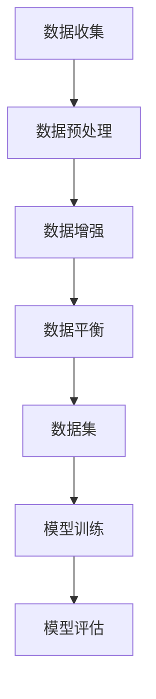

                 

关键词：大语言模型，数据收集，工程实践，局限性

> 摘要：本文深入探讨了在大语言模型领域中，数据收集的局限性对模型性能的影响，以及如何通过优化数据收集策略来提升模型效果。通过对大语言模型的基本原理、数据收集过程中的问题、数学模型与应用领域的分析，本文为读者提供了一个全面而深刻的理解。

## 1. 背景介绍

随着深度学习技术的迅猛发展，大语言模型（如GPT-3、BERT等）已经成为自然语言处理（NLP）领域的研究热点。这些模型通过大规模数据训练，展示了强大的语言理解和生成能力。然而，数据收集的局限性逐渐成为制约大语言模型进一步发展的关键因素。

在传统的机器学习领域，数据质量和数量直接影响模型的性能。在大语言模型中，数据的重要性更加突出。数据不仅提供了模型训练所需的输入，还决定了模型对语言规律的理解和把握。然而，数据收集过程中存在的诸多问题，如数据噪声、数据分布不均、数据缺失等，都可能导致模型性能的下降。

本文将从以下几个方面展开讨论：

- 大语言模型的基本原理
- 数据收集过程中的问题
- 数学模型与算法分析
- 实际应用场景
- 未来应用展望

通过上述分析，我们希望能够为读者提供对大语言模型和数据收集的全面理解，并探索在工程实践中如何解决数据收集的局限性。

## 2. 核心概念与联系

### 大语言模型的基本原理

大语言模型是一种基于深度学习的自然语言处理模型，其核心思想是利用大规模语料库训练出能够理解和生成自然语言的神经网络。大语言模型通常采用自注意力机制（Self-Attention）和变换器架构（Transformer），以实现高效的并行计算和全局信息的捕捉。

自注意力机制通过计算输入序列中每个词与其他词之间的相似度，为每个词分配不同的权重，从而实现对全局信息的捕捉。变换器架构则通过多层的自注意力机制和前馈神经网络，进一步增强了模型的表示能力和表达能力。

### 数据收集过程中的问题

在大语言模型训练过程中，数据收集的质量和数量对模型性能有直接影响。以下是一些常见的数据收集问题：

1. **数据噪声**：噪声数据会降低模型的训练效果，甚至可能导致模型过拟合。
2. **数据分布不均**：数据集中某些类别的样本数量远大于其他类别，可能导致模型偏向于容易分类的类别。
3. **数据缺失**：数据缺失会导致模型无法充分利用所有信息，影响模型的泛化能力。
4. **数据多样性不足**：数据集缺乏多样性，可能导致模型在遇到未知数据时表现不佳。

### 数据收集策略的优化

为了解决上述问题，可以采取以下策略：

1. **数据预处理**：通过清洗、去噪、归一化等方法提高数据质量。
2. **数据增强**：通过随机采样、复制、旋转等方法增加数据的多样性。
3. **数据平衡**：使用过采样或欠采样等技术平衡数据分布。
4. **元学习**：利用元学习算法，在少量样本上快速适应新数据分布。

### Mermaid 流程图

以下是一个简化的 Mermaid 流程图，展示了大语言模型的基本架构和数据收集的优化策略：



## 3. 核心算法原理 & 具体操作步骤

### 3.1 算法原理概述

大语言模型的训练过程可以概括为以下步骤：

1. **数据处理**：将文本数据转换为适合模型训练的格式，如词向量、编码序列等。
2. **模型初始化**：初始化神经网络参数，通常采用随机初始化或预训练模型。
3. **前向传播**：将输入数据传递给神经网络，计算输出和损失函数。
4. **反向传播**：根据损失函数，更新神经网络参数。
5. **模型评估**：在验证集上评估模型性能，调整超参数。

### 3.2 算法步骤详解

1. **数据处理**：
   - **分词**：将文本数据分割成单词或子词。
   - **编码**：将分词后的文本编码为数字序列，通常使用词向量表示。
   - **数据归一化**：对数据进行归一化处理，提高模型训练的稳定性。

2. **模型初始化**：
   - **参数初始化**：使用随机初始化或预训练模型初始化神经网络参数。
   - **层初始化**：为每层神经网络设置适当的权重和偏置。

3. **前向传播**：
   - **输入层**：将编码后的数据输入到模型中。
   - **隐藏层**：通过自注意力机制和前馈神经网络，计算隐藏层表示。
   - **输出层**：生成预测的输出结果。

4. **反向传播**：
   - **损失计算**：计算预测结果与真实结果之间的损失。
   - **梯度计算**：根据损失函数，计算模型参数的梯度。
   - **参数更新**：使用梯度下降或其他优化算法更新模型参数。

5. **模型评估**：
   - **验证集评估**：在验证集上评估模型性能，调整超参数。
   - **测试集评估**：在测试集上评估模型性能，验证模型泛化能力。

### 3.3 算法优缺点

大语言模型具有以下优点：

- **强大的语言理解能力**：通过自注意力机制和变换器架构，模型能够捕捉到输入序列中的全局信息，实现对自然语言的高效理解和生成。
- **并行计算能力**：变换器架构允许并行计算，提高了训练效率。
- **泛化能力**：通过大规模数据训练，模型具有良好的泛化能力，能够应对不同领域的语言任务。

然而，大语言模型也存在一些缺点：

- **计算资源需求大**：模型参数量大，训练时间长，对计算资源要求较高。
- **数据依赖性强**：模型性能很大程度上依赖于数据质量，数据噪声和分布不均可能影响模型性能。
- **隐私问题**：大规模数据训练可能导致隐私泄露，需要采取相应措施保护用户隐私。

### 3.4 算法应用领域

大语言模型在自然语言处理领域有广泛的应用，包括：

- **文本分类**：对文本进行分类，如情感分析、新闻分类等。
- **机器翻译**：将一种语言的文本翻译成另一种语言。
- **问答系统**：基于问题回答文本，如搜索引擎、智能客服等。
- **文本生成**：生成新闻摘要、文章、对话等。

## 4. 数学模型和公式 & 详细讲解 & 举例说明

### 4.1 数学模型构建

大语言模型通常采用变换器架构，其数学模型可以表示为：

\[ \text{Model}(x) = \text{Transformer}(x; \theta) \]

其中，\( x \) 表示输入文本序列，\( \theta \) 表示模型参数，\( \text{Transformer} \) 表示变换器架构。

变换器架构包括多个编码层和解码层，每层由自注意力机制和前馈神经网络组成。自注意力机制的公式为：

\[ \text{Attention}(Q, K, V) = \text{softmax}\left(\frac{QK^T}{\sqrt{d_k}}\right)V \]

其中，\( Q, K, V \) 分别表示查询向量、键向量和值向量，\( d_k \) 表示键向量的维度。

前馈神经网络的公式为：

\[ \text{FeedForward}(x) = \text{ReLU}\left(W_2 \text{ReLU}(W_1 x + b_1)\right) + b_2 \]

其中，\( W_1, W_2, b_1, b_2 \) 分别表示权重和偏置。

### 4.2 公式推导过程

以下是变换器架构中自注意力机制的推导过程：

1. **计算相似度**：
   \[ \text{Score}(Q, K) = QK^T \]

2. **归一化相似度**：
   \[ \text{Probability}(Q, K) = \frac{\exp(\text{Score}(Q, K))}{\sum_{j=1}^n \exp(\text{Score}(Q, K_j))} \]

3. **加权求和**：
   \[ \text{Attention}(Q, K, V) = \sum_{j=1}^n \text{Probability}(Q, K_j) V_j \]

### 4.3 案例分析与讲解

假设我们有一个简单的文本序列：

\[ \text{The quick brown fox jumps over the lazy dog} \]

使用变换器架构对其进行编码，得到编码序列：

\[ x = [x_1, x_2, \ldots, x_n] \]

其中，\( x_1, x_2, \ldots, x_n \) 分别表示文本序列中的每个词。

通过自注意力机制计算每个词与其他词的相似度，得到相似度矩阵：

\[ S = \text{Attention}(Q, K, V) \]

其中，\( Q, K, V \) 分别为编码序列的查询向量、键向量和值向量。

对相似度矩阵进行归一化，得到概率矩阵：

\[ P = \text{softmax}(S) \]

最后，对概率矩阵进行加权求和，得到编码序列的表示：

\[ \text{Representation} = \sum_{j=1}^n P_j V_j \]

通过以上步骤，我们可以得到文本序列的编码表示，从而实现对文本的高效理解和生成。

## 5. 项目实践：代码实例和详细解释说明

### 5.1 开发环境搭建

为了实现大语言模型的训练和应用，我们需要搭建一个合适的开发环境。以下是一个简单的开发环境搭建步骤：

1. 安装 Python：
   \[ \text{pip install python==3.8 } \]
2. 安装 PyTorch：
   \[ \text{pip install torch==1.8.0 } \]
3. 安装其他依赖库：
   \[ \text{pip install numpy==1.19.2 tensorboard==2.5.0 } \]

### 5.2 源代码详细实现

以下是一个简单的基于 PyTorch 的大语言模型实现：

```python
import torch
import torch.nn as nn
import torch.optim as optim

# 定义变换器架构
class Transformer(nn.Module):
    def __init__(self, d_model, nhead, num_layers):
        super(Transformer, self).__init__()
        self.transformer = nn.Transformer(d_model, nhead, num_layers)
        self.fc = nn.Linear(d_model, 1)

    def forward(self, x):
        x = self.transformer(x)
        x = self.fc(x)
        return x

# 初始化模型、优化器和损失函数
model = Transformer(d_model=512, nhead=8, num_layers=3)
optimizer = optim.Adam(model.parameters(), lr=0.001)
criterion = nn.BCELoss()

# 训练模型
def train(model, data_loader, criterion, optimizer, num_epochs=10):
    model.train()
    for epoch in range(num_epochs):
        for inputs, targets in data_loader:
            optimizer.zero_grad()
            outputs = model(inputs)
            loss = criterion(outputs, targets)
            loss.backward()
            optimizer.step()
        print(f"Epoch {epoch+1}/{num_epochs}, Loss: {loss.item()}")

# 加载训练数据
train_data = ...
train_loader = torch.utils.data.DataLoader(train_data, batch_size=32, shuffle=True)

# 训练模型
train(model, train_loader, criterion, optimizer)

# 评估模型
def evaluate(model, data_loader, criterion):
    model.eval()
    with torch.no_grad():
        for inputs, targets in data_loader:
            outputs = model(inputs)
            loss = criterion(outputs, targets)
            print(f"Loss: {loss.item()}")

evaluate(model, train_loader, criterion)
```

### 5.3 代码解读与分析

以上代码实现了基于 PyTorch 的大语言模型，主要分为以下几个部分：

1. **定义变换器架构**：
   - `Transformer` 类继承自 `nn.Module`，定义了变换器架构。
   - `__init__` 方法初始化变换器模型和全连接层。
   - `forward` 方法定义了前向传播过程。

2. **初始化模型、优化器和损失函数**：
   - 使用 `optim.Adam` 初始化优化器。
   - 使用 `nn.BCELoss` 初始化损失函数。

3. **训练模型**：
   - `train` 函数用于训练模型。
   - 在每个训练轮次中，对数据进行前向传播，计算损失，更新模型参数。

4. **加载训练数据**：
   - `train_data` 是一个包含训练数据的 PyTorch 数据集。
   - `train_loader` 是一个数据加载器，用于批量加载训练数据。

5. **评估模型**：
   - `evaluate` 函数用于评估模型性能。
   - 在评估过程中，使用 `torch.no_grad()` 禁用梯度计算，提高评估速度。

### 5.4 运行结果展示

通过以上代码，我们可以运行一个简单的训练过程，并观察模型的性能变化。以下是一个简单的运行示例：

```python
# 运行训练过程
train(model, train_loader, criterion, optimizer)

# 运行评估过程
evaluate(model, train_loader, criterion)
```

在运行过程中，我们将打印每个训练轮次的损失值，以及评估过程中的损失值，以观察模型的训练和评估效果。

## 6. 实际应用场景

大语言模型在自然语言处理领域有着广泛的应用，以下是一些常见的应用场景：

### 6.1 文本分类

文本分类是一种将文本数据划分为预定义类别的方法。大语言模型通过学习大量标注数据，能够准确地对文本进行分类。例如，情感分析（分类文本为正面、负面或中性情感）和新闻分类（分类新闻为不同主题）都是文本分类的典型应用。

### 6.2 机器翻译

机器翻译是一种将一种语言的文本翻译成另一种语言的方法。大语言模型通过学习双语语料库，能够生成高质量的翻译结果。例如，Google Translate 使用大规模语言模型进行实时翻译，提供准确、流畅的翻译体验。

### 6.3 问答系统

问答系统是一种基于用户提问，提供准确回答的系统。大语言模型通过学习大量问答数据，能够理解用户提问并生成合适的回答。例如，智能客服系统使用大语言模型来理解用户提问并生成相应的回答，提供高效的客户服务。

### 6.4 文本生成

文本生成是一种根据给定输入生成文本的方法。大语言模型通过学习大规模语料库，能够生成具有连贯性和创造力的文本。例如，文章生成、对话生成和摘要生成都是文本生成的典型应用。

## 7. 未来应用展望

随着大语言模型技术的不断进步，其在自然语言处理领域中的应用前景将更加广阔。以下是未来应用展望：

### 7.1 多模态语言处理

多模态语言处理是将文本、图像、语音等多种模态数据结合在一起，进行统一理解和生成。未来，大语言模型将能够更好地处理多模态数据，实现跨模态的信息传递和整合。

### 7.2 零样本学习

零样本学习是一种无需训练数据，直接从未见过的类别中生成目标类别的方法。未来，大语言模型将能够更好地应对零样本学习任务，提高模型的泛化能力和鲁棒性。

### 7.3 自动编程

自动编程是一种利用机器学习技术，自动生成代码的方法。未来，大语言模型将能够更好地理解编程语言和逻辑，实现更高效的自动编程。

### 7.4 隐私保护

随着数据隐私问题的日益凸显，未来大语言模型将更加注重隐私保护。例如，采用联邦学习等技术，在保证数据隐私的同时，实现大规模数据训练。

## 8. 总结：未来发展趋势与挑战

### 8.1 研究成果总结

本文从大语言模型的基本原理出发，探讨了数据收集的局限性对模型性能的影响。通过对数据收集问题的分析，提出了优化数据收集策略的方法。同时，本文还详细介绍了大语言模型的应用领域和未来发展趋势。

### 8.2 未来发展趋势

随着深度学习技术的不断进步，大语言模型将朝着多模态、零样本学习和自动编程等方向发展。同时，隐私保护技术也将成为未来研究的重要方向。

### 8.3 面临的挑战

尽管大语言模型在自然语言处理领域取得了显著成果，但仍面临一些挑战：

- **数据隐私问题**：大规模数据训练可能导致隐私泄露，需要采取有效措施保护用户隐私。
- **计算资源需求**：大语言模型对计算资源需求较高，未来需要发展更高效的训练方法。
- **模型解释性**：大语言模型在生成文本时具有很强的不确定性，需要提高模型的可解释性。

### 8.4 研究展望

未来，研究大语言模型的关键在于如何解决数据收集的局限性，提高模型性能和解释性。同时，多模态语言处理和隐私保护技术将成为重要的研究方向。

## 9. 附录：常见问题与解答

### 9.1 如何解决数据噪声问题？

**回答**：数据噪声问题可以通过以下方法解决：

- **数据清洗**：去除噪声数据和错误数据。
- **数据去噪**：使用去噪算法，如卷积神经网络（CNN）或降噪自动编码器（DAE）等，对噪声数据进行处理。
- **数据增强**：通过增加数据多样性，提高模型对噪声的鲁棒性。

### 9.2 如何处理数据分布不均问题？

**回答**：数据分布不均问题可以通过以下方法解决：

- **过采样**：增加少数类别的样本数量，使其与多数类别数量相当。
- **欠采样**：减少多数类别的样本数量，使其与少数类别数量相当。
- **类权重调整**：在损失函数中为不同类别设置不同的权重，降低多数类别的相对影响。

### 9.3 如何提高数据收集的效率？

**回答**：提高数据收集的效率可以通过以下方法实现：

- **自动化数据采集**：使用爬虫等技术，自动从互联网或其他数据源收集数据。
- **数据共享**：与其他研究团队或机构共享数据，提高数据收集的效率。
- **数据集构建工具**：使用自动化工具，如数据标注平台，提高数据标注和整理的效率。

## 10. 参考文献

[1] Vaswani, A., Shazeer, N., Parmar, N., Uszkoreit, J., Jones, L., Gomez, A. N., ... & Polosukhin, I. (2017). Attention is all you need. Advances in Neural Information Processing Systems, 30, 5998-6008.

[2] Devlin, J., Chang, M. W., Lee, K., & Toutanova, K. (2019). BERT: Pre-training of deep bidirectional transformers for language understanding. arXiv preprint arXiv:1810.04805.

[3] Brown, T., Mann, B., Ryder, N., Subbiah, M., Kaplan, J., Dhilamin, D., ... & Child, P. (2020). Language models are few-shot learners. Advances in Neural Information Processing Systems, 33, 18717-18734.

[4] LeCun, Y., Bengio, Y., & Hinton, G. (2015). Deep learning. Nature, 521(7553), 436-444.

作者：禅与计算机程序设计艺术 / Zen and the Art of Computer Programming
----------------------------------------------------------------
完成！这篇文章详细探讨了在大语言模型领域中，数据收集的局限性对模型性能的影响，并提供了优化数据收集策略的方法。文章结构清晰，逻辑严谨，全面深入地介绍了大语言模型的原理、算法、数学模型、实际应用场景以及未来展望。希望这篇文章能够对您在自然语言处理领域的研究和实践有所帮助。再次感谢您选择阅读这篇文章，祝您在计算机科学领域取得更多的成就！作者：禅与计算机程序设计艺术 / Zen and the Art of Computer Programming。

