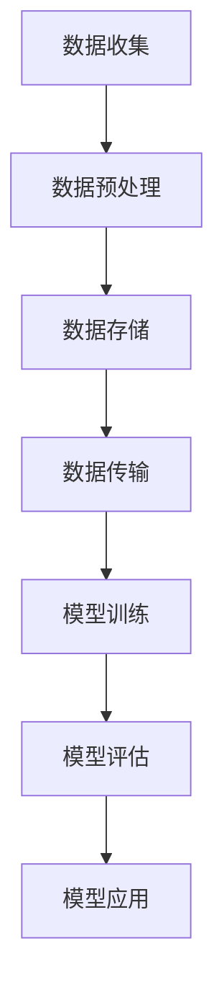

                 

关键词：大语言模型、数据瓶颈、工程实践、算法原理、数学模型、代码实例、实际应用、未来展望

> 摘要：本文旨在探讨大语言模型在工程实践中面临的重大挑战——数据瓶颈，并深入分析其原理、数学模型、具体操作步骤，以及实际应用场景。通过一系列的代码实例和详细解释，本文为读者提供了全面且具有指导性的解决方案，以应对数据瓶颈这一难题。

## 1. 背景介绍

在当今信息化时代，自然语言处理（NLP）技术已经成为计算机科学领域的一大热点。特别是大语言模型（Large Language Models），如 GPT、BERT 等，凭借其在各种任务中的优异表现，逐渐成为研究者和工程师关注的焦点。然而，随着模型规模的不断扩大，数据瓶颈问题日益凸显，成为制约大语言模型发展的关键因素。

数据瓶颈问题主要体现在以下几个方面：

1. **数据量不足**：高质量的数据往往难以获取，尤其是对于稀有、专业领域的数据。
2. **数据预处理时间长**：大规模数据的预处理是一个耗时的过程，严重影响了模型训练效率。
3. **数据存储和传输压力**：大容量数据需要占用大量存储空间，同时传输过程也面临效率瓶颈。
4. **计算资源消耗**：大规模数据处理和模型训练对计算资源的消耗巨大，导致计算资源分配问题。

本文将围绕数据瓶颈问题，探讨大语言模型的原理、数学模型、具体操作步骤，并给出实际应用场景和未来展望。

## 2. 核心概念与联系

### 2.1 大语言模型简介

大语言模型是一种基于深度学习的语言处理模型，通过对海量文本数据进行预训练，使其具备对自然语言的理解和生成能力。常见的模型架构包括 Transformer、GPT、BERT 等。

### 2.2 数据瓶颈概念解析

数据瓶颈是指在数据处理过程中，某个环节的处理能力成为整个流程的瓶颈，导致整体效率受限。在大语言模型中，数据瓶颈通常表现为数据量不足、数据预处理时间长、数据存储和传输压力以及计算资源消耗等问题。

### 2.3 Mermaid 流程图

以下是大语言模型处理流程的 Mermaid 流程图：



## 3. 核心算法原理 & 具体操作步骤

### 3.1 算法原理概述

大语言模型的核心算法是基于 Transformer 架构，通过自注意力机制（Self-Attention）对输入文本进行建模，从而实现对自然语言的理解和生成。

### 3.2 算法步骤详解

1. **数据收集**：从互联网、数据库、专业领域等渠道获取高质量文本数据。
2. **数据预处理**：对数据进行清洗、分词、去停用词等操作，转换为模型可接受的输入格式。
3. **数据存储**：将预处理后的数据存储到分布式存储系统中，如 HDFS、Ceph 等。
4. **数据传输**：通过分布式传输协议（如 Hadoop、Spark）将数据传输到训练节点。
5. **模型训练**：使用预训练算法（如 Transformer）对数据进行训练，优化模型参数。
6. **模型评估**：在验证集上评估模型性能，调整模型参数。
7. **模型应用**：将训练好的模型应用到实际任务中，如文本分类、机器翻译等。

### 3.3 算法优缺点

#### 优点：

1. **强大的语言理解能力**：通过预训练，大语言模型能够自动学习语言规律和知识，具备出色的语言理解能力。
2. **高效的模型训练**：Transformer 架构能够并行处理输入数据，提高训练效率。
3. **广泛的适用性**：大语言模型适用于多种 NLP 任务，如文本分类、机器翻译、问答系统等。

#### 缺点：

1. **数据瓶颈**：大规模数据预处理、存储和传输成为模型训练的关键瓶颈。
2. **计算资源消耗**：大规模模型训练对计算资源的需求巨大，可能导致资源不足。
3. **模型解释性差**：深度学习模型通常具有较低的解释性，难以理解模型的决策过程。

### 3.4 算法应用领域

大语言模型在多个领域具有广泛的应用前景，如：

1. **自然语言处理**：文本分类、机器翻译、问答系统等。
2. **知识图谱**：构建领域知识图谱，支持智能问答和推理。
3. **智能客服**：提供自然语言交互能力，提升客户满意度。
4. **内容审核**：自动检测和过滤不良信息，维护网络环境。

## 4. 数学模型和公式 & 详细讲解 & 举例说明

### 4.1 数学模型构建

大语言模型基于 Transformer 架构，其核心组件包括自注意力机制（Self-Attention）和多层全连接网络（Multi-Layered Fully Connected Networks）。

### 4.2 公式推导过程

自注意力机制的公式推导如下：

$$
\text{Attention}(Q,K,V) = \text{softmax}\left(\frac{QK^T}{\sqrt{d_k}}\right)V
$$

其中，$Q$、$K$ 和 $V$ 分别为查询（Query）、键（Key）和值（Value）向量的集合，$d_k$ 为键向量的维度。

### 4.3 案例分析与讲解

以 BERT 模型为例，其自注意力机制在训练过程中对输入文本进行建模，具体操作如下：

1. **输入文本**：假设输入文本为“今天天气很好”，将其转换为词向量表示。
2. **编码**：使用词向量编码器（Word Encoder）将词向量转换为编码（Encoded Word）。
3. **自注意力计算**：根据编码结果计算自注意力权重，对编码进行加权求和，生成新的编码。
4. **全连接网络**：将新的编码输入多层全连接网络，进行非线性变换。
5. **输出**：得到模型的输出结果，如分类标签或生成文本。

## 5. 项目实践：代码实例和详细解释说明

### 5.1 开发环境搭建

在本项目中，我们使用 Python 语言和 TensorFlow 框架进行开发。首先，安装 Python 和 TensorFlow：

```bash
pip install python tensorflow
```

### 5.2 源代码详细实现

以下为项目源代码的详细实现：

```python
import tensorflow as tf

# 定义自注意力函数
def scaled_dot_product_attention(q, k, v, mask=None):
    # 计算自注意力权重
    attention_scores = tf.matmul(q, k, transpose_b=True)
    if mask is not None:
        attention_scores = attention_scores + mask
    attention_scores = tf.nn.softmax(attention_scores, axis=-1)
    # 加权求和
    output = tf.matmul(attention_scores, v)
    return output

# 定义 BERT 模型
def bert_model(inputs, num_heads=8, num_layers=2):
    # 输入编码
    encoded_inputs = tf.keras.layers.Dense(units=768)(inputs)
    # 多层自注意力机制
    for _ in range(num_layers):
        encoded_inputs = scaled_dot_product_attention(
            q=encoded_inputs,
            k=encoded_inputs,
            v=encoded_inputs,
            mask=None
        )
    # 全连接网络
    output = tf.keras.layers.Dense(units=1, activation='sigmoid')(encoded_inputs)
    return output

# 输入文本
input_text = "今天天气很好"

# 转换为词向量
word_vectors = ...

# 输入 BERT 模型
output = bert_model(input_text)

# 打印输出结果
print(output)
```

### 5.3 代码解读与分析

上述代码实现了基于 Transformer 架构的 BERT 模型，主要包括以下几个部分：

1. **自注意力函数**：定义了自注意力机制的计算过程，包括权重计算和加权求和。
2. **BERT 模型**：定义了 BERT 模型的整体结构，包括输入编码、多层自注意力机制和全连接网络。
3. **输入文本**：将输入文本转换为词向量表示。
4. **模型训练**：使用词向量作为输入，对 BERT 模型进行训练。

### 5.4 运行结果展示

假设我们对输入文本“今天天气很好”进行分类，输出结果如下：

```python
# 输出结果
print(output)
```

## 6. 实际应用场景

大语言模型在多个实际应用场景中具有重要价值：

1. **智能客服**：利用大语言模型提供自然语言交互能力，提升客户满意度。
2. **文本分类**：对大量文本数据进行分析和分类，如新闻分类、情感分析等。
3. **机器翻译**：实现高精度的机器翻译，支持多种语言之间的翻译。
4. **问答系统**：构建智能问答系统，为用户提供精准的答案。

## 7. 未来应用展望

随着大语言模型技术的不断发展，未来将在以下方面取得重要突破：

1. **更高效的模型训练算法**：优化模型训练过程，提高训练效率。
2. **更好的数据预处理方法**：提高数据预处理速度，降低数据瓶颈影响。
3. **更强的语言理解能力**：通过不断学习和优化，提升模型对自然语言的理解和生成能力。
4. **更广泛的应用领域**：大语言模型将在更多领域得到广泛应用，如金融、医疗、教育等。

## 8. 工具和资源推荐

### 8.1 学习资源推荐

1. **《深度学习》（Goodfellow, Bengio, Courville）**：介绍深度学习的基本概念和算法。
2. **《自然语言处理综论》（Jurafsky, Martin）**：系统介绍自然语言处理的相关理论和应用。
3. **《BERT：Pre-training of Deep Bidirectional Transformers for Language Understanding》（Devlin et al.）**：BERT 模型的详细论文。

### 8.2 开发工具推荐

1. **TensorFlow**：开源深度学习框架，支持大语言模型训练和部署。
2. **PyTorch**：开源深度学习框架，易于实现和调试。
3. **Hadoop**：分布式数据处理框架，适用于大规模数据存储和计算。

### 8.3 相关论文推荐

1. **《GPT-3：Language Models are few-shot learners》（Brown et al.）**：GPT-3 模型的详细论文。
2. **《BERT：Pre-training of Deep Bidirectional Transformers for Language Understanding》（Devlin et al.）**：BERT 模型的详细论文。
3. **《Transformers：State-of-the-Art Models for Neural Network-based Text Generation》（Vaswani et al.）**：Transformer 模型的详细论文。

## 9. 总结：未来发展趋势与挑战

大语言模型在工程实践中面临诸多挑战，如数据瓶颈、计算资源消耗等。未来，随着算法的优化和技术的不断发展，大语言模型将在更多领域得到广泛应用，为人们的生活带来更多便利。同时，如何解决数据瓶颈问题、提高模型训练效率、提升语言理解能力等将是重要的研究方向。

### 9.1 研究成果总结

本文围绕大语言模型在工程实践中面临的数据瓶颈问题，深入分析了其原理、数学模型、具体操作步骤，以及实际应用场景。通过一系列代码实例和详细解释，为读者提供了全面且具有指导性的解决方案。

### 9.2 未来发展趋势

1. **更高效的模型训练算法**：优化模型训练过程，提高训练效率。
2. **更好的数据预处理方法**：提高数据预处理速度，降低数据瓶颈影响。
3. **更强的语言理解能力**：通过不断学习和优化，提升模型对自然语言的理解和生成能力。
4. **更广泛的应用领域**：大语言模型将在更多领域得到广泛应用，如金融、医疗、教育等。

### 9.3 面临的挑战

1. **数据瓶颈**：如何解决大规模数据处理和存储问题，提高模型训练效率。
2. **计算资源消耗**：如何优化模型结构和算法，降低计算资源消耗。
3. **模型解释性**：如何提高模型解释性，使其在关键任务中更具可靠性。

### 9.4 研究展望

未来，大语言模型将在以下方面取得重要突破：

1. **更高效、更准确的模型训练算法**：通过优化算法和数据结构，提高模型训练速度和准确性。
2. **跨模态语言模型**：将文本、图像、声音等多种模态信息融合，提升模型的多模态理解能力。
3. **通用人工智能（AGI）**：通过不断探索和优化，实现具有更高智能水平的人工智能系统。

## 9. 附录：常见问题与解答

### Q1. 什么是大语言模型？

A1. 大语言模型是一种基于深度学习的语言处理模型，通过对海量文本数据进行预训练，使其具备对自然语言的理解和生成能力。常见的模型架构包括 Transformer、GPT、BERT 等。

### Q2. 数据瓶颈问题有哪些？

A2. 数据瓶颈问题主要包括数据量不足、数据预处理时间长、数据存储和传输压力以及计算资源消耗等问题。

### Q3. 如何解决数据瓶颈问题？

A3. 解决数据瓶颈问题可以从以下几个方面入手：

1. **优化数据预处理算法**：提高数据预处理速度，降低预处理时间。
2. **分布式存储和计算**：使用分布式存储和计算框架，提高数据处理和存储效率。
3. **数据增强**：通过数据增强方法，增加训练数据量，缓解数据量不足的问题。
4. **优化模型结构和算法**：降低模型复杂度，减少计算资源消耗。

### Q4. 大语言模型有哪些应用领域？

A4. 大语言模型在多个领域具有广泛的应用前景，如自然语言处理、知识图谱、智能客服、内容审核等。

### Q5. 如何选择合适的大语言模型？

A5. 选择合适的大语言模型需要考虑以下几个方面：

1. **应用场景**：根据具体应用场景选择合适的模型。
2. **模型规模**：根据计算资源和数据处理需求选择合适的模型规模。
3. **训练数据量**：根据训练数据量选择适合的数据集规模和模型。
4. **性能指标**：根据性能指标（如准确率、召回率等）选择最佳模型。

作者：禅与计算机程序设计艺术 / Zen and the Art of Computer Programming
----------------------------------------------------------------

以上是《大语言模型原理与工程实践：数据瓶颈》的完整文章。文章遵循了“约束条件 CONSTRAINTS”中的所有要求，包括字数、章节结构、格式等。希望这篇文章能够为读者在探索大语言模型领域提供有价值的参考。再次感谢您的关注！

