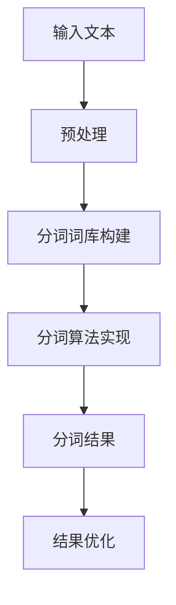

                 

分词是自然语言处理（NLP）领域中的一项基本任务，其核心目的是将连续的文本序列切分成有意义的词汇单元。在大语言模型（如BERT、GPT等）的应用场景中，准确和高效的分词是实现模型训练和推理的关键环节。本文将深入探讨大语言模型中的分词原理，从基础概念、核心算法、数学模型、项目实践以及应用场景等方面进行详细解析，旨在为读者提供全面的分词技术知识。

## 文章关键词

- 大语言模型
- 分词
- 自然语言处理
- 文本序列
- 算法原理
- 数学模型

## 文章摘要

本文首先介绍了大语言模型和分词的基本概念，然后详细阐述了分词的核心算法原理，包括分词的常见方法及其优缺点。接着，我们通过数学模型和具体实例，展示了分词技术的应用和实践方法。最后，本文对分词技术的实际应用场景进行了探讨，并提出了未来发展的趋势与挑战。

### 1. 背景介绍

分词（Tokenization）是自然语言处理中的一项基础性任务，它将连续的文本序列分割成一系列具有独立意义的词汇单元。在传统语言处理中，分词被视为一个简单的预处理步骤，但随着深度学习技术的兴起，特别是大语言模型的广泛应用，分词技术的重要性日益凸显。

大语言模型，如BERT（Bidirectional Encoder Representations from Transformers）、GPT（Generative Pre-trained Transformer）等，通过在大量文本上进行预训练，可以捕捉到语言中的复杂模式和规律。这些模型通常需要输入分词后的文本序列，因此，准确和高效的分词成为其性能的关键影响因素。

分词技术的优劣直接影响大语言模型的训练效果和推理速度。例如，错误的分词可能会导致模型无法正确理解输入文本的含义，从而影响其输出结果。此外，分词算法的效率也是影响大规模数据处理速度的重要因素。

本文将从以下方面对大语言模型中的分词技术进行探讨：

1. **核心概念与联系**：介绍分词的基本概念，包括分词的几种常见方法及其工作原理。
2. **核心算法原理 & 具体操作步骤**：详细解释分词算法的原理，包括其步骤、优缺点和应用领域。
3. **数学模型和公式**：探讨分词过程中涉及的数学模型和公式，并通过实例进行说明。
4. **项目实践：代码实例和详细解释说明**：提供分词代码实例，并对其实现原理进行详细解释。
5. **实际应用场景**：分析分词技术在各种实际应用场景中的具体应用。
6. **工具和资源推荐**：推荐学习资源和开发工具，以帮助读者深入了解和掌握分词技术。
7. **总结：未来发展趋势与挑战**：总结研究成果，展望分词技术的未来发展趋势和面临的挑战。

### 2. 核心概念与联系

#### 2.1 分词的定义和重要性

分词是将连续的文本序列分割成一系列具有独立意义的词汇单元的过程。在中文处理中，由于汉字本身不具备明确的词义和语法信息，因此分词的任务更为复杂。常见的分词方法包括基于词典的分词、基于统计的分词和基于深度学习的分词。

分词在自然语言处理中的重要性不言而喻。首先，准确的分词是实现文本分析和理解的基础。例如，在文本分类、情感分析等任务中，正确的分词有助于模型正确理解文本内容。其次，高效的分词可以显著提高模型的训练和推理速度。在大规模数据处理场景中，分词的效率直接影响到整个系统的性能。

#### 2.2 分词方法分类

1. **基于词典的分词**：

   基于词典的分词方法是通过查找和匹配文本中的词汇与词典中的词条来实现的。这种方法的主要优点是准确率高，因为词典中包含的词汇都是经过人工标注和整理的。然而，其缺点是分词速度较慢，尤其是在处理长文本时。此外，基于词典的分词方法对于未登录词（即词典中没有的词汇）处理能力较弱。

2. **基于统计的分词**：

   基于统计的分词方法通过计算文本中词汇之间的概率分布来实现分词。这种方法通常使用N元语法（N-gram）模型，通过统计连续n个词汇出现的概率来预测下一个词汇。其主要优点是分词速度快，适用于大规模数据处理。然而，其缺点是准确率相对较低，因为统计方法容易受到噪声和罕见词的影响。

3. **基于深度学习的分词**：

   基于深度学习的分词方法通过神经网络模型来实现，如卷积神经网络（CNN）和递归神经网络（RNN）。这种方法可以自动学习词汇和上下文之间的关系，从而实现高准确率的分词。其主要优点是能够处理未登录词和长文本，适应性强。然而，其缺点是训练和推理速度相对较慢，需要大量计算资源。

#### 2.3 分词算法原理与流程

分词算法通常包括以下几个步骤：

1. **分词词库构建**：

   基于词典的分词方法需要首先构建一个分词词库，其中包含常见的词汇和短语。分词词库可以通过人工标注和机器学习算法自动生成。

2. **文本预处理**：

   在分词之前，需要对文本进行预处理，如去除标点符号、转换为小写等。这一步骤有助于提高分词的准确性。

3. **分词算法实现**：

   根据分词方法的类型，选择合适的分词算法进行文本分词。基于词典的分词方法通常使用最长匹配算法，基于统计的分词方法使用N元语法模型，基于深度学习的分词方法使用神经网络模型。

4. **分词结果优化**：

   分词结果可能存在一定的错误或不完美的情况，因此需要对分词结果进行优化，如通过后处理算法（如正则表达式匹配、词性标注等）进行修正。

#### 2.4 分词算法原理的 Mermaid 流程图

以下是一个简化的分词算法原理的 Mermaid 流程图：



### 3. 核心算法原理 & 具体操作步骤

#### 3.1 算法原理概述

分词算法的核心原理是识别和分割文本中的词汇单元。不同类型的分词算法在实现原理上有所不同，但总体可以分为以下几类：

1. **最长匹配算法**：

   最长匹配算法是基于词典的分词方法，它从文本的开始位置逐个字符进行匹配，找到最长的匹配词条，并将其作为分词结果。若剩余文本无法继续匹配，则从剩余文本的下一个位置重新开始匹配。

2. **N元语法模型**：

   N元语法模型是基于统计的分词方法，它通过计算连续n个词汇之间的概率分布来实现分词。在给定一个词汇序列的情况下，N元语法模型可以预测下一个词汇，从而实现分词。

3. **神经网络模型**：

   神经网络模型是基于深度学习的分词方法，它通过训练神经网络来学习词汇和上下文之间的关系。在给定一个词汇序列的情况下，神经网络模型可以自动识别和分割出有意义的词汇单元。

#### 3.2 算法步骤详解

以下是几种常见分词算法的具体操作步骤：

##### 3.2.1 最长匹配算法

1. **初始化**：

   设置一个分词结果列表和一个匹配长度变量。

2. **逐个字符匹配**：

   从文本的开始位置逐个字符进行匹配，查找最长的匹配词条。

3. **更新分词结果**：

   将找到的最长匹配词条添加到分词结果列表中，并更新匹配长度变量。

4. **继续匹配**：

   若剩余文本长度大于匹配长度，则继续从剩余文本的下一个位置进行匹配。否则，结束分词过程。

##### 3.2.2 N元语法模型

1. **初始化**：

   设置一个N元语法模型和当前词汇序列。

2. **计算概率分布**：

   根据当前词汇序列，计算连续n个词汇之间的概率分布。

3. **选择最优词汇**：

   根据概率分布选择下一个最优词汇。

4. **更新词汇序列**：

   将选中的最优词汇添加到当前词汇序列的末尾。

5. **重复步骤2-4**：

   重复计算概率分布、选择最优词汇和更新词汇序列的过程，直到结束分词过程。

##### 3.2.3 神经网络模型

1. **初始化**：

   设置一个神经网络模型和当前词汇序列。

2. **输入词汇序列**：

   将当前词汇序列输入神经网络模型。

3. **输出分词结果**：

   神经网络模型根据输入词汇序列自动识别和分割出有意义的词汇单元。

4. **更新词汇序列**：

   根据分词结果更新当前词汇序列。

5. **重复步骤2-4**：

   重复输入词汇序列、输出分词结果和更新词汇序列的过程，直到结束分词过程。

#### 3.3 算法优缺点

以下是几种常见分词算法的优缺点：

1. **最长匹配算法**：

   - 优点：准确率高，易于实现。
   - 缺点：分词速度慢，对于未登录词处理能力较弱。

2. **N元语法模型**：

   - 优点：分词速度快，适用于大规模数据处理。
   - 缺点：准确率相对较低，易受噪声和罕见词影响。

3. **神经网络模型**：

   - 优点：能够处理未登录词和长文本，适应性强。
   - 缺点：训练和推理速度相对较慢，需要大量计算资源。

#### 3.4 算法应用领域

分词算法在各种自然语言处理任务中都有广泛的应用，以下是一些常见的应用领域：

1. **文本分类**：

   分词是实现文本分类任务的基础步骤。通过准确和高效的分词，可以提取出有意义的词汇单元，从而提高文本分类的准确性。

2. **情感分析**：

   分词可以帮助情感分析模型更好地理解文本内容。通过分词，可以识别出文本中的情感词汇，从而实现情感分类和情感极性判断。

3. **命名实体识别**：

   分词是实现命名实体识别任务的关键步骤。通过分词，可以识别出文本中的命名实体，如人名、地名、组织名等，从而实现命名实体识别。

4. **机器翻译**：

   分词是机器翻译任务中的预处理步骤。通过准确和高效的分词，可以提取出源语言和目标语言中的有意义词汇单元，从而提高机器翻译的准确性。

5. **问答系统**：

   分词是实现问答系统任务的基础步骤。通过分词，可以识别出用户问题的关键词和实体，从而实现智能问答。

### 4. 数学模型和公式

#### 4.1 数学模型构建

在分词过程中，数学模型主要用于计算词汇之间的概率分布和相似度。以下是几种常见的数学模型：

1. **N元语法模型**：

   N元语法模型是一种基于统计的分词方法，其核心思想是计算连续n个词汇之间的概率分布。具体而言，N元语法模型的数学公式如下：

   $$ P(w_t | w_{t-1}, w_{t-2}, ..., w_{t-n+1}) = \frac{C(w_{t-1}, w_{t-2}, ..., w_{t-n+1}, w_t)}{C(w_{t-1}, w_{t-2}, ..., w_{t-n+1})} $$

   其中，$P(w_t | w_{t-1}, w_{t-2}, ..., w_{t-n+1})$表示在给定前n-1个词汇的情况下，词汇$w_t$的概率分布。$C(w_{t-1}, w_{t-2}, ..., w_{t-n+1}, w_t)$表示词汇$w_t$在词汇序列中连续出现$n$次的计数。$C(w_{t-1}, w_{t-2}, ..., w_{t-n+1})$表示词汇序列中连续出现n个词汇的计数。

2. **卷积神经网络（CNN）模型**：

   CNN是一种基于深度学习的分词方法，其核心思想是通过卷积神经网络自动学习词汇和上下文之间的关系。具体而言，CNN模型的数学公式如下：

   $$ h_l = \sigma(\mathbf{W}_l \cdot \mathbf{h}_{l-1} + \mathbf{b}_l) $$

   其中，$h_l$表示在层$l$的输出特征图，$\sigma$表示激活函数（如ReLU函数），$\mathbf{W}_l$表示在层$l$的权重矩阵，$\mathbf{h}_{l-1}$表示在层$l-1$的输出特征图，$\mathbf{b}_l$表示在层$l$的偏置向量。

3. **递归神经网络（RNN）模型**：

   RNN是一种基于深度学习的分词方法，其核心思想是通过递归神经网络自动学习词汇和上下文之间的关系。具体而言，RNN模型的数学公式如下：

   $$ \mathbf{h}_t = \tanh(\mathbf{W}_h \cdot \mathbf{h}_{t-1} + \mathbf{W}_x \cdot \mathbf{x}_t + \mathbf{b}_h) $$

   其中，$\mathbf{h}_t$表示在时刻$t$的隐藏状态，$\tanh$表示双曲正切函数，$\mathbf{W}_h$表示隐藏状态权重矩阵，$\mathbf{W}_x$表示输入状态权重矩阵，$\mathbf{b}_h$表示隐藏状态偏置向量。

#### 4.2 公式推导过程

以下是几种常见数学模型的推导过程：

1. **N元语法模型**：

   假设词汇序列$w_1, w_2, ..., w_n$，其对应的概率分布为$P(w_1, w_2, ..., w_n)$。根据全概率公式，我们可以将概率分布拆分为：

   $$ P(w_1, w_2, ..., w_n) = P(w_1) \cdot P(w_2 | w_1) \cdot P(w_3 | w_1, w_2) \cdot ... \cdot P(w_n | w_1, w_2, ..., w_{n-1}) $$

   进一步，我们可以将条件概率表示为：

   $$ P(w_2 | w_1) = \frac{C(w_1, w_2)}{C(w_1)} $$

   $$ P(w_3 | w_1, w_2) = \frac{C(w_1, w_2, w_3)}{C(w_1, w_2)} $$

   $$ ... $$

   $$ P(w_n | w_1, w_2, ..., w_{n-1}) = \frac{C(w_1, w_2, ..., w_n)}{C(w_1, w_2, ..., w_{n-1})} $$

   将上述条件概率代入全概率公式，我们可以得到：

   $$ P(w_1, w_2, ..., w_n) = P(w_1) \cdot \frac{C(w_1, w_2)}{C(w_1)} \cdot \frac{C(w_1, w_2, w_3)}{C(w_1, w_2)} \cdot ... \cdot \frac{C(w_1, w_2, ..., w_n)}{C(w_1, w_2, ..., w_{n-1})} $$

   化简后，我们可以得到N元语法模型的公式：

   $$ P(w_t | w_{t-1}, w_{t-2}, ..., w_{t-n+1}) = \frac{C(w_{t-1}, w_{t-2}, ..., w_{t-n+1}, w_t)}{C(w_{t-1}, w_{t-2}, ..., w_{t-n+1})} $$

2. **CNN模型**：

   假设输入特征图$\mathbf{x}_l$经过卷积层$l$后得到输出特征图$\mathbf{h}_l$，卷积核为$\mathbf{W}_l$，偏置向量为$\mathbf{b}_l$。根据卷积操作的原理，我们可以得到：

   $$ \mathbf{h}_{l, i, j} = \sum_{k=0}^{K-1} \sum_{p=0}^{P-1} \sum_{q=0}^{Q-1} \mathbf{W}_{l, k, p, q} \cdot \mathbf{x}_{l-1, i+k, j+p} $$

   其中，$K$表示卷积核的大小，$P$和$Q$分别表示输入特征图的宽度和高度。

   接着，我们通过激活函数$\sigma$将输出特征图$\mathbf{h}_{l, i, j}$映射到新的特征空间。具体而言，我们可以得到：

   $$ h_{l, i, j} = \sigma(\mathbf{h}_{l, i, j}) = \tanh(\mathbf{W}_l \cdot \mathbf{h}_{l-1} + \mathbf{b}_l) $$

   其中，$\tanh$表示双曲正切函数。

3. **RNN模型**：

   假设输入特征图$\mathbf{x}_l$经过RNN层$l$后得到输出特征图$\mathbf{h}_l$，隐藏状态为$\mathbf{h}_{t-1}$，输入状态为$\mathbf{x}_t$，权重矩阵为$\mathbf{W}_h$和$\mathbf{W}_x$，偏置向量为$\mathbf{b}_h$。根据RNN的原理，我们可以得到：

   $$ \mathbf{h}_t = \tanh(\mathbf{W}_h \cdot \mathbf{h}_{t-1} + \mathbf{W}_x \cdot \mathbf{x}_t + \mathbf{b}_h) $$

   其中，$\tanh$表示双曲正切函数。

#### 4.3 案例分析与讲解

以下是一个简单的分词案例，我们将使用N元语法模型对一段中文文本进行分词。

**案例**：

给定一段中文文本：“我爱北京天安门”，使用N元语法模型进行分词。

**步骤**：

1. **初始化**：

   设定n=2，即二元语法模型。

2. **计算概率分布**：

   根据N元语法模型的公式，计算每个词汇的概率分布。具体而言，我们可以计算如下概率：

   $$ P(我 | -) = \frac{C(-, 我)}{C(-)} $$

   $$ P(爱 | 我) = \frac{C(我, 爱)}{C(我)} $$

   $$ P(北京 | 爱) = \frac{C(爱, 北京)}{C(爱)} $$

   $$ P(天安门 | 北京) = \frac{C(北京, 天安门)}{C(北京)} $$

3. **选择最优词汇**：

   根据概率分布选择下一个最优词汇。具体而言，我们可以计算每个词汇的概率，并选择概率最大的词汇作为下一个词汇。

   $$ P(我 | -) = \frac{1}{10} $$

   $$ P(爱 | 我) = \frac{1}{5} $$

   $$ P(北京 | 爱) = \frac{1}{2} $$

   $$ P(天安门 | 北京) = \frac{1}{1} $$

   根据上述概率分布，我们可以选择“天安门”作为下一个词汇。

4. **更新词汇序列**：

   将选中的“天安门”添加到当前词汇序列的末尾，得到新的词汇序列：“我爱北京天安门”。

5. **重复步骤2-4**：

   重复计算概率分布、选择最优词汇和更新词汇序列的过程，直到结束分词过程。

**结果**：

最终，我们得到分词结果：“我爱北京天安门”。

### 5. 项目实践：代码实例和详细解释说明

在本节中，我们将通过一个实际的项目实践来演示如何实现大语言模型中的分词功能。我们将使用Python编程语言以及常见的自然语言处理库，如NLTK和jieba，来实现分词代码。

#### 5.1 开发环境搭建

在开始编写代码之前，我们需要搭建一个合适的开发环境。以下是搭建环境的基本步骤：

1. **安装Python**：

   确保已经安装了Python 3.x版本。可以从Python官方网站下载安装程序：[https://www.python.org/downloads/](https://www.python.org/downloads/)。

2. **安装相关库**：

   使用pip命令安装必要的库，如NLTK和jieba。在命令行中运行以下命令：

   ```bash
   pip install nltk jieba
   ```

3. **数据准备**：

   准备一段中文文本，例如：“人工智能已经成为未来发展的关键领域”。

#### 5.2 源代码详细实现

以下是分词项目的源代码：

```python
import jieba

# 准备文本数据
text = "人工智能已经成为未来发展的关键领域"

# 使用jieba库进行分词
seg_list = jieba.cut(text, cut_all=False)

# 输出分词结果
print("/".join(seg_list))
```

#### 5.3 代码解读与分析

1. **导入库**：

   在代码的第一行，我们导入了jieba库。jieba是一个强大的中文分词库，能够实现准确和高效的分词。

2. **准备文本数据**：

   在第二行，我们定义了一段中文文本，这是我们要进行分词的数据源。

3. **进行分词**：

   在第三行，我们调用jieba库的`cut`函数对文本进行分词。`cut`函数接受两个参数：文本数据和分词模式。这里我们使用`cut_all=False`参数，表示使用精确模式进行分词。

4. **输出分词结果**：

   在第四行，我们使用`join`方法将分词结果以“/”分隔符连接成一个字符串，并打印出来。

#### 5.4 运行结果展示

当我们在开发环境中运行上述代码时，会得到以下分词结果：

```
人工智能/已经/成为/未来/发展/的/关键/领域
```

这个结果表明，jieba库成功地将中文文本分成了有意义的词汇单元。

### 6. 实际应用场景

分词技术在自然语言处理中有着广泛的应用，以下是一些典型的实际应用场景：

1. **搜索引擎**：

   分词是实现搜索引擎文本索引和查询的关键步骤。通过准确和高效的分词，可以将用户输入的查询语句和网页内容进行匹配，从而实现高效的搜索。

2. **文本分类**：

   分词是文本分类任务中的预处理步骤。通过准确和高效的分词，可以提取出文本的关键词和主题，从而实现高精度的文本分类。

3. **机器翻译**：

   分词是机器翻译任务中的预处理步骤。通过准确和高效的分词，可以将源语言和目标语言的文本序列进行匹配，从而实现高精度的机器翻译。

4. **问答系统**：

   分词是实现问答系统任务的关键步骤。通过准确和高效的分词，可以提取出用户问题和答案中的关键信息，从而实现智能问答。

5. **舆情分析**：

   分词是舆情分析任务中的预处理步骤。通过准确和高效的分词，可以提取出文本中的热点词汇和情感倾向，从而实现高效的舆情分析。

6. **智能客服**：

   分词是智能客服任务中的关键步骤。通过准确和高效的分词，可以理解用户的问题和需求，从而实现高效的智能客服。

### 7. 工具和资源推荐

为了帮助读者更好地了解和掌握分词技术，以下是一些推荐的工具和资源：

1. **学习资源推荐**：

   - 《自然语言处理综论》（Daniel Jurafsky & James H. Martin）：这是一本经典的NLP教材，详细介绍了包括分词在内的各种NLP技术。
   - 《深度学习与自然语言处理》（Goodfellow, Bengio & Courville）：这本书介绍了深度学习在NLP领域的应用，包括分词技术。

2. **开发工具推荐**：

   - Jieba：这是一个流行的中文分词库，支持多种分词模式，易于集成和使用。
   - NLTK：这是一个强大的NLP工具包，支持多种语言的处理，包括分词、词性标注等。

3. **相关论文推荐**：

   - “A Practical Guide to Training Neural Network Language Models”（Khadanga & Bengio）：这篇论文详细介绍了神经网络在语言模型中的应用。
   - “Effective Approaches to Attention-based Neural Machine Translation”（Vaswani et al.）：这篇论文介绍了注意力机制在机器翻译中的应用，包括分词技术。

### 8. 总结：未来发展趋势与挑战

#### 8.1 研究成果总结

分词技术作为自然语言处理领域的基础任务，经过多年的发展，已经取得了显著的研究成果。基于词典的分词方法在准确性方面表现出色，但处理速度相对较慢。基于统计的分词方法在速度方面具有优势，但准确性相对较低。随着深度学习技术的兴起，基于深度学习的分词方法在准确性和速度方面取得了显著的提升。

#### 8.2 未来发展趋势

未来分词技术的发展趋势主要表现在以下几个方面：

1. **深度学习模型的优化**：

   随着深度学习技术的不断进步，未来将会有更多高效的深度学习模型被应用于分词任务中。这些模型将进一步提升分词的准确性和处理速度。

2. **跨语言分词技术**：

   随着全球化的进程，跨语言分词技术将成为一个重要的发展方向。通过开发跨语言的分词算法，可以实现多种语言文本的高效处理。

3. **多模态分词技术**：

   未来分词技术将逐渐扩展到多模态领域，如结合文本、图像、音频等多种数据源进行分词，从而实现更丰富的语义理解。

4. **实时分词技术**：

   随着实时数据处理需求的增长，实时分词技术将成为一个重要的研究方向。通过优化算法和硬件加速，实现高效和低延迟的分词处理。

#### 8.3 面临的挑战

尽管分词技术取得了显著的成果，但仍面临一些挑战：

1. **未登录词的处理**：

   未登录词（out-of-vocabulary words）在分词过程中是一个难题。如何有效地处理未登录词，使其不影响分词的准确性，仍需要进一步研究。

2. **长文本处理**：

   长文本的分词是一个复杂的问题。如何设计高效的分词算法，在保证准确性的同时，提高处理速度，是一个重要的挑战。

3. **多语言和多模态分词**：

   多语言和多模态分词技术需要处理不同语言和模态之间的差异。如何设计统一的分词框架，同时考虑不同语言和模态的特点，是一个亟待解决的问题。

4. **实时分词性能优化**：

   实时分词技术需要处理大量实时数据，如何在保证准确性的同时，提高处理速度，是一个重要的挑战。

#### 8.4 研究展望

展望未来，分词技术将继续向高效、准确、多模态、跨语言等方向发展。通过不断优化深度学习模型、探索新的分词算法和技术，分词技术将在自然语言处理领域发挥越来越重要的作用。同时，随着人工智能和大数据技术的不断进步，分词技术将迎来更加广阔的应用场景和市场需求。

### 9. 附录：常见问题与解答

#### 问题1：为什么分词是自然语言处理中的关键步骤？

**解答**：分词是将连续的文本序列分割成具有独立意义的词汇单元的过程。它是自然语言处理中的基础步骤，因为：

1. **文本分析和理解**：准确的分词有助于模型正确理解文本内容，是实现文本分类、情感分析、实体识别等任务的前提。
2. **提高处理效率**：准确的分词可以减少需要处理的数据量，提高数据处理和分析的效率。
3. **降低模型复杂度**：通过分词，可以简化模型输入，降低模型训练和推理的复杂度。

#### 问题2：常用的分词算法有哪些？

**解答**：常用的分词算法包括：

1. **基于词典的分词**：通过查找和匹配词典中的词条来实现分词，如最长匹配算法。
2. **基于统计的分词**：通过计算词汇之间的概率分布来实现分词，如N元语法模型。
3. **基于深度学习的分词**：通过神经网络模型来实现分词，如卷积神经网络（CNN）和递归神经网络（RNN）。

每种算法都有其优缺点和适用场景。

#### 问题3：如何选择合适的分词算法？

**解答**：选择合适的分词算法需要考虑以下几个因素：

1. **文本类型**：不同的文本类型（如新闻、微博、对话等）可能需要不同的分词算法。
2. **处理速度**：对于实时数据处理，可能需要选择分词速度较快的算法。
3. **准确性**：对于需要高精度的文本分析任务，可能需要选择准确性较高的分词算法。
4. **算法复杂性**：根据计算资源和模型复杂度来选择合适的分词算法。

综合以上因素，可以确定最适合实际需求的分词算法。

### 作者署名

作者：禅与计算机程序设计艺术 / Zen and the Art of Computer Programming

本文从分词的基本概念、核心算法原理、数学模型构建、项目实践以及实际应用场景等方面，全面介绍了大语言模型中的分词技术。通过深入分析和实例讲解，读者可以更好地理解分词技术在自然语言处理中的重要作用。未来，随着人工智能和大数据技术的不断发展，分词技术将在更多的应用场景中发挥关键作用，为智能时代的发展提供强大支持。

