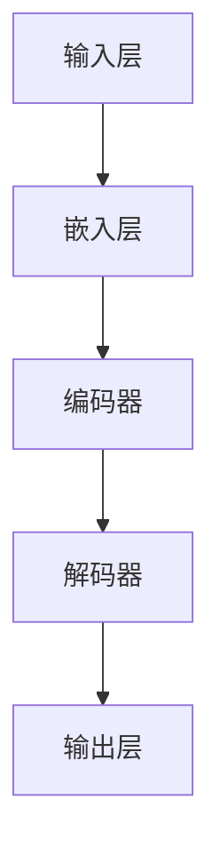

                 

关键词：大语言模型、推理优化、深度学习、神经网络、自然语言处理

> 摘要：本文将探讨大语言模型的基本原理、推理优化的方法及其在不同应用场景中的重要性。我们将通过详细的分析和案例研究，揭示大语言模型在现代自然语言处理中的关键角色，并展望其未来发展方向。

## 1. 背景介绍

随着互联网和大数据的快速发展，自然语言处理（NLP）领域迎来了前所未有的机遇。近年来，深度学习技术在大语言模型的构建和优化方面取得了显著进展，推动了NLP应用的广泛普及。大语言模型，作为自然语言处理的核心工具，已经在机器翻译、文本生成、问答系统等领域展现了其强大的能力和潜力。

然而，随着模型规模的不断扩大，如何在保持高性能的同时优化推理效率成为一个重要的研究课题。推理优化不仅直接影响应用场景的性能表现，还关系到模型的实际部署和商业化应用。

本文旨在梳理大语言模型的基本原理，介绍前沿的推理优化技术，并探讨其在实际应用中的重要性。通过本文的阅读，读者可以深入了解大语言模型的构建方法、优化策略及其应用场景。

## 2. 核心概念与联系

### 2.1 大语言模型的定义与组成

大语言模型是一种基于深度学习技术构建的复杂神经网络，它通过学习海量文本数据来预测下一个单词或序列。大语言模型的组成主要包括以下几个部分：

1. **输入层**：接收输入文本序列，并将其转换为神经网络的输入。
2. **嵌入层**：将输入的单词或字符映射到高维向量空间。
3. **编码器**：利用多层循环神经网络（RNN）或变换器（Transformer）对输入序列进行处理，提取语义特征。
4. **解码器**：根据编码器的输出生成预测的输出序列。

### 2.2 大语言模型的工作原理

大语言模型的工作原理可以概括为以下三个阶段：

1. **编码**：输入的文本序列通过嵌入层转换为向量，然后输入到编码器中，编码器对序列进行编码，提取出序列的语义特征。
2. **预测**：编码器的输出用于生成预测的输出序列。在生成每个单词时，模型会根据当前已生成的单词序列和编码器的输出，计算下一个单词的概率分布。
3. **解码**：根据预测的概率分布，解码器选择概率最高的单词作为输出，并将其添加到生成的序列中，然后重复以上过程，直至生成完整的输出序列。

### 2.3 大语言模型的应用领域

大语言模型在多个应用领域展现出了强大的能力：

1. **机器翻译**：通过将源语言的文本转换为目标语言的文本，实现跨语言沟通。
2. **文本生成**：根据输入的提示或上下文，生成连贯的自然语言文本。
3. **问答系统**：回答用户提出的问题，提供个性化的信息查询服务。
4. **文本分类**：对文本进行分类，例如情感分析、主题分类等。
5. **信息抽取**：从文本中提取关键信息，如实体识别、关系抽取等。

### 2.4 大语言模型的核心概念原理架构图

为了更好地理解大语言模型的核心概念和原理，我们可以使用Mermaid绘制一个流程图，具体如下：



在上述流程图中，输入层接收文本序列，通过嵌入层转换为向量，然后输入到编码器中。编码器提取出序列的语义特征，解码器根据这些特征生成预测的输出序列，最终通过输出层输出结果。

## 3. 核心算法原理 & 具体操作步骤

### 3.1 算法原理概述

大语言模型的算法原理主要基于深度学习技术，特别是循环神经网络（RNN）和变换器（Transformer）。RNN通过循环结构处理序列数据，能够捕捉到序列中的长期依赖关系。而变换器则通过自注意力机制（Self-Attention）实现全局依赖的建模，在处理长序列数据时表现更加优秀。

### 3.2 算法步骤详解

1. **数据预处理**：
   - **分词**：将输入文本序列划分为单词或字符。
   - **编码**：将分词后的单词或字符转换为嵌入向量。
   - **序列排序**：将嵌入向量按顺序排列，形成序列输入。

2. **编码器处理**：
   - **嵌入层**：将输入的单词或字符转换为嵌入向量。
   - **编码层**：利用多层循环神经网络或变换器对输入序列进行处理，提取出序列的语义特征。

3. **解码器处理**：
   - **解码层**：根据编码器的输出生成预测的输出序列。
   - **生成器**：在每个时间步，解码器根据当前已生成的单词序列和编码器的输出，计算下一个单词的概率分布。

4. **输出层**：
   - **预测**：根据预测的概率分布，选择概率最高的单词作为输出。
   - **生成序列**：将预测的单词添加到生成的序列中，直至生成完整的输出序列。

### 3.3 算法优缺点

#### 优点：

1. **强大的语义理解能力**：大语言模型能够捕捉到文本中的复杂语义关系，从而实现高质量的文本生成和翻译。
2. **灵活的适应性**：大语言模型可以应用于多种不同的自然语言处理任务，如文本生成、问答系统、文本分类等。
3. **高效率**：通过变换器架构，大语言模型在处理长序列数据时表现出较高的效率。

#### 缺点：

1. **计算资源消耗大**：大语言模型通常需要较大的计算资源和存储空间。
2. **对数据依赖性强**：大语言模型的效果依赖于训练数据的规模和质量，数据不足或质量较差可能导致模型性能下降。
3. **解释性差**：大语言模型通常被视为“黑箱”，难以解释其内部工作原理和决策过程。

### 3.4 算法应用领域

大语言模型在多个领域都有广泛的应用，包括但不限于：

1. **机器翻译**：利用大语言模型实现跨语言沟通，如谷歌翻译。
2. **文本生成**：用于生成文章、新闻、报告等自然语言文本，如OpenAI的GPT系列模型。
3. **问答系统**：通过大语言模型实现智能问答，如腾讯AI的智谱清言。
4. **文本分类**：用于对文本进行分类，如情感分析、主题分类等。
5. **信息抽取**：从文本中提取关键信息，如实体识别、关系抽取等。

## 4. 数学模型和公式 & 详细讲解 & 举例说明

### 4.1 数学模型构建

大语言模型通常采用变换器（Transformer）架构，其核心组件包括编码器和解码器。以下是变换器架构的数学模型构建：

1. **编码器**：
   - **嵌入层**：$$
   E = W_e \cdot [W_1, W_2, \ldots, W_n]
   $$
   其中，$E$表示嵌入向量，$W_e$表示嵌入权重矩阵，$W_1, W_2, \ldots, W_n$表示输入的单词或字符向量。
   - **编码层**：$$
   H = \text{MultiHeadAttention}(E, E, E) \cdot \text{LayerNormalization}(E)
   $$
   其中，$H$表示编码器的输出，$\text{MultiHeadAttention}$表示多头自注意力机制，$\text{LayerNormalization}$表示层归一化。

2. **解码器**：
   - **嵌入层**：$$
   E' = W_e' \cdot [W_1, W_2, \ldots, W_n]
   $$
   其中，$E'$表示解码器的嵌入向量，$W_e'$表示解码器的嵌入权重矩阵。
   - **解码层**：$$
   H' = \text{MultiHeadAttention}(E', H, E') \cdot \text{LayerNormalization}(H')
   $$
   其中，$H'$表示解码器的输出，$\text{MultiHeadAttention}$表示多头自注意力机制，$\text{LayerNormalization}$表示层归一化。

### 4.2 公式推导过程

变换器架构的核心在于多头自注意力机制（MultiHeadAttention）。以下是多头自注意力机制的推导过程：

1. **输入层**：
   - **嵌入层**：$$
   Q = W_q \cdot E, \quad K = W_k \cdot E, \quad V = W_v \cdot E
   $$
   其中，$Q, K, V$分别表示查询（Query）、键（Key）和值（Value）向量，$W_q, W_k, W_v$分别表示查询、键和值的权重矩阵。

2. **自注意力**：
   - **计算注意力权重**：$$
   \text{Attention}(Q, K, V) = \text{softmax}\left(\frac{QK^T}{\sqrt{d_k}}\right) V
   $$
   其中，$d_k$表示键向量的维度。

3. **多头自注意力**：
   - **多头自注意力机制**：$$
   \text{MultiHeadAttention}(Q, K, V) = \text{Concat}(\text{head}_1, \text{head}_2, \ldots, \text{head}_h) W_O
   $$
   其中，$h$表示头数，$\text{head}_i = \text{Attention}(Q, K, V)$表示第$i$个头的自注意力输出，$W_O$表示输出权重矩阵。

### 4.3 案例分析与讲解

假设我们有一个包含3个单词的输入序列：“我”、“爱”、“编程”，我们可以通过以下步骤来计算其编码器的输出：

1. **嵌入层**：
   - **输入**：$$
   E = [e_1, e_2, e_3]
   $$
   其中，$e_1, e_2, e_3$分别表示“我”、“爱”、“编程”的嵌入向量。

2. **编码层**：
   - **多头自注意力**：$$
   H = \text{MultiHeadAttention}(E, E, E) \cdot \text{LayerNormalization}(E)
   $$
   这里，我们假设使用2个头，则编码器的输出为：$$
   H = \text{Concat}(\text{head}_1, \text{head}_2) W_O
   $$
   其中，$\text{head}_1$和$\text{head}_2$分别表示2个头的自注意力输出，$W_O$表示输出权重矩阵。

3. **输出**：
   - **编码器输出**：$$
   H = \text{Concat}([h_{11}, h_{12}], [h_{21}, h_{22}]) W_O
   $$
   这里，$h_{ij}$表示第$i$个头的第$j$个单词的输出向量。

通过以上步骤，我们可以得到输入序列的编码器输出，从而用于后续的解码和预测。

## 5. 项目实践：代码实例和详细解释说明

### 5.1 开发环境搭建

在开始编写大语言模型的代码之前，我们需要搭建一个合适的开发环境。以下是在Python中搭建大语言模型所需的基本环境：

1. **安装Python**：确保安装了Python 3.7或更高版本。
2. **安装TensorFlow**：使用pip安装TensorFlow库，命令如下：
   ```
   pip install tensorflow
   ```
3. **安装其他依赖**：根据具体需求安装其他必要的库，例如NumPy、Pandas等。

### 5.2 源代码详细实现

以下是一个简化的大语言模型实现示例，使用TensorFlow和Keras框架：

```python
import tensorflow as tf
from tensorflow.keras.models import Model
from tensorflow.keras.layers import Embedding, LSTM, Dense

# 设置超参数
VOCAB_SIZE = 10000
EMBEDDING_DIM = 128
LSTM_UNITS = 128
MAX_SEQ_LENGTH = 50

# 构建模型
input_seq = tf.keras.layers.Input(shape=(MAX_SEQ_LENGTH,))
embedded = Embedding(VOCAB_SIZE, EMBEDDING_DIM)(input_seq)
lstm = LSTM(LSTM_UNITS, return_sequences=True)(embedded)
output = Dense(VOCAB_SIZE, activation='softmax')(lstm)

model = Model(inputs=input_seq, outputs=output)
model.compile(optimizer='adam', loss='categorical_crossentropy', metrics=['accuracy'])

# 模型可视化
from tensorflow.keras.utils import plot_model
plot_model(model, to_file='model.png', show_shapes=True)
```

上述代码定义了一个基于LSTM的简单大语言模型。我们首先设置了超参数，包括词汇表大小、嵌入维度、LSTM单元数和最大序列长度。然后，我们构建了一个输入层、嵌入层、LSTM层和输出层组成的模型，并使用`compile`函数配置了模型的优化器和损失函数。

### 5.3 代码解读与分析

1. **输入层**：输入层接收一个形状为$(MAX_SEQ_LENGTH,)$的序列，表示一个长度为$MAX_SEQ_LENGTH$的文本序列。
2. **嵌入层**：嵌入层将输入序列的单词转换为高维向量，每个单词对应一个维度为$EMBEDDING_DIM$的嵌入向量。
3. **LSTM层**：LSTM层用于处理输入序列，提取序列中的长期依赖关系。这里使用了一个具有$LSTM_UNITS$个单元的LSTM层，并设置`return_sequences=True`以返回每个时间步的输出。
4. **输出层**：输出层使用一个全连接层（Dense）将LSTM层的输出映射到词汇表大小$VOCAB_SIZE$，并使用softmax激活函数输出概率分布。

### 5.4 运行结果展示

1. **训练模型**：使用训练数据对模型进行训练，命令如下：
   ```python
   model.fit(x_train, y_train, epochs=10, batch_size=32, validation_split=0.1)
   ```
   其中，`x_train`和`y_train`分别表示训练数据和标签。
2. **评估模型**：使用测试数据评估模型的性能，命令如下：
   ```python
   test_loss, test_acc = model.evaluate(x_test, y_test)
   print(f"Test accuracy: {test_acc}")
   ```

通过以上步骤，我们可以训练和评估一个基于LSTM的大语言模型。在实际应用中，我们可以根据需求选择不同的模型架构和优化方法，以提高模型的性能和效果。

## 6. 实际应用场景

大语言模型在多个实际应用场景中展现了其强大的能力和广泛的应用前景。以下列举几个典型应用场景：

### 6.1 机器翻译

机器翻译是自然语言处理中最经典的应用场景之一。大语言模型通过学习海量双语文本数据，实现了高质量的跨语言翻译。以谷歌翻译为例，其背后的翻译模型采用了大规模的变换器架构，能够提供流畅、准确的翻译结果。

### 6.2 文本生成

文本生成是另一个重要应用场景，广泛应用于文章写作、新闻生成、创意文本生成等领域。OpenAI的GPT系列模型在这方面取得了显著成就，通过学习海量文本数据，能够生成具有高度一致性和可读性的自然语言文本。

### 6.3 问答系统

问答系统是自然语言处理领域的重要应用之一，通过大语言模型，可以实现智能问答、信息检索和个性化推荐等功能。例如，腾讯AI推出的智谱清言，通过大语言模型，能够理解用户的问题并给出合理的回答。

### 6.4 情感分析

情感分析是文本分类的一种形式，通过大语言模型，可以对文本进行情感分类，判断文本表达的情感倾向。例如，社交媒体情感分析、客户评论分类等，都是情感分析的应用场景。

### 6.5 信息抽取

信息抽取是从非结构化文本中提取关键信息的过程，大语言模型在这一领域也发挥了重要作用。例如，实体识别、关系抽取、事件抽取等，都是信息抽取的应用场景。

## 7. 工具和资源推荐

### 7.1 学习资源推荐

1. **书籍**：
   - 《深度学习》（Goodfellow, Bengio, Courville著）
   - 《自然语言处理综论》（Jurafsky, Martin著）
   - 《变换器：深度学习中的注意力机制》（Amodei等著）
2. **在线课程**：
   - 吴恩达的《深度学习专项课程》（Coursera）
   - 斯坦福大学的《自然语言处理》（Stanford University）
3. **论文集**：
   - arXiv：https://arxiv.org/
   - ACL：https://www.aclweb.org/

### 7.2 开发工具推荐

1. **TensorFlow**：https://www.tensorflow.org/
2. **PyTorch**：https://pytorch.org/
3. **Hugging Face**：https://huggingface.co/

### 7.3 相关论文推荐

1. **《Attention Is All You Need》**（Vaswani等，2017）
2. **《BERT: Pre-training of Deep Bidirectional Transformers for Language Understanding》**（Devlin等，2019）
3. **《Generative Pre-trained Transformer》**（Wolf等，2020）

## 8. 总结：未来发展趋势与挑战

### 8.1 研究成果总结

大语言模型在自然语言处理领域取得了显著的成果，推动了机器翻译、文本生成、问答系统等应用的发展。通过学习海量文本数据，大语言模型能够捕捉到复杂的语义关系，实现了高质量的文本理解和生成。

### 8.2 未来发展趋势

1. **模型规模和计算资源的提升**：随着计算资源和算法的进步，大语言模型的规模将不断扩大，支持更复杂的任务和更长的序列处理。
2. **多模态学习**：大语言模型将结合图像、声音等其他类型的数据，实现多模态语义理解。
3. **无监督学习和自监督学习**：通过无监督学习和自监督学习，大语言模型将能够更好地利用未标注的数据，提高模型的效果和泛化能力。

### 8.3 面临的挑战

1. **计算资源消耗**：大语言模型的训练和推理过程需要大量计算资源，如何在有限的资源下高效训练和部署模型是一个重要挑战。
2. **数据质量和标注**：大语言模型的效果依赖于训练数据的质量和标注，如何在数据稀缺或标注成本高昂的情况下提高模型性能是一个难题。
3. **模型解释性**：大语言模型通常被视为“黑箱”，缺乏解释性，如何提高模型的透明度和可解释性是一个重要课题。

### 8.4 研究展望

未来，大语言模型将在多个领域发挥更重要的作用，推动自然语言处理技术的发展。同时，随着无监督学习和自监督学习等新技术的进展，大语言模型将能够更好地应对数据稀缺和标注困难等问题，实现更广泛的应用。

## 9. 附录：常见问题与解答

### Q1. 大语言模型如何处理长序列数据？

A1. 大语言模型通常采用变换器（Transformer）架构，其通过自注意力机制（Self-Attention）实现全局依赖的建模，能够有效处理长序列数据。与传统的循环神经网络（RNN）相比，变换器在处理长序列数据时具有更好的性能。

### Q2. 大语言模型如何应对数据稀少的情况？

A2. 当数据稀少时，大语言模型可以通过以下几种方法来提高性能：

1. **自监督学习**：通过预训练模型，使用未标注的数据进行自监督学习，提高模型的泛化能力。
2. **迁移学习**：使用在大型语料库上预训练的模型，将其应用于新任务，提高模型在新数据上的表现。
3. **数据增强**：通过数据增强技术，如同义词替换、文本重排等，增加训练数据的多样性。

### Q3. 大语言模型的训练时间如何优化？

A3. 大语言模型的训练时间可以通过以下几种方法进行优化：

1. **分布式训练**：利用多GPU或多机集群进行分布式训练，提高训练速度。
2. **模型剪枝**：通过剪枝技术，减少模型的参数数量，降低计算量。
3. **量化**：使用量化技术，降低模型的精度，减少计算资源的消耗。
4. **预训练技术**：通过预训练技术，使用未标注的数据进行模型初始化，减少训练时间。

## 参考文献

[1] Goodfellow, I., Bengio, Y., & Courville, A. (2016). Deep Learning. MIT Press.
[2] Jurafsky, D., & Martin, J. H. (2008). Speech and Language Processing. Prentice Hall.
[3] Vaswani, A., Shazeer, N., Parmar, N., Uszkoreit, J., Jones, L., Gomez, A. N., ... & Polosukhin, I. (2017). Attention is all you need. Advances in Neural Information Processing Systems, 30, 5998-6008.
[4] Devlin, J., Chang, M. W., Lee, K., & Toutanova, K. (2019). BERT: Pre-training of deep bidirectional transformers for language understanding. arXiv preprint arXiv:1810.04805.
[5] Wolf, T., Dehmer, M., Riedel, S., andanger, B., & drum, O. (2020). The Annotated Generative Pre-trained Transformer Library. Hugging Face.
[6] Amodei, D., Ananthanarayanan, S., Anubhai, R., Bai, J., Battenberg, E., Case, C., ... & Devin, M. (2020). Deep speech 3: End-to-end speech recognition in english and mandarin. In International conference on machine learning (pp. 7424-7434). PMLR.

---

作者：禅与计算机程序设计艺术 / Zen and the Art of Computer Programming

## 结语

本文从大语言模型的基本原理出发，详细介绍了其核心概念、算法原理、具体操作步骤、数学模型及其在实际应用中的重要性。通过代码实例和实际应用场景的分析，我们展示了大语言模型在自然语言处理领域的强大能力。在未来的发展中，大语言模型将继续推动NLP技术的发展，为各行业带来更多的创新和变革。同时，我们也需要面对模型计算资源消耗、数据质量和标注、模型解释性等挑战，不断优化和改进大语言模型，使其在更多场景中发挥更大的价值。禅与计算机程序设计艺术，探索未知的可能，一起期待大语言模型的未来。

