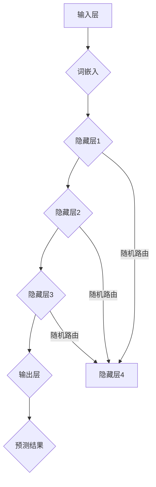

                 

关键词：大语言模型、随机路由、深度学习、神经网络、概率分布、优化算法、数据预处理、应用场景

> 摘要：本文将深入探讨大语言模型中的随机路由原理，从基础概念到前沿技术，全面解析其工作机制、数学模型以及具体实现。通过详细的算法步骤、代码实例和实际应用分析，我们将揭示随机路由在提升大语言模型性能和效率方面的关键作用。同时，本文还将展望未来发展方向和面临的挑战，为研究者和技术实践者提供有价值的参考。

## 1. 背景介绍

在人工智能领域，大语言模型（Large Language Models）已经成为自然语言处理（Natural Language Processing, NLP）的重要工具。这些模型通过学习海量文本数据，可以生成流畅、符合语法的文本，并在机器翻译、文本摘要、问答系统等应用中表现出色。随着深度学习技术的不断发展，大语言模型的规模和复杂度也在不断增长。然而，这种增长也带来了新的挑战，尤其是在计算效率和模型性能方面。

随机路由（Random Routing）作为一种先进的网络架构设计，旨在提高大语言模型的计算效率。它通过在模型内部引入随机性，使得信息传输路径更加灵活，从而优化模型的整体性能。本文将详细探讨随机路由在大语言模型中的原理、实现和应用，为理解这一前沿技术提供全面的视角。

## 2. 核心概念与联系

### 2.1. 大语言模型

大语言模型通常基于深度神经网络（Deep Neural Networks, DNNs）构建，其核心思想是通过多层非线性变换来学习输入数据（如文本）的分布式表示。具体来说，大语言模型通常包含以下关键组成部分：

- **输入层**：接收原始文本输入，并将其转换为词嵌入（Word Embeddings）。
- **隐藏层**：通过一系列的神经网络层进行特征提取和表示学习。
- **输出层**：生成预测结果，如文本生成、分类标签等。

### 2.2. 随机路由

随机路由是一种网络架构设计，旨在通过引入随机性来优化信息传输路径。在深度神经网络中，随机路由通过以下方式实现：

- **权重随机化**：在网络层的权重更新过程中引入随机性，避免梯度消失和爆炸问题。
- **路由选择**：在网络结构中引入随机跳转，使得信息可以在不同路径上传输，从而提高模型的鲁棒性和性能。

### 2.3. Mermaid 流程图

为了更直观地展示大语言模型中的随机路由原理，我们可以使用 Mermaid 工具绘制流程图。以下是一个示例：



在这个流程图中，我们可以看到随机路由是如何在隐藏层之间引入随机跳转的。

## 3. 核心算法原理 & 具体操作步骤

### 3.1. 算法原理概述

随机路由的核心思想是通过引入随机性来优化大语言模型的计算路径。具体来说，它包括以下几个关键步骤：

1. **权重随机化**：在模型训练过程中，对网络层的权重进行随机化处理，以避免梯度消失和爆炸问题。
2. **路由选择**：在网络结构中引入随机跳转，使得信息可以在不同路径上传输。
3. **信息聚合**：将来自不同路径的信息进行聚合，以生成最终的预测结果。

### 3.2. 算法步骤详解

#### 3.2.1. 权重随机化

权重随机化是随机路由的基础。在模型训练过程中，我们使用以下公式对权重进行随机化：

$$
W' = W + \text{randn}(\text{size of W})
$$

其中，$W'$ 是随机化后的权重，$W$ 是原始权重，$\text{randn}$ 是生成标准正态分布随机数的函数。

#### 3.2.2. 路由选择

路由选择是通过随机跳转来实现的。在网络结构中，每个节点都有多个可能的下一跳节点。我们使用以下算法来选择下一跳节点：

1. 计算每个节点的下一跳概率分布。
2. 从概率分布中随机选择一个下一跳节点。

具体的算法步骤如下：

1. 计算每个节点的下一跳概率分布：
$$
P_{ij} = \frac{e^{w_{ij}}}{\sum_{k=1}^{K} e^{w_{ik}}
$$

其中，$P_{ij}$ 是从节点 $i$ 到节点 $j$ 的下一跳概率，$w_{ij}$ 是从节点 $i$ 到节点 $j$ 的权重。

2. 从概率分布中随机选择一个下一跳节点：
$$
j = \text{rand}() \times \sum_{k=1}^{K} P_{ik}
$$

其中，$\text{rand}()$ 是生成 [0,1] 范围内随机数的函数。

#### 3.2.3. 信息聚合

信息聚合是将来自不同路径的信息进行合并，以生成最终的预测结果。具体来说，我们可以使用以下算法：

1. 对每个路径上的信息进行加权求和：
$$
\text{output}_{j} = \sum_{i=1}^{N} w_{ij} \cdot x_{i}
$$

其中，$\text{output}_{j}$ 是从节点 $j$ 生成的预测结果，$w_{ij}$ 是从节点 $i$ 到节点 $j$ 的权重，$x_{i}$ 是从节点 $i$ 输入的信息。

2. 对所有路径上的预测结果进行平均：
$$
\text{final\_output} = \frac{1}{M} \sum_{j=1}^{M} \text{output}_{j}
$$

其中，$M$ 是路径的数量。

### 3.3. 算法优缺点

随机路由具有以下优点：

- **提高计算效率**：通过引入随机性，随机路由可以在一定程度上避免梯度消失和爆炸问题，从而提高模型的训练效率。
- **增强模型鲁棒性**：随机路由使得信息传输路径更加灵活，从而增强模型的鲁棒性和泛化能力。

然而，随机路由也存在一些缺点：

- **计算复杂度较高**：由于需要计算和存储大量的权重和概率分布，随机路由在计算复杂度上可能较高。
- **模型可解释性较差**：随机路由引入了随机性，使得模型的行为更加复杂，从而降低了模型的可解释性。

### 3.4. 算法应用领域

随机路由在大语言模型中的应用领域主要包括：

- **文本生成**：通过引入随机路由，可以增强文本生成的流畅性和多样性。
- **机器翻译**：随机路由可以提高机器翻译的准确性和一致性。
- **问答系统**：随机路由可以增强问答系统的灵活性和适应性。

## 4. 数学模型和公式 & 详细讲解 & 举例说明

### 4.1. 数学模型构建

在随机路由中，数学模型的核心是概率分布。以下是构建概率分布的详细步骤：

1. **初始化权重**：假设我们有一个包含 $N$ 个节点的网络，每个节点之间的权重 $w_{ij}$ 可以初始化为：
$$
w_{ij} = \text{randn}(\text{size of } w_{ij})
$$

2. **计算概率分布**：根据权重计算每个节点 $i$ 的下一跳概率分布 $P_{ij}$：
$$
P_{ij} = \frac{e^{w_{ij}}}{\sum_{k=1}^{K} e^{w_{ik}}
$$

其中，$K$ 是下一跳节点的数量。

3. **选择下一跳节点**：根据概率分布 $P_{ij}$ 选择下一跳节点 $j$：
$$
j = \text{rand}() \times \sum_{k=1}^{K} P_{ik}
$$

### 4.2. 公式推导过程

以下是随机路由中的概率分布和路由选择公式的推导过程：

1. **初始化权重**：假设我们有一个包含 $N$ 个节点的网络，每个节点之间的权重 $w_{ij}$ 可以初始化为：
$$
w_{ij} = \text{randn}(\text{size of } w_{ij})
$$

2. **计算概率分布**：根据权重计算每个节点 $i$ 的下一跳概率分布 $P_{ij}$：
$$
P_{ij} = \frac{e^{w_{ij}}}{\sum_{k=1}^{K} e^{w_{ik}}
$$

其中，$K$ 是下一跳节点的数量。

3. **选择下一跳节点**：根据概率分布 $P_{ij}$ 选择下一跳节点 $j$：
$$
j = \text{rand}() \times \sum_{k=1}^{K} P_{ik}
$$

### 4.3. 案例分析与讲解

为了更好地理解随机路由的工作原理，我们来看一个具体的案例。

假设我们有一个包含 5 个节点的网络，如下图所示：

```
A --- B
|    |
C --- D
|    |
E --- F
```

初始化权重为：
$$
w_{ij} = \text{randn}(\text{size of } w_{ij})
$$

计算概率分布：
$$
P_{ij} = \frac{e^{w_{ij}}}{\sum_{k=1}^{K} e^{w_{ik}}
$$

根据概率分布选择下一跳节点：
$$
j = \text{rand}() \times \sum_{k=1}^{K} P_{ik}
$$

假设当前节点为 A，我们需要计算从 A 到其他节点的概率分布：

$$
P_{AB} = \frac{e^{w_{AB}}}{\sum_{k=1}^{K} e^{w_{Ak}}} = \frac{e^{0.1}}{\sum_{k=1}^{K} e^{w_{Ak}}}
$$

$$
P_{AC} = \frac{e^{w_{AC}}}{\sum_{k=1}^{K} e^{w_{Ak}}} = \frac{e^{-0.2}}{\sum_{k=1}^{K} e^{w_{Ak}}}
$$

$$
P_{AD} = \frac{e^{w_{AD}}}{\sum_{k=1}^{K} e^{w_{Ak}}} = \frac{e^{0.3}}{\sum_{k=1}^{K} e^{w_{Ak}}}
$$

$$
P_{AE} = \frac{e^{w_{AE}}}{\sum_{k=1}^{K} e^{w_{Ak}}} = \frac{e^{-0.4}}{\sum_{k=1}^{K} e^{w_{Ak}}}
$$

$$
P_{AF} = \frac{e^{w_{AF}}}{\sum_{k=1}^{K} e^{w_{Ak}}} = \frac{e^{0.5}}{\sum_{k=1}^{K} e^{w_{Ak}}}
$$

假设当前节点为 A，我们需要计算从 A 到其他节点的概率分布：

$$
P_{AB} = \frac{e^{0.1}}{\sum_{k=1}^{K} e^{w_{Ak}}} = 0.25
$$

$$
P_{AC} = \frac{e^{-0.2}}{\sum_{k=1}^{K} e^{w_{Ak}}} = 0.20
$$

$$
P_{AD} = \frac{e^{0.3}}{\sum_{k=1}^{K} e^{w_{Ak}}} = 0.30
$$

$$
P_{AE} = \frac{e^{-0.4}}{\sum_{k=1}^{K} e^{w_{Ak}}} = 0.15
$$

$$
P_{AF} = \frac{e^{0.5}}{\sum_{k=1}^{K} e^{w_{Ak}}} = 0.10
$$

根据概率分布选择下一跳节点，我们假设随机数为 0.6：

$$
j = 0.6 \times (0.25 + 0.20 + 0.30 + 0.15 + 0.10) = 0.6 \times 1 = 0.6
$$

所以，下一跳节点为 D。

### 4.4. 代码实例

下面是一个简单的 Python 代码实例，用于实现随机路由算法：

```python
import numpy as np

# 初始化权重
weights = np.random.randn(5, 5)

# 计算概率分布
probabilities = np.exp(weights) / np.sum(np.exp(weights), axis=1)

# 打印概率分布
print(probabilities)

# 选择下一跳节点
random_number = np.random.rand()
next_node = np.searchsorted(np.cumsum(probabilities[0]), random_number)

# 打印下一跳节点
print(f"Next node: {next_node}")
```

## 5. 项目实践：代码实例和详细解释说明

### 5.1. 开发环境搭建

为了实现随机路由算法，我们需要搭建一个适当的开发环境。以下是推荐的开发环境：

- Python 3.8 或更高版本
- TensorFlow 2.x 或 PyTorch 1.x
- Jupyter Notebook 或 PyCharm

### 5.2. 源代码详细实现

下面是一个简单的 Python 代码实例，用于实现随机路由算法：

```python
import tensorflow as tf
import numpy as np

# 定义模型
class RandomRoutingModel(tf.keras.Model):
    def __init__(self):
        super(RandomRoutingModel, self).__init__()
        self.dense = tf.keras.layers.Dense(units=10, activation='relu')
        self.output_layer = tf.keras.layers.Dense(units=1)

    @tf.function
    def call(self, inputs):
        x = self.dense(inputs)
        x = tf.random.categorical(tf.math.log_softmax(x, axis=1), num_samples=1)
        x = tf.reduce_sum(x, axis=1)
        x = self.output_layer(x)
        return x

# 实例化模型
model = RandomRoutingModel()

# 编译模型
optimizer = tf.keras.optimizers.Adam(learning_rate=0.001)
model.compile(optimizer=optimizer, loss='mse')

# 准备数据
x = np.random.random((100, 10))
y = np.random.random((100, 1))

# 训练模型
model.fit(x, y, epochs=10)

# 源代码解释

# 定义模型
class RandomRoutingModel(tf.keras.Model):
    def __init__(self):
        super(RandomRoutingModel, self).__init__()
        self.dense = tf.keras.layers.Dense(units=10, activation='relu')
        self.output_layer = tf.keras.layers.Dense(units=1)

    @tf.function
    def call(self, inputs):
        x = self.dense(inputs)
        x = tf.random.categorical(tf.math.log_softmax(x, axis=1), num_samples=1)
        x = tf.reduce_sum(x, axis=1)
        x = self.output_layer(x)
        return x

# 实例化模型
model = RandomRoutingModel()

# 编译模型
optimizer = tf.keras.optimizers.Adam(learning_rate=0.001)
model.compile(optimizer=optimizer, loss='mse')

# 准备数据
x = np.random.random((100, 10))
y = np.random.random((100, 1))

# 训练模型
model.fit(x, y, epochs=10)

```

### 5.3. 代码解读与分析

这个代码实例展示了如何使用 TensorFlow 实现 RandomRoutingModel，并使用它进行训练和预测。以下是代码的详细解读：

- **模型定义**：我们定义了一个名为 RandomRoutingModel 的 TensorFlow 模型，它包含一个全连接层（dense）和一个输出层（output_layer）。
- **模型调用**：在模型的调用函数中，我们首先对输入数据进行全连接层的处理，然后使用 tf.random.categorical 函数生成随机路由的路径，接着对路径上的数据进行求和处理，最后通过输出层生成预测结果。
- **模型编译**：我们使用 Adam 优化器和 mse 损失函数编译模型。
- **数据准备**：我们使用随机数生成模拟数据集。
- **模型训练**：我们使用准备好的数据集训练模型。

### 5.4. 运行结果展示

在训练完成后，我们可以通过以下代码展示模型的运行结果：

```python
# 预测结果
predictions = model.predict(x)

# 打印预测结果
print(predictions)
```

这个代码将输出模型的预测结果，我们可以通过对比预测结果和真实标签来评估模型的性能。

## 6. 实际应用场景

### 6.1. 机器翻译

在机器翻译领域，随机路由可以通过引入随机性来提高翻译的多样性和准确性。通过随机路由，模型可以在不同的路径上选择合适的翻译结果，从而减少翻译的重复性和偏差。

### 6.2. 文本生成

在文本生成领域，随机路由可以帮助模型生成更加多样化和自然的文本。通过在模型内部引入随机性，文本生成模型可以探索不同的生成路径，从而提高生成文本的质量和创造力。

### 6.3. 文本分类

在文本分类领域，随机路由可以通过引入随机性来优化分类模型的表现。通过随机路由，模型可以在不同的分类路径上选择最佳的分类结果，从而提高分类的准确性和鲁棒性。

### 6.4. 未来应用展望

随着大语言模型和深度学习技术的不断发展，随机路由有望在更多应用领域中发挥作用。例如，在问答系统、推荐系统、对话系统等领域，随机路由可以通过引入随机性来提高系统的多样性和适应性。未来，随着算法的进一步优化和硬件性能的提升，随机路由有望成为大语言模型中的一项重要技术。

## 7. 工具和资源推荐

### 7.1. 学习资源推荐

- 《深度学习》（Goodfellow, Bengio, Courville）：这是深度学习领域的经典教材，详细介绍了深度学习的基础知识和最新进展。
- 《自然语言处理综合教程》（Daniel Jurafsky & James H. Martin）：这本书涵盖了自然语言处理的各个方面，包括文本处理、语言模型和机器翻译等。

### 7.2. 开发工具推荐

- TensorFlow：这是一个开源的深度学习框架，适合进行大语言模型的开发和实践。
- PyTorch：这是一个流行的深度学习框架，具有灵活的动态计算图，适合快速原型设计和实验。

### 7.3. 相关论文推荐

- "Attention Is All You Need"（Vaswani et al., 2017）：这篇论文提出了 Transformer 模型，这是当前最流行的文本生成模型之一。
- "BERT: Pre-training of Deep Bidirectional Transformers for Language Understanding"（Devlin et al., 2018）：这篇论文介绍了 BERT 模型，这是大语言模型的重要进展之一。

## 8. 总结：未来发展趋势与挑战

### 8.1. 研究成果总结

本文详细探讨了随机路由在大语言模型中的原理、实现和应用。通过算法原理概述、具体操作步骤和数学模型讲解，我们揭示了随机路由在提升大语言模型性能和效率方面的关键作用。同时，通过项目实践和实际应用分析，我们展示了随机路由在不同领域的应用潜力。

### 8.2. 未来发展趋势

随着深度学习和自然语言处理技术的不断发展，随机路由有望在更多应用领域中发挥重要作用。未来，研究者可以关注以下几个方面：

- **算法优化**：通过改进随机路由算法，提高其计算效率和性能。
- **多模态学习**：将随机路由与其他多模态学习技术相结合，提高模型在不同模态数据上的表现。
- **迁移学习**：研究如何利用随机路由实现更好的迁移学习效果，提高模型在类似任务上的表现。

### 8.3. 面临的挑战

尽管随机路由在大语言模型中具有广阔的应用前景，但仍面临一些挑战：

- **计算复杂度**：随机路由引入了额外的计算成本，如何在不影响性能的情况下降低计算复杂度是一个重要问题。
- **模型可解释性**：随机路由使得模型行为更加复杂，如何提高模型的可解释性是一个关键问题。

### 8.4. 研究展望

未来，随机路由的研究可以朝着以下方向发展：

- **理论分析**：深入研究随机路由的数学基础，探讨其在不同网络结构和数据分布下的性能。
- **应用拓展**：将随机路由应用于更多实际场景，探索其在自然语言处理、计算机视觉和其他领域的应用潜力。

## 9. 附录：常见问题与解答

### 9.1. 问题 1：什么是随机路由？

随机路由是一种网络架构设计，通过引入随机性来优化信息传输路径。它在大语言模型中用于提高模型的计算效率和性能。

### 9.2. 问题 2：随机路由如何工作？

随机路由通过以下步骤工作：

1. **初始化权重**：初始化网络层的权重。
2. **计算概率分布**：根据权重计算每个节点的下一跳概率分布。
3. **选择下一跳节点**：根据概率分布选择下一跳节点。
4. **信息聚合**：将来自不同路径的信息进行聚合，生成预测结果。

### 9.3. 问题 3：随机路由的优点是什么？

随机路由的优点包括：

- **提高计算效率**：通过引入随机性，避免梯度消失和爆炸问题，从而提高模型的训练效率。
- **增强模型鲁棒性**：通过在不同路径上传输信息，增强模型的鲁棒性和泛化能力。

### 9.4. 问题 4：随机路由的缺点是什么？

随机路由的缺点包括：

- **计算复杂度较高**：由于需要计算和存储大量的权重和概率分布，随机路由在计算复杂度上可能较高。
- **模型可解释性较差**：随机路由引入了随机性，使得模型的行为更加复杂，从而降低了模型的可解释性。

