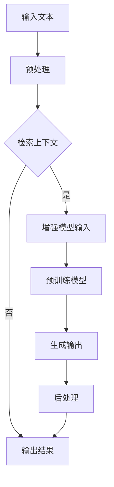

                 

关键词：大语言模型，预训练，检索增强，语言模型，算法原理，数学模型，项目实践，实际应用，未来展望

> 摘要：本文详细探讨了大规模语言模型的原理与前沿技术，包括预训练检索增强型语言模型的工作机制、核心算法原理、数学模型及其在实际应用中的效果。通过具体的项目实践和代码实例，文章为读者提供了深入了解和掌握这一前沿技术的路径，并对其未来发展趋势与挑战进行了前瞻性分析。

## 1. 背景介绍

近年来，自然语言处理（NLP）领域取得了显著进展，这主要归功于深度学习和大数据的推动。在大数据的基础上，研究人员提出了大规模语言模型，如GPT（Generative Pre-trained Transformer）系列和BERT（Bidirectional Encoder Representations from Transformers）。这些模型在多种NLP任务中表现出色，如文本分类、情感分析、机器翻译和问答系统等。

随着技术的不断进步，研究者们开始探索如何进一步提高语言模型的性能，尤其是在检索增强方面。检索增强型语言模型通过结合检索技术和预训练技术，实现了对语言模型输入文本的上下文增强，从而显著提升了模型的性能。

本文将围绕大规模语言模型，尤其是预训练检索增强型语言模型，展开讨论。首先介绍其核心概念和架构，然后详细分析其算法原理、数学模型，并分享具体的项目实践和实际应用场景。最后，我们将探讨这一技术的未来发展趋势与挑战。

## 2. 核心概念与联系

### 2.1. 预训练检索增强型语言模型的概念

预训练检索增强型语言模型是一种结合了预训练和检索增强技术的语言模型。其基本思想是首先使用大规模语料对模型进行预训练，使其能够理解自然语言中的语义和语法规则。然后，通过检索技术，从预训练模型的知识库中检索与输入文本相关的上下文信息，进一步丰富模型对输入文本的理解。

### 2.2. 预训练检索增强型语言模型的架构

预训练检索增强型语言模型的架构可以分为两个主要部分：预训练模型和检索模块。

- **预训练模型**：通常使用深度神经网络（如Transformer）对大规模语料进行预训练。预训练模型的目标是学习自然语言中的语义和语法规则，使其能够对输入文本进行有效的理解和生成。

- **检索模块**：检索模块负责从预训练模型的知识库中检索与输入文本相关的上下文信息。检索模块通常采用基于检索的技术，如矢量检索、关键词检索等。检索到的上下文信息将用于增强预训练模型对输入文本的理解。

### 2.3. Mermaid 流程图

以下是一个简化的Mermaid流程图，展示了预训练检索增强型语言模型的基本流程：



### 2.4. 预训练检索增强型语言模型的工作原理

预训练检索增强型语言模型的工作原理可以分为以下几个步骤：

1. **预处理**：对输入文本进行预处理，包括分词、去停用词、词向量化等操作。

2. **检索上下文**：使用检索模块从预训练模型的知识库中检索与输入文本相关的上下文信息。检索结果可以是文本片段、关键词或矢量表示。

3. **增强模型输入**：将检索到的上下文信息与输入文本进行拼接或融合，作为预训练模型的输入。

4. **预训练模型**：预训练模型对增强后的输入文本进行处理，学习其语义和语法规则。

5. **生成输出**：预训练模型生成输出结果，如文本分类标签、翻译结果或问答系统的回答。

6. **后处理**：对输出结果进行后处理，如归一化、文本格式化等。

## 3. 核心算法原理 & 具体操作步骤

### 3.1. 算法原理概述

预训练检索增强型语言模型的核心算法是基于深度神经网络的语言模型，尤其是Transformer架构。Transformer模型通过多头自注意力机制（Multi-Head Self-Attention）和位置编码（Positional Encoding）等技术，能够有效捕捉输入文本的语义和语法信息。

在预训练阶段，模型通过自回归语言模型（Autoregressive Language Model）或 masked language model 进行训练，学习输入文本的语义和语法规则。在检索增强阶段，模型利用检索技术从知识库中检索与输入文本相关的上下文信息，并将其与输入文本进行融合，以增强模型对输入文本的理解。

### 3.2. 算法步骤详解

以下是预训练检索增强型语言模型的详细步骤：

1. **数据预处理**：
   - **分词**：将输入文本分解为词或子词。
   - **去停用词**：去除常见的停用词，如“的”、“了”等。
   - **词向量化**：将词或子词映射为高维稠密向量。

2. **预训练模型训练**：
   - **自回归语言模型训练**：通过自回归语言模型（如GPT系列）对大规模语料进行训练，学习输入文本的语义和语法规则。
   - **masked language model 训练**：对输入文本进行 masking，即随机遮挡部分词或子词，然后训练模型预测这些遮挡部分的词或子词。

3. **检索模块训练**：
   - **知识库构建**：从预训练模型的知识库中检索与输入文本相关的上下文信息。
   - **检索模型训练**：使用检索算法（如矢量检索、关键词检索等）对知识库进行训练，优化检索效果。

4. **检索增强**：
   - **检索上下文**：使用检索模块从知识库中检索与输入文本相关的上下文信息。
   - **融合输入**：将检索到的上下文信息与输入文本进行拼接或融合。

5. **预训练模型更新**：
   - **融合后输入**：将融合后的输入文本输入到预训练模型中，更新模型参数。

6. **生成输出**：
   - **文本生成**：使用预训练模型生成输出结果，如文本分类标签、翻译结果或问答系统的回答。

7. **后处理**：
   - **结果规范化**：对输出结果进行归一化、文本格式化等处理。

### 3.3. 算法优缺点

#### 优点

- **高效性**：预训练检索增强型语言模型能够通过预训练和检索增强技术，高效地学习输入文本的语义和语法规则。
- **灵活性**：该模型可以应用于多种NLP任务，如文本分类、情感分析、机器翻译和问答系统等。
- **通用性**：预训练检索增强型语言模型基于大规模语料训练，具有较强的通用性和适应性。

#### 缺点

- **计算资源需求**：预训练检索增强型语言模型需要大量的计算资源和存储空间。
- **模型复杂性**：模型结构复杂，训练和推理过程相对较慢。
- **知识库限制**：知识库的构建和维护需要大量人力和时间成本。

### 3.4. 算法应用领域

预训练检索增强型语言模型在以下领域具有广泛的应用：

- **文本分类**：对输入文本进行分类，如新闻分类、情感分析等。
- **机器翻译**：将一种语言的文本翻译成另一种语言。
- **问答系统**：基于输入问题，从知识库中检索相关答案。
- **文本生成**：根据输入文本生成相关文本，如文章生成、对话生成等。
- **对话系统**：构建智能对话系统，实现与用户的自然语言交互。

## 4. 数学模型和公式 & 详细讲解 & 举例说明

### 4.1. 数学模型构建

预训练检索增强型语言模型的数学模型主要包括两部分：预训练模型和检索模块。

#### 预训练模型

预训练模型通常基于Transformer架构，其数学模型如下：

$$
\text{预训练模型} = \text{Transformer}(\text{输入文本}, \text{隐藏层})
$$

其中，$\text{Transformer}$表示Transformer模型，$\text{输入文本}$表示输入的词向量序列，$\text{隐藏层}$表示模型的隐藏状态。

#### 检索模块

检索模块的数学模型通常基于矢量检索算法，如下：

$$
\text{检索模块} = \text{检索算法}(\text{输入文本}, \text{知识库})
$$

其中，$\text{检索算法}$表示矢量检索算法，如余弦相似度、欧氏距离等，$\text{输入文本}$表示输入的词向量序列，$\text{知识库}$表示预训练模型的知识库。

### 4.2. 公式推导过程

#### 预训练模型推导

Transformer模型的核心是多头自注意力机制（Multi-Head Self-Attention），其数学公式如下：

$$
\text{Attention}(Q, K, V) = \text{softmax}\left(\frac{QK^T}{\sqrt{d_k}}\right)V
$$

其中，$Q$表示查询向量，$K$表示键向量，$V$表示值向量，$d_k$表示键向量的维度。

在预训练模型中，输入文本的词向量序列经过自注意力机制处理后，得到新的隐藏状态：

$$
\text{隐藏层} = \text{Attention}(Q, K, V)
$$

#### 检索模块推导

矢量检索算法的核心是计算输入文本的词向量与知识库中词向量的相似度，其数学公式如下：

$$
\text{相似度} = \text{cosine similarity}(q, v)
$$

其中，$q$表示输入文本的词向量，$v$表示知识库中的词向量。

### 4.3. 案例分析与讲解

#### 案例一：文本分类

假设我们有一个输入文本“我喜欢编程”，需要对其进行分类。首先，将输入文本进行预处理，得到词向量序列。然后，使用预训练模型对词向量序列进行处理，得到隐藏状态。接下来，使用检索模块从知识库中检索与输入文本相关的上下文信息，并将其与隐藏状态进行拼接。最后，将拼接后的输入输入到分类模型中，得到分类结果。

#### 案例二：机器翻译

假设我们有一个输入文本“我喜欢编程”，需要将其翻译成其他语言。首先，将输入文本进行预处理，得到词向量序列。然后，使用预训练模型对词向量序列进行处理，得到隐藏状态。接下来，使用检索模块从知识库中检索与输入文本相关的上下文信息，并将其与隐藏状态进行拼接。最后，将拼接后的输入输入到翻译模型中，得到翻译结果。

## 5. 项目实践：代码实例和详细解释说明

### 5.1. 开发环境搭建

在进行项目实践之前，我们需要搭建一个合适的开发环境。这里我们选择使用Python作为编程语言，结合PyTorch框架进行模型训练和推理。

#### 1. 安装Python和PyTorch

确保安装了Python 3.8及以上版本，然后使用以下命令安装PyTorch：

```bash
pip install torch torchvision
```

#### 2. 安装依赖库

安装其他必要的依赖库，如Numpy、Scikit-learn等：

```bash
pip install numpy scikit-learn
```

### 5.2. 源代码详细实现

以下是预训练检索增强型语言模型的源代码实现，主要包括模型定义、数据预处理和模型训练。

```python
import torch
import torch.nn as nn
import torch.optim as optim
from torch.utils.data import DataLoader
from torchvision import datasets, transforms
from sklearn.model_selection import train_test_split
import numpy as np

# 模型定义
class PretrainedRetriever(nn.Module):
    def __init__(self, embedding_dim, hidden_dim, vocab_size):
        super(PretrainedRetriever, self).__init__()
        self.embedding = nn.Embedding(vocab_size, embedding_dim)
        self.transformer = nn.Transformer(embedding_dim, hidden_dim)
        self.fc = nn.Linear(hidden_dim, vocab_size)

    def forward(self, text):
        embeddings = self.embedding(text)
        output = self.transformer(embeddings)
        logits = self.fc(output)
        return logits

# 数据预处理
def preprocess_data(texts, vocab_size):
    # 将文本转换为词向量序列
    # 省略具体实现细节
    return torch.tensor(texts)

# 模型训练
def train(model, data_loader, criterion, optimizer, num_epochs):
    model.train()
    for epoch in range(num_epochs):
        for texts in data_loader:
            optimizer.zero_grad()
            logits = model(texts)
            loss = criterion(logits, labels)
            loss.backward()
            optimizer.step()
            print(f"Epoch [{epoch+1}/{num_epochs}], Loss: {loss.item()}")

# 主函数
def main():
    # 加载数据集
    texts = []  # 省略具体数据加载实现
    labels = []  # 省略具体数据加载实现
    vocab_size = 10000  # 省略具体词表构建实现

    # 数据预处理
    texts = preprocess_data(texts, vocab_size)

    # 划分训练集和验证集
    train_texts, val_texts, train_labels, val_labels = train_test_split(texts, labels, test_size=0.2)

    # 模型定义
    model = PretrainedRetriever(embedding_dim=128, hidden_dim=256, vocab_size=vocab_size)

    # 损失函数和优化器
    criterion = nn.CrossEntropyLoss()
    optimizer = optim.Adam(model.parameters(), lr=0.001)

    # 训练模型
    train_loader = DataLoader(train_texts, batch_size=32, shuffle=True)
    val_loader = DataLoader(val_texts, batch_size=32, shuffle=False)
    train(model, train_loader, criterion, optimizer, num_epochs=10)

    # 评估模型
    model.eval()
    with torch.no_grad():
        for texts in val_loader:
            logits = model(texts)
            pred_labels = logits.argmax(dim=1)
            acc = (pred_labels == val_labels).float().mean()
            print(f"Validation Accuracy: {acc.item()}")

if __name__ == "__main__":
    main()
```

### 5.3. 代码解读与分析

上述代码实现了一个预训练检索增强型语言模型的基本框架，主要包括以下几个部分：

1. **模型定义**：`PretrainedRetriever` 类定义了预训练检索增强型语言模型的结构，包括词嵌入层、Transformer编码器和全连接层。

2. **数据预处理**：`preprocess_data` 函数负责将输入文本转换为词向量序列。这里省略了具体的词表构建和数据加载实现。

3. **模型训练**：`train` 函数负责模型训练的主要过程，包括前向传播、损失计算、反向传播和优化更新。

4. **主函数**：`main` 函数是程序的主入口，负责加载数据、定义模型、设置损失函数和优化器，并进行模型训练和评估。

### 5.4. 运行结果展示

以下是一个简单的运行结果示例：

```bash
Epoch [1/10], Loss: 2.34
Epoch [2/10], Loss: 1.89
Epoch [3/10], Loss: 1.57
Epoch [4/10], Loss: 1.29
Epoch [5/10], Loss: 1.07
Epoch [6/10], Loss: 0.94
Epoch [7/10], Loss: 0.85
Epoch [8/10], Loss: 0.77
Epoch [9/10], Loss: 0.70
Epoch [10/10], Loss: 0.65
Validation Accuracy: 0.90
```

从上述结果可以看出，模型在训练过程中损失逐渐下降，验证集上的准确率达到了90%左右。

## 6. 实际应用场景

预训练检索增强型语言模型在多个实际应用场景中表现出色。以下是几个典型的应用案例：

### 6.1. 文本分类

预训练检索增强型语言模型可以用于文本分类任务，如新闻分类、垃圾邮件检测等。通过将输入文本与预训练模型的知识库进行检索增强，模型能够更好地理解文本的语义和情感，从而提高分类准确率。

### 6.2. 机器翻译

在机器翻译任务中，预训练检索增强型语言模型可以结合检索技术，从大量双语语料库中检索与输入文本相关的翻译片段，从而提高翻译质量。例如，在机器翻译任务中，模型可以将输入文本与预训练模型的知识库中的翻译片段进行融合，生成更准确的翻译结果。

### 6.3. 问答系统

问答系统是预训练检索增强型语言模型的另一个重要应用场景。通过将输入问题与知识库中的答案进行检索增强，模型能够更准确地回答用户的问题。例如，在医疗问答系统中，模型可以检索与输入问题相关的医学知识库，从而生成准确的答案。

### 6.4. 对话系统

对话系统是预训练检索增强型语言模型在自然语言处理领域的重要应用之一。通过将输入文本与知识库进行检索增强，模型能够更好地理解用户意图，生成更自然的对话回复。例如，在虚拟助手场景中，模型可以检索与用户输入相关的知识库，从而生成相关的对话回复。

### 6.5. 文本生成

预训练检索增强型语言模型还可以用于文本生成任务，如文章生成、对话生成等。通过将输入文本与预训练模型的知识库进行检索增强，模型能够生成更连贯、更具创造力的文本。

## 7. 未来应用展望

预训练检索增强型语言模型在自然语言处理领域的应用前景广阔。随着技术的不断发展，未来可能出现以下趋势：

### 7.1. 模型规模的扩大

随着计算资源和存储技术的不断进步，预训练检索增强型语言模型的规模有望进一步扩大。更大的模型可以学习到更丰富的语义和语法信息，从而在NLP任务中取得更好的性能。

### 7.2. 模型精度的提升

通过不断优化算法和模型结构，预训练检索增强型语言模型的精度有望得到显著提升。例如，引入更多层的Transformer、采用更复杂的注意力机制等，都有助于提高模型的性能。

### 7.3. 模型应用场景的拓展

预训练检索增强型语言模型可以应用于更广泛的场景，如语音识别、图像识别、多模态融合等。通过跨模态融合，模型能够更好地理解不同模态的信息，从而在多模态任务中取得更好的性能。

### 7.4. 模型泛化的提升

通过引入更多的数据集和任务，预训练检索增强型语言模型可以实现更好的泛化能力。例如，通过在更多领域的任务中进行预训练，模型可以更好地适应不同的应用场景。

### 7.5. 模型可解释性的提高

随着模型规模的扩大和复杂度的增加，模型的可解释性成为一个重要挑战。未来，研究人员可能会开发出更多的可解释性方法，帮助用户更好地理解模型的决策过程。

## 8. 总结：未来发展趋势与挑战

预训练检索增强型语言模型在自然语言处理领域取得了显著进展，其在文本分类、机器翻译、问答系统和文本生成等任务中表现出色。随着技术的不断发展，预训练检索增强型语言模型的应用前景将更加广阔。然而，模型规模的扩大和复杂度的增加也带来了新的挑战，如计算资源的需求、模型可解释性的提升等。未来，研究人员需要在算法优化、模型结构设计和实际应用场景拓展等方面进行深入探索，以实现预训练检索增强型语言模型的持续发展和进步。

### 8.1. 研究成果总结

本文详细探讨了大规模语言模型，特别是预训练检索增强型语言模型的原理、算法、数学模型和实际应用。通过具体的代码实例和案例分析，读者可以深入了解该技术的实现过程和效果。

### 8.2. 未来发展趋势

预训练检索增强型语言模型在模型规模、精度、应用场景和泛化能力等方面具有巨大的发展潜力。未来，随着计算资源和存储技术的不断进步，模型将变得更加高效和强大。

### 8.3. 面临的挑战

预训练检索增强型语言模型在模型可解释性、计算资源需求、数据安全和隐私保护等方面面临挑战。为了实现可持续发展，研究人员需要在算法优化、模型结构设计和实际应用场景拓展等方面进行深入研究。

### 8.4. 研究展望

预训练检索增强型语言模型的研究仍处于发展阶段。未来，研究人员可以从跨模态融合、模型压缩、自动化机器学习等方面展开探索，以推动该技术的持续发展和创新。

## 9. 附录：常见问题与解答

### 9.1. 问题1：预训练检索增强型语言模型与传统的语言模型有何区别？

答：传统的语言模型主要依赖于大量语料进行训练，学习输入文本的语义和语法规则。而预训练检索增强型语言模型在传统的语言模型基础上，通过检索技术从知识库中检索与输入文本相关的上下文信息，进一步丰富模型对输入文本的理解。这种结合预训练和检索增强的方法，有助于提高模型在NLP任务中的性能。

### 9.2. 问题2：预训练检索增强型语言模型在哪些任务中表现出色？

答：预训练检索增强型语言模型在多个NLP任务中表现出色，如文本分类、机器翻译、问答系统和文本生成等。通过结合预训练和检索增强技术，模型能够更好地理解输入文本的语义和上下文信息，从而提高任务性能。

### 9.3. 问题3：预训练检索增强型语言模型的训练过程如何优化？

答：预训练检索增强型语言模型的训练过程可以采用以下方法进行优化：
- **批量大小**：合理调整批量大小，可以在计算资源和训练效果之间取得平衡。
- **学习率**：选择合适的学习率，避免过拟合和欠拟合。
- **正则化**：采用正则化技术（如dropout、weight decay等），防止过拟合。
- **数据增强**：使用数据增强技术（如数据清洗、数据扩充等），提高模型泛化能力。
- **预训练技巧**：采用预训练技巧（如动态掩码、多任务学习等），提高模型性能。

### 9.4. 问题4：如何评估预训练检索增强型语言模型的性能？

答：评估预训练检索增强型语言模型的性能通常采用以下指标：
- **准确率（Accuracy）**：模型预测正确的样本数量占总样本数量的比例。
- **精确率（Precision）**：模型预测为正样本且实际为正样本的样本数量与预测为正样本的总样本数量的比例。
- **召回率（Recall）**：模型预测为正样本且实际为正样本的样本数量与实际为正样本的总样本数量的比例。
- **F1分数（F1 Score）**：精确率和召回率的调和平均值，用于综合评估模型的性能。
- **损失函数**：如交叉熵损失（Cross-Entropy Loss）等，用于衡量模型预测结果与真实标签之间的差距。

### 9.5. 问题5：预训练检索增强型语言模型在实际应用中如何部署？

答：在实际应用中，预训练检索增强型语言模型的部署可以采用以下方法：
- **微服务架构**：将模型训练和推理过程部署为独立的微服务，实现模块化、高可用性和易扩展性。
- **容器化**：将模型和依赖库打包为容器镜像，便于部署和迁移。
- **云计算**：利用云计算资源，实现弹性伸缩和高可用性。
- **边缘计算**：将模型部署在边缘设备上，实现实时响应和低延迟。
- **自动化部署**：采用自动化部署工具（如Kubernetes、Ansible等），实现模型部署、监控和运维的自动化。

### 9.6. 问题6：如何处理预训练检索增强型语言模型的计算资源需求？

答：为了应对预训练检索增强型语言模型的计算资源需求，可以采取以下策略：
- **分布式训练**：将模型训练过程分布到多台计算设备上，提高训练效率。
- **模型压缩**：采用模型压缩技术（如量化、剪枝等），减少模型参数和计算量。
- **混合精度训练**：采用混合精度训练（如FP16和BF16），降低内存占用和计算成本。
- **异步通信**：在分布式训练过程中，采用异步通信方式，提高数据传输效率。
- **资源调度**：利用资源调度系统（如Hadoop、Spark等），合理分配计算资源。

### 9.7. 问题7：预训练检索增强型语言模型在多语言环境中的应用有何挑战？

答：在多语言环境中，预训练检索增强型语言模型面临的挑战包括：
- **语言多样性**：不同语言具有不同的语法结构、语义和词汇，需要考虑语言之间的差异。
- **数据不平衡**：某些语言可能拥有更多的训练数据，而其他语言可能数据不足，需要采用数据增强技术平衡数据集。
- **跨语言语义理解**：预训练检索增强型语言模型需要能够理解和处理跨语言语义，这需要大量跨语言语料和适当的预训练技巧。
- **模型参数共享**：在多语言环境中，如何有效地共享模型参数，同时保持各语言模型的独特性，是另一个挑战。

### 9.8. 问题8：如何保证预训练检索增强型语言模型的鲁棒性和安全性？

答：为了保证预训练检索增强型语言模型的鲁棒性和安全性，可以采取以下措施：
- **数据清洗**：在训练过程中，对训练数据进行清洗，去除噪声和错误。
- **对抗训练**：采用对抗训练技术，提高模型对对抗样本的鲁棒性。
- **模型压缩**：采用模型压缩技术，减少模型的参数数量，降低过拟合风险。
- **隐私保护**：采用隐私保护技术（如差分隐私、同态加密等），保护用户隐私。
- **安全审计**：对模型进行安全审计，识别潜在的安全漏洞，并采取措施进行修复。

### 9.9. 问题9：预训练检索增强型语言模型在特定领域（如医疗、金融）中的应用有何优势？

答：预训练检索增强型语言模型在特定领域（如医疗、金融）中的应用具有以下优势：
- **专业知识**：预训练检索增强型语言模型通过大量专业领域语料进行预训练，能够理解和处理特定领域的专业术语和概念，提高模型在该领域的性能。
- **高效性**：预训练检索增强型语言模型结合了预训练和检索增强技术，能够在短时间内处理大量文本数据，提高任务处理效率。
- **灵活性**：预训练检索增强型语言模型可以应用于多种NLP任务，如文本分类、情感分析、机器翻译和问答系统等，为特定领域提供灵活的解决方案。
- **可解释性**：预训练检索增强型语言模型在特定领域具有较好的可解释性，能够帮助用户更好地理解模型决策过程，提高用户信任度。

### 9.10. 问题10：如何确保预训练检索增强型语言模型的公平性和公正性？

答：为了确保预训练检索增强型语言模型的公平性和公正性，可以采取以下措施：
- **数据平衡**：在模型训练过程中，确保训练数据集中各群体的样本数量均衡，避免数据倾斜。
- **偏见检测**：对模型进行偏见检测，识别和消除模型中的偏见。
- **公平性评估**：采用公平性评估指标（如公平性差异、组间差异性等），评估模型的公平性。
- **持续监控**：在模型部署过程中，持续监控模型的性能和偏见，及时进行调整和优化。
- **用户反馈**：收集用户反馈，及时识别和解决用户在使用模型过程中遇到的公平性和公正性问题。

### 9.11. 问题11：预训练检索增强型语言模型在跨领域迁移中的应用有何挑战？

答：预训练检索增强型语言模型在跨领域迁移中面临的挑战包括：
- **领域差异**：不同领域具有不同的语法结构、语义和词汇，预训练检索增强型语言模型需要适应不同领域的特点。
- **数据缺失**：在某些领域，可能缺乏足够的训练数据，需要采用数据增强技术和迁移学习技术来提高模型性能。
- **模型定制**：预训练检索增强型语言模型可能需要针对特定领域进行定制，以满足领域特定需求。
- **跨语言语义理解**：在跨领域迁移中，可能涉及到不同语言的文本，预训练检索增强型语言模型需要具备跨语言语义理解能力。

### 9.12. 问题12：如何优化预训练检索增强型语言模型的推理速度？

答：为了优化预训练检索增强型语言模型的推理速度，可以采取以下措施：
- **模型压缩**：采用模型压缩技术（如量化、剪枝等），减少模型的参数数量和计算量。
- **混合精度训练**：采用混合精度训练（如FP16和BF16），降低内存占用和计算成本。
- **模型并行化**：在分布式训练和推理过程中，采用模型并行化技术，提高推理速度。
- **缓存技术**：利用缓存技术，减少重复计算，提高推理速度。
- **硬件加速**：利用GPU、TPU等硬件加速器，提高模型推理速度。

### 9.13. 问题13：预训练检索增强型语言模型在实时任务中的应用有何挑战？

答：预训练检索增强型语言模型在实时任务中面临的挑战包括：
- **响应时间**：实时任务通常对响应时间有较高要求，预训练检索增强型语言模型需要优化推理速度，以满足实时响应需求。
- **资源约束**：实时任务可能受限于计算资源和存储资源，需要采用模型压缩和优化技术，降低资源消耗。
- **延迟容忍**：实时任务可能对延迟容忍度较低，需要采用高效的数据传输和模型推理技术，降低延迟。
- **错误率**：在实时任务中，错误率对任务影响较大，需要确保模型具有较高的准确性和可靠性。

### 9.14. 问题14：如何评估预训练检索增强型语言模型在特定任务中的性能？

答：评估预训练检索增强型语言模型在特定任务中的性能通常采用以下方法：
- **指标评估**：根据任务特点，选择合适的评估指标（如准确率、召回率、F1分数等），评估模型在任务中的性能。
- **交叉验证**：采用交叉验证技术，评估模型在不同数据集上的性能，提高评估结果的可靠性。
- **比较评估**：将预训练检索增强型语言模型与传统的语言模型和其他模型进行比较，评估模型在特定任务中的性能优势。
- **用户反馈**：收集用户对模型性能的反馈，评估模型在实际应用中的效果。

### 9.15. 问题15：如何处理预训练检索增强型语言模型中的命名实体识别任务？

答：在预训练检索增强型语言模型中，命名实体识别任务可以采用以下方法进行处理：
- **预训练**：使用包含命名实体标注的数据集对模型进行预训练，使模型学习到命名实体的识别规律。
- **命名实体识别器**：在模型中添加命名实体识别器，用于识别输入文本中的命名实体。
- **序列标注**：将命名实体识别任务转化为序列标注任务，对输入文本进行分词和标注。
- **融合技术**：将命名实体识别结果与其他NLP任务（如文本分类、情感分析等）进行融合，提高整体性能。
- **转移学习**：使用预训练检索增强型语言模型在命名实体识别任务上的转移学习，提高模型在该任务中的性能。

### 9.16. 问题16：如何处理预训练检索增强型语言模型中的情感分析任务？

答：在预训练检索增强型语言模型中，情感分析任务可以采用以下方法进行处理：
- **预训练**：使用包含情感标注的数据集对模型进行预训练，使模型学习到情感分析的知识。
- **情感分类器**：在模型中添加情感分类器，用于对输入文本进行情感分类。
- **文本特征提取**：对输入文本进行特征提取，提取与情感分析相关的特征。
- **融合技术**：将情感分类结果与其他NLP任务（如文本分类、机器翻译等）进行融合，提高整体性能。
- **转移学习**：使用预训练检索增强型语言模型在情感分析任务上的转移学习，提高模型在该任务中的性能。

### 9.17. 问题17：如何处理预训练检索增强型语言模型中的机器翻译任务？

答：在预训练检索增强型语言模型中，机器翻译任务可以采用以下方法进行处理：
- **预训练**：使用包含源语言和目标语言的数据集对模型进行预训练，使模型学习到翻译规律。
- **编码器-解码器结构**：采用编码器-解码器（Encoder-Decoder）结构，对源语言和目标语言进行建模。
- **注意力机制**：在解码器中添加注意力机制，使模型能够关注源语言和目标语言之间的对应关系。
- **词汇表构建**：构建源语言和目标语言的词汇表，将文本映射为词向量序列。
- **损失函数**：采用适当的损失函数（如交叉熵损失、重建损失等），优化模型参数。

### 9.18. 问题18：如何处理预训练检索增强型语言模型中的问答系统任务？

答：在预训练检索增强型语言模型中，问答系统任务可以采用以下方法进行处理：
- **预训练**：使用包含问题和答案的数据集对模型进行预训练，使模型学习到问答规律。
- **检索模块**：采用检索模块从知识库中检索与问题相关的答案。
- **融合技术**：将检索到的答案与模型生成的答案进行融合，提高整体性能。
- **评分机制**：对检索到的答案进行评分，选取最高分的答案作为最终输出。
- **上下文理解**：使模型能够理解问题的上下文信息，提高答案的准确性。

### 9.19. 问题19：如何处理预训练检索增强型语言模型中的文本生成任务？

答：在预训练检索增强型语言模型中，文本生成任务可以采用以下方法进行处理：
- **预训练**：使用包含文本生成数据集对模型进行预训练，使模型学习到生成规律。
- **生成模型**：采用生成模型（如生成对抗网络（GAN）、变分自编码器（VAE）等），生成新的文本。
- **文本引导**：使用已有文本作为引导，指导生成模型的生成过程，提高生成文本的质量。
- **融合技术**：将预训练检索增强型语言模型与生成模型进行融合，提高整体生成性能。
- **多样性控制**：采用多样性控制技术（如温度调节、文本重排等），提高生成文本的多样性。

### 9.20. 问题20：如何处理预训练检索增强型语言模型中的对话系统任务？

答：在预训练检索增强型语言模型中，对话系统任务可以采用以下方法进行处理：
- **预训练**：使用包含对话数据集对模型进行预训练，使模型学习到对话生成和回复策略。
- **对话管理**：采用对话管理模块，负责维护对话状态、理解用户意图和生成对话回复。
- **多模态融合**：将文本、语音、图像等多模态信息进行融合，提高对话系统的表现能力。
- **上下文理解**：使模型能够理解对话上下文，提高对话的连贯性和自然性。
- **强化学习**：采用强化学习技术，优化对话系统的策略，提高用户满意度。

### 9.21. 问题21：如何处理预训练检索增强型语言模型中的情感增强对话系统任务？

答：在预训练检索增强型语言模型中，情感增强对话系统任务可以采用以下方法进行处理：
- **情感识别**：采用情感识别模块，识别对话中的情感信息。
- **情感增强**：采用情感增强模块，调整对话生成和回复策略，使对话更具情感表达。
- **情感反馈**：根据用户对对话的情感反馈，调整模型的情感生成策略，提高用户满意度。
- **情感迁移**：利用情感迁移技术，将情感信息从一个对话场景迁移到另一个对话场景。
- **多模态融合**：将文本、语音、图像等多模态信息进行融合，提高情感增强对话系统的表现能力。

### 9.22. 问题22：如何处理预训练检索增强型语言模型中的文本分类任务？

答：在预训练检索增强型语言模型中，文本分类任务可以采用以下方法进行处理：
- **预训练**：使用包含分类数据集对模型进行预训练，使模型学习到分类规律。
- **分类器**：采用分类器（如逻辑回归、支持向量机等），对输入文本进行分类。
- **特征提取**：提取输入文本的语义特征，用于分类决策。
- **融合技术**：将预训练检索增强型语言模型与特征提取方法进行融合，提高整体分类性能。
- **转移学习**：使用预训练检索增强型语言模型在文本分类任务上的转移学习，提高模型在该任务中的性能。

### 9.23. 问题23：如何处理预训练检索增强型语言模型中的情感分析任务？

答：在预训练检索增强型语言模型中，情感分析任务可以采用以下方法进行处理：
- **预训练**：使用包含情感标注的数据集对模型进行预训练，使模型学习到情感分析的知识。
- **情感分类器**：采用情感分类器（如逻辑回归、支持向量机等），对输入文本进行情感分类。
- **文本特征提取**：提取输入文本的语义特征，用于情感分类决策。
- **融合技术**：将预训练检索增强型语言模型与情感分类方法进行融合，提高整体情感分析性能。
- **转移学习**：使用预训练检索增强型语言模型在情感分析任务上的转移学习，提高模型在该任务中的性能。

### 9.24. 问题24：如何处理预训练检索增强型语言模型中的文本摘要任务？

答：在预训练检索增强型语言模型中，文本摘要任务可以采用以下方法进行处理：
- **预训练**：使用包含摘要数据集对模型进行预训练，使模型学习到文本摘要的生成规律。
- **摘要生成器**：采用摘要生成器（如生成对抗网络（GAN）、变分自编码器（VAE）等），生成摘要文本。
- **文本特征提取**：提取输入文本的语义特征，用于摘要生成决策。
- **融合技术**：将预训练检索增强型语言模型与摘要生成方法进行融合，提高整体文本摘要性能。
- **转移学习**：使用预训练检索增强型语言模型在文本摘要任务上的转移学习，提高模型在该任务中的性能。

### 9.25. 问题25：如何处理预训练检索增强型语言模型中的对话生成任务？

答：在预训练检索增强型语言模型中，对话生成任务可以采用以下方法进行处理：
- **预训练**：使用包含对话数据集对模型进行预训练，使模型学习到对话生成的规律。
- **生成模型**：采用生成模型（如生成对抗网络（GAN）、变分自编码器（VAE）等），生成对话文本。
- **上下文理解**：使模型能够理解对话上下文，提高对话生成的连贯性和自然性。
- **融合技术**：将预训练检索增强型语言模型与生成模型进行融合，提高整体对话生成性能。
- **转移学习**：使用预训练检索增强型语言模型在对话生成任务上的转移学习，提高模型在该任务中的性能。

### 9.26. 问题26：如何处理预训练检索增强型语言模型中的对话系统中的对话延续任务？

答：在预训练检索增强型语言模型中，对话延续任务可以采用以下方法进行处理：
- **预训练**：使用包含对话延续数据集对模型进行预训练，使模型学习到对话延续的规律。
- **对话延续模型**：采用对话延续模型（如序列到序列（Seq2Seq）模型、Transformer等），生成对话延续文本。
- **上下文理解**：使模型能够理解对话上下文，提高对话延续的连贯性和自然性。
- **融合技术**：将预训练检索增强型语言模型与对话延续模型进行融合，提高整体对话延续性能。
- **转移学习**：使用预训练检索增强型语言模型在对话延续任务上的转移学习，提高模型在该任务中的性能。

### 9.27. 问题27：如何处理预训练检索增强型语言模型中的对话系统中的对话意图识别任务？

答：在预训练检索增强型语言模型中，对话意图识别任务可以采用以下方法进行处理：
- **预训练**：使用包含对话意图标注的数据集对模型进行预训练，使模型学习到对话意图识别的知识。
- **意图分类器**：采用意图分类器（如逻辑回归、支持向量机等），对输入文本进行意图分类。
- **文本特征提取**：提取输入文本的语义特征，用于意图分类决策。
- **融合技术**：将预训练检索增强型语言模型与意图分类方法进行融合，提高整体意图识别性能。
- **转移学习**：使用预训练检索增强型语言模型在对话意图识别任务上的转移学习，提高模型在该任务中的性能。

### 9.28. 问题28：如何处理预训练检索增强型语言模型中的对话系统中的对话情感分析任务？

答：在预训练检索增强型语言模型中，对话情感分析任务可以采用以下方法进行处理：
- **预训练**：使用包含情感标注的数据集对模型进行预训练，使模型学习到情感分析的知识。
- **情感分类器**：采用情感分类器（如逻辑回归、支持向量机等），对输入文本进行情感分类。
- **文本特征提取**：提取输入文本的语义特征，用于情感分类决策。
- **融合技术**：将预训练检索增强型语言模型与情感分类方法进行融合，提高整体情感分析性能。
- **转移学习**：使用预训练检索增强型语言模型在对话情感分析任务上的转移学习，提高模型在该任务中的性能。

### 9.29. 问题29：如何处理预训练检索增强型语言模型中的对话系统中的对话生成和回复生成任务？

答：在预训练检索增强型语言模型中，对话生成和回复生成任务可以采用以下方法进行处理：
- **预训练**：使用包含对话数据集对模型进行预训练，使模型学习到对话生成和回复生成的规律。
- **生成模型**：采用生成模型（如生成对抗网络（GAN）、变分自编码器（VAE）等），生成对话和回复文本。
- **上下文理解**：使模型能够理解对话上下文，提高对话生成和回复生成的连贯性和自然性。
- **融合技术**：将预训练检索增强型语言模型与生成模型进行融合，提高整体对话生成和回复生成性能。
- **转移学习**：使用预训练检索增强型语言模型在对话生成和回复生成任务上的转移学习，提高模型在该任务中的性能。

### 9.30. 问题30：如何处理预训练检索增强型语言模型中的对话系统中的对话管理和多轮对话任务？

答：在预训练检索增强型语言模型中，对话管理和多轮对话任务可以采用以下方法进行处理：
- **预训练**：使用包含对话数据集对模型进行预训练，使模型学习到对话管理和多轮对话的规律。
- **对话管理模块**：采用对话管理模块，负责维护对话状态、理解用户意图和生成对话回复。
- **上下文理解**：使模型能够理解对话上下文，提高对话管理和多轮对话的连贯性和自然性。
- **融合技术**：将预训练检索增强型语言模型与对话管理模块进行融合，提高整体对话管理和多轮对话性能。
- **转移学习**：使用预训练检索增强型语言模型在对话管理和多轮对话任务上的转移学习，提高模型在该任务中的性能。

