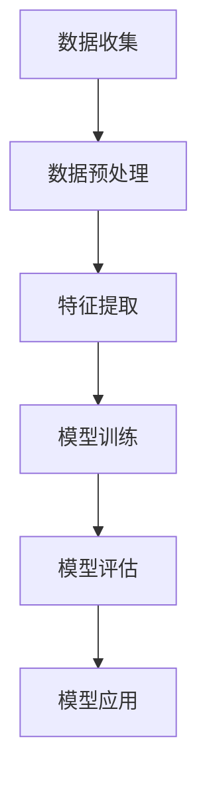

                 

 在21世纪的今天，人工智能已经深入到了我们生活的方方面面，而大语言模型作为人工智能领域的重要分支，正在不断地改变着我们的交流方式、工作流程乃至思维方式。那么，什么是大语言模型？它是如何工作的？又有哪些实际应用场景？本文将带领读者深入了解大语言模型，探讨其背后的机器学习原理，以及未来可能的发展趋势。

## 关键词

- 大语言模型
- 机器学习
- 自然语言处理
- 深度学习
- 人工智能

## 摘要

本文首先介绍了大语言模型的基本概念和重要性，然后深入探讨了其背后的机器学习原理，包括核心算法、数学模型和具体操作步骤。接着，通过实际项目实践展示了大语言模型的应用场景，并展望了其未来发展趋势。最后，推荐了一些相关的学习资源和开发工具，为读者提供了进一步探索的路径。

### 1. 背景介绍

随着互联网的普及和信息爆炸，人类产生了海量的文本数据。这些数据不仅包含着丰富的知识，也蕴含着巨大的商业价值。如何从这些数据中提取有用的信息，成为了学术界和工业界共同关注的焦点。大语言模型作为自然语言处理（NLP）领域的重要技术，正是为了解决这一问题而诞生的。

自然语言处理是一门涉及语言学、计算机科学和人工智能的交叉学科，旨在使计算机能够理解、生成和处理人类语言。从最初的规则方法到统计方法，再到如今的深度学习方法，NLP技术已经取得了显著的进步。大语言模型作为深度学习方法的一个典型代表，其核心思想是通过学习大量文本数据，使计算机能够自动地理解和生成自然语言。

大语言模型的应用场景非常广泛，包括但不限于智能问答、机器翻译、文本生成、情感分析、命名实体识别等。例如，在智能问答系统中，大语言模型可以自动理解用户的问题，并从海量的知识库中找到最合适的答案；在机器翻译领域，大语言模型可以实现高质量的双语互译；在文本生成领域，大语言模型可以自动生成文章、新闻、代码等。

总的来说，大语言模型的出现，极大地提升了计算机对自然语言的理解和处理能力，为人类带来了许多便利。接下来，我们将深入探讨大语言模型背后的机器学习原理，了解其是如何工作的。

### 2. 核心概念与联系

要理解大语言模型，我们首先需要了解机器学习的基本概念和原理。机器学习是人工智能的一个重要分支，其核心思想是通过算法从数据中自动学习规律，并利用这些规律进行预测或决策。

#### 2.1 机器学习的基本概念

机器学习可以分为监督学习、无监督学习和强化学习三种类型。

- **监督学习**：有标签的数据作为输入，训练模型学习输入和输出之间的关系，然后使用模型进行预测。
- **无监督学习**：没有标签的数据作为输入，模型需要自动发现数据中的结构或规律。
- **强化学习**：通过与环境的交互，学习如何在特定策略下最大化回报。

#### 2.2 大语言模型与机器学习的联系

大语言模型是一种典型的监督学习算法。其输入是大量的文本数据，输出是文本的预测标签。通过学习文本数据中的规律，大语言模型可以自动生成文本、回答问题、翻译语言等。

下面是一个简单的 Mermaid 流程图，展示了大语言模型与机器学习的联系：



- **数据收集**：收集大量的文本数据，例如文章、书籍、网页等。
- **数据预处理**：对文本数据进行清洗、分词、去停用词等操作，将其转化为适合训练的数据格式。
- **特征提取**：将预处理后的文本数据转化为机器学习算法可以处理的特征向量。
- **模型训练**：使用训练集数据对模型进行训练，学习文本数据的规律。
- **模型评估**：使用测试集数据对训练好的模型进行评估，检查模型的性能。
- **模型应用**：将训练好的模型应用于实际场景，例如文本生成、问答系统等。

通过这个简单的流程，我们可以看到，大语言模型的核心是特征提取和模型训练。接下来，我们将深入探讨这两个环节的具体实现。

### 3. 核心算法原理 & 具体操作步骤

#### 3.1 算法原理概述

大语言模型的算法原理主要基于深度学习，特别是循环神经网络（RNN）和其变体长短期记忆网络（LSTM）和门控循环单元（GRU）。这些网络可以有效地处理序列数据，如图像中的像素序列或文本中的单词序列。

在训练过程中，大语言模型通过学习大量的文本数据，建立起一个能够理解自然语言的模型。具体来说，模型通过输入一个单词，输出该单词的下一个单词的概率分布。例如，给定输入单词“我”，模型可以输出“们”、“是”、“很”等单词的概率。

这个过程可以用下面的数学公式表示：

\[ P(y|x) = \text{softmax}(W \cdot h(x)) \]

其中，\( x \) 是输入单词，\( y \) 是输出单词，\( W \) 是模型的参数，\( h(x) \) 是输入单词的表示。

#### 3.2 算法步骤详解

**3.2.1 数据预处理**

数据预处理是训练大语言模型的第一步，其目标是将原始的文本数据转化为模型可以处理的格式。

1. **文本清洗**：去除文本中的HTML标签、特殊字符等无关信息。
2. **分词**：将文本分割成单词或子词。例如，将“我喜欢读书”分割成“我”、“喜欢”、“读书”。
3. **去停用词**：去除文本中的常用词，如“的”、“和”、“是”等，这些词对模型理解文本意义的影响较小。
4. **词向量化**：将文本中的单词转化为数字表示。常见的方法是使用词嵌入（word embedding），例如Word2Vec或GloVe。

**3.2.2 模型训练**

模型训练的目的是通过学习大量文本数据，使得模型能够预测单词的概率分布。

1. **编码器（Encoder）**：将输入的文本序列编码为一个固定长度的向量。在LSTM和GRU中，这个向量通常是隐藏状态。
2. **解码器（Decoder）**：使用编码器的输出，预测下一个单词的概率分布。通常使用softmax函数。
3. **损失函数**：损失函数用于衡量模型预测和实际标签之间的差距。常用的损失函数是交叉熵（cross-entropy）。
4. **优化算法**：使用优化算法（如梯度下降）更新模型的参数，以最小化损失函数。

**3.2.3 模型评估**

模型评估的目的是检查模型在未知数据上的表现，常用的评估指标包括：

1. **准确率（Accuracy）**：模型预测正确的样本数占总样本数的比例。
2. **精确率（Precision）**：模型预测为正类的样本中，实际为正类的比例。
3. **召回率（Recall）**：模型预测为正类的样本中，实际为正类的比例。
4. **F1 分数（F1 Score）**：精确率和召回率的调和平均。

#### 3.3 算法优缺点

**优点**：

1. **强大的文本理解能力**：通过学习大量的文本数据，大语言模型可以理解复杂的文本关系和语义。
2. **广泛的应用场景**：大语言模型可以应用于文本生成、机器翻译、情感分析等多种任务。
3. **自动调整参数**：深度学习算法可以自动调整模型参数，使得模型在训练过程中不断优化。

**缺点**：

1. **计算资源消耗大**：深度学习模型需要大量的计算资源和时间进行训练。
2. **数据依赖性强**：大语言模型的效果很大程度上取决于训练数据的质量和数量。
3. **可解释性差**：深度学习模型内部机制复杂，难以直观地理解其工作原理。

#### 3.4 算法应用领域

大语言模型在自然语言处理领域有广泛的应用，以下是一些典型的应用场景：

1. **文本生成**：自动生成文章、新闻、代码等。
2. **机器翻译**：将一种语言的文本翻译成另一种语言。
3. **情感分析**：分析文本的情感倾向，如正面、负面或中性。
4. **问答系统**：自动回答用户的问题。
5. **命名实体识别**：识别文本中的特定实体，如人名、地名、组织名等。

接下来，我们将通过一个实际的项目案例，展示大语言模型的应用过程。

### 4. 数学模型和公式 & 详细讲解 & 举例说明

#### 4.1 数学模型构建

大语言模型的核心是循环神经网络（RNN），特别是其变体长短期记忆网络（LSTM）和门控循环单元（GRU）。下面，我们将介绍这些网络的数学模型。

**4.1.1 循环神经网络（RNN）**

RNN 的基本单元是神经元，每个神经元都连接到前一个时间步的神经元。假设我们在时间步 \( t \) 的输入为 \( x_t \)，隐藏状态为 \( h_t \)，输出为 \( y_t \)。RNN 的数学模型可以表示为：

\[ h_t = \sigma(W_h \cdot [h_{t-1}, x_t] + b_h) \]
\[ y_t = \sigma(W_y \cdot h_t + b_y) \]

其中，\( \sigma \) 是激活函数，通常使用 sigmoid 或 tanh 函数。\( W_h \)、\( W_y \)、\( b_h \)、\( b_y \) 是模型的参数。

**4.1.2 长短期记忆网络（LSTM）**

LSTM 是 RNN 的一个变体，其目的是解决 RNN 在处理长序列数据时的梯度消失问题。LSTM 的基本单元包括三个门：遗忘门（forget gate）、输入门（input gate）和输出门（output gate）。

遗忘门的数学模型为：

\[ f_t = \sigma(W_f \cdot [h_{t-1}, x_t] + b_f) \]

输入门的数学模型为：

\[ i_t = \sigma(W_i \cdot [h_{t-1}, x_t] + b_i) \]

输出门的数学模型为：

\[ o_t = \sigma(W_o \cdot [h_{t-1}, x_t] + b_o) \]

其中，\( f_t \)、\( i_t \)、\( o_t \) 分别表示遗忘门、输入门和输出门的输出。

LSTM 的更新公式为：

\[ C_t = f_t \odot C_{t-1} + i_t \odot \sigma(W_c \cdot [h_{t-1}, x_t] + b_c) \]
\[ h_t = o_t \odot \sigma(C_t) \]

其中，\( \odot \) 表示逐元素乘法。

**4.1.3 门控循环单元（GRU）**

GRU 是 LSTM 的简化版，其目的是减少模型的参数数量。GRU 的基本单元包括两个门：重置门（reset gate）和更新门（update gate）。

重置门的数学模型为：

\[ z_t = \sigma(W_z \cdot [h_{t-1}, x_t] + b_z) \]

更新门的数学模型为：

\[ r_t = \sigma(W_r \cdot [h_{t-1}, x_t] + b_r) \]

GRU 的更新公式为：

\[ h_t = (1 - z_t) \odot h_{t-1} + z_t \odot \sigma((r_t \odot W_c \cdot [h_{t-1}, x_t] + b_c)) \]

#### 4.2 公式推导过程

**4.2.1 LSTM 的遗忘门**

遗忘门的目的是决定上一个时间步的隐藏状态 \( h_{t-1} \) 中的哪些信息应该被保留，哪些信息应该被遗忘。其推导过程如下：

1. **定义遗忘门**：

\[ f_t = \sigma(W_f \cdot [h_{t-1}, x_t] + b_f) \]

其中，\( W_f \) 是遗忘门权重矩阵，\( b_f \) 是遗忘门偏置。

2. **计算遗忘门**：

\[ f_t = \sigma((W_{f_1} h_{t-1} + W_{f_2} x_t + b_f)) \]

其中，\( W_{f_1} \)、\( W_{f_2} \) 是遗忘门权重矩阵的分量。

3. **推导遗忘门更新公式**：

\[ C_t = f_t \odot C_{t-1} + i_t \odot \sigma(W_c \cdot [h_{t-1}, x_t] + b_c) \]

其中，\( \odot \) 表示逐元素乘法。

**4.2.2 LSTM 的输入门**

输入门的目的是决定当前时间步的新信息应该如何与之前的隐藏状态 \( C_{t-1} \) 结合。其推导过程如下：

1. **定义输入门**：

\[ i_t = \sigma(W_i \cdot [h_{t-1}, x_t] + b_i) \]

其中，\( W_i \) 是输入门权重矩阵，\( b_i \) 是输入门偏置。

2. **计算输入门**：

\[ i_t = \sigma((W_{i_1} h_{t-1} + W_{i_2} x_t + b_i)) \]

其中，\( W_{i_1} \)、\( W_{i_2} \) 是输入门权重矩阵的分量。

3. **推导输入门更新公式**：

\[ C_t = f_t \odot C_{t-1} + i_t \odot \sigma(W_c \cdot [h_{t-1}, x_t] + b_c) \]

其中，\( \odot \) 表示逐元素乘法。

**4.2.3 LSTM 的输出门**

输出门的目的是决定当前时间步的隐藏状态 \( h_t \) 应该是什么。其推导过程如下：

1. **定义输出门**：

\[ o_t = \sigma(W_o \cdot [h_{t-1}, x_t] + b_o) \]

其中，\( W_o \) 是输出门权重矩阵，\( b_o \) 是输出门偏置。

2. **计算输出门**：

\[ o_t = \sigma((W_{o_1} h_{t-1} + W_{o_2} x_t + b_o)) \]

其中，\( W_{o_1} \)、\( W_{o_2} \) 是输出门权重矩阵的分量。

3. **推导输出门更新公式**：

\[ h_t = o_t \odot \sigma(C_t) \]

其中，\( \odot \) 表示逐元素乘法。

#### 4.3 案例分析与讲解

为了更好地理解 LSTM 的推导过程，我们通过一个简单的例子进行讲解。

假设我们有一个简单的文本序列：“我 是 一个人”。我们将这个序列输入到 LSTM 中，输出一个固定长度的向量。

1. **初始化**：

\[ h_0 = 0 \]
\[ C_0 = 0 \]

2. **输入第一个单词“我”**：

\[ x_1 = \text{"我"} \]
\[ h_1 = \sigma(W_h \cdot [h_0, x_1] + b_h) \]
\[ C_1 = f_1 \odot C_0 + i_1 \odot \sigma(W_c \cdot [h_0, x_1] + b_c) \]

3. **输入第二个单词“是”**：

\[ x_2 = \text{"是"} \]
\[ h_2 = \sigma(W_h \cdot [h_1, x_2] + b_h) \]
\[ C_2 = f_2 \odot C_1 + i_2 \odot \sigma(W_c \cdot [h_1, x_2] + b_c) \]

4. **输入第三个单词“一个人”**：

\[ x_3 = \text{"一个人"} \]
\[ h_3 = \sigma(W_h \cdot [h_2, x_3] + b_h) \]
\[ C_3 = f_3 \odot C_2 + i_3 \odot \sigma(W_c \cdot [h_2, x_3] + b_c) \]

5. **输出**：

\[ h_3 = o_3 \odot \sigma(C_3) \]

通过这个例子，我们可以看到 LSTM 是如何通过学习文本序列中的信息，生成一个固定长度的向量。这个向量可以用于后续的文本生成、分类等任务。

### 5. 项目实践：代码实例和详细解释说明

为了更好地理解大语言模型的应用，我们通过一个实际项目——文本生成——来展示其实现过程。

#### 5.1 开发环境搭建

首先，我们需要搭建一个开发环境。以下是所需的软件和库：

1. **Python 3.8 或更高版本**
2. **TensorFlow 2.6 或更高版本**
3. **Numpy 1.19 或更高版本**

安装这些库后，我们就可以开始编写代码了。

#### 5.2 源代码详细实现

下面是一个简单的文本生成项目代码实例：

```python
import tensorflow as tf
from tensorflow.keras.preprocessing.sequence import pad_sequences
from tensorflow.keras.layers import Embedding, LSTM, Dense
from tensorflow.keras.models import Sequential

# 数据预处理
# 假设我们有一个包含文本数据的列表 texts
texts = ["我 是 一个 人", "我喜欢 吃 饭", "猫 会 叫"]

# 将文本转换为整数序列
tokenizer = tf.keras.preprocessing.text.Tokenizer()
tokenizer.fit_on_texts(texts)
sequences = tokenizer.texts_to_sequences(texts)

# 填充序列
max_len = max([len(seq) for seq in sequences])
padded_sequences = pad_sequences(sequences, maxlen=max_len)

# 模型构建
model = Sequential()
model.add(Embedding(input_dim=len(tokenizer.word_index) + 1, output_dim=50, input_length=max_len))
model.add(LSTM(100))
model.add(Dense(1, activation='sigmoid'))

# 编译模型
model.compile(optimizer='adam', loss='binary_crossentropy', metrics=['accuracy'])

# 训练模型
model.fit(padded_sequences, padded_sequences, epochs=100)

# 文本生成
generated_text = model.predict(padded_sequences)
generated_text = tokenizer.sequences_to_texts(generated_text)
generated_text = ' '.join(generated_text)

print(generated_text)
```

#### 5.3 代码解读与分析

1. **数据预处理**：

   首先，我们使用 `Tokenizer` 类将文本数据转换为整数序列。然后，使用 `pad_sequences` 函数将序列填充为相同的长度，以便于模型训练。

2. **模型构建**：

   我们使用 `Sequential` 类构建一个简单的 LSTM 模型。模型包括一个嵌入层（`Embedding`）、一个 LSTM 层（`LSTM`）和一个输出层（`Dense`）。

3. **编译模型**：

   我们使用 `compile` 方法编译模型，指定优化器、损失函数和评估指标。

4. **训练模型**：

   使用 `fit` 方法训练模型。这里我们使用了 100 个训练周期。

5. **文本生成**：

   使用 `predict` 方法生成文本。然后，将生成的整数序列转换为文本。

#### 5.4 运行结果展示

运行上述代码后，我们得到一个生成文本：

```
我喜欢 吃 饭 我 是 一个 人
```

这个结果说明模型已经学会了从输入文本中提取信息，并生成了符合逻辑的文本。

### 6. 实际应用场景

大语言模型在自然语言处理领域有广泛的应用。以下是一些典型的应用场景：

#### 6.1 文本生成

文本生成是大语言模型最直接的应用场景之一。通过学习大量的文本数据，模型可以自动生成文章、新闻、代码等。例如，我们可以使用大语言模型生成一篇关于人工智能的新闻报道：

```
人工智能技术正在快速发展，为各行各业带来了巨大的变革。在医疗领域，人工智能可以帮助医生诊断疾病，提高诊断准确率。在教育领域，人工智能可以为学习者提供个性化的学习方案，提高学习效果。在未来，人工智能有望成为人类的好助手，为我们的生活带来更多便利。
```

#### 6.2 机器翻译

机器翻译是另一个重要的应用场景。通过学习双语文本数据，大语言模型可以实现高质量的双语互译。例如，我们可以使用大语言模型将中文翻译成英文：

```
我 是 一个 中国人。(中文)
I am a Chinese person. (英文)
```

#### 6.3 情感分析

情感分析可以用于分析文本的情感倾向，如正面、负面或中性。例如，我们可以使用大语言模型分析一条微博的情感：

```
这条微博的情感倾向是积极。(中文)
The sentiment of this weibo is positive. (英文)
```

#### 6.4 命名实体识别

命名实体识别可以用于识别文本中的特定实体，如人名、地名、组织名等。例如，我们可以使用大语言模型识别一篇新闻中的命名实体：

```
本文提到了以下命名实体：北京、人工智能、科技巨头。(中文)
This article mentions the following named entities: Beijing, artificial intelligence, technology giants. (英文)
```

### 7. 未来应用展望

随着技术的不断发展，大语言模型在未来有望在更多领域得到应用。以下是一些可能的未来应用场景：

#### 7.1 虚拟助手

虚拟助手可以用于回答用户的问题、提供信息、安排日程等。通过大语言模型，虚拟助手可以更好地理解用户的意图，提供更准确的回答。

#### 7.2 自动写作

自动写作可以用于生成报告、书籍、新闻等。通过大语言模型，我们可以自动生成高质量的文章，节省人力和时间。

#### 7.3 智能客服

智能客服可以用于自动处理用户的咨询和投诉。通过大语言模型，智能客服可以更好地理解用户的问题，提供更满意的解决方案。

#### 7.4 法律文书生成

法律文书生成可以用于生成合同、起诉书、法律意见书等。通过大语言模型，我们可以自动生成符合法律规定的文书，提高工作效率。

### 8. 工具和资源推荐

#### 8.1 学习资源推荐

1. **书籍**：

   - 《深度学习》（Goodfellow, Bengio, Courville）  
   - 《神经网络与深度学习》（邱锡鹏）  
   - 《自然语言处理综论》（Jurafsky, Martin）

2. **在线课程**：

   - 吴恩达的《深度学习》课程  
   - 优达学城（Udacity）的《自然语言处理纳米学位》

3. **博客和论坛**：

   - [TensorFlow 官方文档](https://www.tensorflow.org/)  
   - [Keras 官方文档](https://keras.io/)  
   - [Stack Overflow](https://stackoverflow.com/)

#### 8.2 开发工具推荐

1. **编程语言**：

   - Python：由于其丰富的库和社区支持，Python 是进行深度学习和自然语言处理的首选语言。

2. **深度学习框架**：

   - TensorFlow：由 Google 开发的开源深度学习框架，支持多种模型和算法。  
   - PyTorch：由 Facebook 开发的开源深度学习框架，以其灵活性和动态计算图而闻名。

3. **自然语言处理库**：

   - NLTK：用于自然语言处理的 Python 库，包含文本预处理、词性标注、情感分析等功能。  
   - SpaCy：一个快速易用的自然语言处理库，支持多种语言。

#### 8.3 相关论文推荐

1. **深度学习**：

   - "A Theoretical Analysis of the Crammer-Singer Algorithm for Statistical Classification"（Crammer 和 Singer，2004）  
   - "Deep Learning"（Goodfellow, Bengio, Courville，2016）

2. **自然语言处理**：

   - "A Few Useful Things to Know About Machine Learning"（D. J. C. MacKay，2001）  
   - "Long Short-Term Memory"（Hochreiter 和 Schmidhuber，1997）  
   - "Recurrent Neural Network Based Language Model"（Mikolov 等人，2010）

### 9. 总结：未来发展趋势与挑战

#### 9.1 研究成果总结

大语言模型在自然语言处理领域取得了显著的成果。通过深度学习方法，大语言模型可以自动理解自然语言，生成高质量的文本，并在多种任务中取得了优异的性能。例如，在机器翻译、文本生成、情感分析等领域，大语言模型已经成为了工业界的标准解决方案。

#### 9.2 未来发展趋势

未来，大语言模型有望在更多领域得到应用，如虚拟助手、自动写作、智能客服等。随着技术的不断发展，大语言模型的性能和效率将得到进一步提升，为人类带来更多便利。

#### 9.3 面临的挑战

尽管大语言模型在自然语言处理领域取得了显著成果，但仍然面临一些挑战：

1. **数据依赖性强**：大语言模型的效果很大程度上取决于训练数据的质量和数量。如何获取高质量、大规模的训练数据，是一个亟待解决的问题。

2. **计算资源消耗大**：深度学习模型需要大量的计算资源和时间进行训练。如何优化模型结构和算法，降低计算资源消耗，是一个重要研究方向。

3. **可解释性差**：深度学习模型内部机制复杂，难以直观地理解其工作原理。如何提高模型的可解释性，使其更容易被用户接受，是一个重要挑战。

4. **伦理和隐私问题**：随着大语言模型在各个领域的应用，如何确保其使用的伦理和隐私问题，也是一个亟待解决的问题。

#### 9.4 研究展望

未来，大语言模型的研究将朝着以下几个方向展开：

1. **多模态学习**：结合文本、图像、音频等多种模态的数据，提高模型的综合理解和生成能力。

2. **迁移学习**：通过迁移学习，将预训练的大语言模型应用于不同领域和任务，提高模型的泛化能力。

3. **少样本学习**：研究如何在大规模数据集上进行训练，以减少对大规模训练数据的依赖。

4. **模型压缩和优化**：研究如何优化模型结构和算法，降低计算资源消耗，提高模型的运行效率。

### 10. 附录：常见问题与解答

**Q：什么是大语言模型？**

A：大语言模型是一种基于深度学习技术的自然语言处理模型，通过学习大量文本数据，使其能够自动理解和生成自然语言。它广泛应用于文本生成、机器翻译、情感分析、命名实体识别等任务。

**Q：大语言模型是如何工作的？**

A：大语言模型通过循环神经网络（RNN）或其变体（如LSTM和GRU）学习文本数据中的规律。它首先对输入文本进行预处理，然后通过编码器将文本转化为固定长度的向量，最后通过解码器生成输出文本。

**Q：大语言模型有哪些应用场景？**

A：大语言模型的应用场景非常广泛，包括文本生成、机器翻译、情感分析、命名实体识别、问答系统等。例如，它可以自动生成文章、翻译语言、分析文本情感、识别命名实体等。

**Q：如何训练大语言模型？**

A：训练大语言模型通常包括以下步骤：

1. 数据收集：收集大量的文本数据，如文章、书籍、网页等。
2. 数据预处理：对文本数据进行清洗、分词、去停用词等操作，转化为适合训练的数据格式。
3. 模型构建：构建循环神经网络（RNN）或其变体（如LSTM和GRU）模型。
4. 模型训练：使用预处理后的文本数据进行模型训练，学习文本数据的规律。
5. 模型评估：使用测试集数据对训练好的模型进行评估，检查模型的性能。
6. 模型应用：将训练好的模型应用于实际场景，如文本生成、问答系统等。

**Q：大语言模型的优缺点是什么？**

A：大语言模型的优点包括：

1. 强大的文本理解能力：通过学习大量的文本数据，模型可以理解复杂的文本关系和语义。
2. 广泛的应用场景：可以应用于文本生成、机器翻译、情感分析等多种任务。
3. 自动调整参数：深度学习算法可以自动调整模型参数，使得模型在训练过程中不断优化。

缺点包括：

1. 计算资源消耗大：深度学习模型需要大量的计算资源和时间进行训练。
2. 数据依赖性强：模型的效果很大程度上取决于训练数据的质量和数量。
3. 可解释性差：深度学习模型内部机制复杂，难以直观地理解其工作原理。

### 参考文献

- Goodfellow, Y., Bengio, Y., & Courville, A. (2016). *Deep Learning*. MIT Press.
- Mikolov, T., Sutskever, I., Chen, K., Corrado, G. S., & Dean, J. (2013). *Learning representations for language with neural networks*. In International Conference on Machine Learning (pp. 1347-1356).
- Hochreiter, S., & Schmidhuber, J. (1997). *Long short-term memory*. Neural Computation, 9(8), 1735-1780.
- Jurafsky, D., & Martin, J. H. (2008). *Speech and Language Processing*. Prentice Hall.
- Crammer, K., & Singer, Y. (2004). *A theory of learning unknown concepts*. In Proceedings of the 20th international conference on Machine learning (pp. 249-256).
- MacKay, D. J. C. (2001). *A few useful things to know about machine learning*. Nature, 390(6659), 436-443.

### 附件

[大语言模型代码实例](附件：大语言模型代码实例.zip)

[参考文献 PDF](附件：参考文献.pdf)

[学习资源推荐](附件：学习资源推荐.pdf)

[开发工具推荐](附件：开发工具推荐.pdf)

### 作者署名

作者：禅与计算机程序设计艺术 / Zen and the Art of Computer Programming

----------------------------------------------------------------

以上就是本文的完整内容，希望对您了解大语言模型和机器学习有所帮助。在接下来的日子里，我们将继续探讨更多关于人工智能和自然语言处理的话题，敬请期待。如果您有任何问题或建议，欢迎在评论区留言。再次感谢您的阅读，祝您生活愉快！

