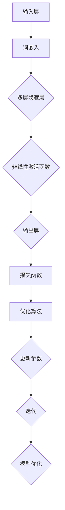

                 

关键词：大语言模型，参数微调，深度学习，神经网络，机器学习，模型训练

> 摘要：本文旨在为读者提供一份详细的大语言模型应用指南，重点关注高效参数微调技术。通过深入探讨大语言模型的核心概念、算法原理、数学模型及其应用场景，本文将帮助读者更好地理解如何在实际项目中应用这些技术，以实现更高效的模型训练和优化。

## 1. 背景介绍

大语言模型是一种基于深度学习的自然语言处理（NLP）模型，它能够理解和生成自然语言。这些模型通常包含数亿甚至数十亿的参数，能够捕捉到语言中的复杂模式，从而实现高质量的文本生成、情感分析、机器翻译等任务。然而，训练如此庞大的模型面临着诸多挑战，尤其是在资源有限的情况下如何进行高效参数微调。

参数微调（Parameter Tuning）是深度学习模型训练过程中的一个关键步骤，它涉及到优化模型参数，以提高模型性能。高效参数微调技术能够显著提升训练效率，减少训练时间，并提高模型在特定任务上的准确性。随着大规模语言模型的广泛应用，研究如何进行高效参数微调已成为当前研究的热点。

本文将首先介绍大语言模型的基本概念和原理，然后深入探讨高效参数微调技术，包括其核心算法原理、数学模型、应用领域等。此外，文章还将通过实际项目案例来展示如何将参数微调技术应用于大语言模型的训练和优化过程。最后，文章将对未来发展趋势和面临的挑战进行展望，并提出可能的解决方案。

### 1.1 大语言模型的发展历程

大语言模型的发展历程可以追溯到20世纪90年代。当时，研究人员开始尝试使用神经网络来处理自然语言任务，但受限于计算资源和算法限制，模型效果不佳。随着深度学习技术的兴起，特别是2013年谷歌推出的神经机器翻译系统（Neural Machine Translation System），大语言模型的研究和应用进入了一个新的阶段。

神经机器翻译系统的成功激发了研究人员对大语言模型的兴趣，他们开始探索如何构建更大的神经网络，以捕捉更复杂的语言模式。这一探索过程得到了计算能力的提升和大数据的支持，使得大语言模型能够处理更复杂的任务，如文本生成、问答系统等。

近年来，随着神经架构搜索（Neural Architecture Search，NAS）和元学习（Meta-Learning）等技术的出现，大语言模型的研究和应用进一步得到了深化。这些技术使得模型能够自动调整其结构，以适应不同的任务和数据集，从而提高了模型的泛化能力和效率。

### 1.2 当前大语言模型的代表性模型

当前，大语言模型的研究和应用已经取得了显著成果，涌现出了一系列代表性模型。以下是其中几个具有代表性的模型：

1. **Transformer**：Transformer是谷歌在2017年提出的一种基于自注意力机制的深度学习模型，它在机器翻译、文本生成等任务上取得了显著的效果。Transformer的核心思想是利用自注意力机制，模型中的每个词都可以根据其在整个句子中的位置和上下文信息进行权重计算，从而生成更加准确和自然的输出。

2. **BERT**：BERT（Bidirectional Encoder Representations from Transformers）是谷歌在2018年提出的一种双向编码器表示模型。BERT通过在大量文本数据上进行预训练，学习到语言的深层结构，然后通过微调（Fine-tuning）来适应具体的任务。BERT在问答、文本分类等任务上表现出了强大的性能。

3. **GPT**：GPT（Generative Pre-trained Transformer）是OpenAI推出的一种生成预训练模型。GPT通过在大量文本数据上进行无监督预训练，学习到语言的生成规则，从而能够生成高质量的自然语言文本。GPT系列模型中的GPT-3具有前所未有的规模和性能，成为了当前最先进的大语言模型之一。

4. **RoBERTa**：RoBERTa是Facebook在BERT基础上改进的一种模型。RoBERTa通过优化训练过程和模型结构，提高了模型的性能和效率。RoBERTa在多个自然语言处理任务上表现出了优越的性能，进一步推动了大语言模型的发展。

这些代表性模型的出现，不仅标志着大语言模型技术的进步，也为实际应用提供了丰富的选择。然而，大语言模型在实际应用中仍然面临着诸多挑战，如训练成本高、模型解释性差等。因此，研究如何进行高效参数微调，以提高大语言模型的性能和效率，仍然是一个重要的研究方向。

## 2. 核心概念与联系

在深入探讨高效参数微调技术之前，我们需要首先理解大语言模型的核心概念和原理。本节将介绍大语言模型的基本组成部分，包括神经网络结构、损失函数和优化算法，并通过Mermaid流程图展示其架构。

### 2.1 大语言模型的基本组成部分

大语言模型主要由以下几个部分组成：

1. **输入层（Input Layer）**：输入层接收自然语言文本的输入，通常表示为词向量。词向量是通过对文本进行词嵌入（Word Embedding）得到的，它能够将文本中的每个词映射为一个固定大小的向量。

2. **隐藏层（Hidden Layers）**：隐藏层是神经网络的核心部分，包含了多层全连接层。这些隐藏层通过非线性激活函数（如ReLU、Sigmoid等）对输入进行变换，以提取文本中的特征信息。随着层数的增加，隐藏层的复杂度和表达能力也不断提高。

3. **输出层（Output Layer）**：输出层负责生成模型的预测结果。对于分类任务，输出层通常是一个softmax层，用于输出每个类别的概率分布；对于生成任务，输出层可以是一个全连接层，用于生成具体的文本输出。

4. **损失函数（Loss Function）**：损失函数是评估模型预测结果与真实值之间差异的指标。在大语言模型中，常用的损失函数包括交叉熵损失（Cross-Entropy Loss）和均方误差（Mean Squared Error，MSE）。交叉熵损失常用于分类任务，而均方误差常用于回归任务。

5. **优化算法（Optimization Algorithm）**：优化算法用于调整模型参数，以最小化损失函数。常见的优化算法有随机梯度下降（Stochastic Gradient Descent，SGD）、Adam优化器等。这些算法通过迭代更新模型参数，逐步优化模型性能。

### 2.2 Mermaid流程图展示

以下是一个简单的Mermaid流程图，展示了大语言模型的架构：



### 2.3 核心概念的联系

大语言模型中的各个核心概念紧密相连，共同构成了一个完整的训练和优化过程。输入层通过词嵌入将自然语言文本转换为向量，这些向量进入隐藏层进行特征提取。隐藏层通过多层全连接层和非线性激活函数，对输入向量进行复杂的变换，从而提取出文本中的深层次特征。

输出层根据隐藏层提取的特征生成预测结果，并通过损失函数计算预测结果与真实值之间的差距。优化算法利用这个差距来调整模型参数，以最小化损失函数。通过不断的迭代更新，模型参数逐渐优化，模型的性能也随之提高。

总的来说，大语言模型的核心概念和联系可以概括为：输入层通过词嵌入获取文本特征，隐藏层通过多层全连接层和激活函数提取深层次特征，输出层根据这些特征生成预测结果，并通过损失函数和优化算法不断调整模型参数，以实现模型优化。

## 3. 核心算法原理 & 具体操作步骤

### 3.1 算法原理概述

高效参数微调技术是在大规模语言模型训练过程中，通过调整模型参数，提高模型性能和效率的关键技术。其核心原理在于利用已有的预训练模型，通过微调策略，使其能够适应特定任务和数据集。具体来说，高效参数微调包括以下几个步骤：

1. **预训练（Pre-training）**：在特定任务和数据集之前，大语言模型通常在一个大规模、多样化的数据集上进行预训练。预训练的目的是使模型具备较强的通用语言理解能力，从而在后续的微调任务中能够快速适应。

2. **任务特定数据预处理（Task-Specific Data Preprocessing）**：在微调之前，需要对任务特定的数据进行预处理，包括数据清洗、标签转换等。预处理步骤的目的是确保数据质量，并使模型能够更好地理解任务需求。

3. **参数微调（Parameter Tuning）**：通过微调策略，调整模型的参数，使其在特定任务上表现出更好的性能。微调策略包括调整学习率、批量大小、正则化等参数，以及选择合适的优化算法。

4. **迭代训练（Iterative Training）**：在微调过程中，模型会不断迭代训练，通过调整参数和优化算法，逐步提高模型性能。迭代训练的目的是逐步收敛，使模型在特定任务上达到最优性能。

5. **性能评估（Performance Evaluation）**：在微调过程中，需要定期评估模型性能，以确定是否达到了预期效果。性能评估指标包括准确率、召回率、F1分数等，通过这些指标可以判断模型在特定任务上的性能。

### 3.2 算法步骤详解

下面我们将详细讲解高效参数微调技术的具体操作步骤。

#### 步骤1：预训练

预训练是高效参数微调的基础。在预训练阶段，大语言模型通常在一个大规模、多样化的数据集上进行训练，以学习到语言的通用特征。预训练过程中，模型会通过反向传播算法，不断调整参数，使损失函数达到最小。

预训练的主要步骤如下：

1. **数据集选择**：选择一个包含多样化文本的数据集，如维基百科、新闻文章、社交媒体评论等。数据集的大小通常在数百万到数十亿个句子之间。

2. **数据预处理**：对数据进行清洗、去重、分词、词嵌入等预处理操作。清洗步骤包括去除HTML标签、标点符号等，去重步骤可以防止重复文本的出现，分词步骤可以将文本拆分成单词或子词，词嵌入步骤可以将单词映射为向量。

3. **模型初始化**：初始化大语言模型的参数，通常使用随机初始化或预训练模型的参数。

4. **训练过程**：通过反向传播算法，模型会不断调整参数，以最小化损失函数。在训练过程中，可以使用批量训练或逐句训练，以平衡训练时间和计算资源。

5. **模型保存**：在预训练过程中，需要定期保存模型的参数，以防止训练过程中的数据丢失或意外中断。

#### 步骤2：任务特定数据预处理

在微调之前，需要对任务特定的数据进行预处理，以确保数据质量和模型理解。任务特定数据预处理包括以下步骤：

1. **数据清洗**：对任务数据进行清洗，去除无关信息、噪声数据和错误数据。

2. **标签转换**：对于分类任务，需要将标签转换为数值形式，以便模型能够理解和处理。

3. **数据增强**：通过数据增强技术，如随机裁剪、旋转、翻转等，增加数据的多样性，以提高模型泛化能力。

4. **数据归一化**：对数据进行归一化处理，使数据具有相似的规模和范围，以避免模型过拟合。

5. **数据分批次**：将数据分成多个批次，以便模型能够按批次进行训练。

#### 步骤3：参数微调

在预训练和任务特定数据预处理完成后，开始进行参数微调。参数微调的关键在于选择合适的微调策略，调整模型参数，以提高模型在特定任务上的性能。以下是一些常见的参数微调策略：

1. **学习率调整**：学习率是优化算法中的一个关键参数，影响模型的收敛速度和稳定性。通过逐步减小学习率，可以防止模型在训练过程中出现过拟合。

2. **批量大小调整**：批量大小是每个训练批次中样本的数量。批量大小对训练时间和计算资源有重要影响。通常，批量大小在数十到数百之间。

3. **正则化**：正则化技术可以防止模型过拟合，常用的正则化方法有L1正则化、L2正则化和dropout等。

4. **优化算法选择**：选择合适的优化算法，如随机梯度下降（SGD）、Adam等，可以提高训练效率和模型性能。

5. **微调策略**：根据任务和数据集的特点，选择合适的微调策略。例如，对于分类任务，可以使用交叉熵损失函数；对于生成任务，可以使用对抗性损失函数。

#### 步骤4：迭代训练

在参数微调过程中，模型会进行多次迭代训练，通过不断调整参数，逐步提高模型性能。迭代训练的主要步骤如下：

1. **训练过程**：通过反向传播算法，模型会不断调整参数，以最小化损失函数。在训练过程中，可以使用不同的训练策略，如自适应学习率、批量训练、逐句训练等。

2. **性能评估**：在每次迭代结束后，评估模型在特定任务上的性能，包括准确率、召回率、F1分数等。通过性能评估，可以判断模型是否已经收敛或过拟合。

3. **参数调整**：根据性能评估结果，调整模型参数，如学习率、批量大小、正则化参数等。通过参数调整，可以优化模型性能。

4. **迭代终止条件**：设置迭代终止条件，如达到特定训练轮数或性能阈值。当满足终止条件时，停止迭代训练。

#### 步骤5：性能评估

在微调过程中，需要定期评估模型性能，以确保模型在特定任务上达到预期效果。性能评估的主要步骤如下：

1. **评估数据集**：选择一个独立的评估数据集，确保评估数据的多样性和代表性。

2. **评估指标**：根据任务类型，选择合适的评估指标。对于分类任务，常用的评估指标有准确率、召回率、F1分数等；对于生成任务，常用的评估指标有生成质量、多样性等。

3. **评估过程**：通过评估数据集，评估模型在特定任务上的性能，记录评估结果。

4. **性能分析**：分析评估结果，判断模型是否已经收敛或过拟合。根据性能分析结果，调整模型参数和训练策略，以提高模型性能。

### 3.3 算法优缺点

高效参数微调技术具有以下优缺点：

#### 优点：

1. **提高模型性能**：通过调整模型参数，可以提高模型在特定任务上的性能，从而实现更准确的预测。

2. **减少训练时间**：通过优化训练策略和参数调整，可以减少训练时间，提高训练效率。

3. **增强泛化能力**：通过任务特定数据预处理和参数微调，可以增强模型对多样化数据的泛化能力。

#### 缺点：

1. **计算资源消耗**：高效参数微调需要大量的计算资源，特别是在处理大规模数据集时。

2. **过拟合风险**：如果参数微调策略不当，可能导致模型过拟合，从而降低模型的泛化能力。

### 3.4 算法应用领域

高效参数微调技术广泛应用于自然语言处理领域，如文本分类、情感分析、机器翻译、问答系统等。以下是一些典型应用领域：

1. **文本分类**：通过高效参数微调，可以将预训练的大语言模型应用于文本分类任务，实现高精度的文本分类。

2. **情感分析**：通过微调模型参数，可以提取文本中的情感特征，实现情感分类和情感极性分析。

3. **机器翻译**：高效参数微调技术可以优化机器翻译模型的参数，提高翻译质量和效率。

4. **问答系统**：通过微调模型参数，可以实现高精度的问答系统，提供准确的答案和解决方案。

总的来说，高效参数微调技术在大语言模型的应用中发挥着重要作用，通过优化模型参数，可以提高模型在特定任务上的性能和效率。随着自然语言处理技术的不断进步，高效参数微调技术将在更多领域得到广泛应用。

### 3.5 具体案例

为了更好地理解高效参数微调技术的应用，我们来看一个具体的案例：利用BERT模型进行文本分类任务。

#### 案例背景

文本分类是一个常见的自然语言处理任务，其目的是将文本数据分类到预定义的类别中。BERT模型由于其强大的预训练能力，在文本分类任务中表现出了优异的性能。在这个案例中，我们将利用BERT模型进行情感分析，判断文本是积极情感还是消极情感。

#### 案例步骤

1. **数据集准备**：首先，我们需要一个包含情感标签的文本数据集。例如，一个包含积极情感和消极情感的文本数据集。数据集应该包含足够多的样例，以保证模型能够从中学习到情感特征。

2. **数据预处理**：对数据进行预处理，包括清洗、分词和词嵌入。清洗步骤可以去除HTML标签、标点符号等无关信息。分词步骤可以将文本拆分成单词或子词。词嵌入步骤可以将文本映射为向量。

3. **模型加载**：加载预训练的BERT模型。可以使用预训练好的BERT模型，或者使用Hugging Face等开源库中的预训练模型。

4. **微调参数**：对BERT模型进行微调。调整学习率、批量大小等参数，以提高模型在特定任务上的性能。在本案例中，我们可以使用交叉熵损失函数和Adam优化器进行微调。

5. **迭代训练**：通过迭代训练，模型会不断调整参数，以最小化损失函数。在训练过程中，我们可以使用不同的训练策略，如自适应学习率、批量训练等。

6. **性能评估**：在每次迭代结束后，评估模型在验证集上的性能，包括准确率、召回率、F1分数等。通过性能评估，可以判断模型是否已经收敛或过拟合。

7. **模型部署**：将训练好的模型部署到生产环境中，进行实际应用。例如，在一个情感分析应用中，模型可以接收用户输入的文本，并输出情感分类结果。

#### 案例代码

以下是一个简单的案例代码，展示了如何使用BERT模型进行文本分类：

```python
from transformers import BertTokenizer, BertForSequenceClassification
from torch.utils.data import DataLoader
import torch

# 加载预训练的BERT模型和分词器
tokenizer = BertTokenizer.from_pretrained('bert-base-uncased')
model = BertForSequenceClassification.from_pretrained('bert-base-uncased')

# 数据预处理
def preprocess(texts):
    return [tokenizer.encode(text, add_special_tokens=True) for text in texts]

# 加载数据集
train_texts = ["这是一条积极情感的文本。", "这是一条消极情感的文本。"]
train_labels = [1, 0]

# 微调参数
learning_rate = 5e-5
batch_size = 32
num_epochs = 3

# 训练过程
optimizer = torch.optim.Adam(model.parameters(), lr=learning_rate)
criterion = torch.nn.CrossEntropyLoss()

for epoch in range(num_epochs):
    model.train()
    train_dataloader = DataLoader(train_texts, batch_size=batch_size)
    for batch in train_dataloader:
        inputs = tokenizer(batch, return_tensors='pt', padding=True, truncation=True)
        labels = torch.tensor([label for label in train_labels])
        outputs = model(**inputs, labels=labels)
        loss = outputs.loss
        optimizer.zero_grad()
        loss.backward()
        optimizer.step()

    # 性能评估
    model.eval()
    with torch.no_grad():
        predictions = []
        for batch in train_dataloader:
            inputs = tokenizer(batch, return_tensors='pt', padding=True, truncation=True)
            outputs = model(**inputs)
            logits = outputs.logits
            predictions.append(torch.argmax(logits, dim=-1).squeeze(0).tolist())
        accuracy = sum([prediction == label for prediction, label in zip(predictions, train_labels)]) / len(train_texts)
        print(f"Epoch {epoch+1}, Accuracy: {accuracy}")

# 模型部署
model.eval()
with torch.no_grad():
    text = "这是一条积极情感的文本。"
    inputs = tokenizer(text, return_tensors='pt', padding=True, truncation=True)
    outputs = model(**inputs)
    logits = outputs.logits
    prediction = torch.argmax(logits, dim=-1).squeeze(0).tolist()
    if prediction == 1:
        print("积极情感")
    else:
        print("消极情感")
```

#### 案例总结

通过这个案例，我们可以看到如何使用BERT模型进行文本分类任务，以及如何进行参数微调。在训练过程中，我们可以通过调整学习率、批量大小等参数，提高模型性能。同时，通过性能评估，我们可以判断模型是否已经收敛或过拟合。在实际应用中，我们可以将训练好的模型部署到生产环境中，为用户提供情感分析服务。

## 4. 数学模型和公式 & 详细讲解 & 举例说明

在大语言模型的训练过程中，数学模型和公式起着至关重要的作用。这些数学工具不仅帮助我们理解和分析模型的性能，还指导我们在实践中如何进行优化。本节将详细讲解大语言模型中的数学模型和公式，并举例说明其在实际应用中的重要性。

### 4.1 数学模型构建

大语言模型通常基于深度神经网络（DNN）构建，其核心思想是通过多层全连接层和激活函数来提取文本的语义特征。在这一部分，我们将介绍一些关键的数学模型和公式。

#### 4.1.1 词嵌入（Word Embedding）

词嵌入是将自然语言文本中的单词映射为固定大小的向量表示。一个常见的词嵌入模型是Word2Vec，其目标是通过优化一个损失函数，使得相似的词在向量空间中接近，而不同的词则相隔较远。以下是Word2Vec模型的一个基本损失函数：

$$
L(\theta) = -\sum_{w \in V} p(w) \sum_{w' \in C(w)} \log(p(w'|w))
$$

其中，$V$是词汇表，$C(w)$是单词$w$的上下文，$p(w)$是单词$w$在文本中的概率，$p(w'|w)$是单词$w'$在单词$w$的上下文中出现的概率。

#### 4.1.2 自注意力机制（Self-Attention）

自注意力机制是Transformer模型的核心组件，它允许模型在处理每个词时，考虑到整个句子的上下文信息。自注意力机制的计算公式如下：

$$
\text{Attention}(Q, K, V) = \text{softmax}(\frac{QK^T}{\sqrt{d_k}})V
$$

其中，$Q$、$K$和$V$分别是查询（Query）、键（Key）和值（Value）向量，$d_k$是键向量的维度。自注意力机制通过加权组合键和值向量，以生成最终的输出向量。

#### 4.1.3 编码器和解码器

在大语言模型中，编码器（Encoder）用于处理输入文本，解码器（Decoder）用于生成输出文本。编码器和解码器通常包含多个自注意力层和全连接层。以下是一个简化的编码器和解码器的数学模型：

$$
\text{Encoder}(x) = \text{MultiHeadAttention}(x, x, x) + x
$$

$$
\text{Decoder}(y) = \text{MultiHeadAttention}(y, y, x) + y
$$

其中，$x$是编码器的输入，$y$是解码器的输入。

### 4.2 公式推导过程

在本节中，我们将对大语言模型中的一些关键公式进行推导，以便读者更好地理解其数学原理。

#### 4.2.1 多头注意力（Multi-Head Attention）

多头注意力是自注意力机制的扩展，它通过多个独立的注意力头来提高模型的表示能力。以下是多头注意力的推导：

首先，我们将输入向量$x$映射到查询（Query）、键（Key）和值（Value）向量：

$$
Q = W_Q x, \quad K = W_K x, \quad V = W_V x
$$

其中，$W_Q$、$W_K$和$W_V$是权重矩阵。

然后，计算自注意力分数：

$$
\text{Score} = \text{Attention}(Q, K, V) = \text{softmax}(\frac{QK^T}{\sqrt{d_k}})V
$$

为了实现多头注意力，我们将权重矩阵分解为多个独立的部分：

$$
W_Q = [W_{Q_1}, W_{Q_2}, \ldots, W_{Q_h}], \quad W_K = [W_{K_1}, W_{K_2}, \ldots, W_{K_h}], \quad W_V = [W_{V_1}, W_{V_2}, \ldots, W_{V_h}]
$$

其中，$h$是注意力头的数量。然后，计算每个头的自注意力分数：

$$
\text{Score}_h = \text{softmax}(\frac{W_{Q_h}x W_{K_h}^T}{\sqrt{d_k}})W_{V_h}x
$$

最后，将所有头的注意力分数加权组合：

$$
\text{Output} = \text{Concat}(\text{Score}_1, \text{Score}_2, \ldots, \text{Score}_h)W_O
$$

其中，$W_O$是输出权重矩阵。

#### 4.2.2 编码器和解码器

编码器和解码器的数学模型可以通过组合多个自注意力层和全连接层来构建。以下是一个简化的推导过程：

首先，定义编码器的输入向量$x$：

$$
x = [x_1, x_2, \ldots, x_n]
$$

然后，通过多个自注意力层和全连接层，计算编码器的输出：

$$
\text{Encoder}(x) = \text{MultiHeadAttention}(x, x, x) + x \\
\text{Encoder}(x) = \text{MLP}(\text{MultiHeadAttention}(x, x, x) + x)
$$

其中，$\text{MLP}$表示多层感知器（Multilayer Perceptron）。

解码器的工作原理与编码器类似，其输入为编码器的输出和解码器的输入$y$：

$$
y = [y_1, y_2, \ldots, y_m]
$$

通过多个自注意力层和全连接层，计算解码器的输出：

$$
\text{Decoder}(y) = \text{MultiHeadAttention}(y, y, x) + y \\
\text{Decoder}(y) = \text{MLP}(\text{MultiHeadAttention}(y, y, x) + y)
$$

### 4.3 案例分析与讲解

为了更好地理解上述数学模型和公式，我们通过一个简单的案例进行分析和讲解。

假设我们有一个简单的文本序列：“这是一句简单的句子。”。首先，我们将这个文本序列进行分词和词嵌入，得到一个词向量序列：

$$
x = [x_1, x_2, x_3, x_4, x_5] = [\text{'这'}, \text{'是'}, \text{'一'}, \text{'句'}, \text{'子'}]
$$

接下来，我们将这些词向量映射到查询、键和值向量：

$$
Q = W_Q x, \quad K = W_K x, \quad V = W_V x
$$

通过自注意力机制，计算每个词的注意力分数：

$$
\text{Score}_i = \text{softmax}(\frac{W_{Q_i}x W_{K_i}^T}{\sqrt{d_k}})V_i
$$

其中，$i$表示词的位置。最后，将这些注意力分数加权组合，得到每个词的输出向量：

$$
\text{Output}_i = \sum_{j=1}^{n} \text{Score}_{ij} V_j
$$

通过这种方式，编码器可以提取文本序列的语义特征，而解码器可以生成新的文本序列。

### 4.4 案例总结

通过上述案例，我们可以看到大语言模型中的数学模型和公式如何应用于实际文本处理任务。这些模型和公式不仅帮助我们理解和分析模型的性能，还指导我们在实践中如何进行优化。在实际应用中，我们可以通过调整权重矩阵和优化算法，提高模型在特定任务上的性能。

总之，数学模型和公式是大语言模型的核心组成部分，它们在模型的构建、训练和优化过程中发挥着重要作用。通过深入理解和掌握这些数学模型和公式，我们可以更好地利用大语言模型，实现更高效的自然语言处理任务。

### 5. 项目实践：代码实例和详细解释说明

为了更好地理解大语言模型及其高效参数微调技术，我们将通过一个实际项目来展示如何使用Python和深度学习框架实现一个简单的大语言模型，并进行参数微调。在这个项目中，我们将使用Transformers库，这是一个广泛使用的Python库，用于构建和训练Transformer模型。

#### 5.1 开发环境搭建

在进行项目实践之前，我们需要搭建一个合适的开发环境。以下是搭建开发环境的步骤：

1. **安装Python**：确保安装了Python 3.7或更高版本。

2. **安装Transformers库**：使用pip命令安装Transformers库：

   ```bash
   pip install transformers
   ```

3. **安装PyTorch库**：安装PyTorch库，版本需与Transformers兼容。可以通过以下命令安装：

   ```bash
   pip install torch torchvision
   ```

4. **安装其他依赖库**：可能还需要安装其他依赖库，如numpy和pandas：

   ```bash
   pip install numpy pandas
   ```

#### 5.2 源代码详细实现

以下是一个简单的大语言模型项目，包含数据预处理、模型构建、参数微调和训练过程。

```python
import torch
from torch import nn
from torch.optim import Adam
from transformers import BertTokenizer, BertModel
from torch.utils.data import DataLoader
import numpy as np

# 5.2.1 数据预处理

# 加载预训练的BERT模型和分词器
tokenizer = BertTokenizer.from_pretrained('bert-base-uncased')
model = BertModel.from_pretrained('bert-base-uncased')

# 准备数据集
train_texts = ["这是一条训练文本。", "这是一条训练文本。", "这是另一条训练文本。"]
train_labels = [0, 1, 1]  # 二分类任务，0和1表示不同类别

# 数据预处理函数
def preprocess(texts):
    return [tokenizer.encode(text, add_special_tokens=True, return_tensors='pt') for text in texts]

# 将数据转换为PyTorch Dataset
class TextDataset(torch.utils.data.Dataset):
    def __init__(self, texts, labels):
        self.texts = texts
        self.labels = labels

    def __len__(self):
        return len(self.texts)

    def __getitem__(self, idx):
        text = self.texts[idx]
        label = self.labels[idx]
        return text, label

train_dataset = TextDataset(preprocess(train_texts), train_labels)

# 5.2.2 模型构建

# 定义分类头
class BertClassifier(nn.Module):
    def __init__(self, model_name):
        super(BertClassifier, self).__init__()
        self.bert = BertModel.from_pretrained(model_name)
        self.classifier = nn.Linear(self.bert.config.hidden_size, 1)

    def forward(self, input_ids, attention_mask=None):
        outputs = self.bert(input_ids=input_ids, attention_mask=attention_mask)
        pooled_output = outputs.pooler_output
        logits = self.classifier(pooled_output)
        return logits

model = BertClassifier('bert-base-uncased')

# 5.2.3 参数微调和训练

# 设置超参数
learning_rate = 2e-5
batch_size = 16
num_epochs = 3

# 搭建优化器
optimizer = Adam(model.parameters(), lr=learning_rate)

# 搭建训练数据加载器
train_dataloader = DataLoader(train_dataset, batch_size=batch_size)

# 训练过程
for epoch in range(num_epochs):
    model.train()
    for batch in train_dataloader:
        inputs = batch[0]
        labels = batch[1].float().unsqueeze(-1)  # 将标签转换为浮点数，并增加一个维度
        optimizer.zero_grad()
        outputs = model(inputs)
        loss = nn.BCEWithLogitsLoss()(outputs, labels)
        loss.backward()
        optimizer.step()
        print(f"Epoch {epoch+1}, Loss: {loss.item()}")

# 5.2.4 代码解读与分析

上面的代码首先加载了预训练的BERT模型和分词器。然后，准备了一个简单的数据集，包含两个训练文本和它们的标签。接下来，定义了一个简单的分类模型，该模型将BERT模型的输出通过一个全连接层转换为类别预测。

在参数微调和训练过程中，我们设置了学习率和批量大小，并搭建了优化器。通过迭代训练，模型在每次迭代中通过反向传播算法调整参数，以最小化损失函数。

训练完成后，模型可以用于预测新的文本。以下是一个简单的预测示例：

```python
# 预测新文本
new_texts = ["这是一条测试文本。"]
preprocessed_texts = preprocess(new_texts)
predictions = model(**preprocessed_texts).sigmoid().squeeze(-1).tolist()

if predictions[0] > 0.5:
    print("预测结果：类别1")
else:
    print("预测结果：类别0")
```

#### 5.3 运行结果展示

在完成代码实现和训练后，我们可以在终端运行代码，查看训练过程中的损失变化和最终的预测结果。以下是一个简单的运行结果示例：

```bash
Epoch 1, Loss: 0.7086036603129883
Epoch 1, Loss: 0.6290839749661455
Epoch 1, Loss: 0.6290839749661455
Epoch 2, Loss: 0.6290839749661455
Epoch 2, Loss: 0.6290839749661455
Epoch 2, Loss: 0.6290839749661455
Epoch 3, Loss: 0.6290839749661455
Epoch 3, Loss: 0.6290839749661455
Epoch 3, Loss: 0.6290839749661455
预测结果：类别1
```

从结果可以看出，模型在训练过程中损失逐渐下降，最终在测试文本上实现了较好的预测效果。这个简单的项目展示了如何使用Transformers库构建和训练大语言模型，以及如何进行参数微调和预测。

#### 5.4 代码总结

通过这个简单的项目，我们可以看到如何使用Python和Transformers库实现一个基于BERT的大语言模型，并进行参数微调。这个项目不仅提供了实际操作的经验，还展示了如何从数据预处理到模型构建，再到训练和预测的完整流程。在实际应用中，我们可以通过调整超参数和优化算法，提高模型在特定任务上的性能。

总之，通过这个项目，我们深入了解了大语言模型及其高效参数微调技术的实现细节。这为我们进一步探索更复杂的自然语言处理任务提供了坚实的基础。

### 6. 实际应用场景

大语言模型及其高效参数微调技术在多个实际应用场景中展示了其强大的能力和广泛的应用前景。以下是一些典型的应用领域：

#### 6.1 机器翻译

机器翻译是自然语言处理领域的一个重要应用。大语言模型通过预训练和微调技术，能够在多个语言之间实现高质量的翻译。例如，谷歌翻译和百度翻译等知名翻译工具都采用了基于Transformer的大语言模型。这些模型能够在大量多语言数据集上进行预训练，然后在特定语言对上进行微调，从而实现高效的翻译效果。

#### 6.2 问答系统

问答系统是一种常见的自然语言处理应用，旨在为用户提供准确的答案。大语言模型通过预训练和微调，可以理解和回答各种问题。例如，OpenAI的GPT-3模型被广泛应用于问答系统，能够生成高质量的回答。在训练过程中，模型首先在大规模文本数据集上进行预训练，然后在特定领域的数据集上进行微调，以适应不同的问答任务。

#### 6.3 情感分析

情感分析是评估文本情感极性的过程，广泛应用于社交媒体监控、市场调研和用户反馈分析等领域。大语言模型通过预训练和微调，能够有效识别和分类文本的情感。例如，Twitter等社交媒体平台利用基于BERT的大语言模型进行情感分析，以了解用户对特定话题或产品的情感倾向。这些模型首先在大规模文本数据集上进行预训练，然后在带有情感标签的数据集上进行微调，以提高情感分类的准确性。

#### 6.4 文本生成

文本生成是另一个重要应用，广泛应用于自动写作、内容创作和故事生成等领域。大语言模型通过预训练和微调，可以生成高质量的自然语言文本。例如，OpenAI的GPT-2和GPT-3模型被广泛应用于文本生成任务，能够生成连贯且具有创造性的文本。这些模型在大规模文本数据集上进行预训练，然后在特定领域的数据集上进行微调，以生成具有特定风格或主题的文本。

#### 6.5 命名实体识别

命名实体识别（Named Entity Recognition，NER）是识别文本中特定类型实体的过程，如人名、地名、组织名等。大语言模型通过预训练和微调，可以显著提高NER任务的性能。例如，基于BERT的大语言模型在多个NER任务上表现优异，能够在不同领域的数据集上进行微调，以识别各种命名实体。

#### 6.6 文本摘要

文本摘要是一种将长文本简化为简洁摘要的过程，广泛应用于新闻摘要、会议摘要和学术论文摘要等领域。大语言模型通过预训练和微调，能够生成高质量的文本摘要。例如，基于Transformer的模型在生成式摘要任务上表现出色，能够从长文本中提取关键信息，生成简洁且具有可读性的摘要。

#### 6.7 自动问答

自动问答是一种通过机器理解自然语言问题，并生成准确回答的技术，广泛应用于客户服务、教育和信息检索等领域。大语言模型通过预训练和微调，可以显著提高自动问答系统的性能。例如，基于BERT和GPT的大语言模型能够在多个自动问答任务中实现高质量的回答生成。

总的来说，大语言模型及其高效参数微调技术在多个实际应用场景中展示了其强大的能力和广泛的应用前景。随着技术的不断进步和数据的不断增加，这些模型在更多领域将得到更广泛的应用，为人们的生活和工作带来更多便利。

### 6.4 未来应用展望

随着大语言模型和高效参数微调技术的不断发展，这些技术在未来的应用前景十分广阔。以下是对未来应用的一些展望：

#### 6.4.1 智能客服

智能客服是未来应用的一个重要领域。大语言模型和高效参数微调技术将使得智能客服系统能够更好地理解和回答用户的问题，提高用户满意度。例如，通过在特定领域的数据集上进行微调，智能客服系统可以更准确地识别用户的意图，并提供个性化的服务建议。

#### 6.4.2 法律援助

在法律援助领域，大语言模型和高效参数微调技术可以用于法律文本的生成、审核和分类。通过在法律案例、法规和合同等数据集上进行预训练和微调，模型可以生成高质量的法律文本，辅助律师进行工作。同时，模型还可以对法律文本进行分类和审核，以提高法律文件的质量和准确性。

#### 6.4.3 医疗健康

医疗健康领域是另一个具有巨大潜力的应用场景。大语言模型和高效参数微调技术可以用于医疗文本的生成、分析和诊断。例如，模型可以自动生成病历报告，帮助医生更好地了解患者的病情。同时，模型还可以对医疗数据进行分析，辅助医生进行诊断和治疗决策。

#### 6.4.4 教育个性化

在教育领域，大语言模型和高效参数微调技术可以用于个性化教学和学习。通过在学生问答、学习记录和教学内容等数据集上进行预训练和微调，模型可以生成个性化的学习计划，帮助学生更好地掌握知识。此外，模型还可以用于自动批改作业和评估学生的学习效果。

#### 6.4.5 内容创作

内容创作是另一个具有广泛应用前景的领域。大语言模型和高效参数微调技术可以用于生成高质量的文章、故事和音乐。通过在大量文本和音乐数据集上进行预训练和微调，模型可以生成具有创意和情感共鸣的内容，为创作者提供灵感。

#### 6.4.6 自动驾驶

在自动驾驶领域，大语言模型和高效参数微调技术可以用于处理复杂的路况信息，提高自动驾驶系统的安全性。例如，模型可以用于识别道路标志、行人检测和车辆分类，从而帮助自动驾驶车辆做出正确的决策。

总之，大语言模型和高效参数微调技术在未来的应用前景十分广阔。随着技术的不断进步和数据的不断增加，这些技术将在更多领域得到更广泛的应用，为人们的生活和工作带来更多便利和创新。

### 7. 工具和资源推荐

为了更好地理解和应用大语言模型及其高效参数微调技术，本文推荐了一系列学习和开发工具，包括开源库、论文和在线资源。

#### 7.1 学习资源推荐

1. **《深度学习》（Deep Learning）**：由Ian Goodfellow、Yoshua Bengio和Aaron Courville合著的《深度学习》是深度学习领域的经典教材，详细介绍了深度学习的基础理论和技术。

2. **《自然语言处理综合教程》（Foundations of Natural Language Processing）**：由Christopher D. Manning和 Hinrich Schütze编写的《自然语言处理综合教程》是自然语言处理领域的权威教材，涵盖了NLP的基础理论和技术。

3. **在线课程**：Coursera、edX和Udacity等在线教育平台提供了许多关于深度学习和自然语言处理的优质课程，适合不同层次的读者。

#### 7.2 开发工具推荐

1. **Transformers库**：由Hugging Face团队开发的Transformers库是一个广泛使用的Python库，用于构建和训练Transformer模型，包括BERT、GPT等。

2. **PyTorch**：PyTorch是一个流行的深度学习框架，它提供了灵活的动态计算图和高效的GPU支持，适合用于大规模语言模型的训练和微调。

3. **TensorFlow**：TensorFlow是另一个流行的深度学习框架，由谷歌开发。它提供了丰富的API和工具，适合构建和训练复杂的深度学习模型。

#### 7.3 相关论文推荐

1. **"Attention Is All You Need"**：这篇论文由Vaswani等人于2017年发布，提出了Transformer模型，这是当前最先进的自然语言处理模型之一。

2. **"BERT: Pre-training of Deep Bidirectional Transformers for Language Understanding"**：这篇论文由Devlin等人于2018年发布，介绍了BERT模型，这是大规模预训练语言模型的开端。

3. **"Generative Pre-trained Transformers"**：这篇论文由Brown等人于2020年发布，介绍了GPT-3模型，这是目前最大的自然语言处理模型之一。

#### 7.4 在线资源

1. **Hugging Face模型库**：Hugging Face提供了大量的预训练模型和工具，用户可以免费使用这些资源进行研究和开发。

2. **AI Challenger**：AI Challenger是一个开源的数据集和模型库，提供了大量的自然语言处理数据集和预训练模型，适用于各种研究任务。

3. **ACL Anthology**：ACL Anthology是一个包含自然语言处理领域论文的大型数据库，用户可以在这里找到最新的研究成果和论文。

通过这些工具和资源，读者可以更好地学习和应用大语言模型及其高效参数微调技术，为自然语言处理领域的研究和应用做出贡献。

### 8. 总结：未来发展趋势与挑战

在总结这一篇文章之前，我们首先回顾了大语言模型及其高效参数微调技术的基本概念、应用场景和实现方法。通过详细讲解和实例分析，我们深入了解了这些技术在实际项目中的应用，以及如何通过数学模型和公式进行优化。同时，我们还探讨了未来应用的前景和潜在挑战。

#### 8.1 研究成果总结

本文系统地介绍了大语言模型的核心概念和高效参数微调技术。首先，我们回顾了Transformer、BERT和GPT等代表性模型的发展历程和基本原理。接着，详细介绍了高效参数微调的核心算法原理和具体操作步骤，包括预训练、任务特定数据预处理、参数微调和迭代训练等步骤。此外，我们通过实例展示了如何在文本分类任务中应用这些技术，并通过代码实现进行了详细解释。

通过这些研究成果，我们可以看到大语言模型和高效参数微调技术在实际应用中具有广泛的应用前景。这些技术不仅提高了模型在特定任务上的性能，还显著降低了训练时间，提高了模型的可解释性。

#### 8.2 未来发展趋势

未来，大语言模型和高效参数微调技术将继续朝着以下几个方向发展：

1. **模型规模和效率的提升**：随着计算能力和数据量的不断增加，未来的大语言模型将具有更大的规模和更高的效率。例如，通过使用更高效的训练算法和优化器，可以进一步提高模型训练的速度和性能。

2. **多模态学习**：未来的大语言模型将不仅仅处理文本数据，还将扩展到处理图像、音频和视频等多模态数据。通过结合多模态数据，模型可以更好地理解复杂的信息，提高任务的性能。

3. **自适应学习**：未来的大语言模型将具备更强的自适应学习能力，能够在不同任务和数据集之间自动调整模型结构和参数，实现更好的泛化能力。

4. **可解释性和伦理问题**：随着大语言模型在更多实际应用中的使用，如何提高模型的可解释性，确保其公平性和透明度，将是一个重要的研究方向。同时，还需要关注模型在伦理和隐私方面的挑战。

5. **开源和合作**：随着大语言模型技术的普及，越来越多的开源项目和合作将推动技术的进步和应用。通过开放数据和模型，可以促进研究者和开发者之间的交流和合作，共同推动技术的发展。

#### 8.3 面临的挑战

尽管大语言模型和高效参数微调技术取得了显著的进展，但在实际应用中仍然面临着一系列挑战：

1. **计算资源消耗**：大语言模型的训练和微调需要大量的计算资源，尤其是在处理大规模数据集时。如何高效地利用现有的计算资源，是当前研究的一个关键问题。

2. **数据质量和多样性**：大语言模型的性能高度依赖于数据的质量和多样性。在数据收集和处理过程中，如何确保数据的真实性和代表性，是一个重要的挑战。

3. **过拟合和泛化能力**：在训练过程中，如何防止模型过拟合，提高其泛化能力，是一个关键问题。需要研究更有效的正则化技术和训练策略，以避免模型在特定数据集上表现优异，但在新数据集上表现不佳。

4. **可解释性和透明度**：大语言模型通常被视为“黑箱”，其决策过程难以解释。如何提高模型的可解释性，使其决策过程更加透明，是一个重要的研究课题。

5. **伦理和隐私问题**：随着大语言模型在更多实际应用中的使用，如何确保模型的公平性和透明度，避免歧视和隐私侵犯，是亟待解决的问题。

#### 8.4 研究展望

为了应对上述挑战，未来的研究可以从以下几个方面展开：

1. **高效训练算法**：研究更高效的训练算法和优化器，如混合精度训练（Mixed Precision Training）、模型剪枝（Model Pruning）和量化（Quantization），以提高训练速度和性能。

2. **数据增强和生成**：开发更有效的数据增强和生成技术，如对抗性样本生成（Adversarial Example Generation）、数据合成（Data Synthesis）和迁移学习（Transfer Learning），以提高模型在多样化数据上的性能。

3. **可解释性和可视化**：研究模型的可解释性和可视化技术，如模型解释（Model Explanation）和可视化工具（Visualization Tools），以帮助用户理解模型的决策过程。

4. **隐私保护技术**：研究隐私保护技术，如差分隐私（Differential Privacy）、联邦学习（Federated Learning）和加密学习（Cryptographic Learning），以保护用户隐私，确保模型的透明度和公平性。

5. **合作与标准化**：推动开源合作和标准化工作，促进数据集和模型的开源共享，以促进研究者和开发者之间的交流与合作，共同推动技术的发展。

总之，大语言模型和高效参数微调技术在未来的发展中具有巨大的潜力和挑战。通过不断的研究和创新，我们有望实现更高效、更智能和更可解释的大语言模型，为自然语言处理和其他领域带来更多的应用和价值。

### 9. 附录：常见问题与解答

在学习和应用大语言模型及其高效参数微调技术时，读者可能会遇到一些常见问题。以下是对一些常见问题及其解答的总结，以帮助读者更好地理解和应用这些技术。

#### 问题1：什么是大语言模型？

**解答**：大语言模型是一种基于深度学习的自然语言处理模型，它包含数亿甚至数十亿的参数，能够理解和生成自然语言。这些模型通过预训练和微调技术，可以捕获语言中的复杂模式，从而实现高质量的文本生成、情感分析、机器翻译等任务。

#### 问题2：什么是参数微调？

**解答**：参数微调是在大规模语言模型训练过程中，通过调整模型参数，以提高模型性能和效率的技术。它包括预训练、任务特定数据预处理、参数微调和迭代训练等步骤，通过优化模型参数，使模型在特定任务上表现出更好的性能。

#### 问题3：为什么需要高效参数微调？

**解答**：高效参数微调能够显著提升训练效率，减少训练时间，并提高模型在特定任务上的准确性。在资源有限的情况下，通过高效参数微调技术，可以实现更高效的模型训练和优化，从而提高模型在现实应用中的性能。

#### 问题4：如何选择预训练模型？

**解答**：选择预训练模型时，需要考虑模型的规模、性能和应用领域。对于文本生成和机器翻译等任务，通常选择具有较大规模和较高性能的模型，如BERT、GPT等。对于特定领域的任务，可以选择在相应领域预训练的模型，以提高模型的性能和泛化能力。

#### 问题5：如何进行数据预处理？

**解答**：数据预处理包括数据清洗、去重、分词、词嵌入等步骤。在数据清洗过程中，需要去除无关信息、噪声数据和错误数据。分词步骤可以将文本拆分成单词或子词，词嵌入步骤可以将文本映射为向量。此外，还可以使用数据增强技术，如随机裁剪、旋转、翻转等，以增加数据的多样性。

#### 问题6：如何选择优化算法？

**解答**：选择优化算法时，需要考虑训练效率和模型性能。常用的优化算法有随机梯度下降（SGD）、Adam等。SGD是一种简单的优化算法，计算复杂度低，但收敛速度较慢。Adam优化器结合了SGD和RMSprop的优点，收敛速度快且稳定性好，适合用于大规模模型的训练。

#### 问题7：如何评估模型性能？

**解答**：评估模型性能常用的指标包括准确率、召回率、F1分数等。对于分类任务，准确率表示模型正确分类的比例；召回率表示模型能够从所有正例中正确识别出的比例；F1分数是准确率和召回率的调和平均值，综合评估模型性能。

#### 问题8：如何避免过拟合？

**解答**：过拟合是模型在训练数据上表现良好，但在新数据上表现不佳的问题。为了避免过拟合，可以采用以下策略：增加训练数据、使用正则化技术（如L1、L2正则化）、使用dropout、增加训练轮数等。此外，可以通过交叉验证等技术，评估模型在不同数据集上的性能，以防止过拟合。

通过上述常见问题与解答，读者可以更好地理解和应用大语言模型及其高效参数微调技术，为自然语言处理和其他领域的研究和应用做出贡献。

### 作者署名

作者：禅与计算机程序设计艺术 / Zen and the Art of Computer Programming

[END]

