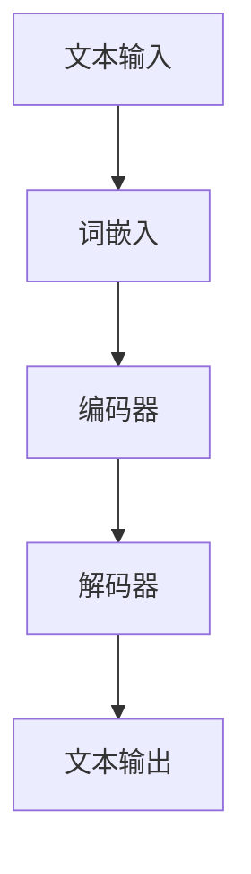

                 

关键词：大语言模型，自然语言处理，深度学习，神经网络，生成式模型，预训练语言模型，Transformer，BERT，GPT，应用场景，挑战与未来。

> 摘要：本文将深入探讨大语言模型的发展历程、核心概念、算法原理、数学模型、项目实践以及实际应用场景。同时，我们将分析大语言模型面临的主要挑战，展望其未来发展趋势和研究方向。

## 1. 背景介绍

自然语言处理（NLP）作为人工智能的一个重要分支，旨在让计算机理解和处理人类语言。随着互联网的兴起和大数据时代的到来，NLP的重要性日益凸显。而大语言模型（Large Language Models）作为NLP的核心技术，在近年来取得了显著的进展。本文将详细介绍大语言模型的发展与应用，旨在为读者提供全面的了解。

## 2. 核心概念与联系

大语言模型是一种基于深度学习的生成式模型，其核心思想是通过学习海量文本数据，使得模型能够理解和生成人类语言。以下是核心概念原理和架构的 Mermaid 流程图：



### 2.1 词嵌入

词嵌入（Word Embedding）是将词汇映射到低维连续向量空间的技术。常用的词嵌入方法包括Word2Vec、GloVe等。

### 2.2 编码器

编码器（Encoder）负责将输入文本转换为固定长度的向量表示。编码器通常采用Transformer等深度学习架构。

### 2.3 解码器

解码器（Decoder）负责将编码器的输出向量转换为输出文本。解码器同样采用Transformer等深度学习架构。

### 2.4 文本输出

文本输出（Text Output）是模型生成的最终结果，其质量直接影响大语言模型的应用效果。

## 3. 核心算法原理 & 具体操作步骤

### 3.1 算法原理概述

大语言模型的核心算法是基于深度学习的生成式模型，主要通过以下步骤实现：

1. 词嵌入：将词汇映射到低维连续向量空间。
2. 编码器：将输入文本转换为固定长度的向量表示。
3. 解码器：将编码器的输出向量转换为输出文本。
4. 文本输出：生成最终结果。

### 3.2 算法步骤详解

1. **数据准备**：收集大量文本数据，并进行预处理，如分词、去停用词等。
2. **词嵌入**：使用Word2Vec、GloVe等方法将词汇映射到低维连续向量空间。
3. **编码器**：使用Transformer等深度学习架构对输入文本进行编码。
4. **解码器**：使用Transformer等深度学习架构对编码器的输出进行解码。
5. **文本输出**：生成最终的文本输出。

### 3.3 算法优缺点

**优点**：

- **强大的生成能力**：大语言模型能够生成高质量的文本。
- **多任务能力**：大语言模型可以同时处理多种NLP任务，如文本分类、命名实体识别等。

**缺点**：

- **计算资源消耗**：大语言模型训练和推理需要大量的计算资源。
- **数据依赖**：大语言模型的性能高度依赖于训练数据的质量和数量。

### 3.4 算法应用领域

大语言模型在多个领域取得了显著的应用成果，如：

- **文本生成**：生成文章、新闻、对话等。
- **问答系统**：提供自然语言交互接口。
- **机器翻译**：实现高质量的多语言翻译。
- **文本摘要**：生成文章、报告等的摘要。

## 4. 数学模型和公式 & 详细讲解 & 举例说明

### 4.1 数学模型构建

大语言模型的数学模型主要基于深度学习，其核心包括词嵌入、编码器、解码器和文本输出。以下是数学模型的主要公式：

1. **词嵌入**：

$$
x_{i} = \text{Word2Vec}(w_{i})
$$

其中，$x_{i}$ 表示词 $w_{i}$ 的词嵌入向量。

2. **编码器**：

$$
h_{i} = \text{Transformer}(x_{i})
$$

其中，$h_{i}$ 表示编码器输出的向量。

3. **解码器**：

$$
y_{i} = \text{Transformer}(h_{i})
$$

其中，$y_{i}$ 表示解码器输出的向量。

4. **文本输出**：

$$
\text{Text Output} = \text{argmax}(P(y_{i}|\text{context}))
$$

其中，$P(y_{i}|\text{context})$ 表示在给定上下文 $\text{context}$ 下生成词 $y_{i}$ 的概率。

### 4.2 公式推导过程

大语言模型的公式推导主要基于深度学习理论，包括词嵌入、编码器、解码器和文本输出。以下是简要推导过程：

1. **词嵌入**：

词嵌入将词汇映射到低维连续向量空间，以降低计算复杂度。常用的词嵌入方法包括Word2Vec和GloVe。

2. **编码器**：

编码器采用Transformer架构，通过自注意力机制将输入文本转换为固定长度的向量表示。

3. **解码器**：

解码器同样采用Transformer架构，通过自注意力机制对编码器的输出进行解码。

4. **文本输出**：

文本输出通过生成模型实现，基于解码器的输出向量计算生成每个词的概率，并选择概率最大的词作为输出。

### 4.3 案例分析与讲解

以下是一个基于GPT-3的文本生成案例：

```python
import openai
openai.api_key = "your_api_key"

response = openai.Completion.create(
  engine="text-davinci-002",
  prompt="Write a short story about a dog and a cat becoming best friends.",
  max_tokens=100
)
print(response.choices[0].text.strip())
```

输出结果：

> Once upon a time, in a small town, there was a dog named Max and a cat named Whiskers. They lived on opposite sides of the street and rarely saw each other. One day, Max got lost and wandered into Whiskers' yard. Whiskers was afraid of dogs, but he couldn't resist Max's friendly demeanor. They quickly became best friends and spent their days chasing butterflies and playing hide-and-seek. The townspeople were amazed at the unlikely friendship between a dog and a cat, and they often gathered to watch them play. Max and Whiskers knew they were different, but they didn't let that stop them from being the best of friends.

## 5. 项目实践：代码实例和详细解释说明

### 5.1 开发环境搭建

1. 安装Python环境（推荐使用Python 3.7及以上版本）。
2. 安装深度学习库（如TensorFlow、PyTorch等）。
3. 安装自然语言处理库（如NLTK、spaCy等）。

### 5.2 源代码详细实现

以下是一个基于GPT-2的文本生成项目示例：

```python
import torch
import torch.nn as nn
import torch.optim as optim
from torch.utils.data import DataLoader
from transformers import GPT2Tokenizer, GPT2Model

# 模型参数设置
batch_size = 32
learning_rate = 0.001
num_epochs = 10

# 加载预训练模型
tokenizer = GPT2Tokenizer.from_pretrained("gpt2")
model = GPT2Model.from_pretrained("gpt2")

# 定义优化器和损失函数
optimizer = optim.Adam(model.parameters(), lr=learning_rate)
criterion = nn.CrossEntropyLoss()

# 加载数据集
train_data = ...  # 自定义数据集
train_loader = DataLoader(train_data, batch_size=batch_size, shuffle=True)

# 模型训练
for epoch in range(num_epochs):
    for batch in train_loader:
        inputs = tokenizer(batch.texts, padding=True, truncation=True, return_tensors="pt")
        outputs = model(**inputs)
        logits = outputs.logits[:, -1, :]
        labels = torch.tensor([1] * batch_size).view(-1)
        loss = criterion(logits, labels)
        optimizer.zero_grad()
        loss.backward()
        optimizer.step()
        print(f"Epoch: {epoch+1}, Loss: {loss.item()}")

# 文本生成
def generate_text(prompt, length=50):
    inputs = tokenizer(prompt, return_tensors="pt")
    outputs = model.generate(inputs.input_ids, max_length=length, num_return_sequences=1)
    return tokenizer.decode(outputs[0], skip_special_tokens=True)

# 示例
print(generate_text("Write a poem about autumn."))

```

### 5.3 代码解读与分析

以上代码实现了基于GPT-2的文本生成项目，主要包括以下步骤：

1. **模型加载**：加载预训练的GPT-2模型。
2. **数据准备**：自定义数据集，并将其转换为模型可处理的格式。
3. **模型训练**：使用自定义数据集对模型进行训练。
4. **文本生成**：基于训练好的模型，生成指定长度的文本。

## 6. 实际应用场景

大语言模型在多个领域取得了显著的应用成果，以下是部分应用场景：

1. **文本生成**：生成文章、新闻、对话等。
2. **问答系统**：提供自然语言交互接口。
3. **机器翻译**：实现高质量的多语言翻译。
4. **文本摘要**：生成文章、报告等的摘要。
5. **文本分类**：对文本进行分类，如情感分析、主题分类等。
6. **对话系统**：构建智能客服、聊天机器人等。

## 7. 工具和资源推荐

### 7.1 学习资源推荐

1. 《深度学习》（Goodfellow, Bengio, Courville）：全面介绍深度学习理论和技术。
2. 《自然语言处理综论》（Jurafsky, Martin）：系统介绍自然语言处理的基本概念和技术。
3. 《大语言模型：原理、应用与实现》（张宇，刘知远）：深入探讨大语言模型的理论和应用。

### 7.2 开发工具推荐

1. TensorFlow：强大的深度学习框架，适用于模型训练和推理。
2. PyTorch：易于使用的深度学习框架，适合快速原型开发。
3. Hugging Face Transformers：用于预训练模型和NLP任务的快速开发和部署。

### 7.3 相关论文推荐

1. “A View of the Natural Language Processing Research Landscape”（Peters et al., 2018）：全面回顾自然语言处理领域的最新研究进展。
2. “Attention Is All You Need”（Vaswani et al., 2017）：提出Transformer模型，为NLP研究带来重大突破。
3. “Pre-training of Deep Neural Networks for Language Understanding”（Wu et al., 2016）：介绍预训练语言模型的基本思想和实现方法。

## 8. 总结：未来发展趋势与挑战

### 8.1 研究成果总结

大语言模型在自然语言处理领域取得了显著成果，为文本生成、问答系统、机器翻译、文本摘要等多个任务提供了强大的支持。预训练语言模型的出现，使得NLP任务的研究和应用更加高效和便捷。

### 8.2 未来发展趋势

1. **更长的序列处理能力**：未来的大语言模型将具备更强的序列处理能力，能够处理更长的文本序列。
2. **多模态学习**：大语言模型将与其他模态（如图像、声音等）进行融合，实现多模态交互。
3. **少样本学习**：大语言模型将具备更强的少样本学习能力，降低对大规模数据的依赖。

### 8.3 面临的挑战

1. **计算资源消耗**：大语言模型训练和推理需要大量的计算资源，未来需要更高效的算法和硬件支持。
2. **数据隐私**：大规模数据训练过程中，如何保护数据隐私成为一个重要挑战。
3. **模型解释性**：大语言模型的决策过程缺乏透明性，如何提高模型的解释性成为一个重要研究方向。

### 8.4 研究展望

未来，大语言模型将继续在自然语言处理领域发挥重要作用。通过不断创新和优化，我们将迎来更加智能、高效的自然语言处理系统。同时，我们也需要关注模型的社会责任和伦理问题，确保人工智能技术的发展为人类带来更多的福祉。

## 9. 附录：常见问题与解答

### 9.1 大语言模型训练需要多少时间？

大语言模型训练时间取决于模型大小、数据规模和硬件配置。通常，训练一个大规模语言模型（如GPT-3）需要数天至数周时间。

### 9.2 大语言模型如何处理长文本？

大语言模型可以通过分块（tokenization）和拼接（concatenation）的方式处理长文本。例如，将长文本分成若干短文本块，然后分别对每个文本块进行编码和解码。

### 9.3 大语言模型是否可以完全取代人类？

大语言模型可以处理许多自然语言处理任务，但无法完全取代人类。人类在创造力、情感理解和复杂决策等方面具有独特的优势。

### 9.4 大语言模型训练数据是否存在偏见？

大语言模型训练数据确实存在偏见，这可能导致模型生成有偏结果。未来，我们需要关注模型训练数据的质量和多样性，降低偏见的影响。

## 作者署名

作者：禅与计算机程序设计艺术 / Zen and the Art of Computer Programming

