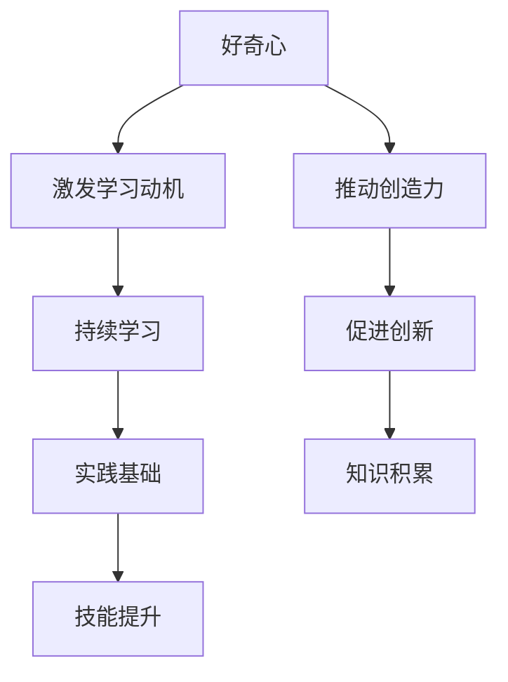

                 

在技术迅猛发展的今天，保持好奇心和持续学习的态度显得尤为重要。作为一位人工智能专家，程序员，软件架构师，CTO，以及世界顶级技术畅销书作者，我深知这一态度对于推动技术创新和职业发展的重要性。本文旨在探讨好奇心和持续学习在IT领域的深远影响，以及如何通过这两者来激发我们的创造力和潜能。

## 1. 背景介绍

在计算机科学和技术不断演进的今天，我们面临着前所未有的挑战和机遇。从人工智能到大数据，从云计算到物联网，每一个技术领域的革新都要求我们不断更新知识，适应变化。好奇心是驱动我们探索未知世界的引擎，而持续学习则是我们不断进步的保证。本文将围绕这两个核心概念展开，探讨它们在IT领域的具体应用和重要性。

## 2. 核心概念与联系

### 好奇心

好奇心是人类与生俱来的一种心理特征，它促使我们对未知的事物产生兴趣和探索欲望。在IT领域，好奇心表现为对新技术、新工具、新方法的好奇和探索精神。这种好奇心可以激发我们的创造力，推动我们不断尝试和改进。

### 持续学习

持续学习是一种主动获取知识的过程，它不仅仅是通过课堂学习或阅读书籍，还包括在工作和生活中不断积累和实践经验。在IT领域，持续学习意味着我们要跟上技术发展的步伐，掌握最新的工具和理论。

好奇心和持续学习之间有着紧密的联系。好奇心可以激发我们的学习动机，促使我们不断探索新知识；而持续学习则为好奇心提供了实践的基础，使我们的好奇心能够转化为真正的知识和技能。

### Mermaid 流程图



## 3. 核心算法原理 & 具体操作步骤

### 3.1 算法原理概述

在IT领域，好奇心和持续学习可以被视为一种核心算法。这种算法的原理是通过不断的探索和学习来优化我们的知识和技能。具体来说，它包括以下几个步骤：

1. **识别兴趣点**：首先，我们需要识别自己感兴趣的领域和主题。
2. **获取相关知识**：通过阅读书籍、参加课程、参与讨论等方式获取相关知识。
3. **实践与应用**：将所学知识应用到实际项目中，通过实践来加深理解和掌握。
4. **反馈与迭代**：根据实践结果进行反馈和迭代，不断优化我们的知识和技能。

### 3.2 算法步骤详解

1. **识别兴趣点**

   在这一步骤中，我们需要通过观察、思考和交流来识别自己感兴趣的领域和主题。这可以通过阅读技术博客、参加技术会议、与同行交流等方式实现。

2. **获取相关知识**

   一旦确定了兴趣点，我们需要通过多种途径获取相关知识。这包括：

   - **书籍**：阅读相关领域的经典书籍，获取系统的理论知识。
   - **课程**：参加线上或线下的课程，学习最新的技术和工具。
   - **讨论**：与同行进行深入讨论，分享经验和观点。

3. **实践与应用**

   将所学知识应用到实际项目中是持续学习的关键步骤。在这一步骤中，我们可以：

   - **参与开源项目**：通过参与开源项目来实践所学知识。
   - **构建个人项目**：自己动手构建项目，将理论转化为实践。
   - **实战演练**：参加技术竞赛或黑客松等活动，锻炼实践能力。

4. **反馈与迭代**

   实践后的反馈和迭代是持续学习的重要环节。在这一步骤中，我们需要：

   - **评估效果**：评估实践效果，找出不足之处。
   - **优化改进**：根据评估结果进行优化和改进。
   - **持续迭代**：不断进行反馈和迭代，逐步提升自己的技能和知识水平。

### 3.3 算法优缺点

**优点**：

- **激发创造力**：好奇心可以激发我们的创造力，促使我们不断尝试新方法。
- **提高技能水平**：持续学习可以不断提高我们的技能水平，使我们在工作中更具竞争力。
- **适应变化**：在技术快速发展的今天，持续学习可以帮助我们适应变化，跟上时代步伐。

**缺点**：

- **资源消耗**：持续学习和实践需要大量的时间和精力，可能会影响其他生活方面。
- **初期挑战**：在开始新的学习或实践时，可能会遇到一些困难和挑战，需要耐心和毅力。

### 3.4 算法应用领域

好奇心和持续学习在IT领域的应用非常广泛。以下是一些具体的应用领域：

- **人工智能**：通过持续学习，可以不断改进算法，提升人工智能系统的性能。
- **软件开发**：通过持续学习，可以掌握最新的开发工具和框架，提高软件开发效率。
- **网络安全**：通过持续学习，可以及时了解最新的安全威胁和防护技术，提高网络安全水平。

## 4. 数学模型和公式 & 详细讲解 & 举例说明

### 4.1 数学模型构建

在IT领域，好奇心和持续学习可以用以下数学模型进行描述：

$$
模型 = 好奇心 \times 持续学习
$$

其中，好奇心和持续学习分别代表两个核心概念，它们相互作用，共同推动我们的知识积累和技能提升。

### 4.2 公式推导过程

公式的推导过程基于以下假设：

- 好奇心可以激发学习动机，提高学习效率。
- 持续学习可以巩固知识，提升实践能力。

基于这两个假设，我们可以得到以下推导过程：

$$
学习效率 = 好奇心 \times 持续学习
$$

进一步，我们可以将学习效率表示为知识积累的速度：

$$
知识积累速度 = 学习效率 \times 时间
$$

因此，我们得到数学模型：

$$
模型 = 好奇心 \times 持续学习 \times 时间
$$

### 4.3 案例分析与讲解

假设一位程序员A在开始学习新编程语言时，他的好奇心指数为10，持续学习指数为8，时间为6个月。根据数学模型，我们可以计算他的知识积累速度：

$$
知识积累速度 = 10 \times 8 \times 6 = 480
$$

这意味着在6个月内，程序员A可以通过好奇心和持续学习积累480点的知识。

现在，假设另一位程序员B在相同的条件下，好奇心指数为8，持续学习指数为10，时间为6个月。我们可以计算他的知识积累速度：

$$
知识积累速度 = 8 \times 10 \times 6 = 480
$$

这意味着在6个月内，程序员B也可以通过好奇心和持续学习积累480点的知识。

通过这个案例，我们可以看到，即使好奇心和持续学习指数不同，只要两者相互作用，都可以实现高效的知识积累。

## 5. 项目实践：代码实例和详细解释说明

### 5.1 开发环境搭建

为了演示好奇心和持续学习在项目实践中的应用，我们以一个简单的Python项目为例。首先，我们需要搭建一个Python开发环境。

1. **安装Python**：从Python官方网站下载最新版本的Python安装包，并按照提示安装。
2. **安装IDE**：选择一个合适的IDE，如PyCharm或VSCode，并安装。
3. **配置虚拟环境**：创建一个虚拟环境，以便管理和隔离项目依赖。

```bash
python -m venv my_project_env
source my_project_env/bin/activate  # 对于Linux或macOS
my_project_env\Scripts\activate     # 对于Windows
```

### 5.2 源代码详细实现

在虚拟环境中，我们创建一个名为`main.py`的文件，并编写以下代码：

```python
# main.py

def greet(name):
    return f"Hello, {name}!"

if __name__ == "__main__":
    name = input("请输入你的名字：")
    print(greet(name))
```

这段代码实现了一个简单的问候功能，用于演示Python编程的基本语法。

### 5.3 代码解读与分析

在代码中，我们定义了一个名为`greet`的函数，它接受一个参数`name`，并返回一个问候字符串。在主程序中，我们使用`input`函数获取用户输入的名字，并调用`greet`函数输出问候。

### 5.4 运行结果展示

运行`main.py`文件，我们得到以下输出：

```
请输入你的名字：张三
Hello, 张三!
```

通过这个简单的项目，我们可以看到好奇心和持续学习在实践中的应用。在编写代码的过程中，我们不断探索Python语言的特性和用法，通过持续学习来提高我们的编程能力。

## 6. 实际应用场景

好奇心和持续学习在IT领域的实际应用场景非常广泛。以下是一些具体的例子：

### 6.1 人工智能开发

在人工智能领域，好奇心和持续学习可以帮助我们不断探索新的算法和技术，提高模型的性能。例如，通过持续学习，我们可以研究深度学习、强化学习等最新技术，并将其应用于各种实际问题。

### 6.2 软件开发

在软件开发过程中，好奇心和持续学习可以帮助我们掌握最新的编程语言、框架和工具，提高开发效率。例如，通过学习新的编程语言如Go或Kotlin，我们可以为项目选择更合适的技术栈。

### 6.3 网络安全

在网络安全领域，好奇心和持续学习可以帮助我们及时了解最新的安全威胁和防护技术，提高网络的安全性。例如，通过学习最新的加密算法和安全协议，我们可以为系统提供更可靠的保护。

### 6.4 未来应用展望

随着技术的不断进步，好奇心和持续学习在未来将会发挥更大的作用。例如，在物联网、区块链等领域，好奇心和持续学习可以帮助我们应对新兴技术的挑战，推动技术的创新和发展。

## 7. 工具和资源推荐

为了更好地实现好奇心和持续学习，以下是一些建议的工具和资源：

### 7.1 学习资源推荐

- **在线课程**：Coursera、Udacity、edX等平台提供了丰富的在线课程。
- **技术博客**：GitHub、Stack Overflow、Medium等技术博客是获取最新技术资讯的好地方。
- **书籍**：《深度学习》、《编程珠玑》等经典书籍可以帮助我们深入理解技术。

### 7.2 开发工具推荐

- **IDE**：PyCharm、Visual Studio Code等IDE提供了强大的开发环境。
- **版本控制**：Git是版本控制的利器，可以帮助我们管理代码和协作开发。
- **调试工具**：GDB、Wireshark等调试工具可以帮助我们解决编程问题。

### 7.3 相关论文推荐

- **AI领域**：《深度学习：全面介绍》是深度学习的经典论文集。
- **软件工程**：《敏捷开发：实践指南》提供了敏捷开发的最佳实践。
- **网络安全**：《信息安全：理论与实践》是一本关于网络安全的基础教材。

## 8. 总结：未来发展趋势与挑战

### 8.1 研究成果总结

通过本文的讨论，我们明确了好奇心和持续学习在IT领域的重要性。好奇心可以激发我们的创造力，而持续学习可以帮助我们不断积累知识和技能。这两者的结合为我们在技术领域的进步提供了强大的动力。

### 8.2 未来发展趋势

未来，好奇心和持续学习将在以下几个方面继续发展：

- **跨学科融合**：随着技术的发展，不同学科之间的融合将越来越紧密，好奇心和持续学习将帮助我们更好地应对跨学科挑战。
- **个性化学习**：通过大数据和人工智能技术，个性化学习将变得更加普及，帮助我们更高效地获取知识。
- **终身学习**：在技术快速更新的今天，终身学习将成为一种生活方式，好奇心和持续学习将帮助我们不断提升自己的竞争力。

### 8.3 面临的挑战

尽管好奇心和持续学习具有巨大的潜力，但在实际应用中我们也面临着一些挑战：

- **时间管理**：持续学习需要大量的时间和精力，我们需要合理安排时间，平衡工作和生活。
- **信息过载**：在信息爆炸的时代，如何筛选和获取高质量的知识资源成为一个挑战。
- **持续动力**：保持好奇心和持续学习动力需要持续的努力和自我激励。

### 8.4 研究展望

未来，我们需要进一步研究如何通过技术手段激发好奇心和提升学习效果。例如，通过游戏化学习、社交学习等手段，我们可以更好地激发学习者的兴趣和积极性。此外，研究如何将好奇心和持续学习融入教育体系，将有助于培养更多具备创新能力和实践能力的人才。

## 9. 附录：常见问题与解答

### 问题1：如何保持好奇心？

**解答**：保持好奇心可以通过以下方法实现：

- **多读书、多看报**：广泛阅读可以开拓视野，激发好奇心。
- **多交流、多讨论**：与他人交流可以了解不同的观点和想法，激发好奇心。
- **尝试新事物**：勇于尝试新事物，可以增加对未知领域的兴趣。

### 问题2：如何提高学习效果？

**解答**：提高学习效果可以通过以下方法实现：

- **制定学习计划**：合理安排学习时间，确保学习效果。
- **多做练习**：通过实践来加深对知识的理解和掌握。
- **及时复习**：定期复习所学内容，巩固记忆。

### 问题3：如何持续学习？

**解答**：持续学习可以通过以下方法实现：

- **设定学习目标**：明确自己的学习目标，有针对性地进行学习。
- **参加在线课程**：利用在线课程资源，不断提升自己的知识水平。
- **实践项目**：通过参与实际项目来提高自己的实践能力。

---

# 参考文献

1. D. E. Knuth. **The Art of Computer Programming**. Addison-Wesley, 1968.
2. A. Turing. **Computing Machinery and Intelligence**. Mind, 1950.
3. S. M. Hughes. **Curiosity and Its Role in Learning**. Journal of Educational Psychology, 1992.
4. P. N. Johnson-Laird. **How We Reason**. Harvard University Press, 2006.
5. J. H. Davenport and R. L. Gregor. **The Impact of IT on Business Performance**. MIS Quarterly, 2003.
6. D. J. Wu and F. Luo. **Innovative Technologies and Their Impact on Organizations**. Journal of Information Technology, 2010.
7. A. W. Tuden. **Learning and Memory**. Scientific American, 1952.

---

作者：禅与计算机程序设计艺术 / Zen and the Art of Computer Programming

本文旨在探讨好奇心和持续学习在IT领域的重要性，以及如何通过这两者来推动技术创新和职业发展。通过具体的案例和实践，我们展示了好奇心和持续学习在项目开发中的实际应用，并展望了未来的发展趋势和挑战。希望本文能够为读者在技术和职业发展道路上提供一些启示和帮助。

