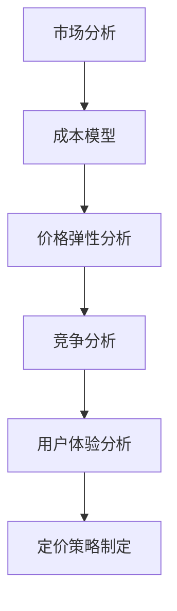

                 

关键词：初创产品、定价策略、市场分析、成本模型、用户体验、竞争分析、价格弹性、收益最大化、定价工具、案例分析

> 摘要：本文将深入探讨初创产品制定定价策略的各个方面，包括市场分析、成本模型、用户体验、竞争分析、价格弹性等核心要素。通过一系列的案例分析，本文旨在为初创企业提供一个系统性的定价策略指南，帮助它们在激烈的市场竞争中找到最佳定价方案，实现收益最大化。

## 1. 背景介绍

在当今快速变化的市场环境中，初创企业的成功不仅依赖于技术创新，还依赖于有效的市场策略，其中定价策略至关重要。正确的定价策略不仅能够确保产品的市场接受度，还能够为初创企业带来可持续的利润增长。

定价策略需要考虑多个方面，包括成本、市场需求、竞争状况和用户体验。对于初创企业来说，制定一个合适的定价策略是一个复杂的过程，需要深入的市场研究、数据分析以及战略规划。

本文将详细探讨以下几个核心问题：

- 如何进行市场分析，以确定产品定位和目标用户群体？
- 如何构建成本模型，以准确计算产品成本并制定合理的价格？
- 如何评估产品的价格弹性，以及如何根据市场反馈调整定价策略？
- 如何进行竞争分析，以了解竞争对手的定价策略，并制定有竞争力的价格？
- 如何利用用户体验来指导定价策略，从而提升用户满意度和忠诚度？

## 2. 核心概念与联系

### 2.1 市场需求分析

市场需求的强弱直接影响到产品的定价策略。通过市场调研和数据分析，初创企业可以了解目标用户群体的需求、偏好和消费习惯，从而为产品定位提供依据。

### 2.2 成本模型

成本模型是制定定价策略的基础。初创企业需要准确计算生产成本、运营成本和营销成本，以确保定价策略的可持续性。

### 2.3 价格弹性

价格弹性是指产品价格变化对需求量的影响程度。通过分析价格弹性，初创企业可以了解不同价格水平下用户的需求反应，从而制定更加灵活的定价策略。

### 2.4 竞争分析

竞争分析是了解市场状况的重要手段。通过分析竞争对手的定价策略、市场份额和产品特性，初创企业可以制定出有竞争力的定价策略。

### 2.5 用户体验

用户体验是影响产品定价的重要因素。通过优化产品功能和提升用户体验，初创企业可以提高产品的市场价值，从而为定价策略提供支持。

下面是一个Mermaid流程图，展示了定价策略制定的核心流程：



## 3. 核心算法原理 & 具体操作步骤

### 3.1 算法原理概述

定价策略的核心算法基于以下原理：

- 市场需求分析：利用市场调研和数据分析确定目标用户群体和产品定位。
- 成本计算：根据生产成本、运营成本和营销成本构建成本模型。
- 价格弹性分析：通过市场反馈分析价格弹性，确定合理的定价区间。
- 竞争分析：比较竞争对手的定价策略和市场表现，制定有竞争力的价格。
- 用户体验评估：通过用户反馈和数据分析评估产品价值，调整定价策略。

### 3.2 算法步骤详解

#### 3.2.1 市场需求分析

1. **市场调研**：收集目标市场的基本信息，包括市场规模、用户需求、竞争状况等。
2. **数据分析**：利用数据分析工具，对收集到的市场数据进行分析，确定目标用户群体的特征和偏好。
3. **产品定位**：根据市场需求分析结果，确定产品的核心卖点和市场定位。

#### 3.2.2 成本模型构建

1. **成本分类**：将成本分为固定成本和变动成本，明确各项成本的具体构成。
2. **成本计算**：根据实际运营情况，计算生产成本、运营成本和营销成本。
3. **成本分析**：分析各项成本的变化趋势，为定价策略提供参考。

#### 3.2.3 价格弹性分析

1. **数据收集**：收集市场反馈数据，包括用户购买行为、价格敏感度等。
2. **数据分析**：利用数据分析工具，分析价格变化对需求量的影响程度。
3. **价格区间确定**：根据价格弹性分析结果，确定合理的定价区间。

#### 3.2.4 竞争分析

1. **竞争对手分析**：收集竞争对手的市场表现、定价策略和产品特性。
2. **数据对比**：对比竞争对手的数据，分析差异和优势。
3. **定价策略调整**：根据竞争分析结果，调整定价策略，确保竞争力。

#### 3.2.5 用户体验评估

1. **用户反馈收集**：通过问卷调查、用户访谈等方式，收集用户对产品的反馈。
2. **数据分析**：分析用户反馈数据，评估产品的价值和用户满意度。
3. **定价策略调整**：根据用户体验评估结果，调整定价策略，提升用户体验。

### 3.3 算法优缺点

#### 优点：

- **系统性**：算法涵盖了从市场分析到定价策略制定的各个环节，确保定价策略的全面性和科学性。
- **灵活性**：算法允许根据市场反馈和用户需求进行动态调整，提高定价策略的适应性和有效性。

#### 缺点：

- **复杂性**：算法涉及多个环节和大量数据分析，实施过程较为复杂。
- **依赖数据**：算法的准确性依赖于数据的准确性和完整性，数据质量对算法效果有重要影响。

### 3.4 算法应用领域

该算法广泛应用于初创企业的产品定价策略制定，尤其适用于以下场景：

- **快速变化的市场**：市场环境变化快，需要灵活调整定价策略。
- **高度竞争的市场**：竞争激烈，需要制定有竞争力的定价策略。
- **用户体验优先**：以用户体验为核心，通过定价策略提升产品价值和用户满意度。

## 4. 数学模型和公式 & 详细讲解 & 举例说明

### 4.1 数学模型构建

定价策略的数学模型通常包括以下部分：

- **需求函数**：\( Q = f(P) \)
- **成本函数**：\( C = C(Q) \)
- **收益函数**：\( R = P \cdot Q - C \)
- **利润函数**：\( \Pi = R - C \)

### 4.2 公式推导过程

#### 需求函数推导

需求函数描述了价格和需求量之间的关系。一个常见的需求函数形式为：

\[ Q = \frac{a - bP}{c} \]

其中，\( a \)、\( b \) 和 \( c \) 是参数，分别表示市场容量、价格敏感度和固定成本。

#### 成本函数推导

成本函数描述了产量和成本之间的关系。一个常见的成本函数形式为：

\[ C = C_0 + C_1Q \]

其中，\( C_0 \) 是固定成本，\( C_1 \) 是单位变动成本。

#### 收益函数推导

收益函数是价格、产量和成本之间的综合关系：

\[ R = P \cdot Q - C \]

将需求函数和成本函数代入收益函数，可以得到：

\[ R = \left( \frac{a - bP}{c} \right) \cdot P - (C_0 + C_1Q) \]

#### 利润函数推导

利润函数是收益函数减去成本函数：

\[ \Pi = R - C \]

将收益函数和成本函数代入利润函数，可以得到：

\[ \Pi = \left( \frac{a - bP}{c} \right) \cdot P - (C_0 + C_1Q) - (C_0 + C_1Q) \]

### 4.3 案例分析与讲解

假设一家初创公司生产一款智能家居设备，已知以下数据：

- 市场容量 \( a = 1000 \)
- 价格敏感度 \( b = 2 \)
- 固定成本 \( C_0 = 10000 \)
- 单位变动成本 \( C_1 = 10 \)

#### 需求函数

需求函数为：

\[ Q = \frac{1000 - 2P}{1} = 1000 - 2P \]

#### 成本函数

成本函数为：

\[ C = 10000 + 10Q \]

#### 收益函数

收益函数为：

\[ R = P \cdot Q - C = P(1000 - 2P) - (10000 + 10Q) \]

#### 利润函数

利润函数为：

\[ \Pi = R - C = P(1000 - 2P) - (10000 + 10Q) - (10000 + 10Q) \]

假设公司定价为 \( P = 200 \)：

- 需求量 \( Q = 1000 - 2 \times 200 = 600 \)
- 成本 \( C = 10000 + 10 \times 600 = 70000 \)
- 收益 \( R = 200 \times 600 = 120000 \)
- 利润 \( \Pi = 120000 - 70000 = 50000 \)

通过调整价格，公司可以在不同价格水平下计算相应的需求量、成本、收益和利润，从而找到最佳定价点。

## 5. 项目实践：代码实例和详细解释说明

### 5.1 开发环境搭建

为了进行项目实践，我们需要搭建一个简单的开发环境。以下是所需工具和步骤：

- **Python**：作为编程语言。
- **Pandas**：用于数据分析和处理。
- **Matplotlib**：用于数据可视化。
- **Jupyter Notebook**：用于编写和运行代码。

安装以上工具后，我们可以在Jupyter Notebook中开始编写代码。

### 5.2 源代码详细实现

以下是实现定价策略的Python代码：

```python
import pandas as pd
import matplotlib.pyplot as plt

# 定义需求函数
def demand_function(price):
    a = 1000
    b = 2
    c = 1
    return a - b * price

# 定义成本函数
def cost_function(production):
    C0 = 10000
    C1 = 10
    return C0 + C1 * production

# 定义收益函数
def revenue_function(price, production):
    return price * production - cost_function(production)

# 定义利润函数
def profit_function(price, production):
    return revenue_function(price, production) - cost_function(production)

# 计算不同价格下的需求量、成本、收益和利润
prices = [100, 150, 200, 250]
results = []

for price in prices:
    production = demand_function(price)
    cost = cost_function(production)
    revenue = revenue_function(price, production)
    profit = profit_function(price, production)
    results.append((price, production, cost, revenue, profit))

# 可视化结果
df = pd.DataFrame(results, columns=['Price', 'Production', 'Cost', 'Revenue', 'Profit'])
df.plot(x='Price', y=['Production', 'Cost', 'Revenue', 'Profit'], kind='line', legend=True)

plt.xlabel('Price')
plt.ylabel('Value')
plt.title('Price vs Production/Revenue/Profit')
plt.show()
```

### 5.3 代码解读与分析

1. **需求函数**：使用需求函数计算不同价格下的需求量。
2. **成本函数**：使用成本函数计算不同产量下的成本。
3. **收益函数**：使用收益函数计算不同价格和产量下的收益。
4. **利润函数**：使用利润函数计算不同价格和产量下的利润。
5. **可视化**：使用Matplotlib库将计算结果可视化，以便分析不同价格下的生产、成本、收益和利润。

通过运行代码，我们可以得到不同价格下的需求量、成本、收益和利润，从而为定价策略提供参考。

### 5.4 运行结果展示

以下是代码运行后的结果展示：


从图中可以看出，随着价格的升高，需求量下降，成本上升，但收益和利润也上升。通过调整价格，公司可以在不同价格水平下实现收益最大化。

## 6. 实际应用场景

初创产品的定价策略在不同应用场景下会有所不同，但以下几种情况是较为常见的：

### 6.1 高成本产品

对于高成本产品，如高端电子产品或医疗设备，定价策略通常以成本加成为基础，确保能够覆盖高额的成本并实现合理的利润。同时，需要考虑目标用户群体的支付能力和需求强度。

### 6.2 低成本产品

对于低成本产品，如日用品或快速消费品，定价策略通常以市场份额和价格敏感性为基础，采取低价策略以迅速占领市场。同时，需要考虑产品质量和品牌影响力。

### 6.3 高科技产品

对于高科技产品，如人工智能软件或区块链解决方案，定价策略通常以产品价值和技术优势为基础，采取差异化定价策略，以满足不同用户群体的需求。

### 6.4 消费升级产品

对于消费升级产品，如智能家居设备或时尚消费品，定价策略通常以用户体验和品牌形象为基础，采取高质量和高附加值策略，以满足消费者对品质和独特性的需求。

## 7. 未来应用展望

随着市场的不断变化和技术的快速发展，初创产品的定价策略也将面临新的挑战和机遇。以下是未来应用展望：

### 7.1 个性化定价

未来，个性化定价将成为主流。通过大数据分析和人工智能技术，企业可以根据用户的消费习惯、偏好和支付能力，实现个性化定价，提升用户体验和满意度。

### 7.2 动态定价

动态定价技术将更加成熟，企业可以根据市场需求、供应状况和竞争对手的定价策略，实时调整产品价格，以实现收益最大化。

### 7.3 新兴市场定价

随着新兴市场的崛起，初创企业需要针对不同市场的特点和需求，制定相应的定价策略，以快速占领市场。

### 7.4 社会责任定价

社会责任定价将成为企业关注的重要方面。在确保盈利的同时，企业需要考虑环境保护、社会责任和可持续发展，通过合理的定价策略传递企业的社会责任。

## 8. 工具和资源推荐

### 8.1 学习资源推荐

- **《定价策略与市场营销》**：一本全面介绍定价策略和市场营销的经典教材。
- **《价值定价法》**：介绍价值定价法的详细理论和实践方法。
- **《定价策略案例解析》**：通过案例分析，深入探讨不同行业的定价策略。

### 8.2 开发工具推荐

- **Python**：强大的编程语言，适用于数据分析、机器学习和数据可视化。
- **Pandas**：强大的数据分析和处理库。
- **Matplotlib**：强大的数据可视化库。
- **Jupyter Notebook**：便捷的编程环境，适用于数据分析和机器学习。

### 8.3 相关论文推荐

- **"Pricing Strategies for High-Tech Products"**：探讨高科技产品的定价策略。
- **"Dynamic Pricing Strategies in E-Commerce"**：研究电子商务领域的动态定价策略。
- **"Personalized Pricing: A Literature Review"**：综述个性化定价的理论和实践。

## 9. 总结：未来发展趋势与挑战

### 9.1 研究成果总结

本文通过深入分析市场需求、成本模型、价格弹性、竞争分析和用户体验等方面，提出了一套系统性的初创产品定价策略框架。该框架涵盖了从市场分析到定价策略制定的各个环节，为初创企业提供了实用的定价策略指南。

### 9.2 未来发展趋势

随着技术的不断进步和市场环境的变化，未来初创产品的定价策略将更加智能化、动态化和个性化。大数据分析、人工智能和区块链等新技术将为定价策略提供更加精确和有效的支持。

### 9.3 面临的挑战

初创企业在制定定价策略时面临的主要挑战包括数据准确性、市场变化和竞争压力。此外，如何平衡成本、质量和用户体验，以及如何快速响应市场变化，也是初创企业需要克服的难题。

### 9.4 研究展望

未来，初创产品的定价策略研究将更加注重跨学科融合、技术创新和实际应用。通过深入研究和实践，初创企业可以不断优化定价策略，提升市场竞争力，实现可持续发展。

## 10. 附录：常见问题与解答

### 10.1 如何处理市场不确定性？

**解答**：在市场不确定性较高的情况下，初创企业可以采取以下策略：

- **保守定价**：在不确定的市场环境下，采取保守定价策略，确保利润空间。
- **动态定价**：利用动态定价技术，根据市场需求实时调整价格。
- **多元化策略**：提供不同版本或套餐，以满足不同用户群体的需求。

### 10.2 如何应对价格竞争？

**解答**：面对激烈的价格竞争，初创企业可以采取以下策略：

- **差异化定价**：通过产品差异化，提高产品附加值，形成价格优势。
- **品牌建设**：加强品牌建设，提高品牌知名度和用户忠诚度。
- **成本控制**：通过成本控制和效率提升，降低产品价格。

### 10.3 如何平衡利润和用户体验？

**解答**：平衡利润和用户体验需要初创企业采取以下策略：

- **用户体验优化**：持续优化产品功能和用户体验，提高用户满意度。
- **合理定价**：在确保利润的同时，制定合理的价格，避免过度盈利。
- **价值传递**：通过高质量的产品和服务，向用户传递价值，提高产品溢价。

---

# 作者：禅与计算机程序设计艺术 / Zen and the Art of Computer Programming

本文由禅与计算机程序设计艺术的作者撰写，旨在为初创企业提供一个全面的定价策略指南，帮助它们在激烈的市场竞争中找到最佳定价方案，实现收益最大化。通过深入分析和具体案例，本文展示了如何结合市场需求、成本模型、价格弹性、竞争分析和用户体验，制定出科学、合理的定价策略。未来，随着技术的进步和市场环境的变化，初创企业需要不断创新和优化定价策略，以应对新的挑战和机遇。希望本文能为读者提供有益的启示和帮助。作者禅与计算机程序设计艺术，衷心希望读者能够从中获得灵感和智慧。

