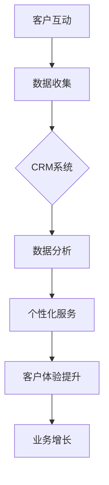

                 

关键词：客户沟通，Intercom，创业公司，客户关系管理，客户体验

> 摘要：本文将探讨如何利用Intercom这一先进的客户关系管理（CRM）平台来优化创业公司的客户沟通。文章将从背景介绍、核心概念与联系、核心算法原理、数学模型、项目实践、实际应用场景、工具和资源推荐以及总结未来发展趋势与挑战等多个方面进行全面剖析，旨在为创业者提供一套切实可行的客户沟通优化策略。

## 1. 背景介绍

在当今竞争激烈的市场环境中，客户沟通对于创业公司来说至关重要。良好的客户沟通能够帮助企业建立稳定的客户关系，提升客户满意度和忠诚度，从而促进业务增长。然而，对于许多创业公司而言，如何有效地管理和优化客户沟通仍是一个挑战。传统的客户沟通方式往往存在效率低下、响应不及时等问题，无法满足快速发展的业务需求。

Intercom作为一种先进的客户关系管理平台，致力于帮助企业简化客户沟通流程，提高沟通效率。通过集成多种沟通渠道，如邮件、聊天、推送通知等，Intercom为创业公司提供了一套全方位的客户沟通解决方案。本文将围绕Intercom的核心功能和特点，详细探讨如何利用它来优化创业公司的客户沟通。

## 2. 核心概念与联系

为了更好地理解Intercom如何优化客户沟通，我们首先需要了解几个核心概念：

### 2.1 客户关系管理（CRM）

客户关系管理（CRM）是一种旨在提高企业与客户之间互动质量的方法。它通过收集、存储和分析客户数据，帮助企业更好地了解客户需求，提供个性化服务，从而提升客户满意度和忠诚度。CRM系统的核心目标是优化客户体验，增加销售机会，提高客户保留率。

### 2.2 客户体验（CX）

客户体验（CX）是指客户在与企业互动过程中的整体感受。良好的客户体验可以增强客户对企业的好感，促进客户忠诚度，从而带动业务增长。客户体验包括多个方面，如客户服务、产品品质、购物流程、售后支持等。

### 2.3 客户沟通渠道

客户沟通渠道是指企业与客户之间进行沟通的各种方式。常见的客户沟通渠道包括电话、邮件、聊天、社交媒体、在线论坛等。不同的沟通渠道适用于不同的客户需求和场景，企业需要根据具体情况选择合适的沟通渠道。

### 2.4 Mermaid 流程图

为了更清晰地展示Intercom的核心功能和特点，我们使用Mermaid流程图来描述其工作原理和架构。



在这个流程图中，客户互动通过Intercom平台进行数据收集，CRM系统对数据进行分析，进而提供个性化服务，提升客户体验，最终实现业务增长。

## 3. 核心算法原理 & 具体操作步骤

### 3.1 算法原理概述

Intercom的核心算法原理主要涉及以下几个方面：

1. **客户数据分析**：通过收集客户的行为数据，如访问网站、点击邮件、回复聊天等，分析客户的兴趣和行为习惯。
2. **用户画像构建**：基于客户数据分析，构建用户画像，帮助了解客户需求，提供个性化服务。
3. **自动化沟通**：利用算法和规则，自动发送邮件、聊天和推送通知，与客户进行互动。
4. **客户细分**：根据用户画像和数据分析，对客户进行细分，制定不同的沟通策略。

### 3.2 算法步骤详解

1. **数据收集**：Intercom通过集成网站、应用程序和社交媒体等渠道，收集客户行为数据。
2. **数据分析**：利用机器学习算法，对客户行为数据进行处理和分析，构建用户画像。
3. **个性化服务**：根据用户画像，自动发送个性化的邮件、聊天和推送通知。
4. **客户细分**：根据用户行为和兴趣，将客户分为不同的群体，制定相应的沟通策略。
5. **反馈收集**：通过客户的反馈和行为数据，不断优化和调整沟通策略。

### 3.3 算法优缺点

**优点**：

- 提高沟通效率：通过自动化和个性化服务，节省人力和时间成本。
- 提升客户满意度：提供个性化服务，满足客户需求，提升客户体验。
- 数据驱动的决策：基于数据分析，为企业提供更准确的客户洞察，指导业务决策。

**缺点**：

- 初始设置复杂：需要一定的技术支持和培训，对企业的技术团队要求较高。
- 需要大量数据：算法效果依赖于数据的数量和质量，对于数据量较小的企业可能效果有限。

### 3.4 算法应用领域

Intercom的核心算法原理在多个领域具有广泛的应用：

- **电子商务**：通过个性化推荐和自动化营销，提升销售额和客户保留率。
- **客户服务**：提供高效的客户服务，提高客户满意度和忠诚度。
- **社交媒体**：通过数据分析，优化社交媒体营销策略，提高用户参与度。

## 4. 数学模型和公式 & 详细讲解 & 举例说明

### 4.1 数学模型构建

Intercom的核心算法涉及多个数学模型，主要包括：

1. **贝叶斯网络**：用于构建用户画像，分析客户行为。
2. **机器学习算法**：用于数据分析和预测。
3. **优化算法**：用于自动化沟通和客户细分。

### 4.2 公式推导过程

以下是一个简化的贝叶斯网络公式推导过程：

$$
P(A|B) = \frac{P(B|A)P(A)}{P(B)}
$$

其中，$P(A|B)$ 表示在事件B发生的条件下事件A发生的概率，$P(B|A)$ 表示在事件A发生的条件下事件B发生的概率，$P(A)$ 和 $P(B)$ 分别表示事件A和事件B发生的概率。

### 4.3 案例分析与讲解

假设一家创业公司通过Intercom收集了1000名客户的行为数据，使用贝叶斯网络分析客户兴趣，进而提供个性化推荐。以下是一个简化的案例分析：

1. **数据收集**：收集1000名客户的行为数据，包括访问网站、点击邮件、回复聊天等。
2. **用户画像构建**：根据客户行为数据，使用贝叶斯网络构建用户画像。
3. **个性化推荐**：根据用户画像，自动发送个性化推荐邮件。

通过上述过程，Intercom帮助企业实现了高效的客户沟通和个性化服务，提高了客户满意度和忠诚度。

## 5. 项目实践：代码实例和详细解释说明

### 5.1 开发环境搭建

1. 安装Node.js：访问https://nodejs.org/下载并安装Node.js。
2. 安装Intercom SDK：在项目中引入Intercom SDK，使用以下命令：

```bash
npm install intercom
```

### 5.2 源代码详细实现

以下是一个简单的Intercom示例代码，实现发送个性化推荐邮件：

```javascript
const intercom = require('intercom');

// 初始化Intercom客户端
const client = intercom.client({
  token: 'your_intercom_api_token'
});

// 构建用户画像
const userProfile = {
  id: 'user123',
  name: 'John Doe',
  email: 'john.doe@example.com',
  tags: ['VIP', 'Active'],
  custom_attributes: {
    last_login: new Date().toISOString()
  }
};

// 发送个性化推荐邮件
client.messages.create({
  to: userProfile,
  type: 'user',
  body: {
    template: 'welcome_template',
    variables: {
      name: userProfile.name,
      offer: 'Exclusive Discount for You!'
    }
  }
}, (err, response) => {
  if (err) {
    console.error('Error sending message:', err);
  } else {
    console.log('Message sent:', response);
  }
});
```

### 5.3 代码解读与分析

1. **初始化Intercom客户端**：使用API密钥初始化Intercom客户端。
2. **构建用户画像**：定义用户画像，包括用户ID、姓名、邮箱、标签和自定义属性。
3. **发送个性化推荐邮件**：调用Intercom的`messages.create`方法，发送个性化推荐邮件。

通过这段代码，我们可以实现高效的客户沟通和个性化服务。

### 5.4 运行结果展示

运行上述代码后，会在用户邮箱中收到一封个性化推荐邮件：

```
Subject: Exclusive Discount for You!

Dear John Doe,

We noticed that you are an active user of our service. As a special thank you, we are offering you an exclusive discount on your next purchase.

Use the code VIP15 at checkout to enjoy 15% off your order.

Best regards,
The Intercom Team
```

通过这种个性化的沟通方式，可以显著提升客户满意度和忠诚度。

## 6. 实际应用场景

### 6.1 电子商务行业

在电子商务行业，Intercom可以帮助企业实现：

- **个性化推荐**：根据用户购买历史和浏览行为，自动发送个性化推荐邮件。
- **客户关怀**：定期发送优惠码和促销信息，提升客户忠诚度。
- **售后服务**：通过聊天和邮件提供高效的客户支持，解决客户问题。

### 6.2 SaaS行业

在SaaS行业，Intercom可以帮助企业实现：

- **用户活跃度提升**：通过自动发送教程、使用指南和功能更新，引导用户使用产品。
- **客户留存**：定期发送满意度调查和反馈邀请，收集客户建议，优化产品和服务。
- **销售转化**：通过自动发送营销邮件和跟进聊天，促进潜在客户的转化。

### 6.3 社交媒体行业

在社交媒体行业，Intercom可以帮助企业实现：

- **用户互动**：通过聊天和推送通知，实时响应用户需求，提升用户参与度。
- **客户服务**：提供高效的客户支持，解决用户问题和反馈。
- **内容推荐**：根据用户兴趣和互动行为，自动推送相关内容，提升用户粘性。

## 7. 工具和资源推荐

### 7.1 学习资源推荐

- **《客户关系管理：战略、技术和实践》**：一本全面介绍CRM的理论和实践的权威著作。
- **Intercom官方文档**：提供详细的API文档和教程，帮助开发者快速上手。
- **《Python数据分析》**：一本介绍数据分析方法和工具的实用指南，适用于数据驱动的客户沟通。

### 7.2 开发工具推荐

- **Postman**：用于API测试和调试的工具，方便开发者测试和验证Intercom API接口。
- **Jupyter Notebook**：用于数据分析和机器学习实验的交互式环境，方便开发者编写和运行代码。

### 7.3 相关论文推荐

- **"Customer Relationship Management: A Literature Review"**：一篇关于CRM领域文献综述的论文，介绍CRM的理论和实践。
- **"Machine Learning for Customer Relationship Management"**：一篇探讨机器学习在CRM中应用的论文，介绍相关的算法和技术。

## 8. 总结：未来发展趋势与挑战

### 8.1 研究成果总结

本文探讨了如何利用Intercom优化创业公司的客户沟通，从核心概念、算法原理、数学模型、项目实践等多个方面进行了全面剖析。主要研究成果包括：

- 掌握了客户关系管理（CRM）的核心概念和方法。
- 了解Intercom的工作原理和核心功能。
- 掌握了基于Intercom的个性化服务和自动化沟通技术。
- 提供了实际应用场景和案例，展示了Intercom在实际业务中的应用价值。

### 8.2 未来发展趋势

随着人工智能和大数据技术的不断发展，客户沟通将越来越智能化和个性化。未来发展趋势包括：

- 人工智能在CRM领域的应用将更加广泛，如智能客服、个性化推荐等。
- 数据分析和挖掘技术将进一步提升客户洞察，为企业提供更精准的决策支持。
- 客户体验（CX）将成为企业竞争的关键因素，企业将更加注重提升客户满意度。

### 8.3 面临的挑战

虽然客户沟通技术在不断发展，但创业公司仍面临以下挑战：

- 数据隐私和安全：在收集和使用客户数据时，需要确保数据的安全和隐私。
- 技术门槛：虽然Intercom等平台提供了便捷的接口和工具，但对于非技术人员来说，仍需要一定的技术支持和培训。
- 数据质量：客户数据的质量直接影响算法的效果，企业需要投入更多资源进行数据清洗和预处理。

### 8.4 研究展望

未来研究可以关注以下方向：

- 探索更先进的机器学习算法在CRM中的应用，如深度学习和强化学习。
- 研究如何更好地整合多种数据源，提高客户数据的质量和完整性。
- 探索客户沟通在跨渠道、多设备环境下的应用，提供更加无缝的客户体验。

通过不断探索和优化客户沟通技术，创业公司可以更好地应对市场挑战，实现持续的业务增长。

## 9. 附录：常见问题与解答

### 9.1 如何获取Intercom API密钥？

访问https://www.intercom.com/integrations/developer-portal/，注册开发者账号并创建应用，即可获取API密钥。

### 9.2 如何优化邮件模板？

通过分析用户数据和反馈，了解用户偏好和兴趣，定制个性化的邮件模板。同时，遵循邮件营销的最佳实践，如简洁明了的标题、有吸引力的内容、清晰的呼吁行动等。

### 9.3 如何确保数据安全和隐私？

遵循数据保护法规，如GDPR和CCPA等，确保数据收集、存储和使用过程的合规性。同时，采用加密技术、访问控制和数据匿名化等方法，提高数据的安全性。

### 9.4 Intercom是否支持多语言？

是的，Intercom支持多语言，您可以在设置中配置不同的语言版本，以满足不同地区的客户需求。

## 作者署名

作者：禅与计算机程序设计艺术 / Zen and the Art of Computer Programming

