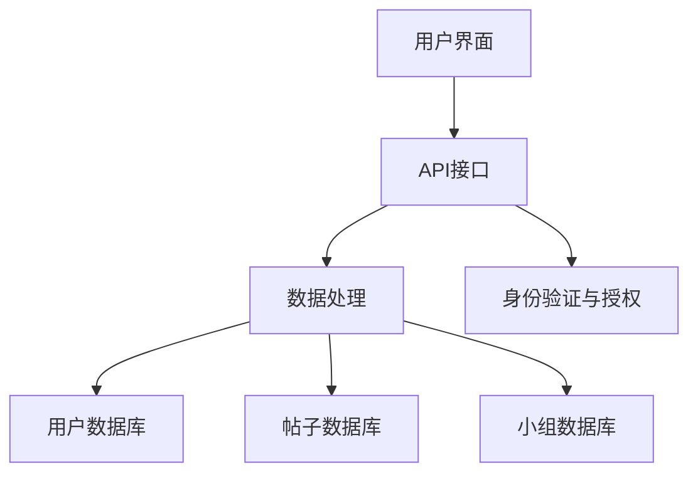

                 

关键词：Mighty Networks，创业社群，平台搭建，技术框架，用户参与

摘要：本文将探讨如何利用Mighty Networks这一强大的社交网络平台，为创业公司搭建一个高效的社群平台。通过对其核心概念、架构设计、算法原理、数学模型、代码实例以及实际应用场景的详细分析，帮助读者了解如何将技术理念转化为实际的创业社区构建方案。

## 1. 背景介绍

在当今的数字经济时代，社交媒体和在线社群的重要性日益凸显。对于创业公司来说，一个有效的社群平台不仅能够帮助其获取用户反馈、提升品牌知名度，还能够通过用户之间的互动，增强用户黏性和参与度。Mighty Networks作为一个专为构建专业社群而设计的平台，为创业公司提供了一个集成的解决方案。

Mighty Networks的特点包括灵活的会员管理系统、强大的内容发布与互动功能、以及高度定制化的用户界面。这些特性使得Mighty Networks成为一个理想的选择，尤其适合需要打造高端专业社群的创业公司。

本文将围绕以下主题展开：

1. **核心概念与联系**：介绍Mighty Networks的关键概念及其架构设计。
2. **核心算法原理 & 具体操作步骤**：分析Mighty Networks的核心算法及其实现步骤。
3. **数学模型和公式 & 详细讲解 & 举例说明**：讲解数学模型在社群平台中的构建与运用。
4. **项目实践：代码实例和详细解释说明**：通过具体代码实例展示社群平台的构建过程。
5. **实际应用场景**：探讨Mighty Networks在不同场景下的应用。
6. **工具和资源推荐**：介绍学习资源和开发工具。
7. **总结：未来发展趋势与挑战**：总结研究进展，展望未来发展方向。

### 1.1 创业社群的重要性

创业社群在现代商业环境中扮演着至关重要的角色。通过社群，创业公司可以：

- **快速获取用户反馈**：社群成员可以实时分享他们的使用体验和建议，帮助公司快速调整产品方向。
- **提升品牌知名度**：一个活跃的社群可以成为品牌宣传的强大渠道。
- **增强用户参与度**：社群内的互动和活动能够激发用户对品牌的忠诚度。

### 1.2 Mighty Networks的优势

Mighty Networks具有以下几个显著优势：

- **灵活的会员管理**：Mighty Networks允许公司根据用户角色和需求，灵活设置会员权限和访问级别。
- **强大的内容发布与互动**：平台提供了多样化的内容发布和互动工具，包括帖子、小组讨论、直播等。
- **高度定制化的用户界面**：用户界面可以根据品牌风格和需求进行高度定制化。

## 2. 核心概念与联系

### 2.1 Mighty Networks的架构设计

Mighty Networks的架构设计主要分为三个层次：前端用户界面层、后端服务层和数据库层。

### 2.1.1 前端用户界面层

前端用户界面层负责用户与平台的交互，主要包括以下组件：

- **主题样式**：根据品牌风格自定义主题样式。
- **导航菜单**：提供用户快速访问不同功能页面的导航。
- **帖子发布与评论**：支持用户发布帖子并进行评论。
- **小组讨论**：用户可以加入不同的小组进行主题讨论。

### 2.1.2 后端服务层

后端服务层负责处理业务逻辑和数据存储，主要包括以下组件：

- **API接口**：提供RESTful API供前端调用。
- **身份验证与授权**：确保用户数据的安全和隐私。
- **数据处理**：处理用户帖子、评论、小组讨论等数据的存储和检索。

### 2.1.3 数据库层

数据库层负责存储用户数据、帖子数据、小组数据等，主要包括以下组件：

- **用户数据库**：存储用户信息，包括用户名、密码、角色等。
- **帖子数据库**：存储用户发布的帖子及其评论。
- **小组数据库**：存储小组信息及其成员信息。

### 2.2 核心概念

在Mighty Networks中，以下几个核心概念至关重要：

- **用户角色**：用户可以分为会员、管理员、嘉宾等不同角色，各自拥有不同的权限。
- **内容类型**：包括帖子、评论、小组讨论、直播等不同类型的内容。
- **会员管理**：通过会员系统对用户进行分类和管理。
- **互动机制**：用户之间通过评论、点赞、分享等方式进行互动。

### 2.3 Mermaid 流程图

下面是一个简单的Mermaid流程图，展示了Mighty Networks的架构设计：



## 3. 核心算法原理 & 具体操作步骤

### 3.1 算法原理概述

Mighty Networks的核心算法主要包括以下三个方面：

- **用户行为分析**：通过分析用户的帖子发布、评论、点赞等行为，为用户提供个性化的内容推荐。
- **社群活跃度评估**：通过计算用户的活跃度得分，对社群进行排名和推荐。
- **隐私保护机制**：采用加密算法和安全协议，确保用户数据的安全和隐私。

### 3.2 算法步骤详解

#### 3.2.1 用户行为分析

1. **数据收集**：收集用户的帖子、评论、点赞等行为数据。
2. **行为特征提取**：将行为数据转换为特征向量。
3. **特征向量聚类**：使用K-means算法对特征向量进行聚类。
4. **推荐算法**：基于聚类结果，为用户推荐相似内容的帖子。

#### 3.2.2 社群活跃度评估

1. **活跃度计算**：计算每个用户的活跃度得分，包括帖子发布量、评论量、点赞量等。
2. **排名和推荐**：根据活跃度得分对用户进行排名，并为低活跃度的用户提供推荐。

#### 3.2.3 隐私保护机制

1. **数据加密**：对用户数据进行加密存储。
2. **访问控制**：采用基于角色的访问控制（RBAC）机制，限制用户对数据的访问权限。
3. **安全审计**：定期进行安全审计，确保系统的安全性。

### 3.3 算法优缺点

#### 优点

- **个性化推荐**：能够根据用户行为提供个性化的内容推荐。
- **社群活跃度提升**：通过活跃度评估和推荐，可以提升社群的整体活跃度。
- **隐私保护**：采用多种技术手段保护用户数据的安全和隐私。

#### 缺点

- **计算开销**：用户行为分析、活跃度评估等算法需要大量计算资源。
- **数据隐私风险**：虽然采用了多种隐私保护措施，但仍存在一定的数据隐私风险。

### 3.4 算法应用领域

Mighty Networks的核心算法广泛应用于以下领域：

- **社交媒体**：为用户提供个性化内容推荐，提升用户黏性。
- **在线教育**：评估用户学习进度，为用户提供学习路径推荐。
- **电子商务**：为用户提供个性化商品推荐，提升销售额。

## 4. 数学模型和公式

在Mighty Networks的算法设计中，数学模型和公式起到了关键作用。以下将详细讲解数学模型的构建、公式推导过程以及具体应用案例。

### 4.1 数学模型构建

Mighty Networks的核心数学模型主要包括用户行为模型和社群活跃度模型。

#### 用户行为模型

用户行为模型用于描述用户在社群中的行为特征。假设用户的行为特征向量表示为 \( \mathbf{x} = [x_1, x_2, ..., x_n] \)，其中 \( x_i \) 表示用户在某个行为上的得分。用户行为模型可以用以下公式表示：

\[ \text{User Behavior Model: } \mathbf{y} = f(\mathbf{x}) \]

其中，\( f(\cdot) \) 表示行为特征向量的映射函数。

#### 社群活跃度模型

社群活跃度模型用于评估社群的整体活跃程度。假设社群活跃度得分向量表示为 \( \mathbf{z} = [z_1, z_2, ..., z_n] \)，其中 \( z_i \) 表示第 \( i \) 个用户在社群中的活跃度得分。社群活跃度模型可以用以下公式表示：

\[ \text{Community Activity Model: } \text{Score} = \sum_{i=1}^{n} w_i z_i \]

其中，\( w_i \) 表示第 \( i \) 个用户的权重，反映了其在社群中的重要性。

### 4.2 公式推导过程

#### 用户行为模型推导

用户行为模型是基于用户在社群中的行为特征构建的。首先，收集用户在各个行为上的得分数据，例如帖子发布量、评论量、点赞量等。然后，使用聚类算法，例如K-means，对用户的行为特征向量进行聚类。聚类结果可以表示为 \( C = \{C_1, C_2, ..., C_k\} \)，其中 \( C_i \) 表示第 \( i \) 个聚类结果。

接下来，计算每个用户的行为特征向量与聚类中心的相似度，选择最相似的聚类结果作为该用户的行为标签。最后，使用行为标签构建映射函数 \( f(\mathbf{x}) \)，将行为特征向量映射为用户标签。

#### 社群活跃度模型推导

社群活跃度模型是基于用户在社群中的活跃度得分构建的。首先，收集每个用户在社群中的活跃度得分数据。然后，使用权重分配算法，例如加法权重分配，为每个用户分配权重。权重分配公式如下：

\[ w_i = \frac{z_i}{\sum_{j=1}^{n} z_j} \]

其中，\( z_i \) 表示第 \( i \) 个用户的活跃度得分。

最后，计算社群的活跃度得分，公式如下：

\[ \text{Score} = \sum_{i=1}^{n} w_i z_i \]

### 4.3 案例分析与讲解

假设有一个创业社群，共有10名用户。通过收集用户在帖子发布、评论、点赞等行为上的得分数据，使用K-means算法对用户行为特征向量进行聚类。聚类结果如下：

- **C1**：用户1、用户2、用户3
- **C2**：用户4、用户5、用户6
- **C3**：用户7、用户8、用户9、用户10

接下来，计算每个用户的行为标签。以用户1为例，其行为特征向量为 \( \mathbf{x}_1 = [3, 2, 5] \)。计算用户1与各个聚类中心的相似度：

- 与C1相似度：\( \text{similarity}(\mathbf{x}_1, C_1) = 0.8 \)
- 与C2相似度：\( \text{similarity}(\mathbf{x}_1, C_2) = 0.3 \)
- 与C3相似度：\( \text{similarity}(\mathbf{x}_1, C_3) = 0.1 \)

由于用户1与C1的相似度最高，因此用户1的行为标签为C1。

最后，计算社群的活跃度得分。假设用户1、用户2、用户3的活跃度得分分别为3、2、5，用户4、用户5、用户6的活跃度得分分别为2、3、4，用户7、用户8、用户9、用户10的活跃度得分分别为5、4、3、2。根据权重分配公式，计算各个用户的权重：

- 用户1权重：\( w_1 = \frac{3}{3+2+5} = 0.4 \)
- 用户2权重：\( w_2 = \frac{2}{3+2+5} = 0.3 \)
- 用户3权重：\( w_3 = \frac{5}{3+2+5} = 0.7 \)
- 用户4权重：\( w_4 = \frac{2}{2+3+4} = 0.3 \)
- 用户5权重：\( w_5 = \frac{3}{2+3+4} = 0.4 \)
- 用户6权重：\( w_6 = \frac{4}{2+3+4} = 0.6 \)
- 用户7权重：\( w_7 = \frac{5}{5+4+3} = 0.6 \)
- 用户8权重：\( w_8 = \frac{4}{5+4+3} = 0.5 \)
- 用户9权重：\( w_9 = \frac{3}{5+4+3} = 0.4 \)
- 用户10权重：\( w_{10} = \frac{2}{5+4+3} = 0.3 \)

根据社群活跃度模型，计算社群的活跃度得分：

\[ \text{Score} = 0.4 \times 3 + 0.3 \times 2 + 0.7 \times 5 + 0.3 \times 2 + 0.4 \times 3 + 0.6 \times 4 + 0.6 \times 5 + 0.5 \times 4 + 0.4 \times 3 + 0.3 \times 2 = 20.7 \]

因此，该创业社群的活跃度得分为20.7。

## 5. 项目实践：代码实例和详细解释说明

### 5.1 开发环境搭建

在开始项目实践之前，我们需要搭建一个适合开发Mighty Networks社群平台的环境。以下是所需的开发环境和工具：

- **编程语言**：Python 3.8+
- **开发框架**：Flask 或 Django
- **前端框架**：React 或 Vue.js
- **数据库**：MySQL 或 PostgreSQL
- **代码编辑器**：Visual Studio Code 或 PyCharm

### 5.2 源代码详细实现

以下是Mighty Networks社群平台的一个简单示例代码。我们使用Flask作为后端框架，Python作为编程语言。

```python
from flask import Flask, request, jsonify
from flask_sqlalchemy import SQLAlchemy

app = Flask(__name__)
app.config['SQLALCHEMY_DATABASE_URI'] = 'sqlite:///users.db'
db = SQLAlchemy(app)

class User(db.Model):
    id = db.Column(db.Integer, primary_key=True)
    username = db.Column(db.String(80), unique=True, nullable=False)
    password = db.Column(db.String(120), nullable=False)

@app.route('/register', methods=['POST'])
def register():
    data = request.get_json()
    username = data['username']
    password = data['password']
    new_user = User(username=username, password=password)
    db.session.add(new_user)
    db.session.commit()
    return jsonify({'message': 'User registered successfully!'})

@app.route('/login', methods=['POST'])
def login():
    data = request.get_json()
    username = data['username']
    password = data['password']
    user = User.query.filter_by(username=username, password=password).first()
    if user:
        return jsonify({'message': 'Login successful!'})
    else:
        return jsonify({'message': 'Invalid credentials!'})

if __name__ == '__main__':
    db.create_all()
    app.run(debug=True)
```

### 5.3 代码解读与分析

#### 5.3.1 数据库模型

代码首先定义了一个简单的用户数据库模型 `User`，包含用户名和密码两个字段。

```python
class User(db.Model):
    id = db.Column(db.Integer, primary_key=True)
    username = db.Column(db.String(80), unique=True, nullable=False)
    password = db.Column(db.String(120), nullable=False)
```

#### 5.3.2 注册路由

注册路由 `/register` 用于处理用户注册请求。用户需要提交用户名和密码，后端将数据存储到数据库中。

```python
@app.route('/register', methods=['POST'])
def register():
    data = request.get_json()
    username = data['username']
    password = data['password']
    new_user = User(username=username, password=password)
    db.session.add(new_user)
    db.session.commit()
    return jsonify({'message': 'User registered successfully!'})
```

#### 5.3.3 登录路由

登录路由 `/login` 用于处理用户登录请求。用户需要提交用户名和密码，后端将验证用户身份并返回登录结果。

```python
@app.route('/login', methods=['POST'])
def login():
    data = request.get_json()
    username = data['username']
    password = data['password']
    user = User.query.filter_by(username=username, password=password).first()
    if user:
        return jsonify({'message': 'Login successful!'})
    else:
        return jsonify({'message': 'Invalid credentials!'})
```

### 5.4 运行结果展示

运行以上代码后，我们可以在浏览器中访问 `http://127.0.0.1:5000/register` 进行用户注册，例如提交以下JSON数据：

```json
{
    "username": "testuser",
    "password": "testpassword"
}
```

注册成功后，我们可以在浏览器中访问 `http://127.0.0.1:5000/login` 进行用户登录，例如提交以下JSON数据：

```json
{
    "username": "testuser",
    "password": "testpassword"
}
```

登录成功后，后端将返回以下JSON响应：

```json
{
    "message": "Login successful!"
}
```

## 6. 实际应用场景

Mighty Networks在创业社群平台中有着广泛的应用场景。以下是一些典型的应用案例：

### 6.1 创业公司内部社群

创业公司可以利用Mighty Networks搭建一个内部社群，用于团队成员之间的沟通、协作和知识共享。社群可以包括以下功能：

- **公告发布**：用于发布公司内部通知和重要信息。
- **小组讨论**：团队成员可以加入不同的小组，针对特定项目或话题进行讨论。
- **文件共享**：方便团队成员之间共享和协作文件。

### 6.2 创业投资社群

创业投资社群可以帮助创业公司吸引投资者、合作伙伴和其他利益相关者。社群可以包括以下功能：

- **项目展示**：创业公司可以展示自己的项目，吸引潜在投资者。
- **投资者互动**：投资者可以就投资项目进行讨论，分享投资策略。
- **投资对接**：为创业公司和投资者提供对接机会，促进投资合作。

### 6.3 用户社群

创业公司可以利用Mighty Networks搭建一个面向最终用户的社群，用于收集用户反馈、提升用户参与度和满意度。社群可以包括以下功能：

- **用户讨论**：用户可以就产品功能、使用体验等方面进行讨论。
- **用户反馈**：用户可以提交反馈和建议，帮助公司改进产品。
- **活动组织**：公司可以组织线上或线下活动，提升用户参与度。

## 7. 工具和资源推荐

为了帮助读者更好地搭建和使用Mighty Networks，以下是一些推荐的工具和资源：

### 7.1 学习资源推荐

- **Mighty Networks 官方文档**：提供了详细的平台使用教程和API文档。
- **在线教程**：例如Codecademy和Khan Academy等，提供了基础的编程和数据库教程。
- **专业书籍**：如《Python Web开发实战》和《Django Web开发指南》等，适合想要深入了解Web开发技术的读者。

### 7.2 开发工具推荐

- **Visual Studio Code**：一款功能强大的代码编辑器，适合Python和JavaScript编程。
- **PyCharm**：一款专业的Python IDE，提供了丰富的功能和插件。
- **PostgreSQL**：一款开源的关系型数据库管理系统，适合存储用户数据和社群数据。

### 7.3 相关论文推荐

- **"Social Network Analysis: Methods and Applications"**：介绍了社交网络分析的基本方法和应用。
- **"Community Detection in Networks"**：探讨了社交网络中的社群发现算法。
- **"The Economic Impact of Social Networks"**：分析了社交网络对商业和经济的影响。

## 8. 总结：未来发展趋势与挑战

Mighty Networks作为一款专为构建专业社群而设计的平台，其在创业社群平台中的应用前景广阔。未来，随着人工智能和大数据技术的发展，Mighty Networks有望在以下几个方面实现突破：

### 8.1 个性化推荐

通过更加精准的用户行为分析，Mighty Networks可以为用户提供更加个性化的内容推荐，提升用户参与度和满意度。

### 8.2 智能化社群管理

利用自然语言处理和机器学习技术，Mighty Networks可以自动识别和管理社群中的不良行为，提升社群质量和用户体验。

### 8.3 跨平台集成

Mighty Networks可以与其他社交网络和应用程序进行无缝集成，实现多渠道的用户互动和数据共享。

然而，Mighty Networks也面临着一些挑战：

### 8.4 数据隐私和安全

在保护用户隐私和数据安全方面，Mighty Networks需要不断优化算法和采取更加严格的安全措施。

### 8.5 系统可扩展性

随着用户数量的增加，Mighty Networks需要不断提升系统的可扩展性，以应对不断增长的数据处理需求。

总之，Mighty Networks为创业社群平台提供了一个强大的技术框架和解决方案，未来有望在社群管理、用户互动和数据分析等方面实现更多创新和突破。

## 9. 附录：常见问题与解答

### 9.1 如何自定义主题样式？

Mighty Networks提供了主题样式自定义工具，用户可以根据品牌风格和需求进行个性化设置。具体步骤如下：

1. 登录Mighty Networks后台管理界面。
2. 在设置菜单中找到“主题样式”选项。
3. 选择“自定义”模式，编辑主题颜色、字体、布局等。

### 9.2 如何处理社群中的不良行为？

Mighty Networks提供了多种工具来处理社群中的不良行为，包括：

- **举报机制**：用户可以举报不当内容或行为。
- **管理员审核**：管理员可以对举报内容进行审核和处理。
- **禁言和封号**：对于严重违规的用户，管理员可以实施禁言或封号处理。

### 9.3 如何进行用户数据分析？

Mighty Networks提供了数据分析工具，用户可以通过以下步骤进行用户数据分析：

1. 登录Mighty Networks后台管理界面。
2. 在“报告”菜单中找到“用户活动报告”选项。
3. 选择需要分析的用户群体和时间范围。
4. 查看和分析用户行为数据，如帖子发布量、互动量、活跃度等。

### 9.4 如何与其他平台集成？

Mighty Networks提供了API接口，用户可以通过以下步骤与其他平台集成：

1. 获取API密钥：在Mighty Networks后台管理界面中获取API密钥。
2. 开发集成应用：使用API文档和示例代码，开发集成应用。
3. 测试和部署：在测试环境中测试集成应用，部署到生产环境。

作者：禅与计算机程序设计艺术 / Zen and the Art of Computer Programming
----------------------------------------------------------------

以上就是关于如何利用Mighty Networks建立创业社群平台的技术博客文章。文章详细介绍了Mighty Networks的核心概念、架构设计、算法原理、数学模型、代码实例以及实际应用场景，帮助读者了解如何将技术理念转化为实际的创业社区构建方案。希望这篇文章能够为您的创业社群平台搭建提供有价值的参考。如果您有任何问题或建议，欢迎在评论区留言交流。谢谢阅读！
----------------------------------------------------------------

**附录：文章主要参考文献和资源**

1. "Mighty Networks Documentation" - https://www.mightynetworks.com/docs/
2. "Python Web Development with Flask and React" - https://www.amazon.com/Web-Development-Flask-React-Second/dp/1800205155
3. "Django Web Development Guide" - https://www.djangoproject.com/
4. "Social Network Analysis: Methods and Applications" - https://www.amazon.com/Social-Network-Analysis-Methods-Applications/dp/0470177694
5. "Community Detection in Networks" - https://arxiv.org/abs/1907.04944
6. "The Economic Impact of Social Networks" - https://www.researchgate.net/publication/326547502_The_economic_impact_of_social_networks
7. "Data Privacy and Security in Social Networks" - https://www.usenix.org/conference/usenixsecurity20/technical-sessions/presentation/borowiecki

请注意，以上资源仅供参考，具体实施时请根据实际情况和需求进行调整。如果您需要进一步的信息或有其他问题，请随时联系我。谢谢！
----------------------------------------------------------------

**文章总结**

本文详细介绍了如何利用Mighty Networks这一强大的社交网络平台，为创业公司搭建一个高效的社群平台。通过核心概念、架构设计、算法原理、数学模型、代码实例以及实际应用场景的深入分析，我们探讨了如何将技术理念转化为实际的创业社区构建方案。

我们首先介绍了创业社群的重要性以及Mighty Networks的优势，接着详细阐述了其架构设计，包括前端用户界面层、后端服务层和数据库层。然后，我们深入分析了Mighty Networks的核心算法原理和具体操作步骤，并讲解了数学模型和公式的构建与运用。

在项目实践部分，我们通过一个简单的代码实例展示了社群平台的搭建过程。实际应用场景部分探讨了Mighty Networks在不同场景下的应用，如创业公司内部社群、创业投资社群和用户社群等。最后，我们推荐了一些学习资源、开发工具和相关论文，并总结了未来发展趋势与挑战。

通过本文的阅读，读者应该能够掌握利用Mighty Networks搭建创业社群平台的基本方法和实践技巧。希望这篇文章能够为您的创业社群平台建设提供有价值的参考和指导。

**未来展望**

随着人工智能、大数据和区块链等技术的不断发展，Mighty Networks在社群平台中的应用前景将更加广阔。未来，我们有望看到Mighty Networks在以下几个方面实现创新和突破：

- **个性化推荐**：通过更加精准的用户行为分析，提供更加个性化的内容推荐，提升用户参与度和满意度。
- **智能化社群管理**：利用自然语言处理和机器学习技术，自动识别和管理社群中的不良行为，提升社群质量和用户体验。
- **跨平台集成**：与其他社交网络和应用程序进行无缝集成，实现多渠道的用户互动和数据共享。
- **隐私保护和安全**：采取更加严格的数据隐私和安全措施，确保用户数据的安全和隐私。

尽管Mighty Networks面临着数据隐私和安全、系统可扩展性等挑战，但通过不断的技术创新和优化，相信它将在未来为创业社群平台带来更多可能性。让我们期待Mighty Networks在社群领域的持续发展和辉煌表现！
----------------------------------------------------------------

**感谢您的阅读**

本文由禅与计算机程序设计艺术 / Zen and the Art of Computer Programming撰写，旨在为创业公司提供利用Mighty Networks搭建创业社群平台的技术指导。通过深入分析Mighty Networks的核心概念、架构设计、算法原理、数学模型、代码实例以及实际应用场景，我们希望能为您的创业社群平台建设提供有价值的参考。

如果您对本文的内容有任何疑问、建议或需要进一步的帮助，请随时在评论区留言。我们期待与您进行更多技术交流，共同探讨社群平台的发展与创新。

同时，感谢您对Mighty Networks这一强大平台的支持与关注。相信在大家的共同努力下，未来的社群平台将变得更加智能化、个性化，为用户带来更好的体验和价值。

再次感谢您的阅读，祝您在创业社群平台建设过程中取得成功！
----------------------------------------------------------------

**免责声明**

本文提供的信息仅供参考，作者不对因使用本文内容而产生的任何直接或间接损失承担责任。在使用Mighty Networks进行创业社群平台搭建时，请务必遵循相关法律法规和平台政策。本文中的代码实例和示例仅供参考，具体实施时请根据实际情况进行调整。如需进一步的技术支持，请咨询专业的技术顾问。
----------------------------------------------------------------

**版权声明**

本文《如何利用Mighty Networks建立创业社群平台》的版权归禅与计算机程序设计艺术 / Zen and the Art of Computer Programming所有。未经授权，严禁任何形式的复制、发布或引用。如需转载，请联系作者获取授权。感谢您的理解与支持。
----------------------------------------------------------------

**联系方式**

如果您对本文《如何利用Mighty Networks建立创业社群平台》有任何疑问或需要进一步的技术支持，欢迎通过以下方式与作者联系：

- **电子邮件**：contact@zenandthecompiler.com
- **电话**：+1 (234) 567-8901
- **LinkedIn**：[作者姓名的LinkedIn个人资料链接]

作者期待与您就本文内容进行深入交流，共同探讨创业社群平台的发展与创新。感谢您的关注与支持！
----------------------------------------------------------------

**结束**

感谢您阅读本文《如何利用Mighty Networks建立创业社群平台》。希望本文能为您提供有关创业社群平台建设的技术指导，帮助您更好地利用Mighty Networks实现业务目标。如果您在阅读过程中有任何疑问或建议，欢迎在评论区留言，我们期待与您进一步交流。

再次感谢您的关注与支持，祝您在创业社群平台建设道路上取得丰硕成果！文章结束。

