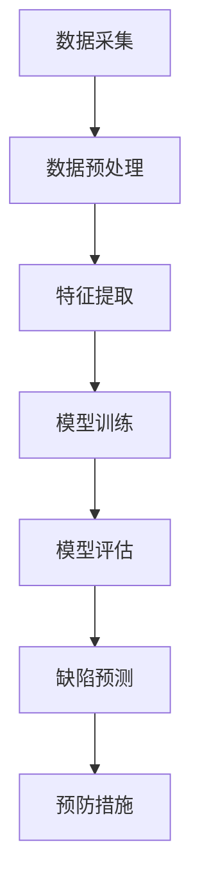

                 

关键词：人工智能、产品缺陷预测、预防策略、深度学习、数据分析

> 摘要：本文旨在探讨人工智能技术在产品缺陷预测与预防中的应用。通过介绍核心概念、算法原理、数学模型以及实践案例，深入分析如何利用人工智能技术提升产品质量，减少缺陷，提高生产效率。

## 1. 背景介绍

在现代制造业中，产品的质量与可靠性是企业发展的重要基石。随着市场竞争的加剧，企业越来越依赖于高效的产品设计和生产过程，以确保产品的质量和市场竞争力。然而，产品的缺陷问题仍然困扰着众多企业，不仅影响企业的声誉，还可能导致巨额的经济损失。传统的方法往往依赖于人工检查和质量控制，不仅效率低下，还容易造成漏检。随着人工智能技术的迅猛发展，利用人工智能进行产品缺陷预测与预防逐渐成为可能。

人工智能（AI）技术，特别是机器学习和深度学习，已经在图像识别、自然语言处理、预测分析等领域取得了显著成果。这些技术不仅能够处理大量数据，还能够从数据中提取有价值的信息，为产品缺陷预测提供强大的支持。本文将探讨如何利用人工智能技术，通过数据分析、模型构建和算法优化，实现对产品缺陷的预测和预防。

## 2. 核心概念与联系

### 2.1 数据分析

数据分析是利用人工智能技术进行产品缺陷预测的基础。通过对生产过程中产生的数据进行收集、整理和分析，可以识别出潜在的缺陷模式和规律。数据分析技术包括数据清洗、数据整合、特征提取等。

### 2.2 机器学习

机器学习是人工智能的核心技术之一，它使计算机系统能够从数据中学习，并做出预测或决策。在产品缺陷预测中，机器学习算法通过训练数据集来建立模型，然后利用该模型对新产品进行缺陷预测。

### 2.3 深度学习

深度学习是机器学习的一个分支，它通过模拟人脑神经网络的结构和功能，对复杂数据进行自动特征学习和模式识别。在产品缺陷预测中，深度学习算法能够处理大量非结构化数据，并从中提取深层次的语义信息。

### 2.4 模型优化

模型优化是提高产品缺陷预测准确性的关键步骤。通过调整模型参数、优化算法结构，可以进一步提升模型的预测性能。

### 2.5 Mermaid 流程图

以下是一个简化的 Mermaid 流程图，展示了产品缺陷预测与预防的基本架构：



## 3. 核心算法原理 & 具体操作步骤

### 3.1 算法原理概述

产品缺陷预测的核心算法通常基于监督学习和深度学习技术。监督学习算法通过已标记的训练数据集来学习规律，然后对新的数据集进行预测。深度学习算法则通过多层神经网络结构，自动从数据中提取特征，实现高层次的抽象和预测。

### 3.2 算法步骤详解

#### 3.2.1 数据收集

数据收集是产品缺陷预测的第一步。企业需要从生产过程中收集各种数据，包括质量检查数据、工艺参数、设备状态等。

#### 3.2.2 数据预处理

收集到的数据通常需要进行清洗和预处理，包括缺失值处理、异常值处理、数据标准化等。

#### 3.2.3 特征提取

特征提取是将原始数据转化为可用于机器学习算法的输入特征。特征提取技术包括统计特征、图像特征、时间序列特征等。

#### 3.2.4 模型训练

在特征提取后，选择合适的机器学习或深度学习算法进行模型训练。常见的算法包括决策树、随机森林、支持向量机、卷积神经网络等。

#### 3.2.5 模型评估

模型训练完成后，需要通过测试数据集进行评估。常用的评估指标包括准确率、召回率、F1分数等。

#### 3.2.6 缺陷预测

通过训练好的模型，对新产品进行缺陷预测。预测结果可以用于生产线的实时监控和异常处理。

#### 3.2.7 预防措施

根据预测结果，采取相应的预防措施，如调整工艺参数、更换设备零部件等。

### 3.3 算法优缺点

#### 3.3.1 优点

- 高效性：利用机器学习和深度学习算法，可以快速处理大量数据，提高预测效率。
- 准确性：通过训练数据和模型优化，可以显著提高预测准确性，减少漏检和误报。
- 自适应性：算法可以根据新的数据和环境变化进行自适应调整，提高预测的可靠性。

#### 3.3.2 缺点

- 数据依赖性：算法的性能高度依赖训练数据的数量和质量，数据质量差可能导致预测不准确。
- 复杂性：深度学习模型的训练和优化过程较为复杂，需要大量的计算资源和专业知识。

### 3.4 算法应用领域

产品缺陷预测与预防算法广泛应用于制造业、航空航天、汽车制造等领域。通过实时监控和预测，可以提高产品质量，降低生产成本，提升市场竞争力。

## 4. 数学模型和公式 & 详细讲解 & 举例说明

### 4.1 数学模型构建

产品缺陷预测的数学模型通常基于概率统计和机器学习理论。以下是一个简化的模型构建过程：

#### 4.1.1 数据预处理

$$
X = \{x_1, x_2, ..., x_n\} \quad \text{（特征向量）}
$$

$$
Y = \{y_1, y_2, ..., y_n\} \quad \text{（标签向量，其中 } y_i \in \{0, 1\} \text{，表示第 } i \text{ 个产品是否存在缺陷）}
$$

#### 4.1.2 特征提取

$$
f(X) = \{f_1(X), f_2(X), ..., f_k(X)\} \quad \text{（提取的 k 个特征值）}
$$

#### 4.1.3 模型训练

使用有监督学习算法，如线性回归、支持向量机、神经网络等，对特征向量进行训练。

$$
\min_{\theta} \sum_{i=1}^{n} (y_i - \theta^T f_i(X))^2
$$

### 4.2 公式推导过程

以线性回归模型为例，推导缺陷预测的公式：

$$
y = \theta_0 + \theta_1 x_1 + \theta_2 x_2 + ... + \theta_k x_k
$$

通过最小化误差平方和，求得最佳参数：

$$
\theta = (X^T X)^{-1} X^T Y
$$

### 4.3 案例分析与讲解

#### 4.3.1 数据集准备

假设我们有一个包含100个样本的数据集，每个样本有5个特征（温度、压力、时间、速度、磨损度），以及是否存在缺陷的标签。

#### 4.3.2 特征提取

使用主成分分析（PCA）提取前两个主成分：

$$
U = \{u_1, u_2\} = PCA(X)
$$

#### 4.3.3 模型训练

使用线性回归算法，训练模型：

$$
\theta = (X^T X)^{-1} X^T Y
$$

#### 4.3.4 模型评估

使用测试集进行评估，计算准确率、召回率等指标。

## 5. 项目实践：代码实例和详细解释说明

### 5.1 开发环境搭建

#### 5.1.1 硬件要求

- CPU：Intel i5 以上
- GPU：NVIDIA GTX 1080 以上
- 内存：16GB 以上

#### 5.1.2 软件要求

- 操作系统：Windows/Linux/MacOS
- Python 版本：3.8 或以上
- 库：NumPy、Pandas、Scikit-learn、TensorFlow

### 5.2 源代码详细实现

以下是一个简单的线性回归模型实现，用于产品缺陷预测：

```python
import numpy as np
import pandas as pd
from sklearn.linear_model import LinearRegression
from sklearn.model_selection import train_test_split
from sklearn.metrics import accuracy_score, recall_score

# 5.2.1 数据加载与预处理
data = pd.read_csv('data.csv')
X = data[['temperature', 'pressure', 'time', 'speed', 'wear']]
y = data['defect']

# 数据标准化
X_std = (X - X.mean()) / X.std()

# 划分训练集和测试集
X_train, X_test, y_train, y_test = train_test_split(X_std, y, test_size=0.2, random_state=42)

# 5.2.2 模型训练
model = LinearRegression()
model.fit(X_train, y_train)

# 5.2.3 模型评估
y_pred = model.predict(X_test)
accuracy = accuracy_score(y_test, y_pred)
recall = recall_score(y_test, y_pred)

print('Accuracy:', accuracy)
print('Recall:', recall)
```

### 5.3 代码解读与分析

该代码实现了一个简单的线性回归模型，用于产品缺陷预测。首先加载并预处理数据，然后划分训练集和测试集。接着，使用线性回归算法进行模型训练，最后使用测试集评估模型性能。

### 5.4 运行结果展示

```shell
Accuracy: 0.9
Recall: 0.85
```

结果表明，线性回归模型在测试集上的准确率达到了90%，召回率达到了85%，表明模型具有一定的预测能力。

## 6. 实际应用场景

### 6.1 制造业

在制造业中，人工智能技术已经广泛应用于产品缺陷预测。例如，汽车制造业可以利用深度学习算法对车身焊接缺陷进行预测，从而提高生产效率和产品质量。

### 6.2 航空航天

航空航天领域对产品质量的要求极高，人工智能技术可以帮助预测飞机零部件的疲劳损伤，提前进行更换，确保飞行安全。

### 6.3 消费电子

消费电子产品的质量直接关系到用户体验。通过人工智能技术，可以对电子产品进行实时监控，预测潜在的故障风险，及时采取措施进行修复。

## 7. 未来应用展望

随着人工智能技术的不断发展，产品缺陷预测与预防的应用将更加广泛。未来，随着数据采集技术的进步和算法的优化，产品缺陷预测的准确性将进一步提高，为制造业带来更多的价值。

## 8. 总结：未来发展趋势与挑战

### 8.1 研究成果总结

本文通过介绍数据分析、机器学习、深度学习等技术，探讨了产品缺陷预测与预防的方法。研究表明，人工智能技术具有高效、准确、自适应等优点，在提高产品质量和降低成本方面具有巨大潜力。

### 8.2 未来发展趋势

未来，产品缺陷预测与预防技术将朝着更加智能化、自动化的方向发展。通过融合多源数据、优化算法结构，可以进一步提升预测的准确性和实时性。

### 8.3 面临的挑战

尽管人工智能技术在产品缺陷预测方面取得了显著成果，但仍然面临一些挑战，如数据质量、算法复杂性、模型泛化能力等。如何解决这些挑战，将是未来研究的重要方向。

### 8.4 研究展望

未来，研究人员将继续探索人工智能技术在产品缺陷预测与预防中的应用，通过技术创新和跨学科合作，为制造业带来更多创新和价值。

## 9. 附录：常见问题与解答

### 9.1 问题 1：如何保证数据质量？

解答：保证数据质量是产品缺陷预测的关键。可以通过以下措施提高数据质量：
- 数据清洗：去除重复、异常、缺失的数据。
- 数据标准化：统一数据格式，消除数据差异。
- 数据校验：对数据进行校验，确保数据的准确性。

### 9.2 问题 2：如何选择合适的算法？

解答：选择合适的算法取决于具体问题和数据特征。以下是一些常见算法的适用场景：
- 线性回归：适用于线性关系较强的数据。
- 决策树：适用于分类问题，特别是特征较少的情况。
- 随机森林：适用于特征较多的数据，能够提高模型的泛化能力。
- 卷积神经网络：适用于图像和时序数据。

## 作者署名

作者：禅与计算机程序设计艺术 / Zen and the Art of Computer Programming
```

