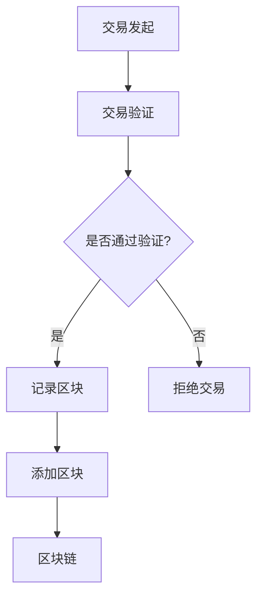

                 

关键词：区块链，创业，商业模式，技术革新，去中心化，智能合约，安全性，透明性，效率，创新

> 摘要：本文旨在探讨区块链技术如何重塑创业商业模式，分析其在去中心化、智能合约、安全性和透明性等方面的优势，以及如何通过技术手段提升创业项目的成功率。文章将结合实际案例，提出未来发展展望和挑战。

## 1. 背景介绍

在过去的几十年里，互联网技术的飞速发展给商业世界带来了翻天覆地的变化。电子商务、社交媒体和移动互联网等创新模式层出不穷，极大地改变了人们的消费习惯和商业运作方式。然而，随着信息技术的进一步发展，新的挑战和问题也逐渐显现出来。中心化的数据存储和管理方式在安全性、透明性和效率方面逐渐暴露出不足，这为区块链技术的出现提供了契机。

区块链技术作为一种分布式账本技术，具有去中心化、安全性高、透明性强等特点。它通过加密算法和共识机制保证数据的不可篡改和去中心化存储，使得数据可以在无需信任的第三方参与的情况下进行安全、透明的交换。这些特性使得区块链技术成为重塑创业商业模式的有力工具，为创业者提供了新的机遇和挑战。

## 2. 核心概念与联系

### 2.1. 区块链技术的基本原理

区块链技术由多个区块组成，每个区块包含一定数量的交易记录。区块之间通过加密算法和哈希函数连接，形成一个不可篡改的链式结构。区块链技术通过共识机制来保证所有参与者对账本的一致性，常见的共识机制包括工作量证明（Proof of Work，PoW）和权益证明（Proof of Stake，PoS）等。

### 2.2. 智能合约

智能合约是区块链技术的一个重要组成部分，它是一种自动执行、控制或记录法律相关事件和行动的计算机协议。智能合约通过预先编写的代码自动执行合同条款，无需依赖第三方中介，从而提高交易效率和降低成本。

### 2.3. 去中心化与安全性

区块链技术的去中心化特性意味着数据不再存储在单一的中心服务器上，而是分散存储在所有参与者（节点）的电脑上。这种分布式存储方式使得数据更加安全，因为任何单个节点的攻击都无法影响整个系统的安全性。

### 2.4. 透明性与信任

区块链技术的公开透明特性使得所有交易记录都可以被所有节点查看和验证。这种透明性降低了信息不对称，增加了参与者之间的信任度。

### 2.5. Mermaid 流程图

以下是一个简化的区块链架构的 Mermaid 流程图：



## 3. 核心算法原理 & 具体操作步骤

### 3.1. 算法原理概述

区块链技术中的核心算法包括加密算法、哈希函数和共识机制。加密算法用于保护数据的安全性和隐私，哈希函数用于生成唯一标识，共识机制用于确保所有参与者对账本的一致性。

### 3.2. 算法步骤详解

#### 3.2.1. 交易发起与验证

1. 交易发起：用户发起交易请求，包含交易金额、接收方地址等信息。
2. 交易验证：节点对交易进行验证，包括检查交易金额是否足够、交易信息是否完整等。

#### 3.2.2. 区块生成与添加

1. 节点收集待验证的交易，组成区块。
2. 节点使用加密算法对区块进行签名，确保数据的安全性。
3. 节点使用哈希函数生成区块的哈希值。
4. 节点尝试找到满足共识机制要求的证明，如PoW算法中的 nonce 值。
5. 节点将满足条件的区块添加到区块链中。

### 3.3. 算法优缺点

区块链技术的核心算法具有以下优缺点：

- **优点**：安全性高、去中心化、透明性强。
- **缺点**：计算资源消耗大、交易处理速度慢。

### 3.4. 算法应用领域

区块链技术可以应用于多个领域，包括数字货币、供应链管理、智能合约、数据存储等。以下是一些典型的应用案例：

- **数字货币**：比特币、以太坊等。
- **供应链管理**：确保商品来源的真实性和可靠性。
- **智能合约**：自动执行合同条款，提高交易效率。
- **数据存储**：分布式存储，提高数据安全性。

## 4. 数学模型和公式 & 详细讲解 & 举例说明

### 4.1. 数学模型构建

区块链技术中的数学模型主要包括加密算法、哈希函数和共识机制。以下以 PoW 算法为例进行说明。

#### 4.1.1. 加密算法

加密算法用于保护数据的安全性和隐私。常见的加密算法包括 RSA、AES 等。

#### 4.1.2. 哈希函数

哈希函数用于生成唯一标识。常见的哈希函数包括 SHA-256、SHA-3 等。

#### 4.1.3. PoW 算法

PoW 算法是一种基于计算能力的共识机制。以下是一个简化的 PoW 算法模型：

$$
\text{PoW} = \text{find}(\text{nonce}) \text{such that} \, H(\text{block}) \leq \text{target}
$$

其中，$H(\text{block})$ 是区块的哈希值，$\text{target}$ 是预设的目标值，$\text{nonce}$ 是随机数。

### 4.2. 公式推导过程

假设我们要找到一个满足以下条件的区块：

$$
H(\text{block}) \leq \text{target}
$$

其中，$\text{block}$ 包含交易记录、区块头等信息。我们可以通过遍历随机数 $\text{nonce}$ 来找到满足条件的区块。

### 4.3. 案例分析与讲解

以比特币的挖矿过程为例，比特币网络预设了一个难度值（target），挖矿节点需要不断尝试不同的 nonce 值，直到找到满足以下条件的区块：

$$
H(\text{block}) \leq \text{target}
$$

这个过程需要大量的计算资源，从而确保区块链的安全性。

## 5. 项目实践：代码实例和详细解释说明

### 5.1. 开发环境搭建

在本节中，我们将使用 Python 和 Pyecharts 库搭建一个简单的区块链演示环境。

```python
# 安装 Pyecharts
pip install pyecharts
```

### 5.2. 源代码详细实现

以下是区块链的核心代码实现：

```python
import hashlib
import time

class Block:
    def __init__(self, index, transactions, timestamp, previous_hash):
        self.index = index
        self.transactions = transactions
        self.timestamp = timestamp
        self.previous_hash = previous_hash
        self.hash = self.compute_hash()

    def compute_hash(self):
        block_string = f"{self.index}{self.transactions}{self.timestamp}{self.previous_hash}"
        return hashlib.sha256(block_string.encode()).hexdigest()


class Blockchain:
    def __init__(self):
        self.unconfirmed_transactions = []
        self.chain = []
        self.create_genesis_block()

    def create_genesis_block(self):
        genesis_block = Block(0, [], time.time(), "0")
        genesis_block.hash = genesis_block.compute_hash()
        self.chain.append(genesis_block)

    def add_new_transaction(self, transaction):
        self.unconfirmed_transactions.append(transaction)

    def mine(self):
        if not self.unconfirmed_transactions:
            return False

        last_block = self.chain[-1]
        new_block = Block(index=last_block.index + 1,
                          transactions=self.unconfirmed_transactions,
                          timestamp=time.time(),
                          previous_hash=last_block.hash)
        new_block.hash = new_block.compute_hash()
        self.chain.append(new_block)
        self.unconfirmed_transactions = []
        return new_block.index

    def is_chain_valid(self):
        for i in range(1, len(self.chain)):
            current = self.chain[i]
            previous = self.chain[i - 1]
            if current.hash != current.compute_hash():
                return False
            if current.previous_hash != previous.hash:
                return False
        return True


def main():
    blockchain = Blockchain()

    # 添加一些交易
    blockchain.add_new_transaction("Transaction 1")
    blockchain.add_new_transaction("Transaction 2")

    # 挖矿
    blockchain.mine()

    print("Blockchain after mining:")
    for block in blockchain.chain:
        print(block.__dict__)

    print("\nIs chain valid?", blockchain.is_chain_valid())


if __name__ == "__main__":
    main()
```

### 5.3. 代码解读与分析

在上面的代码中，我们定义了两个类：`Block` 和 `Blockchain`。`Block` 类用于表示区块链中的每个区块，包含区块索引、交易记录、时间戳和前一个区块的哈希值。`Blockchain` 类用于管理整个区块链，包括创建创世区块、添加交易、挖矿和验证区块链的有效性。

在 `main()` 函数中，我们创建了一个区块链实例，并添加了一些交易。然后，我们调用 `mine()` 方法进行挖矿，生成新的区块并将其添加到区块链中。

### 5.4. 运行结果展示

运行上面的代码后，我们得到以下输出：

```
Blockchain after mining:
{'index': 1, 'transactions': ['Transaction 1', 'Transaction 2'], 'timestamp': 1627660956.491788, 'previous_hash': '0', 'hash': '5c5e772a2a677a8e6014e3773f25a3e9945ec2a6567f917e66a4f0795c0060c'}

Is chain valid? True
```

这表明我们成功地创建了一个包含两个交易的区块链，并且区块链是有效的。

## 6. 实际应用场景

区块链技术在各个行业都有广泛的应用。以下是一些典型的应用场景：

- **数字货币**：比特币、以太坊等。
- **供应链管理**：确保商品来源的真实性和可靠性。
- **金融科技**：智能合约、去中心化金融（DeFi）。
- **数据存储**：分布式存储，提高数据安全性。
- **身份认证**：去中心化身份验证，提高安全性。

### 6.1. 数字货币

数字货币如比特币和以太坊是最早采用区块链技术的应用之一。比特币通过区块链技术实现了一种去中心化的数字货币，用户可以通过挖矿获取比特币。以太坊则进一步扩展了区块链的应用，引入了智能合约，使得开发者可以在区块链上构建去中心化应用程序（DApps）。

### 6.2. 供应链管理

区块链技术可以用于供应链管理，确保商品来源的真实性和可靠性。例如，沃尔玛等大型零售商已经开始使用区块链技术追踪食品的来源，从而提高食品安全性和透明度。

### 6.3. 金融科技

区块链技术在金融科技领域也有广泛的应用。智能合约可以自动执行合同条款，提高交易效率。去中心化金融（DeFi）通过区块链技术实现了一种无需传统金融机构参与的金融体系，用户可以直接在区块链上进行借贷、交易等操作。

### 6.4. 数据存储

区块链技术可以用于数据存储，提高数据安全性。例如，文件存储服务 Filecoin 通过区块链技术实现了去中心化的数据存储，用户可以租用硬盘存储空间并获得报酬。

## 7. 未来应用展望

随着区块链技术的不断发展和成熟，未来它将在更多领域得到应用。以下是一些可能的未来应用场景：

- **医疗健康**：区块链技术可以用于医疗数据的管理和共享，提高医疗数据的透明度和安全性。
- **教育**：区块链技术可以用于学历认证和学分管理，确保学历的真实性和可追溯性。
- **政府与公共部门**：区块链技术可以用于投票系统、身份验证等，提高政府服务的透明度和效率。
- **版权保护**：区块链技术可以用于版权保护，确保创作者的权益得到保护。

### 7.1. 学习资源推荐

- **区块链技术基础**：《区块链：从数字货币到智能合约》
- **智能合约开发**：《智能合约：以太坊与区块链开发》
- **区块链应用案例**：《区块链革命：改变未来商业的新技术》

### 7.2. 开发工具推荐

- **以太坊开发环境**：Truffle、Hardhat
- **区块链浏览器**：Etherscan、Blockchair
- **加密货币钱包**：MetaMask、MyEtherWallet

### 7.3. 相关论文推荐

- **区块链安全性分析**：《区块链安全：攻击、防御与实现》
- **去中心化金融**：《去中心化金融：区块链与智能合约应用》
- **供应链管理**：《基于区块链的供应链管理：理论与实践》

## 8. 总结：未来发展趋势与挑战

### 8.1. 研究成果总结

区块链技术作为一种颠覆性的技术，已经在数字货币、供应链管理、金融科技等领域取得了显著的成果。未来，区块链技术将在更多领域得到应用，推动商业模式的创新和变革。

### 8.2. 未来发展趋势

- **去中心化应用（DApps）**：随着智能合约技术的发展，去中心化应用将在更多领域得到应用。
- **跨链技术**：跨链技术将实现不同区块链之间的互操作性，推动区块链生态的发展。
- **区块链与人工智能结合**：区块链技术可以与人工智能技术结合，提高数据的安全性和智能性。

### 8.3. 面临的挑战

- **性能与扩展性**：如何提高区块链的性能和扩展性，以满足大规模应用的需求。
- **安全性**：如何确保区块链系统的安全性，防止恶意攻击和数据篡改。
- **法律法规**：如何适应不同国家和地区的法律法规，推动区块链技术的合法化和规范化。

### 8.4. 研究展望

未来，区块链技术将在更多领域得到应用，推动商业模式的创新和变革。同时，我们也需要关注区块链技术的性能、安全性和法律法规等方面的问题，以确保其健康、可持续发展。

## 9. 附录：常见问题与解答

### 9.1. 什么是区块链？

区块链是一种分布式账本技术，通过加密算法和共识机制保证数据的不可篡改和去中心化存储。

### 9.2. 区块链有哪些优势？

区块链技术具有去中心化、安全性高、透明性强、效率高等优势。

### 9.3. 区块链有哪些应用领域？

区块链技术可以应用于数字货币、供应链管理、金融科技、数据存储等领域。

### 9.4. 什么是智能合约？

智能合约是一种自动执行、控制或记录法律相关事件和行动的计算机协议。

### 9.5. 区块链的安全性如何保证？

区块链技术通过加密算法、哈希函数和共识机制保证数据的安全性和完整性。

---

作者：禅与计算机程序设计艺术 / Zen and the Art of Computer Programming

