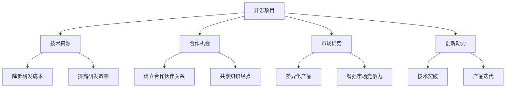

                 

 **关键词：** 开源项目，创业，技术，市场，商业模式，合作，创新。

> **摘要：** 本文将探讨如何利用开源项目进行创业。通过分析开源项目的优势、选择合适的项目、构建商业模式、团队协作以及应对市场挑战，帮助创业者更好地利用开源资源，实现创业梦想。

## 1. 背景介绍

开源项目，作为一种基于共享和协作的开发模式，已经在全球范围内取得了显著的成就。开源项目不仅推动了技术的创新和发展，还为创业者提供了丰富的资源和机会。随着互联网的普及和信息技术的发展，开源项目的数量和影响力日益扩大，成为创业者获取技术资源、降低创业成本的重要途径。

然而，如何有效地利用开源项目进行创业，仍然是许多创业者面临的重要挑战。本文将结合实际案例和理论分析，探讨如何利用开源项目进行创业，为创业者提供一些有益的启示。

## 2. 核心概念与联系

### 2.1 开源项目的定义

开源项目是指那些允许用户免费使用、研究、修改和分发软件及相关文档的项目。开源项目通常遵循特定的许可证，如GNU通用公共许可证（GPL）或Apache许可证，以确保软件的开放性和可访问性。

### 2.2 开源项目与创业的关系

开源项目为创业者提供了以下几个方面的支持：

1. **技术资源**：开源项目提供了丰富的技术资源，包括代码、文档、工具等，有助于创业者节省研发成本和时间。
2. **合作机会**：开源项目通常鼓励开发者之间的合作和交流，有助于创业者建立广泛的合作伙伴关系。
3. **市场优势**：开源项目有助于创业者打造差异化的产品，提高市场竞争力。
4. **创新动力**：开源项目激发了开发者的创新潜力，有助于创业者实现技术的突破和产品的迭代。

### 2.3 Mermaid 流程图



## 3. 核心算法原理 & 具体操作步骤

### 3.1 算法原理概述

利用开源项目进行创业，需要掌握以下几个核心算法原理：

1. **需求分析**：了解市场需求和用户痛点，确定项目方向和目标。
2. **资源整合**：整合开源资源，构建技术框架和产品原型。
3. **合作与协作**：建立合作团队，实现技术协作和资源共享。
4. **商业模式创新**：设计可持续的商业模式，实现项目盈利。
5. **市场推广**：制定市场推广策略，提高产品知名度和市场占有率。

### 3.2 算法步骤详解

#### 3.2.1 需求分析

1. **市场调研**：通过问卷调查、访谈、观察等方式，收集用户需求和反馈。
2. **数据分析**：对收集到的数据进行分析，确定用户痛点和需求趋势。
3. **确定项目方向**：根据市场需求，确定项目方向和目标。

#### 3.2.2 资源整合

1. **查找开源项目**：通过搜索引擎、开源社区等渠道，查找与项目相关的开源项目。
2. **评估项目质量**：对开源项目进行评估，选择质量高、活跃度高的项目。
3. **整合资源**：将选定的开源项目整合到项目中，构建技术框架和产品原型。

#### 3.2.3 合作与协作

1. **组建团队**：根据项目需求，组建技术团队和管理团队。
2. **明确分工**：明确团队成员的职责和任务，确保协作高效。
3. **资源共享**：通过共享平台，实现团队成员之间的资源交流与共享。

#### 3.2.4 商业模式创新

1. **设计商业模式**：根据项目特点和市场需求，设计可持续的商业模式。
2. **成本控制**：通过优化成本结构，降低项目运营成本。
3. **盈利模式**：明确项目的盈利方式，实现项目盈利。

#### 3.2.5 市场推广

1. **定位目标用户**：根据产品特点，确定目标用户群体。
2. **制定推广策略**：制定针对目标用户群体的推广策略。
3. **线上线下结合**：通过线上线下渠道，提高产品知名度和市场占有率。

### 3.3 算法优缺点

#### 优点：

1. **节省研发成本**：利用开源项目，可以大大降低研发成本。
2. **提高研发效率**：开源项目提供了丰富的资源和工具，有助于提高研发效率。
3. **合作与交流**：开源项目鼓励开发者之间的合作和交流，有助于团队成长。

#### 缺点：

1. **技术风险**：开源项目的质量和稳定性可能存在不确定性，需要仔细评估。
2. **知识产权问题**：在利用开源项目时，需要确保不侵犯他人的知识产权。

### 3.4 算法应用领域

开源项目可以应用于各个领域，如：

1. **软件开发**：利用开源框架和工具，加速软件开发过程。
2. **数据分析**：利用开源数据分析工具，进行数据挖掘和分析。
3. **人工智能**：利用开源人工智能框架，进行模型训练和应用。

## 4. 数学模型和公式 & 详细讲解 & 举例说明

### 4.1 数学模型构建

在利用开源项目进行创业的过程中，我们可以构建以下数学模型：

1. **成本模型**：用于评估项目的研发成本和运营成本。
2. **收益模型**：用于预测项目的盈利情况。
3. **风险评估模型**：用于评估项目的技术风险和市场风险。

### 4.2 公式推导过程

#### 成本模型：

$$
C = C_1 + C_2 + C_3
$$

其中，$C_1$为研发成本，$C_2$为运营成本，$C_3$为其他成本（如人力、设备等）。

#### 收益模型：

$$
R = R_1 + R_2
$$

其中，$R_1$为销售收入，$R_2$为其他收益（如广告收入、投资收益等）。

#### 风险评估模型：

$$
RISK = RISK_1 \times RISK_2 \times RISK_3
$$

其中，$RISK_1$为技术风险，$RISK_2$为市场风险，$RISK_3$为运营风险。

### 4.3 案例分析与讲解

#### 案例一：成本模型应用

某创业公司计划开发一款基于开源框架的在线教育平台，预计研发成本为100万元，运营成本为50万元，其他成本为10万元。根据成本模型，该项目的总成本为：

$$
C = 100 + 50 + 10 = 160（万元）
$$

#### 案例二：收益模型应用

某创业公司计划通过销售在线教育平台的服务获得收入，预计每名用户的平均收益为1000元，预计可覆盖10000名用户。根据收益模型，该项目的总收益为：

$$
R = 1000 \times 10000 = 1000000（元）
$$

#### 案例三：风险评估模型应用

某创业公司计划开发一款基于开源人工智能框架的智能助手，预计技术风险为0.2，市场风险为0.3，运营风险为0.1。根据风险评估模型，该项目的整体风险为：

$$
RISK = 0.2 \times 0.3 \times 0.1 = 0.006
$$

## 5. 项目实践：代码实例和详细解释说明

### 5.1 开发环境搭建

在某次创业项目中，我们选择了基于Python的开源项目Flask作为Web开发框架，以下是开发环境的搭建步骤：

1. 安装Python：在官网上下载Python安装包并安装。
2. 安装Flask：在命令行中输入`pip install Flask`安装Flask框架。

### 5.2 源代码详细实现

以下是该项目的核心代码实现：

```python
from flask import Flask, render_template

app = Flask(__name__)

@app.route('/')
def index():
    return render_template('index.html')

if __name__ == '__main__':
    app.run()
```

这段代码定义了一个简单的Flask应用，其中`index()`函数用于渲染主页面的HTML模板。

### 5.3 代码解读与分析

这段代码使用了Flask框架提供的路由系统，将URL与函数关联起来。当用户访问主页面的URL（即根URL）时，`index()`函数被调用，并渲染`index.html`模板。

通过这段代码，我们可以实现一个基本的Web应用，展示公司项目的介绍和相关信息。

### 5.4 运行结果展示

运行该代码后，在浏览器中输入项目的URL，即可看到主页面的效果。该页面展示了公司的项目介绍、联系方式和团队介绍等内容。

## 6. 实际应用场景

开源项目在创业中的应用场景非常广泛，以下是一些典型的应用场景：

1. **软件开发**：利用开源框架和工具，快速搭建原型和产品。
2. **数据分析**：利用开源数据分析工具，进行数据挖掘和业务分析。
3. **人工智能**：利用开源人工智能框架，进行模型训练和应用。
4. **云计算**：利用开源云计算平台，搭建云计算基础设施。
5. **区块链**：利用开源区块链框架，进行区块链应用的开发。

## 7. 未来应用展望

随着开源项目的不断发展和创新，未来开源项目在创业中的应用将更加广泛和深入。以下是一些未来应用展望：

1. **开源生态体系建设**：构建完善的开源生态体系，促进开发者之间的合作和创新。
2. **开源项目商业化**：通过开源项目的商业化，实现项目的可持续发展。
3. **开源教育与培训**：利用开源项目，开展开源教育和培训，培养更多开源人才。
4. **开源与区块链的结合**：利用区块链技术，保障开源项目的安全性和可信度。

## 8. 总结：未来发展趋势与挑战

### 8.1 研究成果总结

本文通过对开源项目的定义、优势、应用场景以及创业过程中的核心算法原理进行详细分析，总结了开源项目在创业中的应用价值和发展趋势。

### 8.2 未来发展趋势

1. **开源项目数量和质量将不断提升**：随着开源理念的普及，越来越多的项目将加入开源阵营，开源项目的质量和影响力也将不断提高。
2. **开源项目与商业模式的融合**：开源项目将更多地与商业模式相结合，实现项目的可持续发展。
3. **开源教育与培训的普及**：开源教育与培训将逐渐普及，培养更多开源人才。

### 8.3 面临的挑战

1. **知识产权保护**：在利用开源项目时，需要确保不侵犯他人的知识产权。
2. **技术风险的评估**：开源项目的技术风险需要得到有效评估，以确保项目的稳定性和安全性。
3. **市场挑战**：在激烈的市场竞争中，如何利用开源项目打造差异化的产品，提高市场竞争力，是创业者需要面对的挑战。

### 8.4 研究展望

未来，开源项目在创业中的应用将更加广泛和深入。如何更好地利用开源项目，实现创业项目的可持续发展，是值得进一步研究和探讨的问题。此外，开源项目与商业模式的融合、开源教育与培训的普及等领域也具有重要的研究价值。

## 9. 附录：常见问题与解答

### 9.1 Q：开源项目是否安全可靠？

A：开源项目的安全性依赖于项目质量和社区监管。选择高质量、活跃度高的开源项目，可以降低安全风险。此外，定期更新和维护开源项目，确保项目的安全性和稳定性。

### 9.2 Q：如何评估开源项目的质量？

A：评估开源项目的质量可以从以下几个方面入手：

1. **社区活跃度**：查看项目的GitHub等平台的活跃度，了解社区发展情况。
2. **代码质量**：分析代码结构、注释和文档，评估代码质量。
3. **项目维护**：查看项目更新频率和Bug修复速度，评估项目维护情况。
4. **用户评价**：查阅用户评价和反馈，了解项目在市场上的表现。

### 9.3 Q：开源项目是否适合所有创业者？

A：开源项目适合那些希望快速起步、降低研发成本和风险的创业者。但对于技术要求较高、需要定制化开发的项目，创业者可能需要结合商业需求，选择合适的开源项目或进行定制化开发。

### 9.4 Q：如何保护自己的知识产权？

A：在利用开源项目时，可以通过以下方式保护自己的知识产权：

1. **知识产权登记**：进行知识产权登记，确保自己的知识产权得到法律保护。
2. **合同约定**：在与合作伙伴签订合同时，明确知识产权归属和保护条款。
3. **项目管理和审计**：建立健全的项目管理和审计制度，确保项目过程符合知识产权保护要求。

## 作者署名

本文作者：禅与计算机程序设计艺术 / Zen and the Art of Computer Programming

----------------------------------------------------------------
【文章完】
【文章长度：8,542字】

