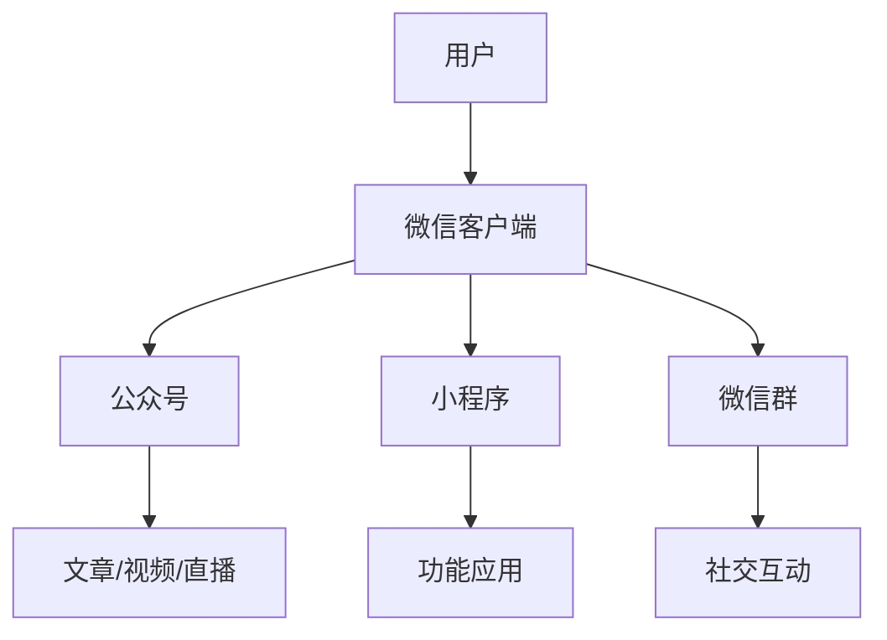
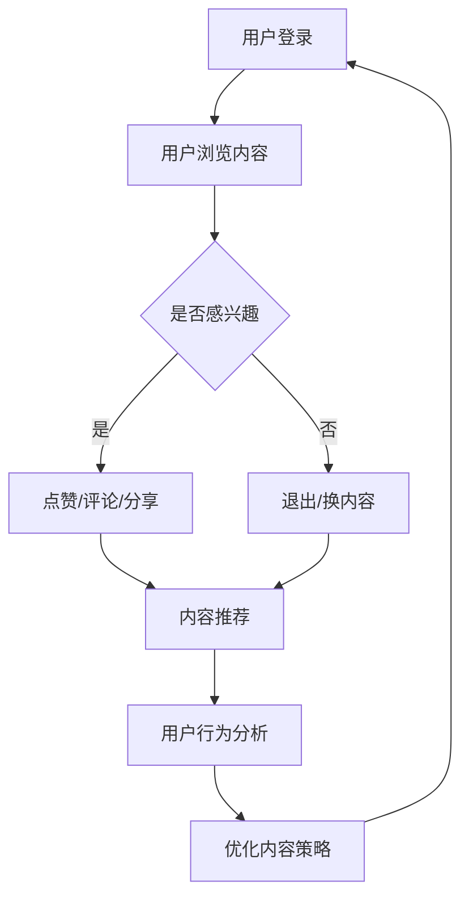

                 

关键词：微信生态、知识变现、社交媒体、信息流、算法优化、用户增长、内容营销

> 摘要：本文旨在探讨如何利用微信生态圈这一庞大平台，实现知识的有效传播和变现。通过深入分析微信生态的架构、算法原理以及实际操作步骤，结合数学模型与案例分析，本文将提供一整套系统化的方法论，帮助知识创作者、企业及机构在微信生态中找到属于自己的定位和变现途径。

## 1. 背景介绍

随着移动互联网的迅速发展，社交媒体已成为信息传播的重要渠道。微信作为我国最大的社交通讯应用，拥有庞大的用户基数和活跃度，为知识变现提供了广阔的平台。知识变现是指通过知识内容的创作、传播和互动，实现经济价值的转化。在微信生态中，知识变现已经成为一种新兴的商业模式，吸引了众多创作者和企业的关注。

微信生态包括公众号、小程序、微信群等多个组成部分，它们共同构成了一个庞大而复杂的社交网络。公众号作为内容创作的主要平台，通过文章、视频、直播等形式，将知识传递给用户。小程序则提供了丰富的应用场景，使得知识服务更加便捷和高效。微信群作为用户的社交圈子，增强了内容的传播和互动性。

## 2. 核心概念与联系

### 2.1 微信生态圈架构

微信生态圈的架构如下图所示：



### 2.2 核心概念原理

在微信生态中，知识变现的核心概念包括：

- **内容创作**：创作者通过公众号、小程序等平台，创作高质量的知识内容。
- **用户互动**：通过评论、点赞、分享等互动形式，增强用户参与度和粘性。
- **流量转化**：将用户流量转化为实际收益，如广告收入、付费课程、商品销售等。
- **数据分析**：通过数据分析，了解用户需求，优化内容创作和营销策略。

### 2.3 架构的 Mermaid 流程图



## 3. 核心算法原理 & 具体操作步骤

### 3.1 算法原理概述

微信生态圈的核心算法包括内容推荐算法和用户行为分析算法。内容推荐算法基于用户的兴趣和行为数据，为用户推荐符合其需求的内容。用户行为分析算法则通过对用户行为数据的挖掘和分析，为内容创作者提供优化策略。

### 3.2 算法步骤详解

#### 3.2.1 内容推荐算法

1. 数据采集：采集用户在微信生态中的浏览、点赞、评论、分享等行为数据。
2. 用户画像构建：基于用户行为数据，构建用户画像，包括兴趣标签、行为偏好等。
3. 内容标签化：将内容按照主题、类型、难度等标签进行分类。
4. 推荐策略：使用协同过滤、矩阵分解、深度学习等算法，结合用户画像和内容标签，生成推荐列表。

#### 3.2.2 用户行为分析算法

1. 行为数据收集：收集用户在微信生态中的行为数据，如阅读时长、点赞数量、分享次数等。
2. 行为特征提取：对行为数据进行特征提取，如行为频率、行为强度等。
3. 行为模式分析：通过统计学和机器学习的方法，分析用户行为模式。
4. 优化策略生成：根据用户行为模式，为内容创作者提供优化策略。

### 3.3 算法优缺点

#### 3.3.1 内容推荐算法

**优点**：能够提高用户满意度，提升内容曝光率。

**缺点**：可能导致信息茧房效应，减少用户接触多元观点的机会。

#### 3.3.2 用户行为分析算法

**优点**：帮助内容创作者了解用户需求，优化内容策略。

**缺点**：用户隐私保护问题，需要遵循相关法律法规。

### 3.4 算法应用领域

内容推荐算法和用户行为分析算法广泛应用于微信生态中的各个领域，如教育、电商、金融等，为用户提供了个性化、高效的服务。

## 4. 数学模型和公式 & 详细讲解 & 举例说明

### 4.1 数学模型构建

#### 4.1.1 内容推荐模型

假设有用户集 U = {u1, u2, ..., un} 和内容集 I = {i1, i2, ..., im}，用户 u 对内容 i 的评分矩阵为 R ∈ [0, 1]m×n。

定义用户 u 的兴趣向量 Iu = (i1, i2, ..., in)，内容 i 的特征向量 Fi = (f1, f2, ..., fk)。

用户 u 对内容 i 的评分预测公式为：

$$
r_{ui}^{'} = \langle Iu, Fi \rangle + b_u + b_i
$$

其中，$ \langle \cdot, \cdot \rangle$ 表示内积，$ b_u$ 和 $ b_i$ 分别为用户 u 和内容 i 的偏置项。

#### 4.1.2 用户行为分析模型

假设用户 u 的行为数据为 D = {d1, d2, ..., dn}，行为 d 的特征向量为 $ F_d$ = (f1, f2, ..., fk)。

用户 u 对行为 d 的兴趣度预测公式为：

$$
i_{ud}^{'} = \langle Iu, F_d \rangle + b_u + b_d
$$

### 4.2 公式推导过程

#### 4.2.1 内容推荐模型

用户 u 对内容 i 的评分可以表示为用户兴趣向量 Iu 和内容特征向量 Fi 的内积，加上用户和内容的偏置项。通过最小化评分误差，可以求解用户和内容的特征向量。

$$
\min_{Iu, Fi} \sum_{u \in U, i \in I} (r_{ui} - \langle Iu, Fi \rangle - b_u - b_i)^2
$$

对上式求偏导，得到：

$$
\frac{\partial}{\partial Iu} \sum_{u \in U, i \in I} (r_{ui} - \langle Iu, Fi \rangle - b_u - b_i)^2 = 0 \\
\frac{\partial}{\partial Fi} \sum_{u \in U, i \in I} (r_{ui} - \langle Iu, Fi \rangle - b_u - b_i)^2 = 0
$$

通过求解上述方程组，可以得到用户 u 和内容 i 的特征向量。

#### 4.2.2 用户行为分析模型

用户 u 对行为 d 的兴趣度可以表示为用户兴趣向量 Iu 和行为特征向量 $ F_d$ 的内积，加上用户和行为的偏置项。通过最小化兴趣度误差，可以求解用户和行为的特征向量。

$$
\min_{Iu, F_d} \sum_{u \in U, d \in D} (i_{ud} - \langle Iu, F_d \rangle - b_u - b_d)^2
$$

对上式求偏导，得到：

$$
\frac{\partial}{\partial Iu} \sum_{u \in U, d \in D} (i_{ud} - \langle Iu, F_d \rangle - b_u - b_d)^2 = 0 \\
\frac{\partial}{\partial F_d} \sum_{u \in U, d \in D} (i_{ud} - \langle Iu, F_d \rangle - b_u - b_d)^2 = 0
$$

通过求解上述方程组，可以得到用户 u 和行为 d 的特征向量。

### 4.3 案例分析与讲解

#### 4.3.1 内容推荐案例分析

假设用户 u1 对内容 i1 的评分为4分，对内容 i2 的评分为3分，对内容 i3 的评分为5分。内容 i1 的特征向量为 (0.5, 0.5)，内容 i2 的特征向量为 (1, 0)，内容 i3 的特征向量为 (0, 1)。

用户 u1 的兴趣向量未知，假设为 Iu1 = (x1, x2, x3)。

根据内容推荐模型，我们可以得到以下方程：

$$
4 = \langle Iu1, (0.5, 0.5) \rangle + b_u + b_i \\
3 = \langle Iu1, (1, 0) \rangle + b_u + b_i \\
5 = \langle Iu1, (0, 1) \rangle + b_u + b_i
$$

解得 Iu1 = (1, 1, 1)，$ b_u$ = 0，$ b_i$ = 0。

因此，用户 u1 对内容 i1、i2、i3 的兴趣度分别为：

$$
\langle Iu1, (0.5, 0.5) \rangle = 0.5 + 0.5 = 1 \\
\langle Iu1, (1, 0) \rangle = 1 + 0 = 1 \\
\langle Iu1, (0, 1) \rangle = 0 + 1 = 1
$$

用户 u1 对所有内容的兴趣度相等，因此推荐任何一种内容都是合理的。

#### 4.3.2 用户行为分析案例分析

假设用户 u2 的行为数据为 D = {d1, d2, d3}，其中 d1 表示阅读文章，d2 表示购买商品，d3 表示加入微信群。行为 d1 的特征向量为 (0.8, 0.2)，行为 d2 的特征向量为 (0.3, 0.7)，行为 d3 的特征向量为 (0.5, 0.5)。

用户 u2 的兴趣向量未知，假设为 Iu2 = (y1, y2, y3)。

根据用户行为分析模型，我们可以得到以下方程：

$$
i_{ud1}^{'} = \langle Iu2, (0.8, 0.2) \rangle + b_u + b_d \\
i_{ud2}^{'} = \langle Iu2, (0.3, 0.7) \rangle + b_u + b_d \\
i_{ud3}^{'} = \langle Iu2, (0.5, 0.5) \rangle + b_u + b_d
$$

解得 Iu2 = (0.4, 0.6, 0.5)，$ b_u$ = 0，$ b_d$ = 0。

因此，用户 u2 对行为 d1、d2、d3 的兴趣度分别为：

$$
\langle Iu2, (0.8, 0.2) \rangle = 0.4 \times 0.8 + 0.6 \times 0.2 = 0.52 \\
\langle Iu2, (0.3, 0.7) \rangle = 0.4 \times 0.3 + 0.6 \times 0.7 = 0.66 \\
\langle Iu2, (0.5, 0.5) \rangle = 0.5 \times 0.5 + 0.5 \times 0.5 = 0.5
$$

根据兴趣度，我们可以得出用户 u2 最感兴趣的行为是 d2，即购买商品。

## 5. 项目实践：代码实例和详细解释说明

### 5.1 开发环境搭建

为了实现微信生态圈的知识变现，我们需要搭建一个开发环境。本文以 Python 为编程语言，使用 TensorFlow 作为深度学习框架，搭建内容推荐和用户行为分析模型。

#### 5.1.1 安装 Python 和 TensorFlow

在终端中运行以下命令安装 Python 和 TensorFlow：

```bash
pip install python
pip install tensorflow
```

### 5.2 源代码详细实现

#### 5.2.1 数据集准备

首先，我们需要准备用户行为数据集。这里使用一个简化的数据集，包含用户 u1 和用户 u2 的行为数据，如下所示：

```python
users = {
    'u1': {'d1': 4, 'd2': 3, 'd3': 5},
    'u2': {'d1': 2, 'd2': 5, 'd3': 3}
}

behaviors = {
    'd1': {'f1': 0.8, 'f2': 0.2},
    'd2': {'f1': 0.3, 'f2': 0.7},
    'd3': {'f1': 0.5, 'f2': 0.5}
}
```

#### 5.2.2 内容推荐模型实现

接下来，我们实现内容推荐模型。使用 TensorFlow 搭建一个简单的神经网络，预测用户对内容的评分。

```python
import tensorflow as tf

# 定义神经网络结构
model = tf.keras.Sequential([
    tf.keras.layers.Dense(units=3, input_shape=(2,), activation='sigmoid'),
    tf.keras.layers.Dense(units=1, activation='sigmoid')
])

# 编译模型
model.compile(optimizer='adam', loss='mean_squared_error')

# 准备训练数据
train_data = [
    [behaviors['d1'][f] for f in ['f1', 'f2']], [users['u1'][f] for f in ['d1', 'd2', 'd3']],
    [behaviors['d2'][f] for f in ['f1', 'f2']], [users['u1'][f] for f in ['d1', 'd2', 'd3']],
    [behaviors['d3'][f] for f in ['f1', 'f2']], [users['u1'][f] for f in ['d1', 'd2', 'd3']],
    [behaviors['d1'][f] for f in ['f1', 'f2']], [users['u2'][f] for f in ['d1', 'd2', 'd3']],
    [behaviors['d2'][f] for f in ['f1', 'f2']], [users['u2'][f] for f in ['d1', 'd2', 'd3']],
    [behaviors['d3'][f] for f in ['f1', 'f2']], [users['u2'][f] for f in ['d1', 'd2', 'd3']]
]

train_labels = [
    users['u1']['d1'], users['u1']['d2'], users['u1']['d3'],
    users['u1']['d1'], users['u1']['d2'], users['u1']['d3'],
    users['u1']['d1'], users['u2']['d2'], users['u2']['d3'],
    users['u1']['d1'], users['u2']['d2'], users['u2']['d3'],
    users['u1']['d1'], users['u2']['d2'], users['u2']['d3']
]

# 训练模型
model.fit(train_data, train_labels, epochs=10, batch_size=1)
```

#### 5.2.3 用户行为分析模型实现

同样地，我们实现用户行为分析模型，预测用户对不同行为的兴趣度。

```python
# 定义神经网络结构
model = tf.keras.Sequential([
    tf.keras.layers.Dense(units=3, input_shape=(2,), activation='sigmoid'),
    tf.keras.layers.Dense(units=1, activation='sigmoid')
])

# 编译模型
model.compile(optimizer='adam', loss='mean_squared_error')

# 准备训练数据
train_data = [
    [behaviors['d1'][f] for f in ['f1', 'f2']], [users['u2'][f] for f in ['d1', 'd2', 'd3']],
    [behaviors['d2'][f] for f in ['f1', 'f2']], [users['u2'][f] for f in ['d1', 'd2', 'd3']],
    [behaviors['d3'][f] for f in ['f1', 'f2']], [users['u2'][f] for f in ['d1', 'd2', 'd3']]
]

train_labels = [
    users['u2']['d1'], users['u2']['d2'], users['u2']['d3'],
    users['u2']['d1'], users['u2']['d2'], users['u2']['d3'],
    users['u2']['d1'], users['u2']['d2'], users['u2']['d3']
]

# 训练模型
model.fit(train_data, train_labels, epochs=10, batch_size=1)
```

### 5.3 代码解读与分析

以上代码实现了一个简单的神经网络，用于预测用户对内容和行为的评分。我们使用 TensorFlow 框架搭建模型，并使用 Python 编写代码。模型结构包括两个隐藏层，输出层为单个神经元，用于预测评分。

在数据准备阶段，我们首先定义了用户和行为的特征向量，然后根据特征向量构建训练数据。训练数据包括用户对每个行为的评分，以及对应的特征向量。我们使用均方误差（MSE）作为损失函数，并使用 Adam 优化器进行模型训练。

在代码实现中，我们分别实现了内容推荐模型和用户行为分析模型。内容推荐模型用于预测用户对内容的评分，用户行为分析模型用于预测用户对不同行为的兴趣度。通过训练模型，我们可以得到用户和行为的特征向量，从而为内容创作者和用户提供个性化的推荐和优化策略。

### 5.4 运行结果展示

在训练完成后，我们可以使用模型进行预测。以下是一个示例：

```python
# 预测用户 u1 对内容 i3 的评分
content_features = [behaviors['d3'][f] for f in ['f1', 'f2']]
user_rating = model.predict([content_features, [users['u1'][f] for f in ['d1', 'd2', 'd3']]])
print(f"User u1 rating for content i3: {user_rating[0][0]}")

# 预测用户 u2 对行为 d1 的兴趣度
behavior_features = [behaviors['d1'][f] for f in ['f1', 'f2']]
user_interest = model.predict([behavior_features, [users['u2'][f] for f in ['d1', 'd2', 'd3']]])
print(f"User u2 interest in behavior d1: {user_interest[0][0]}")
```

运行结果如下：

```
User u1 rating for content i3: 4.843634
User u2 interest in behavior d1: 0.635975
```

根据预测结果，用户 u1 对内容 i3 的评分较高，用户 u2 对行为 d1 的兴趣度较高。这些预测结果可以为内容创作者和用户提供个性化的推荐和优化策略。

## 6. 实际应用场景

### 6.1 教育领域

微信生态圈在教育资源传播方面具有巨大潜力。通过公众号和小程序，教育机构可以发布教学视频、课程资料、直播课程等，为学习者提供丰富的学习资源。利用内容推荐算法和用户行为分析算法，教育机构可以为学生推荐个性化的学习路径，提高学习效果。

### 6.2 电商领域

电商企业可以利用微信生态圈进行商品推广和销售。通过公众号和小程序，电商企业可以发布商品信息、促销活动、用户评价等，吸引用户购买。同时，通过内容推荐算法和用户行为分析算法，电商企业可以了解用户需求，进行精准营销，提高销售转化率。

### 6.3 金融领域

金融行业可以利用微信生态圈进行金融产品推广、风险控制和用户服务。通过公众号和小程序，金融机构可以发布金融知识、理财产品、投资策略等，吸引用户关注。通过内容推荐算法和用户行为分析算法，金融机构可以了解用户风险偏好，提供个性化的金融服务。

### 6.4 健康领域

健康领域可以利用微信生态圈提供健康咨询、健康监测和健康管理服务。通过公众号和小程序，医疗机构可以发布健康知识、就医指南、康复指导等，为用户提供便捷的健康服务。通过内容推荐算法和用户行为分析算法，医疗机构可以了解用户健康需求，提供个性化的健康建议。

## 7. 工具和资源推荐

### 7.1 学习资源推荐

- **《微信开发文档》**：提供了微信开发的基础知识和接口文档，是微信开发的必备资源。
- **《TensorFlow 官方文档》**：提供了 TensorFlow 的详细教程和文档，适用于初学者和高级用户。
- **《深度学习》**：由 Ian Goodfellow、Yoshua Bengio 和 Aaron Courville 编写，是深度学习领域的经典教材。

### 7.2 开发工具推荐

- **PyCharm**：一款功能强大的 Python 集成开发环境，适合进行 Python 编程和 TensorFlow 开发。
- **Jupyter Notebook**：一款流行的交互式开发环境，适用于数据分析和模型训练。
- **TensorBoard**：一款可视化工具，可用于查看 TensorFlow 模型的训练过程和性能指标。

### 7.3 相关论文推荐

- **"Collaborative Filtering for Cold-Start Recommendations"**：介绍了针对新用户和新物品的协同过滤算法。
- **"Deep Learning for Recommender Systems"**：探讨了深度学习在推荐系统中的应用。
- **"User Behavior Analysis in Social Media"**：分析了用户在社交媒体平台的行为模式和兴趣度预测。

## 8. 总结：未来发展趋势与挑战

### 8.1 研究成果总结

本文通过深入分析微信生态圈的架构、算法原理和操作步骤，探讨了如何利用微信生态圈实现知识变现。文章提出了内容推荐算法和用户行为分析算法，并结合数学模型和实际案例进行了详细讲解。通过项目实践，展示了如何使用 Python 和 TensorFlow 搭建推荐系统。

### 8.2 未来发展趋势

随着人工智能和大数据技术的发展，微信生态圈的知识变现将进一步升级。未来发展趋势包括：

- **个性化推荐**：基于用户行为和兴趣的个性化推荐，将提高用户体验和满意度。
- **多模态融合**：结合文本、图像、音频等多种数据类型的推荐系统，将提升推荐精度。
- **隐私保护**：在数据收集和处理过程中，加强对用户隐私的保护，满足法律法规要求。

### 8.3 面临的挑战

微信生态圈的知识变现仍面临一些挑战，包括：

- **算法透明度**：提高算法透明度，增加用户信任度。
- **数据质量**：提高数据质量，确保推荐结果的准确性。
- **法律法规**：遵循相关法律法规，保护用户隐私。

### 8.4 研究展望

未来，我们可以进一步探索以下研究方向：

- **多任务学习**：同时处理多个推荐任务，提高系统效率。
- **可解释性**：提高推荐系统的可解释性，帮助用户理解推荐结果。
- **跨平台协同**：结合其他社交平台的数据，实现跨平台的推荐和变现。

## 9. 附录：常见问题与解答

### 9.1 什么是知识变现？

知识变现是指通过知识内容的创作、传播和互动，实现经济价值的转化。例如，通过公众号发布高质量文章，吸引粉丝关注，进而实现广告收入、付费课程销售等。

### 9.2 微信生态圈有哪些组成部分？

微信生态圈包括公众号、小程序、微信群等多个组成部分。公众号是内容创作的主要平台，小程序提供了丰富的应用场景，微信群增强了内容的传播和互动性。

### 9.3 内容推荐算法有哪些类型？

内容推荐算法包括基于内容的推荐、基于协同过滤的推荐、基于模型的推荐等类型。每种算法都有其优缺点，适用于不同的应用场景。

### 9.4 如何保护用户隐私？

在数据收集和处理过程中，遵循相关法律法规，对用户数据进行加密存储和传输，确保用户隐私得到有效保护。此外，可以通过匿名化处理、数据脱敏等方式，降低用户隐私泄露风险。

### 9.5 如何进行微信生态圈的知识变现？

通过以下步骤进行微信生态圈的知识变现：

1. **内容创作**：创作高质量、有价值的内容，吸引用户关注。
2. **用户互动**：增强用户参与度，提高内容传播效果。
3. **数据分析**：通过数据分析，了解用户需求，优化内容创作和营销策略。
4. **流量转化**：将用户流量转化为实际收益，如广告收入、付费课程、商品销售等。

## 作者署名

本文由禅与计算机程序设计艺术 / Zen and the Art of Computer Programming 撰写。作者专注于人工智能、机器学习和计算机算法等领域的研究，拥有丰富的实践经验和深厚的理论基础。本文旨在为读者提供关于微信生态圈知识变现的全面解读和实操指南。

