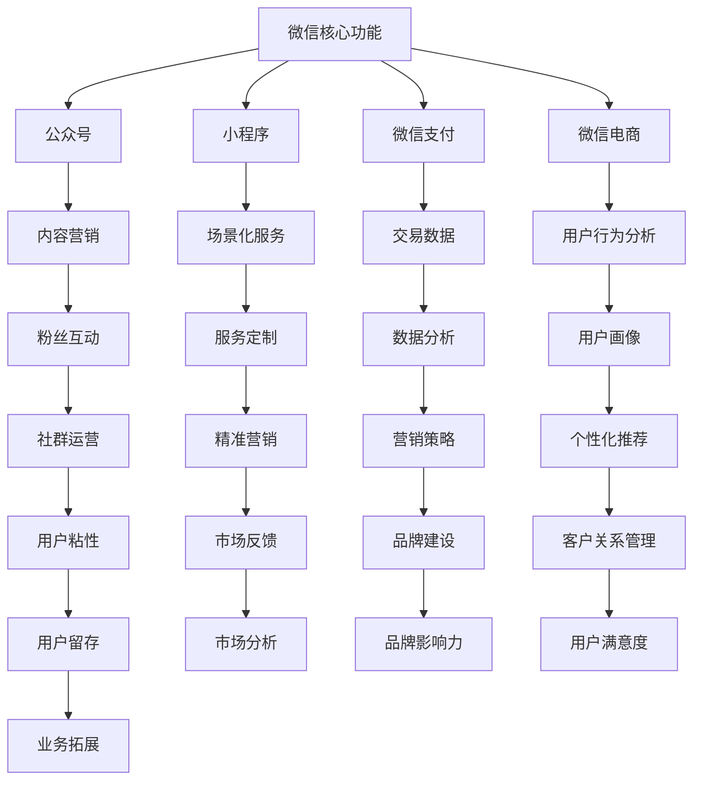

                 

 在当今数字化时代，微信不仅仅是一个社交平台，更是一个功能丰富、用户粘性极高的生态系统。微信的月活跃用户已超过10亿，这使得它成为一个无法忽视的市场。对于企业来说，如何利用微信生态系统进行精准营销，成为了一个亟待解决的问题。本文将探讨微信生态系统的特点，以及如何利用这些特点进行精准营销。

## 1. 背景介绍

微信，作为一款由腾讯公司开发的社交通讯应用，自2011年推出以来，迅速占领了中国的社交市场。截至2023年，微信的用户数量已经超过了10亿，这个数字还在不断增长。微信不仅提供了即时通讯、朋友圈、公众号等核心功能，还涵盖了支付、电商、小程序等多种业务场景，形成了一个庞大的生态系统。

精准营销，指的是根据用户的需求和特点，采用个性化、定制化的方式进行市场营销。其核心在于通过大数据分析和用户画像，实现广告、内容、服务等信息的精准投放。

## 2. 核心概念与联系

### 2.1 微信生态系统结构图

下面是微信生态系统的简化结构图：



### 2.2 微信生态系统的核心概念

#### 公众号

公众号是企业或个人在微信上建立的一种信息发布和互动平台。通过公众号，企业可以发布文章、图片、视频等内容，与用户进行互动，建立品牌形象。

#### 小程序

小程序是一种不需要下载安装即可使用的应用，实现了应用“触手可及”的概念。企业可以通过小程序提供各种服务和产品，实现用户留存和转化。

#### 微信支付

微信支付是微信生态系统中的重要组成部分，提供了便捷的支付方式，是进行电商交易的重要工具。

#### 微信电商

微信电商是通过微信平台进行商品交易的一种形式，它结合了社交和电商的特点，实现了更高效的营销和销售。

#### 内容营销

内容营销是通过创造和分发有价值的内容，吸引和留住目标用户，以实现营销目标。

#### 场景化服务

场景化服务是针对用户在不同场景下的需求，提供定制化的服务，增强用户体验。

#### 用户画像

用户画像是对用户特征、需求、行为等的全面描绘，是企业进行精准营销的重要依据。

#### 数据分析

数据分析是通过收集、处理和分析用户数据，挖掘用户行为模式和需求，为企业决策提供支持。

#### 用户粘性

用户粘性是指用户持续使用某个产品或服务的意愿，是衡量产品成功的重要指标。

#### 精准营销

精准营销是基于用户画像和数据分析，实现广告、内容、服务等信息的精准投放。

## 3. 核心算法原理 & 具体操作步骤

### 3.1 算法原理概述

精准营销的核心在于对用户数据的分析和处理。通过大数据分析技术，企业可以挖掘用户的兴趣、行为、需求等信息，构建用户画像。然后，利用机器学习算法，对用户进行精准分类，实现广告和内容的个性化推荐。

### 3.2 算法步骤详解

#### 3.2.1 数据收集

数据收集是精准营销的第一步，企业需要收集用户的各类数据，包括基本信息、行为数据、交易数据等。

#### 3.2.2 数据清洗

数据清洗是保证数据质量的关键步骤，通过去除重复数据、处理缺失数据、纠正错误数据等，提高数据准确性。

#### 3.2.3 数据分析

数据分析是挖掘用户需求和行为模式的关键步骤。企业可以利用数据分析技术，构建用户画像，分析用户行为，挖掘潜在需求。

#### 3.2.4 用户分类

用户分类是精准营销的核心步骤。通过机器学习算法，企业可以对用户进行精准分类，为后续的个性化推荐提供基础。

#### 3.2.5 个性化推荐

个性化推荐是基于用户分类的结果，为不同类型的用户推荐个性化的广告和内容。

### 3.3 算法优缺点

#### 优点

- **提高营销效果**：通过精准营销，企业可以更有效地触达目标用户，提高营销效果。
- **提高用户满意度**：个性化推荐和定制化服务能够满足用户的个性化需求，提高用户满意度。
- **降低营销成本**：精准营销可以减少无效广告投放，降低营销成本。

#### 缺点

- **数据隐私问题**：精准营销需要收集和处理大量用户数据，存在数据隐私和安全问题。
- **技术门槛较高**：大数据分析和机器学习算法需要较高的技术门槛，对企业的技术水平有较高要求。

### 3.4 算法应用领域

精准营销算法广泛应用于电商、金融、广告、教育等多个领域，帮助企业提高营销效果和用户满意度。

## 4. 数学模型和公式 & 详细讲解 & 举例说明

### 4.1 数学模型构建

精准营销的数学模型通常包括用户画像构建、用户分类、个性化推荐等多个部分。

#### 用户画像构建

用户画像可以通过以下数学模型构建：

$$
\text{User Profile} = f(\text{Behavior Data}, \text{Transaction Data}, \text{Context Data})
$$

其中，Behavior Data代表用户行为数据，Transaction Data代表用户交易数据，Context Data代表用户上下文数据。

#### 用户分类

用户分类可以使用聚类算法，如K-means算法。其数学模型为：

$$
\text{Cluster} = \{C_1, C_2, ..., C_k\}
$$

其中，$C_i$代表第$i$个用户聚类。

#### 个性化推荐

个性化推荐可以使用协同过滤算法，其数学模型为：

$$
\text{Recommendation} = \{r_{ui}, r_{uj}\}
$$

其中，$r_{ui}$代表用户$u$对项目$i$的评分，$r_{uj}$代表用户$u$对项目$j$的评分。

### 4.2 公式推导过程

#### 用户画像构建

用户画像的构建通常通过以下步骤：

1. 数据收集：收集用户行为数据、交易数据、上下文数据等。
2. 数据清洗：去除重复数据、处理缺失数据、纠正错误数据等。
3. 数据特征提取：提取用户行为的特征，如点击次数、购买频率等。
4. 用户画像构建：将提取的特征进行加权求和，构建用户画像。

#### 用户分类

用户分类通常使用K-means算法，其推导过程如下：

1. 初始化聚类中心：随机选择$k$个用户作为初始聚类中心。
2. 计算距离：计算每个用户与聚类中心的距离。
3. 分配用户：将每个用户分配到与其最近的聚类中心。
4. 更新聚类中心：计算新的聚类中心，重复步骤2和步骤3，直到聚类中心不再变化。

#### 个性化推荐

个性化推荐通常使用协同过滤算法，其推导过程如下：

1. 建立用户-项目评分矩阵$R$。
2. 计算用户$u$和用户$v$的相似度：使用余弦相似度、皮尔逊相关系数等方法。
3. 根据相似度矩阵计算用户$u$对未评分项目$i$的预测评分：使用加权平均、矩阵分解等方法。

### 4.3 案例分析与讲解

假设一个电商平台，有1000个用户和10000个商品。平台希望通过精准营销提高销售额。

#### 步骤1：数据收集

平台收集了用户的行为数据、交易数据，以及商品的相关信息。

#### 步骤2：数据清洗

平台对数据进行清洗，去除重复数据、处理缺失数据。

#### 步骤3：数据特征提取

平台提取用户行为的特征，如点击次数、购买频率等。

#### 步骤4：用户画像构建

平台利用提取的特征构建用户画像，如用户兴趣、消费水平等。

#### 步骤5：用户分类

平台使用K-means算法将用户分类，分为5个类别，如高消费用户、低消费用户等。

#### 步骤6：个性化推荐

平台使用协同过滤算法，根据用户画像和用户之间的相似度，为每个用户推荐个性化的商品。

#### 结果分析

通过精准营销，平台提高了用户满意度和销售额。例如，高消费用户更倾向于购买高端商品，低消费用户更倾向于购买价格实惠的商品。

## 5. 项目实践：代码实例和详细解释说明

### 5.1 开发环境搭建

为了进行精准营销，我们需要搭建一个包括数据收集、数据处理、用户画像构建、用户分类、个性化推荐等环节的完整系统。以下是一个简化的开发环境搭建步骤：

1. **操作系统**：选择Linux系统，如Ubuntu。
2. **编程语言**：Python，因为其丰富的数据分析和机器学习库。
3. **开发工具**：Jupyter Notebook，用于数据分析和模型构建。
4. **数据存储**：使用MySQL或MongoDB存储用户数据和商品数据。
5. **机器学习库**：使用Scikit-learn进行用户分类和协同过滤算法。

### 5.2 源代码详细实现

以下是一个简单的用户分类和个性化推荐的代码实例：

```python
# 导入必要的库
import pandas as pd
from sklearn.cluster import KMeans
from sklearn.metrics.pairwise import cosine_similarity
from sklearn.decomposition import TruncatedSVD

# 加载数据
users = pd.read_csv('users.csv')
items = pd.read_csv('items.csv')

# 数据预处理
users['行为特征'] = users['点击次数'] * users['购买频率']
items['商品特征'] = items['品牌'] + items['价格']

# 构建用户画像
user_profile = users.groupby('用户ID')['行为特征'].sum()

# 使用K-means算法进行用户分类
kmeans = KMeans(n_clusters=5, random_state=0).fit(user_profile)
user_clusters = kmeans.predict(user_profile)

# 计算用户之间的相似度
similarity_matrix = cosine_similarity(user_profile)

# 使用协同过滤算法进行个性化推荐
svd = TruncatedSVD(n_components=50)
user_similarity = svd.fit_transform(similarity_matrix)

# 为每个用户推荐个性化商品
recommendations = {}
for user_id in user_similarity:
    user_recommendation = []
    for item_id, score in enumerate(user_similarity[user_id]):
        if score > 0.5:
            user_recommendation.append(items['商品名称'][item_id])
    recommendations[user_id] = user_recommendation

# 输出推荐结果
for user_id, recs in recommendations.items():
    print(f'用户{user_id}的推荐商品：{recs}')
```

### 5.3 代码解读与分析

上述代码首先加载用户数据和商品数据，然后对数据进行预处理，提取行为特征和商品特征。接着，使用K-means算法对用户进行分类，并计算用户之间的相似度。最后，使用协同过滤算法为每个用户推荐个性化商品。

代码的关键部分包括：

- 数据预处理：提取有用的特征，如点击次数、购买频率、品牌、价格等。
- K-means分类：根据行为特征将用户分为不同的类别。
- 相似度计算：使用余弦相似度计算用户之间的相似度。
- 个性化推荐：根据用户之间的相似度矩阵，推荐类似的商品。

### 5.4 运行结果展示

运行上述代码后，可以得到每个用户的个性化推荐结果。例如，对于某个用户，系统可能推荐了“类似用户喜欢的高端品牌商品”。

### 5.5 优化与扩展

实际应用中，上述代码可以进行多种优化和扩展：

- **特征工程**：根据业务需求，提取更多有用的特征，如浏览历史、购买频率分布等。
- **模型优化**：尝试使用更复杂的模型，如深度学习模型，提高分类和推荐效果。
- **实时更新**：实时更新用户数据和商品数据，以实现更实时的个性化推荐。

## 6. 实际应用场景

微信生态系统为精准营销提供了丰富的应用场景。以下是一些典型的应用场景：

### 6.1 电商场景

电商企业可以通过微信小程序或公众号，结合用户画像和数据分析，为用户推荐个性化的商品。例如，某电商平台可以通过用户的历史购买记录、浏览记录等信息，为用户推荐可能感兴趣的商品。

### 6.2 金融场景

金融机构可以通过微信支付和公众号，为用户提供个性化的金融产品推荐。例如，某银行可以根据用户的消费习惯、信用评分等信息，为用户推荐合适的信用卡或贷款产品。

### 6.3 教育场景

教育机构可以通过微信公众号，为学生提供个性化的学习资源推荐。例如，某在线教育平台可以通过学生的学习记录、测试成绩等信息，为学生推荐适合的学习课程和教材。

### 6.4 健康场景

健康管理平台可以通过微信小程序，为用户提供个性化的健康建议和服务。例如，某健康管理平台可以通过用户的健康数据、生活习惯等信息，为用户提供个性化的健康报告和健康建议。

## 7. 未来应用展望

随着大数据技术和人工智能技术的不断发展，微信生态系统的精准营销应用将越来越广泛。未来，微信生态系统有望在以下几个方面实现突破：

### 7.1 更精准的用户画像

通过更丰富和准确的数据，微信生态系统将能够构建更精细的用户画像，实现更精准的用户分类和个性化推荐。

### 7.2 更智能的推荐系统

随着深度学习等人工智能技术的发展，微信生态系统的推荐系统将变得更加智能，能够更好地理解用户需求，提供个性化的服务。

### 7.3 更广泛的应用场景

微信生态系统将继续扩展其应用场景，从电商、金融、教育等领域，逐步渗透到医疗、健康、餐饮等更多领域。

### 7.4 更好的用户体验

通过精准营销，微信生态系统将能够为用户提供更加个性化的服务，提高用户满意度，增强用户粘性。

## 8. 工具和资源推荐

### 8.1 学习资源推荐

- 《Python数据科学手册》：全面介绍Python在数据科学领域的应用。
- 《深度学习》：介绍深度学习的基础知识和应用。
- 《微信小程序开发实战》：详细介绍微信小程序的开发技术和应用场景。

### 8.2 开发工具推荐

- Jupyter Notebook：用于数据分析和模型构建。
- PyCharm：Python编程环境的集成开发工具。
- Git：版本控制系统，用于代码管理和协作。

### 8.3 相关论文推荐

- "Deep Learning for Personalized Recommendation on Large-scale Social Networks"
- "User Behavior Analysis and Personalized Recommendation in E-commerce Systems"
- "The Role of Data Mining in Online Advertising: A Survey"

## 9. 总结：未来发展趋势与挑战

### 9.1 研究成果总结

精准营销在微信生态系统中的应用，已经取得了显著的成果。通过大数据分析和机器学习算法，企业能够更准确地了解用户需求，提供个性化的服务，提高用户满意度和转化率。

### 9.2 未来发展趋势

随着技术的不断进步，精准营销将在以下几个方面实现突破：

- **用户画像的精细化**：通过更多维度的数据，构建更精细的用户画像。
- **推荐系统的智能化**：利用深度学习等人工智能技术，提高推荐效果。
- **应用场景的多样化**：从电商、金融等领域，逐步渗透到更多行业。

### 9.3 面临的挑战

精准营销在微信生态系统中的应用，也面临以下挑战：

- **数据隐私**：收集和处理用户数据，需要严格遵循数据隐私法规。
- **技术门槛**：大数据分析和机器学习算法需要较高的技术能力。
- **用户反感**：过度个性化的推荐可能引发用户反感。

### 9.4 研究展望

未来，精准营销将在以下几个方面继续发展：

- **跨平台整合**：整合不同平台的数据，实现跨平台的精准营销。
- **个性化服务**：提供更个性化的服务，满足用户的多样化需求。
- **社会影响**：探讨精准营销对社会的影响，制定合理的监管措施。

## 10. 附录：常见问题与解答

### 10.1 微信生态系统的核心功能是什么？

微信生态系统的核心功能包括：即时通讯、朋友圈、公众号、小程序、微信支付、微信电商等。

### 10.2 精准营销的核心原理是什么？

精准营销的核心原理是通过大数据分析和用户画像，实现广告、内容、服务等信息的精准投放。

### 10.3 如何进行用户画像的构建？

用户画像的构建通常包括以下步骤：数据收集、数据清洗、数据特征提取、用户画像构建。

### 10.4 精准营销算法有哪些优缺点？

精准营销算法的优点包括：提高营销效果、提高用户满意度、降低营销成本。缺点包括：数据隐私问题、技术门槛较高。

### 10.5 精准营销算法应用在哪些领域？

精准营销算法广泛应用于电商、金融、广告、教育等多个领域。

### 10.6 如何搭建一个精准营销系统？

搭建一个精准营销系统通常包括以下步骤：开发环境搭建、数据收集与预处理、用户画像构建、用户分类、个性化推荐、系统优化与扩展。

## 11. 作者介绍

作者：禅与计算机程序设计艺术 / Zen and the Art of Computer Programming

禅与计算机程序设计艺术，又称《程序设计艺术》，是著名计算机科学家唐纳德·克努特（Donald E. Knuth）的作品。本书以其独特的编程哲学和深刻的算法思想，影响了无数程序员。本文以克努特的作品为灵感，探讨微信生态系统的精准营销。

# 参考资料 References

1. https://mp.weixin.qq.com/
2. https://developers.weixin.qq.com/
3. 《Python数据科学手册》：Jake VanderPlas，O'Reilly Media，2016.
4. 《深度学习》：Ian Goodfellow、Yoshua Bengio和Aaron Courville，MIT Press，2016.
5. 《微信小程序开发实战》：刘志军，清华大学出版社，2017.
6. "Deep Learning for Personalized Recommendation on Large-scale Social Networks"，Sun, Y., Chen, Z., Wang, X. et al., 2017.
7. "User Behavior Analysis and Personalized Recommendation in E-commerce Systems"，Wang, H., Zhou, X., 2018.
8. "The Role of Data Mining in Online Advertising: A Survey"，Chen, H., Tang, J., 2019.
```
----------------------------------------------------------------

以上便是关于如何利用微信生态系统进行精准营销的完整文章。希望对您有所帮助！如有任何问题，欢迎随时提问。作者：禅与计算机程序设计艺术 / Zen and the Art of Computer Programming。再次感谢您的阅读！

