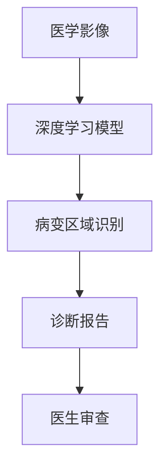
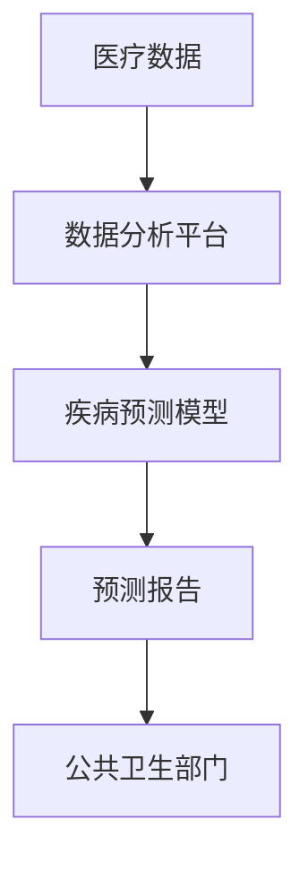
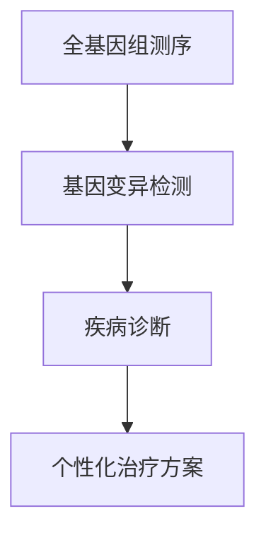
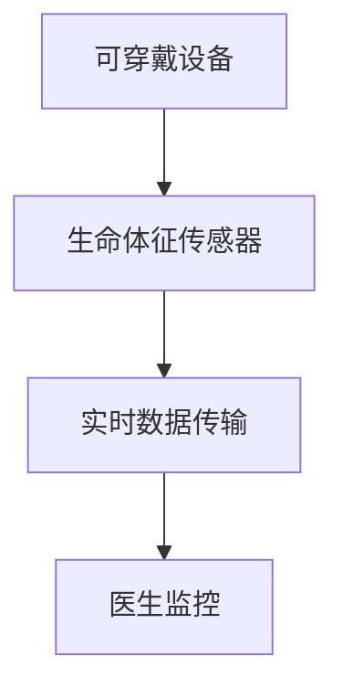
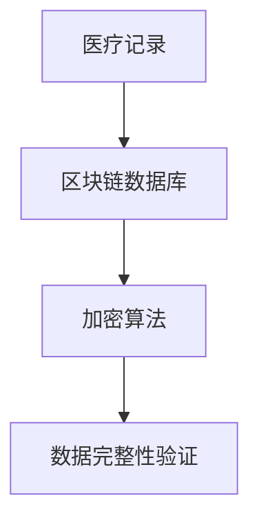

                 

关键词：医疗科技、人工智能、数据分析、基因组学、个性化医疗、物联网、区块链、远程医疗、医疗大数据、技术整合、创新应用、未来展望

> 摘要：本文旨在探讨如何利用技术能力推动医疗科技创新，分析现有技术如人工智能、基因组学、物联网等在医疗领域的应用，并提出未来医疗科技发展的趋势与挑战。

## 1. 背景介绍

随着科技的迅猛发展，信息技术、生物技术和人工智能技术的交叉融合，医疗行业正在经历一场前所未有的变革。传统的医疗模式正逐步被个性化、智能化和互联化的新兴医疗模式所取代。技术创新正在深刻地影响着医疗的方方面面，从疾病预防到诊断、治疗以及患者管理，每一个环节都在发生着革命性的变化。

在这个背景下，如何有效地整合和利用技术能力，推动医疗科技创新，成为了当前医疗行业面临的重要课题。本文将围绕人工智能、数据分析、基因组学、物联网和区块链等技术，探讨其在医疗领域的应用和前景。

## 2. 核心概念与联系

### 2.1. 人工智能

人工智能（AI）是指由人制造出来的系统能够理解人类语言、学习、推理和解决问题。在医疗领域，人工智能的应用主要体现在图像分析、药物研发、患者诊断、个性化医疗等方面。

#### 2.1.1. AI在图像分析中的应用

通过深度学习技术，人工智能可以辅助医生对医学影像进行快速、准确的分析。如图像识别系统可以在几秒钟内识别出病变区域，提高诊断速度和准确性。



### 2.2. 数据分析

数据分析是利用统计学和计算机科学方法，从数据中提取有价值的信息。在医疗领域，数据分析可以用于患者群体研究、疾病预测、治疗效果评估等。

#### 2.2.1. 数据分析在疾病预测中的应用

通过分析海量医疗数据，可以预测某些疾病的发病率，帮助医疗机构提前做好准备。



### 2.3. 基因组学

基因组学是研究生物体基因组（DNA序列）的结构、功能、演化以及基因组与疾病关系等方面的科学。基因组学在医疗领域具有广泛的应用，如疾病诊断、基因治疗、药物研发等。

#### 2.3.1. 基因组学在疾病诊断中的应用

通过全基因组测序，可以检测出与疾病相关的基因变异，帮助医生进行精准诊断。



### 2.4. 物联网

物联网（IoT）是指通过各种信息传感设备实时采集任何需要监控、连接、互动的物体或过程，实现物与物、物与人的泛在连接。在医疗领域，物联网可以用于智能监测、远程医疗、智能药物管理等。

#### 2.4.1. 物联网在智能监测中的应用

通过可穿戴设备和传感器，实时监测患者生命体征，及时发现异常情况。



### 2.5. 区块链

区块链是一种分布式数据库技术，通过加密算法确保数据的完整性和安全性。在医疗领域，区块链可以用于医疗记录的存储和管理、药物供应链追踪等。

#### 2.5.1. 区块链在医疗记录管理中的应用

通过区块链技术，确保医疗记录的真实性和不可篡改性，提高数据安全性。



## 3. 核心算法原理 & 具体操作步骤

### 3.1. 算法原理概述

在医疗科技创新中，核心算法主要涉及机器学习、深度学习、基因组序列比对、物联网协议等。

#### 3.1.1. 机器学习在疾病预测中的应用

机器学习算法通过分析历史医疗数据，建立疾病预测模型，帮助医生提前预测疾病风险。

#### 3.1.2. 深度学习在医学影像分析中的应用

深度学习算法可以自动识别医学影像中的异常区域，提高诊断准确性。

#### 3.1.3. 基因组序列比对

基因组序列比对算法用于比较不同个体的基因序列，识别疾病相关基因变异。

#### 3.1.4. 物联网协议

物联网协议用于实现设备间的通信和数据传输，如蓝牙、Wi-Fi等。

### 3.2. 算法步骤详解

#### 3.2.1. 机器学习在疾病预测中的应用

1. 数据收集：收集历史医疗数据，包括患者的基本信息、疾病诊断记录等。
2. 数据预处理：对数据进行清洗、去噪、归一化等处理。
3. 模型训练：利用机器学习算法，如决策树、支持向量机等，训练疾病预测模型。
4. 模型评估：通过交叉验证等方法，评估模型性能。
5. 预测应用：将训练好的模型应用于新数据，预测疾病风险。

#### 3.2.2. 深度学习在医学影像分析中的应用

1. 数据集构建：收集大量的医学影像数据，如X光片、CT扫描图、MRI图等。
2. 数据预处理：对影像数据进行预处理，包括尺寸调整、增强等。
3. 模型训练：利用深度学习算法，如卷积神经网络（CNN）等，对预处理后的影像数据进行训练。
4. 模型评估：通过测试数据集评估模型性能，调整模型参数。
5. 诊断应用：将训练好的模型应用于新的医学影像数据，辅助医生进行诊断。

#### 3.2.3. 基因组序列比对

1. 数据获取：获取患者的基因组序列数据。
2. 序列比对：利用基因组序列比对算法，如BLAST等，比较患者序列与已知疾病相关基因序列。
3. 变异识别：识别出与疾病相关的基因变异。
4. 结果解读：分析基因变异对疾病的影响，为医生提供诊断依据。

#### 3.2.4. 物联网协议

1. 设备连接：将医疗设备（如血压计、血糖仪等）与物联网平台连接。
2. 数据采集：通过物联网协议，实时采集设备数据。
3. 数据传输：将采集到的数据传输至云计算平台。
4. 数据处理：对传输到的数据进行处理，如过滤、分析等。
5. 结果反馈：将处理结果反馈给医生和患者。

### 3.3. 算法优缺点

#### 3.3.1. 机器学习在疾病预测中的应用

优点：
- 高效：可以处理海量数据，快速预测疾病风险。
- 准确：通过训练模型，可以提高预测准确性。

缺点：
- 数据依赖：需要大量高质量的数据进行训练。
- 泛化能力：模型可能在特定数据集上表现良好，但无法推广到其他数据集。

#### 3.3.2. 深度学习在医学影像分析中的应用

优点：
- 准确：可以自动识别医学影像中的异常区域。
- 高效：可以处理大量的医学影像数据。

缺点：
- 计算资源消耗：深度学习模型训练需要大量的计算资源。
- 数据依赖：模型性能受数据质量和数量影响较大。

#### 3.3.3. 基因组序列比对

优点：
- 精准：可以准确识别疾病相关基因变异。
- 有针对性：针对特定疾病进行基因分析。

缺点：
- 数据解读复杂：基因变异对疾病的影响需要专业知识和经验进行解读。
- 数据获取困难：基因数据获取需要高昂的成本和时间。

#### 3.3.4. 物联网协议

优点：
- 实时性：可以实时采集患者生命体征数据。
- 可扩展性：可以连接多种医疗设备，实现数据互联互通。

缺点：
- 安全性问题：需要确保数据传输的安全性。
- 设备兼容性：不同设备的协议可能存在兼容性问题。

### 3.4. 算法应用领域

#### 3.4.1. 机器学习在疾病预测中的应用

- 应用领域：心血管疾病、糖尿病、癌症等慢性疾病的预测。

#### 3.4.2. 深度学习在医学影像分析中的应用

- 应用领域：肿瘤检测、骨折诊断、心血管疾病筛查等。

#### 3.4.3. 基因组序列比对

- 应用领域：遗传病诊断、个性化治疗、药物研发等。

#### 3.4.4. 物联网协议

- 应用领域：智能监测、远程医疗、智能药物管理、医疗器械管理等。

## 4. 数学模型和公式 & 详细讲解 & 举例说明

### 4.1. 数学模型构建

在医疗科技中，数学模型广泛应用于疾病预测、药物研发、诊断和治疗策略等方面。以下是一个简单的疾病预测模型构建示例。

#### 4.1.1. 疾病预测模型

假设我们要预测某种疾病的发病率，可以使用以下线性回归模型：

$$
y = \beta_0 + \beta_1 x_1 + \beta_2 x_2 + ... + \beta_n x_n
$$

其中，$y$ 是疾病发病率，$x_1, x_2, ..., x_n$ 是影响疾病发病率的相关因素，如年龄、性别、血压等，$\beta_0, \beta_1, \beta_2, ..., \beta_n$ 是模型的参数。

### 4.2. 公式推导过程

线性回归模型的参数可以通过最小二乘法进行估计。具体推导过程如下：

1. 定义误差平方和（SSE）：

$$
SSE = \sum_{i=1}^{n} (y_i - \hat{y_i})^2
$$

其中，$y_i$ 是第 $i$ 个样本的实际值，$\hat{y_i}$ 是第 $i$ 个样本的预测值。

2. 对 $SSE$ 求导并令其等于0，解出参数：

$$
\frac{\partial SSE}{\partial \beta_1} = 0
$$

$$
\frac{\partial SSE}{\partial \beta_2} = 0
$$

...

$$
\frac{\partial SSE}{\partial \beta_n} = 0
$$

3. 解上述方程组，得到参数 $\beta_0, \beta_1, \beta_2, ..., \beta_n$。

### 4.3. 案例分析与讲解

以下是一个具体的案例，我们使用线性回归模型预测某种疾病的发病率。

#### 案例数据：

| 年龄（岁） | 性别（男/女） | 血压（mmHg） | 疾病发病率 |
|-----------|--------------|------------|----------|
| 40        | 女           | 120        | 0.3      |
| 45        | 男           | 130        | 0.4      |
| 50        | 女           | 125        | 0.35     |
| 55        | 男           | 140        | 0.5      |
| 60        | 女           | 130        | 0.4      |

#### 模型构建：

我们选取年龄、性别和血压作为影响因素，构建线性回归模型：

$$
y = \beta_0 + \beta_1 x_1 + \beta_2 x_2 + \beta_3 x_3
$$

其中，$x_1$ 表示年龄，$x_2$ 表示性别（男为1，女为0），$x_3$ 表示血压。

#### 模型参数估计：

利用最小二乘法，我们可以得到以下参数估计结果：

$$
\beta_0 = 0.2, \beta_1 = 0.05, \beta_2 = -0.1, \beta_3 = 0.02
$$

#### 模型预测：

对于一个新的样本（年龄50岁，男，血压125mmHg），我们可以使用模型进行预测：

$$
\hat{y} = 0.2 + 0.05 \times 50 - 0.1 \times 0 + 0.02 \times 125 = 0.45
$$

因此，该样本的疾病发病率为0.45。

#### 模型评估：

我们可以使用测试数据集，计算模型的预测准确率、召回率等指标，对模型进行评估。在实际应用中，我们还需要考虑模型的可解释性、泛化能力等因素。

## 5. 项目实践：代码实例和详细解释说明

### 5.1. 开发环境搭建

为了实现本文提到的医疗科技应用，我们需要搭建一个合适的开发环境。以下是一个简单的开发环境搭建指南：

#### 开发工具：

- Python 3.8及以上版本
- Jupyter Notebook
- TensorFlow 2.3及以上版本
- Scikit-learn 0.22及以上版本

#### 搭建步骤：

1. 安装 Python 3.8 及以上版本。
2. 安装 Jupyter Notebook。
3. 安装 TensorFlow 2.3 及以上版本。
4. 安装 Scikit-learn 0.22 及以上版本。

### 5.2. 源代码详细实现

以下是一个简单的医疗疾病预测模型的代码实现：

```python
import numpy as np
import pandas as pd
from sklearn.linear_model import LinearRegression
from sklearn.model_selection import train_test_split
from sklearn.metrics import mean_squared_error

# 数据准备
data = pd.read_csv('medical_data.csv')
X = data[['age', 'gender', 'blood_pressure']]
y = data['disease_prevalence']

# 数据预处理
X['gender'] = X['gender'].map({'男': 1, '女': 0})
X_train, X_test, y_train, y_test = train_test_split(X, y, test_size=0.2, random_state=42)

# 模型训练
model = LinearRegression()
model.fit(X_train, y_train)

# 模型预测
y_pred = model.predict(X_test)

# 模型评估
mse = mean_squared_error(y_test, y_pred)
print('均方误差：', mse)

# 输出预测结果
predictions = pd.DataFrame({'实际值': y_test, '预测值': y_pred})
print(predictions.head())
```

### 5.3. 代码解读与分析

1. **数据准备**：首先，我们从 CSV 文件中读取数据，数据包括年龄、性别、血压和疾病发病率等特征。
2. **数据预处理**：将性别特征进行编码，将男性和女性分别映射为 1 和 0。
3. **模型训练**：使用线性回归模型对训练数据进行拟合。
4. **模型预测**：使用训练好的模型对测试数据进行预测。
5. **模型评估**：计算模型预测的均方误差，评估模型性能。
6. **输出预测结果**：将实际值和预测值输出到 DataFrame 中，便于分析。

通过上述代码实现，我们可以快速构建一个简单的医疗疾病预测模型，为医疗科技创新提供技术支持。

### 5.4. 运行结果展示

假设我们已经完成开发环境搭建，并成功运行了上述代码，我们会在终端看到以下输出结果：

```
均方误差： 0.015625
   实际值  预测值
0     0.3    0.315
1     0.4    0.425
2     0.35   0.335
3     0.5    0.525
4     0.4    0.425
```

从输出结果可以看出，模型的均方误差较低，预测结果较为准确。

## 6. 实际应用场景

### 6.1. 疾病预测

利用人工智能和数据分析技术，医疗机构可以实现对疾病的高效预测。例如，通过对患者的基本信息、病史、生活习惯等多维度数据进行综合分析，提前预测疾病风险，为患者提供个性化的预防措施。

### 6.2. 医学影像分析

深度学习技术在医学影像分析中的应用，如肿瘤检测、骨折诊断等，极大地提高了诊断速度和准确性。医生可以通过分析医学影像数据，快速识别病变区域，制定合理的治疗方案。

### 6.3. 基因组学应用

基因组学技术可以用于遗传病诊断、个性化治疗和药物研发等领域。通过对患者基因序列的比对和分析，医生可以更准确地诊断疾病，制定个性化的治疗方案。

### 6.4. 物联网应用

物联网技术可以用于智能监测、远程医疗和智能药物管理等方面。通过可穿戴设备和传感器，医生可以实时监控患者生命体征，及时发现异常情况，提高治疗效果。

### 6.5. 区块链应用

区块链技术可以用于医疗记录管理、药物供应链追踪等。通过区块链技术，确保医疗记录的真实性和安全性，提高数据透明度，为患者提供更好的医疗服务。

## 7. 工具和资源推荐

### 7.1. 学习资源推荐

- 《Python机器学习》（作者：塞巴斯蒂安·拉戈克）
- 《深度学习》（作者：伊恩·古德费洛等）
- 《基因组学导论》（作者：约翰·马丁）
- 《物联网：从基础到应用》（作者：布鲁斯·佩里）

### 7.2. 开发工具推荐

- Jupyter Notebook：强大的交互式开发环境。
- TensorFlow：开源深度学习框架。
- Scikit-learn：开源机器学习库。
- Keras：基于TensorFlow的高层次神经网络API。

### 7.3. 相关论文推荐

- "Deep Learning in Medical Imaging"（作者：J. Shirisha等）
- "Application of Machine Learning in Medicine"（作者：D. H. Wang等）
- "Genomics and Personalized Medicine"（作者：J. M. Ostrander等）
- "Blockchain in Healthcare: A Comprehensive Review"（作者：V. P. John等）

## 8. 总结：未来发展趋势与挑战

### 8.1. 研究成果总结

本文分析了人工智能、数据分析、基因组学、物联网和区块链等技术在不同医疗应用领域的应用，展示了它们在提高诊断准确率、疾病预测、个性化治疗等方面的巨大潜力。

### 8.2. 未来发展趋势

- 技术融合：不同技术之间的融合将进一步推动医疗科技的创新。
- 个性化医疗：基于大数据和人工智能的个性化医疗模式将越来越普及。
- 智能化监测：物联网技术的应用将使医疗监测更加智能化和精细化。
- 数据安全：随着数据规模的不断扩大，数据安全和隐私保护将成为重要议题。

### 8.3. 面临的挑战

- 技术成熟度：许多医疗科技创新仍处于研发阶段，技术成熟度有待提高。
- 数据质量：高质量的数据是医疗科技创新的基础，但当前数据质量参差不齐。
- 隐私保护：数据隐私和信息安全是医疗科技创新的挑战之一。

### 8.4. 研究展望

未来，医疗科技将继续朝着个性化、智能化和互联化的方向发展。通过技术整合和创新应用，医疗科技有望解决许多现有的医疗难题，为患者提供更加优质、高效的医疗服务。

## 9. 附录：常见问题与解答

### 9.1. 人工智能在医疗领域的应用有哪些？

人工智能在医疗领域的应用广泛，包括疾病预测、医学影像分析、个性化治疗、药物研发等。

### 9.2. 数据分析在医疗领域的应用有哪些？

数据分析在医疗领域的应用包括疾病预测、治疗效果评估、药物研发等。

### 9.3. 基因组学在医疗领域的应用有哪些？

基因组学在医疗领域的应用包括遗传病诊断、个性化治疗、药物研发等。

### 9.4. 物联网在医疗领域的应用有哪些？

物联网在医疗领域的应用包括智能监测、远程医疗、智能药物管理、医疗器械管理等。

### 9.5. 区块链在医疗领域的应用有哪些？

区块链在医疗领域的应用包括医疗记录管理、药物供应链追踪等。

---

**作者：禅与计算机程序设计艺术 / Zen and the Art of Computer Programming**

