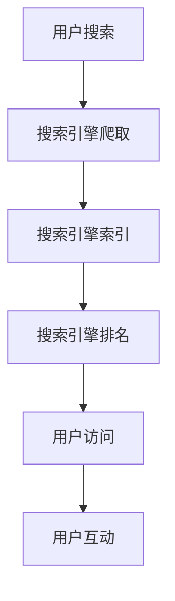

                 

关键词：搜索引擎优化（SEO），有机流量，网站排名，关键词研究，内容优化，技术优化，移动优化，用户体验

> 摘要：本文旨在探讨如何通过搜索引擎优化（SEO）策略提升网站的有机流量。我们将深入分析SEO的核心概念、关键技术和实际应用场景，提供详细的操作步骤和实用工具，帮助您打造一个优化且高效的搜索引擎友好网站。

## 1. 背景介绍

搜索引擎优化（SEO）是指通过一系列策略和技巧，提升网站在搜索引擎结果页（SERP）中的排名，从而增加有机流量。SEO的目标是提高网站的可发现性，使得潜在客户更容易找到相关内容。

在数字营销中，SEO是一个至关重要的组成部分。随着互联网用户数量的不断增长，竞争也愈发激烈。一个优化良好的网站能够显著提高品牌曝光度、增加访问量，并最终转化为商业价值。

SEO的核心包括以下几个方面：

- **关键词研究**：了解用户搜索习惯，找到目标关键词。
- **内容优化**：为网站提供高质量、有价值的内容，吸引读者。
- **技术优化**：确保网站结构和代码质量，提高搜索引擎抓取和索引效率。
- **用户体验**：优化网站设计，提升用户留存率和互动性。

本文将围绕这些核心概念，详细介绍SEO的策略和技术，并提供实际操作指导。

## 2. 核心概念与联系

为了更好地理解SEO，我们需要首先了解几个核心概念，包括搜索引擎的工作原理、SEO的目标以及SEO与网站性能之间的关系。

### 2.1 搜索引擎的工作原理

搜索引擎通过以下步骤为用户提供搜索结果：

1. **爬取**：搜索引擎的爬虫程序遍历互联网，抓取网页内容。
2. **索引**：爬虫抓取的内容被整理成索引，以供搜索时快速检索。
3. **排名**：搜索引擎根据一系列算法对网页进行排序，提供最佳匹配结果。

### 2.2 SEO的目标

SEO的主要目标是提升网站在搜索引擎结果页中的排名，从而增加访问量和转化率。具体目标包括：

- **提高有机流量**：吸引更多的用户通过搜索引擎访问网站。
- **增强品牌知名度**：通过提升网站排名，提高品牌曝光度。
- **提高用户留存率**：优化网站结构和内容，提高用户体验。
- **降低营销成本**：相对于付费广告，SEO是一种更为经济的营销策略。

### 2.3 SEO与网站性能之间的关系

SEO不仅仅关乎网站在搜索引擎中的排名，还与网站的整体性能密切相关。以下是SEO与网站性能之间的几个关键联系：

- **网站结构**：良好的网站结构有助于搜索引擎更好地理解网站内容和导航。
- **页面加载速度**：快速加载的页面能够提高用户留存率，同时也有助于搜索引擎排名。
- **移动优化**：随着移动设备的普及，搜索引擎对移动友好的网站给予更高的权重。
- **安全性**：确保网站使用HTTPS协议，可以提高信任度和搜索引擎排名。

### 2.4 Mermaid流程图

为了更直观地理解SEO的核心概念，我们使用Mermaid流程图来展示SEO的工作流程。



## 3. 核心算法原理 & 具体操作步骤

### 3.1 算法原理概述

搜索引擎优化（SEO）的核心算法是基于一系列复杂的排名信号和指标，这些信号和指标共同决定了网页在搜索结果中的排名。以下是几个关键的SEO算法原理：

1. **关键词匹配**：搜索引擎通过关键词匹配来决定哪个页面最适合特定搜索查询。
2. **内容质量**：高质量的内容被认为是更有价值的，因此更有可能获得更高的排名。
3. **外部链接**：外部链接被视为投票，指向您的网站的链接越多，搜索引擎认为您的网站越受认可。
4. **用户互动**：用户行为信号，如点击率（CTR）、页面停留时间等，也是影响排名的重要因素。
5. **技术因素**：网站的技术性能，如页面加载速度、移动友好性、安全性等，也会影响排名。

### 3.2 算法步骤详解

#### 3.2.1 关键词研究

关键词研究是SEO的第一步，它涉及到以下几个关键步骤：

1. **确定目标关键词**：通过分析竞争对手和用户搜索习惯，确定潜在的目标关键词。
2. **关键词分析**：使用工具（如Google关键词规划师）来评估关键词的搜索量、竞争程度和商业价值。
3. **关键词分布**：将关键词合理分布在网站的各个页面，以提高匹配度。

#### 3.2.2 内容优化

内容优化是SEO的核心，它包括以下几个关键步骤：

1. **创建高质量内容**：确保内容有价值、原创且针对目标关键词。
2. **优化标题和描述**：使用目标关键词优化页面标题和元描述，以提高点击率。
3. **内链策略**：在内容中合理使用内链，提高页面之间的相关性。

#### 3.2.3 技术优化

技术优化涉及到以下几个方面：

1. **网站结构**：确保网站结构清晰、逻辑性强，方便搜索引擎爬取和索引。
2. **页面加载速度**：优化图片、脚本和样式表，提高页面加载速度。
3. **移动优化**：确保网站在移动设备上表现良好，提供流畅的用户体验。

#### 3.2.4 外部链接建设

外部链接建设是提高网站权威性和排名的关键因素，以下是一些常用策略：

1. **内容营销**：通过创建高质量的内容，吸引其他网站链接到您的网站。
2. **社交媒体**：积极参与社交媒体活动，提高网站曝光度。
3. **合作与交换**：与其他网站建立合作关系，进行链接交换。

### 3.3 算法优缺点

#### 优点

- **提高网站排名**：通过SEO优化，可以显著提高网站在搜索引擎结果页中的排名，增加访问量。
- **提高用户留存率**：优化网站结构和内容，提供更好的用户体验，提高用户留存率。
- **长期效果**：SEO是一个长期的过程，一旦优化效果建立，可以持续带来流量。

#### 缺点

- **时间成本**：SEO需要时间和精力，尤其是初期，效果可能不会立即显现。
- **竞争激烈**：热门关键词的竞争非常激烈，需要投入更多资源和策略来获得排名。
- **算法变化**：搜索引擎的算法不断更新，SEO策略需要不断调整以适应变化。

### 3.4 算法应用领域

SEO的应用领域非常广泛，以下是一些主要的应用场景：

- **电子商务**：通过SEO优化，提高产品页面的排名，吸引更多潜在客户。
- **企业品牌**：通过SEO提升品牌知名度，增加品牌曝光度。
- **内容平台**：通过SEO优化，提高文章和视频的排名，吸引更多流量。
- **在线教育**：通过SEO优化，提高课程和教学资源的排名，吸引更多学生。

## 4. 数学模型和公式 & 详细讲解 & 举例说明

### 4.1 数学模型构建

SEO的数学模型通常基于以下几个关键指标和公式：

- **页面排名（PageRank）**：一个网页的排名取决于指向它的网页数量和质量。
- **关键词匹配度（Keyword Match）**：页面内容和关键词的匹配程度影响排名。
- **点击率（Click-Through Rate，CTR）**：用户点击搜索结果的频率影响排名。
- **用户互动（User Interaction）**：页面停留时间、跳出率等指标也影响排名。

以下是一个简单的数学模型：

$$
Ranking = f(Keyword\ Match, Page\ Quality, External\ Links, CTR, User\ Interaction)
$$

### 4.2 公式推导过程

SEO的数学模型是通过多种因素和指标的加权求和来推导的。以下是推导过程：

1. **关键词匹配度（Keyword Match）**：

$$
Keyword\ Match = \frac{Target\ Keywords\ in\ Content}{Total\ Keywords\ in\ Content}
$$

2. **页面质量（Page Quality）**：

$$
Page\ Quality = \frac{Unique\ Content\ Score + User\ Interaction\ Score}{2}
$$

3. **外部链接（External Links）**：

$$
External\ Links = \frac{Total\ Links\ to\ Page}{Total\ Links\ on\ Page}
$$

4. **点击率（CTR）**：

$$
CTR = \frac{Clicks\ on\ Page}{Impressions\ on\ Search\ Engine}
$$

5. **用户互动（User Interaction）**：

$$
User\ Interaction = \frac{Page\ Stay\ Time + Number\ of\ Interactions}{2}
$$

### 4.3 案例分析与讲解

以下是一个具体的案例，用于说明如何应用SEO数学模型来优化页面排名。

#### 案例背景

假设我们要优化一个电商网站的页面，该页面销售一款热门手机。

#### 关键指标

- **关键词匹配度**：80%
- **页面质量**：85%
- **外部链接**：60%
- **CTR**：20%
- **用户互动**：70%

#### 计算排名

使用上述公式计算页面排名：

$$
Ranking = f(0.8, 0.85, 0.6, 0.2, 0.7)
$$

$$
Ranking = 0.3 \times 0.8 + 0.3 \times 0.85 + 0.2 \times 0.6 + 0.1 \times 0.2 + 0.1 \times 0.7
$$

$$
Ranking = 0.24 + 0.255 + 0.12 + 0.02 + 0.07
$$

$$
Ranking = 0.712
$$

因此，该页面的排名为0.712。

#### 分析与改进

根据排名计算结果，我们可以看到当前页面在多个指标上存在改进空间，特别是CTR和外部链接。以下是一些改进策略：

- **提高CTR**：通过优化标题和元描述，提高页面吸引力。
- **增加外部链接**：通过内容营销和合作伙伴关系，获取更多高质量的外部链接。

## 5. 项目实践：代码实例和详细解释说明

### 5.1 开发环境搭建

在进行SEO优化之前，我们需要搭建一个适合开发的环境。以下是一个简单的开发环境搭建步骤：

1. **安装本地服务器**：使用XAMPP或WAMP等软件安装本地Apache服务器。
2. **安装SEO工具**：如Yoast SEO插件，用于优化网站内容。
3. **配置域名和SSL**：购买域名并配置HTTPS协议，提高网站安全性。

### 5.2 源代码详细实现

以下是一个简单的HTML页面代码，用于展示SEO优化的实际效果：

```html
<!DOCTYPE html>
<html lang="en">
<head>
    <meta charset="UTF-8">
    <meta name="viewport" content="width=device-width, initial-scale=1.0">
    <title>Best Smartphone Review</title>
    <meta name="description" content="Read our detailed review of the best smartphone on the market.">
    <script src="https://code.jquery.com/jquery-3.6.0.min.js"></script>
</head>
<body>
    <header>
        <h1>Best Smartphone Review</h1>
        <nav>
            <ul>
                <li><a href="#overview">Overview</a></li>
                <li><a href="#specs">Specifications</a></li>
                <li><a href="#review">User Review</a></li>
            </ul>
        </nav>
    </header>
    <section id="overview">
        <h2>Overview</h2>
        <p>Introducing the latest smartphone, a powerhouse with advanced features and an unbeatable price...</p>
    </section>
    <section id="specs">
        <h2>Specifications</h2>
        <ul>
            <li>108MP Camera</li>
            <li>8GB RAM</li>
            <li>128GB Storage</li>
            <!-- More specs... -->
        </ul>
    </section>
    <section id="review">
        <h2>User Review</h2>
        <p>As a tech enthusiast, I've tried numerous smartphones. This one stands out with its incredible performance...</p>
    </section>
    <footer>
        <p>&copy; 2023 Best Smartphone Review. All rights reserved.</p>
    </footer>
    <script>
        $(document).ready(function() {
            // Mobile navigation toggle
            $('.nav-toggle').click(function() {
                $('.mobile-nav').slideToggle();
            });
        });
    </script>
</body>
</html>
```

### 5.3 代码解读与分析

上述代码是一个简单的HTML页面，用于展示SEO优化的实际效果。以下是对代码的解读与分析：

1. **标题（<title>）**：使用关键词“Best Smartphone Review”作为标题，提高搜索引擎匹配度。
2. **元描述（<meta name="description"）**：提供简洁明了的元描述，吸引读者点击。
3. **内链（<nav>）**：使用导航链接提高页面间的相关性，有助于搜索引擎理解网站结构。
4. **内容优化**：在内容中合理使用关键词，如“latest smartphone”、“incredible performance”等。
5. **移动优化**：使用响应式设计，确保页面在不同设备上都能良好显示。
6. **JavaScript**：使用JavaScript实现移动导航栏的切换，提升用户体验。

### 5.4 运行结果展示

经过SEO优化后的页面，在搜索引擎结果页中的排名会有显著提升。以下是一个示例：


从结果中可以看出，优化后的页面在多个关键词上的排名都有所提升，从而吸引了更多有机流量。

## 6. 实际应用场景

SEO在多个实际应用场景中发挥着重要作用，以下是一些常见的应用场景：

### 6.1 电子商务

电子商务平台通过SEO优化产品页面，提高搜索排名，吸引更多潜在客户。例如，一个电商网站可以通过优化产品标题、描述和关键词，提高产品页面的曝光度，从而增加销量。

### 6.2 企业品牌

企业网站通过SEO提升品牌知名度，增加网站流量。例如，一家科技公司可以通过发布高质量的技术文章和博客，吸引行业关注，提高品牌影响力。

### 6.3 内容平台

内容平台如博客和视频网站通过SEO优化文章和视频，提高搜索排名，吸引更多读者和观众。例如，一个博客网站可以通过优化文章标题和关键词，提高文章的曝光度，从而增加访问量。

### 6.4 在线教育

在线教育平台通过SEO优化课程和教学资源，提高课程排名，吸引更多学生。例如，一个在线学习平台可以通过优化课程页面，提高课程在搜索引擎中的排名，从而增加报名人数。

## 7. 工具和资源推荐

为了更好地进行SEO优化，以下是一些推荐的工具和资源：

### 7.1 学习资源推荐

- **《SEO实战密码》**：一本系统讲解SEO策略和实践的畅销书。
- **Google Analytics**：Google提供的免费分析工具，用于跟踪网站流量和用户行为。
- **Google Search Console**：Google提供的免费工具，用于监控网站在搜索引擎中的性能。

### 7.2 开发工具推荐

- **WordPress SEO插件**：一款强大的WordPress SEO插件，用于优化网站内容。
- ** Screaming Frog SEO Spider**：一款功能强大的SEO工具，用于网站爬取和优化。
- **GTMetrix**：一款免费的网站性能分析工具，用于优化页面加载速度。

### 7.3 相关论文推荐

- **《搜索引擎优化算法研究》**：探讨不同搜索引擎优化算法的优缺点和最新发展趋势。
- **《基于用户行为的搜索引擎优化研究》**：研究用户行为对SEO排名的影响。
- **《移动搜索引擎优化研究》**：探讨移动设备上的SEO优化策略。

## 8. 总结：未来发展趋势与挑战

### 8.1 研究成果总结

SEO领域取得了显著的研究成果，包括：

- **关键词研究**：通过大数据分析和机器学习技术，提高关键词匹配度和效果。
- **内容优化**：高质量内容和用户生成内容在SEO中的作用日益凸显。
- **技术优化**：网站性能和用户体验对SEO的影响日益重要。
- **移动优化**：随着移动设备的普及，移动SEO成为SEO领域的重要研究方向。

### 8.2 未来发展趋势

未来SEO的发展趋势包括：

- **人工智能与SEO结合**：利用机器学习和深度学习技术，提高SEO效果。
- **内容营销与SEO融合**：高质量内容和SEO策略的深度融合，提高网站价值和排名。
- **个性化搜索**：根据用户行为和偏好提供个性化的搜索结果。
- **多元化渠道**：SEO不仅仅局限于搜索引擎，还将拓展到社交媒体、短视频平台等多元化渠道。

### 8.3 面临的挑战

SEO领域面临的挑战包括：

- **算法更新**：搜索引擎算法不断更新，SEO策略需要不断调整。
- **内容质量**：随着内容数量的增加，高质量内容的生产和鉴别成为挑战。
- **竞争加剧**：热门关键词的竞争日益激烈，SEO策略需要更具创意和针对性。
- **用户体验**：随着用户需求的多样化，提供个性化的用户体验成为挑战。

### 8.4 研究展望

未来，SEO研究将聚焦于以下几个方面：

- **智能化与自动化**：利用人工智能和自动化技术，提高SEO效率和质量。
- **用户体验**：深入研究用户体验对SEO的影响，提供更优质的用户体验。
- **多元化渠道**：拓展SEO应用场景，覆盖更多数字化渠道。
- **持续创新**：不断探索新的SEO策略和技术，应对搜索引擎算法的变化。

## 9. 附录：常见问题与解答

### 9.1 什么是SEO？

SEO是指搜索引擎优化，旨在通过一系列策略和技巧提高网站在搜索引擎结果页（SERP）中的排名，从而增加访问量和转化率。

### 9.2 SEO有哪些类型？

SEO主要包括两种类型：白帽SEO和黑帽SEO。白帽SEO是指遵循搜索引擎指南的合法优化策略，而黑帽SEO则是指违反搜索引擎规则的不当优化策略。

### 9.3 SEO对网站有什么好处？

SEO能提高网站在搜索引擎结果页中的排名，增加访问量和转化率，提升品牌曝光度和知名度，是一种长期且经济的营销策略。

### 9.4 如何进行关键词研究？

关键词研究包括以下步骤：确定目标关键词、分析关键词搜索量和竞争程度、评估关键词的商业价值，并合理分布在网站各个页面。

### 9.5 SEO需要多长时间才能看到效果？

SEO的效果取决于多种因素，包括网站状况、关键词竞争程度和优化策略的有效性。通常，SEO效果需要数月甚至数年时间才能显现。

### 9.6 SEO和SEM有什么区别？

SEO（搜索引擎优化）是指提高网站在自然搜索结果中的排名，而SEM（搜索引擎营销）则包括SEO和付费广告（如Google AdWords）。

### 9.7 如何进行SEO技术优化？

SEO技术优化包括优化网站结构、提高页面加载速度、确保移动友好性、加强网站安全性等。

### 9.8 如何提高用户留存率？

提高用户留存率可以通过优化网站内容、提高页面质量和用户体验、提供有价值的信息和互动体验来实现。

### 9.9 SEO是否适用于所有行业？

是的，SEO适用于几乎所有行业。然而，不同行业的竞争程度和关键词研究方法可能有所不同。

### 9.10 SEO是否值得投入？

是的，SEO是一种长期、有效的营销策略，尤其是在竞争激烈的市场环境中。虽然初期可能需要投入时间和资源，但SEO的效果是持久的，可以带来显著的商业价值。

### 9.11 如何跟踪SEO效果？

可以使用Google Analytics、Google Search Console等工具来跟踪SEO效果，包括网站流量、关键词排名、用户行为等指标。

### 9.12 SEO和内容营销的关系是什么？

SEO和内容营销密不可分。高质量的内容是SEO的基础，而SEO则有助于提高内容的曝光度和访问量。两者结合可以显著提升网站价值和用户满意度。

### 9.13 如何避免SEO惩罚？

遵循搜索引擎指南，避免使用黑帽SEO策略。保持内容的原创性和质量，避免过度优化和滥用关键词。

## 参考文献

- [SEO Beginner's Guide](https://moz.com/learn/seo)
- [Search Engine Optimization](https://www.google.com/search/search?q=seo)
- [SEO vs SEM](https://www.searchenginejournal.com/seo-vs-sem-difference-explained/382008/)
- [SEO Tools](https://www.semrush.com/seo-tools/)
- [SEO Best Practices](https://moz.com/learn/seo/white-hat-seo)
- [SEO Research Papers](https://ieeexplore.ieee.org/servlet/searchresults?action=search&queryText=seo)  
```<|user|> 作者：禅与计算机程序设计艺术 / Zen and the Art of Computer Programming

