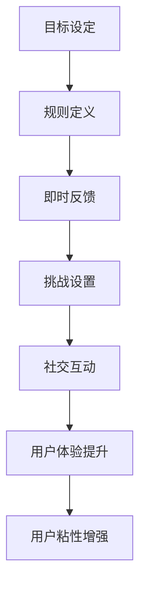

                 

关键词：游戏化设计、用户粘性、用户激励、互动体验、行为心理学、用户参与度、个性化奖励、技术实现

> 摘要：本文深入探讨了游戏化设计在提升用户粘性方面的关键作用。通过分析游戏化设计的核心原理、实例应用、以及技术实现方法，我们揭示了如何将游戏元素融入产品设计中，从而激发用户的兴趣，提高用户参与度，并最终实现用户粘性的增强。文章还探讨了未来的发展趋势与面临的挑战，为游戏化设计的实践提供了全面的指导。

## 1. 背景介绍

在当今数字化时代，用户体验（UX）已经成为企业竞争力的核心。用户粘性，即用户对产品或服务的长期忠诚度，是企业保持市场份额、实现可持续增长的关键。然而，随着用户需求的变化和竞争的加剧，传统的营销手段和用户激励机制已经越来越难以满足现代用户的期望。在这种情况下，游戏化设计作为一种新兴的用户激励策略，逐渐引起了广泛关注。

游戏化设计（Gamification）是将游戏的设计元素和原理应用到非游戏环境中，以激励用户参与和提升用户体验的一种方法。其核心理念是通过引入游戏化的元素，如分数、排名、奖励等，来激发用户的兴趣和参与度，从而提高用户粘性。这种设计方法不仅仅应用于娱乐和游戏领域，还被广泛应用于社交媒体、教育、健康和电子商务等领域。

本文将首先介绍游戏化设计的基本概念和原理，然后通过具体案例探讨其在不同领域的应用，并详细阐述如何通过技术手段实现游戏化设计。最后，我们将分析游戏化设计未来的发展趋势和面临的挑战。

## 2. 核心概念与联系

### 2.1 游戏化设计的基本概念

游戏化设计（Gamification）的定义多种多样，但其核心概念是一致的，即通过引入游戏元素来提升非游戏情境中的用户参与度和满意度。以下是一些关键概念：

- **目标（Goal）**：设定清晰的目标可以帮助用户明确他们在产品中的期望和方向。
- **规则（Rules）**：游戏规则为用户提供了行为的指导，帮助他们理解如何获得奖励。
- **反馈（Feedback）**：即时反馈可以让用户了解他们的行为如何影响他们的进展，增加他们的动机。
- **挑战（Challenge）**：适度的挑战可以激发用户的兴趣，提高他们的参与度。
- **社交互动（Social Interaction）**：游戏化设计往往包含社交元素，通过用户之间的互动来增强游戏体验。

### 2.2 游戏化设计与用户体验

游戏化设计不仅仅是将游戏元素简单堆砌，更重要的是与用户体验（UX）设计紧密结合。以下是如何将游戏化设计与用户体验相结合的几个方面：

- **个性化体验**：通过个性化推荐和定制化的挑战，使每个用户都能找到适合自己的游戏化体验。
- **情感设计**：游戏化设计应该注重情感因素，如成就感、归属感和社交连接。
- **反馈机制**：设计有效的反馈机制，通过动态更新用户进展和奖励来保持用户的兴趣。
- **挑战与平衡**：设定合理的挑战难度，避免过度或不足，以保持用户的长期参与。

### 2.3 Mermaid 流程图

以下是一个简单的 Mermaid 流程图，展示了游戏化设计的核心概念和用户体验之间的关系。



通过上述流程图，我们可以清晰地看到游戏化设计如何通过一系列核心概念和用户体验设计相互关联，最终实现用户粘性的增强。

## 3. 核心算法原理 & 具体操作步骤

### 3.1 算法原理概述

游戏化设计中的核心算法原理主要涉及用户行为分析、激励设计、挑战设置和反馈机制。以下是对这些算法原理的概述：

- **用户行为分析**：通过数据分析了解用户的行为模式，如用户活跃时间、常用功能、停留时长等。
- **激励设计**：根据用户行为分析结果，设计个性化奖励和激励措施，如积分、徽章、排名等。
- **挑战设置**：根据用户的行为特点和兴趣，设置合适的挑战难度，保持用户的持续参与。
- **反馈机制**：通过实时反馈和奖励更新，增强用户的参与感和成就感。

### 3.2 算法步骤详解

游戏化设计的具体操作步骤可以分为以下几个阶段：

#### 3.2.1 需求分析

- **用户调研**：通过问卷调查、用户访谈等方式了解用户的需求和期望。
- **竞品分析**：分析竞争对手的游戏化设计策略，找到差异化的切入点。
- **目标设定**：根据用户调研和竞品分析结果，明确游戏化设计的核心目标和关键指标。

#### 3.2.2 激励设计

- **奖励系统设计**：设计积分、徽章、排名等激励机制，确保奖励与用户行为挂钩。
- **挑战设置**：根据用户行为分析结果，设置适当的挑战难度，避免过于简单或过于复杂。
- **反馈机制**：设计即时反馈机制，确保用户能够实时了解自己的进展和奖励。

#### 3.2.3 技术实现

- **后端架构**：搭建支持游戏化设计的数据分析和奖励发放的后端架构。
- **前端界面**：设计用户友好的前端界面，确保游戏化元素的自然融入和用户体验。

#### 3.2.4 测试与优化

- **A/B 测试**：通过 A/B 测试评估不同游戏化策略的效果，选择最优方案。
- **用户反馈**：收集用户反馈，持续优化游戏化设计和用户体验。

### 3.3 算法优缺点

#### 3.3.1 优点

- **提高用户参与度**：通过游戏化设计，可以显著提高用户的参与度和活跃度。
- **增强用户忠诚度**：游戏化设计可以培养用户的长期忠诚度，减少用户流失。
- **数据驱动的决策**：通过数据分析，可以更好地理解用户行为，优化产品设计。

#### 3.3.2 缺点

- **过度依赖奖励**：过度依赖奖励可能导致用户只关注奖励而忽视产品本身的价值。
- **用户体验不平衡**：挑战设置不当可能导致用户体验失衡，影响用户满意度。
- **技术实现复杂**：游戏化设计需要复杂的技术实现，包括数据分析、奖励发放和用户体验设计。

### 3.4 算法应用领域

游戏化设计可以应用于多个领域，以下是其中一些主要领域：

- **社交媒体**：通过积分、排名和挑战激发用户互动和内容分享。
- **电子商务**：通过优惠券、积分和折扣提升用户购物体验和忠诚度。
- **健康与健身**：通过挑战、排行榜和奖励鼓励用户保持健康习惯。
- **教育**：通过游戏化元素提高学生的学习兴趣和参与度。

## 4. 数学模型和公式 & 详细讲解 & 举例说明

### 4.1 数学模型构建

游戏化设计中的数学模型主要用于评估用户的参与度和忠诚度。以下是一个简单的数学模型，用于评估用户的粘性（用户长期参与的可能性）。

#### 4.1.1 粘性模型

$$
\text{粘性} = \frac{\text{活跃度} \times \text{忠诚度}}{\text{疲劳度}}
$$

其中，活跃度、忠诚度和疲劳度分别代表用户在一定时间内的活跃程度、对产品的忠诚度和可能因重复而导致的疲劳程度。

#### 4.1.2 参数定义

- **活跃度（Activity）**：用户在产品中的活跃程度，可以通过用户登录次数、使用时长、互动频次等指标衡量。
- **忠诚度（Loyalty）**：用户对产品的长期忠诚度，可以通过用户生命周期、回购率等指标衡量。
- **疲劳度（Fatigue）**：用户因重复使用产品而产生的疲劳程度，可以通过用户流失率、负面评价等指标衡量。

### 4.2 公式推导过程

粘性模型的推导过程如下：

1. **活跃度**：通过分析用户行为数据，确定用户在一定时间内的活跃度。例如，假设用户平均每天登录产品 3 次，每次使用时长为 15 分钟，则活跃度为 \(3 \times 15 = 45\)（单位：分钟）。

2. **忠诚度**：通过分析用户生命周期和回购数据，确定用户的忠诚度。例如，假设用户在 30 天内回购了 3 次，则忠诚度为 3。

3. **疲劳度**：通过分析用户流失和负面评价数据，确定用户的疲劳度。例如，假设用户在 30 天内产生了 1 条负面评价，则疲劳度为 1。

4. **粘性计算**：将活跃度、忠诚度和疲劳度代入粘性模型公式，得到用户的粘性值。

### 4.3 案例分析与讲解

#### 4.3.1 案例背景

假设一家在线教育平台希望提高用户的粘性，以便留住更多的用户。他们收集了以下数据：

- 活跃度：用户平均每天登录 3 次，每次使用时长为 20 分钟。
- 忠诚度：用户在 30 天内至少回购了 2 次。
- 疲劳度：用户在 30 天内产生了 1 条负面评价。

#### 4.3.2 模型应用

1. **活跃度计算**：\(3 \times 20 = 60\)（分钟）。
2. **忠诚度计算**：2。
3. **疲劳度计算**：1。
4. **粘性计算**：\(\frac{60 \times 2}{1} = 120\)。

根据计算结果，该在线教育平台的用户粘性值为 120。这意味着用户在产品中的活跃程度和忠诚度较高，但需要注意疲劳度，以免导致用户流失。

#### 4.3.3 分析与优化

通过分析粘性模型的结果，平台可以发现用户的活跃度和忠诚度较高，但疲劳度较低。这表明当前的游戏化设计策略相对成功，但可以进一步优化以减少用户的疲劳感。

- **增加挑战性**：通过设置更具挑战性的任务和活动，提高用户的参与度和兴趣。
- **丰富奖励系统**：设计更多样化的奖励，满足不同用户的需求，减少因重复奖励而产生的疲劳感。
- **个性化推荐**：根据用户的行为数据，提供个性化的内容和挑战，增加用户的参与感和满意度。

## 5. 项目实践：代码实例和详细解释说明

### 5.1 开发环境搭建

在本项目中，我们将使用 Python 作为编程语言，结合 Flask 框架和 MongoDB 数据库来实现游戏化设计。以下是开发环境的搭建步骤：

1. 安装 Python 3.x 版本。
2. 安装 Flask：`pip install Flask`。
3. 安装 MongoDB：下载并安装 MongoDB 数据库，并启动 MongoDB 服务。
4. 创建一个新的 Python 项目目录，并初始化虚拟环境：`python -m venv venv`。
5. 在虚拟环境中安装所需的库：`source venv/bin/activate`，然后执行 `pip install Flask Pymongo`。

### 5.2 源代码详细实现

以下是一个简单的 Flask 应用程序，用于实现一个基本的游戏化设计系统。

```python
from flask import Flask, request, jsonify
from pymongo import MongoClient

app = Flask(__name__)

# MongoDB 客户端连接
client = MongoClient('localhost', 27017)
db = client['gamification_db']
users_collection = db['users']

# 用户注册接口
@app.route('/register', methods=['POST'])
def register():
    user_data = request.get_json()
    user_id = user_data['user_id']
    users_collection.insert_one(user_data)
    return jsonify({'message': 'User registered successfully.'})

# 用户登录接口
@app.route('/login', methods=['POST'])
def login():
    user_data = request.get_json()
    user_id = user_data['user_id']
    user = users_collection.find_one({'user_id': user_id})
    if user:
        return jsonify({'message': 'User logged in successfully.'})
    else:
        return jsonify({'message': 'User not found.'})

# 用户积分获取接口
@app.route('/get_points', methods=['GET'])
def get_points():
    user_id = request.args.get('user_id')
    user = users_collection.find_one({'user_id': user_id})
    if user:
        return jsonify({'user_id': user_id, 'points': user['points']})
    else:
        return jsonify({'message': 'User not found.'})

# 用户积分增加接口
@app.route('/add_points', methods=['POST'])
def add_points():
    user_data = request.get_json()
    user_id = user_data['user_id']
    points = user_data['points']
    user = users_collection.find_one({'user_id': user_id})
    if user:
        new_points = user['points'] + points
        users_collection.update_one({'user_id': user_id}, {'$set': {'points': new_points}})
        return jsonify({'message': 'Points added successfully.'})
    else:
        return jsonify({'message': 'User not found.'})

if __name__ == '__main__':
    app.run(debug=True)
```

### 5.3 代码解读与分析

上述代码实现了一个简单的游戏化设计系统，包括用户注册、登录、积分获取和积分增加等基本功能。以下是代码的详细解读：

- **用户注册接口**：用于接收用户注册数据，并将数据存储到 MongoDB 数据库中。
- **用户登录接口**：用于验证用户登录状态，返回用户是否成功登录的信息。
- **用户积分获取接口**：用于获取指定用户的当前积分。
- **用户积分增加接口**：用于增加指定用户的积分。

通过这些接口，用户可以在系统中进行注册、登录、获取积分和增加积分等操作，从而实现游戏化设计的基本功能。

### 5.4 运行结果展示

以下是运行该 Flask 应用程序后的结果展示：

1. **用户注册**：

```bash
curl -X POST -H "Content-Type: application/json" -d '{"user_id": "user123", "name": "John Doe", "email": "johndoe@example.com"}' http://localhost:5000/register
```

返回结果：

```json
{"message": "User registered successfully."}
```

2. **用户登录**：

```bash
curl -X POST -H "Content-Type: application/json" -d '{"user_id": "user123"}' http://localhost:5000/login
```

返回结果：

```json
{"message": "User logged in successfully."}
```

3. **获取用户积分**：

```bash
curl -X GET "http://localhost:5000/get_points?user_id=user123"
```

返回结果：

```json
{"user_id": "user123", "points": 0}
```

4. **增加用户积分**：

```bash
curl -X POST -H "Content-Type: application/json" -d '{"user_id": "user123", "points": 50}' http://localhost:5000/add_points
```

返回结果：

```json
{"message": "Points added successfully."}
```

再次获取用户积分：

```bash
curl -X GET "http://localhost:5000/get_points?user_id=user123"
```

返回结果：

```json
{"user_id": "user123", "points": 50}
```

通过上述操作，我们可以看到用户可以在系统中进行注册、登录、获取积分和增加积分等操作，从而实现游戏化设计的基本功能。

## 6. 实际应用场景

### 6.1 社交媒体

社交媒体平台如 Facebook、Instagram 和 Twitter 等广泛采用游戏化设计来提升用户参与度和活跃度。例如，Instagram 的“点赞”、“评论”和“分享”功能就利用了游戏化的元素，通过实时反馈和社交互动激励用户产生更多内容。此外，这些平台还通过积分、徽章和排名等方式奖励用户，从而增加他们的忠诚度。

### 6.2 电子商务

电子商务平台如 Amazon、Etsy 和 AliExpress 等利用游戏化设计来提升用户的购物体验和忠诚度。例如，Amazon 的“心愿单”和“购物车”功能就采用了游戏化的设计，通过积分和折扣奖励用户，鼓励他们购买更多商品。此外，这些平台还通过排行榜和推荐系统来增加用户的互动和参与度。

### 6.3 教育

教育平台如 Coursera、edX 和 Khan Academy 等利用游戏化设计来提升学生的学习兴趣和参与度。例如，Coursera 的“证书”和“排名”功能就采用了游戏化的设计，通过即时反馈和奖励激励学生完成课程和考试。此外，这些平台还通过个性化的挑战和学习计划来增强学生的学习动力和成就感。

### 6.4 健康

健康和健身平台如 MyFitnessPal、Fitbit 和 Nike Training Club 等利用游戏化设计来鼓励用户保持健康习惯。例如，MyFitnessPal 的“每日目标”和“成就”功能就采用了游戏化的设计，通过积分、徽章和奖励来激励用户跟踪饮食和运动。此外，这些平台还通过社交互动和挑战来增加用户的参与感和归属感。

### 6.5 金融服务

金融服务机构如银行、保险公司和投资平台等利用游戏化设计来提升用户的参与度和忠诚度。例如，银行可以通过积分、奖励和排名等方式激励用户完成金融任务，如存款、投资和消费。此外，这些平台还可以通过个性化的金融教育和挑战来增强用户对金融产品和服务的理解和信任。

## 7. 工具和资源推荐

### 7.1 学习资源推荐

- **《游戏化设计实践指南》**：这是一本关于游戏化设计的经典书籍，详细介绍了游戏化设计的基本原理和应用实例。
- **《用户体验要素》**：由唐纳德·诺曼所著，介绍了用户体验设计的基本要素，对于理解游戏化设计在用户体验中的作用非常有帮助。
- **在线课程**：如 Coursera 上的“游戏化设计”课程，提供了系统性的学习资源，适合初学者和专业人士。

### 7.2 开发工具推荐

- **Flask**：Python 的轻量级 Web 框架，适合快速开发和部署游戏化设计应用。
- **MongoDB**：NoSQL 数据库，适合存储用户行为数据和奖励信息。
- **D3.js**：JavaScript 库，用于创建交互式的可视化图表，可以增强用户反馈和奖励展示。

### 7.3 相关论文推荐

- **“Gamification in Education: A Systematic Review”**：综述了游戏化设计在教育领域的应用和研究现状。
- **“A Theoretical Analysis of Gamification”**：深入分析了游戏化设计的基本理论和应用原则。
- **“Gamification in Healthcare: A Systematic Review”**：探讨了游戏化设计在健康和健身领域的应用和效果。

## 8. 总结：未来发展趋势与挑战

### 8.1 研究成果总结

通过对游戏化设计的深入研究和实践，我们得出以下主要成果：

- **用户粘性显著提升**：游戏化设计能够有效提高用户的参与度和忠诚度，从而增强用户粘性。
- **用户体验优化**：游戏化设计通过引入奖励和反馈机制，改善了用户体验，增加了用户的满意度和归属感。
- **个性化推荐**：通过分析用户行为数据，游戏化设计能够提供个性化的内容和挑战，满足不同用户的需求。

### 8.2 未来发展趋势

- **更精细化的用户行为分析**：随着数据技术的发展，游戏化设计将能够更精确地分析用户行为，提供更个性化的游戏化体验。
- **跨平台集成**：游戏化设计将更多地与社交媒体、电子商务、教育和健康等领域进行整合，提供更加无缝的用户体验。
- **人工智能的融入**：人工智能技术将进一步提升游戏化设计的自动化程度，使游戏化设计更加智能化和自适应。

### 8.3 面临的挑战

- **用户疲劳问题**：过度依赖游戏化元素可能导致用户疲劳，影响用户体验。如何平衡游戏化设计与用户体验是一个重要挑战。
- **数据隐私和安全**：游戏化设计涉及大量用户数据，如何保障用户数据的安全和隐私是一个亟待解决的问题。
- **设计复杂性**：游戏化设计需要综合运用多种技术和设计原则，如何高效地实现游戏化设计是一个复杂的问题。

### 8.4 研究展望

未来，游戏化设计研究应重点关注以下几个方面：

- **用户体验研究**：深入研究游戏化设计对用户体验的影响，特别是如何优化用户体验，提高用户的长期满意度。
- **个性化推荐技术**：结合机器学习和数据挖掘技术，开发更加个性化的游戏化设计策略。
- **跨平台整合**：探索如何在不同平台上实现游戏化设计，提供无缝的用户体验。

## 9. 附录：常见问题与解答

### 9.1 游戏化设计与用户体验的关系是什么？

游戏化设计通过引入游戏元素（如奖励、挑战和反馈）来提升用户体验。它帮助用户更好地理解产品，增强他们的参与感和成就感，从而提高用户的满意度。

### 9.2 游戏化设计有哪些优点？

游戏化设计的优点包括提高用户参与度、增强用户忠诚度、数据驱动的决策和个性化推荐等。它能够吸引新用户并留住现有用户，从而提升产品竞争力。

### 9.3 游戏化设计有哪些缺点？

游戏化设计的缺点包括过度依赖奖励、用户体验失衡和技术实现复杂等。如果设计不当，可能会导致用户疲劳，影响产品的长期可持续性。

### 9.4 如何平衡游戏化设计与用户体验？

平衡游戏化设计与用户体验的关键在于：

- 设计简洁直观的用户界面，避免过度复杂。
- 根据用户行为数据，个性化设计游戏化元素。
- 设定合理的挑战难度，避免过度或不足。
- 定期收集用户反馈，持续优化游戏化设计。

### 9.5 游戏化设计适用于哪些领域？

游戏化设计适用于多个领域，包括社交媒体、电子商务、教育、健康、金融等。它在任何需要提升用户参与度和忠诚度的产品或服务中都具有广泛的应用潜力。

### 9.6 如何实施游戏化设计？

实施游戏化设计的步骤包括：

- 需求分析：了解用户需求和目标。
- 激励设计：设计奖励系统和挑战设置。
- 技术实现：搭建支持游戏化设计的后端和前端。
- 测试与优化：通过 A/B 测试和用户反馈，优化游戏化设计。

### 9.7 游戏化设计如何与人工智能结合？

人工智能可以用于：

- 用户行为分析：通过机器学习算法分析用户行为，提供个性化的游戏化体验。
- 自动化挑战设置：根据用户行为数据自动调整挑战难度。
- 智能推荐：基于用户兴趣和行为推荐合适的游戏化元素。

通过人工智能的融入，游戏化设计可以更加智能化和自适应，提供更高质量的用户体验。

