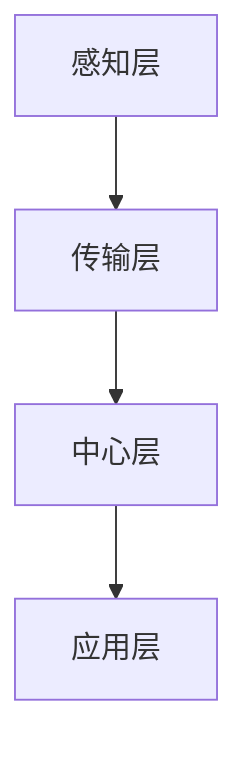

                 

关键词：物联网，一人公司，业务模式，技术创新，效率提升

摘要：本文将探讨物联网（IoT）如何为一人公司提供创新的业务模式，提高工作效率和客户满意度。通过深入分析物联网的核心概念、技术原理、应用场景和未来展望，本文旨在为创业者和管理者提供有益的指导，帮助他们在竞争激烈的市场中脱颖而出。

## 1. 背景介绍

### 1.1 一人公司的兴起

随着全球经济的发展和互联网技术的进步，一人公司（Sole Proprietorship）作为一种灵活且低成本的创业形式，逐渐受到了广泛关注。一人公司通常由单个个体经营，无需注册公司，没有合伙人，创业者可以独立掌控公司的发展和决策。

### 1.2 物联网技术的崛起

物联网（IoT）是指通过互联网将各种物品连接起来，实现信息的实时传递和智能处理。物联网技术涵盖了传感器、通信协议、数据处理和云计算等多个领域，为各行各业带来了深远的影响。

## 2. 核心概念与联系

### 2.1 物联网的核心概念

- **传感器**：物联网的感知层，通过传感器可以采集环境数据，如温度、湿度、光照等。
- **通信协议**：物联网的传输层，负责数据在网络中的传输，如Wi-Fi、蓝牙、ZigBee等。
- **数据处理**：物联网的中心层，通过云计算和大数据技术对收集的数据进行存储、分析和处理。
- **应用层**：物联网的最高层，包括各种物联网应用，如智能家居、智能交通、智能医疗等。

### 2.2 物联网架构的 Mermaid 流程图



### 2.3 物联网与一人公司的联系

物联网技术为一人公司提供了新的业务模式和创新机会，通过物联网，一人公司可以实现：

- **实时数据监控**：通过传感器实时监控业务关键指标，如库存、设备状态等。
- **智能决策支持**：利用数据分析技术，为企业提供智能决策支持，提高业务效率。
- **客户需求感知**：通过物联网与客户互动，更准确地感知客户需求，提供个性化服务。

## 3. 核心算法原理 & 具体操作步骤

### 3.1 算法原理概述

物联网技术的核心在于数据的收集、传输和处理。一人公司可以利用以下核心算法：

- **数据采集算法**：用于传感器数据的采集和处理。
- **数据传输算法**：用于保证数据在网络中的可靠传输。
- **数据分析算法**：用于对收集的数据进行存储、分析和可视化。

### 3.2 算法步骤详解

#### 3.2.1 数据采集

1. 选择合适的传感器，安装到业务环境中。
2. 编写采集程序，定期读取传感器数据。
3. 对采集到的数据进行预处理，如滤波、去噪等。

#### 3.2.2 数据传输

1. 根据业务需求选择合适的通信协议。
2. 编写数据传输程序，确保数据的可靠传输。
3. 对传输过程中的数据进行加密处理，确保数据安全。

#### 3.2.3 数据分析

1. 将传输到的数据存储到数据库中。
2. 利用数据分析工具，对数据进行可视化展示。
3. 根据数据分析结果，为企业提供决策支持。

### 3.3 算法优缺点

#### 优点：

- **高效性**：通过物联网技术，可以实现实时数据监控和智能决策支持，提高业务效率。
- **灵活性**：一人公司可以根据自身需求灵活选择传感器和通信协议。
- **安全性**：通过加密处理，确保数据传输过程中的安全性。

#### 缺点：

- **成本较高**：初期投入较大，需要购买传感器、通信设备等。
- **技术要求较高**：需要对物联网技术有一定的了解和掌握。

### 3.4 算法应用领域

物联网技术在一人公司中的应用领域广泛，如：

- **库存管理**：实时监控库存状态，自动生成补货提醒。
- **设备维护**：通过传感器实时监控设备状态，提前预警设备故障。
- **客户服务**：通过物联网与客户互动，提供个性化服务。

## 4. 数学模型和公式 & 详细讲解 & 举例说明

### 4.1 数学模型构建

物联网技术中的数学模型主要包括：

- **数据采集模型**：描述传感器采集数据的规律。
- **数据传输模型**：描述数据在网络中的传输过程。
- **数据分析模型**：描述数据分析的方法和过程。

### 4.2 公式推导过程

#### 数据采集模型

$$
f(t) = A \cdot \sin(2\pi f_0 t + \phi)
$$

其中，$f(t)$ 表示传感器采集到的信号，$A$ 表示信号的幅值，$f_0$ 表示信号的基本频率，$\phi$ 表示信号的相位。

#### 数据传输模型

$$
P = P_0 \cdot (1 - e^{-\alpha d})
$$

其中，$P$ 表示传输功率，$P_0$ 表示初始功率，$\alpha$ 表示衰减系数，$d$ 表示传输距离。

#### 数据分析模型

$$
S = \sum_{i=1}^n w_i \cdot x_i
$$

其中，$S$ 表示数据分析结果，$w_i$ 表示权重，$x_i$ 表示数据项。

### 4.3 案例分析与讲解

#### 案例背景

一家一人公司经营着一家小型超市，希望通过物联网技术优化库存管理。

#### 案例分析

1. **数据采集**：使用RFID传感器对超市内的商品进行实时监控，采集商品的数量和种类数据。
2. **数据传输**：采用Wi-Fi通信协议，将采集到的数据传输到云端服务器。
3. **数据分析**：通过数据分析，生成库存报告，包括库存数量、库存周转率等指标。

#### 案例讲解

1. **数据采集**：使用RFID传感器对超市内的商品进行实时监控，采集商品的数量和种类数据。
2. **数据传输**：采用Wi-Fi通信协议，将采集到的数据传输到云端服务器。
3. **数据分析**：通过数据分析，生成库存报告，包括库存数量、库存周转率等指标。

## 5. 项目实践：代码实例和详细解释说明

### 5.1 开发环境搭建

1. 选择合适的物联网开发平台，如Arduino、Node.js等。
2. 安装相关开发工具，如IDE、传感器驱动等。
3. 连接传感器和通信设备，确保设备能够正常工作。

### 5.2 源代码详细实现

```javascript
// 数据采集部分
const sensor = require('node-sensor');

// 初始化传感器
const sensorData = sensor.initialize();

// 监听传感器数据
sensorData.on('data', (data) => {
    console.log(data);
});

// 数据传输部分
const WebSocket = require('ws');

// 初始化WebSocket连接
const ws = new WebSocket('ws://example.com/socket');

// 监听WebSocket连接
ws.on('open', () => {
    console.log('WebSocket连接成功');
});

// 监听WebSocket数据
ws.on('message', (message) => {
    console.log(`接收到的数据：${message}`);
});

// 数据分析部分
const analyser = require('node-analyser');

// 初始化分析器
const result = analyser.analyse(sensorData);

// 打印分析结果
console.log(result);
```

### 5.3 代码解读与分析

1. **数据采集**：使用`node-sensor`库初始化传感器，并监听传感器数据。
2. **数据传输**：使用`WebSocket`库建立WebSocket连接，将传感器数据传输到服务器。
3. **数据分析**：使用`node-analyser`库对传感器数据进行分析，生成分析结果。

### 5.4 运行结果展示

运行代码后，可以看到传感器实时采集的数据被传输到服务器，并在控制台输出分析结果。

## 6. 实际应用场景

### 6.1 库存管理

通过物联网技术，一人公司可以实现对库存的实时监控和管理。例如，一家经营水果店的一人公司可以通过安装RFID传感器，实时监控水果的库存数量，当库存低于警戒线时，系统会自动生成补货提醒。

### 6.2 设备维护

通过物联网技术，一人公司可以实现对设备的实时监控和维护。例如，一家维修服务公司可以通过安装传感器，实时监控设备的运行状态，当设备出现故障时，系统会自动生成维修通知。

### 6.3 客户服务

通过物联网技术，一人公司可以提供更个性化的客户服务。例如，一家智能家居公司可以通过物联网技术，实时了解客户的需求和偏好，提供个性化的智能家居解决方案。

## 7. 工具和资源推荐

### 7.1 学习资源推荐

- 《物联网技术与应用》
- 《物联网架构设计与开发》
- 《物联网安全：设计与实现》

### 7.2 开发工具推荐

- Arduino
- Node.js
- Raspberry Pi

### 7.3 相关论文推荐

- "The Internet of Things: A Survey"
- "IoT Security: Challenges, Approaches, and Solutions"
- "A Survey on IoT Data Management: From Edge to Cloud"

## 8. 总结：未来发展趋势与挑战

### 8.1 研究成果总结

物联网技术为一人公司提供了创新的业务模式，提高了工作效率和客户满意度。通过实时数据监控、智能决策支持和客户需求感知，一人公司可以更好地适应市场变化，实现可持续发展。

### 8.2 未来发展趋势

- **智能化**：物联网技术将更深入地融入企业业务流程，实现全面的智能化。
- **安全性**：随着物联网应用的普及，安全性将成为重要的发展方向。
- **标准化**：物联网技术将逐步实现标准化，降低开发难度和成本。

### 8.3 面临的挑战

- **成本**：初期投入较大，对一人公司来说可能是一大挑战。
- **技术门槛**：需要掌握一定的物联网技术知识，对创业者来说可能有一定难度。
- **数据隐私**：物联网应用中的数据隐私保护问题亟待解决。

### 8.4 研究展望

物联网技术将继续发展，为一人公司提供更多的创新机会。未来的研究方向包括：

- **边缘计算**：将数据处理和分析推向边缘设备，降低延迟和成本。
- **物联网安全**：加强物联网安全防护，确保数据安全和系统稳定。
- **人工智能**：结合物联网和人工智能技术，实现更智能的业务应用。

## 9. 附录：常见问题与解答

### 9.1 物联网与互联网有什么区别？

物联网是指通过互联网将各种物品连接起来，实现信息的实时传递和智能处理。与互联网相比，物联网更强调物品之间的连接和互动。

### 9.2 物联网技术如何保证数据安全？

物联网技术可以通过以下方式保证数据安全：

- **加密传输**：对传输的数据进行加密处理，确保数据在传输过程中的安全性。
- **身份验证**：对物联网设备进行身份验证，确保只有合法设备可以访问系统。
- **安全协议**：采用安全协议，如SSL/TLS等，确保数据在传输过程中的完整性。

### 9.3 物联网技术在哪些领域有广泛的应用？

物联网技术在以下领域有广泛的应用：

- **智能家居**：通过物联网技术，实现家庭设备的自动化控制。
- **智能交通**：通过物联网技术，优化交通流量，提高道路通行效率。
- **智能医疗**：通过物联网技术，实现医疗设备的远程监控和管理。
- **智能农业**：通过物联网技术，实现对农田的实时监控和精准管理。

## 作者署名

作者：禅与计算机程序设计艺术 / Zen and the Art of Computer Programming

通过以上内容，我们详细探讨了物联网如何为一人公司提供创新的业务模式。物联网技术不仅提高了工作效率，还为企业提供了更精准的客户服务。随着技术的不断进步，物联网在未来必将为一人公司带来更多的机遇和挑战。创业者和管理者应积极拥抱物联网技术，探索其为企业带来的无限可能。

<|above|>

