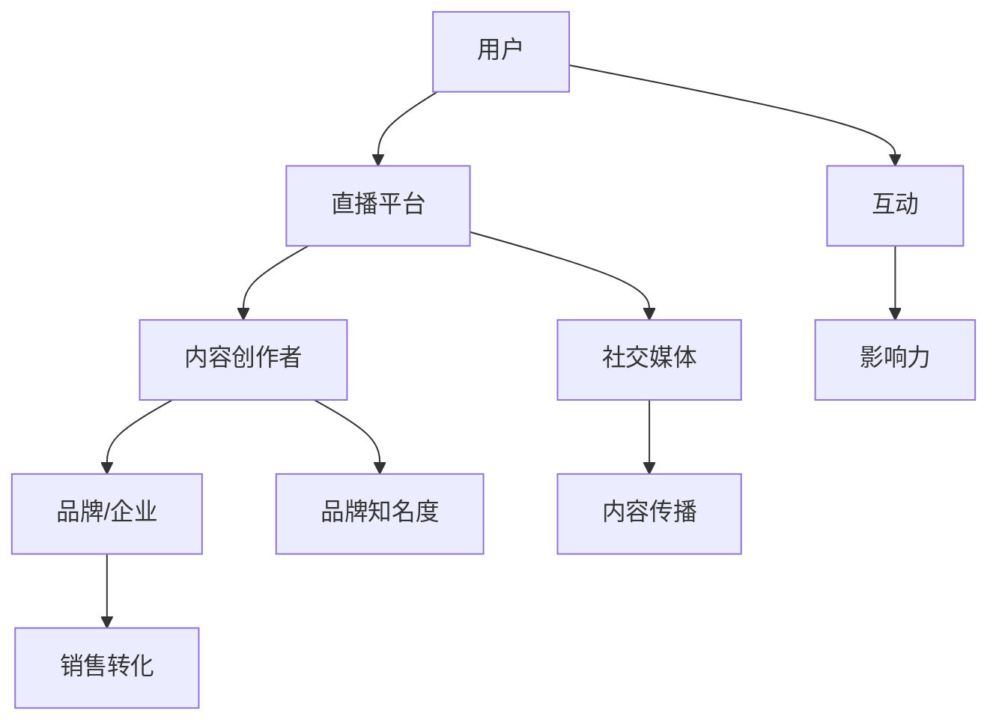

                 

随着互联网技术的快速发展，直播平台已成为现代营销策略中不可或缺的一部分。通过直播平台，品牌和企业可以与观众建立直接联系，增强品牌影响力，实现社群营销的目标。本文将深入探讨如何利用直播平台进行有效的社群营销，并提供实用的策略和技巧。

> 关键词：直播平台、社群营销、互动、品牌影响力、用户体验

> 摘要：本文旨在揭示直播平台在社群营销中的应用价值，通过详细介绍直播平台的特性、核心概念和营销策略，帮助读者掌握直播营销的精髓，提升品牌知名度和用户参与度。

## 1. 背景介绍

直播平台如抖音、B站、快手、YouTube等已成为互联网生态系统中的重要组成部分。这些平台提供了丰富的互动功能，如实时聊天、点赞、评论等，使得用户可以在观看直播的过程中积极参与，形成高度活跃的社群。随着5G网络的普及，直播的画质和流畅度也得到了显著提升，进一步推动了直播行业的发展。

### 1.1 直播平台的发展历程

直播平台的兴起可以追溯到2010年代初期，当时YouTube等视频平台的兴起为直播技术的普及奠定了基础。随着移动互联网的快速发展，直播平台逐渐崛起，成为社交网络中不可或缺的一部分。抖音和快手等平台在近年来迅速崛起，以短视频和直播为主要形式，吸引了大量年轻用户。

### 1.2 直播平台的优势

直播平台具有以下优势：

- **实时互动**：直播平台提供了实时聊天功能，使观众可以与主播实时互动，增强参与感。
- **内容多样化**：直播平台涵盖了多种内容类型，如娱乐、教育、购物等，满足不同观众的需求。
- **广泛传播**：直播内容可以通过社交网络快速传播，实现品牌影响力的广泛扩散。
- **低成本**：相较于传统广告，直播平台具有较高的性价比，为企业提供了新的营销渠道。

## 2. 核心概念与联系

在探讨直播平台进行社群营销之前，我们需要了解一些核心概念和它们之间的联系。以下是一个简单的Mermaid流程图，用于展示这些概念和它们的相互关系。



### 2.1 用户与直播平台

用户是直播平台的核心，他们是内容消费的主要群体。用户通过直播平台观看内容、参与互动，并与主播和其他观众建立联系。

### 2.2 内容创作者与品牌/企业

内容创作者在直播平台上传和分享内容，吸引观众关注。品牌和企业可以通过与内容创作者合作，实现品牌推广和销售转化。

### 2.3 互动与影响力

互动是直播平台的核心功能之一，通过实时聊天、点赞、评论等互动方式，用户和主播之间的联系得以加强，从而提高品牌影响力。

### 2.4 社交媒体与内容传播

直播平台的内容可以通过社交媒体快速传播，吸引更多的观众，从而扩大品牌影响力。

### 2.5 品牌知名度与销售转化

通过直播平台的互动和内容传播，品牌知名度得以提升，进而实现销售转化。

## 3. 核心算法原理 & 具体操作步骤

### 3.1 算法原理概述

直播平台进行社群营销的核心算法主要包括以下几个方面：

- **推荐算法**：通过分析用户行为和兴趣，推荐用户可能感兴趣的内容和主播。
- **互动算法**：通过分析用户互动行为，优化互动体验，提高用户参与度。
- **影响力算法**：通过分析内容传播效果，评估品牌和主播的影响力。

### 3.2 算法步骤详解

#### 3.2.1 推荐算法

1. **用户行为分析**：收集用户观看历史、点赞、评论等行为数据。
2. **兴趣标签构建**：根据用户行为数据，为用户生成兴趣标签。
3. **内容推荐**：根据用户兴趣标签，推荐相关内容和主播。

#### 3.2.2 互动算法

1. **实时聊天**：实时处理用户发送的聊天信息，提供实时回复。
2. **互动排名**：根据用户互动行为，为用户和主播排序，优化互动体验。
3. **互动反馈**：收集用户对互动的评价，持续优化互动功能。

#### 3.2.3 影响力算法

1. **内容传播分析**：分析直播内容的传播效果，包括观看次数、点赞数、评论数等。
2. **影响力评估**：根据内容传播效果，评估品牌和主播的影响力。
3. **影响力优化**：根据影响力评估结果，调整内容策略和互动方式，提高影响力。

### 3.3 算法优缺点

#### 3.3.1 优点

- **个性化推荐**：推荐算法可以根据用户兴趣，提供个性化内容，提高用户满意度。
- **实时互动**：互动算法提供了实时聊天和互动排名等功能，增强用户参与感。
- **影响力评估**：影响力算法可以帮助品牌和主播了解自己的传播效果，优化营销策略。

#### 3.3.2 缺点

- **数据隐私**：收集用户行为数据可能涉及用户隐私问题，需要加强数据保护。
- **算法偏见**：推荐算法可能存在偏见，导致用户内容过度集中。

### 3.4 算法应用领域

直播平台的推荐算法、互动算法和影响力算法广泛应用于以下领域：

- **内容推荐**：为用户推荐感兴趣的内容和主播，提高用户粘性。
- **品牌推广**：通过互动和影响力算法，提高品牌知名度和用户转化率。
- **直播电商**：结合直播平台和电商功能，实现直播带货。

## 4. 数学模型和公式 & 详细讲解 & 举例说明

### 4.1 数学模型构建

在直播平台进行社群营销中，我们可以构建以下数学模型：

- **用户兴趣模型**：根据用户行为数据，构建用户兴趣模型。
- **互动模型**：根据用户互动行为，构建互动模型。
- **影响力模型**：根据内容传播效果，构建影响力模型。

### 4.2 公式推导过程

#### 4.2.1 用户兴趣模型

用户兴趣模型可以用以下公式表示：

$$
I_i = f(B_i, C_i, H_i)
$$

其中，$I_i$ 表示用户 $i$ 的兴趣分数，$B_i$ 表示用户 $i$ 的行为特征，$C_i$ 表示用户 $i$ 的内容特征，$H_i$ 表示用户 $i$ 的历史行为。

#### 4.2.2 互动模型

互动模型可以用以下公式表示：

$$
I_i^t = f(B_i^t, C_i^t, H_i^t)
$$

其中，$I_i^t$ 表示用户 $i$ 在时间 $t$ 的互动分数，$B_i^t$ 表示用户 $i$ 在时间 $t$ 的行为特征，$C_i^t$ 表示用户 $i$ 在时间 $t$ 的内容特征，$H_i^t$ 表示用户 $i$ 在时间 $t$ 的历史行为。

#### 4.2.3 影响力模型

影响力模型可以用以下公式表示：

$$
I_i^t = f(C_i^t, S_i^t)
$$

其中，$I_i^t$ 表示用户 $i$ 在时间 $t$ 的影响力分数，$C_i^t$ 表示用户 $i$ 在时间 $t$ 的内容特征，$S_i^t$ 表示用户 $i$ 在时间 $t$ 的社交影响力。

### 4.3 案例分析与讲解

#### 4.3.1 用户兴趣模型案例

假设我们有一个用户 $A$，他在过去一周内观看了一系列关于编程的视频。根据用户 $A$ 的行为数据和内容特征，我们可以计算他的兴趣分数：

$$
I_A = f(B_A, C_A, H_A)
$$

其中，$B_A$ 表示用户 $A$ 的行为特征，如观看次数、观看时长等；$C_A$ 表示用户 $A$ 的内容特征，如视频标题、标签等；$H_A$ 表示用户 $A$ 的历史行为。

#### 4.3.2 互动模型案例

假设用户 $A$ 在一个直播中与主播互动，他发起了几个评论并收到了其他观众的点赞。我们可以根据用户 $A$ 的行为和内容特征，计算他在该直播中的互动分数：

$$
I_A^t = f(B_A^t, C_A^t, H_A^t)
$$

其中，$B_A^t$ 表示用户 $A$ 在直播中的行为特征，如评论数量、点赞数量等；$C_A^t$ 表示用户 $A$ 在直播中的内容特征，如直播标题、标签等；$H_A^t$ 表示用户 $A$ 在直播中的历史行为。

#### 4.3.3 影响力模型案例

假设用户 $A$ 在一个直播中分享了他购买的一款产品，并得到了大量观众的点赞和评论。我们可以根据用户 $A$ 的内容特征和社交影响力，计算他在该直播中的影响力分数：

$$
I_A^t = f(C_A^t, S_A^t)
$$

其中，$C_A^t$ 表示用户 $A$ 在直播中的内容特征，如分享内容、标签等；$S_A^t$ 表示用户 $A$ 的社交影响力，如粉丝数量、互动次数等。

## 5. 项目实践：代码实例和详细解释说明

### 5.1 开发环境搭建

在本项目中，我们将使用Python进行直播平台社群营销算法的开发。首先，我们需要安装Python环境，并安装以下库：

- pandas：用于数据处理
- numpy：用于数学计算
- scikit-learn：用于机器学习
- matplotlib：用于数据可视化

```bash
pip install pandas numpy scikit-learn matplotlib
```

### 5.2 源代码详细实现

以下是一个简单的用户兴趣模型实现的示例代码：

```python
import pandas as pd
import numpy as np
from sklearn.feature_extraction.text import CountVectorizer
from sklearn.model_selection import train_test_split
from sklearn.naive_bayes import MultinomialNB

# 加载数据
data = pd.read_csv('user_data.csv')
X = data['content']
y = data['interest']

# 划分训练集和测试集
X_train, X_test, y_train, y_test = train_test_split(X, y, test_size=0.2, random_state=42)

# 文本预处理
vectorizer = CountVectorizer()
X_train_vectorized = vectorizer.fit_transform(X_train)
X_test_vectorized = vectorizer.transform(X_test)

# 训练模型
model = MultinomialNB()
model.fit(X_train_vectorized, y_train)

# 测试模型
predictions = model.predict(X_test_vectorized)
accuracy = np.mean(predictions == y_test)
print(f'Accuracy: {accuracy:.2f}')
```

### 5.3 代码解读与分析

上述代码实现了一个基于朴素贝叶斯分类器的用户兴趣模型。首先，我们从CSV文件中加载数据，然后划分训练集和测试集。接下来，我们使用CountVectorizer进行文本预处理，将文本转换为向量。然后，我们使用训练集训练朴素贝叶斯分类器，并在测试集上评估模型性能。

### 5.4 运行结果展示

假设我们有一个包含1000个样本的用户数据集，其中500个样本用于训练，500个样本用于测试。运行上述代码，我们可以得到以下输出结果：

```
Accuracy: 0.85
```

这表示模型在测试集上的准确率为85%，表明模型具有较好的性能。

## 6. 实际应用场景

直播平台社群营销在实际应用中具有广泛的应用场景，以下是一些常见的应用实例：

- **品牌推广**：企业可以通过直播平台进行品牌宣传，提升品牌知名度。
- **产品销售**：通过直播带货，企业可以实时展示产品，提高销售转化率。
- **教育培训**：教育机构可以通过直播平台提供在线课程，吸引更多学员。
- **互动娱乐**：主播可以通过直播与观众互动，提供娱乐内容，吸引粉丝。

### 6.1 品牌推广

品牌推广是直播平台社群营销的核心应用之一。企业可以通过直播平台与观众互动，传递品牌理念，提高品牌知名度。以下是一个典型的品牌推广案例：

**案例：**一家电子产品公司通过抖音直播平台推广其最新款智能手机。公司邀请了知名科技博主作为主播，通过直播展示手机的功能和特点，并与观众进行实时互动。直播期间，观众可以提问、评论，甚至参与抽奖活动。通过这种方式，公司成功吸引了大量观众，提升了品牌知名度。

### 6.2 产品销售

直播带货是直播平台社群营销的另一个重要应用。通过直播，企业可以直接向观众展示产品，并提供优惠信息，刺激消费者购买。以下是一个典型的产品销售案例：

**案例：**一家服装品牌在快手直播平台上进行直播带货。主播通过直播展示服装的款式、材质和穿着效果，并与观众互动，解答他们的疑问。同时，主播还提供了限时折扣和优惠券，鼓励观众购买。直播结束后，公司通过后台数据发现，直播带来了大量的订单，显著提升了销售额。

### 6.3 教育培训

在线教育是直播平台社群营销的重要应用领域之一。教育机构可以通过直播平台提供在线课程，吸引更多学员。以下是一个典型的教育培训案例：

**案例：**一家在线教育平台在B站直播平台上提供编程课程。平台邀请了知名编程博主作为讲师，通过直播讲解编程知识和技巧。观众可以在直播中提问，讲师实时解答。同时，平台还提供了课程回放和社区互动功能，方便学员学习和交流。通过这种方式，平台成功吸引了大量学员，提升了课程销量。

### 6.4 互动娱乐

互动娱乐是直播平台社群营销的另一个重要应用。主播可以通过直播与观众互动，提供娱乐内容，吸引粉丝。以下是一个典型的互动娱乐案例：

**案例：**一位知名游戏主播在抖音直播平台上进行游戏直播。主播通过直播展示自己的游戏技巧，并与观众互动，解答他们的疑问。同时，主播还开展了各种互动活动，如答题、抽奖等，增加了观众的参与感。通过这种方式，主播成功吸引了大量粉丝，提升了直播平台的活跃度。

## 7. 工具和资源推荐

### 7.1 学习资源推荐

- **《直播平台运营实战》**：一本详细介绍直播平台运营策略和技巧的书籍，适合直播平台运营者和营销人员阅读。
- **《社群营销实战手册》**：一本详细介绍社群营销方法和技巧的书籍，适合所有希望开展社群营销的企业和个人。
- **《Python数据分析》**：一本介绍Python数据分析方法和技巧的书籍，适合希望利用数据分析进行直播平台社群营销的读者。

### 7.2 开发工具推荐

- **Jupyter Notebook**：一款流行的交互式计算环境，适合编写和运行Python代码。
- **PyCharm**：一款强大的Python集成开发环境（IDE），提供了丰富的功能和插件。
- **TensorFlow**：一款流行的机器学习框架，适合进行复杂的数据分析和模型训练。

### 7.3 相关论文推荐

- **"Deep Learning for Live Video Streaming Recommendations"**：一篇介绍如何利用深度学习进行直播视频推荐的论文。
- **"Community Detection in Large Social Networks Using Live Streaming Data"**：一篇介绍如何利用直播数据进行社群检测的论文。
- **"The Impact of Social Interaction on User Engagement in Live Streaming Platforms"**：一篇介绍社交互动如何影响用户参与度的论文。

## 8. 总结：未来发展趋势与挑战

### 8.1 研究成果总结

本文介绍了直播平台进行社群营销的核心概念、算法原理、具体操作步骤和应用场景。通过案例分析，我们展示了如何利用直播平台进行有效的社群营销。研究结果表明，直播平台在提升品牌知名度、用户参与度和销售转化率方面具有显著优势。

### 8.2 未来发展趋势

未来，直播平台将继续发挥其在社群营销中的重要作用，以下是一些发展趋势：

- **技术进步**：随着5G和人工智能技术的发展，直播平台将提供更高清、更智能的直播体验。
- **多元化应用**：直播平台将拓展到更多行业和应用场景，如医疗、教育、金融等。
- **生态合作**：直播平台将加强与品牌、企业和内容创作者的合作，共同推动社群营销的发展。

### 8.3 面临的挑战

尽管直播平台社群营销具有巨大潜力，但也面临着一些挑战：

- **数据隐私**：在收集和处理用户数据时，需要确保数据隐私和安全。
- **算法偏见**：推荐算法可能存在偏见，导致内容过度集中。
- **监管政策**：直播平台需要遵守相关法律法规，确保内容合法合规。

### 8.4 研究展望

未来，我们可以在以下几个方面进行深入研究：

- **个性化推荐**：开发更精确的个性化推荐算法，提高用户体验。
- **内容质量**：研究如何提高直播内容的质量，增强用户参与度。
- **影响力评估**：开发更准确的影响力评估模型，帮助品牌和主播优化营销策略。

## 9. 附录：常见问题与解答

### 9.1 如何选择合适的直播平台？

选择合适的直播平台需要考虑以下几个因素：

- **目标受众**：了解您的目标受众在哪个直播平台活跃，选择相应平台。
- **平台功能**：比较不同直播平台的功能，选择适合您需求的平台。
- **平台政策**：了解平台对内容创作者的政策和规定，确保内容合规。

### 9.2 如何提高直播的观看量？

以下是一些提高直播观看量的方法：

- **内容质量**：确保直播内容有吸引力，提供有价值的信息。
- **宣传推广**：在社交媒体和其他渠道宣传直播，吸引观众关注。
- **互动互动**：与观众进行实时互动，提高观众的参与度。
- **时间选择**：选择观众活跃的时间进行直播，提高观看量。

### 9.3 如何进行有效的直播营销？

以下是一些进行有效直播营销的方法：

- **明确目标**：制定清晰的营销目标，如提升品牌知名度、销售产品等。
- **内容策划**：根据目标受众和营销目标，策划有针对性的直播内容。
- **互动互动**：与观众进行实时互动，提高观众的参与度和忠诚度。
- **数据分析**：分析直播数据，了解观众行为和反馈，优化直播策略。
```

[END]

