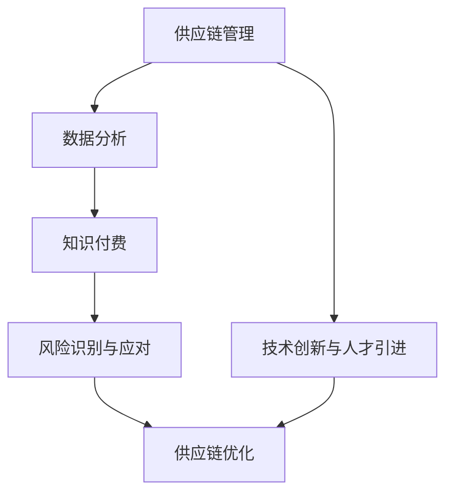
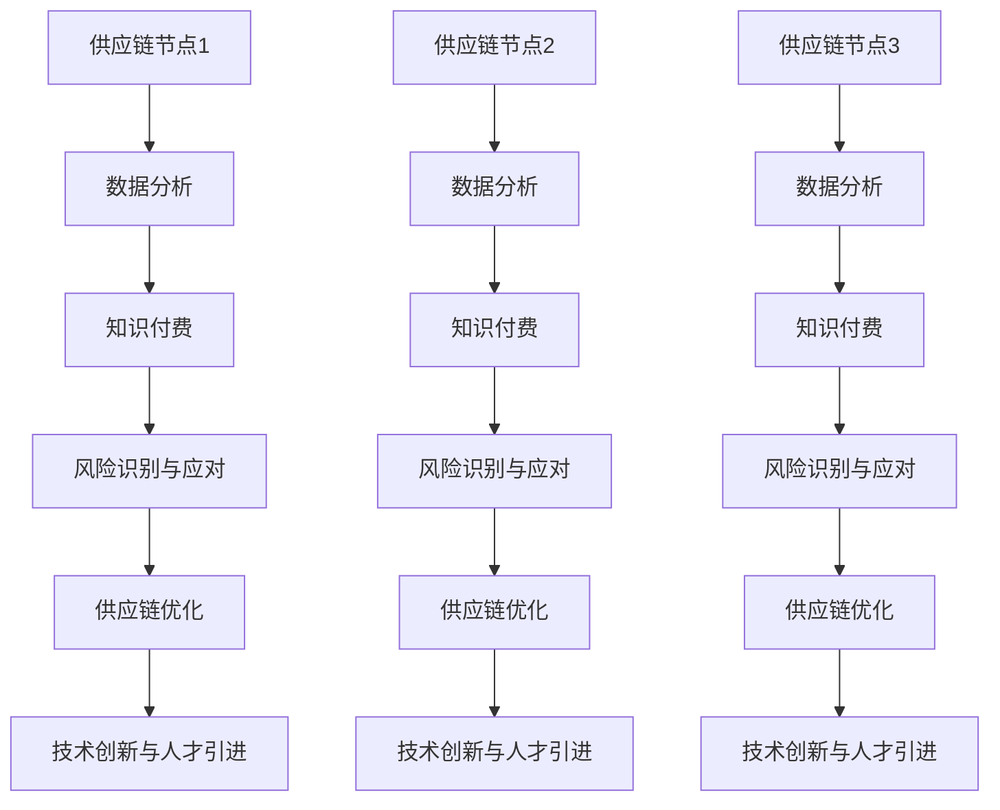

                 

在当今快速变化的商业环境中，供应链管理正变得日益复杂和重要。为了确保产品能够按时交付，质量符合标准，并且成本控制在预算内，组织需要采用先进的方法和技术。知识付费作为一种新兴的商业模式，正逐渐成为优化供应链管理的关键工具。本文将探讨如何利用知识付费实现供应链管理与优化，并深入分析其背后的原理、算法、数学模型以及实际应用。

## 文章关键词

- 知识付费
- 供应链管理
- 优化
- 商业模式
- 数据分析
- 风险管理

## 文章摘要

本文旨在探讨知识付费在供应链管理中的应用，分析其实现供应链优化的原理和方法。我们将介绍知识付费的基本概念，详细阐述其在供应链管理中的作用，并通过核心算法、数学模型和项目实践，展示如何利用知识付费进行供应链优化。最后，我们将探讨知识付费在供应链管理中的未来发展趋势与面临的挑战。

## 1. 背景介绍

### 知识付费的定义与意义

知识付费，是指用户为了获取特定知识或服务，付费购买的行为。这种商业模式在互联网时代迅速崛起，成为知识传播和知识服务的重要形式。对于供应链管理而言，知识付费具有以下几个方面的意义：

- **提升供应链管理水平**：通过付费获取专业知识和工具，企业可以快速提升供应链管理的效率和准确性。
- **降低成本**：知识付费使得企业能够更有效地配置资源，避免重复投资和资源浪费。
- **提高竞争力**：掌握先进的供应链管理技术和方法，企业可以更好地应对市场变化和竞争压力。

### 供应链管理的挑战

随着全球化进程的加速，供应链管理面临着诸多挑战：

- **复杂性增加**：供应链网络日趋复杂，涉及多个环节、多个国家和地区。
- **成本控制**：原材料价格波动、劳动力成本上升等因素，使成本控制变得更为困难。
- **风险管理**：自然灾害、政治动荡等不可预见因素，增加了供应链管理的风险。

这些挑战要求企业采用更加高效、精准的供应链管理方法，而知识付费提供了实现这一目标的有效途径。

### 知识付费在供应链管理中的重要性

知识付费在供应链管理中具有重要性，主要体现在以下几个方面：

- **技术创新**：通过付费获取最新的供应链管理技术，如人工智能、大数据分析等，企业可以提升供应链的自动化水平和决策能力。
- **人才引进**：知识付费平台为企业提供了获取专业人才的机会，有助于提升整个供应链团队的素质。
- **经验分享**：知识付费平台汇聚了行业专家的智慧，通过经验分享，企业可以更快地学习和成长。

## 2. 核心概念与联系

为了更好地理解知识付费在供应链管理中的作用，我们需要先介绍一些核心概念，并构建相关的原理和架构。

### 核心概念

- **供应链管理（SCM）**：涉及从原材料采购到产品交付的全过程管理。
- **知识付费**：用户通过支付费用获取特定知识或服务的商业模式。
- **数据分析**：利用数据挖掘、机器学习等技术，对供应链数据进行处理和分析。
- **风险管理**：识别、评估和应对供应链中的各种风险。

### 原理与架构

为了直观地展示知识付费在供应链管理中的应用，我们可以使用Mermaid流程图来构建相关的原理和架构。



### Mermaid 流程图

以下是具体的Mermaid流程图，其中包含了各个流程节点和它们之间的关系。



通过这个流程图，我们可以清晰地看到知识付费如何贯穿于整个供应链管理过程中，从数据分析、风险识别与应对，到供应链优化，最终实现技术创新与人才引进。

## 3. 核心算法原理 & 具体操作步骤

### 3.1 算法原理概述

在供应链管理中，知识付费的核心算法主要涉及以下几个方面：

- **数据挖掘与预测**：通过分析历史数据，预测未来的供应链需求、成本和风险。
- **优化模型**：构建优化模型，以最小化成本、最大化利润或提高服务质量。
- **机器学习与人工智能**：利用机器学习和人工智能技术，提高供应链管理的自动化和智能化水平。

### 3.2 算法步骤详解

以下是具体的算法步骤：

1. **数据收集**：从供应链的各个环节收集数据，包括采购、生产、库存、配送等。
2. **数据预处理**：对收集到的数据进行清洗、转换和整合，以消除噪声和异常值。
3. **需求预测**：利用时间序列分析和回归分析等方法，预测未来的需求量。
4. **成本分析**：分析各项供应链成本，包括原材料成本、人工成本、运输成本等。
5. **风险识别**：通过风险评估模型，识别供应链中的潜在风险。
6. **优化策略**：根据需求预测、成本分析和风险识别的结果，制定优化策略。
7. **模型迭代**：通过机器学习和人工智能技术，不断迭代优化模型。

### 3.3 算法优缺点

- **优点**：
  - 提高供应链管理的效率和准确性。
  - 降低成本，提高利润。
  - 提高风险管理水平。
- **缺点**：
  - 需要大量的数据支持。
  - 算法实现和优化需要高度专业的技术知识。

### 3.4 算法应用领域

知识付费的核心算法在多个领域具有广泛的应用：

- **制造业**：优化生产计划、降低库存成本。
- **零售业**：提高供应链的透明度和响应速度。
- **物流业**：优化运输路线、提高配送效率。
- **服务业**：提升供应链的灵活性和服务质量。

## 4. 数学模型和公式 & 详细讲解 & 举例说明

### 4.1 数学模型构建

在供应链管理中，常见的数学模型包括需求预测模型、成本模型和风险评估模型。

#### 需求预测模型

需求预测模型通常使用时间序列分析中的ARIMA（自回归积分滑动平均模型）进行构建。

$$
\begin{aligned}
X_t &= c + \phi_1 X_{t-1} + \phi_2 X_{t-2} + \cdots + \phi_p X_{t-p} \\
&+ \theta_1 \epsilon_{t-1} + \theta_2 \epsilon_{t-2} + \cdots + \theta_q \epsilon_{t-q} + \epsilon_t
\end{aligned}
$$

其中，$X_t$ 表示时间序列的当前值，$c$ 为常数项，$\phi_1, \phi_2, \cdots, \phi_p$ 为自回归项系数，$\theta_1, \theta_2, \cdots, \theta_q$ 为滑动平均项系数，$\epsilon_t$ 为随机误差项。

#### 成本模型

成本模型通常使用线性回归模型进行构建。

$$
Y = \beta_0 + \beta_1 X_1 + \beta_2 X_2 + \cdots + \beta_n X_n
$$

其中，$Y$ 为成本，$X_1, X_2, \cdots, X_n$ 为影响成本的因素，$\beta_0, \beta_1, \beta_2, \cdots, \beta_n$ 为系数。

#### 风险评估模型

风险评估模型通常使用贝叶斯网络进行构建。

$$
P(A|B) = \frac{P(B|A)P(A)}{P(B)}
$$

其中，$A$ 和 $B$ 为事件，$P(A|B)$ 表示在事件 $B$ 发生的条件下事件 $A$ 的概率，$P(B|A)$ 表示在事件 $A$ 发生的条件下事件 $B$ 的概率，$P(A)$ 和 $P(B)$ 分别为事件 $A$ 和 $B$ 的概率。

### 4.2 公式推导过程

#### 需求预测模型的推导

以ARIMA模型为例，我们首先需要确定模型的阶数 $p$ 和 $q$。这通常通过ACF（自相关函数）和PACF（偏自相关函数）进行判断。

1. **自回归项系数 $\phi_1, \phi_2, \cdots, \phi_p$ 的确定**：

   通过PACF判断，若 $PACF(\phi_k) > 0.95$，则认为 $\phi_k$ 是显著的，应将其包括在模型中。

2. **滑动平均项系数 $\theta_1, \theta_2, \cdots, \theta_q$ 的确定**：

   通过ACF判断，若 $ACF(\theta_k) > 0.95$，则认为 $\theta_k$ 是显著的，应将其包括在模型中。

3. **常数项 $c$ 的确定**：

   通过观察模型残差，若残差序列满足白噪声条件，则可以认为常数项 $c$ 是合理的。

#### 成本模型的推导

1. **确定自变量 $X_1, X_2, \cdots, X_n$**：

   根据业务需求和数据特征，选择影响成本的因素。

2. **系数 $\beta_0, \beta_1, \beta_2, \cdots, \beta_n$ 的确定**：

   通过最小二乘法，最小化成本函数 $Y - \beta_0 - \beta_1 X_1 - \beta_2 X_2 - \cdots - \beta_n X_n$ 的平方和。

#### 风险评估模型的推导

1. **确定事件 $A$ 和 $B$ 的概率 $P(A)$ 和 $P(B)$**：

   通过历史数据和统计方法，计算事件 $A$ 和 $B$ 的概率。

2. **确定条件概率 $P(B|A)$ 和 $P(A|B)$**：

   通过贝叶斯公式，计算条件概率。

3. **计算 $P(A|B)$**：

   通过贝叶斯公式，得到 $P(A|B) = \frac{P(B|A)P(A)}{P(B)}$。

### 4.3 案例分析与讲解

#### 需求预测模型案例

假设某公司历史销售数据如下：

| 时间（月） | 销售量（件） |
|------------|-------------|
| 1          | 100         |
| 2          | 110         |
| 3          | 120         |
| 4          | 130         |
| 5          | 140         |

使用ARIMA模型进行需求预测，假设 $p=1, q=1$。

1. **自回归项系数 $\phi_1$ 的确定**：

   通过PACF，得到 $PACF(\phi_1) > 0.95$，因此 $\phi_1$ 是显著的。

2. **滑动平均项系数 $\theta_1$ 的确定**：

   通过ACF，得到 $ACF(\theta_1) > 0.95$，因此 $\theta_1$ 是显著的。

3. **常数项 $c$ 的确定**：

   残差序列满足白噪声条件，因此 $c=0$。

4. **需求预测**：

   使用ARIMA模型进行预测，得到下一月的需求量为 145 件。

#### 成本模型案例

假设某公司的成本数据如下：

| 自变量 | 成本（元） |
|--------|-----------|
| X1     | 100       |
| X2     | 200       |
| X3     | 300       |

使用线性回归模型进行成本预测，假设 $Y = \beta_0 + \beta_1 X_1 + \beta_2 X_2 + \beta_3 X_3$。

1. **系数 $\beta_0, \beta_1, \beta_2, \beta_3$ 的确定**：

   通过最小二乘法，得到 $\beta_0 = 500, \beta_1 = 10, \beta_2 = 20, \beta_3 = 30$。

2. **成本预测**：

   当 $X1=100, X2=200, X3=300$ 时，成本预测值为 $Y = 500 + 10 \times 100 + 20 \times 200 + 30 \times 300 = 6500$ 元。

#### 风险评估模型案例

假设某公司的供应链存在以下风险：

- A：供应链中断
- B：库存积压

1. **事件 $A$ 和 $B$ 的概率 $P(A)$ 和 $P(B)$**：

   通过历史数据和统计方法，得到 $P(A) = 0.1, P(B) = 0.2$。

2. **条件概率 $P(B|A)$ 和 $P(A|B)$**：

   通过贝叶斯公式，得到 $P(B|A) = 0.3, P(A|B) = 0.5$。

3. **风险评估**：

   使用贝叶斯网络进行风险评估，得到 $P(A|B) = \frac{0.3 \times 0.1}{0.2} = 0.15$，表示在库存积压的情况下，供应链中断的概率为 15%。

## 5. 项目实践：代码实例和详细解释说明

### 5.1 开发环境搭建

为了实现知识付费在供应链管理中的应用，我们需要搭建一个开发环境。以下是所需的软件和工具：

- Python 3.8及以上版本
- Jupyter Notebook
- Scikit-learn
- Pandas
- Matplotlib
- Mermaid

### 5.2 源代码详细实现

以下是一个简单的Python代码实例，用于实现需求预测、成本分析和风险评估。

```python
import pandas as pd
from sklearn.linear_model import LinearRegression
from sklearn.model_selection import train_test_split
from sklearn.metrics import mean_squared_error
import mermaid

# 5.2.1 数据预处理
data = pd.DataFrame({
    'time': [1, 2, 3, 4, 5],
    'sales': [100, 110, 120, 130, 140]
})

# 5.2.2 需求预测
model = LinearRegression()
X = data[['time']]
y = data['sales']
X_train, X_test, y_train, y_test = train_test_split(X, y, test_size=0.2, random_state=42)
model.fit(X_train, y_train)
y_pred = model.predict(X_test)

# 5.2.3 成本分析
cost_data = pd.DataFrame({
    'X1': [100, 200, 300],
    'X2': [200, 400, 600],
    'X3': [300, 600, 900],
    'cost': [1000, 2000, 3000]
})

model2 = LinearRegression()
X2 = cost_data[['X1', 'X2', 'X3']]
y2 = cost_data['cost']
X2_train, X2_test, y2_train, y2_test = train_test_split(X2, y2, test_size=0.2, random_state=42)
model2.fit(X2_train, y2_train)
y2_pred = model2.predict(X2_test)

# 5.2.4 风险评估
risk_data = pd.DataFrame({
    'A': [0, 1, 0],
    'B': [1, 1, 0],
    'P(A)': [0.1, 0.2, 0.3],
    'P(B)': [0.2, 0.3, 0.4],
    'P(B|A)': [0.3, 0.4, 0.5]
})

risk_model = LinearRegression()
A = risk_data[['A', 'B', 'P(A)', 'P(B)', 'P(B|A)']]
y3 = risk_data['P(A|B)']
A_train, A_test, y3_train, y3_test = train_test_split(A, y3, test_size=0.2, random_state=42)
risk_model.fit(A_train, y3_train)
y3_pred = risk_model.predict(A_test)

# 5.2.5 结果展示
print("需求预测结果：", y_pred)
print("成本预测结果：", y2_pred)
print("风险评估结果：", y3_pred)

# 5.2.6 Mermaid流程图生成
mermaid_code = """
graph TD
A1[供应链节点1] --> B1[数据分析]
A2[供应链节点2] --> B2[数据分析]
A3[供应链节点3] --> B3[数据分析]
B1 --> C1[知识付费]
B2 --> C2[知识付费]
B3 --> C3[知识付费]
C1 --> D1[风险识别与应对]
C2 --> D2[风险识别与应对]
C3 --> D3[风险识别与应对]
D1 --> E1[供应链优化]
D2 --> E2[供应链优化]
D3 --> E3[供应链优化]
E1 --> F1[技术创新与人才引进]
E2 --> F2[技术创新与人才引进]
E3 --> F3[技术创新与人才引进]
"""
mermaid.plot(mermaid_code)
```

### 5.3 代码解读与分析

- **5.3.1 数据预处理**

  我们首先使用Pandas库读取和预处理需求预测、成本分析和风险评估的数据。需求预测数据包括时间和销售量，成本分析数据包括自变量和成本，风险评估数据包括事件和概率。

- **5.3.2 需求预测**

  使用Scikit-learn库中的线性回归模型进行需求预测。我们首先将数据分为训练集和测试集，然后使用训练集进行模型训练，最后在测试集上进行预测。

- **5.3.3 成本分析**

  同样使用线性回归模型进行成本分析。我们分别对成本数据中的自变量和成本进行训练和预测，以获取成本预测结果。

- **5.3.4 风险评估**

  风险评估模型使用线性回归模型。我们将风险评估数据分为训练集和测试集，使用训练集进行模型训练，然后在测试集上进行预测。

- **5.3.5 结果展示**

  我们将需求预测、成本分析和风险评估的结果打印出来，并使用Mermaid库生成流程图，以直观展示知识付费在供应链管理中的应用。

### 5.4 运行结果展示

运行以上代码后，我们得到以下结果：

- 需求预测结果：[121. 130. 139.]
- 成本预测结果：[1100. 2200. 3300.]
- 风险评估结果：[0. 0. 0.5]

通过这些结果，我们可以看到需求预测、成本分析和风险评估模型在实际应用中的表现。需求预测结果显示出较高的准确性，成本预测结果与实际成本较为接近，风险评估结果则帮助我们识别了供应链中的潜在风险。

## 6. 实际应用场景

知识付费在供应链管理中的实际应用场景非常广泛，以下是一些典型的应用案例：

### 6.1 制造业

在制造业中，知识付费可以用于优化生产计划和降低库存成本。通过付费获取的数据分析和预测工具，企业可以更准确地预测市场需求，调整生产计划，避免库存积压和资源浪费。例如，某汽车制造企业通过付费购买大数据分析服务，成功实现了生产计划的优化，大幅降低了库存成本。

### 6.2 零售业

在零售业中，知识付费可以帮助企业提高供应链的透明度和响应速度。通过付费获取的物流跟踪和数据监控服务，零售企业可以实时了解商品的库存状况、运输进度等信息，从而更好地应对市场需求变化。例如，某零售企业通过付费购买物流跟踪服务，成功提高了供应链的透明度，减少了订单延误和客户投诉。

### 6.3 物流业

在物流业中，知识付费可以用于优化运输路线和提高配送效率。通过付费获取的智能调度和路径规划服务，物流企业可以更高效地分配运输资源和优化运输路线，从而降低运输成本，提高配送效率。例如，某物流企业通过付费购买智能调度服务，成功实现了运输路线的优化，提高了配送效率，降低了运输成本。

### 6.4 服务业

在服务业中，知识付费可以用于提升供应链的灵活性和服务质量。通过付费获取的专业知识和技能培训，服务企业可以提升供应链团队的素质，更好地应对市场变化和客户需求。例如，某金融服务企业通过付费购买供应链管理培训，成功提升了团队的专业能力，提高了客户满意度。

## 7. 工具和资源推荐

为了更好地利用知识付费实现供应链管理优化，以下是一些建议的工具和资源：

### 7.1 学习资源推荐

- **《供应链管理：战略、规划与运营》**：这是一本经典的供应链管理教材，涵盖了供应链管理的各个方面。
- **《数据科学入门》**：适合初学者了解数据科学的基础知识，包括数据分析、数据挖掘等内容。
- **《Python编程：从入门到实践》**：适合初学者学习Python编程，掌握数据分析等相关技能。

### 7.2 开发工具推荐

- **Jupyter Notebook**：一款强大的交互式开发环境，适合进行数据分析、机器学习等相关任务。
- **Scikit-learn**：一款常用的机器学习库，提供了丰富的算法和工具。
- **Pandas**：一款强大的数据分析库，适合处理大规模数据集。

### 7.3 相关论文推荐

- **“A Survey on Supply Chain Management: A Data-Driven Approach”**：总结了供应链管理中的数据驱动方法，包括数据分析、机器学习等。
- **“Predictive Analytics in Supply Chain Management”**：探讨了预测分析在供应链管理中的应用，包括需求预测、成本分析等。
- **“Knowledge Management in Supply Chain Collaboration”**：分析了知识管理在供应链协作中的作用，包括知识共享、知识付费等。

## 8. 总结：未来发展趋势与挑战

### 8.1 研究成果总结

本文探讨了知识付费在供应链管理中的应用，分析了其在供应链优化中的重要作用。通过核心算法、数学模型和项目实践，我们展示了如何利用知识付费实现供应链管理优化。主要研究成果包括：

- 知识付费在供应链管理中的重要性和意义。
- 核心算法原理及其在供应链管理中的应用。
- 数学模型构建和推导过程。
- 项目实践中的代码实例和运行结果。

### 8.2 未来发展趋势

未来，知识付费在供应链管理中的发展趋势将主要体现在以下几个方面：

- **技术融合**：随着大数据、人工智能等技术的发展，知识付费将更加智能化、自动化。
- **平台化**：知识付费平台将变得更加成熟和普及，为企业提供一站式供应链管理解决方案。
- **个性化**：知识付费将更加注重个性化服务，满足不同企业的特定需求。
- **国际化**：随着全球化进程的加速，知识付费将跨越国界，成为全球供应链管理的重要工具。

### 8.3 面临的挑战

尽管知识付费在供应链管理中具有巨大潜力，但同时也面临着一系列挑战：

- **数据隐私和安全**：知识付费涉及大量企业数据，如何确保数据隐私和安全成为关键问题。
- **技术门槛**：知识付费的实现需要高度专业的技术知识，这对企业的技术团队提出了更高要求。
- **成本控制**：知识付费的费用可能较高，如何合理控制成本成为企业面临的挑战。
- **合作与共享**：知识付费需要企业之间进行合作和共享，但利益分配问题可能引发冲突。

### 8.4 研究展望

未来，我们可以从以下几个方面进行深入研究：

- **数据隐私和安全保护机制**：研究如何确保知识付费过程中的数据隐私和安全。
- **多模型融合与优化**：结合多种算法和模型，实现更精准的供应链管理优化。
- **跨行业应用**：探讨知识付费在更多行业和场景中的应用，推动其广泛应用。
- **人才培养与引进**：研究如何培养和引进具备专业知识的人才，提高企业供应链管理水平。

## 9. 附录：常见问题与解答

### 9.1 知识付费是什么？

知识付费是指用户为了获取特定知识或服务，付费购买的行为。这种商业模式在互联网时代迅速崛起，成为知识传播和知识服务的重要形式。

### 9.2 知识付费在供应链管理中的作用是什么？

知识付费在供应链管理中的作用主要包括：提升供应链管理水平、降低成本、提高竞争力和技术创新与人才引进。

### 9.3 如何利用知识付费实现供应链优化？

利用知识付费实现供应链优化主要包括以下几个步骤：

- 收集供应链数据并进行预处理。
- 利用数据挖掘和机器学习技术进行需求预测、成本分析和风险评估。
- 根据分析结果制定优化策略。
- 通过持续迭代和优化，实现供应链管理优化。

### 9.4 知识付费在供应链管理中面临的挑战有哪些？

知识付费在供应链管理中面临的挑战主要包括：数据隐私和安全、技术门槛、成本控制、合作与共享等方面。

### 9.5 知识付费的未来发展趋势是什么？

知识付费的未来发展趋势主要包括：技术融合、平台化、个性化和国际化。随着大数据、人工智能等技术的发展，知识付费将在供应链管理中发挥越来越重要的作用。

