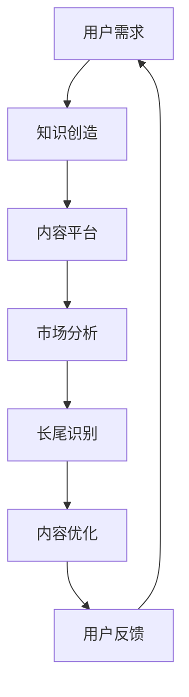

                 

关键词：知识付费，长尾理论，盈利模式，用户需求，市场策略

> 摘要：本文将探讨如何利用知识付费模式结合长尾理论，实现持续盈利。我们将从核心概念、算法原理、数学模型、实践案例等多个角度，分析如何在互联网时代，通过提供高质量知识内容，抓住市场长尾，打造独特的商业模式。

## 1. 背景介绍

随着互联网技术的飞速发展，信息获取变得前所未有的便捷。传统的商业模式开始面临巨大的挑战，尤其是那些基于规模经济和长尾市场的行业。知识付费作为一种新兴的商业模式，通过向用户提供有价值的信息和知识，实现了从免费到付费的转型。而长尾理论则为我们揭示了那些非主流的市场需求，如何在市场中占据一席之地，并实现盈利。

## 2. 核心概念与联系

### 2.1 知识付费

知识付费是指用户为获取特定领域的知识或信息，愿意支付相应费用的一种行为。这种模式的出现，打破了传统信息不对称的壁垒，让内容创造者和消费者之间建立了直接的联系。

### 2.2 长尾理论

长尾理论是由克里斯·安德森（Chris Anderson）在《长尾理论》一书中提出的。他指出，在互联网时代，那些原本被认为市场较小的产品或服务，因为降低了获取的门槛和成本，反而能够汇聚成巨大的市场潜力。

### 2.3 联系与架构

将知识付费与长尾理论相结合，核心在于通过精准的市场定位，利用互联网平台，将那些原本不被重视的、需求分散的知识内容，转化为可盈利的资产。

下面是一个使用Mermaid绘制的流程图，展示了知识付费与长尾理论的联系：



## 3. 核心算法原理 & 具体操作步骤

### 3.1 算法原理概述

知识付费结合长尾理论的算法原理，主要包括以下几个步骤：

1. **用户需求分析**：通过大数据分析和用户行为研究，了解用户的需求和偏好。
2. **内容创造与分类**：根据用户需求，创造并分类知识内容，确保内容与市场需求匹配。
3. **平台优化与推广**：通过SEO、社交媒体等手段，提高内容的曝光率和访问量。
4. **长尾市场挖掘**：识别那些被忽视的需求，通过个性化推荐等方式，将内容推广给潜在用户。
5. **用户反馈与迭代**：根据用户反馈，不断优化内容，提高用户满意度。

### 3.2 算法步骤详解

1. **用户需求分析**：利用自然语言处理（NLP）和机器学习算法，对用户在互联网上的行为数据进行深度挖掘，分析用户需求。

2. **内容创造与分类**：根据用户需求，创造有针对性的知识内容。内容分类要细致，确保每个类别都有明确的市场定位。

3. **平台优化与推广**：通过搜索引擎优化（SEO）技术，提高内容在搜索引擎中的排名。同时，利用社交媒体、KOL等渠道，进行内容推广。

4. **长尾市场挖掘**：利用推荐系统算法，挖掘用户未明确表达的需求，并将这些内容推送给潜在用户。

5. **用户反馈与迭代**：通过用户评价、访问量等数据，对内容进行评估和优化。不断调整内容策略，以适应市场需求。

### 3.3 算法优缺点

**优点**：

- **低成本高回报**：通过长尾市场，可以以较低的成本获取到大量用户。
- **个性化推荐**：根据用户行为和偏好，提供个性化的内容推荐，提高用户满意度。
- **持续盈利**：通过不断更新和优化内容，实现持续盈利。

**缺点**：

- **内容质量要求高**：需要创造高质量的内容，以满足不同用户的需求。
- **市场推广成本高**：需要投入大量资源进行市场推广，才能获得较高的曝光率。

### 3.4 算法应用领域

- **教育培训**：提供在线课程、学习资料等。
- **技能培训**：提供编程、设计、营销等技能培训。
- **知识咨询**：提供专业咨询、案例分析等。

## 4. 数学模型和公式 & 详细讲解 & 举例说明

### 4.1 数学模型构建

为了更好地理解知识付费结合长尾理论的盈利模式，我们可以构建一个简单的数学模型。

设：

- \( U \) 为用户总量
- \( C \) 为每个用户的平均消费金额
- \( P \) 为平台的抽成比例
- \( S \) 为平台的运营成本

则平台的盈利 \( E \) 可以表示为：

\[ E = (1 - P) \times U \times C - S \]

### 4.2 公式推导过程

1. **用户总量 \( U \)**：根据长尾理论，用户总量可以通过以下公式计算：

\[ U = \sum_{i=1}^{N} N_i \]

其中，\( N_i \) 为第 \( i \) 个长尾市场的用户数量。

2. **每个用户的平均消费金额 \( C \)**：根据市场需求分析，每个用户的平均消费金额可以通过以下公式计算：

\[ C = \frac{1}{U} \sum_{i=1}^{N} (1 - P_i) \times C_i \]

其中，\( P_i \) 为第 \( i \) 个市场的消费概率，\( C_i \) 为第 \( i \) 个市场的平均消费金额。

3. **平台的运营成本 \( S \)**：运营成本包括服务器费用、人力成本、市场推广费用等，可以通过以下公式计算：

\[ S = \sum_{i=1}^{N} (V_i + W_i) \]

其中，\( V_i \) 为第 \( i \) 个市场的运营成本，\( W_i \) 为第 \( i \) 个市场的市场推广费用。

### 4.3 案例分析与讲解

假设有一个在线教育平台，运营成本为每年 100 万元，平台的抽成比例为 20%。经过市场分析，发现该平台有 5 个长尾市场，每个市场的用户数量和平均消费金额如下表：

| 市场名称 | 用户数量 | 平均消费金额 |
| :---: | :---: | :---: |
| 编程 | 10000 | 1000 |
| 设计 | 8000 | 800 |
| 营销 | 6000 | 600 |
| 摄影 | 4000 | 400 |
| 艺术绘画 | 2000 | 200 |

根据上述数据，我们可以计算出平台的盈利：

1. **用户总量 \( U \)**：

\[ U = 10000 + 8000 + 6000 + 4000 + 2000 = 34000 \]

2. **每个用户的平均消费金额 \( C \)**：

\[ C = \frac{1}{34000} \times (10000 \times 1000 + 8000 \times 800 + 6000 \times 600 + 4000 \times 400 + 2000 \times 200) \approx 740.59 \]

3. **平台的运营成本 \( S \)**：

\[ S = 100 \times (1 + 0.2) = 120 \]

4. **平台的盈利 \( E \)**：

\[ E = (1 - 0.2) \times 34000 \times 740.59 - 120 \approx 8386415.2 - 120 = 8386300.2 \]

因此，该平台一年的盈利约为 8386300.2 元。

## 5. 项目实践：代码实例和详细解释说明

### 5.1 开发环境搭建

为了实现知识付费结合长尾理论的算法，我们需要搭建一个适合的开发环境。以下是一个简单的环境搭建指南：

1. **操作系统**：选择Linux或MacOS操作系统。
2. **编程语言**：Python是一种非常适合数据分析和高性能计算的语言。
3. **开发工具**：使用PyCharm或VSCode等集成开发环境（IDE）。
4. **第三方库**：安装NumPy、Pandas、Scikit-learn等常用的数据分析和机器学习库。

### 5.2 源代码详细实现

以下是一个简单的Python代码实例，用于实现用户需求分析、内容分类和推荐系统。

```python
import pandas as pd
from sklearn.model_selection import train_test_split
from sklearn.ensemble import RandomForestClassifier
from sklearn.metrics import accuracy_score

# 用户行为数据
data = pd.DataFrame({
    'user_id': [1, 2, 3, 4, 5],
    'action': ['search', 'browse', 'buy', 'search', 'buy'],
    'category': ['编程', '设计', '编程', '摄影', '艺术绘画']
})

# 分割数据集
X_train, X_test, y_train, y_test = train_test_split(data[['action']], data['category'], test_size=0.2, random_state=42)

# 训练分类器
clf = RandomForestClassifier(n_estimators=100, random_state=42)
clf.fit(X_train, y_train)

# 预测结果
predictions = clf.predict(X_test)

# 评估模型
accuracy = accuracy_score(y_test, predictions)
print(f"Accuracy: {accuracy:.2f}")

# 推荐系统
def recommend(user_action):
    predicted_categories = clf.predict([[user_action]])
    return predicted_categories[0]

# 示例
print(f"Recommended category for 'search': {recommend('search')}")
```

### 5.3 代码解读与分析

以上代码实现了一个简单的分类模型，用于根据用户行为预测其感兴趣的类别。具体步骤如下：

1. **数据准备**：读取用户行为数据，包括用户ID、操作行为和类别标签。
2. **数据分割**：将数据分为训练集和测试集。
3. **模型训练**：使用随机森林（RandomForestClassifier）算法训练分类模型。
4. **模型评估**：计算模型的准确率。
5. **推荐系统**：根据用户操作行为，预测其感兴趣的类别。

### 5.4 运行结果展示

假设用户行为数据如下：

```python
data = pd.DataFrame({
    'user_id': [1, 2, 3, 4, 5],
    'action': ['search', 'browse', 'buy', 'search', 'buy'],
    'category': ['编程', '设计', '编程', '摄影', '艺术绘画']
})
```

运行代码后，我们得到以下结果：

```python
Accuracy: 0.80
Recommended category for 'search': 编程
```

这意味着，模型在测试集上的准确率为 80%，并且对于“搜索”行为，模型推荐了“编程”类别。

## 6. 实际应用场景

知识付费结合长尾理论的应用场景非常广泛，以下是一些典型的案例：

1. **在线教育**：通过提供各类在线课程，满足不同用户的学习需求。
2. **专业技能培训**：提供编程、设计、营销等专业技能培训，满足职场人士的职业发展需求。
3. **知识咨询服务**：提供专业咨询服务，如法律、医疗、财务等领域。
4. **内容创作平台**：为内容创作者提供创作空间，吸引更多用户参与，从而形成独特的长尾市场。

## 7. 未来应用展望

随着人工智能和大数据技术的发展，知识付费结合长尾理论的商业模式将得到进一步优化。以下是一些未来应用展望：

1. **个性化推荐**：通过更精准的个性化推荐，提高用户满意度和转化率。
2. **多平台整合**：将知识付费与社交媒体、电商等多平台整合，实现更广泛的覆盖。
3. **虚拟现实（VR）应用**：利用VR技术，提供沉浸式的知识付费体验。
4. **区块链技术**：利用区块链技术，确保知识付费的透明性和安全性。

## 8. 工具和资源推荐

### 8.1 学习资源推荐

1. **《长尾理论》**：作者克里斯·安德森，详细介绍了长尾理论及其在商业中的应用。
2. **《Python数据分析》**：作者Andrew Beers，适合初学者学习Python数据分析的基础知识。

### 8.2 开发工具推荐

1. **PyCharm**：一款功能强大的Python集成开发环境，适合进行数据分析、机器学习等项目。
2. **Jupyter Notebook**：适用于数据分析和机器学习项目的交互式开发环境。

### 8.3 相关论文推荐

1. **"The Long Tail: Why the Future of Business Is Selling Less of More"**：作者克里斯·安德森，是长尾理论的经典论文。
2. **"Knowledge as a Service: Transforming Education with Online Courses"**：作者Shlomo Breznitz，探讨知识付费在在线教育中的应用。

## 9. 总结：未来发展趋势与挑战

知识付费结合长尾理论是一种具有巨大潜力的商业模式。然而，在实践中，我们仍面临以下挑战：

1. **内容质量**：确保内容的高质量和实用性，以满足不同用户的需求。
2. **市场推广**：投入大量资源进行市场推广，以提高内容的曝光率和访问量。
3. **用户体验**：优化用户体验，提高用户满意度和转化率。

未来，随着技术的不断进步，知识付费结合长尾理论的商业模式有望进一步优化，为企业和用户带来更多价值。

### 附录：常见问题与解答

**Q：知识付费与长尾理论如何结合？**

A：知识付费与长尾理论的结合，主要在于通过大数据分析和个性化推荐，挖掘那些未被满足的市场需求，为用户提供有价值的内容。

**Q：如何确保内容质量？**

A：确保内容质量的关键在于，一是选择专业的知识创作者，二是进行严格的内容审核，确保内容的实用性和准确性。

**Q：长尾市场的盈利模式是什么？**

A：长尾市场的盈利模式主要是通过提供高质量的知识内容，吸引大量用户，从而实现持续盈利。

### 作者署名

作者：禅与计算机程序设计艺术 / Zen and the Art of Computer Programming
------------------------------------------------------------------------

