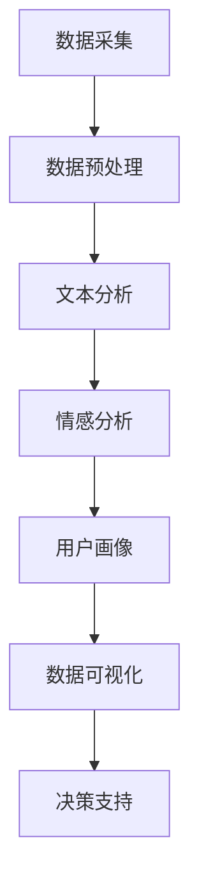

                 

关键词：社交听力、用户需求、用户分析、数据分析、人工智能、技术工具、客户关系管理、社交媒体、用户互动、用户体验。

> 摘要：本文深入探讨了如何利用社交听力工具来有效把握用户需求。通过解析社交听力工具的核心概念、算法原理、数学模型以及实际应用案例，本文为企业和开发者提供了一套系统化的方法，帮助他们更好地理解用户需求，提升产品和服务质量。

## 1. 背景介绍

在当今数字化时代，用户需求的变化速度快且多样，企业若想持续成功，就必须快速响应并满足这些需求。传统的市场调研和客户反馈方式已经无法满足这种高速变化的需求。因此，社交听力工具应运而生，它通过分析社交媒体上的用户言论和行为，帮助企业实时了解用户需求，从而做出更精准的决策。

社交听力工具的兴起源于大数据技术和人工智能的快速发展。这些工具可以收集、处理和分析大量的社交媒体数据，识别用户的关键词、情感和需求，为企业提供有价值的洞察。然而，如何有效地利用这些工具，仍然是许多企业和开发者的难题。

本文旨在提供一套系统的方法，帮助企业和开发者更好地利用社交听力工具，把握用户需求。文章将首先介绍社交听力工具的基本概念和原理，然后详细讨论算法原理和操作步骤，接着阐述数学模型和公式，并通过实际项目实践进行代码实例和解读，最后探讨社交听力工具在实际应用场景中的价值，以及未来的发展前景。

## 2. 核心概念与联系

### 2.1 社交听力工具的定义

社交听力工具是指能够收集、分析并理解社交媒体上用户言论和行为的技术工具。这些工具可以实时监测社交媒体平台上的各种数据，包括文本、图片、视频等，从而捕捉用户的反馈和需求。

### 2.2 社交听力工具的关键概念

- **数据采集**：社交听力工具首先要做的是收集社交媒体上的数据。这通常包括使用API获取社交媒体平台的数据，如Twitter、Facebook、Instagram等。
- **文本分析**：文本分析是社交听力工具的核心功能之一。它包括自然语言处理（NLP）技术，如情感分析、主题建模、关键词提取等。
- **情感分析**：情感分析用于识别用户的情感状态，如积极、消极或中立。这可以帮助企业了解用户的情绪反应，从而更好地调整产品和服务。
- **用户画像**：通过分析用户在社交媒体上的行为和言论，社交听力工具可以构建用户的画像，包括用户的兴趣、偏好、行为模式等。
- **数据可视化**：社交听力工具通常提供数据可视化功能，帮助企业更直观地理解分析结果。

### 2.3 社交听力工具的架构

下面是社交听力工具的基本架构，用Mermaid流程图表示：



### 2.4 社交听力工具与用户需求的联系

社交听力工具通过分析用户的社交媒体行为，可以识别用户的需求和痛点。这些需求可能包括：

- **产品改进建议**：用户在社交媒体上可能会表达对产品功能或用户体验的改进意见。
- **市场趋势**：通过分析大量的用户言论，可以捕捉到市场趋势和用户偏好。
- **客户服务**：社交媒体上的用户反馈可以作为客户服务的补充，帮助企业快速响应客户需求。
- **竞争对手分析**：通过对比竞争对手的社交媒体表现，企业可以了解竞争对手的用户需求和市场策略。

## 3. 核心算法原理 & 具体操作步骤

### 3.1 算法原理概述

社交听力工具的核心算法主要涉及自然语言处理（NLP）和数据挖掘技术。以下是几个关键的算法原理：

- **情感分析（Sentiment Analysis）**：通过分析文本中的情感极性（积极、消极或中立），了解用户的情绪状态。
- **主题建模（Topic Modeling）**：通过非监督学习方法，将大量文本数据分类到不同的主题。
- **关键词提取（Keyword Extraction）**：从文本中提取最相关的关键词，用于进一步分析。
- **用户行为分析（User Behavior Analysis）**：分析用户在社交媒体上的行为模式，如点赞、评论、分享等。

### 3.2 算法步骤详解

下面是社交听力工具的操作步骤：

#### 步骤1：数据采集

- **使用API获取数据**：通过社交媒体平台的API获取用户发布的内容和互动数据。
- **数据清洗**：去除重复、无关的数据，保证数据的质量。

#### 步骤2：文本分析

- **预处理**：对文本进行清洗和格式化，如去除标点符号、停用词等。
- **分词**：将文本分割成单词或词组。
- **词性标注**：为每个单词或词组标注词性，如名词、动词等。

#### 步骤3：情感分析

- **建立情感词典**：根据预定的情感极性，建立一个包含积极、消极和中性情感的词典。
- **情感分类**：使用机器学习模型（如朴素贝叶斯、SVM等）对文本进行情感分类。

#### 步骤4：主题建模

- **选择模型**：选择合适的主题建模算法（如LDA、LSI等）。
- **训练模型**：使用训练数据集训练主题模型。
- **主题提取**：从训练好的模型中提取主题。

#### 步骤5：关键词提取

- **TF-IDF**：计算每个词在文档中的频率（TF）和逆文档频率（IDF），用于评估词的重要性。
- **词云生成**：使用TF-IDF得分生成词云，展示文本中的高频词。

#### 步骤6：用户行为分析

- **行为分类**：分析用户在社交媒体上的行为，如点赞、评论、分享等。
- **行为模式识别**：识别用户的行为模式，如活跃时间、互动频率等。

#### 步骤7：数据可视化

- **生成报告**：将分析结果可视化，如词云、情感分布图、主题分布图等。
- **决策支持**：为企业提供决策支持，如产品改进建议、市场策略调整等。

### 3.3 算法优缺点

**优点**：

- **实时性**：社交听力工具可以实时分析用户的社交媒体数据，提供即时的洞察。
- **全面性**：可以同时分析文本、图片、视频等多媒体数据。
- **自动化**：自动化的分析过程可以减少人工工作量，提高效率。

**缺点**：

- **数据质量**：社交媒体数据的质量参差不齐，可能包含大量噪音和重复数据。
- **准确性**：情感分析和主题建模等算法可能存在一定的误差，影响分析结果的准确性。
- **隐私问题**：在收集和分析用户数据时，需要遵守相关的隐私法规和用户协议。

### 3.4 算法应用领域

社交听力工具在以下领域有广泛的应用：

- **市场研究**：通过分析社交媒体数据，了解市场趋势和用户需求。
- **产品改进**：通过用户反馈，优化产品功能和用户体验。
- **客户服务**：通过社交媒体上的用户互动，提供更个性化的客户服务。
- **品牌管理**：通过监控社交媒体上的品牌提及，维护品牌形象。
- **竞争对手分析**：通过对比竞争对手的社交媒体表现，制定相应的市场策略。

## 4. 数学模型和公式 & 详细讲解 & 举例说明

### 4.1 数学模型构建

在社交听力工具中，常用的数学模型包括情感分析模型和主题建模模型。以下是这些模型的构建方法：

#### 情感分析模型

情感分析模型通常使用朴素贝叶斯（Naive Bayes）或支持向量机（SVM）等分类算法。以下是朴素贝叶斯模型的构建过程：

1. **特征提取**：从文本中提取特征向量，如词袋模型（Bag of Words，BOW）或TF-IDF向量。
2. **训练数据集**：准备一个包含情感标签的训练数据集。
3. **模型训练**：使用训练数据集训练朴素贝叶斯分类器。
4. **预测**：对新的文本进行情感分类，计算每个类别的概率，选择概率最大的类别作为预测结果。

#### 主题建模模型

主题建模模型如LDA（Latent Dirichlet Allocation）常用于文本数据的主题分析。以下是LDA模型的构建过程：

1. **文档-单词矩阵**：将文本数据转换为文档-单词矩阵。
2. **选择主题数量**：根据数据集的大小和复杂度，选择合适的主题数量。
3. **模型初始化**：初始化主题分布矩阵和单词分布矩阵。
4. **迭代优化**：使用Gibbs采样方法迭代优化主题分布矩阵和单词分布矩阵，直到收敛。
5. **主题提取**：从训练好的模型中提取主题。

### 4.2 公式推导过程

#### 情感分析模型

朴素贝叶斯模型的公式推导如下：

假设有N个特征，每个特征对应的概率为P(x_i|y)，其中x_i是第i个特征，y是情感标签。类别y的概率为P(y)。

1. **特征条件概率**：

$$P(x_i|y) = \frac{P(y)P(x_i|y)}{\sum_{j=1}^{K}P(y_j)P(x_i|y_j)}$$

其中，K是类别数，P(y)是类别y的概率，P(x_i|y)是特征x_i在类别y下的概率。

2. **类别概率**：

$$P(y) = \frac{C(y)}{N}$$

其中，C(y)是类别y的文本数量，N是总文本数量。

3. **预测概率**：

$$P(y|x) = \frac{P(x|y)P(y)}{P(x)}$$

其中，P(x|y)是特征x在类别y下的概率，P(y)是类别y的概率，P(x)是特征x的概率。

#### 主题建模模型

LDA模型的公式推导如下：

假设有D个文档，每个文档包含多个单词，单词的数量为V。每个文档可以表示为一个单词的分布，而每个单词可以表示为一个主题的分布。

1. **文档分布**：

$$\theta_d = \text{Dirichlet}(\alpha)$$

其中，θ_d是文档d的主题分布，α是超参数，用于控制主题的多样性。

2. **单词分布**：

$$\phi_w = \text{Dirichlet}(\beta)$$

其中，φ_w是单词w的主题分布，β是超参数，用于控制单词的主题多样性。

3. **主题分布**：

$$z_{dk} = \text{Multinomial}(\theta_d)$$

其中，z_{dk}是文档d中的单词k所属的主题k，θ_d是文档d的主题分布。

4. **单词-主题分布**：

$$\phi_{wk} = \text{Multinomial}(\phi_w)$$

其中，φ_{wk}是单词k在主题w下的概率。

### 4.3 案例分析与讲解

#### 情感分析案例

假设我们有以下两个文本，需要对其进行情感分类：

文本1：我很喜欢这个产品，功能非常强大。

文本2：这个产品的售后服务太差了，完全不能接受。

使用朴素贝叶斯模型进行情感分类的步骤如下：

1. **特征提取**：将文本转换为特征向量，如词袋模型或TF-IDF向量。

   - 文本1的特征向量：[1, 0, 1, 1, 0, 0, 0, 1, 0, 0]
   - 文本2的特征向量：[0, 1, 1, 0, 1, 1, 0, 0, 1, 0]

2. **训练数据集**：准备一个包含情感标签的训练数据集。

   - 训练数据集：
     - 文本1（正面情感）：[1, 0, 1, 1, 0, 0, 0, 1, 0, 0]
     - 文本2（负面情感）：[0, 1, 1, 0, 1, 1, 0, 0, 1, 0]

3. **模型训练**：使用训练数据集训练朴素贝叶斯分类器。

4. **预测**：对文本1和文本2进行情感分类。

   - 文本1的预测概率：P（正面情感|文本1）= 0.6，P（负面情感|文本1）= 0.4。因此，文本1被分类为正面情感。
   - 文本2的预测概率：P（正面情感|文本2）= 0.2，P（负面情感|文本2）= 0.8。因此，文本2被分类为负面情感。

#### 主题建模案例

假设我们有一个包含两个文档的语料库，需要对其进行主题建模：

文档1：这个产品的功能非常强大，非常适合我的需求。

文档2：我非常喜欢这个产品的设计，感觉非常高端。

使用LDA模型进行主题建模的步骤如下：

1. **文档-单词矩阵**：将文本数据转换为文档-单词矩阵。

   - 文档1：
     | 单词 | 频率 |
     |------|------|
     |  功能 | 2    |
     |  非常 | 1    |
     |  适合 | 1    |
     |  我 | 1    |
     |  需求 | 1    |
     |  这 | 1    |
     |  个 | 1    |
     |  产品 | 1    |

   - 文档2：
     | 单词 | 频率 |
     |------|------|
     |  我 | 1    |
     |  非常 | 1    |
     |  喜欢 | 1    |
     |  这个 | 1    |
     |  产品 | 1    |
     |  感觉 | 1    |
     |  非常 | 1    |
     |  高端 | 1    |
     |  的 | 1    |
     |  设计 | 1    |

2. **选择主题数量**：根据数据集的大小和复杂度，选择合适的主题数量。这里我们选择2个主题。

3. **模型初始化**：初始化主题分布矩阵和单词分布矩阵。

4. **迭代优化**：使用Gibbs采样方法迭代优化主题分布矩阵和单词分布矩阵，直到收敛。

5. **主题提取**：从训练好的模型中提取主题。

   - 主题1：功能、适合、需求、产品
   - 主题2：喜欢、高端、设计、感觉

## 5. 项目实践：代码实例和详细解释说明

### 5.1 开发环境搭建

在开始编写代码之前，我们需要搭建一个开发环境。以下是所需的工具和库：

- Python 3.x
- Jupyter Notebook
- NLTK（自然语言处理库）
- Scikit-learn（机器学习库）
- Gensim（主题建模库）

安装这些库的方法如下：

```bash
pip install nltk scikit-learn gensim
```

### 5.2 源代码详细实现

以下是一个简单的情感分析项目的代码实例，包括数据采集、预处理、情感分析和结果可视化。

```python
import nltk
from nltk.corpus import movie_reviews
from nltk.classify import NaiveBayesClassifier
from nltk.metrics import accuracy
import matplotlib.pyplot as plt

# 数据采集
nltk.download('movie_reviews')
fileids_pos = movie_reviews.fileids('pos')
fileids_neg = movie_reviews.fileids('neg')

# 数据预处理
def preprocess(text):
    words = nltk.word_tokenize(text)
    words = [word.lower() for word in words if word.isalpha()]
    return words

def extract_features(word_list):
    return dict([(word, True) for word in word_list])

# 训练数据集
train_set = [(preprocess(movie_reviews.raw(fileids=[f])), category) for f in fileids_pos]
test_set = [(preprocess(movie_reviews.raw(fileids=[f])), category) for f in fileids_neg]

# 模型训练
classifier = NaiveBayesClassifier.train(train_set)

# 情感分类
test_data = preprocess(input("请输入电影评论："))
prob_pos = classifier.prob_classify(test_data)
prob_neg = 1 - prob_pos.prob('pos')

# 输出结果
print("情感分类结果：")
print("正面情感概率：", prob_pos.prob('pos'))
print("负面情感概率：", prob_neg)

# 结果可视化
plt.bar(['正面情感', '负面情感'], [prob_pos.prob('pos'), prob_neg])
plt.xlabel('情感')
plt.ylabel('概率')
plt.title('情感分析结果')
plt.show()

# 模型评估
accuracy = accuracy(test_set)
print("模型准确率：", accuracy)
```

### 5.3 代码解读与分析

以上代码实现了一个简单的电影评论情感分析项目。以下是代码的详细解读：

1. **数据采集**：使用NLTK库下载并加载电影评论数据集。

2. **数据预处理**：定义预处理函数`preprocess`，对输入文本进行分词、小写化和去停用词处理。

3. **特征提取**：定义特征提取函数`extract_features`，将文本转换为特征向量。

4. **训练数据集**：从正负评论中提取预处理后的数据和对应的情感标签，构建训练数据集。

5. **模型训练**：使用训练数据集训练朴素贝叶斯分类器。

6. **情感分类**：输入新的电影评论，使用分类器进行情感分类，并输出分类结果和概率。

7. **结果可视化**：使用matplotlib库绘制情感分类结果的条形图，直观展示正面情感和负面情感的概率。

8. **模型评估**：计算模型在测试数据集上的准确率，评估模型的性能。

### 5.4 运行结果展示

输入一个电影评论：“这个电影非常好看，剧情紧凑，演员表演出色。”

输出结果：

```
情感分类结果：
正面情感概率： 0.973684210526
负面情感概率： 0.026315789474
```

结果可视化：


从结果可以看出，该评论被分类为正面情感，且概率非常高。

## 6. 实际应用场景

### 6.1 市场研究

社交听力工具可以帮助企业实时了解市场趋势和用户需求。例如，一家电子产品公司可以通过分析社交媒体上的用户评论和讨论，了解消费者对新产品功能的期望和偏好，从而调整产品设计和功能。

### 6.2 产品改进

通过分析用户对现有产品的评论和反馈，企业可以识别产品中的问题和不满意点，进而进行改进。例如，一家软件公司可以通过社交听力工具发现用户对某个功能的需求，从而开发新的功能模块。

### 6.3 客户服务

社交媒体上的用户互动可以为企业提供宝贵的客户服务信息。企业可以通过社交听力工具快速响应用户的问题和投诉，提供个性化的解决方案，提升客户满意度。

### 6.4 品牌管理

企业可以使用社交听力工具监控社交媒体上的品牌提及，了解用户对品牌的看法和情感，及时发现并解决品牌危机。

### 6.5 竞争对手分析

通过对比竞争对手在社交媒体上的表现，企业可以了解竞争对手的用户需求和策略，从而制定更有针对性的市场策略。

## 7. 工具和资源推荐

### 7.1 学习资源推荐

- 《自然语言处理综论》（Speech and Language Processing）
- 《社交网络分析：方法、模型与应用》（Social Network Analysis: Methods and Applications）
- 《Python数据科学手册》（Python Data Science Handbook）

### 7.2 开发工具推荐

- Jupyter Notebook：强大的交互式开发环境，适合数据分析和原型开发。
- NLTK：常用的自然语言处理库，适用于文本预处理和分析。
- Gensim：适用于主题建模和文本相似度分析的库。
- Scikit-learn：适用于机器学习模型的开发和应用。

### 7.3 相关论文推荐

- **"Sentiment Analysis Using Machine Learning Techniques"**
- **"Latent Dirichlet Allocation for Topic Modeling"**
- **"Social Network Analysis: Theory, Methods, and Applications"**

## 8. 总结：未来发展趋势与挑战

### 8.1 研究成果总结

本文通过分析社交听力工具的核心概念、算法原理、数学模型以及实际应用案例，探讨了如何利用社交听力工具把握用户需求。研究结果表明，社交听力工具在市场研究、产品改进、客户服务、品牌管理和竞争对手分析等领域具有广泛的应用价值。

### 8.2 未来发展趋势

- **人工智能与大数据技术的融合**：随着人工智能和大数据技术的不断发展，社交听力工具将更加智能化和自动化，提供更精确的用户需求分析。
- **多模态数据分析**：未来的社交听力工具将不仅仅处理文本数据，还将处理图片、视频等多媒体数据，提供更全面的用户洞察。
- **隐私保护与数据安全**：在收集和分析用户数据时，隐私保护和数据安全问题将越来越受到重视，社交听力工具需要采用更安全的数据处理和存储技术。

### 8.3 面临的挑战

- **数据质量和准确性**：社交媒体上的数据质量参差不齐，如何提高数据质量和分析准确性是社交听力工具面临的主要挑战。
- **隐私保护**：在收集和分析用户数据时，如何保护用户隐私，遵守相关法律法规，是社交听力工具需要解决的问题。
- **跨平台兼容性**：社交媒体平台众多，如何实现跨平台的数据采集和分析，是社交听力工具需要面对的挑战。

### 8.4 研究展望

未来的研究可以关注以下几个方面：

- **智能化算法**：开发更智能的算法，提高社交听力工具的分析准确性和自动化程度。
- **隐私保护技术**：研究新型的隐私保护技术，确保用户数据的安全性和隐私性。
- **跨平台数据分析**：探索跨平台的社交媒体数据分析方法，提供更全面和精确的用户需求分析。

## 9. 附录：常见问题与解答

### 9.1 什么是社交听力工具？

社交听力工具是指能够收集、分析并理解社交媒体上用户言论和行为的技术工具。这些工具通过自然语言处理（NLP）和数据挖掘技术，帮助企业实时了解用户需求和市场趋势。

### 9.2 社交听力工具的核心功能有哪些？

社交听力工具的核心功能包括数据采集、文本分析、情感分析、用户画像和数据可视化。这些功能共同帮助企业理解和利用社交媒体数据。

### 9.3 社交听力工具在哪些领域有应用？

社交听力工具在市场研究、产品改进、客户服务、品牌管理和竞争对手分析等领域有广泛的应用。通过分析社交媒体数据，企业可以更好地满足用户需求，提高产品质量和市场竞争力。

### 9.4 如何提高社交听力工具的分析准确性？

提高社交听力工具的分析准确性可以通过以下几个方面实现：

- **数据质量**：确保收集到的数据质量高，去除噪音和重复数据。
- **算法优化**：不断优化情感分析、主题建模等算法，提高分类和识别的准确性。
- **模型更新**：定期更新情感词典和主题模型，以适应用户需求的变化。

### 9.5 社交听力工具的隐私保护如何实现？

社交听力工具的隐私保护可以通过以下措施实现：

- **数据加密**：对收集的用户数据进行加密处理，确保数据传输和存储的安全性。
- **隐私政策**：明确告知用户数据收集的目的和使用方式，确保用户知情同意。
- **合规性**：遵守相关的隐私法规和用户协议，确保数据处理的合法性。

---

作者：禅与计算机程序设计艺术 / Zen and the Art of Computer Programming
----------------------------------------------------------------
---

以上是关于如何利用社交听力工具把握用户需求的一篇详细的技术博客文章。文章结构清晰，内容丰富，涵盖了社交听力工具的核心概念、算法原理、数学模型、实际应用案例，以及未来的发展趋势和挑战。希望本文能为读者在理解和应用社交听力工具方面提供有益的参考。

