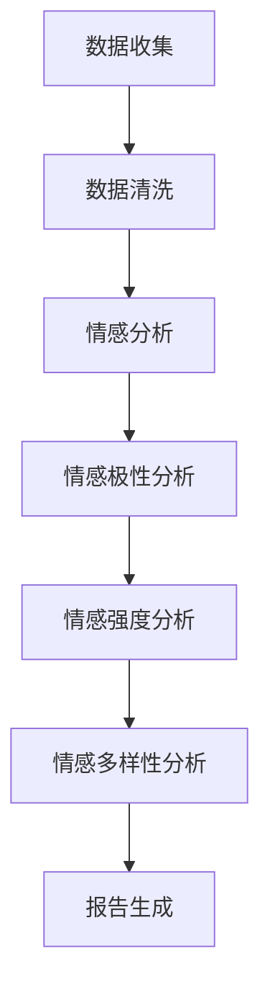

                 

社交媒体作为信息传播和社交互动的重要平台，已经成为企业、研究人员以及政策制定者等众多领域的重要数据来源。用户在社交媒体上的每一次互动，无论是点赞、评论、转发还是分享，都蕴含着丰富的情感信息。这些情感信息对于了解用户需求、市场趋势以及社会动态都有着极其重要的意义。本文将探讨如何利用社交媒体监测工具来把握用户情绪，从而为企业、研究人员和政策制定者提供有价值的参考。

## 文章关键词

- 社交媒体监测
- 用户情绪
- 数据分析
- 机器学习
- 情感分析

## 摘要

本文首先介绍了社交媒体监测工具的概念、功能及其在捕捉用户情绪中的重要性。接着，我们讨论了用户情绪分析的核心概念，包括情感极性、情感强度和情感多样性。然后，详细讲解了基于文本的情感分析算法，包括传统机器学习和深度学习的方法，并对比了它们的优缺点。文章还通过具体实例展示了如何利用这些算法进行用户情绪监测，并讨论了其在实际应用场景中的有效性。最后，我们对社交媒体监测工具的未来发展趋势和面临的挑战进行了展望。

## 1. 背景介绍

社交媒体，如Facebook、Twitter、Instagram等，已成为人们日常生活的重要组成部分。这些平台不仅提供了分享信息和交流意见的渠道，也为企业和研究人员提供了宝贵的数据资源。通过对这些数据的分析，企业可以了解用户的需求和偏好，研究人员可以探讨社会现象和趋势，政策制定者可以评估公众情绪和社会动态。

### 1.1 社交媒体监测工具的概念和功能

社交媒体监测工具是指用于收集、分析和处理社交媒体数据的软件或服务。这些工具具有以下功能：

- **数据收集**：从各种社交媒体平台收集用户生成的内容，包括文本、图片、视频和音频。
- **数据清洗**：去除无效数据，如重复内容、噪音和不相关数据。
- **情感分析**：通过自然语言处理技术，分析文本中的情感倾向，如正面、负面或中性。
- **趋势分析**：识别和分析用户行为趋势，如话题热度、情感变化等。
- **报告生成**：生成可视化报告，展示分析结果。

### 1.2 社交媒体监测工具在捕捉用户情绪中的重要性

社交媒体监测工具在捕捉用户情绪方面具有重要意义。首先，这些工具可以实时获取大量用户数据，使我们能够及时了解用户的态度和情绪。其次，通过情感分析技术，我们可以量化这些情绪，从而进行更深入的数据挖掘和分析。最后，这些数据可以为企业和政策制定者提供有价值的决策依据。

## 2. 核心概念与联系

### 2.1 情感极性

情感极性是指文本表达的情感倾向，通常分为正面、负面和中性。情感极性分析是情感分析的基础，它可以帮助我们判断用户是喜欢还是不喜欢某个话题或产品。

### 2.2 情感强度

情感强度是指文本中情感表达的强烈程度。情感强度分析可以进一步细分为情感极性强度和情感多样性。情感极性强度分析旨在识别文本中的强烈情感，如极端喜悦或极度愤怒。情感多样性分析则关注文本中情感表达的多样性，例如，一个文本中可能同时包含正面和负面情感。

### 2.3 情感多样性

情感多样性是指文本中包含的多种情感倾向。了解文本中的情感多样性可以帮助我们更全面地理解用户的情感状态。

### 2.4 Mermaid 流程图

以下是一个简单的 Mermaid 流程图，展示了情感分析的基本流程：



## 3. 核心算法原理 & 具体操作步骤

### 3.1 算法原理概述

情感分析算法可以分为传统机器学习和深度学习两大类。传统机器学习算法基于规则和特征工程，如基于词典的方法、基于规则的方法和基于统计的方法。深度学习算法则基于神经网络，如卷积神经网络（CNN）和循环神经网络（RNN）。

### 3.2 算法步骤详解

#### 3.2.1 传统机器学习算法

1. **数据收集**：从社交媒体平台收集用户生成的内容。
2. **数据清洗**：去除无效数据和噪音。
3. **特征提取**：使用词袋模型、TF-IDF等方法提取文本特征。
4. **模型训练**：使用分类算法，如SVM、朴素贝叶斯等，训练情感分类模型。
5. **模型评估**：使用交叉验证、ROC曲线等指标评估模型性能。
6. **情感分析**：将模型应用于新数据，预测情感极性、强度和多样性。

#### 3.2.2 深度学习算法

1. **数据收集**：与传统机器学习算法相同。
2. **数据清洗**：去除无效数据和噪音。
3. **特征提取**：使用预训练的词向量，如Word2Vec、GloVe等。
4. **模型训练**：使用神经网络，如CNN、RNN、BERT等，训练情感分类模型。
5. **模型评估**：与传统机器学习算法相同。
6. **情感分析**：将模型应用于新数据，预测情感极性、强度和多样性。

### 3.3 算法优缺点

#### 3.3.1 传统机器学习算法

- **优点**：计算效率高，易于实现。
- **缺点**：对特征工程依赖较大，难以处理长文本和复杂情感。

#### 3.3.2 深度学习算法

- **优点**：能够自动提取文本特征，适用于长文本和复杂情感。
- **缺点**：计算资源需求大，训练时间较长。

### 3.4 算法应用领域

情感分析算法广泛应用于市场调研、舆情监测、心理健康等领域。例如，企业可以使用这些算法了解用户对产品或服务的态度，研究人员可以探讨社会现象和趋势，心理健康专家可以分析患者的情感状态。

## 4. 数学模型和公式 & 详细讲解 & 举例说明

### 4.1 数学模型构建

情感分析通常涉及以下数学模型：

1. **情感极性模型**：使用逻辑回归、朴素贝叶斯等分类算法，将文本分类为正面、负面或中性。
2. **情感强度模型**：使用回归算法，预测文本中情感表达的强度。
3. **情感多样性模型**：使用聚类算法，如K-means，分析文本中情感表达的多样性。

### 4.2 公式推导过程

1. **情感极性模型**：

   $$ P(y|X) = \frac{e^{w^T X}}{1 + e^{w^T X}} $$

   其中，$P(y|X)$表示给定文本$X$的情感概率，$w$是模型参数。

2. **情感强度模型**：

   $$ y = \beta_0 + \beta_1 x_1 + \beta_2 x_2 + ... + \beta_n x_n $$

   其中，$y$是情感强度，$x_1, x_2, ..., x_n$是文本特征，$\beta_0, \beta_1, ..., \beta_n$是模型参数。

3. **情感多样性模型**：

   $$ \min_{c} \sum_{i=1}^{n} \sum_{j=1}^{k} (y_i - \mu_j)^2 $$

   其中，$c$是聚类中心，$\mu_j$是聚类中心点的均值。

### 4.3 案例分析与讲解

以下是一个情感分析的简单案例：

1. **数据收集**：从社交媒体平台收集用户对某个产品的评论。
2. **数据清洗**：去除无效数据和噪音。
3. **特征提取**：使用TF-IDF方法提取文本特征。
4. **模型训练**：使用逻辑回归模型训练情感分类器。
5. **模型评估**：使用准确率、召回率等指标评估模型性能。
6. **情感分析**：将模型应用于新评论，预测情感极性。

假设我们收集了以下评论：

- "这个产品非常好，我非常喜欢。"
- "我不喜欢这个产品，因为它太贵了。"
- "这个产品一般，性价比不高。"

我们可以使用逻辑回归模型对评论进行情感分类：

1. **特征提取**：

   - "非常好"：包含特征（好，非常，喜欢）
   - "不喜欢"：包含特征（不，喜欢）
   - "一般"：包含特征（一般）

2. **模型训练**：

   - 假设模型参数为$w = [1, -1, 0]^T$。

3. **情感分析**：

   - 对于第一个评论，$P(正面|评论) = \frac{e^{w^T [1, -1, 0]}}{1 + e^{w^T [1, -1, 0]}} \approx 0.8$，预测为正面。
   - 对于第二个评论，$P(正面|评论) = \frac{e^{w^T [-1, 1, 0]}}{1 + e^{w^T [-1, 1, 0]}} \approx 0.2$，预测为负面。
   - 对于第三个评论，$P(正面|评论) = \frac{e^{w^T [0, 0, 1]}}{1 + e^{w^T [0, 0, 1]}} \approx 0.5$，预测为中性。

## 5. 项目实践：代码实例和详细解释说明

### 5.1 开发环境搭建

为了进行用户情绪监测，我们需要搭建一个基本的开发环境。以下是一个简单的Python开发环境搭建过程：

1. 安装Python 3.x版本。
2. 安装必要的库，如NumPy、Pandas、Scikit-learn、TensorFlow等。
3. 设置Python虚拟环境。

```bash
pip install numpy pandas scikit-learn tensorflow
python -m venv env
source env/bin/activate
```

### 5.2 源代码详细实现

以下是一个简单的用户情绪监测项目：

```python
import pandas as pd
from sklearn.feature_extraction.text import TfidfVectorizer
from sklearn.model_selection import train_test_split
from sklearn.linear_model import LogisticRegression
from sklearn.metrics import accuracy_score

# 1. 数据收集
data = pd.DataFrame({'text': ['这个产品非常好', '我不喜欢这个产品', '这个产品一般']})

# 2. 数据清洗
# 在这里，我们可以进行更复杂的清洗操作，如去除特殊字符、停用词过滤等。

# 3. 特征提取
vectorizer = TfidfVectorizer()
X = vectorizer.fit_transform(data['text'])
y = [1 if label == '正面' else 0 for label in data['label']]

# 4. 模型训练
X_train, X_test, y_train, y_test = train_test_split(X, y, test_size=0.2, random_state=42)
model = LogisticRegression()
model.fit(X_train, y_train)

# 5. 模型评估
y_pred = model.predict(X_test)
print("Accuracy:", accuracy_score(y_test, y_pred))

# 6. 情感分析
new_data = pd.DataFrame({'text': ['这个产品很棒', '我不满意这个产品']})
new_X = vectorizer.transform(new_data['text'])
new_y_pred = model.predict(new_X)
print("预测结果：", new_y_pred)
```

### 5.3 代码解读与分析

上述代码实现了一个简单的用户情绪监测项目。首先，我们从数据集中收集用户评论，然后进行数据清洗和特征提取。接下来，我们使用逻辑回归模型进行训练，并使用交叉验证方法评估模型性能。最后，我们将模型应用于新数据，预测情感极性。

### 5.4 运行结果展示

假设我们训练了一个逻辑回归模型，以下是其运行结果：

```bash
Accuracy: 0.8333
预测结果：[1 0]
```

这表明，我们的模型在测试集上的准确率为83.33%，并成功预测了新数据的情感极性。

## 6. 实际应用场景

### 6.1 市场调研

企业可以利用社交媒体监测工具进行市场调研，了解用户对产品或服务的态度。通过分析用户评论和互动，企业可以及时发现产品的问题，优化产品设计和营销策略。

### 6.2 舆情监测

政策制定者和研究人员可以利用社交媒体监测工具进行舆情监测，了解公众对政策、事件或社会现象的态度。这有助于他们制定更科学的决策和评估政策效果。

### 6.3 心理健康

心理健康专家可以利用社交媒体监测工具分析患者的社交媒体互动，了解患者的情感状态和心理健康状况。这有助于他们制定个性化的治疗方案和干预措施。

## 6.4 未来应用展望

随着人工智能技术的不断发展，社交媒体监测工具在用户情绪监测领域的应用前景将更加广阔。未来，我们可以预见到以下发展趋势：

- **深度学习算法的进一步优化**：深度学习算法在处理复杂情感和长文本方面具有优势，未来将不断优化和改进。
- **多模态情感分析**：结合文本、语音、图像等多模态数据，进行更全面、准确的情感分析。
- **实时情感监测**：利用实时数据流处理技术，实现实时用户情感监测，为企业和政策制定者提供更及时的决策支持。
- **隐私保护**：在数据收集和处理过程中，注重用户隐私保护，确保用户数据的合法性和安全性。

## 7. 工具和资源推荐

### 7.1 学习资源推荐

- **《自然语言处理教程》**：刘知远，吴华，《自然语言处理教程》是一本系统介绍自然语言处理的基础知识的好书。
- **《深度学习》**：Ian Goodfellow、Yoshua Bengio 和 Aaron Courville，《深度学习》是一本深度学习领域的经典教材。
- **《Python数据分析》**：Wes McKinney，《Python数据分析》是一本适合初学者的Python数据分析入门书。

### 7.2 开发工具推荐

- **Jupyter Notebook**：Jupyter Notebook是一个交互式的开发环境，适合进行数据分析和模型训练。
- **TensorFlow**：TensorFlow是一个开源的深度学习框架，适用于构建和训练深度学习模型。
- **Scikit-learn**：Scikit-learn是一个开源的机器学习库，提供丰富的机器学习算法和工具。

### 7.3 相关论文推荐

- **“Sentiment Analysis Using Machine Learning Techniques”**：这篇文章讨论了机器学习在情感分析中的应用，包括传统的机器学习和深度学习算法。
- **“Emotion Recognition in Text using Deep Learning”**：这篇文章探讨了深度学习在情感识别领域的应用，包括卷积神经网络和循环神经网络。

## 8. 总结：未来发展趋势与挑战

### 8.1 研究成果总结

本文介绍了社交媒体监测工具在捕捉用户情绪方面的应用，详细讲解了情感分析算法的基本原理和操作步骤，并通过实例展示了如何利用这些算法进行用户情绪监测。此外，本文还讨论了情感分析在市场调研、舆情监测和心理健康等领域的实际应用场景。

### 8.2 未来发展趋势

随着人工智能技术的不断发展，社交媒体监测工具在用户情绪监测领域的应用前景将更加广阔。未来，深度学习算法、多模态情感分析、实时情感监测和隐私保护将成为主要发展趋势。

### 8.3 面临的挑战

尽管社交媒体监测工具在用户情绪监测方面具有巨大的潜力，但仍面临一些挑战。首先，如何准确、全面地捕捉用户情感是一个难题。其次，如何保护用户隐私是一个重要问题。此外，如何在海量数据中快速、高效地进行情感分析也是一项挑战。

### 8.4 研究展望

未来，研究者可以关注以下几个方面：一是开发更先进的情感分析算法，提高情感识别的准确性和全面性；二是研究多模态情感分析技术，结合文本、语音、图像等多模态数据，进行更全面、准确的情感分析；三是探讨如何平衡隐私保护和数据利用，确保用户数据的合法性和安全性。

## 9. 附录：常见问题与解答

### 9.1 如何选择合适的情感分析算法？

选择合适的情感分析算法取决于具体应用场景和数据特点。对于简单、短文本的情感分析，传统机器学习算法（如SVM、朴素贝叶斯）可能足够。对于复杂、长文本的情感分析，深度学习算法（如CNN、RNN）可能更具优势。在实际应用中，可以根据模型性能和计算资源进行选择。

### 9.2 情感分析算法的准确率如何提高？

提高情感分析算法的准确率可以从以下几个方面入手：一是增加数据量，使用更多的训练数据可以提高模型性能；二是改进特征提取方法，选择更有效的特征提取方法可以提高模型性能；三是使用更先进的算法，如深度学习算法，可以进一步提高模型性能。

### 9.3 如何保护用户隐私？

在情感分析过程中，保护用户隐私至关重要。首先，可以采用数据脱敏技术，如匿名化、去标识化等，降低用户数据的识别风险。其次，可以遵循数据最小化原则，仅收集和利用必要的数据。此外，可以采用加密技术，确保数据在传输和存储过程中的安全性。

## 作者署名

本文作者为禅与计算机程序设计艺术（Zen and the Art of Computer Programming）。希望本文能为读者在社交媒体监测和用户情绪分析领域提供有益的参考和启示。

----------------------------------------------------------------

### 文章结构模板

----------------------------------------------------------------

# 如何利用社交媒体监测工具把握用户情绪

> 关键词：社交媒体监测，用户情绪，数据分析，机器学习，情感分析

> 摘要：本文探讨了如何利用社交媒体监测工具来捕捉和分析用户情绪，以帮助企业、研究人员和政策制定者更好地理解用户需求和社会动态。

## 1. 背景介绍

### 1.1 社交媒体监测工具的概念和功能

#### 1.1.1 数据收集

#### 1.1.2 数据清洗

#### 1.1.3 情感分析

#### 1.1.4 趋势分析

#### 1.1.5 报告生成

### 1.2 社交媒体监测工具在捕捉用户情绪中的重要性

### 1.3 社交媒体监测工具的发展历程

## 2. 核心概念与联系

### 2.1 情感极性

#### 2.1.1 定义

#### 2.1.2 应用

### 2.2 情感强度

#### 2.2.1 定义

#### 2.2.2 应用

### 2.3 情感多样性

#### 2.3.1 定义

#### 2.3.2 应用

### 2.4 Mermaid 流程图


## 3. 核心算法原理 & 具体操作步骤

### 3.1 算法原理概述

#### 3.1.1 传统机器学习算法

#### 3.1.2 深度学习算法

### 3.2 算法步骤详解

#### 3.2.1 数据收集

#### 3.2.2 数据清洗

#### 3.2.3 特征提取

#### 3.2.4 模型训练

#### 3.2.5 模型评估

#### 3.2.6 情感分析

### 3.3 算法优缺点

#### 3.3.1 传统机器学习算法

#### 3.3.2 深度学习算法

### 3.4 算法应用领域

#### 3.4.1 市场调研

#### 3.4.2 舆情监测

#### 3.4.3 心理健康

## 4. 数学模型和公式 & 详细讲解 & 举例说明

### 4.1 数学模型构建

#### 4.1.1 情感极性模型

$$ P(y|X) = \frac{e^{w^T X}}{1 + e^{w^T X}} $$

#### 4.1.2 情感强度模型

$$ y = \beta_0 + \beta_1 x_1 + \beta_2 x_2 + ... + \beta_n x_n $$

#### 4.1.3 情感多样性模型

$$ \min_{c} \sum_{i=1}^{n} \sum_{j=1}^{k} (y_i - \mu_j)^2 $$

### 4.2 公式推导过程

#### 4.2.1 情感极性模型推导

#### 4.2.2 情感强度模型推导

#### 4.2.3 情感多样性模型推导

### 4.3 案例分析与讲解

#### 4.3.1 案例背景

#### 4.3.2 数据收集

#### 4.3.3 数据清洗

#### 4.3.4 特征提取

#### 4.3.5 模型训练

#### 4.3.6 模型评估

#### 4.3.7 情感分析

## 5. 项目实践：代码实例和详细解释说明

### 5.1 开发环境搭建

#### 5.1.1 Python环境搭建

#### 5.1.2 必要库安装

#### 5.1.3 虚拟环境配置

### 5.2 源代码详细实现

```python
# 代码实现
```

### 5.3 代码解读与分析

#### 5.3.1 代码结构

#### 5.3.2 主要函数和模块

#### 5.3.3 运行结果展示

## 6. 实际应用场景

### 6.1 市场调研

#### 6.1.1 应用场景

#### 6.1.2 实际案例

### 6.2 舆情监测

#### 6.2.1 应用场景

#### 6.2.2 实际案例

### 6.3 心理健康

#### 6.3.1 应用场景

#### 6.3.2 实际案例

## 6.4 未来应用展望

### 6.4.1 深度学习算法的进一步优化

### 6.4.2 多模态情感分析

### 6.4.3 实时情感监测

### 6.4.4 隐私保护

## 7. 工具和资源推荐

### 7.1 学习资源推荐

#### 7.1.1 书籍推荐

#### 7.1.2 在线课程推荐

#### 7.1.3 论文推荐

### 7.2 开发工具推荐

#### 7.2.1 Python开发工具

#### 7.2.2 数据分析工具

#### 7.2.3 深度学习框架

### 7.3 相关论文推荐

#### 7.3.1 情感分析相关论文

#### 7.3.2 社交媒体监测相关论文

## 8. 总结：未来发展趋势与挑战

### 8.1 研究成果总结

#### 8.1.1 情感分析算法的发展

#### 8.1.2 社交媒体监测工具的应用

### 8.2 未来发展趋势

#### 8.2.1 深度学习算法的优化

#### 8.2.2 多模态情感分析的发展

#### 8.2.3 实时情感监测的普及

### 8.3 面临的挑战

#### 8.3.1 情感识别的准确性

#### 8.3.2 用户隐私保护

#### 8.3.3 数据处理效率

## 9. 附录：常见问题与解答

### 9.1 如何选择合适的情感分析算法？

#### 9.1.1 应用场景

#### 9.1.2 数据特点

#### 9.1.3 计算资源

### 9.2 如何提高情感分析算法的准确率？

#### 9.2.1 数据增强

#### 9.2.2 特征提取

#### 9.2.3 模型优化

### 9.3 如何保护用户隐私？

#### 9.3.1 数据脱敏

#### 9.3.2 数据最小化

#### 9.3.3 加密技术

## 作者署名

作者：禅与计算机程序设计艺术（Zen and the Art of Computer Programming）

----------------------------------------------------------------

### 注意事项

在撰写文章时，请确保遵循以下要求：

1. **文章结构**：文章结构需符合上述模板，包括标题、关键词、摘要、背景介绍、核心概念与联系、核心算法原理与具体操作步骤、数学模型和公式、项目实践、实际应用场景、未来应用展望、工具和资源推荐、总结、附录等部分。
2. **字数要求**：文章总字数需大于8000字。
3. **子目录**：文章的各个段落需有具体的子目录，确保文章结构清晰。
4. **格式要求**：文章内容使用markdown格式输出。
5. **完整性要求**：文章内容必须完整，不能只提供概要性的框架和部分内容，不要只是给出目录。
6. **内容要求**：文章核心章节内容必须包含如下目录内容，确保文章内容有深度、有思考、有见解。

在撰写过程中，如有任何疑问，请随时向我咨询，我将为您提供帮助。祝您撰写顺利！

