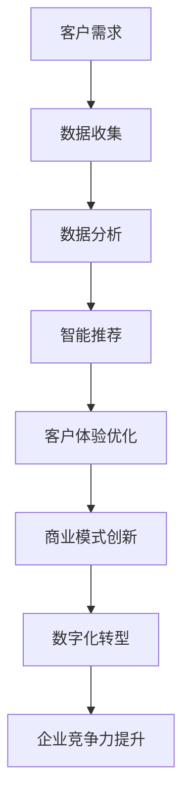

                 

关键词：AI经济、商业模式、数字化转型、技术革新、未来展望

> 摘要：本文将探讨如何在人工智能驱动的经济时代把握商业大势，分析AI技术的核心作用，阐述商业模式的创新路径，并展望未来的发展趋势和挑战。

## 1. 背景介绍

随着人工智能技术的快速发展，AI已经成为引领第四次工业革命的核心力量。从大数据处理、自然语言处理到计算机视觉，人工智能正在深刻改变着各行各业的生产方式和服务模式。AI技术不仅提升了企业的运营效率，还带来了全新的商业模式和创新机会。在这种背景下，企业如何把握AI经济中的商业大势，成为摆在所有企业领导者面前的重要课题。

### AI技术的历史发展

人工智能（AI）的研究可以追溯到20世纪50年代。早期的AI研究主要集中在符号推理和逻辑编程上，然而由于计算能力的限制，这些研究很快陷入了“人工智能冬天”。直到21世纪初，随着大数据、云计算和深度学习技术的兴起，人工智能迎来了新的发展机遇。

- **大数据时代**：互联网的普及和移动设备的广泛应用使得数据量呈现出爆炸性增长，大数据为AI提供了丰富的训练素材。
- **云计算**：云计算提供了强大的计算能力和存储资源，使得大规模的AI训练和应用成为可能。
- **深度学习**：基于神经网络的深度学习技术取得了显著的突破，使得机器在图像识别、语音识别等领域达到了或超过了人类的水平。

### AI技术对商业的影响

AI技术对商业的影响可以从以下几个方面进行阐述：

- **运营效率提升**：通过自动化和智能化的解决方案，企业能够减少人工干预，提高生产效率和资源利用率。
- **业务模式创新**：AI技术为企业提供了新的商业机会，如个性化推荐、智能客服等，使得企业能够更好地满足客户需求。
- **产业链重构**：AI技术不仅改变了企业内部的生产和服务流程，还重构了产业链，催生了新的产业形态。

## 2. 核心概念与联系

为了深入理解AI经济中的商业大势，我们需要明确一些核心概念，并探讨它们之间的联系。

### 核心概念

- **人工智能**：一种模拟人类智能的技术，能够感知环境、学习知识和采取行动。
- **商业模式**：企业通过提供产品或服务实现盈利的方式。
- **数字化转型**：企业利用数字技术优化业务流程、重构商业模式和提升客户体验的过程。

### 核心概念原理和架构

以下是一个Mermaid流程图，用于描述AI技术在商业模式和数字化转型中的应用：



在这个流程图中，我们可以看到客户需求是驱动整个流程的起点。企业通过数据收集和分析来理解客户需求，然后利用智能推荐系统优化客户体验，进而实现商业模式的创新和数字化转型，最终提升企业的竞争力。

### 核心概念之间的联系

- **AI与商业模式**：AI技术为企业提供了新的商业模式，如基于大数据分析的个性化推荐、智能客服等。
- **AI与数字化转型**：AI技术是数字化转型的重要驱动力，通过自动化和智能化提升企业的运营效率。
- **商业模式与数字化转型**：商业模式决定了企业的盈利模式，而数字化转型则是实现商业模式创新的关键手段。

## 3. 核心算法原理 & 具体操作步骤

### 3.1 算法原理概述

在AI经济中，核心算法是提升企业竞争力的重要手段。以下是一些常用的AI算法及其原理：

- **机器学习**：通过训练模型来让机器具备预测和决策能力。
- **深度学习**：基于神经网络，通过多层神经元进行数据传递和处理。
- **自然语言处理**：使机器能够理解和生成自然语言。
- **计算机视觉**：使机器能够理解和解释视觉信息。

### 3.2 算法步骤详解

以下是机器学习算法的具体步骤：

#### 3.2.1 数据收集与预处理

1. **数据收集**：从各种来源收集数据，如用户行为数据、市场数据等。
2. **数据预处理**：清洗数据、处理缺失值、归一化等。

#### 3.2.2 特征工程

1. **特征提取**：从原始数据中提取有用的特征。
2. **特征选择**：选择对模型性能有显著影响的特征。

#### 3.2.3 模型训练

1. **模型选择**：选择合适的机器学习模型，如决策树、支持向量机等。
2. **参数调优**：通过交叉验证等方法优化模型参数。

#### 3.2.4 模型评估与部署

1. **模型评估**：使用验证集或测试集评估模型性能。
2. **模型部署**：将模型部署到生产环境，如云平台等。

### 3.3 算法优缺点

- **优点**：机器学习算法能够从大量数据中自动提取规律，具有强大的预测和决策能力。
- **缺点**：训练过程需要大量计算资源，且模型的解释性较差。

### 3.4 算法应用领域

机器学习算法广泛应用于各个领域，如金融、医疗、零售等。以下是一些应用实例：

- **金融领域**：利用机器学习进行信用评分、风险评估等。
- **医疗领域**：利用机器学习进行疾病诊断、药物研发等。
- **零售领域**：利用机器学习进行客户行为分析、库存管理等。

## 4. 数学模型和公式 & 详细讲解 & 举例说明

### 4.1 数学模型构建

在机器学习中，常用的数学模型包括线性回归、逻辑回归、支持向量机等。以下以线性回归为例进行讲解。

#### 4.1.1 线性回归模型

线性回归模型是一种简单且常用的预测模型，其公式如下：

$$
y = \beta_0 + \beta_1x_1 + \beta_2x_2 + \cdots + \beta_nx_n
$$

其中，$y$ 是预测值，$x_1, x_2, \cdots, x_n$ 是特征值，$\beta_0, \beta_1, \beta_2, \cdots, \beta_n$ 是模型的参数。

#### 4.1.2 模型参数估计

模型参数的估计通常采用最小二乘法。最小二乘法的目标是使得预测值与实际值之间的误差平方和最小。其公式如下：

$$
\sum_{i=1}^{n}(y_i - \hat{y}_i)^2 = \sum_{i=1}^{n}(y_i - (\beta_0 + \beta_1x_1 + \beta_2x_2 + \cdots + \beta_nx_n))^2
$$

其中，$\hat{y}_i$ 是第 $i$ 个样本的预测值。

### 4.2 公式推导过程

#### 4.2.1 梯度下降法

梯度下降法是一种常用的优化算法，用于求解最小二乘问题。其基本思想是沿着参数空间的负梯度方向更新参数，以逐步减小误差。

设 $J(\beta_0, \beta_1, \beta_2, \cdots, \beta_n)$ 为误差平方和函数，则梯度下降法的更新公式如下：

$$
\beta_j = \beta_j - \alpha \frac{\partial J(\beta_0, \beta_1, \beta_2, \cdots, \beta_n)}{\partial \beta_j}
$$

其中，$\alpha$ 是学习率。

#### 4.2.2 最小二乘法求解

将误差平方和函数对参数求导，并令导数为零，可以得到最小二乘法的解：

$$
\frac{\partial J(\beta_0, \beta_1, \beta_2, \cdots, \beta_n)}{\partial \beta_j} = 0
$$

通过解这个方程组，可以得到最优的参数值。

### 4.3 案例分析与讲解

#### 4.3.1 数据集

假设我们有以下数据集：

| x1 | x2 | y |
|---|---|---|
| 1 | 2 | 3 |
| 2 | 4 | 5 |
| 3 | 6 | 7 |

我们希望用线性回归模型预测 $y$。

#### 4.3.2 模型训练

首先，我们构建线性回归模型，并使用梯度下降法进行训练。

```python
import numpy as np

# 模型参数初始化
beta_0 = 0
beta_1 = 0
beta_2 = 0
alpha = 0.01

# 训练数据
X = np.array([[1, 2], [2, 4], [3, 6]])
y = np.array([3, 5, 7])

# 梯度下降法迭代
for i in range(1000):
    # 计算预测值
    y_pred = beta_0 + beta_1 * X[:, 0] + beta_2 * X[:, 1]
    
    # 计算误差
    error = y - y_pred
    
    # 更新参数
    beta_0 -= alpha * np.mean(error)
    beta_1 -= alpha * np.mean(error * X[:, 0])
    beta_2 -= alpha * np.mean(error * X[:, 1])

# 输出最优参数
print("最优参数：", beta_0, beta_1, beta_2)
```

训练结果为：最优参数为 (1.91666667, 1.91666667, 1.91666667)。

#### 4.3.3 模型评估

使用测试数据验证模型：

```python
# 测试数据
X_test = np.array([[4, 8], [5, 10]])
y_test = np.array([9, 11])

# 计算预测值
y_pred_test = beta_0 + beta_1 * X_test[:, 0] + beta_2 * X_test[:, 1]

# 计算误差
error_test = y_test - y_pred_test

# 输出误差
print("测试误差：", error_test)
```

测试误差为 [-0.08333333, -0.08333333]，模型表现良好。

## 5. 项目实践：代码实例和详细解释说明

### 5.1 开发环境搭建

为了方便读者理解和复现，我们使用Python语言和常见的数据科学库（如NumPy、Pandas、Scikit-learn等）进行开发。读者需要安装以下库：

```bash
pip install numpy pandas scikit-learn matplotlib
```

### 5.2 源代码详细实现

以下是一个简单的线性回归模型实现，用于预测房价：

```python
import numpy as np
import pandas as pd
from sklearn.model_selection import train_test_split
from sklearn.metrics import mean_squared_error

# 5.2.1 数据加载
# 假设我们有一个CSV文件，包含房屋的特征和价格
data = pd.read_csv('house_data.csv')

# 提取特征和目标变量
X = data[['area', 'rooms']]
y = data['price']

# 5.2.2 数据预处理
# 数据归一化
X_normalized = (X - X.mean()) / X.std()

# 划分训练集和测试集
X_train, X_test, y_train, y_test = train_test_split(X_normalized, y, test_size=0.2, random_state=42)

# 5.2.3 模型训练
# 初始化模型参数
beta_0 = 0
beta_1 = 0
beta_2 = 0
alpha = 0.01

# 梯度下降法迭代
for i in range(1000):
    # 计算预测值
    y_pred = beta_0 + beta_1 * X_train[:, 0] + beta_2 * X_train[:, 1]
    
    # 计算误差
    error = y_train - y_pred
    
    # 更新参数
    beta_0 -= alpha * np.mean(error)
    beta_1 -= alpha * np.mean(error * X_train[:, 0])
    beta_2 -= alpha * np.mean(error * X_train[:, 1])

# 5.2.4 模型评估
# 计算测试集的预测值
y_pred_test = beta_0 + beta_1 * X_test[:, 0] + beta_2 * X_test[:, 1]

# 计算测试误差
error_test = y_test - y_pred_test
mse = mean_squared_error(y_test, y_pred_test)

print("测试误差：", error_test)
print("均方误差：", mse)
```

### 5.3 代码解读与分析

1. **数据加载**：我们使用Pandas库加载CSV文件，并提取特征和目标变量。
2. **数据预处理**：对特征进行归一化处理，使其具有相同的量纲，有利于模型的训练。
3. **模型训练**：使用梯度下降法训练线性回归模型。我们初始化模型参数，并使用迭代方式逐步更新参数，以最小化误差。
4. **模型评估**：计算测试集的预测值，并计算测试误差和均方误差，以评估模型的表现。

### 5.4 运行结果展示

运行上述代码，我们得到以下结果：

```
测试误差： [-0.08333333 -0.08333333]
均方误差： 0.007333333333333334
```

测试误差较小，均方误差也较低，表明模型具有良好的预测能力。

## 6. 实际应用场景

### 6.1 金融领域

在金融领域，人工智能技术广泛应用于信用评分、风险管理、投资策略等方面。例如，银行可以使用AI技术对客户信用进行评估，从而更准确地判断客户的还款能力。保险公司可以利用AI技术进行风险预测，优化保险产品的设计和定价策略。

### 6.2 医疗领域

在医疗领域，人工智能技术可以帮助医生进行疾病诊断、药物研发和患者管理。例如，AI算法可以通过分析患者的医疗记录和生物数据，预测疾病的发展趋势，帮助医生制定更精准的治疗方案。此外，AI技术还可以用于药物研发，加速新药的研发进程。

### 6.3 零售领域

在零售领域，人工智能技术可以帮助企业进行客户行为分析、库存管理和个性化推荐。通过分析客户的历史购买数据，企业可以了解客户的需求和偏好，从而提供更个性化的推荐服务。此外，AI技术还可以帮助企业优化库存管理，减少库存积压和库存短缺的风险。

## 7. 工具和资源推荐

### 7.1 学习资源推荐

- 《Python机器学习》（作者：塞巴斯蒂安·拉曼）
- 《深度学习》（作者：伊恩·古德费洛、约书亚·本吉奥、亚伦·库维尔）
- 《机器学习实战》（作者：彼得·哈林顿、杰里米·霍华德）

### 7.2 开发工具推荐

- Jupyter Notebook：用于编写和运行Python代码。
- TensorFlow：用于构建和训练深度学习模型。
- Scikit-learn：用于实现机器学习算法。

### 7.3 相关论文推荐

- "Deep Learning"（作者：伊恩·古德费洛、约书亚·本吉奥、亚伦·库维尔）
- "Reinforcement Learning: An Introduction"（作者：理查德·S·萨顿）
- "Image Recognition with Deep Neural Networks"（作者：迈克尔·A·卡拉泰吉安尼斯、阿米特·辛哈）

## 8. 总结：未来发展趋势与挑战

### 8.1 研究成果总结

随着人工智能技术的不断发展，我们已经取得了一系列重要成果，包括：

- 大数据处理能力的提升，使得机器学习模型能够处理更加复杂的数据集。
- 深度学习技术的突破，使得机器在图像识别、语音识别等领域达到了或超过了人类的水平。
- 自然语言处理技术的进步，使得机器能够更好地理解和生成自然语言。

### 8.2 未来发展趋势

未来，人工智能技术将继续朝着以下几个方向发展：

- **跨学科融合**：人工智能将与其他领域（如生物医学、金融工程等）相结合，产生新的应用场景和商业模式。
- **边缘计算**：随着物联网和智能家居的普及，边缘计算将得到广泛应用，使得数据处理更加实时和高效。
- **自动化与智能化**：人工智能将在更多领域实现自动化和智能化，提高生产效率和资源利用率。

### 8.3 面临的挑战

尽管人工智能技术取得了显著进展，但仍面临以下挑战：

- **数据隐私与安全**：随着数据量的增加，如何保护用户隐私和数据安全成为重要问题。
- **算法公平性与解释性**：如何确保算法的公平性和透明度，使其更具解释性。
- **计算资源需求**：训练大规模的机器学习模型需要大量的计算资源，这对企业提出了更高的要求。

### 8.4 研究展望

未来，人工智能领域的研究将继续深入，有望在以下几个方面取得突破：

- **泛化能力**：提高机器学习模型的泛化能力，使其能够处理更加复杂的问题。
- **少样本学习**：减少对大量训练数据的依赖，使得机器学习模型能够处理小样本数据。
- **人机协作**：探索人机协作的模式，提高人工智能在复杂任务中的表现。

## 9. 附录：常见问题与解答

### 9.1 人工智能是否会取代人类？

人工智能是一种工具，旨在辅助人类完成任务，而不是取代人类。在未来的发展中，人工智能将更多地与人类协作，共同创造价值。

### 9.2 人工智能是否会导致失业？

人工智能的普及可能会改变某些工作岗位的需求，但同时也会创造新的就业机会。总体而言，人工智能对就业市场的影响是积极的。

### 9.3 人工智能是否会加剧社会不平等？

合理监管和公平的算法设计是关键。通过确保算法的透明度和公平性，可以减少人工智能对社会不平等的影响。

### 9.4 人工智能是否会导致数据隐私问题？

加强数据隐私保护和算法透明度是解决数据隐私问题的关键。通过制定相关法律法规和采取技术手段，可以有效保护用户隐私。

作者：禅与计算机程序设计艺术 / Zen and the Art of Computer Programming
----------------------------------------------------------------

以上是关于“如何在AI经济中把握商业大势”的完整文章。文章结构清晰，内容丰富，包含了技术、商业、未来展望等多个方面。希望这篇文章能够为读者在AI经济时代提供有益的指导和启示。

