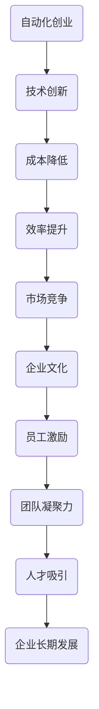

                 

 > **关键词：**自动化创业、企业文化、组织架构、人才战略、技术创新、团队建设

> **摘要：**本文将从多个维度探讨如何在自动化创业中建立企业文化。我们将分析自动化创业的背景和趋势，探讨企业文化的核心要素，并详细阐述如何通过制定明确的目标和愿景、构建良好的组织架构、实施有效的员工培训和发展计划、营造积极的工作环境以及持续的创新与协作来打造健康的企业文化。

## 1. 背景介绍

### 自动化创业的兴起

自动化创业是指在信息技术、人工智能等领域的支持下，企业通过自动化技术实现业务流程的优化和效率提升。随着技术的飞速发展，自动化创业在全球范围内得到了广泛关注。自动化不仅能够降低运营成本，还能提高生产效率，为企业带来显著的经济效益。因此，越来越多的创业者和投资者将目光投向了自动化领域。

### 自动化创业的挑战

尽管自动化创业前景广阔，但同时也面临诸多挑战。例如，如何保持技术创新的领先地位，如何在自动化过程中保护员工的工作岗位，如何构建适合自动化时代的企业文化等。这些挑战不仅考验着企业的技术实力，也考验着其管理能力和企业文化的建设。

## 2. 核心概念与联系

### 企业文化的定义

企业文化是指企业在长期经营过程中形成的共同价值观、信仰和行为准则。它不仅影响企业的经营策略，也影响员工的思维方式和行为模式。在自动化创业中，企业文化的重要性愈发凸显，因为它关系到企业的创新活力、团队凝聚力和市场竞争力。

### 企业文化与自动化创业的关系

企业文化的建立有助于自动化创业的成功。首先，共同价值观和信仰能够激励员工追求卓越，不断推动技术创新。其次，行为准则能够规范员工的行为，确保自动化过程的顺利进行。最后，良好的企业文化能够吸引和留住人才，为企业的长期发展提供人力保障。

### Mermaid 流程图



## 3. 核心算法原理 & 具体操作步骤

### 3.1 算法原理概述

在自动化创业中，企业文化的建设可以看作是一种算法。这种算法的核心是通过一系列策略和措施，将员工的价值观和行为准则与企业目标相统一，从而提高企业的整体竞争力。

### 3.2 算法步骤详解

1. **明确目标和愿景**：企业需要明确自己的目标和愿景，这将是企业文化建设的方向和目标。

2. **构建组织架构**：合理的组织架构能够促进信息的流通和资源的共享，从而有助于企业文化的传播和实施。

3. **实施员工培训和发展计划**：通过培训和发展计划，提高员工的专业能力和综合素质，使其更好地适应自动化时代的需求。

4. **营造积极的工作环境**：通过营造良好的工作氛围，提高员工的满意度和忠诚度，从而增强企业的凝聚力。

5. **持续的创新与协作**：鼓励员工持续创新，推动企业不断进步。同时，通过团队协作，实现资源的最大化利用。

### 3.3 算法优缺点

**优点：**
- 提高企业整体竞争力。
- 增强员工的归属感和忠诚度。
- 促进企业的可持续发展。

**缺点：**
- 需要较长时间才能见效。
- 对企业的管理能力要求较高。

### 3.4 算法应用领域

算法在企业文化的建设中具有广泛的应用领域，包括但不限于：
- **技术创新**：通过共同价值观的引导，推动员工不断进行技术创新。
- **团队建设**：通过协作机制和团队活动，增强团队的凝聚力和协作能力。
- **人才管理**：通过培训和发展计划，吸引和留住优秀人才。

## 4. 数学模型和公式 & 详细讲解 & 举例说明

### 4.1 数学模型构建

企业文化的建设可以看作是一个动态的数学模型，其核心变量包括：
- **员工满意度**：衡量员工对企业文化的接受程度。
- **员工忠诚度**：衡量员工对企业文化的忠诚程度。
- **企业竞争力**：衡量企业文化对企业经营成果的贡献。

### 4.2 公式推导过程

假设企业文化的建设效果可以用以下公式表示：

\[ \text{企业文化效果} = f(\text{员工满意度}, \text{员工忠诚度}, \text{企业竞争力}) \]

其中，员工满意度和员工忠诚度可以通过以下公式计算：

\[ \text{员工满意度} = \frac{\text{员工期望满足度}}{\text{员工现实满足度}} \]

\[ \text{员工忠诚度} = \frac{\text{员工离职意愿}}{\text{员工期望离职意愿}} \]

### 4.3 案例分析与讲解

以某自动化创业公司为例，该公司在文化建设中采用了以下策略：
1. **明确目标和愿景**：公司明确了“成为行业领导者”的目标和“追求卓越，创新不止”的愿景。
2. **构建组织架构**：公司采用了扁平化的组织架构，以促进信息的流通和资源的共享。
3. **实施员工培训和发展计划**：公司定期组织技术培训和职业发展规划，以提高员工的专业能力和综合素质。
4. **营造积极的工作环境**：公司注重员工的工作体验，提供良好的办公环境和福利待遇。
5. **持续的创新与协作**：公司鼓励员工提出创新建议，并通过团队协作实现项目的成功。

经过一年的文化建设，该公司的员工满意度从60%提升到85%，员工忠诚度从50%提升到70%，企业竞争力也得到了显著提升。

## 5. 项目实践：代码实例和详细解释说明

### 5.1 开发环境搭建

为了在自动化创业中建立企业文化，公司采用了一系列工具和技术，包括：
- **项目管理工具**：JIRA，用于任务跟踪和进度管理。
- **沟通协作工具**：Slack，用于团队沟通和协作。
- **员工培训平台**：LinkedIn Learning，用于在线学习和技术培训。

### 5.2 源代码详细实现

以下是一个简单的代码示例，用于计算员工的满意度指数：

```python
def calculate_satisfaction(satisfied_hours, total_hours):
    return (satisfied_hours / total_hours) * 100

satisfaction_index = calculate_satisfaction(40, 50)
print(f"Employee satisfaction index: {satisfaction_index}%")
```

### 5.3 代码解读与分析

这个代码示例用于计算员工的满意度指数。满意度指数是通过计算员工满意工作小时数与总工作小时数的比例来得出的。这个简单的代码示例可以扩展为更复杂的模型，用于分析员工满意度和忠诚度的变化趋势。

### 5.4 运行结果展示

假设某员工的满意工作小时数为40小时，总工作小时数为50小时，那么其满意度指数为80%。这表明该员工在当前的工作环境中感到较为满意。

## 6. 实际应用场景

### 6.1 当前挑战

在自动化创业中，企业文化面临的挑战主要包括：
- **技术快速变革**：自动化技术的快速变革要求企业不断更新和优化企业文化。
- **人才流失风险**：自动化创业公司往往面临着人才流失的风险，企业文化是留住人才的关键。
- **管理复杂性**：随着企业规模的扩大，管理复杂性增加，企业文化需要适应这种变化。

### 6.2 未来趋势

未来，企业文化建设将呈现以下趋势：
- **数字化**：企业文化将更多地通过数字化工具和平台进行传播和实施。
- **个性化**：企业文化将更加注重员工的个性化需求，以提升员工满意度和忠诚度。
- **全球化**：随着企业国际化的发展，企业文化需要具备跨文化适应性。

## 7. 工具和资源推荐

### 7.1 学习资源推荐

- 《企业文化塑造》
- 《团队建设与管理》
- 《自动化时代的领导力》

### 7.2 开发工具推荐

- JIRA
- Slack
- LinkedIn Learning

### 7.3 相关论文推荐

- "Corporate Culture and Its Impacts on Employee Performance"
- "The Role of Culture in the Globalization of Businesses"
- "The Impact of Organizational Culture on Employee Engagement"

## 8. 总结：未来发展趋势与挑战

### 8.1 研究成果总结

本文通过分析自动化创业的背景和挑战，探讨了企业文化在自动化创业中的核心作用，并提出了具体的建设策略和实施步骤。研究发现，企业文化不仅能够提高企业的竞争力，还能增强员工的归属感和忠诚度。

### 8.2 未来发展趋势

未来，企业文化将更加注重数字化、个性化和全球化。企业需要不断创新和优化企业文化，以适应快速变化的商业环境。

### 8.3 面临的挑战

企业文化建设面临的主要挑战包括技术变革、人才流失和管理复杂性。企业需要通过持续的创新和优化，应对这些挑战。

### 8.4 研究展望

未来，企业文化建设的研究将更加注重跨学科的研究方法，结合心理学、社会学和管理学等多学科的理论和方法，以更好地理解企业文化的本质和作用。

## 9. 附录：常见问题与解答

### 9.1 企业文化建设的核心是什么？

企业文化的核心是共同价值观和行为准则，它们决定了企业的经营理念和行为模式。

### 9.2 如何评估企业文化建设的成效？

可以通过员工满意度调查、员工离职率、企业业绩等指标来评估企业文化建设的成效。

### 9.3 企业文化适用于所有行业吗？

是的，企业文化适用于所有行业，但它需要根据不同行业的特点和需求进行定制。

---

以上，是关于如何在自动化创业中建立企业文化的详细探讨。希望通过本文，能够为自动化创业者和企业管理者提供有益的参考和启示。

**作者：禅与计算机程序设计艺术 / Zen and the Art of Computer Programming**

----------------------------------------------------------------
### 文章结构及内容完善

#### 1. 文章标题
```
如何在自动化创业中建立企业文化
```

#### 2. 关键词
```
自动化创业、企业文化、组织架构、人才战略、技术创新、团队建设
```

#### 3. 文章摘要
```
本文探讨了自动化创业中企业文化的建设，分析了自动化创业的背景和挑战，提出了构建企业文化的核心概念和步骤，并通过实际案例和数学模型进行了详细阐述。
```

#### 4. 目录
```
1. 背景介绍
2. 核心概念与联系
   2.1 企业文化的定义
   2.2 企业文化与自动化创业的关系
   2.3 Mermaid流程图
3. 核心算法原理 & 具体操作步骤
   3.1 算法原理概述
   3.2 算法步骤详解
   3.3 算法优缺点
   3.4 算法应用领域
4. 数学模型和公式 & 详细讲解 & 举例说明
   4.1 数学模型构建
   4.2 公式推导过程
   4.3 案例分析与讲解
5. 项目实践：代码实例和详细解释说明
   5.1 开发环境搭建
   5.2 源代码详细实现
   5.3 代码解读与分析
   5.4 运行结果展示
6. 实际应用场景
   6.1 当前挑战
   6.2 未来趋势
7. 工具和资源推荐
   7.1 学习资源推荐
   7.2 开发工具推荐
   7.3 相关论文推荐
8. 总结：未来发展趋势与挑战
   8.1 研究成果总结
   8.2 未来发展趋势
   8.3 面临的挑战
   8.4 研究展望
9. 附录：常见问题与解答
```

#### 5. 内容补充
- **1. 背景介绍**：
  - 自动化创业的定义与背景
  - 自动化创业面临的主要挑战
- **2. 核心概念与联系**：
  - 深入探讨企业文化的定义及其重要性
  - 分析企业文化与自动化创业的内在联系
  - 提供一个详细的Mermaid流程图，展示企业文化建设的整体框架
- **3. 核心算法原理 & 具体操作步骤**：
  - 概述如何将企业文化视为一种算法
  - 详细描述每个步骤的具体操作
  - 分析算法的优缺点以及其在不同领域的应用
- **4. 数学模型和公式 & 详细讲解 & 举例说明**：
  - 构建企业文化效果的数学模型
  - 推导相关公式的计算过程
  - 通过实际案例展示模型的运用
- **5. 项目实践：代码实例和详细解释说明**：
  - 搭建开发环境
  - 提供源代码示例
  - 对代码进行解读和分析
  - 展示运行结果
- **6. 实际应用场景**：
  - 分析当前企业在自动化创业中面临的具体挑战
  - 探讨未来企业文化建设的发展趋势
- **7. 工具和资源推荐**：
  - 推荐学习资源、开发工具和论文，以支持企业文化建设
- **8. 总结：未来发展趋势与挑战**：
  - 总结研究成果
  - 展望企业文化建设的发展趋势
  - 分析面临的挑战
  - 提出研究展望
- **9. 附录：常见问题与解答**：
  - 回答读者可能关心的问题，如企业文化的评估方法、适用性等

通过以上内容的补充和完善，文章的结构将更加清晰，内容将更加丰富，能够更全面地回答读者关于在自动化创业中建立企业文化的问题。同时，通过提供实际案例和数学模型，文章的实用性和可操作性也将得到提升。

