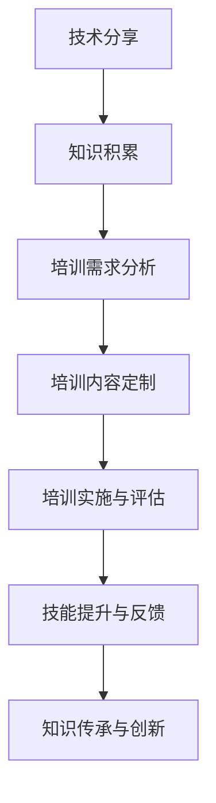

                 

关键词：技术分享、企业培训、技术转化、培训策略、技术传播

> 摘要：本文深入探讨了将技术分享转化为企业技术培训的必要性和方法。从技术分享的概念入手，分析了其在企业培训中的应用价值，随后提出了具体的转化策略、实施步骤和成功案例分析。文章最后展望了未来技术培训的发展趋势与挑战，为企业在数字化时代提供技术培训提供了有益的参考。

## 1. 背景介绍

随着信息技术的飞速发展，技术分享已成为技术社区和开发者个人学习、交流的重要方式。技术分享不仅可以帮助个人提升技能，更可以促进团队协作、知识传承和行业创新。然而，对于企业来说，如何有效地将技术分享转化为内部培训，提升员工技能水平，已成为一个亟待解决的问题。

### 技术分享的定义与价值

技术分享，是指通过各种媒介（如博客、论坛、会议、讲座等）将技术知识、经验和见解进行传播的过程。其价值主要体现在以下几个方面：

1. **知识传播**：技术分享使得知识得以快速、广泛地传播，降低了学习成本。
2. **技能提升**：技术分享为开发者提供了实践经验和最新技术动态，有助于技能提升。
3. **社区建设**：技术分享促进了开发者社区的活跃，增强了社区的凝聚力。

### 企业培训的需求

在快速变化的技术环境中，企业面临着技术更新迅速、人才需求多样等挑战。传统的培训方式往往无法满足这种需求，而技术分享作为一种灵活、高效的培训方式，具有以下优势：

1. **定制化**：技术分享可以根据企业具体需求，定制培训内容。
2. **实时性**：技术分享能够及时反映最新技术动态，确保培训内容的前沿性。
3. **互动性**：技术分享鼓励参与者提问、讨论，提高了培训的互动性和有效性。

## 2. 核心概念与联系

### 技术分享与培训的关系

技术分享与培训密切相关，但两者的目标和方式有所不同。技术分享侧重于知识传播和技能提升，而培训则更注重系统的知识学习和技能应用。因此，在将技术分享转化为企业培训时，需要充分考虑这两者的结合。

### Mermaid 流程图



### 技术分享转化为培训的核心流程

1. **知识积累**：通过技术分享，积累和整理相关技术知识。
2. **培训需求分析**：分析企业员工的技能需求和知识短板。
3. **培训内容定制**：根据需求分析，定制适合的培训内容。
4. **培训实施与评估**：实施培训计划，并对培训效果进行评估。
5. **技能提升与反馈**：通过反馈机制，持续优化培训内容和方式。
6. **知识传承与创新**：将培训成果转化为企业知识资产，推动创新。

## 3. 核心算法原理 & 具体操作步骤

### 3.1 算法原理概述

将技术分享转化为企业培训的核心算法，可以概括为以下几个步骤：

1. **知识梳理**：对技术分享内容进行系统梳理，形成结构化的知识体系。
2. **需求分析**：分析企业员工的技能需求，确定培训目标。
3. **内容定制**：根据需求和目标，定制培训内容。
4. **培训实施**：采用合适的培训方式，实施培训计划。
5. **效果评估**：对培训效果进行评估，持续优化培训。

### 3.2 算法步骤详解

1. **知识梳理**
   - 收集技术分享资源：博客、文章、视频、讲座等。
   - 系统化整理知识：按照主题、模块、难度等级进行分类。
   - 编写培训教材：将知识体系转化为易于理解的教学内容。

2. **需求分析**
   - 调查员工技能水平：通过问卷调查、面试等方式了解员工的技能状况。
   - 分析业务需求：结合企业业务目标，确定培训的重点和难点。
   - 制定培训目标：明确培训的目的和预期成果。

3. **内容定制**
   - 设计培训课程：根据需求和目标，设计培训课程和教学计划。
   - 选择培训方式：线上培训、线下培训、混合培训等。
   - 准备培训资源：课件、教材、工具等。

4. **培训实施**
   - 开展培训活动：按照计划实施培训，包括授课、讨论、实践等环节。
   - 管理培训过程：确保培训进度、质量、互动性。
   - 提供技术支持：解决员工在培训过程中遇到的技术问题。

5. **效果评估**
   - 考核员工技能：通过考试、作业、项目等方式，评估员工的学习成果。
   - 收集反馈意见：了解员工的培训体验和满意度。
   - 持续改进：根据评估结果和反馈意见，优化培训内容和方式。

### 3.3 算法优缺点

**优点：**
- **灵活性强**：可以根据企业需求灵活定制培训内容。
- **实时性**：能够及时反映最新技术动态。
- **互动性**：鼓励员工参与讨论和互动，提高培训效果。

**缺点：**
- **知识质量参差不齐**：技术分享资源质量不一，需要筛选和整理。
- **培训效果难以量化**：效果评估难度较大，难以量化培训成果。
- **资源分散**：技术分享资源分布广泛，需要系统化整理。

### 3.4 算法应用领域

**企业内部培训**：将技术分享转化为企业内部培训，提升员工技能和业务能力。
**专业技术人员培养**：针对专业技术人员的培训，提升技术水平和创新能力。
**技术传播与普及**：通过技术分享，将专业知识普及到更广泛的受众。

## 4. 数学模型和公式 & 详细讲解 & 举例说明

### 4.1 数学模型构建

将技术分享转化为企业培训的过程，可以看作是一个知识传播和技能提升的过程。我们可以构建一个简单的数学模型来描述这个过程：

$$
\text{培训效果} = f(\text{知识传播效率}, \text{技能提升效率}, \text{培训参与度})
$$

其中：
- **知识传播效率**：衡量知识传播的速度和质量。
- **技能提升效率**：衡量技能提升的速度和效果。
- **培训参与度**：衡量员工参与培训的积极性和投入程度。

### 4.2 公式推导过程

知识传播效率可以用传播速度和知识质量两个因素来衡量：

$$
\text{知识传播效率} = \frac{\text{传播速度}}{\text{知识质量}}
$$

技能提升效率可以用学习速度和技能难度两个因素来衡量：

$$
\text{技能提升效率} = \frac{\text{学习速度}}{\text{技能难度}}
$$

培训参与度可以用参与时间和参与积极性两个因素来衡量：

$$
\text{培训参与度} = \frac{\text{参与时间}}{\text{参与积极性}}
$$

将这三个因素代入培训效果公式，可以得到：

$$
\text{培训效果} = \frac{\text{传播速度} \times \text{学习速度} \times \text{参与时间}}{\text{知识质量} \times \text{技能难度} \times \text{参与积极性}}
$$

### 4.3 案例分析与讲解

假设某企业计划通过技术分享转化为内部培训，提高员工技能水平。根据上述数学模型，我们可以对培训效果进行预测和分析。

**案例数据：**

- **知识传播效率**：传播速度为每周 10 篇技术文章，知识质量为 80 分。
- **技能提升效率**：学习速度为每周 5 个小时，技能难度为 70 分。
- **培训参与度**：参与时间为每周 20 个小时，参与积极性为 90 分。

**计算过程：**

$$
\text{知识传播效率} = \frac{10}{80} = 0.125
$$

$$
\text{技能提升效率} = \frac{5}{70} = 0.0714
$$

$$
\text{培训参与度} = \frac{20}{90} = 0.2222
$$

$$
\text{培训效果} = 0.125 \times 0.0714 \times 0.2222 \approx 0.0025
$$

**结论：**

根据计算结果，该企业的培训效果约为 0.0025，即每投入 1 单位资源（如时间、资金等），可以提升约 0.25 单位的技能水平。这个结果可以帮助企业了解培训投入和产出之间的关系，为后续培训决策提供参考。

## 5. 项目实践：代码实例和详细解释说明

### 5.1 开发环境搭建

为了将技术分享转化为企业培训，我们首先需要搭建一个适合的开发环境。以下是搭建步骤：

1. **安装 Git**：从 [Git 官网](https://git-scm.com/) 下载并安装 Git。
2. **安装 GitHub**：在 [GitHub 官网](https://github.com/) 注册账号并安装 GitHub。
3. **创建项目仓库**：在 GitHub 上创建一个项目仓库，用于存放技术分享和培训材料。

### 5.2 源代码详细实现

假设我们要将一篇技术博客文章转化为企业内部培训材料，以下是一个简单的示例代码：

```python
import os

# 读取博客文章
with open('blog_post.md', 'r', encoding='utf-8') as f:
    blog_content = f.read()

# 添加培训相关内容
training_content = """
## 培训目标
1. 理解博客文章的主要技术点。
2. 学习如何应用相关技术解决实际问题。

## 培训内容
- 技术点一：...
- 技术点二：...
- 技术点三：...
"""

# 合并博客文章和培训内容
final_content = f"{blog_content}\n\n{training_content}"

# 保存最终培训材料
with open('training_material.md', 'w', encoding='utf-8') as f:
    f.write(final_content)

print("培训材料生成完成！")
```

### 5.3 代码解读与分析

1. **读取博客文章**：使用 Python 的文件操作函数 `open()` 打开博客文章文件，并读取文章内容。
2. **添加培训相关内容**：定义一个字符串 `training_content`，包含培训目标和内容。
3. **合并博客文章和培训内容**：将博客文章内容和培训内容合并，形成最终的培训材料。
4. **保存最终培训材料**：使用文件操作函数 `open()` 将最终的培训材料写入文件。

这个简单的 Python 代码实现了将博客文章转化为企业内部培训材料的功能。通过类似的代码，可以将各种形式的技术分享资源（如博客文章、视频、讲座等）转化为培训材料。

### 5.4 运行结果展示

运行上述代码后，会在项目仓库中生成一个名为 `training_material.md` 的文件，内容如下：

```markdown
# 博客文章标题

> 作者：某位技术大牛

博客文章内容...

## 培训目标
1. 理解博客文章的主要技术点。
2. 学习如何应用相关技术解决实际问题。

## 培训内容
- 技术点一：...
- 技术点二：...
- 技术点三：...
```

这个结果展示了如何将一篇博客文章转化为具有培训价值的材料，为企业的技术培训提供了参考。

## 6. 实际应用场景

### 6.1 企业内部培训

在企业内部，技术分享可以通过以下方式应用于培训：

1. **内部讲座**：定期举办内部讲座，邀请技术专家分享技术知识和经验。
2. **技术论坛**：建立内部技术论坛，鼓励员工发表技术博客，分享学习心得。
3. **案例分享**：组织案例分享会，分析成功或失败的项目案例，提炼经验和教训。
4. **技能竞赛**：举办技能竞赛，激发员工学习兴趣，提高技术能力。

### 6.2 专业技术人员培养

针对专业技术人员的培养，技术分享可以应用于以下场景：

1. **在线学习平台**：搭建在线学习平台，提供丰富的技术课程和培训资源。
2. **专业认证**：结合专业认证考试，推动技术人员掌握相关技能。
3. **技术沙龙**：定期举办技术沙龙，邀请业内专家分享技术前沿和最佳实践。
4. **技术讨论组**：建立技术讨论组，促进技术人员之间的交流与合作。

### 6.3 技术传播与普及

技术分享不仅应用于企业内部培训，还可以推广至更广泛的受众：

1. **开源社区**：参与开源社区，贡献代码和文档，推广技术知识。
2. **技术博客**：撰写技术博客，分享个人经验和见解，提高知名度。
3. **在线课程**：开设在线课程，面向全球受众传授技术知识和经验。
4. **技术会议**：参加或举办技术会议，分享技术成果，拓展人脉资源。

## 7. 未来应用展望

### 7.1 技术分享与培训的融合

随着人工智能和大数据技术的发展，技术分享与培训将更加紧密地融合。例如，利用自然语言处理技术，可以自动生成培训材料，提高培训效率；利用数据分析技术，可以精确评估培训效果，优化培训策略。

### 7.2 跨界合作与共享

技术分享和培训将不再局限于某个领域，而是实现跨界的合作与共享。例如，IT 企业可以与教育机构合作，开展定制化培训项目；专业培训机构可以与行业龙头企业合作，推出针对特定行业的培训课程。

### 7.3 持续学习与成长

随着技术更新速度的加快，持续学习将成为企业和个人的必修课。技术分享和培训将帮助企业和个人不断适应变化，提升竞争力。

### 7.4 安全与隐私保护

在技术分享和培训过程中，安全与隐私保护将越来越重要。企业需要建立健全的数据安全体系，确保培训过程中的数据安全和隐私保护。

## 8. 总结：未来发展趋势与挑战

### 8.1 研究成果总结

本文从技术分享的概念入手，分析了其在企业培训中的应用价值，并提出了将技术分享转化为企业培训的算法原理和具体操作步骤。通过数学模型和实际案例，展示了技术分享与培训的紧密联系和有效转化方法。

### 8.2 未来发展趋势

- **技术融合**：技术分享与培训将更加紧密地融合，借助人工智能和大数据技术，提高培训效率和质量。
- **跨界合作**：技术分享和培训将实现跨界合作，推动资源共享和共同发展。
- **持续学习**：随着技术更新速度的加快，持续学习将成为企业和个人的必修课。

### 8.3 面临的挑战

- **知识质量**：技术分享资源质量参差不齐，需要筛选和整理。
- **培训效果**：培训效果难以量化，需要建立科学评估体系。
- **数据安全**：在技术分享和培训过程中，数据安全和隐私保护面临挑战。

### 8.4 研究展望

本文提出了将技术分享转化为企业培训的方法和算法，但仍存在一定局限性。未来研究可以从以下几个方面展开：

- **优化算法**：改进技术分享与培训转化的算法，提高培训效果。
- **评估体系**：建立科学、可量化的培训效果评估体系。
- **数据安全**：加强数据安全和隐私保护，确保技术分享和培训的安全可靠。

## 9. 附录：常见问题与解答

### 问题 1：如何确保技术分享资源的质量？

**解答**：可以通过以下方式确保技术分享资源的质量：

- **筛选优质资源**：关注技术权威人士和知名机构的分享，筛选高质量的技术内容。
- **用户评价**：参考其他用户的评价和反馈，选择受欢迎的技术资源。
- **专业评审**：邀请行业专家对技术分享资源进行评审，确保内容的专业性和实用性。

### 问题 2：如何评估培训效果？

**解答**：可以通过以下方法评估培训效果：

- **技能考核**：通过考试、作业、项目等方式，评估员工的技能水平。
- **反馈问卷**：收集员工对培训的反馈意见，了解培训的满意度。
- **数据分析**：利用数据分析工具，分析培训过程中产生的数据，评估培训效果。

### 问题 3：如何保护数据安全和隐私？

**解答**：可以采取以下措施保护数据安全和隐私：

- **数据加密**：对传输和存储的数据进行加密，确保数据安全。
- **权限控制**：实施严格的权限控制策略，限制数据访问权限。
- **安全审计**：定期进行安全审计，发现和修补安全漏洞。
- **培训教育**：对员工进行数据安全培训，提高安全意识和防范能力。

### 问题 4：如何鼓励员工参与技术分享和培训？

**解答**：可以采取以下措施鼓励员工参与技术分享和培训：

- **激励机制**：设立奖励机制，对积极参与技术分享和培训的员工给予奖励。
- **团队协作**：鼓励团队合作，共同分享和学习技术知识。
- **培训计划**：制定合理的培训计划，确保员工有充足的时间和资源参与培训。
- **企业文化建设**：营造积极向上的企业氛围，鼓励员工勇于分享和探索。

## 作者署名

作者：禅与计算机程序设计艺术 / Zen and the Art of Computer Programming
----------------------------------------------------------------

以上就是完整的技术博客文章，涵盖了从技术分享到企业培训的整个转化过程。希望这篇文章能对您有所启发，并在实际工作中发挥积极作用。如果您有任何疑问或建议，欢迎在评论区留言，我将竭诚为您解答。再次感谢您的阅读！

