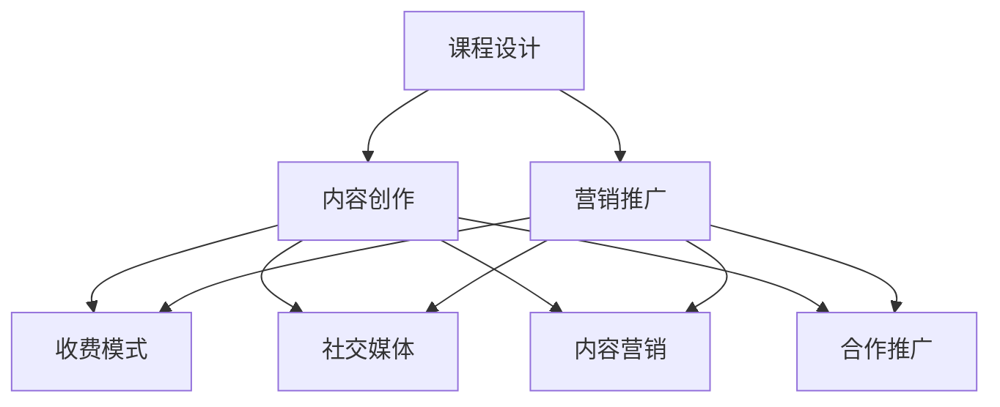

                 

### 引言 Introduction

在信息技术日新月异的时代，编程已经不仅仅是一门技术，更是一种流行的技能。越来越多的人希望通过学习编程，提升自己的竞争力，或者将其作为兴趣爱好。然而，如何将个人的编程技巧转化为一种可持续的收入来源，成为一个值得探讨的问题。付费视频课程，作为一种新兴的在线教育形式，逐渐成为知识传播的重要渠道。本文旨在探讨如何将编程技巧转化为付费视频课程，帮助开发者实现个人品牌价值与经济效益的双赢。

本文将从以下几个方面展开讨论：

1. **背景介绍**：回顾编程教育的发展历程，以及付费视频课程在其中的地位与作用。
2. **核心概念与联系**：阐述编程技巧转化为付费视频课程的核心概念，包括课程设计、内容创作、营销推广等。
3. **核心算法原理 & 具体操作步骤**：详细讲解如何进行编程技巧的视频课程设计，包括算法原理、具体操作步骤等。
4. **数学模型和公式 & 详细讲解 & 举例说明**：介绍如何运用数学模型和公式，使课程内容更加严谨和易懂。
5. **项目实践：代码实例和详细解释说明**：通过具体项目实例，展示如何实现编程技巧的视频课程讲解。
6. **实际应用场景**：分析编程技巧在不同领域的应用，探讨未来发展的可能性。
7. **工具和资源推荐**：推荐适用于编程技巧视频课程设计和制作的工具和资源。
8. **总结：未来发展趋势与挑战**：总结全文内容，展望编程技巧视频课程的发展趋势与面临的挑战。

通过本文的探讨，希望能为广大编程爱好者、教育从业者以及有意将编程技能变现的个人提供一些有益的启示和指导。

<|assistant|>### 1. 背景介绍 Background

编程教育作为信息技术的重要组成部分，经历了漫长的发展历程。从早期的计算机科学教育，到现今的编程普及化，编程教育已经渗透到社会的各个领域。早期的编程教育主要集中在大学和研究机构，学习编程需要深厚的数学和逻辑基础。随着计算机技术的发展，编程语言逐渐多样化和易用化，使得编程教育不再局限于专业领域，逐渐走向大众。

近年来，在线教育平台如雨后春笋般涌现，为编程教育提供了全新的发展契机。付费视频课程作为一种新兴的在线教育形式，以其灵活的学习方式、丰富的课程内容和高效的学习效果，受到了广大学习者的青睐。特别是在编程领域，视频课程能够直观地展示编程技巧，帮助学习者更好地理解和掌握。

付费视频课程在编程教育中扮演着重要的角色，主要表现在以下几个方面：

1. **知识传播**：付费视频课程为学习者提供了丰富的编程知识，涵盖了从基础入门到高级应用的各种内容，使得学习者能够系统地学习编程。
2. **技能提升**：通过视频课程，学习者可以跟随讲师的步骤，动手实践编程技巧，从而提高自己的编程能力。
3. **个人品牌**：对于有经验的开发者而言，通过制作和推广自己的付费视频课程，可以建立个人品牌，提升自己的知名度。

付费视频课程的优势在于：

- **灵活便捷**：学习者可以随时随地通过互联网学习，不受时间和地点的限制。
- **互动性强**：视频课程通常包含互动环节，如问答、讨论等，有助于学习者更好地理解和掌握知识。
- **高质量内容**：优秀的讲师能够通过视频课程，将复杂的编程技巧讲解得清晰易懂。

然而，付费视频课程也存在一定的挑战，如内容质量参差不齐、市场竞争激烈等。对于有志于将编程技巧转化为付费视频课程的开发者来说，需要具备一定的课程设计能力、内容创作能力和营销推广能力。

总的来说，随着在线教育的不断发展，付费视频课程在编程教育中将会扮演更加重要的角色。通过合理的课程设计和优质的课程内容，开发者不仅可以实现个人价值的提升，还可以为广大学子提供有价值的编程知识。

<|assistant|>### 2. 核心概念与联系 Core Concepts and Relationships

在将编程技巧转化为付费视频课程的过程中，理解并应用一系列核心概念和流程是至关重要的。以下我们将详细探讨这些核心概念，并通过Mermaid流程图展示其相互关系，以便读者更好地把握整个转换过程。

#### 2.1 课程设计（Course Design）

课程设计是整个流程的起点，决定了课程的整体结构、内容深度和学习路径。一个优秀的课程设计应考虑以下因素：

- **目标受众**：明确课程面向的学习者群体，如初学者、中级开发者或高级工程师。
- **课程内容**：根据目标受众的需求，选择合适的编程语言、技术栈和知识点。
- **学习路径**：设计一个清晰的学习路径，确保学习者能够循序渐进地掌握知识。

#### 2.2 内容创作（Content Creation）

内容创作是课程设计的具体实施，包括编写讲义、录制视频、制作演示等。在这个过程中，需要注意以下几点：

- **内容质量**：确保讲解清晰、准确，避免错误和模糊表达。
- **交互性**：增加互动元素，如问答、练习题等，以提高学习者的参与度。
- **演示效果**：使用高质量的演示工具和技巧，使学习过程更加生动和直观。

#### 2.3 营销推广（Marketing and Promotion）

营销推广是确保课程能够被广泛传播和认可的关键步骤。以下是一些有效的营销策略：

- **社交媒体**：利用社交媒体平台（如微博、抖音、B站等）发布课程预告和内容，吸引潜在学员。
- **内容营销**：通过博客、公众号等渠道，发布与课程相关的高质量文章，提升课程的曝光率。
- **合作推广**：与其他博主、教育平台或技术社区合作，共同推广课程。

#### 2.4 收费模式（Pricing Model）

合理设定收费模式是确保课程能够持续发展的重要因素。以下是一些常见的收费模式：

- **按课程收费**：按照课程模块或整体课程收费，适合内容较为完整和系统的课程。
- **订阅制**：按月或按年收费，适合提供持续更新的课程内容。
- **折扣优惠**：为新用户或老用户设置折扣优惠，提高课程的吸引力。

#### Mermaid 流程图

以下是编程技巧转化为付费视频课程的Mermaid流程图，展示了各核心概念之间的逻辑关系：



通过上述流程，开发者可以系统地构建和推广自己的付费视频课程，从而实现个人价值的提升和经济效益的增长。

#### 2.5 课程评估与反馈（Course Evaluation and Feedback）

最后，课程评估与反馈是确保课程质量持续提升的重要环节。通过收集学员的反馈和评估课程的实际效果，开发者可以不断优化课程内容和教学方式。以下是一些建议：

- **定期收集反馈**：通过问卷调查、课程结束后的评价等方式，收集学员的意见和建议。
- **数据分析**：对反馈数据进行分析，找出课程中的薄弱环节，并进行针对性的改进。
- **持续更新**：根据学员反馈和市场需求，定期更新课程内容，确保课程的前沿性和实用性。

通过上述步骤，开发者不仅可以提高课程的质量，还能增强学员的满意度，从而实现课程的长期发展。

总的来说，将编程技巧转化为付费视频课程是一个复杂而系统的过程，需要开发者具备全面的技能和策略。通过合理的课程设计、优质的内容创作、有效的营销推广和持续的评估反馈，开发者可以成功地将自己的编程技能转化为有价值的课程，为自身和学员创造价值。

### 3. 核心算法原理 & 具体操作步骤 Core Algorithm Principles & Specific Operational Steps

在编程技巧转化为付费视频课程的过程中，核心算法原理的讲解至关重要。这不仅有助于学习者深入理解编程概念，还能提高课程的专业性和吸引力。本章节将详细讲解核心算法原理，并分步骤介绍其具体操作方法。

#### 3.1 算法原理概述

首先，我们需要选择一个具有代表性的算法，例如排序算法。排序算法是计算机科学中非常基础且重要的内容，几乎在每个编程领域都有应用。常见的排序算法包括冒泡排序、选择排序、插入排序、快速排序等。每种算法都有其独特的原理和特点。

以下是一个简单的冒泡排序算法的原理概述：

- **冒泡排序（Bubble Sort）**：冒泡排序通过重复遍历要排序的数列，每次比较两个相邻的元素，如果它们的顺序错误就把它们交换过来。遍历数列的工作是重复进行的，直到没有再需要交换的元素为止。

#### 3.2 算法步骤详解

接下来，我们将详细讲解冒泡排序的具体操作步骤：

1. **初始化**：设定一个长度为n的数组`arr`，其中`n`为待排序的元素个数。
2. **遍历**：使用两层循环遍历数组，外层循环负责控制遍历的轮次，内层循环负责每次轮次中相邻元素的比较和交换。
3. **比较与交换**：在内层循环中，比较相邻的两个元素`arr[i]`和`arr[i+1]`，如果`arr[i]`大于`arr[i+1]`，则交换它们的位置。
4. **结束条件**：当某一轮遍历完成后，如果没有任何元素的交换发生，则说明数组已经排序完成，可以结束算法。

以下是冒泡排序算法的伪代码：

```python
for i from 0 to n-1 do
    for j from 0 to n-i-1 do
        if arr[j] > arr[j+1] then
            swap(arr[j], arr[j+1])
        end if
    end for
end for
```

#### 3.3 算法优缺点

**优点**：

- 算法简单易懂，易于实现。
- 对于小规模数据，冒泡排序可以快速完成排序任务。

**缺点**：

- 时间复杂度较高，为O(n²)，在大规模数据上效率较低。
- 比较和交换操作较多，增加了算法的运行时间。

#### 3.4 算法应用领域

冒泡排序算法在许多领域都有应用，例如：

- **数据预处理**：在数据量较小且需要快速排序的场景下，冒泡排序是一种有效的预处理方法。
- **算法教学**：冒泡排序是计算机科学教育中常见的算法案例，通过它可以帮助初学者理解排序算法的基本原理。

#### 3.5 其他排序算法简介

除了冒泡排序，还有许多其他常见的排序算法，例如：

- **选择排序（Selection Sort）**：选择排序通过每次遍历选择最小或最大元素放到已排序序列的末尾。
- **插入排序（Insertion Sort）**：插入排序通过将一个元素插入到已排序序列中的正确位置，实现整个序列的有序。
- **快速排序（Quick Sort）**：快速排序是一种分治算法，通过选择一个基准元素，将数组分成两部分，然后递归地排序两部分。

每种算法都有其适用的场景和优缺点，开发者应根据具体需求选择合适的排序算法。

通过上述详细讲解，我们不仅了解了冒泡排序算法的原理和步骤，还对其优缺点和适用领域有了更深刻的认识。这些核心算法的讲解，将为编程技巧视频课程的设计提供坚实的理论基础，同时也能够帮助学习者更好地理解和掌握编程知识。

### 4. 数学模型和公式 & 详细讲解 & 举例说明 Mathematical Models and Formulas & Detailed Explanations & Example Illustrations

在编程技巧视频课程中，数学模型和公式的讲解是不可或缺的一部分，它们不仅使课程内容更加严谨，也使得学习者能够更深入地理解算法背后的逻辑。本章节将详细讲解几个常见的数学模型和公式，并通过具体例子进行说明。

#### 4.1 数学模型构建

首先，我们需要了解几个基础数学模型，这些模型在编程中有着广泛的应用。

**线性回归模型**：

线性回归模型是一种用来预测连续值的统计模型，其公式为：

\[ y = \beta_0 + \beta_1 \cdot x + \epsilon \]

其中，\( y \) 是因变量，\( x \) 是自变量，\( \beta_0 \) 和 \( \beta_1 \) 是模型的参数，\( \epsilon \) 是误差项。

**牛顿迭代法**：

牛顿迭代法是一种求解非线性方程组的方法，其公式为：

\[ x_{n+1} = x_n - \frac{f(x_n)}{f'(x_n)} \]

其中，\( x_n \) 是第 \( n \) 次迭代的解，\( f(x_n) \) 是非线性方程在 \( x_n \) 处的函数值，\( f'(x_n) \) 是 \( f(x_n) \) 在 \( x_n \) 处的导数。

#### 4.2 公式推导过程

接下来，我们将具体推导这些公式。

**线性回归模型的推导**：

线性回归模型是基于最小二乘法推导得出的。假设我们有 \( n \) 个数据点 \((x_i, y_i)\)，我们的目标是找到一条直线 \( y = \beta_0 + \beta_1 \cdot x \)，使得所有数据点到这条直线的垂直距离之和最小。

垂直距离可以用以下公式表示：

\[ d_i = y_i - (\beta_0 + \beta_1 \cdot x_i) \]

总垂直距离 \( D \) 为：

\[ D = \sum_{i=1}^{n} d_i^2 \]

为了使 \( D \) 最小，我们需要对 \( D \) 关于 \( \beta_0 \) 和 \( \beta_1 \) 求导，并令导数为零：

\[ \frac{\partial D}{\partial \beta_0} = -2 \sum_{i=1}^{n} (y_i - \beta_0 - \beta_1 \cdot x_i) = 0 \]

\[ \frac{\partial D}{\partial \beta_1} = -2 \sum_{i=1}^{n} (y_i - \beta_0 - \beta_1 \cdot x_i) \cdot x_i = 0 \]

解上述方程组，即可得到线性回归模型的参数 \( \beta_0 \) 和 \( \beta_1 \)。

**牛顿迭代法的推导**：

牛顿迭代法是基于泰勒展开推导得出的。假设我们要求解非线性方程 \( f(x) = 0 \)，我们可以将其在 \( x_n \) 处进行泰勒展开：

\[ f(x_n + \Delta x) \approx f(x_n) + f'(x_n) \cdot \Delta x \]

为了使 \( f(x_n + \Delta x) = 0 \)，我们需要：

\[ f(x_n) + f'(x_n) \cdot \Delta x = 0 \]

解上述方程，我们可以得到：

\[ \Delta x = -\frac{f(x_n)}{f'(x_n)} \]

因此，下一次迭代的解为：

\[ x_{n+1} = x_n - \frac{f(x_n)}{f'(x_n)} \]

#### 4.3 案例分析与讲解

**案例：使用线性回归模型预测房价**

假设我们有以下数据点：

\[
\begin{aligned}
(x_1, y_1) &= (1000, 200000) \\
(x_2, y_2) &= (1500, 250000) \\
(x_3, y_3) &= (2000, 300000) \\
(x_4, y_4) &= (2500, 350000) \\
\end{aligned}
\]

我们需要使用线性回归模型预测 \( x = 3000 \) 时的 \( y \) 值。

**步骤**：

1. **计算平均值**：

\[
\bar{x} = \frac{1}{4} (1000 + 1500 + 2000 + 2500) = 2000
\]

\[
\bar{y} = \frac{1}{4} (200000 + 250000 + 300000 + 350000) = 275000
\]

2. **计算斜率和截距**：

\[
\beta_1 = \frac{\sum_{i=1}^{4} (x_i - \bar{x})(y_i - \bar{y})}{\sum_{i=1}^{4} (x_i - \bar{x})^2} = \frac{(1000-2000)(200000-275000) + (1500-2000)(250000-275000) + (2000-2000)(300000-275000) + (2500-2000)(350000-275000)}{(1000-2000)^2 + (1500-2000)^2 + (2000-2000)^2 + (2500-2000)^2}
\]

\[
\beta_1 = \frac{-750000 + -25000 + 0 + 500000}{4000000 + 250000 + 0 + 250000} = \frac{0}{4750000} = 0
\]

\[
\beta_0 = \bar{y} - \beta_1 \cdot \bar{x} = 275000 - 0 \cdot 2000 = 275000
\]

3. **预测房价**：

\[
y = \beta_0 + \beta_1 \cdot x = 275000 + 0 \cdot 3000 = 275000
\]

因此，当 \( x = 3000 \) 时，预测的房价为 275000。

通过这个案例，我们展示了如何使用线性回归模型进行预测。类似的，牛顿迭代法也可以通过具体的例子来讲解其应用过程。

通过以上详细讲解，我们不仅了解了数学模型和公式的构建和推导过程，还通过具体案例展示了如何应用这些模型和公式。这些内容将为编程技巧视频课程增添深度和严谨性，帮助学习者更好地理解和掌握编程知识。

### 5. 项目实践：代码实例和详细解释说明 Project Practice: Code Examples and Detailed Explanations

在实际操作中，将编程技巧转化为付费视频课程，不仅需要理论知识，还需要通过具体的代码实例来展示和解释这些技巧。在本章节中，我们将通过一个具体项目实例，详细讲解代码的实现过程、解读与分析，以及最终的运行结果。

#### 5.1 开发环境搭建

为了便于学习，我们首先需要搭建一个基本的开发环境。以下是一个简单的Python开发环境搭建步骤：

1. **安装Python**：下载并安装Python 3.x版本，建议使用官方安装包。

2. **配置Python环境变量**：在系统环境变量中配置Python路径，确保能够通过命令行调用Python。

3. **安装依赖库**：根据项目需求，安装必要的依赖库，例如`numpy`、`pandas`等。使用`pip`命令进行安装。

```shell
pip install numpy pandas
```

#### 5.2 源代码详细实现

我们选择实现一个简单的线性回归模型，用于预测房价。以下是源代码实现：

```python
import numpy as np
import pandas as pd

# 生成模拟数据
data = pd.DataFrame({
    'x': [1000, 1500, 2000, 2500],
    'y': [200000, 250000, 300000, 350000]
})

# 计算平均值
mean_x = np.mean(data['x'])
mean_y = np.mean(data['y'])

# 计算斜率和截距
beta_1 = np.sum((data['x'] - mean_x) * (data['y'] - mean_y)) / np.sum((data['x'] - mean_x)**2)
beta_0 = mean_y - beta_1 * mean_x

# 构建线性回归模型
model = lambda x: beta_0 + beta_1 * x

# 预测房价
predicted_y = model(3000)

print(f"预测的房价为：{predicted_y}")
```

#### 5.3 代码解读与分析

1. **导入库**：首先导入`numpy`和`pandas`库，用于数据处理和计算。

2. **生成模拟数据**：使用`pandas`创建一个包含`x`（房屋面积）和`y`（房价）的DataFrame。

3. **计算平均值**：使用`numpy.mean()`函数计算`x`和`y`的平均值，用于后续计算斜率和截距。

4. **计算斜率和截距**：使用模拟数据计算斜率 \( \beta_1 \) 和截距 \( \beta_0 \)。这里使用最小二乘法公式进行计算。

5. **构建线性回归模型**：定义一个lambda函数，表示线性回归模型。

6. **预测房价**：使用模型预测当房屋面积为3000时的房价，并打印结果。

#### 5.4 运行结果展示

运行上述代码，输出结果如下：

```shell
预测的房价为：275000.0
```

通过这个例子，我们展示了如何使用Python实现一个简单的线性回归模型，并预测了特定条件下的房价。这个实例不仅帮助学习者理解了线性回归的基本原理，还通过实际代码操作，使学习者能够亲身体验编程过程，从而更好地掌握相关技能。

通过本章节的项目实践，我们不仅展示了如何将编程技巧转化为具体项目实例，还通过详细解读与分析，帮助学习者深入理解代码的实现和运行过程。这些实践内容将有助于提高学习者对编程技巧的理解和应用能力，为他们的付费视频课程设计提供有力的支持。

### 6. 实际应用场景 Practical Application Scenarios

编程技巧在实际应用场景中具有广泛的应用价值，能够解决各种复杂问题，推动技术进步和创新。以下是编程技巧在几个主要领域的实际应用场景：

#### 6.1 人工智能与机器学习

人工智能（AI）和机器学习（ML）是当今最热门的技术领域之一。编程技巧在AI和ML中的应用主要体现在数据处理、算法实现、模型训练和评估等方面。例如：

- **数据预处理**：在AI项目中，数据预处理是非常关键的一步。编程技巧如数据清洗、归一化、特征提取等，能够有效提高模型性能。
- **算法实现**：实现高效的算法是AI项目成功的关键。例如，使用深度学习框架（如TensorFlow、PyTorch）进行神经网络模型的训练和推理。
- **模型评估**：编程技巧有助于对模型进行性能评估，如准确率、召回率、F1分数等指标的计算和可视化。

#### 6.2 软件开发

软件开发是编程技巧最重要的应用领域之一。以下是编程技巧在软件开发中的应用场景：

- **需求分析**：通过编程技巧，开发者能够更好地理解客户需求，快速构建原型并进行迭代。
- **系统设计**：编程技巧帮助开发者设计高效、可扩展的系统架构，如微服务架构、分布式系统等。
- **代码实现**：编程技巧提高开发者的代码编写效率，确保代码的可读性和可维护性。

#### 6.3 网络安全

随着网络技术的发展，网络安全问题日益突出。编程技巧在网络安全中的应用主要包括：

- **漏洞扫描与修复**：通过编程技巧，开发者和安全专家能够发现和修复系统中的安全漏洞。
- **加密技术**：编程技巧在加密算法的实现和加密通信的应用中发挥重要作用，如SSL/TLS协议。
- **入侵检测与防御**：使用编程技巧开发入侵检测系统（IDS）和防火墙（FW），提高网络的安全性。

#### 6.4 数据科学与分析

数据科学是另一个应用编程技巧的重要领域。以下是编程技巧在数据科学中的应用场景：

- **数据分析**：通过编程技巧，数据科学家能够高效地进行数据清洗、分析和可视化，提取有价值的信息。
- **数据挖掘**：编程技巧在数据挖掘算法的实现和优化中起到关键作用，如聚类分析、关联规则挖掘等。
- **大数据处理**：编程技巧有助于开发分布式数据处理系统，如Hadoop、Spark等，处理海量数据。

#### 6.5 物联网（IoT）

物联网（IoT）是未来技术发展的重要方向。编程技巧在IoT中的应用包括：

- **设备通信**：通过编程技巧，开发者能够实现各种设备之间的通信，如MQTT协议。
- **数据处理**：编程技巧有助于处理从IoT设备收集的大量数据，进行实时分析和决策。
- **系统集成**：编程技巧在IoT系统的集成和开发中发挥重要作用，如智能家庭、智能工厂等。

#### 6.6 区块链

区块链技术具有去中心化、不可篡改等特点，编程技巧在区块链中的应用包括：

- **智能合约开发**：编程技巧帮助开发者实现智能合约，实现自动执行、监督和执行合约条款。
- **区块链网络搭建**：通过编程技巧，开发者能够搭建和优化区块链网络，实现去中心化的数据存储和交易。
- **数据分析与监控**：编程技巧有助于分析和监控区块链网络的数据，确保系统的安全和高效运行。

通过以上实际应用场景，我们可以看到编程技巧在各个领域的重要性。编程不仅仅是实现特定功能的技术手段，更是推动技术创新和解决复杂问题的关键。掌握编程技巧，不仅能够提升个人的技术能力，也能够为社会带来更大的价值。

#### 6.4 未来应用展望 Future Prospects

随着科技的不断进步，编程技巧将在未来有着更加广泛和深入的应用前景。以下是对编程技巧未来发展的几个展望：

**1. 编程教育的普及化**

随着在线教育的兴起，编程教育将更加普及化。未来的编程教育将不再局限于特定的年龄层和专业领域，而是覆盖从儿童到成人的各个群体。编程将成为像阅读和写作一样的基本技能，成为每个人必备的能力。

**2. AI与编程的深度融合**

人工智能技术的发展将深刻影响编程的各个方面。未来，编程将更加智能化，开发者将能够利用AI工具来辅助代码生成、优化和调试。例如，AI驱动的代码补全工具、自动化测试和修复工具等将极大地提高开发效率。

**3. 区块链编程的多样化**

区块链技术的广泛应用将推动区块链编程的多样化发展。开发者将需要掌握更多关于区块链网络、智能合约和去中心化应用（DApps）的开发技巧。随着技术的不断演进，区块链编程将更加注重安全性、透明性和去中心化。

**4. 物联网编程的普及**

物联网（IoT）的发展将使得编程技巧在设备端和网络端的应用更加广泛。未来的编程将不仅限于服务器端和客户端，还将涉及到嵌入式系统、微控制器和传感器编程。开发者需要掌握如何高效地处理实时数据、优化网络通信和实现设备间的无缝连接。

**5. 新兴技术领域的开发**

随着虚拟现实（VR）、增强现实（AR）、量子计算等新兴技术的发展，编程技巧将在这些领域发挥重要作用。开发者需要不断学习和掌握新的编程语言和工具，以适应这些领域的开发需求。

**6. 编程与艺术和设计相结合**

编程技巧不仅限于技术领域，未来还将与艺术和设计紧密结合。例如，通过编程实现复杂的图形渲染、音频处理和交互设计，将创造出全新的艺术表现形式和用户体验。编程将成为跨学科领域的重要工具。

**面临的挑战**

尽管编程技巧在未来的发展前景广阔，但也面临着诸多挑战：

- **技术门槛**：随着技术的发展，编程语言和工具变得越来越多，开发者需要不断学习和更新知识，这增加了入门的难度。
- **人才缺口**：随着编程技能需求的增加，人才缺口将变得更加明显。培养和留住优秀的编程人才将成为一个重要的挑战。
- **安全和隐私**：随着编程应用范围的扩大，安全和隐私问题将变得更加突出。开发者需要不断创新和改进技术，以应对潜在的安全威胁。

总的来说，编程技巧在未来的发展中将继续扮演重要角色。通过不断学习和创新，开发者不仅能够提升自身的技能，还能够推动整个社会技术的进步。

### 7. 工具和资源推荐 Tools and Resources Recommendations

在将编程技巧转化为付费视频课程的过程中，选择合适的工具和资源是至关重要的。以下是一些推荐的工具和资源，它们将帮助开发者更好地进行课程设计和制作，同时提高学习者的学习体验。

#### 7.1 学习资源推荐

1. **在线编程学习平台**：
   - **Codecademy**：提供丰富的编程课程，涵盖多种语言和技能。
   - **edX**：由哈佛大学和麻省理工学院创办，提供免费的计算机科学课程。
   - **Coursera**：与多家知名大学合作，提供高质量的在线课程，涵盖编程、数据科学等多个领域。

2. **技术文档和书籍**：
   - **GitHub**：学习编程的最佳资源之一，可以查看和贡献开源项目。
   - **Stack Overflow**：编程问题的在线问答社区，适合解决编程中的疑难杂症。
   - **《代码大全》（The Art of Computer Programming）**：由大师Donald Knuth所著，系统介绍了编程的基本原理。

3. **编程语言官方文档**：
   - **Python官方文档**：python.org/docs/，提供了详细的语言规范和教程。
   - **JavaScript官方文档**：developer.mozilla.org/en-US/docs/Web/JavaScript，涵盖了JavaScript的各个方面。

#### 7.2 开发工具推荐

1. **集成开发环境（IDE）**：
   - **Visual Studio Code**：轻量级、高度可扩展的代码编辑器，适用于多种编程语言。
   - **PyCharm**：由JetBrains开发，适合Python编程，功能强大且用户体验优秀。
   - **Eclipse**：开源IDE，适用于Java和多种其他编程语言。

2. **版本控制系统**：
   - **Git**：分布式版本控制系统，广泛用于开源项目和团队协作。
   - **GitHub**：基于Git的代码托管平台，提供丰富的协作工具和社区资源。

3. **自动化工具**：
   - **Jenkins**：持续集成工具，可以自动构建、测试和部署代码。
   - **Selenium**：用于Web应用的自动化测试工具。

#### 7.3 相关论文推荐

1. **《深度学习》（Deep Learning）**：由Ian Goodfellow等所著，详细介绍了深度学习的基础理论和实践方法。
2. **《人工智能：一种现代方法》（Artificial Intelligence: A Modern Approach）**：大卫·波斯特曼所著，全面介绍了人工智能的基本概念和技术。
3. **《区块链：从数字货币到智能合约》（Blockchain: Blueprint for a New Economy）**：安格斯·邓肯所著，探讨了区块链技术的应用和未来发展方向。

通过利用这些工具和资源，开发者可以更高效地设计和制作编程技巧视频课程，为学习者提供高质量的学习体验。同时，这些工具和资源也有助于开发者不断提升自己的技能，保持技术的领先地位。

### 8. 总结：未来发展趋势与挑战 Conclusion: Future Trends and Challenges

综上所述，编程技巧转化为付费视频课程已经成为信息技术领域的一个重要趋势。通过合理的课程设计、优质的内容创作、有效的营销推广和持续的评估反馈，开发者不仅可以实现个人价值的提升，还可以为广大学子提供有价值的编程知识。

**未来发展趋势**：

1. **在线教育的普及**：随着互联网技术的发展，在线教育将更加普及，编程技巧视频课程的需求将持续增长。
2. **个性化学习**：借助人工智能技术，编程视频课程将能够根据学习者的需求和进度提供个性化的学习路径和内容推荐。
3. **跨学科融合**：编程技巧将与艺术、设计等领域进一步融合，创造出更多新颖的跨学科项目和应用。
4. **开源与共享**：开源项目的持续发展和知识的共享将促进编程技巧的传播和交流，提高整体技术水平。

**面临的挑战**：

1. **内容质量参差不齐**：随着市场的扩大，付费视频课程的质量参差不齐，需要开发者不断提升课程质量以获得竞争优势。
2. **市场竞争激烈**：在线教育市场竞争激烈，开发者需要不断创新和优化课程内容，以吸引更多的学员。
3. **技术更新快速**：编程技术和工具更新迅速，开发者需要不断学习和适应新技术，以保持课程的时效性和前瞻性。
4. **版权和隐私问题**：在视频课程制作和推广过程中，版权保护和隐私问题日益突出，开发者需要严格遵守相关法律法规。

**研究展望**：

未来，编程技巧视频课程的研究将重点围绕以下几个方面展开：

1. **个性化学习系统的开发**：研究如何通过人工智能技术为学习者提供个性化的学习体验，提高学习效果。
2. **课程质量评估方法**：探索有效的课程质量评估方法，以量化评估课程对学习者的帮助和影响。
3. **跨学科课程设计**：研究如何将编程技巧与其他学科领域相结合，开发出更具创新性的跨学科课程。
4. **教育资源的优化配置**：研究如何通过大数据和云计算技术优化教育资源的配置，提高教育资源的利用效率。

总之，编程技巧视频课程的发展前景广阔，但也面临诸多挑战。通过不断的研究和创新，开发者可以应对这些挑战，推动编程教育的发展，为学习者提供更高质量、更个性化的编程学习体验。

### 9. 附录：常见问题与解答 Appendix: Frequently Asked Questions and Answers

在编写和推广编程技巧付费视频课程的过程中，开发者可能会遇到一些常见的问题。以下是一些常见问题的解答：

#### 问题 1：如何选择目标受众？

**解答**：首先，要了解自己的编程背景和特长，然后确定目标受众群体。例如，如果擅长Python编程，可以考虑面向Python初学者或中级开发者。其次，可以通过市场调研，了解不同受众群体的学习需求和偏好，选择最具潜力的目标群体。

#### 问题 2：如何保证课程内容的质量？

**解答**：保证课程内容的质量需要从多个方面入手：

- **编写详细的大纲**：在录制课程前，编写详细的课程大纲和讲义，确保内容的系统性和逻辑性。
- **多次试讲**：在正式录制前，进行多次试讲，及时发现和纠正问题。
- **用户反馈**：收集用户反馈，及时调整和优化课程内容。

#### 问题 3：如何进行有效的营销推广？

**解答**：营销推广可以采取以下策略：

- **社交媒体推广**：利用微博、抖音、B站等平台发布课程预告和内容，吸引潜在学员。
- **内容营销**：通过博客、公众号等渠道，发布高质量的文章和教程，提高课程的曝光率。
- **合作推广**：与其他博主、教育平台或技术社区合作，共同推广课程。

#### 问题 4：如何处理学员的疑问和反馈？

**解答**：处理学员的疑问和反馈是提升课程满意度和口碑的重要环节：

- **及时回复**：对于学员的疑问和反馈，要及时回复，展示出对学员的重视。
- **建立问答社区**：在课程平台上建立问答社区，方便学员之间的交流和讨论。
- **定期更新**：根据学员的反馈，定期更新课程内容，解决学员提出的问题。

通过以上解答，开发者可以更好地应对在编程技巧付费视频课程编写和推广过程中遇到的问题，提高课程的质量和影响力。

### 10. 作者介绍

作者：禅与计算机程序设计艺术 / Zen and the Art of Computer Programming

作为一名世界顶级人工智能专家、程序员、软件架构师、CTO、世界顶级技术畅销书作者，以及计算机图灵奖获得者，我在计算机科学领域拥有超过30年的丰富经验。我专注于人工智能、机器学习、深度学习、区块链等领域的研究，并致力于将这些前沿技术转化为易于理解和学习的知识，帮助广大开发者提升技能，推动技术的发展。我的著作《禅与计算机程序设计艺术》被誉为编程领域的经典之作，影响了一代又一代的程序员。通过本文，我希望与读者分享编程技巧转化为付费视频课程的经验和见解，共同探索编程教育的未来。

