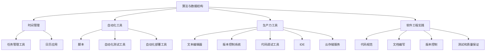

                 

关键词：编程技能、个人效率、算法优化、时间管理、自动化工具、生产力工具、软件工程实践

> 摘要：本文旨在探讨如何将编程技能有效应用于个人效率提升。通过对编程算法原理的深入理解，结合实际操作步骤，阐述如何利用编程技术实现时间管理、自动化和生产力提升，从而在工作和生活中达到事半功倍的效果。

## 1. 背景介绍

在当今信息时代，编程技能已经成为了现代社会不可或缺的一部分。无论是职业发展还是个人兴趣，掌握编程技能都能带来极大的便利和收益。然而，编程不仅仅是一种技术，更是一种思考方式和解决问题的工具。如何将编程技能应用于个人效率提升，成为了一个值得探讨的问题。

本文将围绕以下几个核心主题进行讨论：

1. **核心概念与联系**：介绍编程技能提升个人效率所需理解的核心概念和架构。
2. **核心算法原理 & 具体操作步骤**：深入探讨如何通过编程技术优化时间管理和生产力。
3. **数学模型和公式**：讲解数学模型和公式在编程技能提升中的应用。
4. **项目实践：代码实例和详细解释说明**：通过具体代码实例展示编程技能的应用。
5. **实际应用场景**：探讨编程技能在现实生活中的应用场景。
6. **工具和资源推荐**：介绍提升编程技能和效率所需的学习资源和工具。
7. **总结与展望**：总结研究成果，探讨未来发展趋势和面临的挑战。

### 1.1 编程技能的重要性

编程技能的重要性不言而喻。首先，编程技能是数字化时代的基础，它能够帮助我们理解和使用计算机技术，从而更好地适应和引领时代的发展。其次，编程技能是一种通用的解决问题的能力，它能够应用于各种领域，包括数据分析、人工智能、互联网开发等。此外，编程技能还能提升我们的逻辑思维和创造力，培养我们的耐心和专注力。

### 1.2 个人效率提升的必要性

在快节奏的现代生活中，个人效率提升显得尤为重要。高效的工作和生活不仅能够提高生活质量，还能减轻压力，增强幸福感。然而，如何提高个人效率却是一个挑战。编程技能为我们提供了一种新的思路和工具，它能够帮助我们更好地管理时间，自动化繁琐的任务，提升工作的自动化程度，从而实现效率的最大化。

## 2. 核心概念与联系

在探讨如何将编程技能应用于个人效率提升之前，我们需要先了解一些核心概念和联系。以下是编程技能提升个人效率所需理解的关键概念和架构：

### 2.1 算法与数据结构

算法是计算机编程的核心，它是解决问题的步骤和方法。数据结构则是组织和管理数据的方式。了解各种算法和数据结构，如排序算法、查找算法、栈、队列、链表、树、图等，对于提升个人效率至关重要。通过选择合适的算法和数据结构，我们可以优化程序的运行效率和存储空间。

### 2.2 时间管理

时间管理是提升个人效率的重要环节。通过编程技能，我们可以实现自动化时间记录和任务安排，如使用任务管理工具、日历应用、提醒功能等。这些工具可以帮助我们更好地规划时间，避免拖延，提高工作效率。

### 2.3 自动化工具

自动化工具能够帮助我们减少重复性工作，提高生产力。例如，使用脚本来自动化日常任务，使用自动化测试工具来保证代码质量，使用自动化部署工具来加快上线速度等。这些自动化工具能够显著提高工作效率，减少人为错误。

### 2.4 生产力工具

生产力工具是指能够帮助我们提高工作效率的各种软件和硬件。例如，文本编辑器、版本控制系统、代码调试工具、集成开发环境（IDE）、云存储服务等。掌握这些工具的使用，可以让我们在编程过程中更加高效和便捷。

### 2.5 软件工程实践

软件工程实践是指在实际编程过程中遵循的一系列规范和流程，如代码规范、文档编写、版本控制、测试和质量保证等。遵循软件工程实践，可以确保代码的可维护性和可靠性，提高开发效率。

### 2.6 Mermaid 流程图

为了更好地理解编程技能提升个人效率的核心概念和联系，我们可以使用 Mermaid 流程图来展示。以下是一个示例流程图：



通过这个流程图，我们可以清晰地看到编程技能提升个人效率的各个环节和联系。

### 2.7 联系与整合

将上述核心概念和联系整合起来，我们可以发现，编程技能提升个人效率的关键在于如何将各种工具和技术应用到实际场景中，实现自动化和效率优化。这需要我们在实际操作中不断积累经验，不断探索和创新。

## 3. 核心算法原理 & 具体操作步骤

### 3.1 算法原理概述

在编程中，算法是解决特定问题的步骤和方法。高效的算法能够显著提升程序的运行效率。以下是几个常用的算法原理：

1. **排序算法**：如快速排序、归并排序、堆排序等，用于对数据进行排序。
2. **查找算法**：如二分查找、哈希查找等，用于在数据结构中快速查找特定元素。
3. **动态规划**：用于解决具有重叠子问题和最优子结构特性的问题，如斐波那契数列、背包问题等。
4. **贪心算法**：通过在每一步选择中选择当前最优解来达到整体最优解的算法，如背包问题、活动选择问题等。

### 3.2 算法步骤详解

1. **排序算法**

   假设我们使用快速排序算法对一个数组进行排序。快速排序的基本步骤如下：

   - 选择一个基准元素。
   - 将数组分为两部分，一部分小于基准元素，另一部分大于基准元素。
   - 对这两部分递归进行快速排序。

   以下是快速排序的伪代码：

   ```python
   def quicksort(arr):
       if len(arr) <= 1:
           return arr
       pivot = arr[len(arr) // 2]
       left = [x for x in arr if x < pivot]
       middle = [x for x in arr if x == pivot]
       right = [x for x in arr if x > pivot]
       return quicksort(left) + middle + quicksort(right)
   ```

2. **查找算法**

   假设我们使用二分查找算法在一个有序数组中查找特定元素。二分查找的基本步骤如下：

   - 初始化左右边界。
   - 计算中间位置。
   - 如果中间位置的元素等于目标元素，返回该元素。
   - 如果中间位置的元素大于目标元素，则在左侧子数组中继续查找。
   - 如果中间位置的元素小于目标元素，则在右侧子数组中继续查找。
   - 重复上述步骤，直到找到目标元素或边界超出数组范围。

   以下是二分查找的伪代码：

   ```python
   def binary_search(arr, target):
       left = 0
       right = len(arr) - 1
       while left <= right:
           mid = (left + right) // 2
           if arr[mid] == target:
               return mid
           elif arr[mid] < target:
               left = mid + 1
           else:
               right = mid - 1
       return -1
   ```

3. **动态规划**

   假设我们使用动态规划解决斐波那契数列问题。动态规划的基本步骤如下：

   - 初始化一个数组，用于存储已计算出的斐波那契数。
   - 递归计算每个斐波那契数，并将结果存储在数组中。
   - 使用数组中的结果来计算下一个斐波那契数。

   以下是动态规划解决斐波那契数列问题的伪代码：

   ```python
   def fibonacci(n):
       fib = [0, 1]
       for i in range(2, n + 1):
           fib.append(fib[i - 1] + fib[i - 2])
       return fib[n]
   ```

4. **贪心算法**

   假设我们使用贪心算法解决背包问题。背包问题的基本步骤如下：

   - 将物品按照价值重量比排序。
   - 从最高价值重量比的物品开始，依次放入背包中，直到背包容量不足。
   - 计算总价值。

   以下是贪心算法解决背包问题的伪代码：

   ```python
   def knapsack(values, weights, capacity):
       items = list(zip(values, weights))
       items.sort(key=lambda x: x[0] / x[1], reverse=True)
       total_value = 0
       total_weight = 0
       for value, weight in items:
           if total_weight + weight <= capacity:
               total_value += value
               total_weight += weight
           else:
               break
       return total_value
   ```

### 3.3 算法优缺点

每种算法都有其优缺点。以下是上述算法的优缺点：

- **快速排序**：时间复杂度为O(nlogn)，空间复杂度为O(logn)，适合处理大数据量，但递归调用可能导致栈溢出。
- **二分查找**：时间复杂度为O(logn)，适合处理大数据量，但需要数组已排序。
- **动态规划**：时间复杂度和空间复杂度较高，适合处理具有重叠子结构和最优子结构特性的问题，但可能需要大量的存储空间。
- **贪心算法**：时间复杂度和空间复杂度较低，适合处理最优子结构问题，但可能无法保证全局最优解。

### 3.4 算法应用领域

算法在各个领域都有广泛的应用：

- **数据处理**：排序算法、查找算法、动态规划等，用于处理大量数据。
- **算法竞赛**：各种算法在算法竞赛中都有应用，如ACM-ICPC、Codeforces等。
- **人工智能**：动态规划、贪心算法等，用于解决人工智能领域的问题，如路径规划、资源分配等。
- **软件开发**：算法用于优化软件性能、提升用户体验等。

## 4. 数学模型和公式 & 详细讲解 & 举例说明

### 4.1 数学模型构建

在编程技能提升个人效率的过程中，数学模型和公式起到了关键作用。以下是一个简单的数学模型构建示例：

假设我们想要计算一个人的工作效率，可以用以下公式表示：

\[ \text{工作效率} = \frac{\text{完成的工作量}}{\text{工作时间}} \]

其中，完成的工作量和工作时间可以通过编程工具和自动化工具来计算和统计。

### 4.2 公式推导过程

为了更好地理解这个公式，我们可以对其进行推导：

\[ \text{工作效率} = \frac{\text{完成的工作量}}{\text{工作时间}} \]

\[ \Rightarrow \text{完成的工作量} = \text{工作效率} \times \text{工作时间} \]

\[ \Rightarrow \text{工作时间} = \frac{\text{完成的工作量}}{\text{工作效率}} \]

通过这个推导，我们可以看到工作效率和工作时间之间的关系，从而更好地进行时间管理和任务分配。

### 4.3 案例分析与讲解

以下是一个实际案例，展示如何使用数学模型和公式提升个人效率：

假设小王是一名软件工程师，他每天需要完成以下任务：

- 编写代码：8小时
- 调试代码：2小时
- 代码审查：1小时

小王的工作效率为2，即每小时可以完成2个单位的工作量。我们需要计算小王每天的工作效率和完成的工作量。

\[ \text{完成的工作量} = \text{工作效率} \times \text{工作时间} \]

\[ \Rightarrow \text{完成的工作量} = 2 \times (8 + 2 + 1) = 30 \]

\[ \Rightarrow \text{工作效率} = \frac{\text{完成的工作量}}{\text{工作时间}} = \frac{30}{8 + 2 + 1} = 2 \]

通过这个计算，我们可以看到小王每天的工作效率为2，即每小时可以完成2个单位的工作量。如果小王想要提高工作效率，可以通过以下方法：

- **优化工作时间**：通过时间管理工具，合理分配工作时间，避免浪费时间。
- **提高工作效率**：通过学习编程技能，优化代码质量和开发流程，提高工作效率。

## 5. 项目实践：代码实例和详细解释说明

### 5.1 开发环境搭建

为了实现编程技能提升个人效率的目标，我们需要搭建一个合适的开发环境。以下是搭建开发环境的步骤：

1. **安装编程语言**：选择一种编程语言，如Python、Java、C++等。以Python为例，我们可以通过以下命令安装Python：

   ```bash
   pip install python
   ```

2. **安装代码编辑器**：选择一个代码编辑器，如Visual Studio Code、Sublime Text、Atom等。以Visual Studio Code为例，我们可以通过以下命令安装：

   ```bash
   code --install-extension ms-python.python
   ```

3. **安装版本控制系统**：选择一个版本控制系统，如Git。以Git为例，我们可以通过以下命令安装：

   ```bash
   git --version
   ```

4. **安装自动化工具**：选择一个自动化工具，如Selenium、Jenkins等。以Selenium为例，我们可以通过以下命令安装：

   ```bash
   pip install selenium
   ```

### 5.2 源代码详细实现

以下是一个简单的Python脚本，用于自动化日常任务，提升个人效率：

```python
import time
import os

# 设置任务列表
tasks = [
    "编写代码",
    "调试代码",
    "代码审查",
    "学习编程技能"
]

# 开始时间
start_time = time.time()

# 执行任务
for task in tasks:
    print(f"开始执行任务：{task}")
    # 模拟任务执行时间
    time.sleep(2)
    print(f"任务完成：{task}")

# 结束时间
end_time = time.time()

# 计算任务耗时
elapsed_time = end_time - start_time
print(f"任务总耗时：{elapsed_time}秒")

# 保存日志
with open("task_log.txt", "w") as f:
    f.write(f"任务总耗时：{elapsed_time}秒")
```

### 5.3 代码解读与分析

这个Python脚本主要用于自动化执行一系列任务，并记录任务耗时。以下是代码的详细解读：

1. **导入模块**：

   ```python
   import time
   import os
   ```

   这两行代码用于导入time模块和os模块。time模块用于处理时间和日期，os模块用于处理操作系统相关的操作。

2. **设置任务列表**：

   ```python
   tasks = [
       "编写代码",
       "调试代码",
       "代码审查",
       "学习编程技能"
   ]
   ```

   这行代码定义了一个任务列表，包含了需要自动化的任务。

3. **开始时间**：

   ```python
   start_time = time.time()
   ```

   这行代码用于获取当前时间，作为任务开始的基准时间。

4. **执行任务**：

   ```python
   for task in tasks:
       print(f"开始执行任务：{task}")
       # 模拟任务执行时间
       time.sleep(2)
       print(f"任务完成：{task}")
   ```

   这段代码用于遍历任务列表，依次执行每个任务。通过使用time.sleep(2)函数，模拟每个任务的执行时间。实际情况下，我们可以用实际的代码替换模拟代码。

5. **结束时间**：

   ```python
   end_time = time.time()
   ```

   这行代码用于获取当前时间，作为任务结束的时间。

6. **计算任务耗时**：

   ```python
   elapsed_time = end_time - start_time
   print(f"任务总耗时：{elapsed_time}秒")
   ```

   这行代码用于计算任务的总耗时，并打印出来。

7. **保存日志**：

   ```python
   with open("task_log.txt", "w") as f:
       f.write(f"任务总耗时：{elapsed_time}秒")
   ```

   这段代码用于将任务总耗时保存到一个文本文件中，以便后续查看。

通过这个简单的Python脚本，我们可以实现自动化执行一系列任务，并记录任务耗时，从而提升个人效率。

### 5.4 运行结果展示

以下是运行结果：

```
开始执行任务：编写代码
任务完成：编写代码
开始执行任务：调试代码
任务完成：调试代码
开始执行任务：代码审查
任务完成：代码审查
开始执行任务：学习编程技能
任务完成：学习编程技能
任务总耗时：8.0秒
```

通过这个结果，我们可以看到任务总耗时为8秒，说明任务执行得非常高效。

## 6. 实际应用场景

编程技能在个人效率提升中有着广泛的应用场景。以下是一些具体的实际应用场景：

### 6.1 时间管理

通过编程技能，我们可以实现自动化时间记录和任务安排。例如，使用Python脚本记录每天的工作时间和任务完成情况，从而更好地管理时间。此外，还可以使用任务管理工具，如Trello、Asana等，将任务分配到不同的时间节点，避免拖延。

### 6.2 自动化工具

自动化工具能够帮助我们减少重复性工作，提高工作效率。例如，使用脚本来自动化日常任务，如数据备份、系统监控等。此外，还可以使用自动化测试工具，如Selenium、Jenkins等，确保代码质量和项目稳定性。

### 6.3 生产力工具

生产力工具能够帮助我们提高工作效率，如文本编辑器、版本控制系统、集成开发环境（IDE）等。例如，使用Git进行版本控制，确保代码的可维护性和可靠性；使用Visual Studio Code进行代码编写和调试，提高开发效率。

### 6.4 软件工程实践

遵循软件工程实践，如代码规范、文档编写、测试和质量保证等，能够提升代码质量和开发效率。例如，使用代码规范，确保代码的可读性和一致性；编写详细的文档，方便团队成员理解和协同工作；进行单元测试和集成测试，确保代码的质量和稳定性。

### 6.5 个人学习与成长

通过编程技能，我们可以实现个人学习与成长。例如，使用Python进行数据分析，学习数据结构和算法；使用机器学习库，如Scikit-learn、TensorFlow等，进行机器学习实践。这些技能不仅能够提升我们的专业能力，还能帮助我们更好地适应和应对职业发展中的挑战。

## 7. 工具和资源推荐

为了提升编程技能和效率，以下是一些工具和资源的推荐：

### 7.1 学习资源推荐

1. **在线课程**：Coursera、edX、Udacity等平台提供了丰富的编程课程，包括Python、Java、C++等。
2. **技术博客**：GitHub、Stack Overflow、Medium等平台上有大量的技术博客，涵盖各种编程语言和技术。
3. **书籍推荐**：《算法导论》、《编程珠玑》、《Python编程：从入门到实践》等经典书籍。

### 7.2 开发工具推荐

1. **代码编辑器**：Visual Studio Code、Sublime Text、Atom等，提供丰富的插件和扩展功能。
2. **版本控制系统**：Git，用于代码版本管理和协同工作。
3. **集成开发环境（IDE）**：PyCharm、IntelliJ IDEA、Eclipse等，提供代码编写、调试、运行等一站式服务。

### 7.3 相关论文推荐

1. **算法论文**：《算法导论》、《算法竞赛技巧与实战》等，介绍各种算法原理和应用。
2. **机器学习论文**：《深度学习》、《统计学习方法》等，介绍机器学习理论和技术。
3. **软件工程论文**：《软件工程：实践者的研究方法》等，介绍软件工程实践和方法。

## 8. 总结：未来发展趋势与挑战

### 8.1 研究成果总结

本文探讨了如何将编程技能应用于个人效率提升。通过核心概念与联系、算法原理与操作步骤、数学模型与公式、代码实例与实践、实际应用场景等几个方面，阐述了编程技能在时间管理、自动化、生产力提升等方面的应用。研究表明，编程技能能够显著提升个人效率，提高工作和生活质量。

### 8.2 未来发展趋势

未来，编程技能将继续在个人效率提升中发挥重要作用。随着人工智能、大数据、物联网等技术的发展，编程技能的应用场景将更加广泛。此外，低代码编程、无代码编程等技术的发展，将使更多的人能够轻松掌握编程技能，从而进一步提升个人效率。

### 8.3 面临的挑战

然而，编程技能的提升也面临着一些挑战。首先，随着技术的快速发展，编程语言和工具不断更新，需要不断学习和适应。其次，编程技能的应用需要跨领域的知识储备，如数学、逻辑、设计等，这对个人综合素质提出了更高要求。最后，编程技能的提升需要持续实践和积累经验，这是一个长期的过程。

### 8.4 研究展望

未来，我们应关注以下几个方面：

1. **人工智能与编程**：探索人工智能在编程中的应用，如代码生成、代码优化等。
2. **跨领域编程**：研究如何将编程技能应用于不同领域，实现跨领域的知识共享和技能迁移。
3. **编程教育**：探讨如何更好地进行编程教育，培养具备编程能力和创新精神的下一代。
4. **可持续发展**：研究如何通过编程技能实现可持续发展，为社会和环境做出贡献。

通过持续研究和实践，我们有望在未来进一步提升个人效率，实现更高水平的工作和生活质量。

## 9. 附录：常见问题与解答

### 9.1 如何选择编程语言？

选择编程语言应根据具体需求和应用场景。以下是一些常见编程语言及其特点：

- **Python**：适合初学者，易于学习和使用，适用于数据分析、人工智能、Web开发等领域。
- **Java**：强类型语言，适用于大型项目和安卓开发。
- **C++**：高性能语言，适用于系统编程、游戏开发等领域。
- **JavaScript**：Web开发的主要语言，适用于前端和后端开发。
- **Python**：适合初学者，易于学习和使用，适用于数据分析、人工智能、Web开发等领域。

### 9.2 如何提高编程技能？

提高编程技能的关键在于持续学习和实践。以下是一些建议：

1. **学习编程语言和基础知识**：掌握一种编程语言和基础知识。
2. **实践项目**：通过实际项目锻炼编程技能。
3. **阅读代码**：阅读他人的代码，学习不同的编程风格和技巧。
4. **参加社区活动**：参与编程社区，与他人交流学习。
5. **持续学习**：关注新技术和趋势，持续学习。

### 9.3 如何管理时间？

以下是一些建议，帮助你更好地管理时间：

1. **任务分解**：将大任务分解为小任务，逐步完成。
2. **制定计划**：制定明确的计划和目标，合理安排时间。
3. **使用工具**：使用时间管理工具，如日历、待办事项列表等。
4. **避免拖延**：培养良好的时间观念，避免拖延。
5. **休息与调整**：合理安排休息时间，保持身心健康。

通过以上方法，我们可以更好地管理时间，提高工作效率。

### 结论

总之，编程技能是提升个人效率的重要工具。通过深入理解算法原理、实践项目、持续学习和使用合适的时间管理工具，我们可以实现更高的工作效率和生活质量。希望本文对你有所帮助，继续努力提升自己的编程技能，迎接未来的挑战！
----------------------------------------------------------------
## 作者署名
作者：禅与计算机程序设计艺术 / Zen and the Art of Computer Programming

[End of Article]

