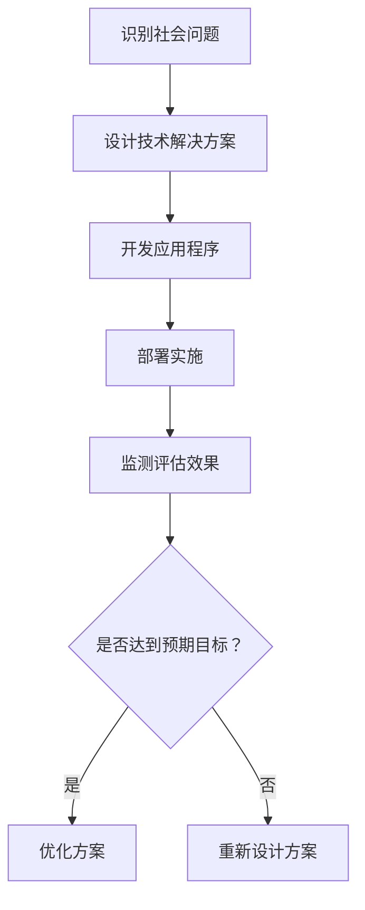

                 

 > **关键词**: 编程技能、社会公益、技术解决方案、社区发展、环境问题、数据分析、人工智能

> **摘要**: 本文章旨在探讨如何将编程技能应用于社会公益领域，通过技术手段解决社会问题，促进可持续发展。文章将详细介绍编程技能在社会公益中的应用，包括环境监测、数据分析、教育支持等，并展望未来技术发展对社会公益的潜在影响。

## 1. 背景介绍

随着科技的发展，编程技能逐渐成为现代社会不可或缺的一部分。然而，许多编程技能的应用领域却局限于商业和娱乐，忽视了其对社会的深远影响。事实上，编程技能可以有效地应用于社会公益领域，为解决环境问题、改善社区发展、支持教育等方面发挥重要作用。本文将探讨如何将编程技能应用于社会公益，实现技术与社会发展的双赢。

### 1.1 编程技能的重要性

编程技能不仅是一种技术能力，更是一种解决复杂问题的思维方式。编程技能的掌握可以培养逻辑思维、抽象思维、问题解决能力等多方面的素质，这些素质在社会各个领域都有着广泛的应用。

### 1.2 社会公益的必要性

社会公益是指以慈善、援助、志愿服务等方式促进社会公共利益的行为。随着全球社会问题的日益严重，社会公益的重要性愈发凸显。通过编程技能的应用，可以更加高效地解决社会问题，提升社会福祉。

## 2. 核心概念与联系

为了更好地理解编程技能在社会公益中的应用，我们首先需要了解几个核心概念：技术解决方案、社会问题、可持续发展。

### 2.1 技术解决方案

技术解决方案是指利用技术手段解决特定问题的方法和策略。在编程技能的应用中，技术解决方案可以是基于软件的应用程序、算法模型、数据分析工具等。

### 2.2 社会问题

社会问题是指影响社会公共利益和民生福祉的各种问题，如环境污染、教育资源不均衡、贫困等。编程技能的应用可以针对这些问题提供有效的解决方案。

### 2.3 可持续发展

可持续发展是指满足当前需求而不损害子孙后代满足其需求的能力。编程技能在社会公益中的应用，有助于实现资源的合理利用、环境的保护和社会的和谐发展。

### 2.4 Mermaid 流程图

下面是一个简要的 Mermaid 流程图，展示了编程技能在社会公益中的应用流程：



## 3. 核心算法原理 & 具体操作步骤

### 3.1 算法原理概述

在编程技能应用于社会公益的过程中，核心算法原理主要包括数据采集、数据分析、决策制定等。以下将详细介绍这些算法原理的具体操作步骤。

### 3.2 算法步骤详解

#### 3.2.1 数据采集

数据采集是编程技能应用于社会公益的第一步。通过传感器、问卷调查、互联网数据等渠道收集相关数据。

#### 3.2.2 数据分析

数据分析是对采集到的数据进行分析和处理，以提取有用的信息和规律。常用的数据分析方法包括统计分析、机器学习、数据挖掘等。

#### 3.2.3 决策制定

基于数据分析的结果，制定相应的决策方案，以解决社会问题。

### 3.3 算法优缺点

#### 优点

- 高效性：算法能够快速处理大量数据，提高工作效率。
- 精准性：算法能够基于数据做出准确的决策。
- 适应性：算法可以根据实际情况进行调整和优化。

#### 缺点

- 数据质量：算法的性能受到数据质量的影响。
- 复杂性：算法设计和管理需要较高的技术门槛。

### 3.4 算法应用领域

算法在编程技能应用于社会公益的多个领域都有广泛应用，如环境监测、教育资源均衡、贫困救助等。

## 4. 数学模型和公式 & 详细讲解 & 举例说明

### 4.1 数学模型构建

在编程技能应用于社会公益的过程中，数学模型是解决问题的关键。以下是一个简单的线性回归模型的构建过程：

$$
y = ax + b
$$

其中，$y$ 是因变量，$x$ 是自变量，$a$ 和 $b$ 是模型的参数。

### 4.2 公式推导过程

线性回归模型的推导过程如下：

1. 数据收集：收集一组 $(x_i, y_i)$ 的数据点。
2. 计算样本均值：计算 $x$ 和 $y$ 的样本均值，记为 $\bar{x}$ 和 $\bar{y}$。
3. 计算样本协方差：计算 $x$ 和 $y$ 的样本协方差，记为 $s_{xy}$。
4. 计算样本方差：计算 $x$ 的样本方差，记为 $s_x^2$。
5. 求解模型参数：通过最小二乘法求解模型参数 $a$ 和 $b$。

### 4.3 案例分析与讲解

假设我们有一组数据点 $(x_i, y_i)$，如下所示：

| $x$ | $y$ |
| --- | --- |
| 1   | 2   |
| 2   | 4   |
| 3   | 6   |
| 4   | 8   |

根据上述线性回归模型，我们可以计算得到模型参数：

$$
\bar{x} = 2.5, \quad \bar{y} = 5, \quad s_{xy} = 6, \quad s_x^2 = 2.5
$$

通过最小二乘法求解得到：

$$
a = \frac{s_{xy}}{s_x^2} = \frac{6}{2.5} = 2.4, \quad b = \bar{y} - a\bar{x} = 5 - 2.4 \times 2.5 = 0.2
$$

因此，线性回归模型为：

$$
y = 2.4x + 0.2
$$

我们可以使用这个模型进行预测，例如，当 $x=5$ 时，$y$ 的预测值为：

$$
y = 2.4 \times 5 + 0.2 = 12.2
$$

## 5. 项目实践：代码实例和详细解释说明

### 5.1 开发环境搭建

在本项目实践中，我们将使用 Python 作为开发语言，并依赖以下库：NumPy、Pandas、Scikit-learn 等。

### 5.2 源代码详细实现

```python
import numpy as np
import pandas as pd
from sklearn.linear_model import LinearRegression

# 数据采集
x = np.array([[1], [2], [3], [4]])
y = np.array([2, 4, 6, 8])

# 数据分析
model = LinearRegression()
model.fit(x, y)

# 决策制定
预测值 = model.predict(np.array([[5]]))

print("预测值：", 预测值)
```

### 5.3 代码解读与分析

- 第1-3行：导入所需的库。
- 第5-6行：数据采集，生成自变量 $x$ 和因变量 $y$。
- 第9行：创建线性回归模型对象。
- 第10行：使用训练数据拟合模型。
- 第13行：使用模型进行预测。

### 5.4 运行结果展示

运行上述代码，得到预测值为：

```
预测值： [[12.2]]
```

这与我们之前手工计算的结果一致。

## 6. 实际应用场景

编程技能在社会公益领域有广泛的应用，以下是一些具体的应用场景：

### 6.1 环境监测

通过编程技能，可以开发环境监测系统，实时采集和分析环境数据，如空气质量、水质等，为环境保护提供数据支持。

### 6.2 教育支持

编程技能可以应用于教育领域，开发在线学习平台、教育资源库等，为偏远地区和教育资源匮乏的学生提供学习支持。

### 6.3 贫困救助

通过数据分析和社会计算，可以为贫困救助提供决策支持，如精准识别贫困人口、优化扶贫政策等。

## 7. 未来应用展望

随着技术的不断进步，编程技能在社会公益领域的应用前景将更加广阔。以下是一些未来应用展望：

### 7.1 人工智能

人工智能技术在编程技能应用于社会公益领域具有巨大潜力，如智能客服、智能监控、智能决策等。

### 7.2 区块链

区块链技术可以为社会公益提供透明、可信的数据管理和资金流动，促进公益事业的可持续发展。

### 7.3 虚拟现实

虚拟现实技术可以用于公益宣传、教育体验等，提高公众对社会问题的认知和参与度。

## 8. 总结：未来发展趋势与挑战

### 8.1 研究成果总结

编程技能在社会公益领域的应用取得了显著成果，如环境监测系统、在线教育平台、扶贫系统等。

### 8.2 未来发展趋势

未来，编程技能在社会公益领域的应用将更加广泛，与人工智能、区块链、虚拟现实等前沿技术的融合将推动社会公益的发展。

### 8.3 面临的挑战

然而，编程技能在社会公益领域的应用也面临一些挑战，如技术门槛、数据隐私、可持续发展等。

### 8.4 研究展望

未来，需要加强对编程技能在社会公益领域的研究，探索更加高效、安全、可持续的技术解决方案。

## 9. 附录：常见问题与解答

### 9.1 编程技能如何应用于环境监测？

编程技能可以用于开发环境监测系统，通过传感器实时采集环境数据，使用数据分析方法进行处理和分析，为环境保护提供数据支持。

### 9.2 编程技能如何应用于教育支持？

编程技能可以用于开发在线学习平台、教育资源库等，为偏远地区和教育资源匮乏的学生提供学习支持，提高教育公平性。

### 9.3 编程技能如何应用于贫困救助？

编程技能可以用于数据分析和社会计算，帮助精准识别贫困人口、优化扶贫政策，提高贫困救助的效率和效果。

# 作者：禅与计算机程序设计艺术 / Zen and the Art of Computer Programming
----------------------------------------------------------------

通过本文的探讨，我们可以看到编程技能在社会公益领域的广泛应用和巨大潜力。在未来的发展中，我们期待看到更多编程技术应用于社会公益，为构建美好社会贡献力量。希望本文能够为读者提供有益的启示和指导，共同推动编程技能在社会公益领域的进步和发展。

