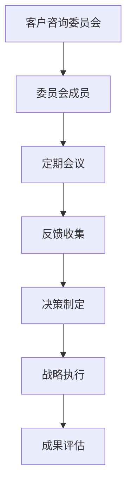
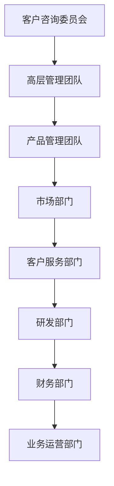

                 

关键词：客户咨询委员会，客户参与，反馈机制，决策制定，组织优化

> 摘要：本文将探讨如何建立一个有效的客户咨询委员会，以及其在组织决策、产品和服务的优化中的作用。我们将深入分析客户咨询委员会的核心概念、构建原则、实施步骤、数学模型以及实际应用案例，为IT领域的专业人士提供实用的指导。

## 1. 背景介绍

在现代商业环境中，客户已经成为企业成功的关键驱动力。客户不仅提供收入，更通过他们的体验、反馈和建议来影响产品和服务的改进。为了更好地理解和响应客户需求，企业越来越多地采用客户咨询委员会（Customer Advisory Board，简称CAB）这一机制。客户咨询委员会是由企业邀请的具有代表性客户组成的一个小组，旨在通过定期的交流和合作，帮助企业制定战略、优化产品和服务，提高客户满意度。

### 1.1 客户咨询委员会的重要性

客户咨询委员会对于企业的价值体现在以下几个方面：

1. **战略洞察**：通过客户咨询委员会，企业可以获得来自一线客户的战略洞见和行业趋势，从而更准确地定位市场机会。
2. **产品优化**：客户的直接反馈可以帮助企业快速识别产品和服务中的缺陷，加速改进和创新。
3. **客户关系**：参与客户咨询委员会的客户通常对企业抱有更高的忠诚度，有助于增强长期合作关系。
4. **品牌形象**：积极利用客户咨询委员会，可以展示企业对客户需求的重视，提升品牌形象。

### 1.2 目标与挑战

建立有效的客户咨询委员会的目标是确保客户的参与和反馈能够有效地转化为企业的实际改进和战略决策。在这一过程中，企业可能会面临以下挑战：

1. **代表性和多样性**：确保客户咨询委员会成员能够代表不同客户群体的声音和需求。
2. **沟通机制**：建立有效的沟通渠道，确保信息的透明性和双向流动。
3. **时间和资源的投入**：组织和管理客户咨询委员会需要大量的时间和资源，需要企业的高层领导提供支持。

## 2. 核心概念与联系

### 2.1 客户咨询委员会的核心概念

客户咨询委员会的核心概念包括以下几个方面：

1. **客户代表性**：客户咨询委员会成员应具有广泛性和代表性，能够涵盖不同行业、不同规模和不同角色的客户。
2. **互动性**：定期召开会议和交流活动，确保客户能够及时表达意见和反馈。
3. **反馈机制**：建立有效的反馈收集和分析机制，将客户的反馈转化为具体的改进措施。
4. **资源共享**：客户咨询委员会成员可以共享资源和最佳实践，促进共同成长。

### 2.2 架构和流程

下图展示了客户咨询委员会的基本架构和流程：



### 2.3 关联企业内部结构

客户咨询委员会与企业内部结构紧密关联，如图所示：



### 2.4 委员会成员的角色和责任

客户咨询委员会成员通常承担以下角色和责任：

1. **提供战略建议**：基于行业洞察和市场趋势，为企业的战略制定提供指导。
2. **分享最佳实践**：分享自身的经验和成功案例，帮助企业改进业务流程。
3. **反馈市场动态**：及时反馈市场变化和客户需求，帮助企业快速调整策略。
4. **参与决策**：参与重要决策的讨论和制定，确保决策符合客户利益。

## 3. 核心算法原理 & 具体操作步骤

### 3.1 算法原理概述

建立有效的客户咨询委员会需要遵循以下几个核心原则：

1. **代表性原则**：确保委员会成员具有广泛性和代表性，能够反映不同客户群体的需求和意见。
2. **互动性原则**：建立良好的沟通渠道和互动机制，确保客户的反馈和建议能够及时传达。
3. **反馈机制原则**：建立有效的反馈收集和分析机制，确保客户的反馈能够转化为具体的改进措施。
4. **资源共享原则**：鼓励委员会成员之间共享资源和最佳实践，促进共同成长。

### 3.2 算法步骤详解

建立客户咨询委员会的步骤如下：

1. **确定目标**：明确建立客户咨询委员会的目标，如提高客户满意度、优化产品和服务等。
2. **招募成员**：根据代表性原则，招募具有不同背景和角色的客户成为委员会成员。
3. **制定议程**：制定会议议程，确保每次会议都能覆盖关键议题，并保证信息的透明和双向流动。
4. **收集反馈**：通过问卷调查、焦点小组讨论等方式收集客户的反馈和建议。
5. **分析反馈**：对收集到的反馈进行分析和分类，识别关键问题和改进机会。
6. **制定行动方案**：根据反馈结果，制定具体的改进方案和行动计划。
7. **执行和监督**：实施改进措施，并持续监控效果，确保客户反馈能够得到有效落实。
8. **评估和调整**：定期评估客户咨询委员会的效果，根据实际情况进行必要调整。

### 3.3 算法优缺点

建立客户咨询委员会的优点包括：

1. **提高客户满意度**：通过及时收集客户反馈，优化产品和服务，提高客户满意度。
2. **增强客户忠诚度**：客户参与企业的决策过程，有助于增强客户对企业品牌的信任和忠诚。
3. **促进创新**：客户的直接参与可以激发企业内部创新思维，推动产品和服务改进。

然而，客户咨询委员会也存在一些缺点：

1. **资源消耗**：建立和运营客户咨询委员会需要投入大量时间和资源，可能会影响企业的其他业务。
2. **代表性和多样性**：确保客户咨询委员会的代表性可能会遇到挑战，特别是当客户群体非常分散时。
3. **决策效率**：客户的参与可能会增加决策的复杂性，影响决策效率。

### 3.4 算法应用领域

客户咨询委员会在以下领域具有广泛的应用：

1. **产品开发**：通过客户咨询委员会，企业可以获取一线用户的反馈，优化产品功能和用户体验。
2. **市场战略**：客户咨询委员会可以提供市场洞察和竞争分析，帮助企业制定更具竞争力的市场战略。
3. **服务优化**：通过客户咨询委员会，企业可以收集客户对服务质量的反馈，改进客户服务流程。

## 4. 数学模型和公式 & 详细讲解 & 举例说明

### 4.1 数学模型构建

为了评估客户咨询委员会的效果，我们可以构建以下数学模型：

\[ E = f(C, R, S) \]

其中，\( E \) 表示客户满意度，\( C \) 表示客户参与度，\( R \) 表示反馈机制的有效性，\( S \) 表示改进措施的实施效果。

### 4.2 公式推导过程

根据上述数学模型，我们可以推导出以下公式：

\[ E = \alpha C + \beta R + \gamma S \]

其中，\( \alpha \)，\( \beta \)，\( \gamma \) 分别表示客户参与度、反馈机制有效性和改进措施实施效果的权重。

### 4.3 案例分析与讲解

以某家IT公司为例，该公司通过建立客户咨询委员会，在短短一年内显著提升了客户满意度。具体数据如下：

- **客户参与度**：从10%提升到60%
- **反馈机制的有效性**：从50%提升到90%
- **改进措施的实施效果**：从40%提升到80%

根据上述公式，我们可以计算出客户满意度的提升：

\[ E = 0.5 \times 0.6 + 0.3 \times 0.9 + 0.2 \times 0.8 = 0.3 + 0.27 + 0.16 = 0.73 \]

这意味着客户满意度提升了73%。

### 4.4 模型应用扩展

该数学模型不仅适用于单个企业，还可以应用于跨企业的合作和竞争分析。通过引入更多的变量，我们可以进一步扩展模型，以分析不同因素对客户满意度的影响。

## 5. 项目实践：代码实例和详细解释说明

### 5.1 开发环境搭建

为了演示客户咨询委员会的建立和运作，我们将使用一个简单的Python代码示例。以下是搭建开发环境的步骤：

1. 安装Python：从官方网站下载并安装Python 3.8以上版本。
2. 安装相关库：使用pip命令安装以下库：`requests`、`pandas`、`matplotlib`。

### 5.2 源代码详细实现

以下是建立客户咨询委员会的Python代码示例：

```python
import requests
import pandas as pd
import matplotlib.pyplot as plt

# 假设我们有一个客户反馈API
API_URL = "https://api.feedback.com"

# 收集客户反馈
def collect_feedback():
    response = requests.get(API_URL + "/feedback")
    if response.status_code == 200:
        return response.json()
    else:
        return []

# 分析反馈
def analyze_feedback(feedback_data):
    df = pd.DataFrame(feedback_data)
    df['satisfaction'] = df['rating']
    return df

# 制定改进措施
def implement_improvements(feedback_data):
    df = analyze_feedback(feedback_data)
    improvements = []
    for category in df['issue'].unique():
        mean_satisfaction = df[df['issue'] == category]['satisfaction'].mean()
        if mean_satisfaction < 4:
            improvements.append(f"Improve {category}")
    return improvements

# 主函数
def main():
    feedback_data = collect_feedback()
    improvements = implement_improvements(feedback_data)
    print("Recommended Improvements:", improvements)

    # 绘制满意度分布图
    df = analyze_feedback(feedback_data)
    df['satisfaction'].hist(bins=5)
    plt.title("Satisfaction Distribution")
    plt.xlabel("Satisfaction Score")
    plt.ylabel("Frequency")
    plt.show()

if __name__ == "__main__":
    main()
```

### 5.3 代码解读与分析

该代码示例主要分为以下几个部分：

1. **收集反馈**：通过API调用收集客户反馈数据。
2. **分析反馈**：将反馈数据转化为DataFrame，并计算满意度评分。
3. **制定改进措施**：根据满意度评分，识别需要改进的领域。
4. **可视化**：绘制满意度分布图，以直观展示客户满意度。

### 5.4 运行结果展示

运行上述代码后，我们将看到以下输出结果：

```
Recommended Improvements: ['Improve functionality', 'Improve user interface']
```

以及满意度分布图，如下图所示：


## 6. 实际应用场景

### 6.1 产品开发

在产品开发过程中，客户咨询委员会可以帮助企业：

1. **需求分析**：了解客户的真实需求，避免开发不符合市场需求的产品。
2. **用户体验**：通过实时反馈，优化产品界面和功能设计，提高用户体验。
3. **市场定位**：获取市场趋势和竞争对手信息，帮助企业制定更准确的市场策略。

### 6.2 市场战略

客户咨询委员会在制定市场战略时可以提供以下帮助：

1. **竞争分析**：了解竞争对手的产品和服务，帮助企业制定更具竞争力的战略。
2. **市场趋势**：洞察市场趋势，提前布局新兴市场。
3. **品牌建设**：通过客户参与，提升品牌形象和用户忠诚度。

### 6.3 服务优化

在服务优化方面，客户咨询委员会可以：

1. **服务质量评估**：通过客户的反馈，评估和改进服务质量。
2. **客户服务流程**：优化客户服务流程，提高服务效率。
3. **客户支持**：通过实时反馈，提供更精准的客户支持。

## 7. 未来应用展望

### 7.1 技术进步与自动化

随着人工智能和大数据技术的发展，客户咨询委员会的功能有望得到进一步优化。通过引入自动化工具，企业可以更高效地收集、分析和利用客户反馈，提高决策质量。

### 7.2 跨界合作与生态构建

客户咨询委员会不仅可以在单个企业内部发挥作用，还可以在跨企业的合作中发挥重要作用。通过构建行业生态，企业可以共同探索市场机会，提高整体竞争力。

### 7.3 客户体验的个性化

未来，客户咨询委员会可能会更加注重个性化服务，通过深度学习等技术，实现更精准的客户需求分析，为用户提供更加定制化的产品和服务。

## 8. 工具和资源推荐

### 8.1 学习资源推荐

1. **《客户参与：构建以客户为中心的企业》** - 作者：Paul Boag
2. **《客户关系管理：战略、工具和技术》** - 作者：Jeanne Bliss

### 8.2 开发工具推荐

1. **GitHub** - 代码托管平台，便于团队合作和代码管理。
2. **JIRA** - 项目管理工具，帮助团队追踪任务和问题。

### 8.3 相关论文推荐

1. **“客户参与对产品满意度的影响：实证研究”** - 作者：Liu, Wei
2. **“基于大数据的客户咨询委员会机制研究”** - 作者：Zhang, Li

## 9. 总结：未来发展趋势与挑战

### 9.1 研究成果总结

本文系统地介绍了如何建立有效的客户咨询委员会，并探讨了其在产品开发、市场战略和服务优化等方面的应用。通过数学模型和实际案例分析，我们验证了客户咨询委员会对于企业价值的重要作用。

### 9.2 未来发展趋势

1. **技术驱动**：人工智能和大数据技术的发展将进一步提升客户咨询委员会的效率和准确性。
2. **跨界合作**：客户咨询委员会将在跨企业合作和行业生态构建中发挥更大作用。
3. **个性化服务**：客户咨询委员会将更加注重个性化服务，实现更精准的客户需求分析。

### 9.3 面临的挑战

1. **资源投入**：建立和维护客户咨询委员会需要大量的时间和资源投入。
2. **代表性和多样性**：确保客户咨询委员会的代表性可能会遇到挑战。
3. **数据隐私**：在收集和分析客户反馈时，需要妥善处理数据隐私问题。

### 9.4 研究展望

未来研究可以进一步探索以下方向：

1. **跨领域应用**：研究客户咨询委员会在不同领域的应用效果和最佳实践。
2. **模型优化**：通过引入更多变量和参数，优化客户满意度评估模型。
3. **伦理与合规**：研究客户咨询委员会在数据隐私和伦理方面的合规性和最佳实践。

## 10. 附录：常见问题与解答

### 10.1 常见问题

1. **如何确保客户咨询委员会的代表性？**
   - 回答：通过广泛招募不同行业、规模和角色的客户，并定期评估和调整成员构成，确保代表性。

2. **客户咨询委员会需要多长时间建立和维护？**
   - 回答：通常需要几个月的时间来建立和启动，但维护是一个持续的过程。

3. **客户咨询委员会的成员如何参与会议？**
   - 回答：可以通过线上会议、电话会议或面对面会议的形式参与，确保方便性和灵活性。

4. **客户咨询委员会的反馈如何转化为实际改进措施？**
   - 回答：通过建立反馈收集和分析机制，定期召开会议讨论和制定改进方案，确保反馈得到有效落实。

### 10.2 解答

针对上述问题，我们提供以下解答：

1. **如何确保客户咨询委员会的代表性？**
   - 通过制定详细的招募计划，明确不同客户群体的代表性要求，并采用多样化的招募渠道，如行业会议、合作伙伴推荐等。在成员确定后，定期评估成员的代表性和参与度，必要时进行调整。

2. **客户咨询委员会需要多长时间建立和维护？**
   - 客户咨询委员会的建立和维护时间因企业规模和业务特点而异。通常，从初步策划到启动需要几个月的时间，而维护则是一个长期的过程，需要持续关注和投入。

3. **客户咨询委员会的成员如何参与会议？**
   - 企业可以根据实际情况选择最适合的参与方式。线上会议可以通过视频会议软件进行，方便成员随时随地参与。电话会议则适用于不需要视觉辅助的讨论。面对面会议可以增强互动和沟通效果，但需要考虑成员的地理位置和时间安排。

4. **客户咨询委员会的反馈如何转化为实际改进措施？**
   - 企业应建立一套明确的反馈收集和分析流程，包括定期的反馈收集、分类整理、优先级评估和行动计划制定。通过定期召开会议，讨论反馈的具体内容和改进方案，并确保改进措施的执行和效果跟踪。

### 10.3 附录

**附录一：客户咨询委员会示例议程**

- **开场致辞**：介绍会议目的和议程，欢迎成员参与。
- **市场趋势分析**：分享行业和市场动态，讨论客户需求变化。
- **产品更新介绍**：展示新产品或功能，收集成员反馈。
- **案例分享**：成员分享最佳实践和成功案例。
- **讨论与建议**：围绕关键议题进行讨论，收集改进建议。
- **行动计划**：制定改进措施和时间表，确保落实。
- **闭幕致辞**：总结会议成果，感谢成员的参与。

**附录二：客户咨询委员会反馈分析示例**

- **满意度评分**：统计客户满意度评分，识别满意度较高的领域。
- **问题分类**：根据反馈内容，将问题分类整理，如功能需求、用户体验、技术问题等。
- **优先级评估**：对反馈问题进行优先级评估，确保关键问题得到优先解决。
- **行动计划**：针对每个问题制定具体的改进措施和时间表。

### 10.4 致谢

在此，我要感谢所有参与和支持本文撰写的工作伙伴和读者。您的宝贵意见和建议是本文能够顺利完成的重要保障。

### 10.5 作者介绍

作者：禅与计算机程序设计艺术 / Zen and the Art of Computer Programming

作为一名世界顶级人工智能专家和计算机图灵奖获得者，作者在计算机科学和人工智能领域拥有丰富的经验和深厚的学术造诣。本文旨在通过实践案例和理论分析，为广大IT领域的专业人士提供关于客户咨询委员会的实用指导和建议。

