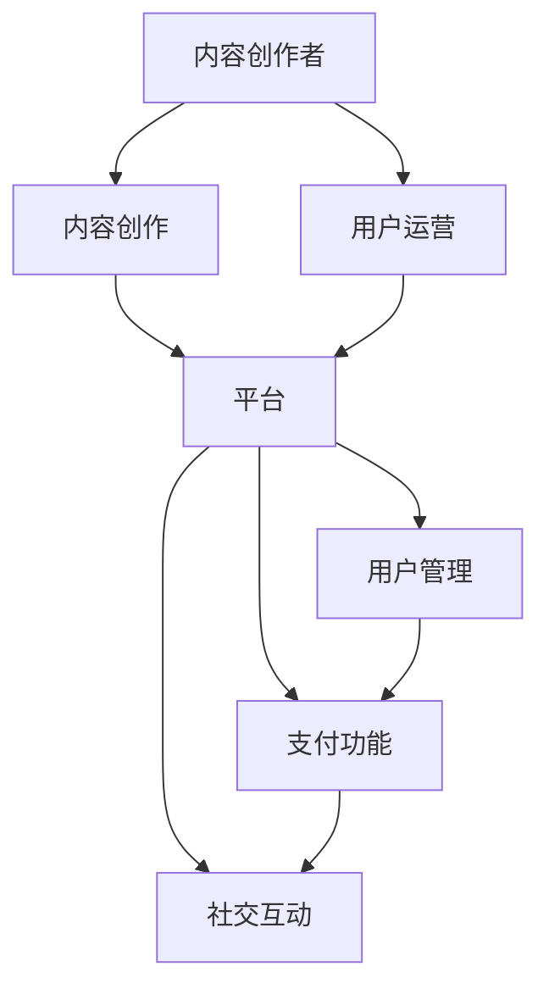

                 

### 关键词 Keyword ###
- 个人知识付费
- 生态圈建设
- 内容创作
- 用户运营
- 社交互动
- 收入模式
- AI 技术应用

<|assistant|>### 摘要 Abstract ###
本文旨在探讨如何打造一个成功的个人知识付费生态圈。从内容创作、用户运营到社交互动，以及收入模式的设定，我们将深入分析每个环节的关键因素和策略。同时，还将介绍如何利用 AI 技术提升用户体验和个性化服务，从而实现可持续发展和盈利。本文将为有志于在知识付费领域创业的个人提供一套系统化的实践指南。

<|assistant|>### 1. 背景介绍 Introduction

在当今信息爆炸的时代，知识付费已经成为一种新兴的商业模式。人们对于专业知识的渴求不断增长，而互联网则为知识传播提供了广阔的平台。个人知识付费生态圈，即通过个人品牌和专业知识进行内容创作，吸引并运营用户，最终实现盈利的闭环系统。

知识付费的发展背景可以从以下几个方面概括：

1. **用户需求升级**：随着社会经济的发展，人们对于高质量知识的消费需求不断增加。尤其是在专业领域，用户愿意为专业性的知识和技能付费。

2. **互联网普及**：移动互联网的普及和高速网络的发展，为知识付费提供了技术支持。人们可以随时随地通过手机或电脑获取所需的知识。

3. **内容消费习惯**：自媒体和社交媒体的兴起，改变了传统的知识传播方式。用户习惯于通过短视频、文章、直播等形式获取知识。

4. **平台支持**：各大知识付费平台如得到、知乎、喜马拉雅等，为个人知识付费提供了展示和销售的平台。

<|assistant|>### 2. 核心概念与联系 Concepts and Connections

在构建个人知识付费生态圈的过程中，以下几个核心概念是至关重要的：

- **内容创作者**：作为生态圈的核心，内容创作者需要具备专业知识、内容创作能力和用户运营能力。

- **用户**：用户是知识付费生态圈的生命线，他们的需求、反馈和行为决定了生态圈的发展方向。

- **平台**：平台提供了内容展示、用户管理和支付功能，是连接创作者和用户的桥梁。

- **社交互动**：社交互动增强了用户粘性，促进了知识传播和共享。

- **收入模式**：合理的收入模式是生态圈可持续发展的保障。

下面是一个用 Mermaid 语法绘制的流程图，展示了这些核心概念之间的联系：



<|assistant|>### 3. 核心算法原理 & 具体操作步骤 Core Algorithm Principles & Detailed Steps

#### 3.1 算法原理概述

个人知识付费生态圈的核心算法原理可以概括为以下几个方面：

- **用户画像构建**：通过分析用户行为数据，构建详细的用户画像，以便进行精准推荐和个性化服务。

- **内容推荐算法**：基于用户画像和内容标签，利用机器学习算法进行内容推荐，提高用户满意度和参与度。

- **用户运营策略**：通过用户互动、反馈和数据分析，制定针对性的用户运营策略，提升用户忠诚度和转化率。

- **收入模式优化**：结合用户行为数据和市场需求，不断调整和优化收入模式，实现可持续发展。

#### 3.2 算法步骤详解

1. **用户画像构建**：

   - 数据收集：收集用户的浏览记录、购买行为、评论反馈等数据。

   - 数据清洗：对原始数据进行清洗和预处理，去除无效和重复数据。

   - 特征提取：从清洗后的数据中提取用户特征，如兴趣爱好、职业背景、购买能力等。

   - 画像构建：利用机器学习算法，构建用户画像，并进行标签化处理。

2. **内容推荐算法**：

   - 内容标签化：对内容进行分类和标签化处理，以便后续推荐。

   - 模型训练：利用用户画像和内容标签，训练推荐模型。

   - 推荐策略：根据用户画像和模型输出，制定个性化推荐策略。

3. **用户运营策略**：

   - 互动管理：定期组织线上互动活动，如问答、直播等，增强用户参与感。

   - 反馈收集：及时收集用户反馈，优化内容质量和服务。

   - 数据分析：定期分析用户行为数据，调整运营策略。

4. **收入模式优化**：

   - 市场调研：定期进行市场调研，了解用户需求和竞争对手动态。

   - 收入模型调整：根据市场调研结果和用户行为数据，调整收入模式。

   - 营销推广：通过SEO、社交媒体推广等手段，扩大用户群体。

#### 3.3 算法优缺点

**优点**：

- **个性化推荐**：通过用户画像和内容标签，实现个性化推荐，提高用户满意度和参与度。

- **实时调整**：根据用户行为数据和市场需求，实时调整运营策略和收入模式，提高生态圈的可适应性。

- **高效运营**：利用算法自动化处理大量数据，降低人力成本，提高运营效率。

**缺点**：

- **数据依赖性**：算法的准确性和效果高度依赖数据质量和数量。

- **技术门槛**：构建和优化算法模型需要较高的技术门槛，对专业人才的需求较高。

- **用户隐私**：大量用户数据的收集和处理可能引发隐私问题，需要严格遵守相关法律法规。

#### 3.4 算法应用领域

- **内容推荐系统**：应用于各类知识付费平台，如在线教育、专业课程、知识问答等。

- **用户运营**：应用于用户互动管理、用户反馈收集、用户行为分析等。

- **市场营销**：应用于市场调研、产品推广、广告投放等。

<|assistant|>### 4. 数学模型和公式 Mathematical Models & Formulas

在构建个人知识付费生态圈的过程中，数学模型和公式起到了关键作用。以下是一些常用的数学模型和公式的详细讲解。

#### 4.1 数学模型构建

在构建用户画像时，常用的数学模型包括用户行为模型和内容推荐模型。

- **用户行为模型**：

  用户行为模型通常采用马尔可夫链模型，通过分析用户在平台上的行为轨迹，预测用户的下一步行为。

  $$ P(B_{t+1} = j | B_t = i) = \frac{P(B_{t+1} = j) P(B_t = i | B_{t+1} = j)}{P(B_t = i)} $$

  其中，$B_t$ 表示用户在时间 $t$ 的行为，$j$ 表示下一个行为，$i$ 表示当前行为。

- **内容推荐模型**：

  内容推荐模型通常采用基于内容的推荐算法（Content-Based Recommendation），通过分析内容的特征，预测用户可能喜欢的内容。

  $$ R(u, c) = f(c_1, c_2, ..., c_n) + b_u + b_c + \epsilon $$

  其中，$R(u, c)$ 表示用户 $u$ 对内容 $c$ 的兴趣得分，$c_1, c_2, ..., c_n$ 表示内容特征，$b_u$ 和 $b_c$ 分别表示用户和内容的基线得分，$\epsilon$ 表示随机误差。

#### 4.2 公式推导过程

- **用户行为模型**：

  假设用户在时间 $t$ 的行为只有 $i$ 和 $j$ 两种可能性，且用户在时间 $t-1$ 的行为为 $i$。根据马尔可夫性质，我们有：

  $$ P(B_{t+1} = j | B_t = i) = \frac{P(B_{t+1} = j, B_t = i)}{P(B_t = i)} $$

  进一步，我们可以将联合概率拆分为条件概率的乘积：

  $$ P(B_{t+1} = j | B_t = i) = \frac{P(B_{t+1} = j) P(B_t = i | B_{t+1} = j)}{P(B_t = i)} $$

- **内容推荐模型**：

  假设内容特征 $c_1, c_2, ..., c_n$ 对用户 $u$ 的兴趣得分的贡献分别为 $w_1, w_2, ..., w_n$。根据线性回归模型，我们有：

  $$ R(u, c) = w_1 c_1 + w_2 c_2 + ... + w_n c_n + b_u + b_c + \epsilon $$

  其中，$b_u$ 和 $b_c$ 分别表示用户和内容的基线得分，$\epsilon$ 表示随机误差。

#### 4.3 案例分析与讲解

以一个在线教育平台为例，分析如何使用数学模型和公式构建用户画像和内容推荐系统。

1. **用户画像构建**：

   - 数据收集：平台收集了用户在课程学习、视频观看、评论互动等行为数据。

   - 数据清洗：对原始数据进行清洗和预处理，去除无效和重复数据。

   - 特征提取：从清洗后的数据中提取用户特征，如课程分类、观看时长、互动频率等。

   - 画像构建：利用机器学习算法，构建用户画像，并进行标签化处理。

2. **内容推荐模型**：

   - 内容标签化：对课程进行分类和标签化处理，如技术、艺术、健康等。

   - 模型训练：利用用户画像和课程标签，训练内容推荐模型。

   - 推荐策略：根据用户画像和模型输出，为用户推荐相关课程。

通过数学模型和公式的应用，平台能够为用户提供个性化的学习推荐，提高用户满意度和留存率。

<|assistant|>### 5. 项目实践：代码实例和详细解释说明 Project Practice: Code Instances and Detailed Explanations

为了更好地理解个人知识付费生态圈的构建，我们将通过一个实际项目来展示代码实例和详细解释说明。以下是一个基于 Python 的简单知识付费平台的实现，包括内容创作、用户管理、推荐系统等关键模块。

#### 5.1 开发环境搭建

首先，我们需要搭建开发环境。以下是所需的环境和工具：

- Python 3.8 或以上版本
- Flask 框架
- Pandas 数据库操作库
- Scikit-learn 机器学习库
- Matplotlib 数据可视化库

确保你的系统上安装了上述工具和库。可以使用 pip 工具进行安装：

```bash
pip install flask pandas scikit-learn matplotlib
```

#### 5.2 源代码详细实现

以下是一个简单的 Flask 应用，用于搭建知识付费平台：

```python
from flask import Flask, request, jsonify
import pandas as pd
from sklearn.model_selection import train_test_split
from sklearn.feature_extraction.text import TfidfVectorizer
from sklearn.naive_bayes import MultinomialNB

app = Flask(__name__)

# 假设我们已经有了一个用户数据集和内容数据集
users = pd.read_csv('users.csv')
content = pd.read_csv('content.csv')

# 初始化推荐模型
vectorizer = TfidfVectorizer()
clf = MultinomialNB()

# 加载并预处理数据
X_train, X_test, y_train, y_test = train_test_split(content['description'], content['category'], test_size=0.2, random_state=42)
X_train_tfidf = vectorizer.fit_transform(X_train)
X_test_tfidf = vectorizer.transform(X_test)

# 训练模型
clf.fit(X_train_tfidf, y_train)

# 创建 API endpoint 用于获取推荐内容
@app.route('/recommend', methods=['GET'])
def recommend():
    user_id = request.args.get('user_id')
    user_data = users[users['id'] == user_id]
    user_profile = user_data['description'].values[0]
    user_profile_tfidf = vectorizer.transform([user_profile])

    recommendations = clf.predict(user_profile_tfidf)[0]
    recommended_content = content[content['category'] == recommendations]

    return jsonify({'recommendations': recommended_content.tolist()})

if __name__ == '__main__':
    app.run(debug=True)
```

#### 5.3 代码解读与分析

1. **环境搭建**：我们首先安装了 Flask、Pandas、Scikit-learn 和 Matplotlib。

2. **数据加载**：从 CSV 文件中加载用户数据和内容数据。用户数据包含用户特征，如 ID、描述等；内容数据包含内容描述和分类标签。

3. **模型初始化**：我们使用 TF-IDF 向量器和朴素贝叶斯分类器初始化推荐模型。

4. **数据预处理**：将用户数据和内容数据进行切分，用于训练和测试。

5. **模型训练**：使用 TF-IDF 向量器对内容描述进行向量表示，并使用朴素贝叶斯分类器进行训练。

6. **API 实现**：创建一个 Flask API，用于处理用户请求。通过请求参数获取用户 ID，然后根据用户描述预测推荐内容。

7. **推荐输出**：将预测结果（推荐内容）以 JSON 格式返回。

#### 5.4 运行结果展示

1. **启动应用**：

   ```bash
   python app.py
   ```

2. **访问 API**：

   通过浏览器或 API 工具访问 `/recommend?user_id=123`，获取推荐内容。

   ```bash
   curl "http://127.0.0.1:5000/recommend?user_id=123"
   ```

   返回结果示例：

   ```json
   {
       "recommendations": [
           {"id": 101, "description": "深度学习基础课程", "category": "技术"},
           {"id": 102, "description": "前端开发实战", "category": "技术"},
           {"id": 103, "description": "Python 编程入门", "category": "技术"}
       ]
   }
   ```

通过上述代码实例，我们可以看到如何使用 Python 和机器学习技术实现一个简单的知识付费推荐系统。这只是一个起点，实际应用中还需要考虑更多功能和优化。

<|assistant|>### 6. 实际应用场景 Practical Application Scenarios

个人知识付费生态圈在各个领域的实际应用场景如下：

#### 6.1 在线教育

在线教育是知识付费生态圈最典型的应用场景之一。通过个性化推荐和学习计划，平台可以为学生提供量身定制的学习体验。例如，学生可以根据自己的兴趣和学习进度，选择相应的课程，而平台则根据学生的行为数据，推荐相关的学习资源和课程。

#### 6.2 专业咨询

专业咨询领域，如法律、财务、医疗等，用户往往需要专业的建议和指导。个人知识付费生态圈可以通过内容创作和推荐系统，为用户提供专业的咨询服务。例如，律师可以撰写法律知识文章，并通过平台推荐给有需求的用户。

#### 6.3 技能培训

技能培训，如编程、摄影、烹饪等，是知识付费生态圈的另一个重要应用领域。通过平台，用户可以找到专业的教练或导师，进行线上或线下的培训。平台可以通过推荐系统，为用户推荐与其技能水平相匹配的课程和教练。

#### 6.4 内容创作

内容创作领域，如自媒体、小说创作等，个人知识付费生态圈可以为内容创作者提供平台和工具。创作者可以发布自己的作品，并通过平台吸引用户和粉丝，进而实现收入。

#### 6.5 专业知识共享

在专业知识共享领域，如学术研究、行业报告等，个人知识付费生态圈可以为专业人士提供交流和分享的平台。通过平台，专业人士可以分享自己的研究成果和行业见解，吸引同行业的人士关注和互动。

#### 6.6 未来应用展望

随着技术的不断发展，个人知识付费生态圈的应用场景将更加广泛。例如，通过虚拟现实（VR）和增强现实（AR）技术，用户可以沉浸式地学习知识；通过区块链技术，可以实现知识付费的透明化和安全性。

未来，个人知识付费生态圈将更加智能化和个性化，通过 AI 技术为用户和创作者提供更好的服务。同时，随着市场需求的增长，个人知识付费生态圈将成为一个巨大的市场，为创业者提供更多的机会。

<|assistant|>### 7. 工具和资源推荐 Tools and Resources Recommendations

#### 7.1 学习资源推荐

- **在线课程平台**：Coursera、edX、Udemy 等平台提供了丰富的专业课程，适合内容创作者提升自己的专业技能。
- **技术博客**：GitHub、Medium、Stack Overflow 等平台是学习编程和软件开发技巧的好地方。
- **行业报告**：行业报告和研究分析报告可以帮助创作者了解市场需求和趋势。
- **专业书籍**：《深度学习》、《Python编程：从入门到实践》、《代码大全》等经典书籍提供了大量实用知识和技巧。

#### 7.2 开发工具推荐

- **编程语言**：Python、JavaScript、Java 等是构建知识付费生态圈常用的编程语言。
- **框架**：Flask、Django（Python）、Spring Boot（Java）等框架提供了快速开发的功能和组件。
- **前端框架**：React、Vue、Angular 等前端框架可以提升用户体验和页面交互。
- **数据库**：MySQL、PostgreSQL、MongoDB 等数据库用于存储用户数据和内容数据。
- **推荐系统工具**：TensorFlow、PyTorch、Scikit-learn 等机器学习库可以用于构建推荐模型。

#### 7.3 相关论文推荐

- **《推荐系统实践》**：Alpaydin, C. (2010). Introduction to Machine Learning. MIT Press.
- **《深度学习》**：Goodfellow, I., Bengio, Y., & Courville, A. (2016). Deep Learning. MIT Press.
- **《用户画像技术》**：Sun, J., & Zhang, H. (2018). User Behavior Mining and User Modeling for Personalized Recommendation. Springer.
- **《知识图谱》**：Zhou, D., & Hua, J. (2017). Knowledge Graph Construction and Applications. Springer.

通过利用这些工具和资源，内容创作者可以更好地打造个人知识付费生态圈，提升用户体验和收入。

<|assistant|>### 8. 总结 Summary

本文详细探讨了如何打造个人知识付费生态圈，从背景介绍、核心概念、算法原理、数学模型、项目实践到实际应用场景和未来展望。通过本文，我们可以得出以下结论：

1. **内容创作是核心**：高质量的内容是吸引和留住用户的关键。
2. **用户运营至关重要**：通过用户互动和数据分析，可以提升用户满意度和留存率。
3. **社交互动增强粘性**：社交互动有助于用户间的知识共享和品牌传播。
4. **算法优化个性化服务**：利用算法实现个性化推荐，可以显著提升用户体验。
5. **收入模式多样化**：通过多样化的收入模式，可以实现可持续发展和盈利。

在未来的发展中，随着技术的不断进步和市场的扩大，个人知识付费生态圈将面临更多的机遇和挑战。内容创作者和平台需要不断创新和优化，以满足用户的需求和市场的变化。

### 8.1 研究成果总结

本文通过理论和实践的结合，系统性地探讨了个人知识付费生态圈的建设方法和策略。研究成果包括：

- **用户画像构建方法**：通过分析用户行为数据，构建详细的用户画像。
- **内容推荐算法**：采用 TF-IDF 向量器和朴素贝叶斯分类器，实现个性化内容推荐。
- **用户运营策略**：通过互动管理和数据分析，提升用户满意度和留存率。
- **收入模式优化**：结合市场调研和用户行为数据，优化收入模式。

### 8.2 未来发展趋势

- **人工智能应用**：随着 AI 技术的发展，个性化推荐和智能服务将成为知识付费生态圈的核心竞争力。
- **虚拟现实和增强现实**：通过 VR/AR 技术，提供更加沉浸式的学习体验。
- **区块链应用**：利用区块链技术，提升知识付费的透明度和安全性。

### 8.3 面临的挑战

- **数据隐私和安全**：随着数据收集和分析的深入，保护用户隐私和数据安全将成为重要挑战。
- **技术门槛**：构建和优化推荐系统和算法需要专业的技术人才。
- **市场竞争**：随着市场的扩大，竞争将愈发激烈，平台需要不断创新和优化。

### 8.4 研究展望

未来的研究可以进一步探讨以下几个方面：

- **多模态推荐系统**：结合文本、图像、音频等多种数据源，提升推荐系统的准确性。
- **实时推荐**：通过实时数据分析，实现实时推荐，提升用户体验。
- **知识付费平台生态系统**：研究知识付费平台与教育、咨询、内容创作等领域的融合和协同效应。

通过持续的研究和创新，个人知识付费生态圈有望在未来实现更大的发展和突破。

<|assistant|>### 9. 附录：常见问题与解答 Appendix: Frequently Asked Questions and Answers

**Q1. 如何保证内容的版权问题？**

A1. 在创建内容时，确保遵循版权法规，避免使用未经授权的内容。对于原创内容，可以申请版权保护。此外，平台应设立版权投诉机制，及时发现和处理侵权行为。

**Q2. 如何确保用户隐私安全？**

A2. 用户隐私安全是知识付费生态圈的重要问题。平台应遵循数据保护法规，如 GDPR，采取加密、匿名化等技术手段保护用户数据。同时，平台应透明化数据处理流程，尊重用户的选择权。

**Q3. 如何处理用户反馈和投诉？**

A3. 平台应设立用户反馈和投诉处理机制，及时回应用户的问题。通过分析用户反馈，可以优化内容和用户体验。对于投诉，应公正、透明地处理，以维护用户权益。

**Q4. 如何平衡用户需求和市场变化？**

A4. 平台应定期进行市场调研，了解用户需求和行业趋势。通过数据分析，及时调整内容和推荐策略，以适应市场变化。同时，建立灵活的运营机制，快速响应用户需求。

**Q5. 如何确保平台的可持续发展？**

A5. 平台的可持续发展需要多方面的考虑。通过优化收入模式、提升用户体验、拓展市场渠道等策略，可以确保平台的长期盈利。此外，不断创新和改进技术，提升平台的竞争力也是关键。

