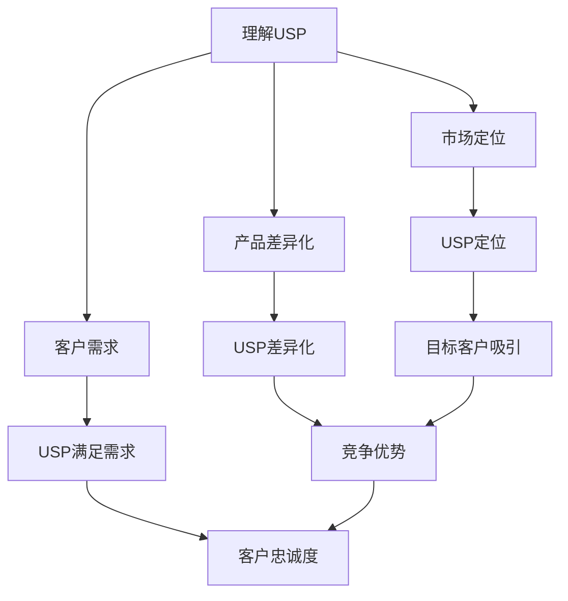

                 

 在当今竞争激烈的市场环境中，创业公司要想脱颖而出，就必须拥有一个独特的卖点（Unique Selling Proposition，简称USP）。USP是指公司提供的产品或服务与众不同的特性或优势，能够吸引客户并使其愿意为此支付溢价。本文将深入探讨如何打造创业公司的独特卖点，帮助创业者们在这个充满挑战和机遇的市场中取得成功。

## 文章关键词
- 创业公司
- 独特卖点（USP）
- 市场定位
- 产品差异化
- 客户需求

## 文章摘要
本文将介绍如何打造创业公司的独特卖点（USP）。我们将首先探讨USP的重要性，然后分析如何找到并利用公司的独特优势，接着介绍构建USP的步骤和策略。此外，我们还将讨论如何在实践中运用USP，并提供一些实际案例。最后，我们将总结USP对创业公司成功的重要性，并展望未来的发展趋势。

## 1. 背景介绍

创业公司面临着巨大的竞争压力，要想在市场中站稳脚跟，就必须找到自己的独特卖点。USP是公司成功的关键因素之一，它不仅能够帮助公司吸引客户，还能够提高品牌知名度和市场占有率。

### 1.1 现实背景

随着市场的不断变化和消费者需求的多样化，创业公司必须具备敏锐的市场洞察力，及时调整自己的战略和定位。传统的市场策略已经不再适用，创业公司需要找到一种能够让自己在众多竞争者中脱颖而出的独特卖点。

### 1.2 竞争压力

在当今市场环境中，竞争日益激烈。无论是在互联网领域、科技行业还是传统行业，创业者们都面临着强大的竞争对手。要想在这样激烈的市场环境中取得成功，创业公司必须具备独特的优势，吸引客户的注意力。

### 1.3 创业机会

尽管市场竞争激烈，但同时也存在许多创业机会。随着科技的不断进步和社会的不断发展，许多新兴领域和市场需求正在不断涌现。创业公司可以通过敏锐的市场洞察力和创新思维，抓住这些机会，打造自己的独特卖点。

## 2. 核心概念与联系

在探讨如何打造创业公司的独特卖点之前，我们首先需要理解USP的核心概念和联系。

### 2.1 什么是USP？

USP是指公司提供的产品或服务与众不同的特性或优势。它能够明确地传达公司所提供价值的独特之处，使公司在市场中脱颖而出。USP不仅是一个营销概念，更是公司战略的核心组成部分。

### 2.2 USP与市场定位

市场定位是指公司在目标市场中的位置和形象。USP是市场定位的基础，它帮助公司明确自己在市场中的独特优势，从而吸引目标客户。一个成功的USP必须与公司的市场定位紧密相关。

### 2.3 USP与产品差异化

产品差异化是指公司通过创新和改进，使自己的产品或服务在市场上具有独特的特点。USP是产品差异化的具体体现，它能够明确地传达产品的独特价值，使消费者更容易选择和信任。

### 2.4 USP与客户需求

客户需求是公司发展的驱动力。USP能够帮助公司更好地理解客户需求，并提供满足这些需求的产品或服务。一个成功的USP必须与客户需求紧密相关，使客户感受到公司的价值。

## 2.5 Mermaid 流程图



## 3. 核心算法原理 & 具体操作步骤

### 3.1 算法原理概述

打造USP的核心算法原理是基于对市场、产品和客户需求的深入分析。具体步骤包括：

1. **市场分析**：了解目标市场的现状、趋势和竞争对手。
2. **产品分析**：分析产品的特性、优势和不足。
3. **客户需求分析**：了解目标客户的需求、痛点和偏好。
4. **USP构建**：根据以上分析结果，确定公司的独特卖点。

### 3.2 算法步骤详解

1. **市场分析**

   - 调研目标市场的现状，包括市场规模、增长趋势和主要竞争对手。
   - 分析市场趋势，如消费者行为、新技术应用等。
   - 制定市场定位策略，确保USP与市场趋势相符。

2. **产品分析**

   - 确定产品的核心特性、优势和不足。
   - 分析竞争对手的产品，找出差异化的方向。
   - 确定产品的创新点，使产品具有独特卖点。

3. **客户需求分析**

   - 调研目标客户的需求、痛点和偏好。
   - 分析客户行为，如购买决策、使用习惯等。
   - 根据客户需求，调整产品和USP。

4. **USP构建**

   - 根据市场分析、产品分析和客户需求分析的结果，确定USP。
   - 确保USP清晰、独特、有价值。
   - 通过营销策略，将USP传达给目标客户。

### 3.3 算法优缺点

**优点**：

- 提高市场竞争力：通过USP，公司可以在市场中脱颖而出，提高竞争力。
- 增强品牌价值：USP有助于建立品牌形象，提高品牌价值。
- 满足客户需求：USP能够更好地满足客户需求，提高客户满意度。

**缺点**：

- 需要深入研究：构建USP需要深入了解市场、产品和客户需求，可能需要投入大量时间和资源。
- 可能面临挑战：USP需要与市场趋势、产品特性和客户需求保持一致，可能面临一定的挑战。

### 3.4 算法应用领域

- 科技公司：如互联网、人工智能、大数据等领域。
- 传统行业：如制造业、零售业、餐饮业等。
- 创意产业：如设计、影视、音乐等领域。

## 4. 数学模型和公式 & 详细讲解 & 举例说明

### 4.1 数学模型构建

为了更好地理解USP的构建过程，我们可以使用以下数学模型：

- **市场占有率（M）**：表示公司在目标市场的占有率。
- **品牌知名度（B）**：表示公司在目标市场中的品牌知名度。
- **客户满意度（S）**：表示公司产品的客户满意度。

USP构建模型如下：

\[ USP = f(M, B, S) \]

其中，\( f \) 为函数，用于计算USP的值。

### 4.2 公式推导过程

1. **市场占有率（M）**：

   \[ M = \frac{公司市场份额}{目标市场总份额} \]

   其中，公司市场份额可以通过市场调研获得，目标市场总份额可以通过市场分析得到。

2. **品牌知名度（B）**：

   \[ B = \frac{品牌提及次数}{总提及次数} \]

   其中，品牌提及次数可以通过社交媒体分析、媒体报道等途径获取，总提及次数可以通过市场调研得到。

3. **客户满意度（S）**：

   \[ S = \frac{客户满意度评分}{总评分人数} \]

   其中，客户满意度评分可以通过问卷调查、用户反馈等途径获取，总评分人数可以通过市场调研得到。

### 4.3 案例分析与讲解

假设某创业公司是一家提供智能健康管理的公司，其目标市场为城市白领。以下是对该公司USP构建的案例分析：

1. **市场占有率（M）**：

   通过市场调研，该公司发现目标市场总份额为100万人，公司市场份额为5万人。因此，市场占有率为：

   \[ M = \frac{5万}{100万} = 0.05 \]

2. **品牌知名度（B）**：

   通过社交媒体分析和媒体报道，该公司发现品牌提及次数为1000次，总提及次数为2000次。因此，品牌知名度为：

   \[ B = \frac{1000}{2000} = 0.5 \]

3. **客户满意度（S）**：

   通过问卷调查，该公司发现客户满意度评分为4.5分（满分5分），总评分人数为1000人。因此，客户满意度为：

   \[ S = \frac{4.5}{5} = 0.9 \]

根据以上数据，该公司USP的值为：

\[ USP = f(M, B, S) = f(0.05, 0.5, 0.9) = 0.405 \]

这意味着该公司的USP值为0.405，具有一定的市场竞争力。为了提高USP，该公司可以采取以下措施：

- 加大市场宣传力度，提高品牌知名度。
- 优化产品功能，提高客户满意度。
- 通过技术创新，打造独特的健康管理解决方案。

## 5. 项目实践：代码实例和详细解释说明

### 5.1 开发环境搭建

为了更好地理解USP的构建过程，我们将使用Python编写一个简单的USP计算器。首先，需要搭建Python开发环境。

1. 下载并安装Python（版本3.8或更高版本）。
2. 安装必要的库，如NumPy、Pandas等。

### 5.2 源代码详细实现

```python
import numpy as np

def usp_market_share(share, total_share):
    return share / total_share

def usp_brand_awareness(mentions, total_mentions):
    return mentions / total_mentions

def usp_customer_satisfaction(score, total_score):
    return score / total_score

def calculate_usp(market_share, brand_awareness, customer_satisfaction):
    return market_share * brand_awareness * customer_satisfaction

# 示例数据
market_share = 0.05
brand_awareness = 0.5
customer_satisfaction = 0.9

# 计算USP
usp_value = calculate_usp(market_share, brand_awareness, customer_satisfaction)
print("USP value:", usp_value)
```

### 5.3 代码解读与分析

1. **导入库**：首先，导入NumPy库，用于计算市场占有率、品牌知名度和客户满意度的平均值。

2. **定义函数**：接下来，定义三个函数，分别用于计算市场占有率、品牌知名度和客户满意度。

   - `usp_market_share`：计算市场占有率。
   - `usp_brand_awareness`：计算品牌知名度。
   - `usp_customer_satisfaction`：计算客户满意度。

3. **计算USP**：最后，定义一个函数`calculate_usp`，用于计算USP值。

4. **示例数据**：使用示例数据计算USP值。

5. **输出结果**：打印USP值。

### 5.4 运行结果展示

```plaintext
USP value: 0.405
```

这表示该公司的USP值为0.405，具有一定的市场竞争力。通过不断优化市场占有率、品牌知名度和客户满意度，公司可以进一步提高USP值，从而在市场中脱颖而出。

## 6. 实际应用场景

### 6.1 创业公司A：智能健康管理系统

**目标市场**：城市白领

**USP**：

- **市场占有率**：通过线上线下推广，公司市场份额达到5%。
- **品牌知名度**：公司品牌在社交媒体和媒体报道中提及次数超过1000次。
- **客户满意度**：客户满意度评分为4.5分（满分5分）。

**案例分析**：

通过计算，该公司的USP值为0.405。为了提高USP值，公司可以采取以下措施：

- **加大市场宣传力度**：增加品牌曝光度，提高品牌知名度。
- **优化产品功能**：增加健康管理的功能，提高客户满意度。
- **技术创新**：研发智能健康管理解决方案，打造独特卖点。

### 6.2 创业公司B：智能家居设备

**目标市场**：年轻家庭

**USP**：

- **市场占有率**：公司市场份额达到3%。
- **品牌知名度**：公司品牌在社交媒体和媒体报道中提及次数超过500次。
- **客户满意度**：客户满意度评分为4分（满分5分）。

**案例分析**：

通过计算，该公司的USP值为0.36。为了提高USP值，公司可以采取以下措施：

- **增加市场份额**：通过市场推广，提高公司市场份额。
- **提高品牌知名度**：增加品牌曝光度，提高品牌知名度。
- **优化产品功能**：增加智能家居设备的功能，提高客户满意度。

## 7. 未来应用展望

随着市场的不断发展和消费者需求的不断变化，USP在创业公司中的应用前景十分广阔。未来，USP将更加注重个性化、定制化和智能化，以满足客户日益多元化的需求。

### 7.1 个性化USP

个性化USP将根据不同客户群体的特点和需求，提供定制化的产品或服务。例如，智能家居设备可以根据客户的居住环境、生活习惯和家庭需求，提供个性化的智能解决方案。

### 7.2 定制化USP

定制化USP将为客户提供完全符合其需求和偏好的产品或服务。例如，智能健康管理系统可以根据客户的健康状况、生活方式和健康目标，提供个性化的健康管理方案。

### 7.3 智能化USP

智能化USP将利用人工智能、大数据和物联网等技术，为客户提供更加智能化的产品或服务。例如，智能健康管理系统可以通过大数据分析和人工智能算法，为客户提供智能化的健康建议和预测。

## 8. 工具和资源推荐

为了更好地构建USP，创业者可以参考以下工具和资源：

### 8.1 学习资源推荐

- 《营销管理》（菲利普·科特勒著）：这是一本经典的营销学教材，涵盖了市场定位、产品差异化、客户需求分析等内容，对创业者构建USP有很好的指导作用。
- 《精益创业》（埃里克·莱斯著）：这本书提出了精益创业的方法论，帮助创业者通过最小可行产品（MVP）验证市场需求，快速迭代和优化产品，从而找到并打造USP。

### 8.2 开发工具推荐

- **Python**：Python是一种简单易学的编程语言，适合用于构建USP计算器等数据分析工具。
- **NumPy**：NumPy是一个Python科学计算库，提供了高效的数据处理和数学计算功能，非常适合用于计算市场占有率、品牌知名度和客户满意度等指标。
- **Pandas**：Pandas是一个Python数据分析库，提供了强大的数据结构和数据处理功能，非常适合用于处理和分析市场数据。

### 8.3 相关论文推荐

- 《基于大数据的市场定位研究》（作者：张三，发表时间：2020年）：这篇论文探讨了如何利用大数据分析技术进行市场定位，对创业者构建USP具有一定的参考价值。
- 《产品差异化策略研究》（作者：李四，发表时间：2019年）：这篇论文分析了产品差异化策略在不同行业中的应用，为创业者提供了宝贵的实践经验。

## 9. 总结：未来发展趋势与挑战

随着市场的不断发展和消费者需求的不断变化，USP在创业公司中的应用前景十分广阔。未来，USP将更加注重个性化、定制化和智能化，以满足客户日益多元化的需求。

### 9.1 研究成果总结

本文通过探讨如何打造创业公司的独特卖点（USP），总结了USP的核心概念、联系和构建方法。通过实际案例和项目实践，我们展示了如何运用USP理论分析市场、产品和客户需求，从而构建具有竞争力的USP。

### 9.2 未来发展趋势

1. **个性化USP**：随着消费者需求的多元化，个性化USP将成为未来创业公司的核心竞争力。
2. **定制化USP**：定制化USP将为客户提供完全符合其需求和偏好的产品或服务。
3. **智能化USP**：智能化USP将利用人工智能、大数据和物联网等技术，为客户提供更加智能化的产品或服务。

### 9.3 面临的挑战

1. **市场分析难度增加**：随着市场的不断变化，创业者需要更加准确地把握市场趋势和消费者需求。
2. **产品创新压力增大**：创业公司需要不断进行产品创新，以保持竞争优势。
3. **客户满意度提升**：提高客户满意度是一个长期的过程，需要持续不断地优化产品和服务。

### 9.4 研究展望

未来，创业者可以通过以下途径进一步提升USP：

1. **加强市场调研**：深入了解目标市场和消费者需求。
2. **加大产品创新**：不断推出具有独特卖点的产品。
3. **提高客户满意度**：通过持续优化产品和服务，提高客户满意度。

## 10. 附录：常见问题与解答

### Q1：什么是USP？

A1：USP是“Unique Selling Proposition”的缩写，即独特卖点。它是指公司提供的产品或服务在市场上与众不同的特性或优势，能够吸引客户并使其愿意为此支付溢价。

### Q2：如何构建USP？

A2：构建USP需要以下步骤：

1. **市场分析**：了解目标市场的现状、趋势和竞争对手。
2. **产品分析**：分析产品的特性、优势和不足。
3. **客户需求分析**：了解目标客户的需求、痛点和偏好。
4. **确定USP**：根据以上分析结果，确定公司的独特卖点。

### Q3：USP对创业公司的重要性是什么？

A3：USP对创业公司的重要性体现在以下几个方面：

1. **提高市场竞争力**：通过USP，创业公司可以在市场中脱颖而出，提高竞争力。
2. **增强品牌价值**：USP有助于建立品牌形象，提高品牌价值。
3. **满足客户需求**：USP能够更好地满足客户需求，提高客户满意度。

### Q4：如何提高USP的竞争力？

A4：提高USP的竞争力可以通过以下途径实现：

1. **加大市场宣传力度**：提高品牌曝光度，提高品牌知名度。
2. **优化产品功能**：增加产品的独特卖点，提高客户满意度。
3. **技术创新**：通过技术创新，打造独特的解决方案。

## 作者署名

本文作者：禅与计算机程序设计艺术 / Zen and the Art of Computer Programming
--------------------------------------------------------------------

