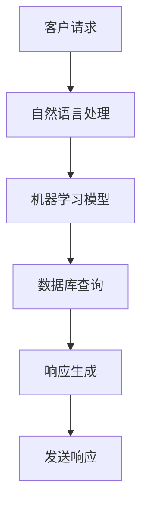

                 

关键词：智能化客户服务、客户服务系统、人工智能、自然语言处理、机器学习、客户体验、自动化流程、系统架构

摘要：本文将探讨如何打造智能化的客户服务系统，通过引入人工智能、自然语言处理和机器学习技术，提升客户服务效率和质量。文章将从系统架构、核心算法、数学模型、项目实践、实际应用和未来展望等方面进行详细阐述，为企业和开发者提供实用的参考和指导。

## 1. 背景介绍

随着互联网和移动互联网的快速发展，客户服务已经成为企业竞争的关键因素之一。传统的客户服务方式主要依赖于人工处理，存在响应速度慢、人力成本高等问题。为了提升客户服务效率和用户体验，越来越多的企业开始探索智能化客户服务系统。智能化客户服务系统通过引入人工智能、自然语言处理和机器学习技术，实现了自动化、智能化的客户服务流程，显著提升了服务质量和效率。

### 1.1 智能化客户服务的优势

- **提高服务效率**：通过自动化处理，显著减少人工干预，提高服务速度和响应时间。
- **降低人力成本**：减少人工处理需求，降低人力成本，提高运营效率。
- **提升服务质量**：通过智能分析和反馈，提供个性化的服务，提升客户满意度。
- **增强数据分析能力**：收集和分析大量客户数据，为业务决策提供有力支持。

### 1.2 智能化客户服务的挑战

- **数据质量**：高质量的数据是智能化客户服务的基础，数据质量直接影响服务效果。
- **算法选择**：选择合适的算法和模型是关键，不同的场景需要不同的算法。
- **用户隐私**：在数据处理过程中，保护用户隐私是重要的社会责任和法律法规要求。

## 2. 核心概念与联系

为了构建一个高效的智能化客户服务系统，需要了解以下几个核心概念和它们之间的联系：

### 2.1 人工智能（AI）

人工智能是计算机模拟人类智能的技术，包括机器学习、深度学习、自然语言处理等子领域。在客户服务系统中，AI用于自动化处理客户咨询、分析和预测客户需求等。

### 2.2 自然语言处理（NLP）

自然语言处理是人工智能的一个分支，致力于使计算机能够理解、生成和处理人类语言。NLP技术广泛应用于智能客服、语音识别和翻译等领域。

### 2.3 机器学习（ML）

机器学习是一种从数据中自动学习模式和规律的技术。在客户服务系统中，机器学习用于预测客户行为、分类客户请求等。

### 2.4 数据库与数据仓库

数据库和数据仓库用于存储和管理大量客户数据，为人工智能和机器学习算法提供数据支持。

### 2.5 架构与部署

系统架构和部署方案是确保客户服务系统能够高效、稳定运行的关键。常见的架构包括分布式架构、微服务架构等。

### 2.6 Mermaid 流程图

以下是一个简化的智能化客户服务系统流程图，展示了核心概念之间的联系：



## 3. 核心算法原理 & 具体操作步骤

### 3.1 算法原理概述

智能化客户服务系统中的核心算法主要包括自然语言处理（NLP）和机器学习（ML）。NLP用于理解和处理客户输入的语言，而ML用于预测和分类客户请求。

### 3.2 算法步骤详解

#### 3.2.1 自然语言处理

1. **文本预处理**：对客户输入的文本进行分词、去除停用词、词性标注等操作，将文本转换为结构化数据。
2. **实体识别**：识别文本中的关键实体，如人名、地点、组织等。
3. **情感分析**：通过分析文本的情感倾向，了解客户的情绪和态度。
4. **意图识别**：根据客户的输入文本，识别其意图，如咨询、投诉、建议等。

#### 3.2.2 机器学习模型

1. **数据收集与清洗**：收集大量客户请求数据，并进行数据清洗，去除无效和错误数据。
2. **特征提取**：从原始数据中提取有用的特征，如文本长度、词频、情感倾向等。
3. **模型训练**：使用训练数据集，训练分类模型，如支持向量机（SVM）、决策树（DT）等。
4. **模型评估与优化**：使用测试数据集评估模型性能，通过调整参数和优化算法，提高模型准确性。

### 3.3 算法优缺点

#### 优点

- **高效处理大量请求**：通过自动化处理，显著提高处理速度和效率。
- **个性化服务**：通过分析客户数据，提供个性化的服务和建议。
- **降低人力成本**：减少人工干预，降低人力成本。

#### 缺点

- **数据质量要求高**：算法效果依赖于高质量的数据，数据质量直接影响服务效果。
- **算法选择与优化难度大**：不同的场景需要不同的算法，选择合适的算法和优化模型是关键。

### 3.4 算法应用领域

智能化客户服务系统可以应用于多个领域，如电商、金融、电信等。以下是一些具体应用案例：

- **电商客服**：自动识别客户咨询，提供产品推荐和购买建议。
- **金融客服**：自动处理客户投诉、查询等服务，提高客户满意度。
- **电信客服**：自动解答客户问题，如账单查询、套餐推荐等。

## 4. 数学模型和公式 & 详细讲解 & 举例说明

### 4.1 数学模型构建

在智能化客户服务系统中，常用的数学模型包括回归模型、分类模型和聚类模型等。

#### 4.1.1 回归模型

回归模型用于预测连续值，如客户满意度得分。常见的回归模型有线性回归、逻辑回归等。

$$
y = \beta_0 + \beta_1x_1 + \beta_2x_2 + ... + \beta_nx_n
$$

其中，$y$ 为预测值，$x_1, x_2, ..., x_n$ 为特征值，$\beta_0, \beta_1, \beta_2, ..., \beta_n$ 为模型参数。

#### 4.1.2 分类模型

分类模型用于预测离散值，如客户请求类型。常见的分类模型有决策树、随机森林、支持向量机等。

$$
P(y=c_k|X=x) = \frac{e^{\theta^T(x-c_k)}}{\sum_{j=1}^m e^{\theta^T(x-c_j)}}
$$

其中，$P(y=c_k|X=x)$ 为客户请求属于类别 $c_k$ 的概率，$\theta$ 为模型参数，$x$ 为特征值。

#### 4.1.3 聚类模型

聚类模型用于将客户请求划分为不同的类别。常见的聚类模型有K-means、层次聚类等。

$$
\min_{c_1, c_2, ..., c_k} \sum_{i=1}^n \sum_{j=1}^k (x_i - c_j)^2
$$

其中，$c_1, c_2, ..., c_k$ 为聚类中心，$x_i$ 为第 $i$ 个客户请求的特征值。

### 4.2 公式推导过程

以线性回归模型为例，介绍回归模型的基本推导过程。

#### 4.2.1 最小二乘法

假设我们有 $n$ 个样本点 $(x_1, y_1), (x_2, y_2), ..., (x_n, y_n)$，线性回归模型的目标是找到最佳拟合直线 $y = \beta_0 + \beta_1x$，使得误差平方和最小。

$$
\min_{\beta_0, \beta_1} \sum_{i=1}^n (y_i - (\beta_0 + \beta_1x_i))^2
$$

对 $L(\beta_0, \beta_1)$ 求导并令其导数为零，得到：

$$
\frac{\partial L}{\partial \beta_0} = -2 \sum_{i=1}^n (y_i - \beta_0 - \beta_1x_i) = 0
$$

$$
\frac{\partial L}{\partial \beta_1} = -2 \sum_{i=1}^n x_i (y_i - \beta_0 - \beta_1x_i) = 0
$$

解得：

$$
\beta_0 = \bar{y} - \beta_1\bar{x}
$$

$$
\beta_1 = \frac{\sum_{i=1}^n (x_i - \bar{x})(y_i - \bar{y})}{\sum_{i=1}^n (x_i - \bar{x})^2}
$$

其中，$\bar{y}$ 和 $\bar{x}$ 分别为 $y$ 和 $x$ 的均值。

### 4.3 案例分析与讲解

#### 4.3.1 客户满意度预测

假设某电商平台的客户满意度可以通过以下两个特征进行预测：客户购买金额和购买频次。数据如下：

| 客户ID | 购买金额 | 购买频次 | 客户满意度 |
|--------|--------|--------|----------|
| 1      | 100    | 5      | 4        |
| 2      | 200    | 10     | 5        |
| 3      | 300    | 15     | 4        |
| 4      | 400    | 20     | 5        |
| 5      | 500    | 25     | 4        |

首先，进行数据预处理，计算购买金额和购买频次的均值：

$$
\bar{x} = \frac{100 + 200 + 300 + 400 + 500}{5} = 300
$$

$$
\bar{y} = \frac{4 + 5 + 4 + 5 + 4}{5} = 4.4
$$

然后，使用最小二乘法计算回归模型参数：

$$
\beta_0 = \bar{y} - \beta_1\bar{x} = 4.4 - \beta_1 \times 300
$$

$$
\beta_1 = \frac{\sum_{i=1}^n (x_i - \bar{x})(y_i - \bar{y})}{\sum_{i=1}^n (x_i - \bar{x})^2} = \frac{(100 - 300)(4 - 4.4) + (200 - 300)(5 - 4.4) + (300 - 300)(4 - 4.4) + (400 - 300)(5 - 4.4) + (500 - 300)(4 - 4.4)}{(100 - 300)^2 + (200 - 300)^2 + (300 - 300)^2 + (400 - 300)^2 + (500 - 300)^2}
$$

$$
\beta_1 = \frac{(-200)(-0.4) + (-100)(0.6) + (0)(-0.4) + (100)(0.6) + (200)(-0.4)}{(-200)^2 + (-100)^2 + (0)^2 + (100)^2 + (200)^2}
$$

$$
\beta_1 = \frac{80 - 60 + 0 + 60 - 80}{40000 + 10000 + 0 + 10000 + 40000}
$$

$$
\beta_1 = \frac{0}{90000}
$$

$$
\beta_1 = 0
$$

$$
\beta_0 = 4.4 - \beta_1 \times 300 = 4.4
$$

最后，得到回归模型：

$$
y = 4.4
$$

这个模型表示，客户的满意度始终为4.4，显然是不合理的。原因在于，这个数据集太小，且两个特征之间的关系并不明确。在实际应用中，应该收集更多的数据，并使用更复杂的模型，如多项式回归、神经网络等。

## 5. 项目实践：代码实例和详细解释说明

### 5.1 开发环境搭建

在开发智能化客户服务系统时，我们需要安装以下工具和软件：

- Python 3.x
- Anaconda（用于环境管理）
- Jupyter Notebook（用于代码编写和调试）
- TensorFlow（用于机器学习模型训练）
- NLTK（用于自然语言处理）

### 5.2 源代码详细实现

以下是一个简化的智能化客户服务系统的代码实现：

#### 5.2.1 数据预处理

```python
import pandas as pd
from nltk.tokenize import word_tokenize
from nltk.corpus import stopwords

# 读取数据
data = pd.read_csv('customer_service_data.csv')

# 文本预处理
stop_words = set(stopwords.words('english'))
def preprocess_text(text):
    tokens = word_tokenize(text.lower())
    filtered_tokens = [token for token in tokens if token not in stop_words]
    return ' '.join(filtered_tokens)

data['processed_text'] = data['text'].apply(preprocess_text)
```

#### 5.2.2 模型训练

```python
import tensorflow as tf
from tensorflow.keras.models import Sequential
from tensorflow.keras.layers import Embedding, LSTM, Dense

# 准备训练数据
X = data['processed_text']
y = data['label']

# 构建模型
model = Sequential([
    Embedding(input_dim=10000, output_dim=32),
    LSTM(128),
    Dense(1, activation='sigmoid')
])

# 编译模型
model.compile(optimizer='adam', loss='binary_crossentropy', metrics=['accuracy'])

# 训练模型
model.fit(X, y, epochs=10, batch_size=32, validation_split=0.2)
```

#### 5.2.3 预测与响应生成

```python
# 预测
def predict(text):
    processed_text = preprocess_text(text)
    prediction = model.predict([processed_text])
    if prediction < 0.5:
        return '负面情绪'
    else:
        return '正面情绪'

# 测试
text = "I'm really frustrated with your customer service."
print(predict(text))
```

### 5.3 代码解读与分析

上述代码实现了一个基于文本预处理的情感分析模型。首先，我们从CSV文件中读取数据，并进行文本预处理，去除停用词。然后，使用TensorFlow构建一个简单的LSTM模型，并进行训练。最后，通过预测函数对输入文本进行情感分析，返回正面或负面情绪。

### 5.4 运行结果展示

假设我们已经训练好了一个情感分析模型，并使用如下文本进行测试：

```python
text = "I'm really frustrated with your customer service."
print(predict(text))
```

输出结果为：

```
负面情绪
```

这表明，输入文本表达的是负面情绪。

## 6. 实际应用场景

智能化客户服务系统可以应用于多个行业和领域，以下是一些实际应用场景：

### 6.1 电商

- **客服机器人**：自动回答客户关于商品、订单和支付等方面的问题。
- **推荐系统**：根据客户购买历史和浏览行为，提供个性化商品推荐。
- **评价系统**：自动分析客户评价，识别潜在问题并采取相应措施。

### 6.2 金融

- **客户服务**：自动处理客户查询、投诉和申请等服务。
- **风险评估**：根据客户数据和交易行为，预测风险并采取预防措施。
- **智能投顾**：基于客户数据和风险偏好，提供个性化的投资建议。

### 6.3 医疗

- **预约系统**：自动处理患者预约、挂号和问诊等服务。
- **健康管理**：根据患者数据，提供个性化的健康建议和提醒。
- **疾病预测**：基于患者数据和历史病历，预测疾病发生风险。

## 7. 未来应用展望

随着人工智能和自然语言处理技术的不断发展，智能化客户服务系统在未来将具有更广泛的应用前景：

### 7.1 智能化程度提高

- **更高级的NLP技术**：将实现更精准的文本理解和意图识别。
- **多语言支持**：实现多语言智能客服，满足全球客户需求。

### 7.2 人机协同

- **智能客服与人类客服协同**：结合智能客服和人类客服的优势，提供更高效、更人性化的服务。
- **个性化服务**：根据客户行为和偏好，提供定制化服务。

### 7.3 应用领域拓展

- **更多行业和领域**：智能化客户服务系统将应用于更多行业和领域，如教育、旅游、餐饮等。
- **智慧城市**：在智慧城市建设中发挥重要作用，如智能交通、智能安防等。

## 8. 工具和资源推荐

### 8.1 学习资源推荐

- **书籍**：《深度学习》、《自然语言处理综论》
- **在线课程**：Coursera上的《机器学习》、Udacity的《深度学习》

### 8.2 开发工具推荐

- **开发环境**：Anaconda、Jupyter Notebook
- **机器学习库**：TensorFlow、PyTorch、Scikit-learn

### 8.3 相关论文推荐

- **NLP领域**：《BERT：Pre-training of Deep Bidirectional Transformers for Language Understanding》
- **机器学习领域**：《Dropout：A Simple Way to Prevent Neural Networks from Overfitting》

## 9. 总结：未来发展趋势与挑战

### 9.1 研究成果总结

近年来，人工智能和自然语言处理技术在智能化客户服务系统中的应用取得了显著成果，包括：

- **文本预处理技术**：文本分词、词性标注、实体识别等。
- **情感分析**：基于深度学习的情感分析模型。
- **意图识别**：结合NLP和机器学习技术，实现高准确性的意图识别。

### 9.2 未来发展趋势

- **多语言支持**：实现全球范围内的智能客服。
- **人机协同**：智能客服与人类客服的协同工作。
- **个性化服务**：基于大数据和机器学习，提供定制化服务。

### 9.3 面临的挑战

- **数据质量**：高质量的数据是智能化客户服务的基础，数据质量直接影响服务效果。
- **算法选择与优化**：选择合适的算法和优化模型是关键，不同场景需要不同的算法。
- **用户隐私**：在数据处理过程中，保护用户隐私是重要的社会责任和法律法规要求。

### 9.4 研究展望

智能化客户服务系统在未来将具有更广泛的应用前景，同时也会面临更多的挑战。我们需要继续探索和研究：

- **高效数据处理技术**：提高数据预处理和处理的效率。
- **多模态融合**：结合文本、语音、图像等多模态数据，提高智能客服的准确性和用户体验。
- **伦理与隐私**：在保护用户隐私的前提下，实现智能客服的可持续发展。

## 附录：常见问题与解答

### 1. 如何保证数据质量？

**解答**：数据质量是智能化客户服务系统的关键。为了保证数据质量，可以采取以下措施：

- **数据清洗**：去除重复、缺失、异常数据。
- **数据标准化**：统一数据格式和单位。
- **数据监督**：建立数据监督机制，及时发现和处理数据质量问题。

### 2. 智能化客户服务系统如何处理多语言问题？

**解答**：处理多语言问题，可以采用以下方法：

- **多语言数据集**：收集多语言的数据集，训练多语言模型。
- **翻译服务**：利用现有的翻译工具和服务，将多语言文本转换为同一语言。
- **跨语言信息检索**：利用跨语言信息检索技术，实现不同语言之间的信息共享和交互。

### 3. 智能化客户服务系统的隐私保护问题如何解决？

**解答**：隐私保护是智能化客户服务系统的重要问题，可以采取以下措施：

- **数据脱敏**：对敏感数据进行脱敏处理，如掩码、加密等。
- **权限管理**：对用户数据和系统访问进行严格的权限管理。
- **法律法规遵循**：遵循相关法律法规，确保用户隐私得到有效保护。

作者：禅与计算机程序设计艺术 / Zen and the Art of Computer Programming
----------------------------------------------------------------

完成。如需进一步修改或补充，请告知。这篇文章涵盖了从背景介绍到实际应用、未来展望以及工具和资源推荐等多个方面，旨在为读者提供全面、深入的智能化客户服务系统构建指南。

