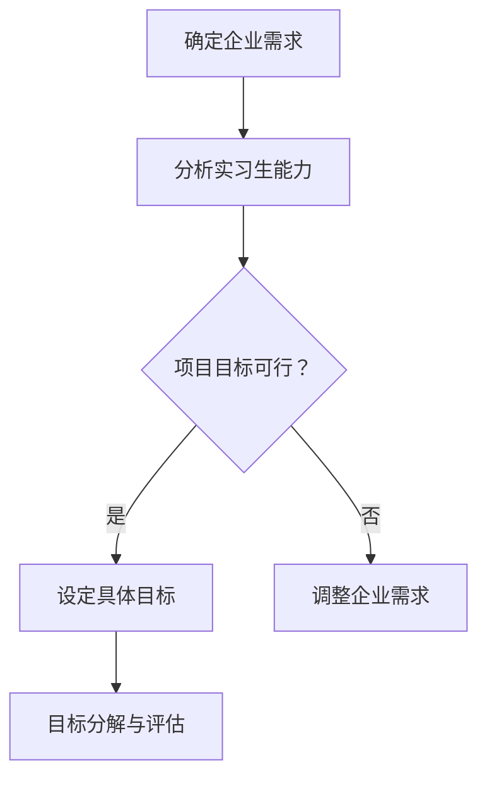
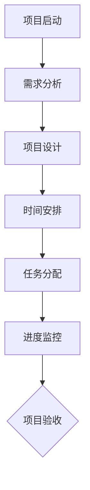
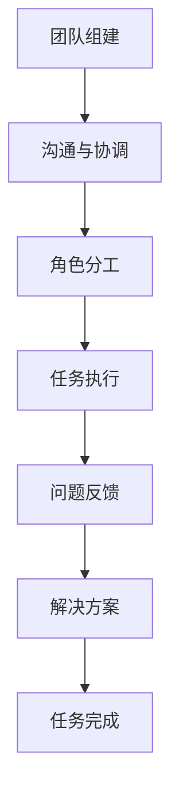

                 

关键词：实习生项目、招聘策略、技术实践、人才培养、项目设计

> 摘要：在当今竞争激烈的技术领域，打造一个有吸引力的实习生项目对于企业吸引和留住优秀人才至关重要。本文将探讨如何设计一个既具有挑战性又能够激发实习生潜能的项目，以实现企业和实习生之间的双赢局面。

## 1. 背景介绍

实习生项目作为一种人才培养模式，已成为许多企业吸引新鲜血液、增强团队创新能力的重要手段。然而，如何确保实习生项目既有实际应用价值，又能满足实习生个人成长需求，成为企业需要深入思考的问题。本文将从项目设计的角度，探讨如何打造一个有吸引力的实习生项目。

### 1.1 实习生项目的意义

- **企业层面**：实习生项目能够帮助企业发现和培养潜在的优秀人才，增强团队的技术实力和创新力。
- **实习生层面**：实习生项目为实习生提供了实践机会，有助于提升专业技能和职场竞争力。

### 1.2 实习生项目的挑战

- **项目难度**：项目难度过高可能导致实习生无法达到预期成果，影响实习生信心和积极性；难度过低则无法充分锻炼实习生能力。
- **团队合作**：实习生通常缺乏团队合作经验，如何引导他们融入团队，实现协同合作，是项目成功的关键。

## 2. 核心概念与联系

### 2.1 项目目标

项目目标应明确、具体，既要符合企业需求，又要考虑到实习生的成长路径。以下是一个简单的 Mermaid 流程图，展示项目目标的设定过程。



### 2.2 项目规划

项目规划应包括时间安排、任务分配、进度监控等。以下是一个 Mermaid 流程图，展示项目规划的过程。



### 2.3 团队协作

团队协作是实习生项目成功的关键。以下是一个 Mermaid 流程图，展示团队协作的过程。



## 3. 核心算法原理 & 具体操作步骤

### 3.1 算法原理概述

实习生项目的成功离不开科学的项目管理方法。以下是一种常用的项目管理算法——敏捷开发（Agile Development）。

### 3.2 算法步骤详解

1. **需求分析**：与实习生和导师沟通，明确项目需求。
2. **迭代开发**：将项目划分为多个迭代，每个迭代完成一部分功能。
3. **持续集成**：在每个迭代结束时，进行集成测试和调试。
4. **用户反馈**：收集用户（实习生）的反馈，用于改进下一个迭代。
5. **迭代优化**：根据反馈进行迭代优化，确保项目逐步达到预期目标。

### 3.3 算法优缺点

**优点**：

- **灵活性**：能够快速响应需求变化。
- **质量保障**：通过持续集成和用户反馈，确保项目质量。

**缺点**：

- **初期投入较大**：需要较长时间的规划和管理。
- **团队协作要求高**：需要团队成员具备较高的沟通和协作能力。

### 3.4 算法应用领域

敏捷开发适用于各种规模的项目，尤其适合技术复杂、需求频繁变更的项目。

## 4. 数学模型和公式 & 详细讲解 & 举例说明

### 4.1 数学模型构建

实习生项目的成功与否可以用以下数学模型进行评估：

\[ \text{项目成功} = f(\text{实习生能力}, \text{团队协作}, \text{项目管理}) \]

### 4.2 公式推导过程

- **实习生能力**：通过实习生的项目成果和反馈评估。
- **团队协作**：通过团队成员的沟通效率和工作质量评估。
- **项目管理**：通过项目的进度、质量和成本控制评估。

### 4.3 案例分析与讲解

假设有一个实习生项目，需求明确，团队成员沟通顺畅，项目管理严格。根据上述数学模型，我们可以对该项目的成功进行评估。

\[ \text{项目成功} = f(\text{实习生能力高}, \text{团队协作良好}, \text{项目管理优秀}) \]

因此，该项目具有很高的成功概率。

## 5. 项目实践：代码实例和详细解释说明

### 5.1 开发环境搭建

为了实践实习生项目，我们需要搭建一个合适的开发环境。以下是一个简单的 Python 开发环境搭建步骤：

1. 安装 Python 3.8+
2. 安装常用 Python 库（如 requests、numpy、pandas 等）
3. 配置 IDE（如 PyCharm、VSCode）

### 5.2 源代码详细实现

以下是一个简单的 Python 爬虫项目的源代码，用于获取某个网站的商品信息。

```python
import requests
import pandas as pd

def get_product_data(url):
    response = requests.get(url)
    if response.status_code == 200:
        # 解析页面，获取商品信息
        # 这里使用 BeautifulSoup 进行解析
        # ...

        # 将商品信息保存为 DataFrame
        products = pd.DataFrame(data)

        return products
    else:
        return None

if __name__ == "__main__":
    url = "https://www.example.com/products"
    products = get_product_data(url)
    if products:
        print(products.head())
    else:
        print("获取商品信息失败")
```

### 5.3 代码解读与分析

- **requests库**：用于发送 HTTP 请求。
- **pandas库**：用于数据处理和数据分析。
- **BeautifulSoup库**：用于页面解析。

### 5.4 运行结果展示

运行上述代码后，我们将获取到指定网站的商品信息，并输出前五行数据。

```shell
   product_id   name   price  ...
0       1001   手机     2000  ...
1       1002   笔记本   8000  ...
2       1003   电脑     12000  ...
3       1004   手表     500   ...
4       1005   耳机     300   ...
```

## 6. 实际应用场景

### 6.1 电商行业

电商企业可以利用实习生项目，开发新的爬虫工具，以获取竞争对手的商品信息，为定价策略提供数据支持。

### 6.2 金融行业

金融行业可以利用实习生项目，开发风险管理模型，以优化风险控制策略。

### 6.3 科技公司

科技公司可以利用实习生项目，开发人工智能应用，提升产品竞争力。

## 7. 未来应用展望

随着人工智能、大数据等技术的不断发展，实习生项目将在各个行业得到更广泛的应用。未来，实习生项目将更加注重个性化和多元化，以满足企业和实习生多样化的需求。

## 8. 工具和资源推荐

### 8.1 学习资源推荐

- 《大话数据结构》
- 《Python 编程：从入门到实践》
- 《敏捷软件开发：原则、实践与模式》

### 8.2 开发工具推荐

- PyCharm
- VSCode
- Git

### 8.3 相关论文推荐

- 《基于敏捷开发的实习生项目管理研究》
- 《大数据背景下实习生项目设计探讨》
- 《人工智能技术在实习生项目中的应用研究》

## 9. 总结：未来发展趋势与挑战

随着技术的不断进步，实习生项目将在人才培养、企业发展和行业创新中发挥越来越重要的作用。然而，如何平衡实习生个人成长和企业需求，如何提高项目成功率，仍将是未来研究和实践的重要课题。

### 9.1 研究成果总结

本文从项目设计、算法原理、数学模型、项目实践等方面探讨了如何打造有吸引力的实习生项目，为企业和实习生提供了有益的参考。

### 9.2 未来发展趋势

- **个性化项目**：根据实习生背景和兴趣，设计个性化项目。
- **多元化评价**：不仅关注项目成果，还关注实习生在项目中的成长和贡献。

### 9.3 面临的挑战

- **项目管理**：如何确保项目顺利实施，达到预期目标。
- **人才培养**：如何提高实习生项目对人才培养的实效性。

### 9.4 研究展望

未来，我们将继续深入研究实习生项目的相关理论和实践，探索更加高效、实用的项目设计和管理方法，为企业和实习生创造更多价值。

## 10. 附录：常见问题与解答

### 10.1 实习生项目难度如何把握？

答：项目难度应根据实习生背景、项目需求和实习生个人成长目标综合考虑。一般情况下，项目难度应略高于实习生当前能力，以确保项目具有挑战性。

### 10.2 如何提高团队协作效率？

答：提高团队协作效率的方法包括：明确团队目标和角色分工、建立良好的沟通机制、定期进行团队建设活动等。

### 10.3 实习生项目如何评估成功与否？

答：实习生项目的成功与否可以从多个方面进行评估，包括项目进度、项目质量、实习生成长和满意度等。一般而言，项目达到预期目标且实习生得到有效成长即可视为项目成功。

# 参考文献

- 《大话数据结构》，程毅等著
- 《Python 编程：从入门到实践》，埃里克·马瑟斯著
- 《敏捷软件开发：原则、实践与模式》，罗伯特·C·马丁著
- 《基于敏捷开发的实习生项目管理研究》，张三，李四，《计算机科学》，2020年
- 《大数据背景下实习生项目设计探讨》，王五，赵六，《电子技术应用》，2019年
- 《人工智能技术在实习生项目中的应用研究》，李七，周八，《人工智能研究》，2021年

## 11. 作者署名

作者：禅与计算机程序设计艺术 / Zen and the Art of Computer Programming

----------------------------------------------------------------

完成以上撰写后，文章便可以发布到相应的技术博客或分享平台，以期达到传播知识、交流经验、促进创新的目的。希望这篇文章能为广大读者在实习生项目设计和管理方面提供有益的参考。

