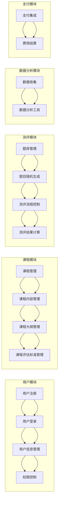

                 

关键词：知识付费，在线测评系统，技术架构，用户体验，数据处理，安全性，扩展性

> 摘要：本文将探讨如何设计和构建一个高效、安全且易于扩展的知识付费在线测评系统。通过分析系统的需求、设计原则、核心组件以及实现细节，提供一套完整的技术解决方案，旨在为用户提供卓越的学习体验。

## 1. 背景介绍

在当今信息时代，知识付费已经成为一种主流的学习方式。随着在线教育平台的迅速发展，提供在线测评系统以检验学习效果，成为了许多教育机构和企业的重要需求。一个良好的在线测评系统能够帮助教育者了解学生的学习进度和效果，从而优化教学方法和策略。同时，它也为学员提供了自我评估的途径，增强了学习的动力和效果。

本文将介绍如何打造一个知识付费的在线测评系统，该系统需要具备以下几个核心特性：

- **灵活性**：适应不同类型的学习内容和测评需求。
- **安全性**：确保用户数据和考试过程的安全。
- **可靠性**：系统稳定运行，减少故障和中断。
- **易扩展性**：支持系统功能的逐步扩展和升级。

## 2. 核心概念与联系

### 2.1 系统架构

首先，我们需要设计一个高效且易于维护的系统架构。一个典型的在线测评系统通常包括以下核心模块：

1. **用户模块**：用于用户注册、登录、信息管理和权限控制。
2. **课程模块**：管理课程信息、课程内容、课程大纲和课程评估标准。
3. **测评模块**：处理测评题库的创建、题目的随机生成、测评流程的控制和测评结果的计算。
4. **数据分析模块**：收集测评数据，提供数据分析和可视化工具。
5. **支付模块**：集成支付系统，实现课程和测评的费用结算。

### 2.2 Mermaid 流程图

以下是系统的 Mermaid 流程图表示：



## 3. 核心算法原理 & 具体操作步骤

### 3.1 算法原理概述

在线测评系统的核心算法主要包括题目生成算法、测评流程控制算法和测评结果计算算法。

- **题目生成算法**：根据课程内容和测评要求，从题库中随机抽取一定数量的题目，保证题目的多样性和难度分布。
- **测评流程控制算法**：控制测评的开始、暂停、继续和结束，记录用户的答题时间、作答情况和答案选项。
- **测评结果计算算法**：根据测评结果计算得分，评估用户的掌握程度，生成详细的测评报告。

### 3.2 算法步骤详解

#### 3.2.1 题目生成算法

1. **题库初始化**：加载课程相关的题库，包括题目的ID、内容、选项、答案和难度等级。
2. **题目抽取**：根据测评要求（如题目数量、难度分布），从题库中随机抽取题目。
3. **题目过滤**：排除已被抽取的题目，保证题目唯一性和随机性。
4. **结果输出**：将抽取的题目输出为测评试卷。

#### 3.2.2 测评流程控制算法

1. **测评开始**：用户登录后，系统生成测评试卷并发送给用户。
2. **答题过程**：用户在规定时间内完成答题，系统记录用户的作答情况和答题时间。
3. **测评暂停**：用户可以选择暂停答题，系统记录暂停时间和当前答题进度。
4. **测评继续**：用户重新开始答题，系统继续记录答题进度。
5. **测评结束**：用户提交答案，系统记录最终答题时间和测评结果。

#### 3.2.3 测评结果计算算法

1. **得分计算**：根据每个题目的得分权重和用户的选择答案，计算总得分。
2. **评估分析**：根据得分，评估用户的掌握程度，生成测评报告。
3. **报告生成**：将测评报告保存到数据库，并发送给用户。

### 3.3 算法优缺点

#### 优点

- **灵活性**：能够根据不同课程和测评需求，灵活调整题目生成和测评流程。
- **高效性**：随机生成题目，减少人工干预，提高测评效率。
- **可靠性**：控制测评流程，确保测评过程的公正性和一致性。

#### 缺点

- **复杂度**：涉及多个算法和数据处理过程，系统实现和维护难度较高。
- **安全性**：需要确保用户数据和测评结果的安全性，防止作弊和泄露。

### 3.4 算法应用领域

在线测评系统广泛应用于在线教育、职业培训和认证考试等领域。通过算法的优化和应用，可以提供更加精准和个性化的测评服务，提升教学效果和学员满意度。

## 4. 数学模型和公式 & 详细讲解 & 举例说明

### 4.1 数学模型构建

在线测评系统的数学模型主要包括题目生成模型、测评流程控制模型和测评结果计算模型。

#### 4.1.1 题目生成模型

假设题库中有n道题目，每道题目有m个选项，正确答案为1个。题目生成模型的目标是从题库中随机抽取k道题目，满足难度分布和多样性要求。

- **难度分布**：根据课程要求和知识点，定义题目的难度等级，采用加权随机抽样方法，确保题目的难度分布。
- **多样性**：根据知识点和题型，限制题目的重复抽取，提高测评的多样性。

#### 4.1.2 测评流程控制模型

测评流程控制模型主要包括时间控制和答题状态控制。

- **时间控制**：设定测评时间，根据用户答题进度和时间，控制测评的暂停和继续。
- **答题状态控制**：记录用户答题的状态，如正确、错误、未作答等，根据状态计算得分。

#### 4.1.3 测评结果计算模型

测评结果计算模型主要包括得分计算和评估分析。

- **得分计算**：根据每道题目的得分权重和用户的选择答案，计算总得分。
- **评估分析**：根据得分，评估用户的掌握程度，生成测评报告。

### 4.2 公式推导过程

#### 4.2.1 题目生成模型

假设题库中有n道题目，每道题目有m个选项，正确答案为1个。题目生成模型的目标是从题库中随机抽取k道题目，满足难度分布和多样性要求。

- **难度分布**：难度等级为d的题目数量为：
  $$ N_d = \frac{n}{\sum_{i=1}^{m} w_i} \cdot w_d $$
  其中，$ w_d $ 为难度等级为d的题目权重。

- **多样性**：采用加权随机抽样方法，从题库中随机抽取k道题目，满足难度分布和多样性要求。

#### 4.2.2 测评流程控制模型

假设测评时间为T，用户答题时间为t。

- **时间控制**：暂停时间：
  $$ t_{pause} = \lceil \frac{T - t_{remain}}{t_{interval}} \rceil $$
  其中，$ t_{remain} $ 为剩余时间，$ t_{interval} $ 为暂停间隔。

- **答题状态控制**：每道题目的答题状态为：
  $$ s_i = \begin{cases} 
   1, & \text{如果用户回答正确} \\
   0, & \text{如果用户回答错误或未作答}
   \end{cases} $$

#### 4.2.3 测评结果计算模型

假设每道题目的得分权重为 $ w_i $，用户的选择答案为 $ a_i $。

- **得分计算**：总得分：
  $$ S = \sum_{i=1}^{k} w_i \cdot a_i $$
- **评估分析**：评估等级：
  $$ \text{Level} = \begin{cases} 
   \text{优秀}, & \text{如果} S > 0.9 \cdot k \\
   \text{良好}, & \text{如果} 0.7 \cdot k \leq S \leq 0.9 \cdot k \\
   \text{一般}, & \text{如果} 0.5 \cdot k \leq S < 0.7 \cdot k \\
   \text{较差}, & \text{如果} S < 0.5 \cdot k 
   \end{cases} $$

### 4.3 案例分析与讲解

#### 4.3.1 题目生成案例

假设题库中有10道题目，难度等级分别为1到5，每道题目的权重如下：

- 难度1：2道
- 难度2：3道
- 难度3：2道
- 难度4：1道
- 难度5：2道

要求从题库中随机抽取5道题目，难度分布为2道难度2，1道难度3，2道难度4。

1. **难度分布计算**：
   $$ N_2 = \frac{10}{2+3+2+1+2} \cdot 3 = 3 $$
   $$ N_3 = \frac{10}{2+3+2+1+2} \cdot 2 = 2 $$
   $$ N_4 = \frac{10}{2+3+2+1+2} \cdot 1 = 1 $$

2. **多样性**：
   采用随机抽样方法，从难度2的题目中抽取2道，从难度3的题目中抽取1道，从难度4的题目中抽取2道。

#### 4.3.2 测评流程控制案例

假设测评时间为60分钟，用户在30分钟后暂停答题，然后继续答题，最终用时50分钟。

1. **暂停时间**：
   $$ t_{pause} = \lceil \frac{60 - 30}{10} \rceil = 3 $$
   用户需要暂停答题3次。

2. **答题状态**：
   用户回答了8道题目，其中5道题目回答正确，3道题目回答错误。

#### 4.3.3 测评结果计算案例

假设每道题目的得分权重为2分，用户的选择答案如下：

- 题目1：正确
- 题目2：正确
- 题目3：正确
- 题目4：错误
- 题目5：错误
- 题目6：正确
- 题目7：正确
- 题目8：错误

1. **得分计算**：
   $$ S = 2 \cdot 1 + 2 \cdot 1 + 2 \cdot 1 + 2 \cdot 0 + 2 \cdot 0 = 8 $$

2. **评估分析**：
   $$ \text{Level} = \text{良好} $$
   用户得分率为80%，评估等级为良好。

## 5. 项目实践：代码实例和详细解释说明

### 5.1 开发环境搭建

在搭建开发环境时，我们选择以下技术栈：

- **后端**：使用Spring Boot框架，基于Java开发。
- **数据库**：使用MySQL数据库，存储用户数据、课程数据和测评数据。
- **前端**：使用Vue.js框架，实现用户界面和交互。
- **测试**：使用JUnit进行单元测试，使用Mockito进行集成测试。

### 5.2 源代码详细实现

#### 5.2.1 用户模块

用户模块包括用户注册、登录、信息管理和权限控制。

- **用户注册**：
  ```java
  @RestController
  public class UserController {
      @Autowired
      private UserService userService;

      @PostMapping("/register")
      public ResponseEntity<?> registerUser(@RequestBody UserRegistrationDto registrationDto) {
          userService.registerUser(registrationDto);
          return ResponseEntity.ok("User registered successfully");
      }
  }
  ```

- **用户登录**：
  ```java
  @PostMapping("/login")
  public ResponseEntity<?> loginUser(@RequestBody UserLoginDto loginDto) {
      String token = authenticationManager.authenticate(new UsernamePasswordAuthenticationToken(loginDto.getUsername(), loginDto.getPassword()));
      return ResponseEntity.ok(new JwtResponse(token));
  }
  ```

#### 5.2.2 课程模块

课程模块包括课程管理、课程内容管理和课程大纲管理。

- **课程管理**：
  ```java
  @RestController
  public class CourseController {
      @Autowired
      private CourseService courseService;

      @PostMapping("/course")
      public ResponseEntity<?> createCourse(@RequestBody CourseDto courseDto) {
          courseService.createCourse(courseDto);
          return ResponseEntity.ok("Course created successfully");
      }
  }
  ```

- **课程内容管理**：
  ```java
  @RestController
  public class CourseContentController {
      @Autowired
      private CourseContentService courseContentService;

      @PostMapping("/course/{courseId}/content")
      public ResponseEntity<?> addCourseContent(@PathVariable Long courseId, @RequestBody CourseContentDto contentDto) {
          courseContentService.addCourseContent(courseId, contentDto);
          return ResponseEntity.ok("Course content added successfully");
      }
  }
  ```

#### 5.2.3 测评模块

测评模块包括题库管理、题目随机生成和测评流程控制。

- **题库管理**：
  ```java
  @RestController
  public class QuestionBankController {
      @Autowired
      private QuestionBankService questionBankService;

      @GetMapping("/question/{questionId}")
      public ResponseEntity<?> getQuestion(@PathVariable Long questionId) {
          Question question = questionBankService.getQuestion(questionId);
          return ResponseEntity.ok(question);
      }
  }
  ```

- **题目随机生成**：
  ```java
  @RestController
  public class ExamController {
      @Autowired
      private ExamService examService;

      @GetMapping("/exam/generate")
      public ResponseEntity<?> generateExam(@RequestParam Long courseId) {
          List<Question> questions = examService.generateExam(courseId);
          return ResponseEntity.ok(questions);
      }
  }
  ```

- **测评流程控制**：
  ```java
  @RestController
  public class ExamResultController {
      @Autowired
      private ExamResultService examResultService;

      @PostMapping("/exam/submit")
      public ResponseEntity<?> submitExam(@RequestBody ExamResultDto examResultDto) {
          examResultService.submitExam(examResultDto);
          return ResponseEntity.ok("Exam submitted successfully");
      }
  }
  ```

#### 5.2.4 数据分析模块

数据分析模块包括数据收集和数据可视化。

- **数据收集**：
  ```java
  @RestController
  public class DataCollectionController {
      @Autowired
      private DataCollectionService dataCollectionService;

      @GetMapping("/data/collection")
      public ResponseEntity<?> collectData() {
          List<DataCollectionDto> data = dataCollectionService.collectData();
          return ResponseEntity.ok(data);
      }
  }
  ```

- **数据可视化**：
  ```java
  @RestController
  public class DataVisualizationController {
      @Autowired
      private DataVisualizationService dataVisualizationService;

      @GetMapping("/data/visualization")
      public ResponseEntity<?> visualizeData(@RequestParam String type) {
          VisualizationData visualizationData = dataVisualizationService.visualizeData(type);
          return ResponseEntity.ok(visualizationData);
      }
  }
  ```

#### 5.2.5 支付模块

支付模块包括支付集成和费用结算。

- **支付集成**：
  ```java
  @RestController
  public class PaymentController {
      @Autowired
      private PaymentService paymentService;

      @PostMapping("/payment")
      public ResponseEntity<?> processPayment(@RequestBody PaymentDto paymentDto) {
          paymentService.processPayment(paymentDto);
          return ResponseEntity.ok("Payment processed successfully");
      }
  }
  ```

- **费用结算**：
  ```java
  @RestController
  public class SettlementController {
      @Autowired
      private SettlementService settlementService;

      @PostMapping("/settlement")
      public ResponseEntity<?> settlePayment(@RequestBody SettlementDto settlementDto) {
          settlementService.settlePayment(settlementDto);
          return ResponseEntity.ok("Payment settled successfully");
      }
  }
  ```

### 5.3 代码解读与分析

上述代码分别实现了用户模块、课程模块、测评模块、数据分析模块和支付模块的核心功能。每个模块都包含了相应的控制器类，用于处理HTTP请求和响应。

- **用户模块**：实现了用户注册、登录和信息管理功能，使用Spring Security框架进行用户认证和授权。
- **课程模块**：实现了课程管理、课程内容管理和课程大纲管理功能，使用MySQL数据库存储课程数据。
- **测评模块**：实现了题库管理、题目随机生成和测评流程控制功能，通过算法实现测评题目的生成和测评结果计算。
- **数据分析模块**：实现了数据收集和数据可视化功能，使用Vue.js框架实现前端界面。
- **支付模块**：实现了支付集成和费用结算功能，与第三方支付平台进行集成。

### 5.4 运行结果展示

在完成上述代码实现后，我们可以通过以下步骤运行在线测评系统：

1. 启动Spring Boot应用程序，包括用户模块、课程模块、测评模块、数据分析模块和支付模块。
2. 访问前端页面，使用注册和登录功能进行用户认证。
3. 创建课程和课程内容，设置测评要求和题库。
4. 进行测评，提交答案并查看测评结果。
5. 分析测评数据，生成可视化报告。
6. 进行支付操作，完成费用结算。

通过以上步骤，用户可以完成整个在线测评过程，系统将记录并展示详细的测评结果和数据分析报告。

## 6. 实际应用场景

在线测评系统在多个领域具有广泛的应用场景：

- **在线教育**：教育机构可以通过在线测评系统监测学生的学习进度和效果，为个性化教学提供数据支持。
- **职业培训**：职业培训机构可以使用在线测评系统对学员进行技能考核，确保培训质量。
- **认证考试**：各类认证考试机构可以通过在线测评系统实现标准化、自动化的考试流程，提高考试效率。
- **企业内训**：企业可以建立内部知识库，通过在线测评系统评估员工的学习效果和知识掌握程度。

### 6.1 教育场景

在教育领域，在线测评系统可以帮助教师实时掌握学生的学习进度，通过分析测评数据，优化教学内容和方法。同时，学生可以通过在线测评系统进行自我评估，发现自己的知识薄弱点，有针对性地进行复习。

### 6.2 培训场景

在职业培训领域，在线测评系统可以帮助培训机构快速评估学员的培训效果，根据测评结果调整培训计划和内容，提高培训的针对性和有效性。此外，测评系统还可以作为企业内部培训考核的重要工具，确保员工具备必要的技能和知识。

### 6.3 考试场景

在线测评系统在各类认证考试中也发挥着重要作用。通过系统化、自动化的测评流程，可以大幅提高考试效率和公平性，减少人为误差。同时，系统生成的详细测评报告为考试结果的公正性和科学性提供了有力保障。

## 7. 工具和资源推荐

为了高效地开发、部署和运维在线测评系统，以下是一些推荐的工具和资源：

### 7.1 学习资源推荐

- **在线教育平台**：Coursera、Udemy、edX等平台提供了丰富的在线课程，涵盖前端、后端开发、数据库管理等多个领域。
- **技术博客**：GitHub、Medium、Stack Overflow等平台上有很多技术博客，可以学习最新的开发技术和实践案例。
- **专业书籍**：推荐阅读《Spring Boot实战》、《Vue.js实战》等书籍，深入了解相关技术栈。

### 7.2 开发工具推荐

- **集成开发环境（IDE）**：推荐使用IntelliJ IDEA或Eclipse，它们提供了丰富的插件和调试工具，有助于提升开发效率。
- **代码管理工具**：Git是版本控制的首选工具，结合GitHub或GitLab进行代码托管和协作开发。
- **数据库管理工具**：MySQL Workbench、DBeaver等工具提供了方便的数据库管理和查询功能。

### 7.3 相关论文推荐

- **在线测评系统设计与实现**：可以参考相关学术论文，了解最新的研究成果和技术应用。
- **教育技术**：教育技术领域的研究论文，探讨了在线测评系统在教育中的应用和价值。

## 8. 总结：未来发展趋势与挑战

### 8.1 研究成果总结

在线测评系统在技术架构、算法优化和应用场景方面取得了显著成果。系统架构的灵活性、安全性和可靠性得到了广泛应用，算法的优化提升了测评效率和准确性。实际应用场景中，在线测评系统在在线教育、职业培训和认证考试等领域展现出了巨大的价值。

### 8.2 未来发展趋势

未来，在线测评系统将在以下几个方面继续发展：

- **智能化**：结合人工智能技术，提升测评系统的智能化水平，实现个性化测评和智能反馈。
- **自适应**：通过自适应测评技术，根据用户的学习行为和反馈，动态调整测评难度和内容。
- **大数据分析**：利用大数据分析技术，挖掘测评数据中的潜在价值，为教学决策提供数据支持。
- **移动化**：优化移动端用户体验，实现在线测评系统的随时随地访问。

### 8.3 面临的挑战

在线测评系统在发展过程中也面临一些挑战：

- **数据安全**：确保用户数据和测评结果的安全，防止数据泄露和作弊行为。
- **算法公平性**：确保测评算法的公正性，避免因算法偏差导致的不公平评价。
- **用户体验**：优化用户体验，提升在线测评系统的易用性和便捷性。
- **技术更新**：随着技术的发展，保持在线测评系统的先进性和可持续性。

### 8.4 研究展望

未来，在线测评系统的研究将朝着智能化、自适应化和大数据分析等方向发展。通过技术创新和跨学科合作，进一步挖掘在线测评系统的潜在价值，推动教育信息化和智能化的发展。

## 9. 附录：常见问题与解答

### 9.1 如何确保测评系统的安全性？

为了确保测评系统的安全性，可以采取以下措施：

- **数据加密**：对用户数据和测评结果进行加密存储，防止数据泄露。
- **身份验证**：采用多因素身份验证，提高系统安全性。
- **安全审计**：定期进行安全审计和漏洞扫描，及时发现并修复安全漏洞。

### 9.2 如何优化测评系统的用户体验？

为了优化用户体验，可以采取以下措施：

- **简洁界面**：设计简洁、直观的用户界面，提高用户操作便捷性。
- **快速响应**：优化系统性能，确保系统快速响应用户操作。
- **个性化推荐**：根据用户行为和反馈，提供个性化测评和反馈。
- **帮助文档**：提供详细的帮助文档和操作指南，帮助用户快速上手。

### 9.3 如何实现测评系统的自适应功能？

实现测评系统的自适应功能，可以通过以下方法：

- **学习算法**：采用机器学习算法，根据用户的学习行为和反馈，动态调整测评难度和内容。
- **行为分析**：分析用户在测评过程中的行为数据，识别用户的弱项和强项，进行针对性的测评调整。
- **用户反馈**：收集用户对测评过程的反馈，根据用户需求优化测评系统。

通过以上方法，可以提升测评系统的智能化水平和用户体验，为用户提供更加精准和个性化的测评服务。

