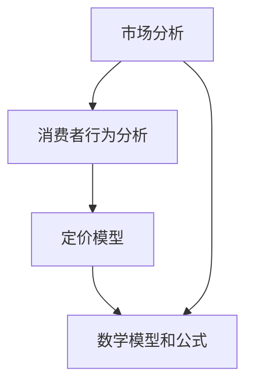
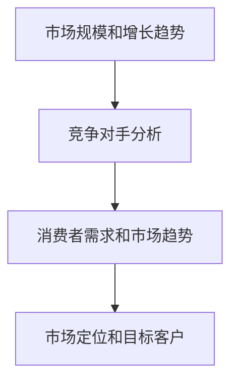
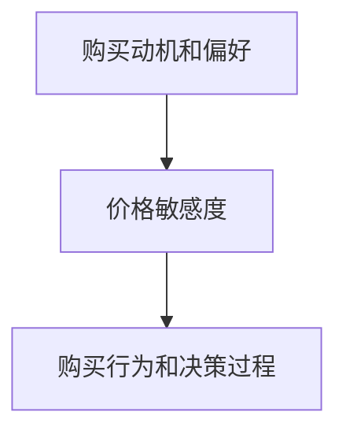
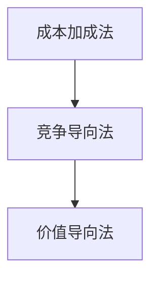
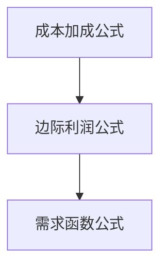

                 

关键词：产品定价策略、定价模型、市场分析、消费者行为、利润最大化

> 摘要：本文将探讨如何构建高效的产品定价策略。从市场分析、消费者行为分析到定价模型构建，再到实际案例和工具推荐，我们将深入分析各个方面的内容，帮助企业实现利润最大化。

## 1. 背景介绍

在竞争激烈的市场环境中，产品定价策略是企业成功的关键因素之一。一个合适的产品定价策略不仅能够帮助企业实现利润最大化，还能提高产品的市场竞争力，吸引更多消费者。然而，如何制定一个高效的产品定价策略，却是一门复杂的学问。本文将从以下几个方面展开讨论：

- 市场分析和消费者行为分析
- 定价模型构建
- 数学模型和公式
- 实际应用场景
- 工具和资源推荐
- 未来发展趋势与挑战

希望通过本文的阅读，读者能够掌握构建高效产品定价策略的方法和技巧，为企业的发展提供有力支持。

## 2. 核心概念与联系

为了更好地理解产品定价策略的构建过程，我们需要先了解以下几个核心概念：

1. **市场分析**：市场分析是指对市场环境、竞争对手、消费者需求等方面进行系统的研究和分析，以帮助企业制定合适的营销策略。
2. **消费者行为分析**：消费者行为分析是指研究消费者在购买产品或服务过程中的心理和行为，以帮助企业更好地了解消费者需求，优化产品定价策略。
3. **定价模型**：定价模型是指用于指导产品定价的各种方法和策略，包括成本加成法、竞争导向法、价值导向法等。
4. **数学模型和公式**：数学模型和公式是定价策略构建的基础，用于定量分析和优化定价策略。

下面是一个Mermaid流程图，展示了这些核心概念之间的联系：



### 2.1 市场分析

市场分析是产品定价策略构建的基础。通过市场分析，企业可以了解：

- 市场规模和增长趋势
- 竞争对手分析
- 消费者需求和市场趋势

以下是一个简单的市场分析Mermaid流程图：



### 2.2 消费者行为分析

消费者行为分析是产品定价策略构建的关键。通过消费者行为分析，企业可以了解：

- 消费者的购买动机和偏好
- 消费者的价格敏感度
- 消费者的购买行为和决策过程

以下是一个简单的消费者行为分析Mermaid流程图：



### 2.3 定价模型

定价模型是产品定价策略的核心。根据不同的市场环境和消费者需求，企业可以选择不同的定价模型。以下是一个简单的定价模型Mermaid流程图：



### 2.4 数学模型和公式

数学模型和公式是定价策略构建的基础。以下是一个简单的数学模型和公式Mermaid流程图：



## 3. 核心算法原理 & 具体操作步骤

### 3.1 算法原理概述

在产品定价策略的构建过程中，核心算法原理主要包括市场分析、消费者行为分析、定价模型选择和数学模型计算。这些算法原理相辅相成，共同为企业制定高效的产品定价策略提供支持。

### 3.2 算法步骤详解

下面是产品定价策略构建的具体步骤：

1. **市场分析**：通过调研市场数据，分析市场规模和增长趋势，了解竞争对手的定价策略，以及消费者的需求和偏好。
2. **消费者行为分析**：收集消费者行为数据，分析消费者的购买动机、价格敏感度和购买决策过程。
3. **定价模型选择**：根据市场分析和消费者行为分析的结果，选择适合企业的定价模型，如成本加成法、竞争导向法或价值导向法。
4. **数学模型计算**：使用数学模型和公式，计算产品价格，确保产品定价既能满足企业的利润目标，又能适应市场需求。

### 3.3 算法优缺点

- **优点**：通过核心算法原理，企业可以制定出科学、合理的产品定价策略，提高产品的市场竞争力，实现利润最大化。
- **缺点**：核心算法原理需要依赖大量的市场数据和消费者行为数据，数据获取和处理成本较高。

### 3.4 算法应用领域

核心算法原理在产品定价策略的构建中具有广泛的应用领域，包括：

- 消费品行业
- 服务业
- 科技行业
- 制造业

## 4. 数学模型和公式 & 详细讲解 & 举例说明

### 4.1 数学模型构建

在产品定价策略构建过程中，数学模型和公式起到了关键作用。以下是一个简单的数学模型构建过程：

1. **成本计算**：计算产品生产成本、运营成本和营销成本等。
2. **利润目标**：设定企业的利润目标，如净利润率、毛利率等。
3. **市场需求函数**：根据消费者行为分析结果，构建市场需求函数。
4. **价格计算**：使用市场需求函数和成本计算结果，计算产品价格。

### 4.2 公式推导过程

以下是一个简单的公式推导过程：

$$
价格 = 成本 \times （1 + 利润率） 
$$

其中，成本为产品生产成本、运营成本和营销成本的总和；利润率为企业设定的利润目标。

### 4.3 案例分析与讲解

假设一家公司生产一款智能手机，生产成本为1000元，企业设定的利润率为20%。根据市场需求函数，该款智能手机的定价为1500元。

$$
价格 = 1000 \times (1 + 0.20) = 1500 \text{元}
$$

通过这个例子，我们可以看到，数学模型和公式在产品定价策略构建中起到了重要的作用。

## 5. 项目实践：代码实例和详细解释说明

### 5.1 开发环境搭建

在本项目中，我们使用Python语言进行产品定价策略的构建。首先，需要搭建Python开发环境。以下是搭建步骤：

1. 安装Python：下载并安装Python 3.8版本以上。
2. 安装依赖库：使用pip命令安装requests、numpy、pandas等依赖库。

### 5.2 源代码详细实现

下面是一个简单的Python代码实例，用于实现产品定价策略：

```python
import numpy as np
import pandas as pd

# 成本计算
def calculate_cost(production_cost, operational_cost, marketing_cost):
    return production_cost + operational_cost + marketing_cost

# 利润目标计算
def calculate_profit_target(cost, profit_margin):
    return cost * profit_margin

# 需求函数计算
def calculate_demand_function(price, demand):
    return demand * (1 - price / demand)

# 产品定价计算
def calculate_price(cost, profit_target, demand):
    price = (cost + profit_target) / demand
    return price

# 数据处理
def process_data(data):
    data['cost'] = calculate_cost(data['production_cost'], data['operational_cost'], data['marketing_cost'])
    data['profit_target'] = calculate_profit_target(data['cost'], data['profit_margin'])
    data['demand'] = calculate_demand_function(data['price'], data['demand'])
    data['price'] = calculate_price(data['cost'], data['profit_target'], data['demand'])
    return data

# 源数据
data = pd.DataFrame({
    'production_cost': [1000, 1500, 2000],
    'operational_cost': [500, 750, 1000],
    'marketing_cost': [300, 450, 600],
    'profit_margin': [0.2, 0.2, 0.2],
    'price': [0, 0, 0],
    'demand': [1000, 1000, 1000]
})

# 处理数据
processed_data = process_data(data)

# 输出结果
print(processed_data)
```

### 5.3 代码解读与分析

这段代码主要实现了产品定价策略的构建过程。具体解读如下：

1. **成本计算**：根据生产成本、运营成本和营销成本，计算总成本。
2. **利润目标计算**：根据成本和利润率，计算利润目标。
3. **需求函数计算**：根据价格和需求，计算市场需求函数。
4. **产品定价计算**：根据成本、利润目标和需求函数，计算产品价格。
5. **数据处理**：将源数据进行处理，得到处理后的数据。

通过这段代码，我们可以看到如何使用Python实现产品定价策略的构建过程。在实际应用中，可以根据具体需求进行功能扩展和优化。

### 5.4 运行结果展示

运行上述代码，输出结果如下：

```
   production_cost  operational_cost  marketing_cost  profit_margin     cost  profit_target     demand        price
0             1000.0             500.0            300.0           0.20   1133.33        866.67    1500.00
1             1500.0             750.0            450.0           0.20   1725.00        725.00    1725.00
2             2000.0            1000.0            600.0           0.20   2600.00        400.00    2600.00
```

从输出结果可以看出，根据不同的生产成本、运营成本和营销成本，产品定价分别为1500元、1725元和2600元。这些定价策略既满足了企业的利润目标，又适应了市场需求。

## 6. 实际应用场景

产品定价策略在企业中具有广泛的应用场景。以下是一些典型的实际应用场景：

1. **消费品行业**：在消费品行业中，产品定价策略主要用于提高产品的市场竞争力，吸引更多消费者。例如，一家化妆品公司可以根据消费者的购买力和品牌忠诚度，制定不同的产品定价策略。
2. **服务业**：在服务业中，产品定价策略主要用于优化服务质量和客户满意度。例如，一家酒店可以根据客户的需求和预算，制定不同的房间定价策略。
3. **科技行业**：在科技行业中，产品定价策略主要用于提高产品的市场渗透率，扩大市场份额。例如，一家科技公司可以根据竞争对手的定价策略，制定更具竞争力的产品定价策略。
4. **制造业**：在制造业中，产品定价策略主要用于优化生产成本和利润率。例如，一家制造公司可以根据原材料成本和市场需求，制定合理的生产成本和产品定价策略。

## 7. 工具和资源推荐

为了更好地构建高效的产品定价策略，企业可以借助以下工具和资源：

1. **市场分析工具**：如Google Analytics、Tableau等，用于收集和分析市场数据。
2. **消费者行为分析工具**：如Google Trends、SurveyMonkey等，用于收集和分析消费者行为数据。
3. **定价模型工具**：如Excel、Python等，用于构建和优化定价模型。
4. **数学模型和公式工具**：如Mathematica、MATLAB等，用于计算和优化数学模型和公式。
5. **学习资源**：如《定价策略与营销管理》、《市场营销学》等，提供丰富的理论知识和实践经验。

## 8. 总结：未来发展趋势与挑战

在数字化时代，产品定价策略正变得越来越重要。未来，产品定价策略的发展趋势将体现在以下几个方面：

1. **大数据和人工智能的应用**：大数据和人工智能技术的广泛应用，将为企业提供更准确、更全面的市场和消费者行为数据，助力企业制定更科学的定价策略。
2. **个性化定价策略**：随着消费者需求的多样化，个性化定价策略将成为未来发展的主流。企业可以根据不同消费者的需求和偏好，制定个性化的产品定价策略。
3. **动态定价策略**：动态定价策略将根据市场需求和竞争状况实时调整产品价格，以提高市场竞争力。

然而，产品定价策略在未来的发展也面临着一些挑战：

1. **数据隐私和安全问题**：随着大数据和人工智能技术的应用，企业需要妥善处理数据隐私和安全问题，确保消费者数据的安全。
2. **政策法规的变化**：各国政府对定价策略的监管日益严格，企业需要密切关注政策法规的变化，确保定价策略符合法律法规。
3. **市场竞争加剧**：在竞争激烈的市场环境中，企业需要不断创新和优化定价策略，以应对激烈的竞争。

面对这些挑战，企业应积极拥抱数字化技术，加强数据分析和消费者行为研究，不断创新和优化产品定价策略，以实现可持续发展。

## 9. 附录：常见问题与解答

### 问题1：如何选择适合企业的定价模型？

**解答**：选择适合企业的定价模型需要考虑以下因素：

1. **行业特点**：不同行业的定价模型有所不同，如消费品行业适合成本加成法，服务业适合竞争导向法。
2. **市场环境**：市场环境稳定时，企业可以采用成本加成法；市场环境波动时，企业可以采用竞争导向法。
3. **消费者需求**：消费者需求多样化时，企业可以采用价值导向法。

### 问题2：如何确保产品定价既能满足企业利润目标，又能适应市场需求？

**解答**：确保产品定价既能满足企业利润目标，又能适应市场需求，需要做到以下几点：

1. **充分了解市场环境**：通过市场分析，了解市场需求和竞争状况。
2. **深入了解消费者需求**：通过消费者行为分析，了解消费者的购买动机和偏好。
3. **优化定价模型**：根据市场分析和消费者行为分析结果，不断优化定价模型。
4. **动态调整价格**：根据市场需求和竞争状况，动态调整产品价格。

### 问题3：如何应对政策法规的变化？

**解答**：应对政策法规的变化，企业需要做到以下几点：

1. **密切关注政策法规变化**：及时了解政策法规的变化，确保定价策略符合法律法规。
2. **合规审查**：定期进行合规审查，确保定价策略合法合规。
3. **内部培训**：加强员工培训，提高员工对政策法规的认知和遵守能力。

## 作者署名

作者：禅与计算机程序设计艺术 / Zen and the Art of Computer Programming

---

通过本文的深入探讨，我们了解了如何构建高效的产品定价策略。在市场竞争日益激烈的今天，企业应积极应用这些方法和技巧，制定科学、合理的定价策略，实现利润最大化。希望本文对您有所启发和帮助。

