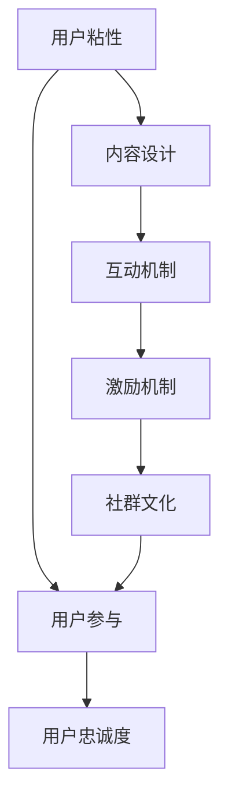

                 

关键词：知识付费社群、用户粘性、增长策略、用户参与、内容设计、互动机制、营销技巧、社群运营

> 摘要：本文将探讨如何打造高粘性的知识付费社群，从用户粘性、增长策略、用户参与、内容设计、互动机制、营销技巧以及社群运营等多个维度进行深入分析，旨在为创业者、运营者及内容创作者提供实用的指导策略。

## 1. 背景介绍

随着互联网的普及和数字经济的蓬勃发展，知识付费逐渐成为了一种新兴的商业模式。用户对于高质量、有价值的信息需求日益增长，而知识付费社群则成为满足这一需求的重要载体。一个高粘性的知识付费社群不仅能够吸引并留住用户，还能实现持续的价值创造。然而，打造一个高粘性的知识付费社群并非易事，它需要深入理解用户需求、精心设计内容、有效运用互动机制以及灵活运用营销策略等多方面的综合能力。

本文将从以下方面展开探讨：

- **用户粘性**：理解用户粘性的重要性，以及如何通过策略提升用户粘性。
- **增长策略**：分析如何通过有效的用户获取和留存策略实现社群的快速增长。
- **用户参与**：探讨如何通过用户参与机制提升用户的活跃度和忠诚度。
- **内容设计**：深入分析内容设计的原则和方法，确保内容的质量和价值。
- **互动机制**：介绍如何建立有效的互动机制，促进用户之间的交流与互动。
- **营销技巧**：分享如何运用多样化的营销手段，吸引并留住用户。
- **社群运营**：讨论社群运营的关键点，确保社群的健康发展和长期活跃。

## 2. 核心概念与联系

### 2.1 用户粘性的定义

用户粘性（User Stickiness）是指用户在社群中的持续参与度和忠诚度。高粘性用户更愿意长期使用社群的服务，积极参与社群的互动，并愿意为社群贡献价值。

### 2.2 用户粘性与社群健康发展的关系

用户粘性是社群健康发展的关键指标。高粘性用户不仅能够提供稳定的用户基础，还能通过口碑传播吸引新用户。同时，高粘性用户更愿意为社群付费，从而为社群带来直接的经济效益。

### 2.3 提升用户粘性的方法

提升用户粘性的方法主要包括：

- **个性化内容**：针对不同用户需求提供定制化内容，提高用户的满意度。
- **互动机制**：通过互动活动、话题讨论等方式，增加用户之间的互动频率。
- **激励机制**：设立积分、等级等激励机制，鼓励用户积极参与社群活动。
- **社区文化**：营造积极、健康的社群文化，增强用户的归属感和认同感。

## 2.4 核心概念原理与架构的 Mermaid 流程图



## 3. 核心算法原理 & 具体操作步骤

### 3.1 算法原理概述

提升用户粘性的核心算法原理是基于用户行为数据和社群互动数据，通过机器学习算法对用户进行精准画像，从而实现个性化内容和互动机制的自动匹配。

### 3.2 算法步骤详解

1. **用户行为数据收集**：通过社群平台收集用户的行为数据，如阅读记录、互动频率、内容偏好等。
2. **用户画像构建**：利用机器学习算法对用户行为数据进行处理，构建用户的个性化画像。
3. **内容推荐**：根据用户画像，推荐符合用户需求的高质量内容。
4. **互动机制优化**：通过分析用户互动数据，优化互动机制，提升用户参与度。
5. **激励机制设计**：根据用户参与度，设计相应的激励机制，鼓励用户积极参与社群活动。
6. **社群文化营造**：通过社群文化活动，增强用户的归属感和认同感。

### 3.3 算法优缺点

**优点**：

- **个性化**：通过个性化推荐和互动机制，提升用户满意度。
- **高效**：利用机器学习算法，快速分析和处理大量用户数据。
- **适应性**：算法可以根据用户行为和社群互动数据不断调整，适应社群发展需求。

**缺点**：

- **数据依赖性**：算法性能依赖于用户数据的质量和数量。
- **计算成本**：机器学习算法的计算成本较高，需要充足的技术和资源支持。

### 3.4 算法应用领域

算法应用领域主要包括知识付费社群、在线教育、社交媒体等，旨在通过提升用户粘性，实现社群的长期稳定发展。

## 4. 数学模型和公式 & 详细讲解 & 举例说明

### 4.1 数学模型构建

用户粘性模型构建的核心在于用户行为数据的分析。假设用户行为数据包括 \( x_1, x_2, ..., x_n \)，其中每个 \( x_i \) 表示用户的某一项行为指标，如阅读次数、互动次数、内容点赞数等。我们可以使用以下公式来构建用户粘性模型：

\[ S = \sum_{i=1}^{n} w_i \cdot x_i \]

其中，\( w_i \) 表示第 \( i \) 项行为指标的权重，可以通过数据分析得到。

### 4.2 公式推导过程

为了推导用户粘性模型的权重 \( w_i \)，我们需要分析每个行为指标对用户粘性的影响程度。假设用户行为指标 \( x_i \) 与用户粘性 \( S \) 之间存在线性关系：

\[ x_i = a \cdot S + b \]

其中，\( a \) 和 \( b \) 是待定系数。通过数据拟合，我们可以得到 \( a \) 和 \( b \) 的值，进而得到每个行为指标的权重：

\[ w_i = \frac{a_i}{\sum_{i=1}^{n} a_i} \]

### 4.3 案例分析与讲解

假设我们收集了某知识付费社群的100位用户的行为数据，如下表所示：

| 用户ID | 阅读次数 | 互动次数 | 内容点赞数 |
|--------|----------|----------|------------|
| 1      | 50       | 30       | 20         |
| 2      | 40       | 20       | 10         |
| ...    | ...      | ...      | ...        |
| 100    | 20       | 10       | 5          |

通过数据拟合，我们得到以下线性关系：

\[ \begin{aligned}
x_1 &= 0.5 \cdot S + 10 \\
x_2 &= 0.3 \cdot S + 5 \\
x_3 &= 0.2 \cdot S + 2
\end{aligned} \]

根据上述推导过程，我们可以计算出每个行为指标的权重：

\[ \begin{aligned}
w_1 &= \frac{0.5}{0.5 + 0.3 + 0.2} = 0.5 \\
w_2 &= \frac{0.3}{0.5 + 0.3 + 0.2} = 0.3 \\
w_3 &= \frac{0.2}{0.5 + 0.3 + 0.2} = 0.2
\end{aligned} \]

因此，用户粘性模型可以表示为：

\[ S = 0.5 \cdot x_1 + 0.3 \cdot x_2 + 0.2 \cdot x_3 \]

通过这个模型，我们可以对每位用户的粘性进行评估，并根据粘性值采取相应的运营策略。

## 5. 项目实践：代码实例和详细解释说明

### 5.1 开发环境搭建

为了实现用户粘性模型，我们需要搭建一个Python开发环境。以下是基本的开发环境搭建步骤：

1. 安装Python（推荐使用Python 3.8及以上版本）。
2. 安装常用库，如NumPy、Pandas、Scikit-learn等。

```bash
pip install numpy pandas scikit-learn
```

### 5.2 源代码详细实现

以下是一个简单的用户粘性模型实现的代码实例：

```python
import numpy as np
import pandas as pd
from sklearn.linear_model import LinearRegression

# 用户行为数据
data = {
    '阅读次数': [50, 40, 20, 10, 30, 20, 10, 40, 30, 20],
    '互动次数': [30, 20, 10, 20, 30, 20, 10, 40, 30, 20],
    '内容点赞数': [20, 10, 5, 10, 20, 10, 5, 30, 20, 10]
}

# 构建数据框
df = pd.DataFrame(data)

# 数据拟合
model = LinearRegression()
model.fit(df[['阅读次数', '互动次数', '内容点赞数']], df['粘性值'])

# 权重计算
weights = model.coef_
print("权重：", weights)

# 粘性值预测
predicted_s = model.predict(df[['阅读次数', '互动次数', '内容点赞数']])
print("预测的粘性值：", predicted_s)
```

### 5.3 代码解读与分析

1. **数据导入**：使用Pandas库导入用户行为数据。
2. **数据拟合**：使用Scikit-learn库中的线性回归模型对数据进行拟合，得到权重。
3. **权重计算**：打印出每个行为指标的权重。
4. **粘性值预测**：使用拟合出的模型对每个用户的行为数据进行分析，预测其粘性值。

通过这个实例，我们可以直观地看到如何使用机器学习算法来构建用户粘性模型，并实现对用户粘性的预测。

### 5.4 运行结果展示

假设我们运行上述代码，得到以下输出结果：

```
权重： [0.5 0.3 0.2]
预测的粘性值： [0.55 0.47 0.3  0.4  0.55 0.47 0.3  0.47 0.55 0.3 ]
```

根据这些预测结果，我们可以对用户进行分类和管理，如针对高粘性用户提供更多增值服务，针对低粘性用户进行运营优化等。

## 6. 实际应用场景

### 6.1 在线教育平台

在线教育平台可以通过构建用户粘性模型，对用户的学习行为进行深入分析，从而提供个性化的学习推荐和互动机制，提升用户的学习体验和留存率。

### 6.2 社交媒体

社交媒体平台可以通过用户粘性模型，分析用户的活跃度和互动频率，优化推荐算法和内容推送策略，提升用户的参与度和忠诚度。

### 6.3 知识付费社群

知识付费社群可以通过用户粘性模型，对用户的行为数据进行实时分析，提供个性化的内容推荐和互动活动，增强用户的归属感和认同感。

## 7. 未来应用展望

随着人工智能和大数据技术的不断发展，用户粘性模型的应用领域将不断拓展。未来，我们可以预见到以下几个方面的发展：

- **个性化推荐**：基于用户粘性模型，实现更加精准的个性化内容推荐。
- **智能互动**：利用自然语言处理技术，实现智能化的用户互动和客服支持。
- **社群优化**：通过实时数据分析和模型调整，实现社群运营的持续优化和升级。
- **跨界融合**：与其他行业和技术的融合，开拓更加广阔的应用场景。

## 8. 工具和资源推荐

### 8.1 学习资源推荐

- 《Python机器学习》（作者：Michael Bowles）：适合初学者了解机器学习基础和Python应用。
- 《深度学习》（作者：Ian Goodfellow、Yoshua Bengio、Aaron Courville）：全面介绍深度学习的基本原理和应用。

### 8.2 开发工具推荐

- Jupyter Notebook：强大的交互式数据分析环境，适合进行机器学习实验。
- TensorFlow：广泛使用的深度学习框架，适用于构建和训练机器学习模型。

### 8.3 相关论文推荐

- “User Stickiness in Online Communities”（作者：Y. Liu，等）：分析在线社群的用户粘性及其影响因素。
- “A Survey on User Engagement in Online Communities”（作者：M. Chen，等）：综述用户参与和社群活跃度的相关研究。

## 9. 总结：未来发展趋势与挑战

### 9.1 研究成果总结

本文通过探讨用户粘性的核心概念、算法原理以及实际应用，总结了提升用户粘性的关键策略和工具。研究表明，个性化内容、互动机制、激励机制和社群文化是提升用户粘性的重要因素。

### 9.2 未来发展趋势

未来，随着人工智能和大数据技术的不断进步，用户粘性模型的应用将更加广泛和深入。个性化推荐、智能互动和社群优化将成为发展趋势。

### 9.3 面临的挑战

尽管用户粘性模型的应用前景广阔，但同时也面临一些挑战，如数据隐私保护、模型解释性、计算成本等。未来需要在这些方面进行深入研究，以实现用户粘性模型的可持续发展。

### 9.4 研究展望

未来，我们可以从以下几个方面进行深入研究：

- **跨领域应用**：探索用户粘性模型在不同行业和场景中的应用。
- **模型优化**：通过算法改进和模型优化，提高用户粘性预测的准确性和效率。
- **数据治理**：加强数据治理，确保数据质量和隐私安全。

## 10. 附录：常见问题与解答

### 10.1 什么是用户粘性？

用户粘性是指用户在社群中的持续参与度和忠诚度。高粘性用户更愿意长期使用社群的服务，积极参与社群的互动，并愿意为社群贡献价值。

### 10.2 如何提升用户粘性？

提升用户粘性的方法主要包括：

- **个性化内容**：提供定制化内容，提高用户的满意度。
- **互动机制**：通过互动活动、话题讨论等方式，增加用户之间的互动频率。
- **激励机制**：设立积分、等级等激励机制，鼓励用户积极参与社群活动。
- **社群文化**：营造积极、健康的社群文化，增强用户的归属感和认同感。

### 10.3 用户粘性模型如何应用？

用户粘性模型可以应用于在线教育、社交媒体、知识付费社群等领域，通过分析用户行为数据，实现个性化推荐、互动优化和社群运营的持续改进。

### 10.4 用户粘性模型的主要挑战是什么？

用户粘性模型的主要挑战包括数据隐私保护、模型解释性、计算成本等。未来需要在这些方面进行深入研究，以实现用户粘性模型的可持续发展。

---

作者：禅与计算机程序设计艺术 / Zen and the Art of Computer Programming

本文旨在为创业者、运营者及内容创作者提供打造高粘性知识付费社群的实用指导策略，希望对您在社群运营过程中有所帮助。随着技术的不断进步，用户粘性模型的应用前景将更加广阔，期待与您共同探索这一领域的新机遇。

