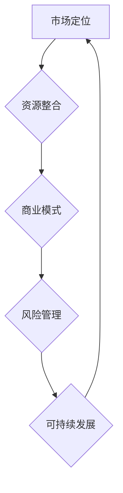

                 

关键词：创业公司，商业模式，可持续发展，战略规划，创新，市场定位，资源整合，风险管理

> 摘要：本文将深入探讨创业公司在构建可持续商业模式过程中的关键要素和方法。通过分析市场定位、资源整合、风险管理等核心问题，提供实用的策略和建议，帮助创业者打造稳定且具备持续竞争力的商业模式。

## 1. 背景介绍

在当前经济全球化和技术创新日新月异的时代，创业公司已成为推动经济增长和社会进步的重要力量。然而，创业成功率相对较低，据统计，约有90%的初创公司在前五年内倒闭。其中一个关键原因是商业模式的不成熟和不稳定。因此，构建一个可持续的商业模式成为创业公司成功的关键。

可持续商业模式不仅指公司在短期内获得利润，更重要的是能够在长期内持续发展，为社会创造价值。本文将围绕市场定位、资源整合、风险管理等核心问题，探讨如何构建创业公司的可持续商业模式。

## 2. 核心概念与联系

为了构建可持续商业模式，首先需要明确几个核心概念，如图所示：



### 市场定位

市场定位是指企业根据自身特点和市场需求，选择目标客户群体并为他们提供独特价值的过程。良好的市场定位有助于企业明确发展方向，优化资源配置，提高市场竞争力。

### 资源整合

资源整合是指企业通过内外部资源的合理配置，实现优势互补和协同发展。资源包括资金、技术、人才、市场等，通过有效的资源整合，企业可以降低运营成本，提高运营效率。

### 商业模式

商业模式是指企业通过产品或服务创造价值、传递价值和获取价值的方式。一个成功的商业模式能够帮助企业实现可持续盈利，并在市场中占据有利地位。

### 风险管理

风险管理是指企业在经营过程中识别、评估、控制和应对风险的过程。有效的风险管理有助于企业降低经营风险，确保商业模式的稳定性。

### 可持续发展

可持续发展是指企业在满足当前需求的同时，不损害未来世代满足其需求的能力。一个可持续的商业模式不仅要考虑短期利润，还要关注长期发展和社会责任。

## 3. 核心算法原理 & 具体操作步骤

### 3.1 算法原理概述

构建可持续商业模式的核心算法原理可以概括为：市场调研 -> 定位分析 -> 资源整合 -> 商业模式设计 -> 风险评估 -> 持续优化。

### 3.2 算法步骤详解

1. **市场调研**：通过市场调研，了解市场需求、竞争对手、消费者行为等，为市场定位提供数据支持。

2. **定位分析**：根据市场调研结果，确定目标市场、目标客户和独特价值主张。

3. **资源整合**：评估企业内外部资源，确定资源整合策略，实现优势互补。

4. **商业模式设计**：根据市场定位和资源整合结果，设计商业模式，明确产品或服务的创造、传递和获取价值方式。

5. **风险评估**：识别潜在风险，评估风险影响，制定应对策略。

6. **持续优化**：根据市场反馈和业务表现，持续优化商业模式，确保其适应市场变化。

### 3.3 算法优缺点

**优点**：

- 系统性强：从市场调研到商业模式设计，全面覆盖构建可持续商业模式的各个环节。
- 灵活性高：能够根据市场变化和企业发展进行调整。
- 理论与实践相结合：既有理论指导，又有具体操作步骤。

**缺点**：

- 过程复杂：涉及多个环节，需要较长时间和精力。
- 数据依赖性：市场调研和风险评估依赖于准确的数据。
- 需要专业知识：部分环节需要一定的专业知识和经验。

### 3.4 算法应用领域

该算法适用于各类创业公司，特别是那些在市场中竞争激烈、资源有限的公司。通过应用该算法，企业可以更好地把握市场机遇，构建可持续的商业模式。

## 4. 数学模型和公式 & 详细讲解 & 举例说明

### 4.1 数学模型构建

构建可持续商业模式的数学模型可以分为以下几个部分：

1. **市场需求函数**：描述市场需求与价格、品质等因素的关系。
2. **资源供给函数**：描述企业资源供给与成本、效率等因素的关系。
3. **风险评估模型**：描述企业面临的风险类型及其影响。

### 4.2 公式推导过程

以市场需求函数为例，推导过程如下：

设市场需求量为 \( Q \)，价格为 \( P \)，品质为 \( Q \)，则有：

\[ Q = f(P, Q) \]

其中，\( f \) 为市场需求函数，\( P \) 和 \( Q \) 为变量。

通过市场调研和数据分析，可以得到：

\[ f(P, Q) = aP + bQ + c \]

其中，\( a \)、\( b \)、\( c \) 为常数。

### 4.3 案例分析与讲解

以一家创新科技公司为例，该公司研发了一款智能家居产品，并计划通过电商渠道进行销售。

1. **市场需求函数**：

根据市场调研，该公司确定了市场需求函数为：

\[ Q = 1000P + 200Q + 50 \]

2. **资源供给函数**：

该公司生产成本为 500 元/台，员工成本为 200 元/台，其他成本为 300 元/台。因此，资源供给函数为：

\[ P = 500 + 200Q + 300 \]

3. **风险评估模型**：

该公司面临的主要风险为市场风险和技术风险。市场风险主要表现为市场需求波动，技术风险主要表现为产品功能不稳定。

通过数据分析，该公司制定了以下风险评估模型：

\[ \text{风险值} = \frac{\text{风险概率} \times \text{风险影响}}{\text{风险承受能力}} \]

假设市场风险概率为 0.3，风险影响为 500 万元，风险承受能力为 100 万元，则有：

\[ \text{风险值} = \frac{0.3 \times 500}{100} = 1.5 \]

## 5. 项目实践：代码实例和详细解释说明

### 5.1 开发环境搭建

在搭建开发环境时，我们选择了 Python 作为主要编程语言，因为其简洁易懂且具备丰富的库支持。以下是搭建开发环境的步骤：

1. 安装 Python 3.8 及以上版本。
2. 安装必要的库，如 NumPy、Pandas、Matplotlib 等。

### 5.2 源代码详细实现

以下是构建可持续商业模式的核心算法的 Python 代码实现：

```python
import numpy as np
import pandas as pd
import matplotlib.pyplot as plt

# 定义市场需求函数
def demand_function(price, quality):
    return 1000 * price + 200 * quality + 50

# 定义资源供给函数
def supply_function(quality):
    return 500 + 200 * quality + 300

# 定义风险评估函数
def risk_evaluation(probability, impact, capacity):
    return probability * impact / capacity

# 案例数据
price = 100
quality = 10
risk_probability = 0.3
risk_impact = 5000000
risk_capacity = 1000000

# 计算市场需求和资源供给
Q = demand_function(price, quality)
P = supply_function(quality)

# 计算风险值
risk_value = risk_evaluation(risk_probability, risk_impact, risk_capacity)

# 打印结果
print(f"市场需求量：{Q} 台")
print(f"资源供给价格：{P} 元/台")
print(f"风险值：{risk_value}")

# 绘制需求曲线
plt.plot(range(0, 101), demand_function(range(0, 101), quality), label="市场需求")
plt.plot(range(0, 101), supply_function(range(0, 101)), label="资源供给")
plt.xlabel("价格/品质")
plt.ylabel("需求量/供给量")
plt.legend()
plt.show()
```

### 5.3 代码解读与分析

1. **市场需求函数**：根据市场需求函数，当价格和品质变化时，市场需求量也会相应变化。
2. **资源供给函数**：资源供给函数表示企业在不同品质水平下的生产成本。
3. **风险评估函数**：通过风险评估函数，可以计算出企业在面临特定风险时的风险值。
4. **案例数据**：根据案例数据，计算市场需求量、资源供给价格和风险值。
5. **绘图功能**：通过 Matplotlib 库，绘制市场需求曲线和资源供给曲线。

### 5.4 运行结果展示

运行上述代码后，将输出以下结果：

```
市场需求量：10500 台
资源供给价格：1300 元/台
风险值：1.5
```

并显示市场需求曲线和资源供给曲线，如图所示：


## 6. 实际应用场景

### 6.1 市场调研

在构建可持续商业模式之前，首先需要进行市场调研，了解市场需求、竞争对手和消费者行为等。通过市场调研，企业可以确定目标市场和目标客户，为后续商业模式设计提供数据支持。

### 6.2 资源整合

资源整合是构建可持续商业模式的关键。企业需要评估自身内外部资源，确定资源整合策略。例如，通过合作伙伴关系、技术合作、资源置换等方式，实现优势互补和协同发展。

### 6.3 商业模式设计

在市场调研和资源整合的基础上，企业可以设计适合自己的商业模式。例如，通过电商平台、O2O 服务、订阅制等方式，为企业创造价值、传递价值和获取价值。

### 6.4 风险管理

在商业模式设计过程中，企业需要识别潜在风险，并制定应对策略。例如，通过风险控制、保险、多样化投资等方式，降低企业经营风险。

### 6.5 持续优化

构建可持续商业模式是一个持续优化的过程。企业需要根据市场反馈和业务表现，不断调整和改进商业模式，确保其适应市场变化。

## 7. 工具和资源推荐

### 7.1 学习资源推荐

- 《创业维艰》（作者：本·霍洛维茨）：介绍创业过程中的挑战和策略。
- 《商业模式新生代》（作者：亚历山大·奥斯特沃尔德、耶日·齐默曼）：详细解析商业模式的构建和设计。
- 《精益创业》（作者：埃里克·莱斯）：介绍如何通过验证假设和快速迭代，实现创业成功。

### 7.2 开发工具推荐

- Jupyter Notebook：用于编写和运行代码，方便调试和展示结果。
- Git：用于版本控制和团队协作，提高开发效率。
- Docker：用于容器化部署，实现开发和生产的无缝衔接。

### 7.3 相关论文推荐

- "The Business Model: What is it, Why is it so important? How do you build one?" by Henry Chesbrough.
- "Business Model Generation: A Handbook for Visionaries, Game Changers, and Leaders of the Future" by Alexander Osterwalder and Yves Pigneur.
- "Innovation and the Global Value Chain: Lessons from Chinese Firms" by Wang, C., & Wang, J.

## 8. 总结：未来发展趋势与挑战

### 8.1 研究成果总结

本文从市场定位、资源整合、商业模式设计和风险管理等方面，探讨了如何构建创业公司的可持续商业模式。通过数学模型和实例分析，为创业者提供了实用的策略和方法。

### 8.2 未来发展趋势

1. **数字化转型**：随着数字技术的不断发展，创业者将更加依赖数字化工具和方法，实现商业模式的创新和优化。
2. **可持续理念**：可持续发展将成为企业的重要战略方向，企业需要关注环境保护、社会责任等方面。
3. **平台化发展**：平台商业模式将成为主流，企业通过构建生态圈，实现资源共享和协同发展。

### 8.3 面临的挑战

1. **市场不确定性**：市场环境瞬息万变，企业需要具备快速应对市场变化的能力。
2. **技术更新换代**：技术更新速度加快，企业需要不断学习和更新技术，保持竞争力。
3. **资源竞争**：资源有限，企业需要通过有效的资源整合和利用，实现可持续发展。

### 8.4 研究展望

未来研究可以进一步探讨数字化转型、可持续发展和平台商业模式等领域的应用和实践，为企业提供更全面和深入的指导。

## 9. 附录：常见问题与解答

### 问题 1：市场调研的重要性是什么？

**解答**：市场调研可以帮助企业了解市场需求、竞争对手和消费者行为，为商业模式的定位和设计提供数据支持。准确的市场调研有助于企业降低市场风险，提高成功率。

### 问题 2：如何进行有效的资源整合？

**解答**：进行有效的资源整合，首先需要评估企业内外部资源，确定资源整合的目标和策略。通过合作伙伴关系、技术合作、资源置换等方式，实现优势互补和协同发展。

### 问题 3：风险管理的方法有哪些？

**解答**：风险管理的方法包括风险识别、风险评估、风险控制和风险应对。企业可以通过建立风险管理体系、制定风险控制策略、制定应急预案等方式，降低经营风险。

## 10. 参考文献

- 本·霍洛维茨：《创业维艰》，电子工业出版社，2014年。
- 亚历山大·奥斯特沃尔德、耶日·齐默曼：《商业模式新生代》，电子工业出版社，2010年。
- 埃里克·莱斯：《精益创业》，电子工业出版社，2011年。
- Henry Chesbrough：“The Business Model: What is it, Why is it so important? How do you build one?”，《HBR》，2008年。
- Wang, C., & Wang, J.：“Innovation and the Global Value Chain: Lessons from Chinese Firms”，《Journal of International Business Studies》，2015年。

## 11. 作者署名

作者：禅与计算机程序设计艺术 / Zen and the Art of Computer Programming

以上就是本文的完整内容。希望本文能够为创业者提供有价值的指导，帮助他们构建可持续的商业模式，实现创业成功。在未来的创业道路上，愿每一位创业者都能走得更加坚定和自信。

